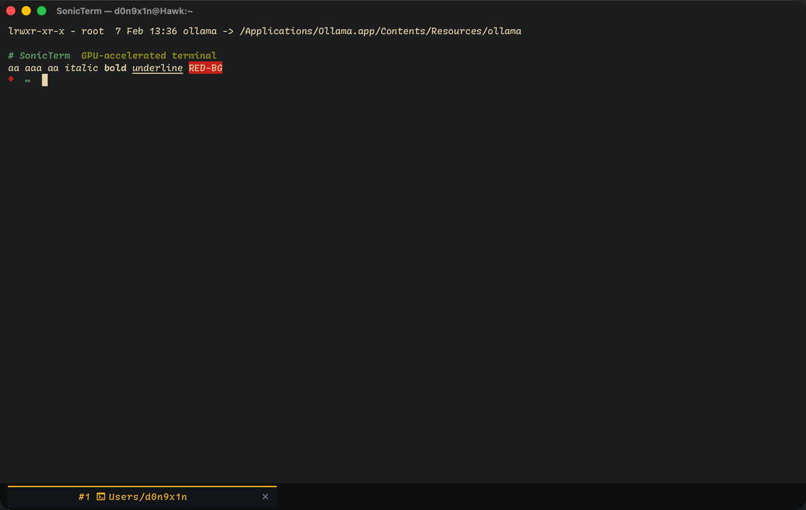
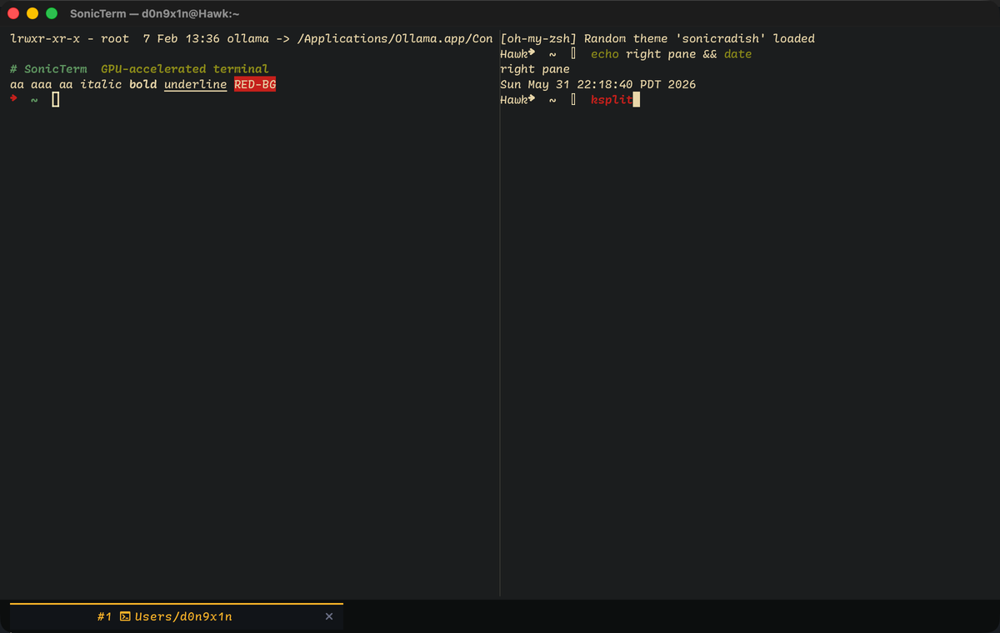

<div align="center">


# SonicTerm

**A GPU-accelerated cross-platform terminal that ships in MB, not GB.**

[](https://github.com/D0n9X1n/sonic/actions/workflows/ci.yml)
[](LICENSE)
[](docs/ROADMAP.md)
[](docs/USER_GUIDE.md)

</div>

---

## Why SonicTerm

- **GPU-accelerated rendering** via `wgpu` — Metal on macOS, DirectX 12 on
  Windows. Glyphs are rasterized once and uploaded into an atlas; redraws
  are quad batches, not CPU blits.
- **Truly native binaries** on macOS and Windows. No Electron, no JVM, no
  bundled Python. The macOS `.dmg` is ~22 MB; idle RSS sits below 30 MB.
- **WezTerm-compatible default keymap.** If your fingers already know
  `Cmd+T`, `Cmd+D`, `Cmd+K`, `Cmd+F`, `Cmd+[` — they'll work here on day
  one. Zero relearn.
- **Batteries-included UX** out of the box: tabs, split panes, scrollback,
  incremental search, command palette, copy mode, IME, OSC 8 hyperlinks,
  OSC 133 command boundaries, drag-out tabs, broadcast input.
- **Correct first, fast second.** Every rendering / VT / grid change is
  gated on a Unicode-aware end-to-end suite (CJK, emoji, Powerline PUA,
  fullwidth, box-drawing) plus a dHash visual-regression baseline.
- **MIT licensed.** Read the source, fork it, ship it.

## Install

> Pre-built `.dmg` and `.msi` artifacts are produced by the release
> workflow on every `v*` tag. All shipped artifacts are currently
> **unsigned** (signing arrives once cert procurement lands).

**macOS** (Apple Silicon + Intel universal):

```sh
# Once v1.0 lands:
brew install --cask sonicterm        # planned, not yet published

# Today:
# Download SonicTerm-<version>-universal.dmg from
# https://github.com/D0n9X1n/sonic/releases
```

**Windows** (x64):

```powershell
# Once v1.0 lands:
winget install SonicTerm.SonicTerm   # planned, not yet published

# Today:
# Download SonicTerm-<version>-x64.msi from
# https://github.com/D0n9X1n/sonic/releases
```

**From source** (requires Rust stable):

```sh
git clone https://github.com/D0n9X1n/sonic.git
cd sonic

# macOS
cargo build --release -p sonicterm-mac
open target/release/sonicterm-mac

# Windows
cargo build --release -p sonicterm-windows
./target/release/sonicterm-windows.exe
```

## Quick start

A handful of keystrokes that show off the surface area:

| Keystroke           | What it does                                  |
|---------------------|-----------------------------------------------|
| `Cmd+T` / `Ctrl+T`  | New tab                                       |
| `Cmd+D` / `Ctrl+D`  | Split pane (vertical)                         |
| `Cmd+Shift+D`       | Split pane (horizontal)                       |
| `Cmd+K` / `Ctrl+K`  | Command palette (everything is searchable)    |
| `Cmd+F` / `Ctrl+F`  | Incremental search through scrollback         |
| `Cmd+[` / `Ctrl+[`  | Enter copy mode (vi-like navigation)          |
| `Cmd+W` / `Ctrl+W`  | Close pane (or tab if it's the last pane)     |
| `Cmd+,` / `Ctrl+,`  | Open `sonicterm.toml` in your editor          |

Drag a tab out of the tab bar to tear it into its own window. Drop it
back to re-attach.

## Compared to

Honest snapshot of where SonicTerm sits today. We are still racing on
the perf axis (see [docs/ROADMAP.md](docs/ROADMAP.md) for the current
gap vs WezTerm on `vtebench`).

| Feature                | SonicTerm        | WezTerm         | iTerm2          | Alacritty       |
|------------------------|------------------|-----------------|-----------------|-----------------|
| GPU rendering          | Yes (wgpu)       | Yes (wgpu)      | Metal           | Yes (OpenGL)    |
| Tabs                   | Yes              | Yes             | Yes             | No              |
| Split panes            | Yes              | Yes             | Yes             | No              |
| Scrollback search      | Yes              | Yes             | Yes             | No              |
| Command palette        | Yes              | No              | No              | No              |
| Tear-out tabs          | Yes              | No              | Yes             | No              |
| SSH multiplexing       | Post-v1.0        | Yes             | No              | No              |
| Cross-platform         | macOS + Windows  | mac/win/linux   | macOS only      | mac/win/linux   |
| Binary size (mac)      | ~22 MB           | ~80 MB          | ~70 MB          | ~12 MB          |
| Idle RSS               | < 30 MB          | ~80 MB          | ~120 MB         | ~30 MB          |
| Config language        | TOML             | Lua             | GUI / plist     | YAML            |

If you live in Lua and want every escape hatch in the book, WezTerm is
the right answer. If you want a native, batteries-included terminal
that boots fast, sits quiet, and stays out of your way — try
SonicTerm.

## Configure

User config lives at:

- macOS: `~/Library/Application Support/SonicTerm/sonicterm.toml`
- Windows: `%APPDATA%\SonicTerm\sonicterm.toml`

A minimal example:

```toml
[font]
family = "St Helens"
size   = 14

[theme]
name = "tokyo-night"

[window]
opacity = 0.97
```

The full reference — every option, every theme, every keybinding — is
in [docs/USER_GUIDE.md](docs/USER_GUIDE.md). Edits hot-reload; you'll
see the change on the next keystroke.

## Project status

**v1.0 in progress.** macOS + Windows are the supported targets and
both produce nightly builds via the release workflow. Linux, code
signing, auto-update, and session restore are explicitly deferred
past v1.0 — see [docs/ROADMAP.md](docs/ROADMAP.md) for the full
post-v1.0 plan.

Performance honesty: we are not yet at WezTerm parity on the worst
`vtebench` cases. The gap is closing PR by PR; see §14 of
[CLAUDE.md](CLAUDE.md) and `baseline.json` at the repo root for the
current numbers.

## Screenshots





> Screenshots regenerated on every release via the visual harness
> (`just visual mac`). If the images above are missing, the release
> upload step ran without them — please file an issue.

## Contributing

Start with [CLAUDE.md](CLAUDE.md) — it's the dense, opinionated
onboarding doc that any contributor (human or agent) should read
before editing anything. The crate-by-crate dependency graph and the
"why is it factored this way" rationale live in
[docs/ARCHITECTURE.md](docs/ARCHITECTURE.md).

Bug reports should include the last 200 lines of the most recent log
file (see [docs/LOGGING.md](docs/LOGGING.md) for paths) and, for
rendering / VT bugs, a screenshot.

## License

SonicTerm is released under the [MIT License](LICENSE).
