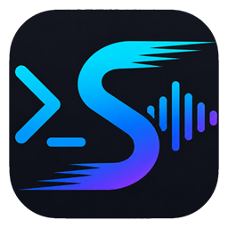

<div align="center">



# Sonic Terminal

**Sonic is what you'd build if you started a terminal in 2026: GPU-native,
fast at idle, correct on every script, and you can drag tabs between
windows.**

[](https://github.com/D0n9X1n/sonic/actions/workflows/ci.yml)
[](LICENSE)
[](docs/ROADMAP.md)
[](docs/USER_GUIDE.md)

</div>

---

## Why Sonic?

There are good terminals. There are even good *GPU* terminals. What there
isn't, yet, is a GPU terminal that:

- draws **0% CPU** when nothing is happening,
- renders CJK + color emoji + programming ligatures **correctly out of the
  box**,
- lets you **tear a tab into its own window** with a drag,
- carries a **built-in multiplexer** so a closed window doesn't kill your
  shell, and
- ships a **localized UI** (English / 简体中文 / 日本語) the first time you
  launch it.

Sonic does all of that on macOS and Windows.

### How it compares

| Capability | Sonic | WezTerm | Alacritty | Kitty | iTerm2 |
|---|:---:|:---:|:---:|:---:|:---:|
| GPU rendering (wgpu/OpenGL) | ✅ | ✅ | ✅ | ✅ | ⚠️ Metal only |
| Idle CPU when nothing happens | **0%** | ~1% | ~1% | ~1% | varies |
| Color emoji | ✅ | ✅ | ❌ | ✅ | ✅ |
| Programming ligatures | ✅ | ✅ | ❌ | ✅ | ✅ |
| End-to-end CJK IME (Pinyin / 日本語 / 한글) | ✅ | ⚠️ | ⚠️ | ⚠️ | ✅ |
| Multiplexer built in | ✅ (`sonicterm-mux`) | ✅ | ❌ | ❌ | ❌ |
| SSH client built in | ✅ (optional) | ✅ (`wezterm ssh`) | ❌ | ⚠️ (`kitten ssh`) | ❌ |
| Tab tear-out → new window | ✅ in-process | ⚠️ via CLI | ❌ | ❌ | ✅ |
| Cross-window tab merge | ✅ | ⚠️ via CLI | ❌ | ❌ | ✅ |
| **Cross-process** tab drag (macOS) | ✅ | ❌ | ❌ | ❌ | ❌ |
| Live config reload | ✅ | ✅ | ❌ | ✅ | ❌ |
| Localized UI (en / zh-CN / ja) | ✅ | ❌ | ❌ | ❌ | ⚠️ macOS only |
| Cross-platform | mac + win¹ | mac + win + linux | mac + linux | all | mac only |

¹ Linux support is deliberately deferred to v1.0 — see
[`docs/ROADMAP.md`](docs/ROADMAP.md). We'd rather ship two great
platforms than three mediocre ones.

### Built for people who…

- speak CJK as a first language and are tired of broken IME, mis-measured
  wide chars, and the wrong fallback font;
- want a clean default that **works without configuration** — the
  bundled keymap is WezTerm-compatible, the brand-default font is
  **St Helens** (not bundled — install system-wide; if missing, the
  renderer falls through to system mono and `Rec Mono Casual` ships
  under `assets/fonts/` as a guaranteed-present fallback). Override via
  `[font] family = "..."` in `sonicterm.toml`. The
  default theme is the WezTerm-style `wezterm` palette
  (out-of-box visual parity with WezTerm);
- hate when their idle terminal eats 5% of a CPU core just to blink a
  cursor;
- need both a **GPU terminal** and a **multiplexer** without running two
  separate processes glued together with config files.

### A short feature tour

- **Search** the visible grid + full scrollback (substring or regex,
  case toggle, `N/M` indicator).
- **Shell integration** via OSC 133 — jump prompt-to-prompt with
  `super+shift+↑/↓`, with a gutter caret beside each prompt.
- **Cmd+click hyperlinks** (OSC 8), with a strict allow-list so a hostile
  pty can't run arbitrary commands.
- **Command palette** (`super+shift+P`) — fuzzy filter over every
  bindable action, in your language.
- **5 bundled themes**: Tokyo Night, Dracula, Nord, Catppuccin Mocha,
  Gruvbox Dark Hard.
- **Editable config files** from the command palette: `Edit sonicterm.toml`
  and `Edit keymap.toml`; changes persist and live-apply.

Full feature reference and every keybinding: **[`docs/USER_GUIDE.md`](docs/USER_GUIDE.md)**.

### What Sonic doesn't have (yet)

Being honest about the gaps so you can pick the right tool:

- **No Linux build.** Deferred to v1.0 — see
  [`docs/ROADMAP.md`](docs/ROADMAP.md). WezTerm, Alacritty, and Kitty
  all run on Linux today; Sonic does not.
- **No code signing.** macOS `.dmg` and Windows `.msi` are unsigned —
  signing certs aren't configured yet. You'll see Gatekeeper /
  SmartScreen warnings on first launch.
- **No auto-update.** Grab new releases manually from the Releases page.
- **No remote multiplexer / network protocol.** `sonicterm-mux` is in-process
  only — there's no `wezterm connect`-style remote attach yet.
- **Younger and less battle-tested** than WezTerm, Alacritty, Kitty, or
  iTerm2. Expect rough edges; please file issues.

---

## Install

### Release binaries

Each tagged release publishes a universal macOS `.dmg` and an x64 Windows
`.msi`. Grab the latest from
[**Releases**](https://github.com/D0n9X1n/sonic/releases).

> Builds are **not code-signed yet** (see roadmap). On macOS you may need
> `xattr -dr com.apple.quarantine /Applications/SonicTerm.app` the first
> time; on Windows, Defender SmartScreen may want a "More info → Run
> anyway."

### From source

You'll need a stable Rust toolchain (see `rust-toolchain.toml`).

```bash
git clone https://github.com/D0n9X1n/sonic
cd sonic

# macOS
cargo run --release -p sonicterm-mac

# Windows
cargo run --release -p sonicterm-windows
```

Add `--features ssh` to either platform crate to enable the built-in SSH
client.

---

## Documentation

- 📖 **[`docs/USER_GUIDE.md`](docs/USER_GUIDE.md)** — every visible
  feature, with keybindings.
- 🗺️ **[`docs/ROADMAP.md`](docs/ROADMAP.md)** — what's shipped, what's
  next, what's deferred.
- 🏗 **[`docs/ARCHITECTURE.md`](docs/ARCHITECTURE.md)** — the 10-crate
  dependency graph and where to put new modules.
- 🐚 **[`docs/shell-integration.md`](docs/shell-integration.md)** —
  one-line snippets to enable OSC 133 prompt marks in bash / zsh / fish /
  PowerShell.
- 🔏 **[`docs/release/signing.md`](docs/release/signing.md)** — how the
  release pipeline handles codesign / notarize / signtool (gated on
  secrets).

---

## Contributing

Sonic is built with an agent-driven PR pipeline (see `CLAUDE.md`). The
local gate before any commit is:

```bash
cargo fmt --all -- --check
cargo clippy --workspace --all-targets -- -D warnings
cargo test --workspace
cargo run --example pty_dump -p sonicterm-core --release   # must print [e2e] OK
cargo build --release -p sonicterm-mac
```

Test count is monotonic — no PR may reduce the workspace test total.

---

## License

MIT. See [LICENSE](LICENSE).
