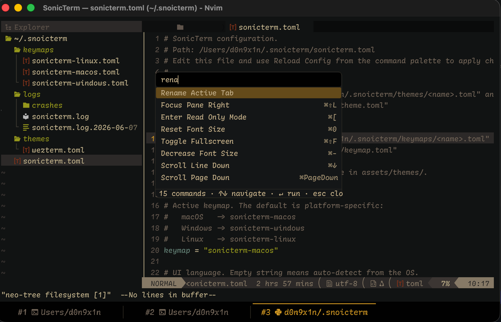
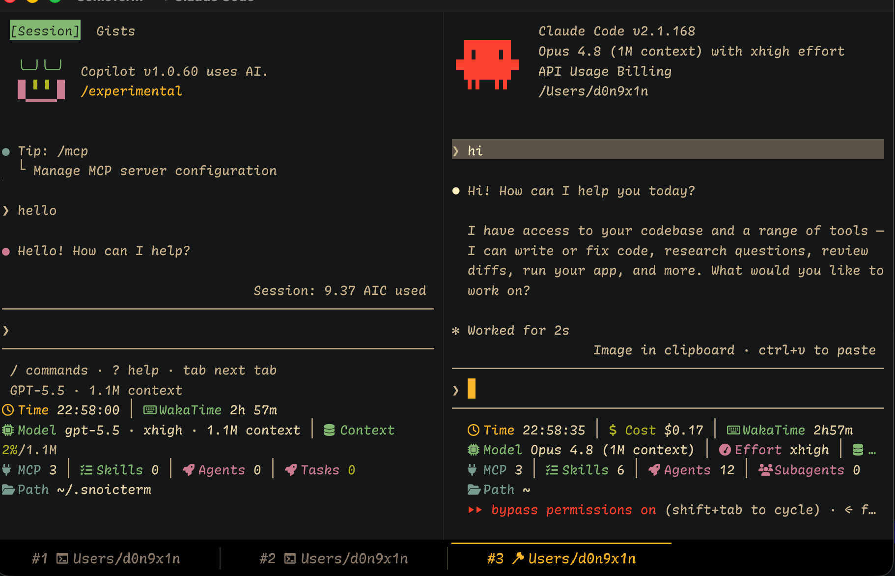

# SonicTerm

**A fast, native, GPU-accelerated terminal for people who live in the shell.**

SonicTerm is a native macOS + Windows terminal with the quality-of-life features
you expect from a modern editor: searchable commands, split panes, draggable
tabs, editable TOML config, bundled Nerd-Font-patched typography, and a renderer
that is designed around GPU quads instead of CPU blits.

It aims to feel small, sharp, and quiet: no Electron shell, no heavyweight
runtime, no required GUI preferences pane, and no global dotfile sprawl. User
state lives under one directory: `~/.snoicterm`.

Need installation, configuration, keybindings, or theme authoring docs? Read the
full bilingual docs in [`wiki/`](wiki/). The README is only the product overview:
why SonicTerm exists, what it feels like, and why you might want to use it.

## Screenshots

### Command palette + editable config

The command palette is the center of the UI: search commands, see the active
keymap shortcut, open config/keymaps, rename tabs, split panes, toggle chrome,
and reload settings without leaving the terminal.

### Split panes built for AI CLIs and real terminal apps

SonicTerm supports multiple panes, per-pane PTYs, tab titles, Nerd Font icons,
Powerline glyphs, emoji, CJK, and terminal apps that draw their own UI.

### Drag tabs between windows

<video src="assets/screenshots/tab-drag-demo.mp4" controls muted playsinline width="100%"></video>

If your Markdown renderer does not show video inline, open
[`assets/screenshots/tab-drag-demo.mp4`](assets/screenshots/tab-drag-demo.mp4).

## Why try it?

- **Native macOS + Windows app** — small binaries, no Electron, no web runtime.
- **GPU renderer** — wgpu on Metal / D3D12, with atlas-backed text and batched
  quads for cells, chrome, selection, cursor, search, and overlays.
- **Real pane workflow** — split panes, close/resize behavior, per-pane PTYs,
  pane focus, copy/read-only mode, quick-select URL hints, and search.
- **Command palette first** — commands are searchable and display shortcuts from
  your current keymap config.
- **Config is just files** — `~/.snoicterm/sonicterm.toml`, plus editable
  `themes/` and `keymaps/` examples seeded on first launch.
- **Bundled typography** — `Rec Mono St.Helens` ships with the app and is
  Nerd-Font-patched, so icons and prompt glyphs work out of the box.
- **WezTerm-inspired behavior** — terminal, font, keymap, and rendering details
  follow WezTerm-proven semantics where SonicTerm has absorbed them.

## Documentation lives in the wiki

The README intentionally avoids operational details. If you want to install it,
change preferences, edit keybindings, author a theme, inspect logs, or build from
source, use the bilingual wiki:

| Topic | Wiki page |
| --- | --- |
| Usage and installation | [`wiki/Usage.md`](wiki/Usage.md) |
| Preferences and `sonicterm.toml` | [`wiki/Configuration.md`](wiki/Configuration.md) |
| Keymap editing | [`wiki/Keybindings.md`](wiki/Keybindings.md) |
| Theme authoring | [`wiki/Themes.md`](wiki/Themes.md) |
| Logs and diagnostics | [`wiki/Logging.md`](wiki/Logging.md) |

## Thanks, WezTerm

SonicTerm owes a lot to [WezTerm](https://github.com/wezterm/wezterm). WezTerm
is the reference for terminal semantics, font behavior, keymap conventions, and
many rendering edge cases. SonicTerm has absorbed WezTerm-proven ideas into
Sonic-owned crates:

- VT/grid behavior in `sonicterm-vt` and `sonicterm-grid`.
- Font fallback, shaping, and rasterization in `sonicterm-font`.
- Box drawing, block glyph, Powerline, Braille, sextant, and octant geometry in
  `sonicterm-block-glyph`.

WezTerm is MIT-licensed; the upstream license for absorbed custom-glyph code is
kept at `crates/sonicterm-block-glyph/LICENSE-WEZTERM`.

## License

SonicTerm is released under the [MIT License](LICENSE).
