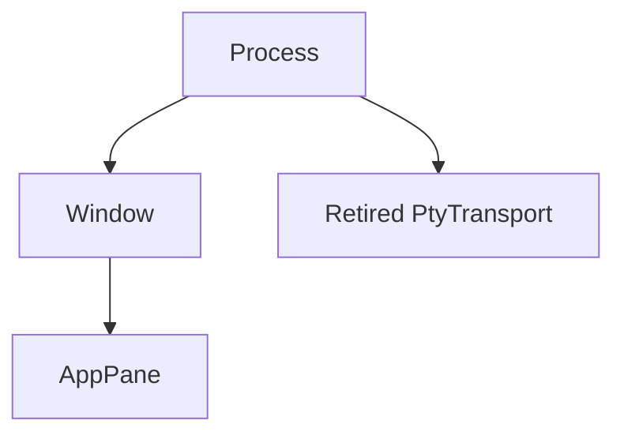
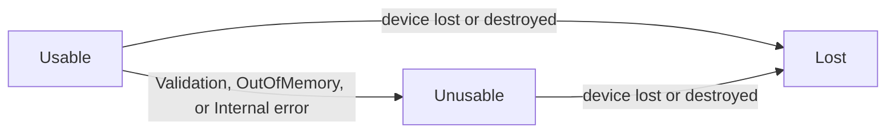

# Architecture Internals

[简体中文](Architecture-Internals-zh-CN)

These are the rules that tests must protect: accurate memory reports, complete
frames, safe native lifetimes, and verified release assets. Read
[Architecture](Architecture) first; resource limits are in [Memory](Memory).

### Heap-truth accounting

Integration tests compare retention reports with live heap using a counting
`#[global_allocator]` for allocation, deallocation, and reallocation. They check:

- the reported value does not materially understate live heap;
- the reported value does not materially overstate live heap;
- live heap itself stops within the enforced cap and stated tolerance.

These tests must stay in `tests/`. A `#[global_allocator]` applies to the whole
crate, so a sibling unit-test module cannot isolate it.

The allocator is process-global. Every test in one measurement binary holds a
file-local `Mutex` for its full measurement lifetime. The test builds fixture
strings and buffers before opening the measurement window. Otherwise sibling
work or test-harness allocations become part of the subject's result.

The heap-truth checks cover the grid, hyperlink registry, PTY queues, VT capture
staging, inline media, owner close, and long-lived atlas. Important enforced
limits include:

| Seam | Current limit |
| --- | --- |
| Grid storage | `MAX_GRID_CELLS = 1,048,576`; visible geometry is capped by `MAX_VISIBLE_GRID_CELLS = 524,288` |
| Hyperlink registry | `MAX_HYPERLINKS = 16,384`, `MAX_HYPERLINK_URI_BYTES = 8 KiB`, `MAX_HYPERLINK_CLIENT_ID_BYTES = 1 KiB`, `MAX_HYPERLINK_METADATA_BYTES = 8 MiB` |
| VT media payload | `MAX_MEDIA_PAYLOAD_BYTES = 16 MiB` |
| Process VT capture staging | `MAX_PROCESS_CAPTURE_STAGING_BYTES = 64 MiB`, with a `MIN_CAPTURE_STAGING_BYTES = 4 MiB` floor and `GUARANTEED_CONCURRENT_CAPTURES = 13` |
| PTY input | 4 queued messages; each message is at most 16 MiB |
| PTY output | 64 queued chunks plus one blocked sender chunk; each retained reader ring is 64 KiB; structural worst case is 65 rings, or 4.0625 MiB |
| Retained inline media | 128 images and 64 MiB per pane; 256 MiB process target plus at most one 4 MiB newest-image residual per live pane before reclamation converges; each rendered side is at most 1,024 pixels |

Capture staging and inline media each count against one pool. Production uses
`CaptureStagingPool::process_default()` and `InlineMediaPool::process_default()`,
so those limits hold per process. The capture-staging heap-truth test measures
the default staging pool against the real heap. The inline-media heap-truth
test checks the retained-media figure that pane charges are set from, not the
media pool's totals. Unit tests that need a capture admitted, or that measure
admission or budgets, inject private pools.

A grid report includes cell storage, rare attributes, combining text, row
containers, and reserved capacity. Scrollback is limited by configured rows and
retained bytes. The scroll path checks the byte budget in amortized batches.

The hyperlink registry counts its URI strings and both hash tables. `clear`
shrinks those tables. The registry may reclaim unreferenced entries when full;
it does not sweep the grid for every OSC 8 link.

The PTY output report counts ring allocations pinned by queued `Bytes` views.
It does not multiply the slot count by an assumed chunk size, and it does not
mistake payload length for retained allocation.

### Resource ledger invariants

The GUI creates this live owner tree:



Process and window owners use tracking-only limits. Each `AppPane` owner uses
`PANE_COMMITTED_BUDGET_BYTES`. That value is twice
`PANE_SEAM_CAP_SUM_BYTES`, which is calculated from the grid, inline-media,
hyperlink, parser-capture, PTY-output, and PTY-input seam caps.

The seam caps remain the primary enforcement points. The pane budget is a
backstop. Retention is measured before it is charged, so a failed charge does
not undo memory already retained. A failed growth keeps the previous charge. A
failed new charge leaves that class absent and writes a `memory` debug record.

A pane owns one `CommittedReservation` per charged `ResourceClass`. Retention
uses `try_resize` in place, including samples where bytes grow while items shrink
or vice versa. Final admission is `current total - old charge + new charge`, not
a component-wise maximum or release/re-reserve cycle. Any growing axis requires
open ancestors; reductions can settle while closing. State locks precede class
locks and ascending owner-usage locks; process-byte growth uses the existing CAS
as the final fallible step. Refusal leaves the token and all balances unchanged.
Snapshots remain observational rather than one linearizable global reading.

One-pane reconciliation uses `CommittedReservation::transfer_batch`; tab
attachment uses `transfer_many` for every moved pane's charges and individual
target owner in one same-ledger transaction. Both preserve classes and validate
source balances, target states, and final owner limits before changing any
shard. Immutable parent ids precede children, so both follow the same ordered
state/class/owner locks. Success changes owner-path balances and token owner ids
without changing process or per-class totals. Refusal preserves all source
tokens; provisional empty owners drop before source custody is restored.

Close order is load-bearing:

1. move each PTY and its reservation into `App::retire_pane`'s unique process-root
   `PtyTransport`, charged as one `ReaperWork` item;
2. clear pane charges;
3. close each `AppPane` owner;
4. close the parent `Window` owner.

`PaneState` declares `charges` before `owner`. `WindowState` declares `panes`
before its window `owner`. Rust drops fields in declaration order, so the normal
drop path follows the same leaf-first rule. `finish_close` refuses an owner with
live charges or children. `OwnerGuard::drop` logs a warning and retains a refused
record; it does not retry.

A failed window-owner registration leaves the window usable but omits that
window and its panes from hierarchy accounting for the rest of the window's
life. A failed pane-owner registration leaves the pane usable; periodic
reconciliation can retry it. Renderer-owned surfaces, glyph atlases, row glyph
and quad caches, and software frames are measured outside this ledger. The row
cache classes are explicit `UnchargedRetention`: reports carry exact current
allocation while the coverage table records conservative per-renderer high-water
envelopes. No report invents GPU memory or presents an uncharged class as a
governor reservation.

`ReapShutdownHandle` separates shutdown control from `ReaperSupervisor::run_until`.
Closing admission wakes reservers and can only shorten the shared drain deadline;
it does not set cancellation or run tasks on the control thread. A running loop
uses the earlier shared deadline at cutoffs and clock waits. While deferred work
exists, clock waits are bounded by `HELPER_POLL_INTERVAL` so a deadline published
after a wait begins is observed without waking the deferred task early. An empty
loop returns without polling. A timed-out helper remains counted and its task
stays retained; a shutdown request does not itself prove settlement.

Whole-unit reaper reservation changes task and native-handle counts under one
counter lock, or changes neither. Each handle permit has its own lifetime after
reservation. Helper grants are admitted all-or-none before starting the outer
call, installed without the counter lock, and retained by the task and worker
clones across retries. A worker slot cannot be occupied twice. The last grant
clone returns the whole helper count; settlement does not separately return it.
`max_helpers` and `live_helpers` describe reserved helper capacity, not running
threads. A retained whole grant keeps that capacity occupied until its last clone
drops, including between retries or when no worker is running. A failed spawn may
drop its closure, so native recovery state must stay owned outside that closure.
The default `PerCall` task contract is unchanged.

Opted-in completed retained tasks are collected at the top of every run-loop
iteration, before pending work retries admission. Collection requires whole-task
completion and finished worker handles; joins and destruction happen after the
retained lock is released, and a guard returns the task permit even on unwind.
Opting into collection requires one unique transport owner per unit; collection
retracts that owner's unresolved record. Shared-owner tasks keep the default
non-collectable behavior. Closed admission and late failure keep terminal custody
reported until explicit release.

At a normal cutoff, an opted-in unstarted task retains its task permit and any
already-created blocking call in a separate carry-over queue. The expired run
cannot consume it again. The next run moves carry-over to the queue front.
After every wake, timer recheck and run return, the caller collects retained
completions, checks control, then calls `has_startable_work`, including while
carry-over is blocked. The query answers admission readiness only; it does not
itself release collectable grants. It uses the same whole-grant capacity test as
worker admission, releasing the queue lock before taking counters. Closed
admission disables normal readiness; shutdown drains carried work without
requeueing it.

`UnresolvedSink` owns type-erased payloads under a separate lock. Admission and
live-task snapshots read its atomic entry count without nesting that lock under
supervisor counters or retained custody. Terminal task release may transfer its
payload into the sink before returning its task permit, so unresolved custody
continues to prevent fresh admission. Reports include sink owners, entry counts,
and open slotless cancellation duplicates; any of these keeps shutdown unclean.
Supervisor terminal disposal forgets unresolved payloads, retaining their owner,
charge and native permits until process exit rather than invoking unsafe native
cleanup. A duplicate token is released only after its native wrapper closes the
duplicate. The GUI ledger permits only `Process → PtyTransport` for this retired
transport role; window, pane and local-PTY parents remain invalid.

### Rendering correctness invariants

SonicTerm retains rendered pixels between frames. Damage therefore decides
correctness, not only speed.

- A primary-screen pane contributes the union of its dirty-row strips. The strips
  include pane padding and are clipped to the pane and surface.
- A dirty alternate-screen pane contributes its complete surface-clipped pane.
  A clean alternate-screen pane contributes no damage.
- Full-surface replacement clears the retained attachment once; partial damage
  uses a non-blending background reset under its scissor. Reset and content share
  one buffer upload and separate draw ranges, preserving content source-over and
  LCD blending while erasing prior ink without alpha accumulation.
- Projected background-cache validity includes the viewport row slot. Each
  `(pane id, absolute row)` owns one projection, replaced when its hash changes;
  dirty invalidation remains absolute and pane-local with the same capacity cap.
- Inline-image visibility intersects the original destination, pane content, and
  surface for both atlas residency and emission. Visible UVs preserve the source
  transform; separate original tile bounds clamp GPU and CPU bilinear taps. Images
  retain fractional pixel coordinates without changing text glyph alignment.
- Changes to terminal cells mark affected rows in the same frame. This includes
  scrolling, reverse index, line insertion/deletion, erase, resize, and
  wide-cell repair.
- Nonempty primary-history erasure advances the revision and exact eviction
  counter and marks all visible rows presentation-dirty, without changing their
  content stamps. Empty history and alternate-screen ED3 change neither screen.
  Every history-prefix removal drops prompts whose starts were removed and
  rebases surviving coordinates; saved-primary prompts stay with their rows.
- Cursor-position replies clamp the insertion sentinel to a physical column
  without consuming delayed wrap. Hard LF/VT/FF/IND/NEL advancement scrolls only
  at the effective bottom margin and otherwise clamps to physical bounds. Fill
  and carriage-return policies remain explicit per control.
- Each `Line` packs an incoming automatic-wrap bit into its existing content
  sequence word. Only an actual margin wrap sets it. Hard line advances,
  full-row erases, recycled rows, non-reflow resize, and uncertain region
  surgery clear affected boundaries. The bit travels into scrollback and enters
  row equality/hash identity, so an evicted predecessor remains detectable
  without increasing the row header.
- Recorded-wrap URI and local-target reconstruction joins at most eight visible
  rows and 4 KiB across those boundaries. URI resolution precedes
  local-target configuration gating and uses the complete candidate for preview,
  every highlight fragment, and a fresh activation-time lookup. No incomplete
  chain falls back to a row-local URI prefix. OSC 8 remains authoritative;
  file URIs retain filesystem authorization. The local-target authorization key binds every row
  fingerprint and wrap bit, ordered absolute spans, pointed cell, viewport,
  screen epoch, scrollback-eviction generation, and exact-pane OSC 7 state.
  Hard newlines, incomplete chains, unsafe cells, and any identity change fail
  closed before activation-time native revalidation.
- Balanced quoted paths retain delimiter cells in safety checks while excluding
  them from the active span. Grouped source locations yield exactly one candidate
  for the pointed member, with the entire anchor/group in the validated span;
  comma/space separators do not initiate activation. No shell expansion occurs.
  Scanner results carry separate display and source byte ranges. A scalar-to-cell
  map assigns one wide character to its lead/continuation pair without duplicate
  byte offsets. Valid wide filename and boundary scalars keep both cells under
  combining/hyperlink/pair-integrity checks. List-member and leading explicit-path
  prose alternatives carry missing-literal dependencies through candidate caps, path
  resolution, authorization, and native activation; a dropped or unresolvable literal
  cannot authorize a shorter fragment.
- HTTP(S) extraction also recognizes explicit `()`/`[]` wrappers across at most
  eight visible hard rows and 4 KiB. The first fragment must contain the complete
  authority and a path slash; non-final fragments reach the margin and subsequent
  rows share at most eight ASCII spaces of indentation. A matching closer and
  exact whole-URI scanner match are required. This tri-state scan precedes logical
  URI fallback: incomplete owned fragments are inert, unrelated text is untouched,
  and complete destinations use the same preview, span, and fresh activation lookup.
  Unsafe cells, internal whitespace/wrappers, multiple schemes, and mixed wrap kinds
  cannot authorize a join. OSC 8 stays first; filesystem targets never use this path.
- Changes to overlays or window chrome promote damage to the full surface.
  One hovered target carries up to eight ordered viewport fragments in the
  frame key. Hover-only changes on the accelerated path damage the old and new
  pane rows, including glyph ink padding, rather than the whole window. Preview
  and other chrome changes retain full-surface damage. Active recoloring salts
  only each intersecting row cache key; underline geometry emits one clipped
  quad per fragment. A busy event-time lookup preserves the existing hint but
  drops modifier-only feedback when the modifier is released, and requests a
  source-window redraw. Main and child frames resolve hover from their held parser
  snapshots before presentation.
  Each window retains at most one current-epoch filesystem-probe completion and
  requests a frame to validate it against a fresh target, rather than discarding
  it during parser contention. Clicks always require a fresh lookup, never
  authorization from retained visuals or an unvalidated completion.
  One probe worker serves windows in first-queued order. Each live window keeps
  at most one waiting probe, which only that window's newer target replaces in
  place, so waiting work is bounded by one probe per live window plus the one
  executing. Closing a window drops its waiting probe; a late result for a
  closed window or a stale epoch is discarded.
  Effective per-pane scrollbar opacity is window chrome: its quantized
  pane identity participates in the frame key, and a bucket change damages the full
  surface.
- A degraded wgpu frame with work repaints the full surface. Windows degraded
  presentation also composes a full CPU surface. Degraded scrollbars snap and
  arm one idle-hide deadline; accelerated scrollbars request bounded fade frames.
- `FramePlan` reports `RenderMode::Noop` for an unchanged key on either presenter,
  or a changed degraded key with no visible work. It does not rebuild or clear
  dirty rows; an unchanged Windows CPU frame may still be reblitted while its
  device accepts work.
- Windows software glyph presentation stabilizes NDC roundoff at integer and
  half-pixel origins before one-to-one raster placement. The row glyph cache also
  keys the viewport row slot because cached instances carry screen coordinates.
- Every authored quad color is finite premultiplied linear RGBA. Opacity and
  coverage changes scale RGB and alpha together; debug builds validate both quad
  layers immediately before the GPU/software presenter split. Windows software
  quads decode retained sRGB destination channels, blend the same source in
  linear light, encode RGB once, and source-over alpha as linear UNORM.
- Windows LCD text is eligible only for an opaque configured backdrop, effective
  opacity `1`, and either the CPU/GDI presenter or a wgpu device with
  `DUAL_SOURCE_BLENDING`. The effective `off`/`rgb`/`bgr` mode enters the frame
  key. GPU and CPU presenters apply the foreground transform before coverage,
  attenuate destination RGB independently in linear light, and use maximum
  channel weight for alpha. Images and color glyphs have higher branch priority.
- A display-scale transition commits one physical inner size through winit's
  event-scoped writer. On macOS, the observed native size already uses AppKit's
  current backing scale; convert from that scale, not the stored previous event
  scale. Other platforms retain the stored-scale input contract. The target
  preserves logical geometry and the 30×10 terminal minimum; Windows additionally
  caps it to the destination monitor work area. Renderer surface, pane grids/PTYs,
  IME geometry, and redraw follow the same target before the native size commit.

The event-loop thread collects a complete visible frame without waiting on the VT
worker. `VisibleFrameSources` validates unique live tree leaves, active-pane identity,
and zoom agreement before owning handles for only the visible layout. Its source
vector is declared before the separately borrowed parser-guard vector. Both roles use
parsers → visible images; this changes main's former images-first order and retains
child's parser-first order. Each image lock is released after cloning its list. The
snapshots are not an atomic grid/media generation: decoded media merges later, and
the worker's redraw plus the renderer's image identity repairs that transient.

Any visible lock miss releases all acquired parser guards and image snapshots before
arming the existing per-window retry floor. A missing leaf, duplicate identity, or
active/zoom disagreement is instead `StructuralInvalid`: no partial frame, no render
call, and no new retry deadline. A window latch bounds its `frame_collection` warning
until a complete held frame passes viewport reconciliation; capture alone does not
reset it. Debug builds assert the invariant outside unit tests.
A closing tab bar with no live tab is silent `NoLayout`. Structural skips do not write
`last_render` or `retry_not_before`. The owner scheduler consumes the captured
causes and parks every frame-family deadline until a topology/input/visibility/
recovery cause. Worker Output does not unpark, but command maintenance still runs.
The warning latch is independent of parking and resets only after a successful
held-frame reconciliation. The collector itself adds no timer or redraw.

Viewport anchors and their public projections are captured for visible panes,
then reconciled through `reconcile_held_viewports` against the held parser grids.
The per-pane viewports and active-frame viewport come from that same result. The
validated active index is retained; layout order never implies active index zero.

One `FramePlan` composes the key, mode, damage, clips, and viewport slots from
captured metadata. Copy-mode identity covers every field and quick-select hint
without cloning its owned text. The plan retains visible-pane and dirty-row
metadata, never hidden history or cell rows. Existing parser guards remain held
through stateful assembly and presentation; no PTY write can interleave on those
grids during that borrow.

Dirty rows clear only in `finish_successful_frame`, and only when the pane id and
current grid revision exactly match that plan's captured expectation:

- on Windows CPU presentation, after `SetDIBitsToDevice` returns success;
- on wgpu presentation, after command submission and `queue.present(frame)` are
  invoked.

On both paths the frame's device must also still accept GPU work, as described
under GPU error containment below.

`SetDIBitsToDevice` can report failure. wgpu's present call has no result that
reports a later presentation failure. Surface timeout, occlusion, outdated,
suboptimal, and lost results invalidate the frame key without acknowledging dirt.
Typed timeout retries are app-paced; backend occlusion suppresses frames and has
only the Metal availability probe described in [Rendering Modes](Rendering-Modes).
The Result adapter restores those two legacy self-retries. Outdated and suboptimal
surfaces are reconfigured and retain their presenter-owned redraw. A lost surface is
recreated and configured, and a later frame acquires from it only while its
device still accepts work. A `Validation` result stops the device, and that
frame returns an error. None of these acquisition failures clears dirty rows.
Each exit reports a typed `PresentOutcome`, listed under Presentation outcomes in
[Rendering and Fonts](Rendering-and-Fonts).

Grid geometry accounts for retained row allocations, not only visible
`cols × rows`. A material column shrink compacts rows. Adjacent resize changes
keep reusable capacity to avoid repeated allocation. Reducing the scrollback
limit releases excess `VecDeque` capacity. Column shrink checks only each new
right edge for a clipped `WIDE` lead and replaces it with the resize fill;
complete pairs and compact storage survive. The same `Line` operation covers
visible, history, and saved-primary rows without reflow or later resurrection.

Clipboard serialization keeps isolated or incomplete right-edge box drawing.
It removes only a coherent multi-row side that ends in a lower-right frame
corner. On Windows, a successful OSC 52 write gets one delayed reassertion only
when the clipboard has reverted to the exact text observed before that write;
a newer or unreadable clipboard owner is never overwritten.

Nested applications under rmux/tmux emit OSC 52 through `DCS tmux` passthrough.
Trusted sessions require both options; `set-clipboard` alone does not relay the
wrapper:

```tmux
set -s set-clipboard on
set -g allow-passthrough on
```

Both options trust pane output. Arbitrary DCS passthrough remains outside
SonicTerm's OSC 52 parser; the multiplexer must validate and unwrap it.

CAN and SUB cancel an active escape sequence. The parser resets escape
accounting before a cancelled DCS or APC media sequence can emit a partial
image. A host-cancelled stalled capture discards the remaining payload until its
terminating boundary instead of printing it into the grid.

### GPU error containment

wgpu hands every Validation, OutOfMemory, or Internal error that no error scope
captures to the device's uncaptured-error handler. The default handler panics,
and the release profile sets `panic = "abort"`, so one GPU error would end the
process with every window and shell. `GpuRenderer::new_async` therefore installs
SonicTerm's own uncaptured-error handler and device-lost callback where it
requests a device. Every renderer built from the same `GpuSharedContext` shares
that device's one `Arc<DeviceErrorState>`: containment is per device, not per
window. Every later window reuses the first window's context, so all windows in
the process share one device and one error state.



- `DeviceState` moves one way within a device generation: `Usable`, then
  `Unusable`, then `Lost`. Each device has a process-unique generation number.
  Device loss, including an intentional `Device::destroy`, reaches only the lost
  callback, which records `Lost`; `destroy_requested` is a separate flag set
  before an intentional destroy.
- Production code pushes no error scopes, so every such error reaches the
  handler, which wgpu runs inline on the thread that raised it. The handler and
  the callback take no app, window, or renderer lock and never panic.
- Per-kind counters (`validation`, `out_of_memory`, `internal`, `isolated`,
  `lost`) coalesce repeats. Each transition wakes the app at most once by posting
  `UserEvent::GpuDeviceGenerationChanged` with its generation; callbacks from
  retired generations are ignored, as are posts after event-loop closure.

Every renderer method that issues GPU work runs only while its device is
`Usable` and no destroy is requested. Once the device has stopped:

- `GpuRenderer::new` and `new_with_shared_context` return `Err`, including when
  the device stops during the initial surface configuration or pipeline creation;
- `try_resize` validates the size as before; an accepted size is recorded and
  returns `true` without configuring the surface;
- `set_software_render_degrade` records the flag and skips the surface
  configuration and the GPU atlas-upload rebuilds;
- `set_scale_factor` and `force_rebuild_for_scale` recompute the CPU-side font
  metrics and skip the GPU upload rebuild;
- `allocator_snapshot` returns `None`, and `render_with_outcome` and `render` do
  no work.

Reading device features for the LCD policy is not GPU work.

`render_with_outcome` checks the gate after its empty-pane guard and reports a
stopped device as `PresentOutcome::RenderingUnavailable`, with the device
generation and gate reading. Only the first such outcome on each renderer
carries the stop report: `render` maps it to `Err`, which the app logs once, and
maps later ones to `Ok(())`. Those frames do no work, so dirty rows stay
unacknowledged. A frame presents only if its device still accepts work after submission, and it is
acknowledged, which advances `successful_frame_count`, only if the device still
accepts work after presentation. A frame whose submission stopped the device
drops its surface texture unpresented, and every stopped frame clears
`last_frame_key` and leaves its plan unacknowledged. The pure function
`decide_frame_outcome` maps the three gate readings (before the frame, after
submission, after presentation) to `DeviceFrameOutcome`: `NotStarted`,
`SubmittedNotPresented`, `PresentedNotAcknowledged`, or `Presented`. The Windows
CPU presenter obeys the same stop. Its reblit of an unchanged frame passes the
same gate: it presents only while the device still accepts work, a stop observed
before or during it clears `last_frame_key`, and it never advances
`successful_frame_count` or acknowledges a plan.

Some wgpu paths are fatal whatever handler is installed. Production code never
polls the device or the instance, uses no render bundles, and acquires only from
a successfully configured surface. `WeztermPipeline` creates its uniform buffer
with `create_buffer`, not `wgpu::util`'s `create_buffer_init`, whose `expect`
panics when the buffer is invalid. These rules avoid the fatal paths found in
the pinned wgpu source. They do not prove that the backend never panics: the
test fault hook's bounded poll and wgpu's own destructors keep exceptional fatal
paths.

The consequence is deliberate: one wgpu error in any window stops rendering in
every window, because the windows share the device and the owner of an invalid
object cannot always be proven. PTYs, input, sessions, and
window lifecycle keep working. There is no GPU-drawn notice, and whether the last
presented pixels stay visible is up to the OS and driver. On
a current-generation device-state event or the legacy `GpuDeviceStateChanged`,
the app requests a redraw of every window whose renderer refuses work, so each
renderer observes the stop once. The recovery adapter checks the installed
renderer snapshot: only a usable, non-destroy-requested, different device
generation clears that owner's stopped state, unparks it, and queues at most
one visible redraw. A `DeviceRecovered` cause alone cannot clear a stopped
generation; a repeated recovery event does not request another frame. The warm
pool creates no renderer while the
main window's device is stopped, and creating a renderer on a stopped shared
device fails immediately, so there is no creation retry or relog loop. A tear-out
onto a pooled spare whose device stopped is refused before the spare is taken:
the spare stays pooled, the source window keeps its tab, and the refusal logs
once, as a fresh destination does when its renderer cannot be created. A
destination whose device stops while it is being sized is discarded and the
source restored. Commit checks the device again after native drop-target
registration, before transferring pane ownership or revealing the window; a
stop revokes that registration, discards the hidden destination, and restores
the source, including its last tab. A recorded loss starts bounded recovery of
the shared context; an unusable device without loss stays stopped. All live and
warm renderers are rebound in one event-loop callback, and any partially
committed candidate is stopped before dispatch resumes. Dirty revisions remain
unacknowledged until actual presentation. [Rendering Modes](Rendering-Modes)
describes retries, disposal and stability limits. Startup still fails when no
device can be created, and CPU atlases remain the source of truth.

`#[doc(hidden)] GpuRenderer::__inject_gpu_fault(GpuFaultKind)` is compiled into
every build, so a test can raise each fault in any build:

| Fault kind | Effect |
| --- | --- |
| `IsolatedOperation` | `create_buffer` with an empty usage inside an explicit Validation error scope; logged as isolated, the device stays `Usable`, and a later frame still presents |
| `RetainedResourceCreation` | arms the next glyph-upload rebuild to create an invalid texture |
| `FrameValidation` | records an invalid command in every later frame |
| `DestroyDevice` | sets `destroy_requested`, calls `Device::destroy`, then polls with a 5 s bounded wait so the lost callback runs |

The release runtime smoke's default and `frame-validation` scenarios disable
recovery to prove containment and PTY liveness on a stopped device. Its explicit
`device-recovery` scenario instead destroys the shared device with two live
windows and one warm renderer, requires one replacement and a fresh marker in the
visible viewport presented by the replacement generation from both original PTYs,
replays an old-generation wake through the event-loop queue, and rechecks the
committed generation and request count during final release. It releases the
child and shrinks the warm pool through production maintenance. Recovery-oracle
failures use exit code 19; startup failure codes are unchanged. The 24 s phase
deadline begins after initial presentation; the 30 s process watchdog includes
startup and may expire first. Logs distinguish `phase-deadline` from `watchdog`
and identify the active stage. These are native API observations, not pixel or
scanout proof.

For a local macOS hardware run, select the scenario explicitly through the
canonical wrapper; an inherited scenario variable is deliberately removed:

```bash
WGPU_BACKEND=metal python3 scripts/native-smoke-runner.py \
  --timeout-seconds 45 --scenario device-recovery \
  --state-dir /tmp/sonicterm-recovery-state \
  --log-file /tmp/sonicterm-recovery.log \
  -- target/release/sonicterm-mac --runtime-smoke
```

Use fresh scratch paths for each run and the binary from that exact source
build. The wrapper preserves `HOME`, removes inherited `NO_COLOR`, and returns
the scenario's exit code. Local Metal evidence does not satisfy another
platform's native acceptance, and this command does not claim CI execution.

Retained-resource and destroy phases require a fresh stopped `RedrawRequested`
refusal for the faulted main window and device generation, with the expected
`Unusable`/not-destroyed or `Lost`/destroy-requested state. The smoke-only observation
counter is frozen before each injection and advances at the stopped boundary,
even after the renderer's one-time error has been reported. It is not a render
attempt. Both phases still require a new shell marker, frozen present/successful
frame totals, a 250 ms quiet interval, and the original 5 s phase deadline; destroy
also requires a loss record. `FrameValidation` still requires an actual renderer
call, so refusal observations alone cannot satisfy it. The bounded 25 ms smoke
probe adds no normal-session heartbeat or frame assembly on a stopped device.

The hook's isolated scope and bounded poll are the only error scope and the only
device poll outside tests. On Windows, the doc-hidden
`GpuRenderer::__stop_device_before_cached_present` stops the device just before
the next cached CPU reblit, the one checkpoint that no production GPU call
reaches, so a native test can pin that gate.

### Atlas and font invariants

The CPU glyph atlas is fixed at 2,048 × 2,048 BGRA8 pixels, about 16 MiB. Its
metadata holds at most `MAX_ATLAS_ENTRIES = 16,384` entries, including blank and
missing sentinels.

On a miss, the atlas uses reclaimed rectangles before its shelf packer. Under
metadata or packing pressure, it deterministically evicts the coldest quarter.
An eviction changes the atlas epoch. If that happens during frame assembly, the
renderer discards the frame, resets the atlas in place, invalidates UV-bearing
row caches, and requests a new frame. The retry disables eviction until one
frame presents successfully. The fixed pixel allocation does not grow.

`RowGlyphCache` and `LineQuadCache` use keys based on pane id, absolute row, and
row hash. Their capacities are about four times the sum of visible rows across
all panes. A capacity or geometry-size change clears the affected cache. Dirty
rows invalidate their absolute-row entries. Font, theme, scale, surface resize,
and atlas replacement invalidate the corresponding caches. Retention counts the
hash table's allocated key/entry buckets and every nested vector's capacity.
Ordinary clearing leaves table capacity reusable, so bounded churn forms a
high-water envelope rather than a flat byte line. When a pane leaves a renderer,
one event-loop-owned operation removes its glyph-cache entries first and its
quad-cache entries second, preserves peer hits, then asks each table to shrink.
No concurrent retention snapshot can observe only half that ordered eviction.

The inline-image atlas starts as a 1 × 1 CPU/GPU placeholder. It promotes to a
2,048 × 2,048 atlas when renderable media appears. After 240 rendered frames
without inline media, it returns to the placeholder. Text and image atlases are
separate so image pressure cannot evict text glyphs.

On Windows degraded presentation, the full CPU atlases remain available while
GPU atlas textures become 1 × 1 placeholders. Returning to wgpu presentation
recreates matching textures, resets atlas state, invalidates UV-bearing caches,
and forces a full redraw before sampling the new textures.

Weight adjustment follows face selection for every monochrome style and fallback.
At a fixed size/DPI it changes coverage only: cell pitch, baseline, bitmap bounds,
bearings, and advances stay fixed. Color artwork is excluded. Windows disables
DirectWrite grid fitting and routes color-capable faces through FreeType.

DirectWrite subpixel tiles remain native linear BGRA coverage in both the CPU
atlas and the GPU unorm coverage view; no hidden contrast curve precedes the
explicit `weight_scale` control. They must never pass through the color-rectangle
conversion or the sRGB color view. Alpha remains the maximum RGB coverage so
ineligible and `off` presentation has a deterministic grayscale value. Changing
LCD mode is presentation-only and must not rebuild or reinterpret either atlas.

Font discovery, shaping, and rasterization stay separate from renderer policy.
Generated FFI bindings remain in their wrapper crates. Malformed, missing, or
out-of-range variable-font metadata falls back to base OS/2 weight and width.
FreeType embedded bitmap strikes are checked against the 2,048-pixel and 16 MiB
glyph allocation limits before pixel decoding. BGRA crop bounds are half-open:
all nontransparent ink survives, and removing `(crop_x, crop_y)` changes bearings
to `bitmap_left + crop_x` and `bitmap_top - crop_y`. Fully transparent nonempty
rasters retain their dimensions, metrics, and valid blank atlas representation.

Crash history intersects the selected filter with a DEBUG ceiling and an
explicit payload-exclusion predicate, including original log-facade targets.
Owned variable retention is bounded by 50 records, 4 KiB per record including a
256-byte target limit, and 64 KiB in aggregate. Formatting stops within those
bounds; panic payload and summary each have a separate 4 KiB limit. Fixed record
metadata is count-bounded. Backtraces and allocations inside arbitrary producer
formatters are outside these guarantees; this is not generic secret sanitization.

The hidden warm-window pool defaults to one. Zero disables it. Normal hardware
accepts at most five. An actual software adapter or resolved degradation caps
any nonzero target at one. A live config reload clears the pool; later
`about_to_wait` passes rebuild it one entry at a time.

### PTY and native-thread invariants

Terminal input enqueue is non-blocking. `PtyHandle::send_input_nonblocking`
uses `try_send` on a four-message channel. A message over 16 MiB, a full queue,
or a disconnected writer returns `PtyInputError` with the original bytes. The
app drops the payload and posts metadata-only `UserEvent::PtyInputRejected`,
logs the pane, current window, typed source, and concurrent queue/writer
observations, and notifies that pane's window if it still exists. It does not
replay refused discrete bytes automatically. Before admission, pointer motion
coalesces in a fixed 64-byte pane slot; queue saturation retains its latest
position for a non-rendering retry. Following discrete input combines the pending
position into one admission when it fits; otherwise it supersedes that position.
Changed mouse profiles invalidate the pending slot; unavailable profiles defer
motion-only retries, while discrete input supersedes unvalidated motion. Queue occupancy excludes the active native
write/flush, whose phase, size, elapsed time, and progress are observed separately.

PTY resize is fallible and its cache is success-only. The callback holds the
native call and the last applied `(cols, rows)` behind one lock, so native
resizes are serialized and the cache records the last successful native call. A
zero axis is refused as an `InvalidInput` error before the native call and
before the cache changes; a request equal to the last *applied* size is skipped;
only a successful native call caches a size. A failed request is therefore not
deduplicated away — the next identical request reaches the native call again —
and the last successful size stays cached. The first request always reaches the
native call, because the cache starts empty rather than seeded from the spawn
dimensions.

The host first calls `Parser::resize`: grid bounds apply, and an effective row or
column change clears parser-owned scrolling margins without homing the cursor.
Duplicate-size relayouts preserve partial margins. The grid is never rolled back
when the native call fails: the pane keeps the requested geometry and only the
child's view of it lags.
`PaneState::resize_pty` reports the failure once per failing run — first failure
logged with pane id, requested columns and rows, and error, then silence until a
success clears the latch. The latch gates the log line only. Warning suppression
never suppresses a resize attempt; an invalid size and a successful duplicate
are decided at the IO boundary, not by the latch.

The PTY reader uses a reusable 64 KiB `BytesMut` allocation. It sends
`PtyOutputChunk` views through a 64-slot channel. A full channel blocks the
reader and lets the operating system apply back-pressure; output is not dropped.

A pane VT worker holds only that pane's parser lock while advancing VT state and
snapshotting parser-owned modes. It moves the owned VT events out of that guard,
then handles clipboard and command events, decodes or resizes inline media, and
updates retained stores after unlocking. Main-born and child-born panes use the
same host-event processor. Tear-out changes the shared redraw `WindowId`, so the
worker follows the pane without retaining `Arc<Window>`.

`PtyHandle::into_teardown` publishes closing and transfers the owned payload
without native waits. Reserved panes enqueue to the App's single reaper driver;
slotless retirement retries admission once, then uses explicit synchronous
fallback. Live pane transfers move their reservation with the PTY. Direct
fixture drops keep bounded inline cleanup rather than using an App supervisor.

Every pass starts with cancellation, synchronous-I/O cancellation where
supported, and child termination. On Unix, `waitid(P_PID, ..., WEXITED | WNOHANG |
WNOWAIT)` observes natural exit without releasing the session id. Teardown kills
the original process group and repeatedly kills active members of the same
session, closes the master, waits for reader and writer, then reaps the leader.
Failed termination prevents reaping, preserving the session identity. Child and
master locks and IO joins use bounded waits; a phase timeout does not skip later
phases.

Windows cancels reader and writer on grant-backed workers under one 500 ms
shared deadline, then waits up to 500 ms for each IO thread. A cloned reader
on `sonic-conpty-drain` drains concurrently with `sonic-conpty-close`; each has a
2 s wait budget. Unfinished handles stay owned for later joins. Native values
remain in shared recovery slots until their worker starts, so spawn refusal
preserves payload and permits. A drain refusal never destroys the undrained
master. Slotless cancellation uses the bounded fallback entry and holds an opaque
counter token until the actual duplicate closes. Native termination checks the
same retained process handle, never a newly opened numeric PID.

Completion counts successful phases once, publishes the final flag with
Release/Acquire, and sends a bounded wake hint. The observer separately checks
actual thread exit without waiting on the payload lock. Only whole completion
and joined workers release custody; channel disconnection and intermediate
phase success do not. Explicit phase failures return `Failed`, wait expiry
returns `TimedOut`, and neither releases the charge. Final incomplete custody
moves intact to `UnresolvedSink`. `PTY_TEARDOWN_TAIL_BOUND` derives from the
configured phase wait budgets; it is not proof that detached external clients
have exited. Windows still-attached cleanup does not promise forced termination
of detached descendants or custom clients that refuse close notification.

One driver owns normal runs and shutdown runs. It collects completed retained
custody and rechecks control/readiness after every wake, timer and run return.
Complete-but-unjoined custody gets a 50 ms recheck; idle or sink-only custody does
not poll. `App::finish_session` retires every window, including hidden main,
before closing admission and caches its terminal disposition. Shared shell
returns `ShellRunResult` with the original run result and independent teardown
settlement. Only a clean report with no sink entries, open fallback duplicates
or detached driver permits a clean-session marker.

Teardown adds no synthetic input: destroying the writer contributes nothing to
the child's input stream. Ordinary terminal input and parser-generated replies
are unchanged, since replies are legitimate input the terminal produces. That is
an invariant of writer *construction*, not of teardown ordering: a writer's
destructor is part of the child's input stream, so `pty_writer` decides it once
per platform rather than at the spawn site. Unix writes through an
`F_DUPFD_CLOEXEC` duplicate of the master descriptor, whose close is silent. The
duplicate shares the master's open file description, so file-status flags such
as `O_NONBLOCK` remain shared, while `FD_CLOEXEC` is a per-descriptor flag set
on the duplicate alone; its lifetime is independent, so it keeps delivering
after the master is dropped. A Unix master exposing no descriptor is an
`Unsupported` error; there is no fallback to `portable-pty`'s Unix writer, which
writes a newline and `VEOF` when dropped whenever the line discipline reports
one. Windows keeps that crate's writer, whose ConPTY destructor writes nothing.

The verification boundary is the child side of a real PTY. `pty_tests.rs` opens
a pair, puts the line discipline in raw mode with an explicit nonzero `VEOF`,
and asserts that precondition through the *master* — the descriptor the upstream
destructor reads — because a zero `VEOF` would suppress the synthetic write and
make every later assertion vacuous. Each of the four ways the writer thread can
end — cancellation, input-channel disconnect, a failed native write, a failed
native flush — consumes its typed bytes first, requires the thread to have
exited on its own before joining, and then requires the child-side stream to be
empty. Proving exit matters because an expired shutdown wait retains the writer's
native custody, so an empty stream alone would not prove its destructor ran. Write and
flush failures are injected by a test-only wrapper that owns the real production
writer, so the production destructor still runs; the child side is never closed,
so an empty result means nothing was sent rather than nothing could be read.
Separate tests assert the duplicate is close-on-exec and outlives its master,
that an explicit Ctrl+D still ends a canonical shell whose readiness was proven
by a marker it had to execute to emit, and that dropping a handle reaps both the
shell leader and a background descendant of its session within a bounded drop.
The no-fallback contract has its own test: a master double exposing no
descriptor must make `pty_writer` return an `Unsupported` error, with the
double's `take_writer` never called. A live PTY always exposes a descriptor, so
nothing else reaches that branch, and a silent fallback would restore the defect
with every other test still green. These are Unix-gated: they compile to nothing
on Windows.

### Release verification boundary

Root `Cargo.toml` `[workspace.package]` is the version source. The release
workflow starts for tags matching `v[0-9]+.[0-9]+.[0-9]+*`. It first peels the
tag ref to its commit, then requires that commit to be in `origin/main` history
and an exact completed successful `CI` push run to exist for it. It continues
only when
`prepare-release-assets.py check-version` parses the tag as a semantic version,
finds that version on every workspace package, and the normal source-consistency
gates pass.

The workflow builds five required package tuples:

| Platform | Architecture | Package |
| --- | --- | --- |
| macOS | `aarch64` | `.dmg` |
| macOS | `x86_64` | `.dmg` |
| Windows | `x86_64` | `.msi` |
| Linux | `x86_64` | `.deb` |
| Linux | `x86_64` | `.tar.gz` |

Each package has a typed JSON fragment. Consolidation requires all five tuples,
rejects duplicate names or tuples, recalculates hashes, and rejects unregistered
`.dmg`, `.msi`, `.deb`, and `.tar.gz` files in `dist`. It emits
`release-assets.json`, deterministic `SHA256SUMS.txt`, and
`release-upload-paths.txt`. The release action uploads only the paths in that
list.

The Windows CI test shard runs:

```bash
cargo test -p sonicterm-gpu --test windows_warp_allocator_baseline -- --nocapture
```

The gate requires WARP and allocator reporting. Production reserved bytes must
be below 64 MiB. The largest block must be below 128 MiB. The
`MemoryHints::MemoryUsage` candidate must reserve fewer bytes than the
`MemoryHints::Performance` control under the same allocations. Release requires
an exact successful `main` CI run for the tag commit before `build-windows`
starts, so a failed gate blocks the MSI and publication without being rerun at
tag time.

Linux package verification builds both `.deb` and `.tar.gz` layouts. The runtime
smoke runs them on X11/Xvfb and Wayland/Weston with Vulkan/lavapipe. Like the
macOS and Windows binary smokes, it requires native window and renderer/device
creation, a platform-shell PTY marker observed in the live grid, a later native
presentation, and default warm-renderer create/report/adopt/release with the
process renderer count restored.

macOS packaging verifies binary architecture and the app's ad-hoc signature.
Each just-built macOS architecture and the just-built Windows executable must
pass the shared native runtime smoke before packaging can advance. For each
macOS architecture, package verification mounts the DMG, copies its app into an
installed layout, and runs that executable's runtime smoke with Homebrew access
denied. The workflow does not perform Developer ID signing, notarization, MSI
signing, or MSI install-run; those remain outside the verified release boundary.

Release validation requires an exact completed successful `main` CI run for the
tag commit, then validates every workspace package version and the release-asset
tooling. It does not repeat the source, unit, integration, documentation,
platform-runtime, allocator, coverage, or normal-CI package gates. The platform
jobs start directly from that provenance boundary and perform only native
release builds, native binary smokes, package validation, MSI metadata validation,
and installed-DMG and Linux package smokes. Release Rust target builds do not read or write Rust caches; the Windows
job may restore the vcpkg binary cache published immediately by normal CI.

### Source and check map

| Contract | Primary source or check |
| --- | --- |
| Heap-truth tests | `crates/sonicterm-{grid,io,vt,app,resource,text}/tests/` |
| Resource inventory and baseline | `scripts/test-resource-inventory.sh`, `scripts/test-resource-baseline-evidence.sh` |
| Damage and present completion | `crates/sonicterm-gpu/src/core.rs` |
| GPU fault smoke phases | `crates/sonicterm-app/src/app/runtime_smoke.rs`, `crates/sonicterm-app/src/app/event_loop.rs`, `crates/sonicterm-app/src/app/window_event.rs`, `scripts/native-smoke-runner.py` |
| GPU error containment | `crates/sonicterm-gpu/src/{device_errors,core,present,wezterm_pipeline}.rs` |
| Glyph atlas and row caches | `crates/sonicterm-text/src/{glyph_atlas,row_glyph_cache}.rs`, `crates/sonicterm-gpu/src/row_quad_cache.rs` |
| PTY teardown | `crates/sonicterm-io/src/pty.rs` |
| Owner and charge ordering | `crates/sonicterm-app/src/app/{mod,retention}.rs` |
| Release asset contract | `scripts/prepare-release-assets.py`, `scripts/test-release-assets.sh` |
| Release job graph | `.github/workflows/release.yml` |
