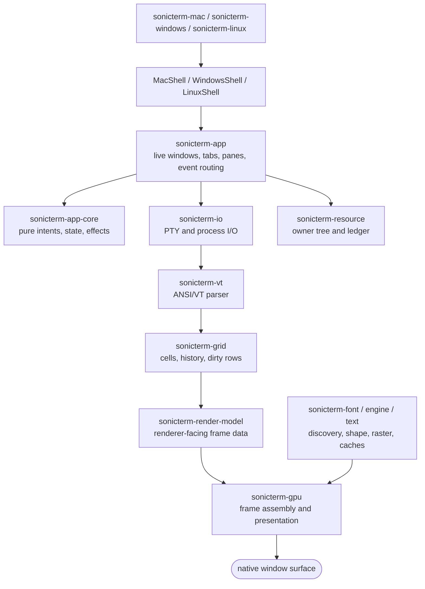
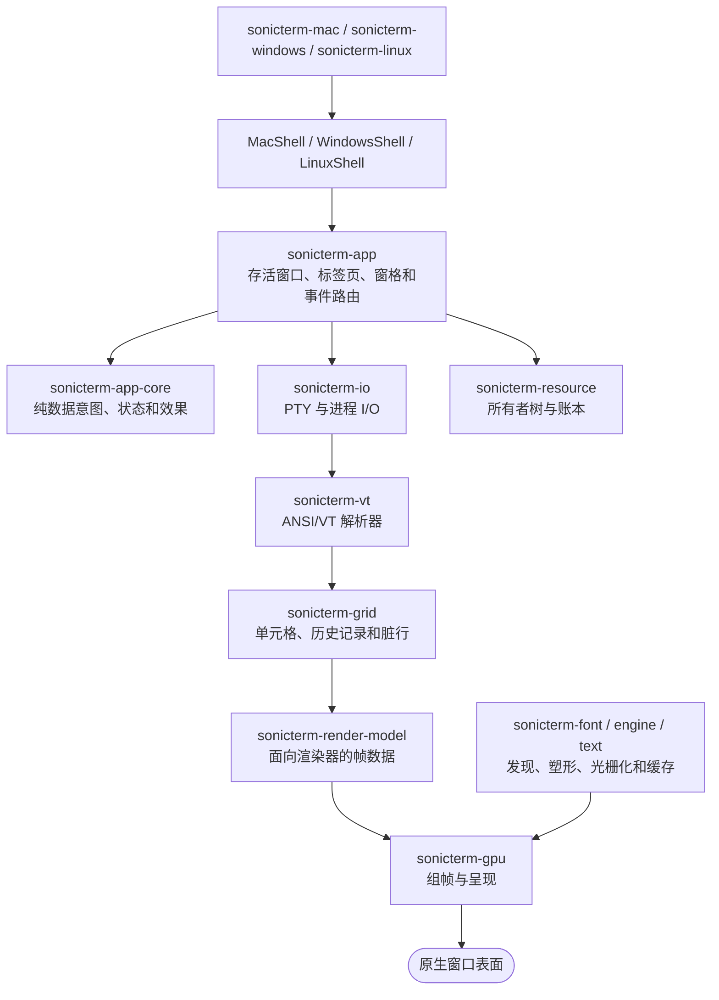

# Architecture / 架构

## English

This page owns SonicTerm's system shape and crate boundaries. See
[Architecture Internals](Architecture-Internals) for load-bearing invariants,
[From Keypress to Pixel](From-Keypress-to-Pixel) for the end-to-end data path,
and [Runtime Lifecycle](Runtime-Lifecycle) for object lifetimes and state changes.
The exact crate inventory is in [Crate Reference](Crate-Reference).

### System shape

SonicTerm separates terminal behavior from native windows and presentation.
A pseudo-terminal (PTY) is the operating-system channel between a pane and its
child process. PTY work runs away from the winit event-loop thread.

The arrows show runtime flow, not every Cargo edge. `sonicterm-app` owns the
live topology. `sonicterm-app-core` owns a separate backend-free state machine.
`sonicterm-gpu` receives terminal and UI types through the render-model boundary.

### Crate boundaries

| Boundary | Owns | Excludes |
| --- | --- | --- |
| `sonicterm-types` | small values and backend-free trait contracts | winit, wgpu, native PTYs |
| `sonicterm-resource` | resource owners, ledger entries, reservations, close checks | retained payloads and seam-specific reclamation |
| `sonicterm-app-core` | `AppState`, `AppIntent`, `AppEffect`, reducers, effect ordering | native handles, blocking I/O, winit, wgpu |
| `sonicterm-io` | local PTY/process work and optional SSH transport | ANSI interpretation and UI state |
| `sonicterm-vt` / `sonicterm-grid` | terminal parsing, cells, scrollback, cursor state, dirty rows | native windows and GPU resources |
| `sonicterm-cfg` / `sonicterm-ui` | configuration, themes, keymaps, tabs, panes, search, selection, IME | native presentation calls |
| `sonicterm-render-model` | pane geometry and renderer-facing data types | wgpu policy and window ownership |
| `sonicterm-font-config` and font wrapper crates | font configuration and generated FFI boundaries | app and renderer topology |
| `sonicterm-font` / `sonicterm-engine` / `sonicterm-text` | discovery, shaping, rasterization, atlas data, row glyph caches | window lifecycle and PTY ownership |
| `sonicterm-gpu` | damage, row/background caches, frame assembly, wgpu, Windows CPU composition | app topology and child processes |
| `sonicterm-app` | winit handler, live topology, PTY wiring, redraw scheduling, config application | platform-only AppKit, Win32, X11, or Wayland setup |
| platform crates | executable startup, native menus, drag/drop, backdrop hooks, package metadata | reusable terminal behavior |

The renderer has one declared terminal/UI type seam. `sonicterm-gpu` depends on
`sonicterm-render-model`, not directly on `sonicterm-grid`, `sonicterm-cfg`, or
`sonicterm-ui`. It imports their unchanged type identities through
`sonicterm_render_model::boundary::{grid,cfg,ui}`.

### Authoritative runtime state

`App` owns `HashMap<WindowId, WindowState>` and `main_window_id`. The main window
and torn-out windows use the same `WindowState` representation.

Each `WindowState` owns:

- its optional `Arc<Window>` and `GpuRenderer`;
- `TabBar` and `Vec<TabState>`;
- `HashMap<PaneId, PaneState>`;
- selection, copy mode, IME, drag, notification, hover, and redraw state.

Each `TabState` owns a `PaneTree`, its active pane id, search state, and command
status. Each `PaneState` owns its parser, optional `PtyHandle`, redraw target,
terminal-mode atomics, inline images, and resource charges.

`AppStateMachine` owns backend-free `AppState`. Its `handle` method reduces one
`AppIntent` into a stable class-sorted effect batch. In the GUI, all of that
state is observational: no reducer counter, focus value, or overlay flag decides
live topology. `App::observe_intent` keeps those compatibility observations but
discards their effects. `App` and `WindowState` remain authoritative for live
windows, tabs, pane trees, parser locks, renderers, and PTYs.

`App::dispatch_intent` separately handles supported explicit-target work.
Operational window effects resolve a monotonic `WindowKey` against a live window;
missing, removed, and zero keys never select main or frontmost. Native input
resolves its source window's active pane and writes through the bounded PTY queue
without a transient state machine. Record-only effects cannot claim native
completion. The full state/intent/effect inventory is in
[Runtime Lifecycle](Runtime-Lifecycle).

### Boundary contracts

#### Intent and effect

`AppStateMachine::handle` preserves the backend-free reducer/effect contract.
`App::observe_intent` records compatibility transitions without executing their
batch; supported operational intents and explicit effects cross the live app
boundary separately. Reducer effect classes keep this stable order:

1. `PtyWrite`;
2. `Render`;
3. `OsDrag`;
4. `Clipboard`;
5. `WindowOp`;
6. `MenubarUpdate`;
7. `Log`.

The private follow-on queue is bounded by `MAX_CASCADE_DEPTH = 16`.
`drain_pending` has no production enqueue source and therefore returns an empty
batch in normal runs.

#### Terminal

A `PtyHandle` owns the child process boundary, input/output channels, and native
reader and writer threads. A pane VT worker owns parser advancement. It holds the
pane parser lock while applying a batch, then releases it before sending
`UserEvent::RequestRedraw(WindowId)`.

Worker threads do not resolve `WindowId` or call native window APIs. The winit
thread resolves the id against the live window map and calls `request_redraw()`.

#### Rendering

The event-loop thread acquires every required parser and inline-image lock with
`try_lock`. It builds one `PaneRender` per visible pane and keeps the parser
guards alive through `GpuRenderer::render`. A failed lock defers the entire
frame.

`PaneRender` carries a stable pane id, mutable grid view, pixel rectangle,
viewport, focus, cursor style, broadcast-receiver state, scrollbar alpha, and
inline images. Production `GpuRenderer::render` receives that pane slice plus
explicit theme, selection, tabs, search, palette, IME, notification, and hovered
URL arguments.

Inside `sonicterm-gpu`, one owned `FramePlan` composes frame identity, render mode,
retained damage, full/content pane clips, viewport row slots, and expected grid
revisions from immutable metadata. Production assembly consumes that plan rather
than recomputing those decisions. It holds no grid, copied cells, mutable UI
controller, font stack, or native/GPU handle. Its vectors follow visible panes
and dirty rows; retained text identity is a digest, not another payload copy.
The renderer keeps only the compact key after presentation. Parser guards and
borrowed grids still span the complete stateful atlas/renderer operation.

`RenderInputs` remains a public render-model type. The two public `Painter`
traits are dormant source-compatibility seams with no production implementation;
production rendering uses `PaneRender` and `WeztermPipeline` directly.

#### Fonts

`sonicterm-engine::FontStack` adapts `sonicterm-font` to the renderer. HarfBuzz
shapes text. CoreText discovers fonts on macOS, GDI on Windows, and Fontconfig on
Linux. DirectWrite is the default Windows rasterizer. FreeType is the default on
macOS and Linux and the Windows fallback.

Generated FreeType, HarfBuzz, and Fontconfig bindings stay inside their wrapper
crates. The renderer receives safe shape results, glyph metrics, and raster
pixels rather than raw FFI handles.

#### Platforms

The three shipping binaries share `ShellRunner` through `MacShell`,
`WindowsShell`, and `LinuxShell`.

- macOS owns AppKit menu setup, native tab suppression, pasteboard handoff, and
  AppKit window hooks.
- Windows owns per-monitor-v2 DPI setup, `muda` menus, DWM backdrop work, OLE
  drag/drop, and GDI software presentation hooks.
- Linux owns X11/Wayland application identity, package assets, and font preflight.
  All platform binaries expose the shared native runtime smoke; Linux package
  layouts additionally run it on X11 and Wayland. Native menus, desktop
  notifications, material backdrops, and cross-process tab drag are absent there.

All reusable keyboard, terminal, pane, and renderer behavior stays in shared
crates.

#### Resources

`App` owns a process-local `ResourceGovernor`. The live GUI owner tree is
`Process → Window → AppPane`. Seam code owns and enforces the primary memory
caps. The pane owner has a derived governor backstop. The process and window
owners track totals without aggregate limits.

The governor records only charged classes. Renderer surfaces, glyph atlases, and
software frames are measured separately and are not in the governor total. See
[Memory](Memory) and [Runtime Lifecycle](Runtime-Lifecycle) for the accounting
and release rules.

### Ownership and concurrency rules

- Only the winit event-loop thread creates, resolves, or presents native windows.
- PTY reader, writer, VT, reply, path-probe, and cleanup workers stay outside the
  event loop.
- Rendering never blocks on a parser. One unavailable required lock defers the
  whole frame.
- A tab transfer moves each live `PaneState` and `PtyHandle`. It changes the
  shared redraw `WindowId`; it does not clone or restart the shell.
- Dropping `PtyHandle` starts bounded process and I/O teardown. Existing-window
  transfers validate destination readiness and retain detached custody until
  attachment commits. Direct drag-merge uses this same boundary. Destination
  setup, topology, or charge-admission refusal restores source order, focus,
  tree/zoom, live PTYs, sizes, and charges. New-window tear-out prepares hidden
  native artifacts and transfers accounting before revealing the destination;
  source hiding or reaping happens only after commitment.
- Terminal mutations mark damage in the same frame. Cache invalidation follows
  font, scale, theme, surface, atlas, and topology changes.

The exact safety conditions are in
[Architecture Internals](Architecture-Internals).

### Dependency direction

| Group | Direction |
| --- | --- |
| contracts | `sonicterm-types` |
| accounting | `sonicterm-resource` feeds `sonicterm-app`; logging tests also use it, and it owns no terminal or frame payload |
| terminal | `sonicterm-io` supplies bytes; `sonicterm-vt` interprets them; `sonicterm-grid` stores the result |
| UI model | `sonicterm-cfg` and `sonicterm-grid` feed `sonicterm-ui`; all three feed `sonicterm-render-model` |
| fonts | `sonicterm-font-config` and native wrappers feed `sonicterm-font`; `sonicterm-font` and `sonicterm-text` independently feed `sonicterm-engine` |
| rendering | render model, engine, text, types, and block glyphs feed `sonicterm-gpu` |
| app | app core, terminal, UI, rendering, logging, and resource crates feed `sonicterm-app` |
| platform | `sonicterm-app` feeds `sonicterm-mac`, `sonicterm-windows`, and `sonicterm-linux` |

### Source map

| Topic | Primary paths |
| --- | --- |
| App state and topology | `crates/sonicterm-app/src/app/mod.rs` |
| Intents, effects, and reducer | `crates/sonicterm-app-core/src/{intent,effect,reducer,state_machine,app_state}.rs` |
| Shell boundary | `crates/sonicterm-app/src/shell.rs` |
| PTY and process boundary | `crates/sonicterm-io/src/pty.rs` |
| VT and grid | `crates/sonicterm-vt/src/vt.rs`, `crates/sonicterm-grid/src/grid.rs` |
| Render model | `crates/sonicterm-render-model/src/{pane_render,inputs,painter,lib}.rs` |
| Renderer | `crates/sonicterm-gpu/src/core.rs` |
| Font adapter | `crates/sonicterm-engine/src/fontstack.rs` |
| Resource governor and app charging | `crates/sonicterm-resource/src/`, `crates/sonicterm-app/src/app/retention.rs` |
| Platform entry points | `crates/sonicterm-{mac,windows,linux}/src/main.rs` |

## 中文

本页只说明 SonicTerm 的整体结构和 crate 边界。关键不变量见
[架构内部机制](Architecture-Internals)，端到端数据路径见
[从按键到像素](From-Keypress-to-Pixel)，对象寿命和状态变化见
[运行时生命周期](Runtime-Lifecycle)。完整 crate 清单见
[Crate 参考](Crate-Reference)。

### 系统结构

SonicTerm 把终端行为与原生窗口、画面呈现分开。伪终端（PTY）是窗格与子进程之间的
操作系统通道。PTY 工作线程不在 winit 事件循环线程上运行。

箭头表示运行时数据流，不是全部 Cargo 依赖。实时拓扑由 `sonicterm-app` 持有。
`sonicterm-app-core` 持有另一套不依赖后端的状态机。`sonicterm-gpu` 通过渲染模型边界
接收终端和界面类型。

### Crate 边界

| 边界 | 负责 | 不负责 |
| --- | --- | --- |
| `sonicterm-types` | 小型值类型和不依赖后端的 trait 契约 | winit、wgpu、原生 PTY |
| `sonicterm-resource` | 资源所有者、账本记录、预留令牌和关闭检查 | 常驻数据本身和各接缝的回收策略 |
| `sonicterm-app-core` | `AppState`、`AppIntent`、`AppEffect`、归约器和效果排序 | 原生句柄、阻塞 I/O、winit、wgpu |
| `sonicterm-io` | 本地 PTY、进程和可选 SSH 传输 | ANSI 解释和界面状态 |
| `sonicterm-vt` / `sonicterm-grid` | 终端解析、单元格、回滚历史、光标状态和脏行 | 原生窗口和 GPU 资源 |
| `sonicterm-cfg` / `sonicterm-ui` | 配置、主题、键位、标签页、窗格、搜索、选区和输入法 | 原生呈现调用 |
| `sonicterm-render-model` | 窗格几何和面向渲染器的数据类型 | wgpu 策略和窗口所有权 |
| `sonicterm-font-config` 与字体包装 crate | 字体配置和生成的 FFI 边界 | 应用与渲染器拓扑 |
| `sonicterm-font` / `sonicterm-engine` / `sonicterm-text` | 字体发现、塑形、光栅化、图集数据和行字形缓存 | 窗口生命周期和 PTY 所有权 |
| `sonicterm-gpu` | 损伤区域、行缓存、背景缓存、组帧、wgpu 和 Windows CPU 合成 | 应用拓扑和子进程 |
| `sonicterm-app` | winit 处理器、实时拓扑、PTY 接线、重绘调度和配置应用 | 已有 shell 接缝负责的 AppKit、Win32、X11 或 Wayland 平台设置 |
| 平台 crate | 程序启动、原生菜单、拖放、背景效果钩子和包元数据 | 可复用的终端行为 |

渲染器只有一个声明过的终端与界面类型边界。`sonicterm-gpu` 依赖
`sonicterm-render-model`，不直接依赖 `sonicterm-grid`、`sonicterm-cfg` 或
`sonicterm-ui`。它通过 `sonicterm_render_model::boundary::{grid,cfg,ui}` 导入这些
crate 中身份不变的类型。

### 权威运行时状态

`App` 持有 `HashMap<WindowId, WindowState>` 和 `main_window_id`。主窗口和拆出的窗口
使用同一种 `WindowState` 表示。

每个 `WindowState` 持有：

- 可选的 `Arc<Window>` 和 `GpuRenderer`；
- `TabBar` 和 `Vec<TabState>`；
- `HashMap<PaneId, PaneState>`；
- 选区、复制模式、输入法、拖动、通知、悬停和重绘状态。

每个 `TabState` 持有 `PaneTree`、活动窗格编号、搜索状态和命令状态。每个
`PaneState` 持有解析器、可选 `PtyHandle`、重绘目标、终端模式原子值、内联图像和
资源计费令牌。

`AppStateMachine` 持有不依赖后端的 `AppState`；其 `handle` 方法把一个 `AppIntent`
归约为按类别稳定排序的一批效果。在 GUI 中，这些状态全部只供观察：归约器计数、焦点值或
浮层标志都不决定实时拓扑。`App::observe_intent` 保留兼容观察记录，但丢弃其效果。
实时窗口、标签页、窗格树、解析器锁、渲染器与 PTY 始终以 `App` 和 `WindowState` 为准。

`App::dispatch_intent` 单独处理受支持的显式目标工作。可执行的窗口效果把单调分配的
`WindowKey` 解析为存活窗口；缺失、已移除或零 key 都不会选择主窗口或最前窗口。原生输入
解析源窗口的活动窗格，直接通过有界 PTY 队列写入，不再构建临时状态机。只记录的效果不能
声称原生操作已完成。完整的状态、意图与效果清单见[运行时生命周期](Runtime-Lifecycle)。

### 边界契约

#### 意图与效果

`AppStateMachine::handle` 保留不依赖后端的归约器与效果契约。`App::observe_intent`
记录兼容状态变化，但不执行其效果批次；受支持的可执行意图与显式效果单独跨越实时应用边界。
归约器效果类别保持以下稳定顺序：

1. `PtyWrite`；
2. `Render`；
3. `OsDrag`；
4. `Clipboard`；
5. `WindowOp`；
6. `MenubarUpdate`；
7. `Log`。

私有后续队列受 `MAX_CASCADE_DEPTH = 16` 限制。生产路径没有向该队列写入的入口，
因此正常运行时 `drain_pending` 返回空批次。

#### 终端

`PtyHandle` 持有子进程边界、输入输出通道以及原生读写线程。每个窗格的 VT 工作线程
推进解析器。它在处理一批数据时持有该窗格的解析器锁，随后先释放锁，再发送
`UserEvent::RequestRedraw(WindowId)`。

工作线程不会解析 `WindowId`，也不会调用原生窗口 API。winit 线程在存活窗口表中查找
该编号，然后调用 `request_redraw()`。

#### 渲染

事件循环线程通过 `try_lock` 获取当前帧需要的全部解析器锁和内联图像锁。它为每个可见
窗格构建一个 `PaneRender`，并让解析器保护对象一直存活到 `GpuRenderer::render` 返回。
任一锁获取失败都会推迟整帧。

`PaneRender` 包含稳定窗格编号、可变网格视图、像素矩形、视口、焦点、光标样式、广播
接收状态、滚动条透明度和内联图像。生产路径的 `GpuRenderer::render` 接收这组窗格，
并通过独立参数接收主题、选区、标签页、搜索、命令面板、输入法、通知和悬停 URL。

`sonicterm-gpu` 内部通过一个拥有自身数据的 `FramePlan`，从不可变元数据组合帧身份、渲染模式、
保留损伤区域、完整/内容窗格裁剪、视口行槽和预期网格修订号。生产组装使用该计划，不重新计算
这些决策。计划不持有网格、复制的单元格、可变 UI controller、字体栈或原生/GPU 句柄。
向量规模随可见窗格和脏行变化；保留的文本身份是摘要，不是另一份载荷。呈现后渲染器只保留
紧凑帧键。解析器保护对象和借用网格仍覆盖整个有状态的图集/渲染器操作。

`RenderInputs` 仍是公开的渲染模型类型。两个公开的 `Painter` trait 都是没有生产实现的休眠
源码兼容接缝；生产渲染直接使用 `PaneRender` 和 `WeztermPipeline`。

#### 字体

`sonicterm-engine::FontStack` 把 `sonicterm-font` 接到渲染器。HarfBuzz 负责文字塑形。
macOS 使用 CoreText 发现字体，Windows 使用 GDI，Linux 使用 Fontconfig。Windows 默认
用 DirectWrite 光栅化。macOS 和 Linux 默认用 FreeType；Windows 也用 FreeType 作为回退。

生成的 FreeType、HarfBuzz 和 Fontconfig 绑定只留在各自包装 crate 内。渲染器接收安全的
塑形结果、字形度量和光栅像素，不接触原始 FFI 句柄。

#### 平台

三个发行二进制通过 `MacShell`、`WindowsShell` 和 `LinuxShell` 共用 `ShellRunner`。

- macOS 负责 AppKit 菜单、关闭原生标签页、剪贴板拖动交接和 AppKit 窗口钩子。
- Windows 负责 per-monitor-v2 DPI、`muda` 菜单、DWM 背景效果、OLE 拖放和 GDI 软件呈现钩子。
- Linux 负责 X11/Wayland 应用标识、包内资源和字体预检。所有平台二进制都暴露共享原生运行
  smoke；Linux 包布局还会在 X11 与 Wayland 上运行它。该平台没有原生菜单、桌面通知、材质
  背景和跨进程标签页拖动。

可复用的键盘、终端、窗格和渲染行为都留在共享 crate 中。

#### 资源

`App` 持有进程内 `ResourceGovernor`。图形界面的实际所有者树是
`Process → Window → AppPane`。各接缝负责主要内存上限。窗格所有者另有一个由接缝上限
推导出的总账警戒线。进程和窗口所有者只统计合计，不设置聚合上限。

总账只包含实际计费的资源类别。渲染表面、字形图集和软件帧另行测量，不计入总账合计。
具体记账和释放规则见 [内存](Memory) 与 [运行时生命周期](Runtime-Lifecycle)。

### 所有权与并发规则

- 只有 winit 事件循环线程可以创建、查找或呈现原生窗口。
- PTY 读写、VT、回复、路径探测和清理工作线程都在事件循环之外运行。
- 渲染路径不会阻塞等待解析器。任一必需锁不可用时，整帧都会推迟。
- 转移标签页会移动每个存活的 `PaneState` 和 `PtyHandle`。代码只修改共享重绘
  `WindowId`，不会复制或重启 shell。
- 析构 `PtyHandle` 会开始有时限的进程与 I/O 清理。现有窗口转移会验证目标就绪状态，并在
  附加提交前持续持有已移除状态；直接拖动合并也使用同一边界。目标设置、拓扑或计费准入
  被拒绝时，完整恢复源顺序、焦点、树/放大状态、存活 PTY、尺寸和计费。新窗口拆出先准备
  隐藏的原生产物，并在显示目标前转移记账；只有提交后才隐藏或回收源窗口。
- 终端修改在同一帧标记损伤区域。字体、缩放、主题、表面、图集和拓扑变化会使对应缓存失效。

完整安全条件见 [架构内部机制](Architecture-Internals)。

### 依赖方向

| 分组 | 方向 |
| --- | --- |
| 契约 | `sonicterm-types` |
| 记账 | `sonicterm-resource` 输入 `sonicterm-app`；日志测试也使用它；该 crate 不持有终端或帧数据 |
| 终端 | `sonicterm-io` 提供字节，`sonicterm-vt` 解释字节，`sonicterm-grid` 保存结果 |
| 界面模型 | `sonicterm-cfg` 和 `sonicterm-grid` 输入 `sonicterm-ui`；三者再输入 `sonicterm-render-model` |
| 字体 | `sonicterm-font-config` 和原生包装 crate 输入 `sonicterm-font`；`sonicterm-font` 与 `sonicterm-text` 分别输入 `sonicterm-engine` |
| 渲染 | 渲染模型、字体引擎、文本、公共类型和块字符输入 `sonicterm-gpu` |
| 应用 | 应用核心、终端、界面、渲染、日志和资源 crate 输入 `sonicterm-app` |
| 平台 | `sonicterm-app` 输入 `sonicterm-mac`、`sonicterm-windows` 和 `sonicterm-linux` |

### 源码索引

| 主题 | 主要路径 |
| --- | --- |
| 应用状态与拓扑 | `crates/sonicterm-app/src/app/mod.rs` |
| 意图、效果和归约器 | `crates/sonicterm-app-core/src/{intent,effect,reducer,state_machine,app_state}.rs` |
| Shell 边界 | `crates/sonicterm-app/src/shell.rs` |
| PTY 与进程边界 | `crates/sonicterm-io/src/pty.rs` |
| VT 与网格 | `crates/sonicterm-vt/src/vt.rs`、`crates/sonicterm-grid/src/grid.rs` |
| 渲染模型 | `crates/sonicterm-render-model/src/{pane_render,inputs,painter,lib}.rs` |
| 渲染器 | `crates/sonicterm-gpu/src/core.rs` |
| 字体适配器 | `crates/sonicterm-engine/src/fontstack.rs` |
| 资源总账与应用计费 | `crates/sonicterm-resource/src/`、`crates/sonicterm-app/src/app/retention.rs` |
| 平台入口 | `crates/sonicterm-{mac,windows,linux}/src/main.rs` |
