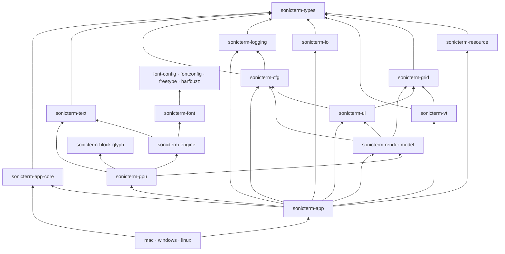

# Crate 参考

[English](Crate-Reference)

本页是 Cargo workspace 中 23 个 Rust crate 的规范映射。根 `Cargo.toml`
统一提供版本、edition、Rust 版本、作者、许可证和仓库信息。默认 workspace member
是 `sonicterm-app`。发布的二进制 crate 是 `sonicterm-mac`、
`sonicterm-windows` 和 `sonicterm-linux`；Linux 可执行文件名为 `sonicterm`。

## 依赖概览

图中只画主要架构依赖。下方每个条目列出准确的第一方 Cargo 依赖。除非条目另有说明，
这些都是普通 Cargo 依赖，而不是构建或测试依赖。`sonicterm-logging` 还以 dev dependency
使用启用 `test-util` 的 `sonicterm-resource`。`sonicterm-font` 的 `fontconfig` 别名仅在
Android 和非 macOS Unix 目标启用；`config`、`freetype`、`harfbuzz` 是库别名，不是额外 crate。
工作区没有第一方 build-dependency 边。外部构建工具和原生链接要求仍由 FFI 与平台 crate 管理。

## 状态与公开接口契约

本表用于查找状态所有者与公开接口；下方条目列出准确依赖和源码。未特别注明的路径相对于
所属 crate。兼容 trait 不一定驱动生产；本表也不是 unsafe 调用审计。

| Crate | 可变状态与生命周期所有者 | 公开接口与明确的边界例外 |
| --- | --- | --- |
| `sonicterm-types` | 值由调用方持有；不拥有窗口、PTY 或渲染器生命周期。 | `Cell`、`GlyphKey`、`ResourceAmount`、`WindowKey` 和 `src/traits/` 中与后端无关的 trait；`Painter` 是未启用的兼容边界。 |
| `sonicterm-resource` | `ResourceGovernor` 共享 `Arc<Ledger>`；reservation token 拥有记账量，`ReaperSupervisor` 拥有已接纳的清理任务。`UnresolvedSink` 将类型擦除的原生载荷与其记账一起保留。 | `try_reserve`、`Reservation`、`CommittedReservation`、`snapshot`、`ReaperSupervisor` 和 `UnresolvedSink`；快照是观察结果，GUI 进程/窗口限制仍仅用于跟踪。 |
| `sonicterm-grid` | 每个 `Grid` 拥有可见/历史/保存的主屏行、版本和脏位；`HyperlinkRegistry` 单独拥有链接元数据。生产解析器拥有网格。 | `Grid::resize`、`revision`、`retained_amount_by_region`、行访问和 `Line`；不包含原生句柄、PTY 传输或呈现。 |
| `sonicterm-vt` | `Parser` 拥有 `Grid`、解析状态、捕获缓冲和回复/事件状态；窗格 worker 在该窗格的解析器锁下推进它。 | `src/vt.rs` 中的 `Parser::advance`、`grid`、`grid_mut` 和 `VtEvent`；回调产生数据，不调用原生窗口。 |
| `sonicterm-io` | `PtyHandle` 拥有子进程、有界输入/输出传输状态、取消以及 reader/writer 生命周期。Drop 启动有界清理。 | `spawn_default_shell`、`send_input_nonblocking`、`PtyInputSender`、`resize`、`out_rx` 和可选 `SshHandle`；GUI 调用方不拥有原生 PTY 内部状态。 |
| `sonicterm-cfg` | 调用方拥有加载后的 `Config`、`Theme` 和 `Keymap` 值，并决定何时替换。 | `src/{config,theme,keymap,assets,url_scan,url_open}.rs` 中的 TOML/资源/URI API；`LoggingConfig` 从 logging 重导出，文件系统目标不进入 URI 打开器。 |
| `sonicterm-logging` | 进程 subscriber、panic/exit hook、ring 和工件 worker 由 logging 管理；二进制保留 `LoggingGuard` 维持 appender 生命周期。 | `init`、`init_in`、`LoggingConfig`、`install_panic_hook` 和 breadcrumb/session API；按进程初始化，不是每个窗口一个 subscriber。持久化范围见[日志](Logging-zh-CN)。 |
| `sonicterm-ui` | `App` 和 `WindowState` 持有 UI controller；`CommandPalette` 拥有缓存文本与过滤选择，`TabBar` 拥有标签页身份，标签宽度策略是进程级标量。 | `CommandPalette`、`PaletteLayout`、`TabBarLayout`、`PaneTree`、`Selection` 和 `I18n`；仅计算状态/布局，不拥有原生窗口或执行动作。 |
| `sonicterm-render-model` | 调用方拥有的帧记录借用实时网格；`InlineImage` 通过 `Arc` 共享解码字节。此处不拥有渲染器或原生生命周期。 | `PaneRender<'a>`、`PixelRect` 和 `HoveredUrlCells`；生产渲染全程保留解析器 guard。`boundary::{grid,cfg,ui}` 原样重导出具体类型；`RenderInputs` 和未启用的 `Painter` 不替代生产入口。 |
| `sonicterm-text` | CPU `GlyphAtlas` 和 `RowGlyphCache` 拥有像素、元数据及缓存实例；包含它们的渲染器控制生命周期与失效。 | `Rasterizer`、`RasterTile`、`GlyphInstance`、`ShapedGlyph` 和图集/缓存方法；原生发现/塑形/栅格对象位于 font/engine，而非本 crate。 |
| `sonicterm-font-config` | `ConfigHandle` 共享不可变 `Arc<Config>` 快照；进程 mutex 保存当前 handle，generation 区分替换。 | `configuration`、`use_this_configuration`、`TextStyle`、字体属性与栅格策略；库别名 `config` 与 `sonicterm-cfg` 不同，且不拥有原生 face。 |
| `sonicterm-fontconfig` | 原始 Fontconfig ABI 暴露原生对象；`sonicterm-font::fcwrap` 中的匹配封装拥有引用并负责销毁。 | `src/lib.rs` 中的 `Fc*` 类型/函数；系统链接发生在构建期，字体消费者按目标启用，不是 Windows/macOS 发现路径。 |
| `sonicterm-freetype` | 生成 ABI 不拥有 Rust 封装生命周期；`sonicterm-font::ftwrap` 拥有 library/face 生命周期并保留后备来源。 | `FT_*` 绑定和定点辅助函数；`build.rs` 编译内嵌原生源码，原始 ABI 调用方仍承担 unsafe 义务。 |
| `sonicterm-harfbuzz` | 生成 ABI 暴露原生引用；`sonicterm-font::hbwrap` 管理 buffer、blob、font 引用及释放回调。 | `hb_*` 绑定；`freetype` 依赖是 `sonicterm-freetype` 的别名，原生 amalgamation/链接设置保留在 `build.rs`。 |
| `sonicterm-font` | `FontConfiguration` 共享线程内 `Rc` 状态；`LoadedFont` 拥有 `RefCell` 塑形/栅格/回退缓存，原生封装拥有句柄生命周期。 | `FontConfiguration`、`LoadedFont`、locator/shaper/rasterizer trait、`FontMetrics` 和 `RasterizedGlyph`；原始 `ftwrap` 重导出仍是明确的底层接口，不表示所有 API 都安全。 |
| `sonicterm-engine` | `FontStack` 共享 `Rc<FontConfiguration>`，拥有每个 stack 的字号/字重/度量状态；渲染器保留 stack。 | `FontStack`、`CellMetricsPx`、塑形与图集 tile 转换；直接 text 依赖传递 CPU 数据，不形成另一个终端状态所有者。 |
| `sonicterm-block-glyph` | 调用方拥有返回的 CPU bitmap tile；块几何使用临时栅格状态，不拥有共享渲染器或 font face。 | `BlockKey`、`SizedBlockKey`、`block_sprite_with_cell_metrics` 和 `glue::BlockRasterTile`；没有第一方依赖，保留 WezTerm 署名。 |
| `sonicterm-gpu` | `GpuRenderer` 拥有每窗口 surface、保留帧、pipeline、图集、缓存、软件帧和字体 stack。`GpuSharedContext` 共享 wgpu 引用计数 device/queue 句柄，不创建第二个 device。 | `GpuRenderer::new`、`new_with_shared_context`、`render`、`try_resize`、`retained_amounts` 和 `live_renderer_count`；UI/grid 类型经 render-model。保留量描述当前实例，live count 跟踪生命周期。CPU 成功可观察；此处 wgpu 成功仅指 submit/present 调用。 |
| `sonicterm-app-core` | `AppStateMachine` 拥有不依赖后端的状态转换/effect 值，不拥有实时 `WindowState`、解析器锁或 PTY。 | `AppState`、`AppIntent`、`AppEffect`、`handle` 与 effect 顺序；生产拓扑仍在 App 中，而非从该模型推断。 |
| `sonicterm-app` | `App` 拥有实时 `WindowState`、预热渲染器、路由和资源协调。每个窗口拥有标签页/窗格；每个窗格拥有 parser/PTY/image 状态。 | `App`、`WindowState`、`PaneState`、`run_action_for_window` 和平台 `Shell` 封装；`try_lock` guard 与借用网格在有状态渲染全程存活。原生 worker 不解析 UI 窗口身份。 |
| `sonicterm-mac` | 二进制启动保留 logging/session guard，安装 AppKit hook，并将事件循环交给 `MacShell`。 | `src/main.rs` 和 menu/open-document/drag 模块；AppKit 调用留在主线程，终端行为留在共享 app/IO crate。 |
| `sonicterm-windows` | 二进制启动保留 logging/session guard，安装 Win32 menu/backdrop/OLE hook，并运行 `WindowsShell`。 | `src/main.rs`、CLI 和原生 GUI 模块，以及 WiX 资源；PTY/ConPTY 进程所有权保留在 `sonicterm-io`。 |
| `sonicterm-linux` | 二进制启动拥有 Linux 能力归一化与打包字体预检，保留 logging/session guard，然后运行 `LinuxShell`。 | `src/main.rs` 与包资源；直接 engine 依赖用于字体预检，X11/Wayland 窗口和终端状态仍由 app 拥有。 |

## 契约与终端核心

### `sonicterm-types`

**职责：** 供整个 workspace 共用的轻量契约，包括单元格、几何、颜色、操作、
修饰键、字形/窗口/超链接标识、shell 引用、粘贴编码、资源类型和后端 trait。

**第一方依赖：** 无。

**阅读：** `src/{cell,action,glyph_key,geom,resource}.rs`、`src/traits/`。

### `sonicterm-resource`

**职责：** 进程内资源治理器，包含 owner 层级、分片账本、自动释放的 RAII
预留、取消 token 和有界回收任务管理器。

管理器关闭时唤醒容量等待者并返回 `ShuttingDown`，预留期限与关闭同时发生时也如此。
已完成任务在计数器锁释放后析构，因此原生句柄许可的析构可以归还计数。
槽位通知在析构之后发生；即使析构展开退出，也不会丢失通知。
`shutdown_handle()` 返回可克隆的 `ReapShutdownHandle`；它的
`close_admission(drain_by)` 只收紧共享期限，不运行另一个轮询循环，也不设置取消 token。
运行中的调用与延迟等待都遵守自身期限和共享期限中较早的那个。

`try_reserve_unit(ReapUnitDemand)` 原子预留一个任务及各个 `ReapHandlePermit`；
`BelowMinimumCapacity` 表示固定上限无法容纳整个单元，与临时满额的 `QueueFull` 区分。
只有任务开始执行时才申领 helper。普通任务仍按调用申领；选择整组模式的任务在计数器锁
释放后接收一个完整 `HelperGrant`，重试时使用 `Held`。每个 worker 持有 grant 克隆并
占据组内一个槽位；启动失败只归还该槽位，不释放任务持有的整组 grant。helper 计数表示
预留容量，包括没有 worker 运行时仍被保留的 grant。

选择收集模式的任务保留被中止等待的 helper 句柄，并向 `collect_settled_retained` 提供
整个任务的完成状态。收集器在待处理任务重试前执行，只在管理器锁之外 join 已结束的
句柄，然后归还任务许可并撤回未解决 owner 记录。选择该模式要求每个任务拥有唯一的
传输 owner，共享 owner 的任务保持不可收集。`requeue_unstarted` 让符合条件的工作
跨越正常运行期限。每次唤醒、复查和运行返回后，调用方必须先收集已完成的保留任务并检查
控制消息，再查询 `has_startable_work`。查询不自行收集；它让延续任务停等，直到完整
grant 可以接纳。接纳关闭后，不再走这条正常重试路径。

`UnresolvedSink` 在独立持有的列表中保留未完成的原生载荷及其记账。条目占用任务接纳
容量，shutdown 同时报告条目和仍打开的无槽位取消副本。sink 的终态释放会遗忘未完成
条目，不执行尚不能安全完成的原生析构，也不归还其记账。账本允许已退役的 `PtyTransport`
直接属于 GUI 进程，不允许它属于该进程的窗口、窗格或本地 PTY。

**第一方依赖：** `sonicterm-types`。

**阅读：** `src/{ledger,owner,reservation,reaper,cancel}.rs`。

### `sonicterm-grid`

**职责：** 主屏幕和备用屏幕、可见行、有界回滚缓冲、光标、宽字符和组合字符、
超链接、提示区、脏行与行存储。

**第一方依赖：** `sonicterm-types`。

**阅读：** `src/{grid,line,hyperlink}.rs`。

### `sonicterm-vt`

**职责：** 基于 vte 的 ANSI/VT 解析器与执行器，把控制序列转换为网格修改、
终端回复和类型化事件。OSC 7 会分别保留主机 authority 与解码后的路径，供需要
识别主机的工作目录逻辑使用。

**第一方依赖：** `sonicterm-grid`、`sonicterm-types`。

**阅读：** `src/vt.rs`、`tests/autowrap/main.rs`、
`tests/control_sequences/main.rs`。

### `sonicterm-io`

**职责：** 本地 PTY 与进程传输、调整大小和子进程清理、shell 选择，以及前台
进程发现。

**第一方依赖：** `sonicterm-types`。

**阅读：** `src/{pty,proc_info,foreground_proc}.rs`。

## 配置、界面与帧数据

### `sonicterm-logging`

**职责：** tracing 输出、日志保留、panic 工件、致命退出标记、会话标记、
有界诊断记录、事后证据发现和进程内存采样。

**第一方依赖：** `sonicterm-types`；测试还以 `test-util` 使用
`sonicterm-resource`。

**阅读：** `src/{lib,config,cleanup,crash,exit_trace,breadcrumbs,postmortem,session_state}.rs`。
具体字段和排查方法见[日志](Logging-zh-CN)。

### `sonicterm-cfg`

**职责：** 唯一负责解析 `sonicterm.toml`、主题和键位 TOML、尺寸、资源查找、
类型化 URI/路径识别，以及安全 URI 打开策略。

**第一方依赖：** `sonicterm-logging`、`sonicterm-types`。

**阅读：** `src/{config,theme,keymap,assets,url_scan,url_open,dimension}.rs`。

### `sonicterm-ui`

**职责：** 与渲染器无关的界面状态和布局，包括标签页、窗格、命令面板、搜索、
选区、READONLY/复制模式、滚动条、输入法、广播、通知和本地化。

**第一方依赖：** `sonicterm-cfg`、`sonicterm-grid`、`sonicterm-types`。

macOS 文本编辑通过 AppKit attributed-string 纯字符串单词边界 API 实现 Option 删除，
并严格转换 UTF-16/UTF-8 位置。按目标启用的 `objc2-app-kit`、`objc2-foundation` 依赖
不创建原生视图或窗口。规范分解使用 `unicode-normalization`；终端编码仍属于 app，
不进入这些文本框编辑操作。

命令面板分开管理元数据、显示与执行：

- `command_label::descriptor` 定义变体身份、分类、本地化键、英文别名、目标要求与
  READONLY 许可。App 提供窗口内 `CommandContext`；`disabled_reason` 没有原生句柄、
  终端载荷或执行权限。英文后备保留动作参数字面值。
- `CommandPalette` 在刷新时用 `I18n` 缓存标签、搜索文字、首个绑定提示和界面文字。
  语言刷新重建所有模式文字，仅 Commands 重新过滤索引。`PaletteLayout` 把缓存身份用于帧键，
  不逐帧翻译。Fluent 数量/标题短语按一个内部值槽拆分以保留词序；不解释标题，光标单独追加。
- `highlighted` 保留行身份，`current` 排除禁用项。`PaletteEntry` 区分命令和 `TabId`
  目标。App 在附着窗口解析存活目标的当前下标；关闭目标不会选择替代项。
- App 在输入前刷新上下文，渲染时使用已持有网格。输入选区验证采用 `try_lock`，不会重复获取
  render guard。溢出与原生/本地拖放快照保留绝对索引；仅标签页模式复用面板。唯一模态指针
  记录在释放时验证身份/可用性，不抢占先开始的终端或界面手势。

**阅读：** `src/{tabs,pane,command_palette,command_label,search,selection,copy_mode,ime,overlays,i18n}.rs`。

### `sonicterm-render-model`

**职责：** 与具体渲染器无关的窗格、几何、覆盖层和输入数据。它通过
`boundary::{grid,cfg,ui}` 重新导出网格、配置和界面类型，让 GPU crate 只依赖一条
明确的模型边界。

**第一方依赖：** `sonicterm-cfg`、`sonicterm-grid`、`sonicterm-types`、
`sonicterm-ui`。

**阅读：** `src/{pane_render,inputs,geometry,lib}.rs`。

## 文本与字体

### `sonicterm-text`

**职责：** CPU 字形图集、行级字形缓存、塑形记录，以及渲染器使用的
`GlyphInstance` 数据。

**第一方依赖：** `sonicterm-types`。

**阅读：** `src/{glyph_atlas,row_glyph_cache,shape,lib}.rs`。

### `sonicterm-font-config`

**职责：** 字体配置值模型，包括文本样式、属性、字重、宽度、光栅器选择和策略。
Rust library 名为 `config`。

**第一方依赖：** 无。

**阅读：** `src/lib.rs`。

### `sonicterm-fontconfig`

**职责：** 手写的 Fontconfig ABI 声明，以及 Android 和非 macOS Unix 字体发现所用的
构建/链接封装。`build.rs` 通过 pkg-config 探测系统 Fontconfig。

**第一方依赖：** 无。

**阅读：** `build.rs`、手写的 `src/lib.rs`。

### `sonicterm-freetype`

**职责：** 生成的 FreeType ABI 和定点数工具。`build.rs` 编译内嵌的 zlib、libpng
与 FreeType，并导出构建路径。

**第一方依赖：** 无。

**阅读：** `build.rs`、`bindings.h`、`src/{lib,types,fixed_point}.rs`。

### `sonicterm-harfbuzz`

**职责：** 生成的 HarfBuzz ABI。`build.rs` 针对 FreeType 构建结果编译内嵌的
HarfBuzz C++ 合并源码。原生原子操作、互斥锁和线程安全的静态初始化保持启用：
不同线程上的独立字体对象仍共享 HarfBuzz 回调表。字体封装测试在不共享可变字体对象的
情况下并发创建和销毁字体。

**第一方依赖：** 以依赖别名 `freetype` 使用 `sonicterm-freetype`。

**阅读：** `build.rs`、`bindings.h`、生成的 `src/lib.rs`。

### `sonicterm-font`

**职责：** 安全的字体发现和匹配、HarfBuzz 塑形、回退、
FreeType/DirectWrite/HarfBuzz 光栅化、COLR 字形和原生 handle 封装。

**第一方依赖：** 以 `config` 使用 `sonicterm-font-config`，以 `freetype` 使用
`sonicterm-freetype`，以 `harfbuzz` 使用 `sonicterm-harfbuzz`；Android 和非 macOS
Unix 构建还以 `fontconfig` 使用 `sonicterm-fontconfig`。

**阅读：** `src/db.rs`、`src/locator/`、`src/shaper/`、`src/rasterizer/`、
`src/{ftwrap,hbwrap,fcwrap,parser}.rs`。

### `sonicterm-engine`

**职责：** 小型字体引擎边界。`FontStack` 把塑形与光栅结果转换为单元格尺寸和
图集 `RasterTile`。

**第一方依赖：** 以 `config` 使用 `sonicterm-font-config`，另依赖
`sonicterm-font`、`sonicterm-text`、`sonicterm-types`。

**阅读：** `src/fontstack.rs`。

### `sonicterm-block-glyph`

**职责：** 方框线、块元素、Powerline、Braille、六分块、八分块和合成终端符号的
几何与光栅化。

**第一方依赖：** 无。

**阅读：** `src/{lib,glue,customglyph}.rs`；来源说明见 `LICENSE-WEZTERM`。

## 渲染与应用

### `sonicterm-gpu`

**职责：** wgpu 设备与 surface、帧组装、脏行损伤、quad 与字形输出、图集上传、
保留帧、软件 adapter 检测，以及 Windows CPU 呈现数据。

**第一方依赖：** `sonicterm-block-glyph`、`sonicterm-engine`、
`sonicterm-render-model`、`sonicterm-text`、`sonicterm-types`。

私有 `FramePlan` 从元数据组合帧标识、模式、损伤、窗格裁剪、视口槽位和预期修订号。
生产路径使用这些决策，同时保留借用网格、解析器守卫及有状态的图集/缓存操作；
它不是快照，也不是多线程渲染器边界。

**阅读：** `src/{core,frame_plan,atlas_upload,row_quad_cache,chrome_text,cursor,color,software_windows}.rs`。

### `sonicterm-app-core`

**职责：** 不依赖后端的 `AppIntent`、`AppEffect`、`AppState`、reducer、稳定的
effect 顺序和状态机。实时窗口/标签页/窗格结构仍由 `sonicterm-app` 持有。

**第一方依赖：** `sonicterm-types`。

**阅读：** `src/{app_state,intent,effect,reducer,state_machine}.rs`。

### `sonicterm-app`

**职责：** 跨平台 winit 编排，管理窗口、渲染器、标签页、窗格、PTY/解析器、
输入、配置重载、重绘、覆盖层、标签页转移、有界目标探测和原生直接打开。

**第一方依赖：** `sonicterm-app-core`、`sonicterm-cfg`、`sonicterm-gpu`、
`sonicterm-grid`、`sonicterm-io`、`sonicterm-logging`、
`sonicterm-render-model`、`sonicterm-resource`、`sonicterm-text`、
`sonicterm-types`、`sonicterm-ui`、`sonicterm-vt`。

**阅读：** `src/app/mod.rs`、
`src/app/{event_loop,window_event,spawn_pane,keymap_dispatch,path_target,tear_out}.rs`、
`src/shell.rs`。

## 平台 crate

### `sonicterm-mac`

**职责：** macOS 二进制与 AppKit 胶水，包括启动、NSMenu、打开文档事件、
NSPasteboard 标签页交接、NSWindow 设置和 app bundle 入口。

**第一方依赖：** `sonicterm-app`、`sonicterm-app-core`、`sonicterm-cfg`、
`sonicterm-logging`。

**阅读：** `src/{main,menubar,open_documents,os_drag_mac,tab_drag_os}.rs`。
原生边界见[平台集成](Platform-Integration-zh-CN)。

### `sonicterm-windows`

**职责：** Windows 二进制与 Win32 界面胶水，包括 DPI 设置、CLI、`muda` 菜单、
DWM backdrop、OLE 标签页拖放、软件呈现支持、Win32 资源和 WiX metadata。
ConPTY 仍封装在 `sonicterm-io` 后。

**第一方依赖：** `sonicterm-app`、`sonicterm-app-core`、`sonicterm-cfg`、
`sonicterm-logging`、`sonicterm-types`。

**阅读：** `src/{main,cli,startup,backdrop,menubar,os_drag_win,software_presenter}.rs`、
`build.rs`、`wix/main.wxs`。

### `sonicterm-linux`

**职责：** 发布用 Linux `sonicterm` 二进制，包括 X11/Wayland identity、能力收敛、
诊断、打包字体预检和 desktop/AppStream metadata。

**第一方依赖：** `sonicterm-app`、`sonicterm-app-core`、`sonicterm-cfg`、
`sonicterm-engine`、`sonicterm-logging`。

**阅读：** `src/main.rs`、`resources/`。

每个 crate 都有本地 `CLAUDE.md`，记录约束和本地 gate。安装包布局见[打包](Packaging-zh-CN)；
CI 与发布行为见[开发与发布](Development-and-Release-zh-CN)。
