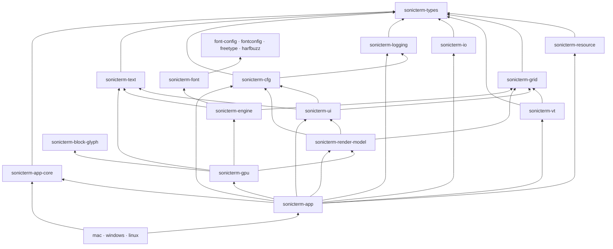

# Crate Reference / Crate 参考

## English

This is the canonical map of the 23 Rust crates in the Cargo workspace. The root
`Cargo.toml` supplies their version, edition, Rust version, authors, license, and
repository metadata. `sonicterm-app` is the default workspace member. The
shipping binaries are `sonicterm-mac`, `sonicterm-windows`, and
`sonicterm-linux`; the Linux executable is named `sonicterm`.

## Dependency overview

The diagram shows the main architecture edges. Each entry below gives the exact
first-party Cargo dependencies. Unless an entry says otherwise, these are normal
Cargo dependencies, not build or test dependencies. `sonicterm-logging` additionally
uses `sonicterm-resource` with `test-util` as a dev dependency.
`sonicterm-font`'s `fontconfig` alias is target-gated to Android and non-macOS Unix;
`config`, `freetype`, and `harfbuzz` are library aliases, not extra crates.
The workspace has no first-party build-dependency edge. External build tools and
native link requirements still belong to the FFI and platform crates.

## State and public-interface contracts

The role descriptions below define responsibility. This table names the mutable
state owner and the concrete interface at each boundary; it is not a certification
of every unsafe call or an assertion that compatibility traits drive production.
Paths are relative to the named crate unless another crate is named explicitly.

| Crate | Mutable state and lifecycle owner | Public interface and named boundary exceptions |
| --- | --- | --- |
| `sonicterm-types` | Values belong to their callers; no window, PTY, or renderer lifecycle. | `Cell`, `GlyphKey`, `ResourceAmount`, `WindowKey`, and backend-free traits in `src/traits/`; the `Painter` trait is a dormant compatibility seam. |
| `sonicterm-resource` | `ResourceGovernor` shares `Arc<Ledger>`; reservation tokens own charges, and `ReaperSupervisor` owns admitted cleanup tasks. It does not own the charged payloads. | `try_reserve`, `Reservation`, `CommittedReservation`, `snapshot`, and `ReaperSupervisor`; snapshots are observational and GUI process/window limits remain tracking-only. |
| `sonicterm-grid` | Each `Grid` owns visible/history/saved-primary rows, revisions, and dirty bits; `HyperlinkRegistry` separately owns link metadata. The production parser owns the grid. | `Grid::resize`, `revision`, `retained_amount_by_region`, row access, and `Line`; no native handles, PTY transport, or presentation. |
| `sonicterm-vt` | `Parser` owns its `Grid`, parser state, capture buffers, and reply/event state; a pane worker advances it under the pane's parser lock. | `Parser::advance`, `grid`, `grid_mut`, and `VtEvent` in `src/vt.rs`; callbacks produce data, not native-window calls. |
| `sonicterm-io` | `PtyHandle` owns child-process and bounded input/output transport state, cancellation, and reader/writer lifetimes. Drop starts bounded teardown. | `spawn_default_shell`, `send_input_nonblocking`, `PtyInputSender`, `resize`, `out_rx`, and optional `SshHandle`; GUI callers do not own native PTY internals. |
| `sonicterm-cfg` | Callers own loaded `Config`, `Theme`, and `Keymap` values and decide when to replace them. | TOML/asset/URI APIs in `src/{config,theme,keymap,assets,url_scan,url_open}.rs`; `LoggingConfig` is re-exported from logging, and filesystem targets do not enter the URI opener. |
| `sonicterm-logging` | Process subscriber, panic/exit hooks, ring, and artifact workers are logging-owned; the binary retains `LoggingGuard` to keep the appender alive. | `init`, `init_in`, `LoggingConfig`, `install_panic_hook`, and breadcrumb/session APIs; initialization is process-wide, not one subscriber per window. See [Logging](Logging) for persistence scope. |
| `sonicterm-ui` | `App` and `WindowState` hold UI controllers; `CommandPalette` owns its cached text and filtered selection, `TabBar` owns tab identities, and tab-width policy is a process scalar. | `CommandPalette`, `PaletteLayout`, `TabBarLayout`, `PaneTree`, `Selection`, and `I18n`; these compute state/layout without owning native windows or executing actions. |
| `sonicterm-render-model` | Caller-owned frame records borrow live grid state; `InlineImage` shares decoded bytes with `Arc`. No renderer or native lifecycle is owned here. | `PaneRender<'a>`, `PixelRect`, and `HoveredUrlCells`; production retains parser guards through rendering. `boundary::{grid,cfg,ui}` re-exports concrete types unchanged; `RenderInputs` and the dormant `Painter` do not replace the production entrypoint. |
| `sonicterm-text` | CPU `GlyphAtlas` and `RowGlyphCache` own pixels, metadata, and cached instances; their containing renderer controls lifetime and invalidation. | `Rasterizer`, `RasterTile`, `GlyphInstance`, `ShapedGlyph`, and atlas/cache methods; native discovery/shaping/raster objects live in font/engine, not this crate. |
| `sonicterm-font-config` | `ConfigHandle` shares immutable `Arc<Config>` snapshots; a process mutex stores the current handle and generations distinguish replacements. | `configuration`, `use_this_configuration`, `TextStyle`, font attributes, and rasterizer policy; library alias `config` is distinct from `sonicterm-cfg`, and owns no native face. |
| `sonicterm-fontconfig` | Raw Fontconfig ABI exposes native objects; matching wrappers in `sonicterm-font::fcwrap` own references and destruction. | `Fc*` types/functions in `src/lib.rs`; system linking is build-time and the font consumer is target-gated, not a Windows/macOS discovery path. |
| `sonicterm-freetype` | Generated ABI owns no Rust wrapper lifecycle; `sonicterm-font::ftwrap` owns library/face lifetimes and keeps backing sources alive. | `FT_*` bindings and fixed-point helpers; `build.rs` compiles embedded native sources, while callers of raw ABI retain its unsafe obligations. |
| `sonicterm-harfbuzz` | Generated ABI exposes native references; `sonicterm-font::hbwrap` manages buffers, blobs, font references, and their release callbacks. | `hb_*` bindings; the `freetype` dependency aliases `sonicterm-freetype`, and native amalgamation/link setup stays in `build.rs`. |
| `sonicterm-font` | `FontConfiguration` shares thread-confined `Rc` state; `LoadedFont` owns `RefCell` shaping/raster/fallback caches and native wrappers own handle lifetimes. | `FontConfiguration`, `LoadedFont`, locator/shaper/rasterizer traits, `FontMetrics`, and `RasterizedGlyph`; raw `ftwrap` re-exports remain an explicit low-level surface, not a blanket safe-API claim. |
| `sonicterm-engine` | `FontStack` shares `Rc<FontConfiguration>` and owns per-stack size/weight/metric state; the renderer retains the stack. | `FontStack`, `CellMetricsPx`, shaping and atlas-tile conversion; direct grid/text dependencies carry CPU data, not another terminal state owner. |
| `sonicterm-block-glyph` | Callers own returned CPU bitmap tiles; block geometry uses transient raster state, not a shared renderer or font-face owner. | `BlockKey`, `SizedBlockKey`, `block_sprite_with_cell_metrics`, and `glue::BlockRasterTile`; no first-party dependency, with preserved WezTerm attribution. |
| `sonicterm-gpu` | `GpuRenderer` owns per-window surfaces, retained frame, pipelines, atlases, caches, software frame, and font stacks. `GpuSharedContext` shares wgpu-refcounted device/queue handles, not a second device. | `GpuRenderer::new`, `new_with_shared_context`, `render`, `try_resize`, `retained_amounts`, and `live_renderer_count`; UI/grid types cross render-model. The retained report describes this instance, while the live count tracks lifecycle. CPU success is observable; wgpu success here is submit/present invocation. |
| `sonicterm-app-core` | `AppStateMachine` owns backend-free transition/effect values, not live `WindowState`, parser locks, or PTYs. | `AppState`, `AppIntent`, `AppEffect`, `handle`, and effect ordering; production topology remains in App rather than being inferred from this model. |
| `sonicterm-app` | `App` owns live `WindowState` objects, warm renderers, routing, and resource coordination. Each window owns tabs/panes; each pane owns parser/PTY/image state. | `App`, `WindowState`, `PaneState`, `run_action_for_window`, and platform `Shell` wrappers; `try_lock` guards and borrowed grids survive through stateful rendering. Native workers do not resolve UI windows. |
| `sonicterm-mac` | Binary startup retains logging/session guards, installs AppKit hooks, and hands event-loop ownership to `MacShell`. | `src/main.rs` and menu/open-document/drag modules; AppKit calls remain on the main thread, terminal behavior stays in shared app/IO crates. |
| `sonicterm-windows` | Binary startup retains logging/session guards, installs Win32 menu/backdrop/OLE hooks, and runs `WindowsShell`. | `src/main.rs`, CLI and native GUI modules, and WiX assets; PTY/ConPTY process ownership remains in `sonicterm-io`. |
| `sonicterm-linux` | Binary startup owns Linux capability normalization and packaged-font preflight, retains logging/session guards, then runs `LinuxShell`. | `src/main.rs` and package resources; the direct engine dependency serves font preflight, while X11/Wayland windows and terminal state remain app-owned. |

## Contracts and terminal core

### `sonicterm-types`

**Role:** dependency-light contracts shared across the workspace: cells,
geometry, colors, actions, modifier keys, glyph/window/hyperlink identifiers,
shell quoting, resource types, and backend traits.

**First-party dependencies:** none.

**Read:** `src/{cell,action,glyph_key,geom,resource}.rs`, `src/traits/`.

### `sonicterm-resource`

**Role:** process-local resource governor with owner hierarchy, sharded ledger,
RAII reservations, cancellation tokens, and a bounded reaper supervisor.

**First-party dependencies:** `sonicterm-types`.

**Read:** `src/{ledger,owner,reservation,reaper,cancel}.rs`.

### `sonicterm-grid`

**Role:** primary and alternate screens, visible rows, bounded scrollback,
cursor state, wide and combining cells, hyperlinks, prompt regions, dirty rows,
and line storage.

**First-party dependencies:** `sonicterm-types`.

**Read:** `src/{grid,line,hyperlink}.rs`.

### `sonicterm-vt`

**Role:** vte-based ANSI/VT parser and performer. It turns control sequences into
grid changes, terminal replies, and typed events. OSC 7 retains authority and
decoded path separately for host-aware working-directory use.

**First-party dependencies:** `sonicterm-grid`, `sonicterm-types`.

**Read:** `src/vt.rs`, `tests/autowrap/main.rs`,
`tests/control_sequences/main.rs`.

### `sonicterm-io`

**Role:** local PTY and process transport, resize and child cleanup, shell
selection, foreground-process discovery, and the optional SSH backend.

**First-party dependencies:** `sonicterm-types`.

**Feature:** `ssh` enables `russh` and Tokio; it is off by default.

**Read:** `src/{pty,ssh,proc_info,foreground_proc}.rs`.

## Configuration, UI, and frame data

### `sonicterm-logging`

**Role:** tracing sinks, log retention, panic artifacts, fatal-exit markers,
session markers, bounded breadcrumbs, postmortem discovery, and process-memory
sampling.

**First-party dependencies:** `sonicterm-types`; tests additionally use
`sonicterm-resource` with `test-util`.

**Read:** `src/{lib,config,cleanup,crash,exit_trace,breadcrumbs,postmortem,session_state}.rs`.
Detailed fields and procedures belong on [Logging](Logging).

### `sonicterm-cfg`

**Role:** the only parser for `sonicterm.toml`, theme and keymap TOML, dimensions,
asset lookup, typed URI/path detection, and safe URI-open policy.

**First-party dependencies:** `sonicterm-logging`, `sonicterm-types`.

**Read:** `src/{config,theme,keymap,assets,url_scan,url_open,dimension}.rs`.

### `sonicterm-ui`

**Role:** renderer-independent UI state and layout for tabs, panes, command
palette, search, selection, READONLY/copy mode, scrollbar, IME, broadcast,
notifications, and localization.

**First-party dependencies:** `sonicterm-cfg`, `sonicterm-grid`,
`sonicterm-text`, `sonicterm-types`.

`command_label::descriptor` owns static action-variant identity, category,
localization key, English search aliases, target requirement, and the shared
READONLY allowance. `CommandContext` contains only window-local availability
facts supplied by App; `disabled_reason` evaluates them without native handles,
terminal payloads, or execution. The localized label helpers use
English templates or the existing English label when a translation is absent,
while preserving literal action arguments. This catalog does not authorize or
route actions; live window/pane context and execution remain app-owned.
`CommandPalette` owns cached labels, search strings, and first-binding hints;
keymap refresh builds them together with the current `I18n`. Locale refresh
rebuilds text in every mode while only Commands refilters action indices.
`PaletteLayout` consumes these cached labels. Their precomputed identity enters
the renderer frame key so locale-only changes repaint without per-frame
translation or changing action execution. Cached chrome text follows the same
identity; whole Fluent count/title phrases are split around one internal value
slot at refresh, preserving catalog word order without interpreting user titles.
The layout appends its caret separately from translated text. Command rows
include localized category/disabled details; `highlighted` preserves row
identity while `current` returns only executable entries. `PaletteEntry`
distinguishes existing commands from live tab targets. Tab targets use `TabId`,
not title or position, and disappear without selecting a replacement; App
resolves their current index in the same attached window before activation. App refreshes context
before input and from the already-held active grid during rendering. It uses
`try_lock` for input-time selection validation and never re-locks a render guard.
Overflow layouts retain absolute tab indices in a visible active-tab segment;
local and native drop snapshots resolve those same indices. The same palette can
filter to live tabs only. App retains at most one modal pointer capture, checks
entry identity and availability on release, and leaves previously latched terminal
or chrome gestures with their original handler.

**Read:** `src/{tabs,pane,command_palette,command_label,search,selection,copy_mode,ime,overlays,i18n}.rs`.

### `sonicterm-render-model`

**Role:** renderer-neutral pane, geometry, overlay, and input bundles. It
re-exports grid/config/UI type identities through `boundary::{grid,cfg,ui}` so
the GPU crate has one declared model boundary.

**First-party dependencies:** `sonicterm-cfg`, `sonicterm-grid`,
`sonicterm-types`, `sonicterm-ui`.

**Read:** `src/{pane_render,inputs,geometry,lib}.rs`.

## Text and fonts

### `sonicterm-text`

**Role:** CPU glyph atlas, row glyph cache, shaping records, and the
`GlyphInstance` data consumed by the renderer.

**First-party dependencies:** `sonicterm-types`.

**Read:** `src/{glyph_atlas,row_glyph_cache,shape,lib}.rs`.

### `sonicterm-font-config`

**Role:** font configuration value model: text styles, attributes, weights,
stretches, rasterizer selection, and policy. Its Rust library name is `config`.

**First-party dependencies:** none.

**Feature:** `distro-defaults` changes platform/distribution defaults.

**Read:** `src/lib.rs`.

### `sonicterm-fontconfig`

**Role:** generated Fontconfig ABI plus the build/link shim used for Android and
non-macOS Unix font discovery. `build.rs` probes system Fontconfig through
pkg-config.

**First-party dependencies:** none.

**Read:** `build.rs`, generated `src/lib.rs`.

### `sonicterm-freetype`

**Role:** generated FreeType ABI and fixed-point helpers. `build.rs` compiles the
embedded zlib, libpng, and FreeType sources and exports their build paths.

**First-party dependencies:** none.

**Read:** `build.rs`, `bindings.h`, `src/{lib,types,fixed_point}.rs`.

### `sonicterm-harfbuzz`

**Role:** generated HarfBuzz ABI. `build.rs` compiles the embedded HarfBuzz C++
amalgamation against the FreeType build.

**First-party dependencies:** `sonicterm-freetype` under the dependency alias
`freetype`.

**Read:** `build.rs`, `bindings.h`, generated `src/lib.rs`.

### `sonicterm-font`

**Role:** safe font discovery and matching, HarfBuzz shaping, fallback,
FreeType/DirectWrite/HarfBuzz rasterization, COLR glyphs, and native-handle
wrappers.

**First-party dependencies:** `sonicterm-font-config` as `config`,
`sonicterm-freetype` as `freetype`, and `sonicterm-harfbuzz` as `harfbuzz`;
Android and non-macOS Unix builds also use `sonicterm-fontconfig` as
`fontconfig`.

**Read:** `src/db.rs`, `src/locator/`, `src/shaper/`, `src/rasterizer/`,
`src/{ftwrap,hbwrap,fcwrap,parser}.rs`.

### `sonicterm-engine`

**Role:** small font-facing engine seam. `FontStack` turns shaping and raster
results into cell metrics and atlas `RasterTile`s.

**First-party dependencies:** `sonicterm-font-config` as `config`,
`sonicterm-font`, `sonicterm-grid`, `sonicterm-text`, `sonicterm-types`.

**Read:** `src/fontstack.rs`.

### `sonicterm-block-glyph`

**Role:** geometry and rasterization for box drawing, block elements,
Powerline, Braille, sextants, octants, and synthetic terminal symbols.

**First-party dependencies:** none.

**Read:** `src/{lib,glue,customglyph}.rs`; attribution is in
`LICENSE-WEZTERM`.

## Renderer and application

### `sonicterm-gpu`

**Role:** wgpu device and surface owner, frame assembly, dirty-row damage, quad
and glyph emission, atlas upload, retained frames, software-adapter detection,
and Windows CPU presentation data.

**First-party dependencies:** `sonicterm-block-glyph`, `sonicterm-engine`,
`sonicterm-render-model`, `sonicterm-text`, `sonicterm-types`.

The private `FramePlan` composes frame identity, mode, damage, pane clips,
viewport slots, and expected revisions from metadata. Production consumes it
while retaining borrowed grids, parser guards, and stateful atlas/cache work;
it is not a snapshot or threaded renderer boundary.

**Read:** `src/{core,frame_plan,atlas_upload,row_quad_cache,chrome_text,cursor,color,software_windows}.rs`.

### `sonicterm-app-core`

**Role:** backend-free `AppIntent`, `AppEffect`, `AppState`, reducer, stable
effect ordering, and state machine. Live window/tab/pane topology remains in
`sonicterm-app`.

**First-party dependencies:** `sonicterm-types`.

**Read:** `src/{app_state,intent,effect,reducer,state_machine}.rs`.

### `sonicterm-app`

**Role:** cross-platform winit orchestration for windows, renderers, tabs,
panes, PTYs/parsers, input, config reload, redraw, overlays, tab transfer,
bounded target probes, and native direct-open dispatch.

**First-party dependencies:** `sonicterm-app-core`, `sonicterm-cfg`,
`sonicterm-gpu`, `sonicterm-grid`, `sonicterm-io`, `sonicterm-logging`,
`sonicterm-render-model`, `sonicterm-resource`, `sonicterm-text`,
`sonicterm-types`, `sonicterm-ui`, `sonicterm-vt`.

**Feature:** `ssh` forwards to `sonicterm-io/ssh`. The GUI does not complete a
live SSH connection.

**Read:** `src/app/mod.rs`,
`src/app/{event_loop,window_event,spawn_pane,keymap_dispatch,path_target,tear_out}.rs`,
`src/shell.rs`.

## Platform crates

### `sonicterm-mac`

**Role:** macOS binary and AppKit glue: startup, NSMenu, open-document events,
NSPasteboard tab handoff, NSWindow setup, and bundle entry point.

**First-party dependencies:** `sonicterm-app`, `sonicterm-app-core`,
`sonicterm-cfg`, `sonicterm-logging`.

**Read:** `src/{main,menubar,open_documents,os_drag_mac,tab_drag_os}.rs`.
Native details belong on [Platform Integration](Platform-Integration).

### `sonicterm-windows`

**Role:** Windows binary and Win32 GUI glue: DPI setup, CLI, `muda` menu, DWM
backdrop, OLE tab drag/drop, software presentation support, Win32 resources, and
WiX metadata. ConPTY remains behind `sonicterm-io`.

**First-party dependencies:** `sonicterm-app`, `sonicterm-app-core`,
`sonicterm-cfg`, `sonicterm-logging`, `sonicterm-types`.

**Read:** `src/{main,cli,startup,backdrop,menubar,os_drag_win,software_presenter}.rs`,
`build.rs`, `wix/main.wxs`.

### `sonicterm-linux`

**Role:** shipping Linux `sonicterm` binary: X11/Wayland identity, capability
normalization, diagnostics, packaged-font preflight, and desktop/AppStream
metadata.

**First-party dependencies:** `sonicterm-app`, `sonicterm-app-core`,
`sonicterm-cfg`, `sonicterm-engine`, `sonicterm-logging`.

**Read:** `src/main.rs`, `resources/`.

Every crate has a local `CLAUDE.md` with its guardrails and local gate. Package
layouts belong on [Packaging](Packaging); CI and release behavior belong on
[Development and Release](Development-and-Release).

## 中文

本页是 Cargo workspace 中 23 个 Rust crate 的规范映射。根 `Cargo.toml`
统一提供版本、edition、Rust 版本、作者、许可证和仓库信息。默认 workspace member
是 `sonicterm-app`。发布的二进制 crate 是 `sonicterm-mac`、
`sonicterm-windows` 和 `sonicterm-linux`；Linux 可执行文件名为 `sonicterm`。

## 依赖概览

图中只画主要架构依赖。下方每个条目列出准确的第一方 Cargo 依赖。除非条目另有说明，
这些都是普通 Cargo 依赖，而不是构建或测试依赖。`sonicterm-logging` 还以 dev dependency
使用启用 `test-util` 的 `sonicterm-resource`。`sonicterm-font` 的 `fontconfig` 别名仅在
Android 和非 macOS Unix 目标启用；`config`、`freetype`、`harfbuzz` 是库别名，不是额外 crate。
工作区没有第一方 build-dependency 边。外部构建工具和原生链接要求仍由 FFI 与平台 crate 管理。

## 状态与公开接口契约

下方职责说明定义责任范围。本表列出各边界的可变状态所有者与具体接口；它不是对所有 unsafe
调用的认证，也不表示兼容 trait 驱动生产路径。除非明确写出其他 crate，路径相对于该行 crate。

| Crate | 可变状态与生命周期所有者 | 公开接口与明确的边界例外 |
| --- | --- | --- |
| `sonicterm-types` | 值由调用方持有；不拥有窗口、PTY 或渲染器生命周期。 | `Cell`、`GlyphKey`、`ResourceAmount`、`WindowKey` 和 `src/traits/` 中与后端无关的 trait；`Painter` 是未启用的兼容边界。 |
| `sonicterm-resource` | `ResourceGovernor` 共享 `Arc<Ledger>`；reservation token 拥有记账量，`ReaperSupervisor` 拥有已接纳的清理任务。它不拥有被记账的载荷。 | `try_reserve`、`Reservation`、`CommittedReservation`、`snapshot` 和 `ReaperSupervisor`；快照是观察结果，GUI 进程/窗口限制仍仅用于跟踪。 |
| `sonicterm-grid` | 每个 `Grid` 拥有可见/历史/保存的主屏行、版本和脏位；`HyperlinkRegistry` 单独拥有链接元数据。生产解析器拥有网格。 | `Grid::resize`、`revision`、`retained_amount_by_region`、行访问和 `Line`；不包含原生句柄、PTY 传输或呈现。 |
| `sonicterm-vt` | `Parser` 拥有 `Grid`、解析状态、捕获缓冲和回复/事件状态；窗格 worker 在该窗格的解析器锁下推进它。 | `src/vt.rs` 中的 `Parser::advance`、`grid`、`grid_mut` 和 `VtEvent`；回调产生数据，不调用原生窗口。 |
| `sonicterm-io` | `PtyHandle` 拥有子进程、有界输入/输出传输状态、取消以及 reader/writer 生命周期。Drop 启动有界清理。 | `spawn_default_shell`、`send_input_nonblocking`、`PtyInputSender`、`resize`、`out_rx` 和可选 `SshHandle`；GUI 调用方不拥有原生 PTY 内部状态。 |
| `sonicterm-cfg` | 调用方拥有加载后的 `Config`、`Theme` 和 `Keymap` 值，并决定何时替换。 | `src/{config,theme,keymap,assets,url_scan,url_open}.rs` 中的 TOML/资源/URI API；`LoggingConfig` 从 logging 重导出，文件系统目标不进入 URI 打开器。 |
| `sonicterm-logging` | 进程 subscriber、panic/exit hook、ring 和工件 worker 由 logging 管理；二进制保留 `LoggingGuard` 维持 appender 生命周期。 | `init`、`init_in`、`LoggingConfig`、`install_panic_hook` 和 breadcrumb/session API；按进程初始化，不是每个窗口一个 subscriber。持久化范围见[日志](Logging)。 |
| `sonicterm-ui` | `App` 和 `WindowState` 持有 UI controller；`CommandPalette` 拥有缓存文本与过滤选择，`TabBar` 拥有标签页身份，标签宽度策略是进程级标量。 | `CommandPalette`、`PaletteLayout`、`TabBarLayout`、`PaneTree`、`Selection` 和 `I18n`；仅计算状态/布局，不拥有原生窗口或执行动作。 |
| `sonicterm-render-model` | 调用方拥有的帧记录借用实时网格；`InlineImage` 通过 `Arc` 共享解码字节。此处不拥有渲染器或原生生命周期。 | `PaneRender<'a>`、`PixelRect` 和 `HoveredUrlCells`；生产渲染全程保留解析器 guard。`boundary::{grid,cfg,ui}` 原样重导出具体类型；`RenderInputs` 和未启用的 `Painter` 不替代生产入口。 |
| `sonicterm-text` | CPU `GlyphAtlas` 和 `RowGlyphCache` 拥有像素、元数据及缓存实例；包含它们的渲染器控制生命周期与失效。 | `Rasterizer`、`RasterTile`、`GlyphInstance`、`ShapedGlyph` 和图集/缓存方法；原生发现/塑形/栅格对象位于 font/engine，而非本 crate。 |
| `sonicterm-font-config` | `ConfigHandle` 共享不可变 `Arc<Config>` 快照；进程 mutex 保存当前 handle，generation 区分替换。 | `configuration`、`use_this_configuration`、`TextStyle`、字体属性与栅格策略；库别名 `config` 与 `sonicterm-cfg` 不同，且不拥有原生 face。 |
| `sonicterm-fontconfig` | 原始 Fontconfig ABI 暴露原生对象；`sonicterm-font::fcwrap` 中的匹配封装拥有引用并负责销毁。 | `src/lib.rs` 中的 `Fc*` 类型/函数；系统链接发生在构建期，字体消费者按目标启用，不是 Windows/macOS 发现路径。 |
| `sonicterm-freetype` | 生成 ABI 不拥有 Rust 封装生命周期；`sonicterm-font::ftwrap` 拥有 library/face 生命周期并保留后备来源。 | `FT_*` 绑定和定点辅助函数；`build.rs` 编译内嵌原生源码，原始 ABI 调用方仍承担 unsafe 义务。 |
| `sonicterm-harfbuzz` | 生成 ABI 暴露原生引用；`sonicterm-font::hbwrap` 管理 buffer、blob、font 引用及释放回调。 | `hb_*` 绑定；`freetype` 依赖是 `sonicterm-freetype` 的别名，原生 amalgamation/链接设置保留在 `build.rs`。 |
| `sonicterm-font` | `FontConfiguration` 共享线程内 `Rc` 状态；`LoadedFont` 拥有 `RefCell` 塑形/栅格/回退缓存，原生封装拥有句柄生命周期。 | `FontConfiguration`、`LoadedFont`、locator/shaper/rasterizer trait、`FontMetrics` 和 `RasterizedGlyph`；原始 `ftwrap` 重导出仍是明确的底层接口，不表示所有 API 都安全。 |
| `sonicterm-engine` | `FontStack` 共享 `Rc<FontConfiguration>`，拥有每个 stack 的字号/字重/度量状态；渲染器保留 stack。 | `FontStack`、`CellMetricsPx`、塑形与图集 tile 转换；直接 grid/text 依赖传递 CPU 数据，不形成另一个终端状态所有者。 |
| `sonicterm-block-glyph` | 调用方拥有返回的 CPU bitmap tile；块几何使用临时栅格状态，不拥有共享渲染器或 font face。 | `BlockKey`、`SizedBlockKey`、`block_sprite_with_cell_metrics` 和 `glue::BlockRasterTile`；没有第一方依赖，保留 WezTerm 署名。 |
| `sonicterm-gpu` | `GpuRenderer` 拥有每窗口 surface、保留帧、pipeline、图集、缓存、软件帧和字体 stack。`GpuSharedContext` 共享 wgpu 引用计数 device/queue 句柄，不创建第二个 device。 | `GpuRenderer::new`、`new_with_shared_context`、`render`、`try_resize`、`retained_amounts` 和 `live_renderer_count`；UI/grid 类型经 render-model。保留量描述当前实例，live count 跟踪生命周期。CPU 成功可观察；此处 wgpu 成功仅指 submit/present 调用。 |
| `sonicterm-app-core` | `AppStateMachine` 拥有不依赖后端的状态转换/effect 值，不拥有实时 `WindowState`、解析器锁或 PTY。 | `AppState`、`AppIntent`、`AppEffect`、`handle` 与 effect 顺序；生产拓扑仍在 App 中，而非从该模型推断。 |
| `sonicterm-app` | `App` 拥有实时 `WindowState`、预热渲染器、路由和资源协调。每个窗口拥有标签页/窗格；每个窗格拥有 parser/PTY/image 状态。 | `App`、`WindowState`、`PaneState`、`run_action_for_window` 和平台 `Shell` 封装；`try_lock` guard 与借用网格在有状态渲染全程存活。原生 worker 不解析 UI 窗口身份。 |
| `sonicterm-mac` | 二进制启动保留 logging/session guard，安装 AppKit hook，并将事件循环交给 `MacShell`。 | `src/main.rs` 和 menu/open-document/drag 模块；AppKit 调用留在主线程，终端行为留在共享 app/IO crate。 |
| `sonicterm-windows` | 二进制启动保留 logging/session guard，安装 Win32 menu/backdrop/OLE hook，并运行 `WindowsShell`。 | `src/main.rs`、CLI 和原生 GUI 模块，以及 WiX 资源；PTY/ConPTY 进程所有权保留在 `sonicterm-io`。 |
| `sonicterm-linux` | 二进制启动拥有 Linux 能力归一化与打包字体预检，保留 logging/session guard，然后运行 `LinuxShell`。 | `src/main.rs` 与包资源；直接 engine 依赖用于字体预检，X11/Wayland 窗口和终端状态仍由 app 拥有。 |

## 契约与终端核心

### `sonicterm-types`

**职责：** 供整个 workspace 共用的轻量契约，包括单元格、几何、颜色、操作、
修饰键、字形/窗口/超链接标识、shell 引用、资源类型和后端 trait。

**第一方依赖：** 无。

**阅读：** `src/{cell,action,glyph_key,geom,resource}.rs`、`src/traits/`。

### `sonicterm-resource`

**职责：** 进程内资源治理器，包含 owner 层级、分片账本、自动释放的 RAII
预留、取消 token 和有界回收任务管理器。

**第一方依赖：** `sonicterm-types`。

**阅读：** `src/{ledger,owner,reservation,reaper,cancel}.rs`。

### `sonicterm-grid`

**职责：** 主屏幕和备用屏幕、可见行、有界回滚缓冲、光标、宽字符和组合字符、
超链接、提示区、脏行与行存储。

**第一方依赖：** `sonicterm-types`。

**阅读：** `src/{grid,line,hyperlink}.rs`。

### `sonicterm-vt`

**职责：** 基于 vte 的 ANSI/VT 解析器与执行器，把控制序列转换为网格修改、
终端回复和类型化事件。OSC 7 会分别保留主机 authority 与解码后的路径，供需要
识别主机的工作目录逻辑使用。

**第一方依赖：** `sonicterm-grid`、`sonicterm-types`。

**阅读：** `src/vt.rs`、`tests/autowrap/main.rs`、
`tests/control_sequences/main.rs`。

### `sonicterm-io`

**职责：** 本地 PTY 与进程传输、调整大小和子进程清理、shell 选择、前台进程
发现，以及可选 SSH 后端。

**第一方依赖：** `sonicterm-types`。

**Feature：** `ssh` 会启用 `russh` 和 Tokio，默认关闭。

**阅读：** `src/{pty,ssh,proc_info,foreground_proc}.rs`。

## 配置、界面与帧数据

### `sonicterm-logging`

**职责：** tracing 输出、日志保留、panic 工件、致命退出标记、会话标记、
有界诊断记录、事后证据发现和进程内存采样。

**第一方依赖：** `sonicterm-types`；测试还以 `test-util` 使用
`sonicterm-resource`。

**阅读：** `src/{lib,config,cleanup,crash,exit_trace,breadcrumbs,postmortem,session_state}.rs`。
具体字段和排查方法见[日志](Logging)。

### `sonicterm-cfg`

**职责：** 唯一负责解析 `sonicterm.toml`、主题和键位 TOML、尺寸、资源查找、
类型化 URI/路径识别，以及安全 URI 打开策略。

**第一方依赖：** `sonicterm-logging`、`sonicterm-types`。

**阅读：** `src/{config,theme,keymap,assets,url_scan,url_open,dimension}.rs`。

### `sonicterm-ui`

**职责：** 与渲染器无关的界面状态和布局，包括标签页、窗格、命令面板、搜索、
选区、READONLY/复制模式、滚动条、输入法、广播、通知和本地化。

**第一方依赖：** `sonicterm-cfg`、`sonicterm-grid`、`sonicterm-text`、
`sonicterm-types`。

`command_label::descriptor` 拥有静态动作变体身份、分类、本地化键、英文搜索别名、目标要求和共享
READONLY 许可。`CommandContext` 只包含 App 提供的窗口内可用性事实；`disabled_reason` 不持有
原生句柄或终端载荷，也不执行动作。本地化标签辅助函数在缺少翻译时使用英文模板或现有英文标签，并保留动作参数的字面值。
该目录不授权或路由动作；实时窗口/窗格上下文和执行仍由应用拥有。
`CommandPalette` 拥有缓存标签、搜索字符串和首个绑定提示；keymap 刷新会用当前 `I18n`
一起构建这些数据。语言刷新在所有模式下重建文本，但只有 Commands 模式重新过滤动作索引。
`PaletteLayout` 使用这些缓存标签。文本的预计算身份进入渲染器帧键，使仅语言变化也能重绘，
无需逐帧翻译，也不改变动作执行。缓存界面文本使用同一身份；完整 Fluent 数量/标题短语在刷新时
按单个内部值占位符拆分，保留语言目录的词序，并且不解释用户标题。布局在翻译文本之外单独追加光标。
命令行包含本地化分类/禁用原因；`highlighted` 保留行身份，`current` 仅返回可执行条目。
`PaletteEntry` 区分现有命令和实时标签页目标。目标使用 `TabId` 而非标题或位置；目标消失后不选择替代项，
App 在激活前于同一附着窗口中解析当前索引。App 在输入前刷新上下文，渲染期间使用已经持有的活动网格。输入时通过 `try_lock` 验证选区，
不会重新获取渲染 guard 已持有的锁。
溢出布局在包含活动标签页的可见区段中保留完整列表索引；本地和原生拖放快照解析同样的索引。
同一面板可仅过滤实时标签页。App 最多保留一次模态指针按下记录，在释放时验证条目身份和可用性，
已经锁定的终端或界面手势继续由原有处理器负责。

**阅读：** `src/{tabs,pane,command_palette,command_label,search,selection,copy_mode,ime,overlays,i18n}.rs`。

### `sonicterm-render-model`

**职责：** 与具体渲染器无关的窗格、几何、覆盖层和输入数据。它通过
`boundary::{grid,cfg,ui}` 重新导出网格、配置和界面类型，让 GPU crate 只依赖一条
明确的模型边界。

**第一方依赖：** `sonicterm-cfg`、`sonicterm-grid`、`sonicterm-types`、
`sonicterm-ui`。

**阅读：** `src/{pane_render,inputs,geometry,lib}.rs`。

## 文本与字体

### `sonicterm-text`

**职责：** CPU 字形图集、行级字形缓存、塑形记录，以及渲染器使用的
`GlyphInstance` 数据。

**第一方依赖：** `sonicterm-types`。

**阅读：** `src/{glyph_atlas,row_glyph_cache,shape,lib}.rs`。

### `sonicterm-font-config`

**职责：** 字体配置值模型，包括文本样式、属性、字重、宽度、光栅器选择和策略。
Rust library 名为 `config`。

**第一方依赖：** 无。

**Feature：** `distro-defaults` 调整平台或发行版默认值。

**阅读：** `src/lib.rs`。

### `sonicterm-fontconfig`

**职责：** 生成的 Fontconfig ABI，以及 Android 和非 macOS Unix 字体发现所用的
构建/链接封装。`build.rs` 通过 pkg-config 探测系统 Fontconfig。

**第一方依赖：** 无。

**阅读：** `build.rs`、生成的 `src/lib.rs`。

### `sonicterm-freetype`

**职责：** 生成的 FreeType ABI 和定点数工具。`build.rs` 编译内嵌的 zlib、libpng
与 FreeType，并导出构建路径。

**第一方依赖：** 无。

**阅读：** `build.rs`、`bindings.h`、`src/{lib,types,fixed_point}.rs`。

### `sonicterm-harfbuzz`

**职责：** 生成的 HarfBuzz ABI。`build.rs` 针对 FreeType 构建结果编译内嵌的
HarfBuzz C++ 合并源码。

**第一方依赖：** 以依赖别名 `freetype` 使用 `sonicterm-freetype`。

**阅读：** `build.rs`、`bindings.h`、生成的 `src/lib.rs`。

### `sonicterm-font`

**职责：** 安全的字体发现和匹配、HarfBuzz 塑形、回退、
FreeType/DirectWrite/HarfBuzz 光栅化、COLR 字形和原生 handle 封装。

**第一方依赖：** 以 `config` 使用 `sonicterm-font-config`，以 `freetype` 使用
`sonicterm-freetype`，以 `harfbuzz` 使用 `sonicterm-harfbuzz`；Android 和非 macOS
Unix 构建还以 `fontconfig` 使用 `sonicterm-fontconfig`。

**阅读：** `src/db.rs`、`src/locator/`、`src/shaper/`、`src/rasterizer/`、
`src/{ftwrap,hbwrap,fcwrap,parser}.rs`。

### `sonicterm-engine`

**职责：** 小型字体引擎边界。`FontStack` 把塑形与光栅结果转换为单元格尺寸和
图集 `RasterTile`。

**第一方依赖：** 以 `config` 使用 `sonicterm-font-config`，另依赖
`sonicterm-font`、`sonicterm-grid`、`sonicterm-text`、`sonicterm-types`。

**阅读：** `src/fontstack.rs`。

### `sonicterm-block-glyph`

**职责：** 方框线、块元素、Powerline、Braille、六分块、八分块和合成终端符号的
几何与光栅化。

**第一方依赖：** 无。

**阅读：** `src/{lib,glue,customglyph}.rs`；来源说明见 `LICENSE-WEZTERM`。

## 渲染与应用

### `sonicterm-gpu`

**职责：** wgpu 设备与 surface、帧组装、脏行损伤、quad 与字形输出、图集上传、
保留帧、软件 adapter 检测，以及 Windows CPU 呈现数据。

**第一方依赖：** `sonicterm-block-glyph`、`sonicterm-engine`、
`sonicterm-render-model`、`sonicterm-text`、`sonicterm-types`。

私有 `FramePlan` 从元数据组合帧标识、模式、损伤、窗格裁剪、视口槽位和预期修订号。
生产路径使用这些决策，同时保留借用网格、解析器守卫及有状态的图集/缓存操作；
它不是快照，也不是多线程渲染器边界。

**阅读：** `src/{core,frame_plan,atlas_upload,row_quad_cache,chrome_text,cursor,color,software_windows}.rs`。

### `sonicterm-app-core`

**职责：** 不依赖后端的 `AppIntent`、`AppEffect`、`AppState`、reducer、稳定的
effect 顺序和状态机。实时窗口/标签页/窗格结构仍由 `sonicterm-app` 持有。

**第一方依赖：** `sonicterm-types`。

**阅读：** `src/{app_state,intent,effect,reducer,state_machine}.rs`。

### `sonicterm-app`

**职责：** 跨平台 winit 编排，管理窗口、渲染器、标签页、窗格、PTY/解析器、
输入、配置重载、重绘、覆盖层、标签页转移、有界目标探测和原生直接打开。

**第一方依赖：** `sonicterm-app-core`、`sonicterm-cfg`、`sonicterm-gpu`、
`sonicterm-grid`、`sonicterm-io`、`sonicterm-logging`、
`sonicterm-render-model`、`sonicterm-resource`、`sonicterm-text`、
`sonicterm-types`、`sonicterm-ui`、`sonicterm-vt`。

**Feature：** `ssh` 转发到 `sonicterm-io/ssh`。GUI 尚不能完成实时 SSH 连接。

**阅读：** `src/app/mod.rs`、
`src/app/{event_loop,window_event,spawn_pane,keymap_dispatch,path_target,tear_out}.rs`、
`src/shell.rs`。

## 平台 crate

### `sonicterm-mac`

**职责：** macOS 二进制与 AppKit 胶水，包括启动、NSMenu、打开文档事件、
NSPasteboard 标签页交接、NSWindow 设置和 app bundle 入口。

**第一方依赖：** `sonicterm-app`、`sonicterm-app-core`、`sonicterm-cfg`、
`sonicterm-logging`。

**阅读：** `src/{main,menubar,open_documents,os_drag_mac,tab_drag_os}.rs`。
原生边界见[平台集成](Platform-Integration)。

### `sonicterm-windows`

**职责：** Windows 二进制与 Win32 界面胶水，包括 DPI 设置、CLI、`muda` 菜单、
DWM backdrop、OLE 标签页拖放、软件呈现支持、Win32 资源和 WiX metadata。
ConPTY 仍封装在 `sonicterm-io` 后。

**第一方依赖：** `sonicterm-app`、`sonicterm-app-core`、`sonicterm-cfg`、
`sonicterm-logging`、`sonicterm-types`。

**阅读：** `src/{main,cli,startup,backdrop,menubar,os_drag_win,software_presenter}.rs`、
`build.rs`、`wix/main.wxs`。

### `sonicterm-linux`

**职责：** 发布用 Linux `sonicterm` 二进制，包括 X11/Wayland identity、能力收敛、
诊断、打包字体预检和 desktop/AppStream metadata。

**第一方依赖：** `sonicterm-app`、`sonicterm-app-core`、`sonicterm-cfg`、
`sonicterm-engine`、`sonicterm-logging`。

**阅读：** `src/main.rs`、`resources/`。

每个 crate 都有本地 `CLAUDE.md`，记录约束和本地 gate。安装包布局见[打包](Packaging)；
CI 与发布行为见[开发与发布](Development-and-Release)。
