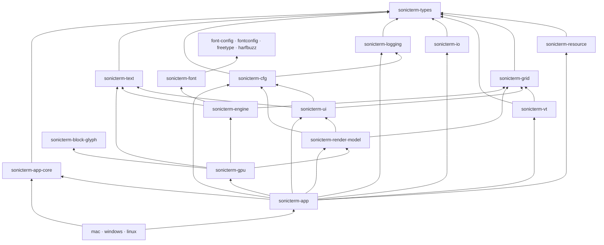

# Crate Reference

[简体中文](Crate-Reference-zh-CN)

This is the canonical map of the 23 Rust crates in the Cargo workspace. The root
`Cargo.toml` supplies their version, edition, Rust version, authors, license, and
repository metadata. `sonicterm-app` is the default workspace member. The
shipping binaries are `sonicterm-mac`, `sonicterm-windows`, and
`sonicterm-linux`; the Linux executable is named `sonicterm`.

## Dependency overview

The diagram shows the main architecture edges. Each entry below gives the exact
first-party Cargo dependencies. Unless an entry says otherwise, these are normal
Cargo dependencies, not build or test dependencies. `sonicterm-logging` additionally
uses `sonicterm-resource` with `test-util` as a dev dependency.
`sonicterm-font`'s `fontconfig` alias is target-gated to Android and non-macOS Unix;
`config`, `freetype`, and `harfbuzz` are library aliases, not extra crates.
The workspace has no first-party build-dependency edge. External build tools and
native link requirements still belong to the FFI and platform crates.

## State and public-interface contracts

Use this table for state owners and public interfaces; use the entries below
for exact dependencies and source paths. Paths are crate-relative unless stated.
Compatibility traits need not drive production, and this is not an unsafe-call audit.

| Crate | Mutable state and lifecycle owner | Public interface and named boundary exceptions |
| --- | --- | --- |
| `sonicterm-types` | Values belong to their callers; no window, PTY, or renderer lifecycle. | `Cell`, `GlyphKey`, `ResourceAmount`, `WindowKey`, and backend-free traits in `src/traits/`; the `Painter` trait is a dormant compatibility seam. |
| `sonicterm-resource` | `ResourceGovernor` shares `Arc<Ledger>`; reservation tokens own charges, and `ReaperSupervisor` owns admitted cleanup tasks. It does not own the charged payloads. | `try_reserve`, `Reservation`, `CommittedReservation`, `snapshot`, and `ReaperSupervisor`; snapshots are observational and GUI process/window limits remain tracking-only. |
| `sonicterm-grid` | Each `Grid` owns visible/history/saved-primary rows, revisions, and dirty bits; `HyperlinkRegistry` separately owns link metadata. The production parser owns the grid. | `Grid::resize`, `revision`, `retained_amount_by_region`, row access, and `Line`; no native handles, PTY transport, or presentation. |
| `sonicterm-vt` | `Parser` owns its `Grid`, parser state, capture buffers, and reply/event state; a pane worker advances it under the pane's parser lock. | `Parser::advance`, `grid`, `grid_mut`, and `VtEvent` in `src/vt.rs`; callbacks produce data, not native-window calls. |
| `sonicterm-io` | `PtyHandle` owns child-process and bounded input/output transport state, cancellation, and reader/writer lifetimes. Drop starts bounded teardown. | `spawn_default_shell`, `send_input_nonblocking`, `PtyInputSender`, `resize`, `out_rx`, and optional `SshHandle`; GUI callers do not own native PTY internals. |
| `sonicterm-cfg` | Callers own loaded `Config`, `Theme`, and `Keymap` values and decide when to replace them. | TOML/asset/URI APIs in `src/{config,theme,keymap,assets,url_scan,url_open}.rs`; `LoggingConfig` is re-exported from logging, and filesystem targets do not enter the URI opener. |
| `sonicterm-logging` | Process subscriber, panic/exit hooks, ring, and artifact workers are logging-owned; the binary retains `LoggingGuard` to keep the appender alive. | `init`, `init_in`, `LoggingConfig`, `install_panic_hook`, and breadcrumb/session APIs; initialization is process-wide, not one subscriber per window. See [Logging](Logging) for persistence scope. |
| `sonicterm-ui` | `App` and `WindowState` hold UI controllers; `CommandPalette` owns its cached text and filtered selection, `TabBar` owns tab identities, and tab-width policy is a process scalar. | `CommandPalette`, `PaletteLayout`, `TabBarLayout`, `PaneTree`, `Selection`, and `I18n`; these compute state/layout without owning native windows or executing actions. |
| `sonicterm-render-model` | Caller-owned frame records borrow live grid state; `InlineImage` shares decoded bytes with `Arc`. No renderer or native lifecycle is owned here. | `PaneRender<'a>`, `PixelRect`, and `HoveredUrlCells`; production retains parser guards through rendering. `boundary::{grid,cfg,ui}` re-exports concrete types unchanged; `RenderInputs` and the dormant `Painter` do not replace the production entrypoint. |
| `sonicterm-text` | CPU `GlyphAtlas` and `RowGlyphCache` own pixels, metadata, and cached instances; their containing renderer controls lifetime and invalidation. | `Rasterizer`, `RasterTile`, `GlyphInstance`, `ShapedGlyph`, and atlas/cache methods; native discovery/shaping/raster objects live in font/engine, not this crate. |
| `sonicterm-font-config` | `ConfigHandle` shares immutable `Arc<Config>` snapshots; a process mutex stores the current handle and generations distinguish replacements. | `configuration`, `use_this_configuration`, `TextStyle`, font attributes, and rasterizer policy; library alias `config` is distinct from `sonicterm-cfg`, and owns no native face. |
| `sonicterm-fontconfig` | Raw Fontconfig ABI exposes native objects; matching wrappers in `sonicterm-font::fcwrap` own references and destruction. | `Fc*` types/functions in `src/lib.rs`; system linking is build-time and the font consumer is target-gated, not a Windows/macOS discovery path. |
| `sonicterm-freetype` | Generated ABI owns no Rust wrapper lifecycle; `sonicterm-font::ftwrap` owns library/face lifetimes and keeps backing sources alive. | `FT_*` bindings and fixed-point helpers; `build.rs` compiles embedded native sources, while callers of raw ABI retain its unsafe obligations. |
| `sonicterm-harfbuzz` | Generated ABI exposes native references; `sonicterm-font::hbwrap` manages buffers, blobs, font references, and their release callbacks. | `hb_*` bindings; the `freetype` dependency aliases `sonicterm-freetype`, and native amalgamation/link setup stays in `build.rs`. |
| `sonicterm-font` | `FontConfiguration` shares thread-confined `Rc` state; `LoadedFont` owns `RefCell` shaping/raster/fallback caches and native wrappers own handle lifetimes. | `FontConfiguration`, `LoadedFont`, locator/shaper/rasterizer traits, `FontMetrics`, and `RasterizedGlyph`; raw `ftwrap` re-exports remain an explicit low-level surface, not a blanket safe-API claim. |
| `sonicterm-engine` | `FontStack` shares `Rc<FontConfiguration>` and owns per-stack size/weight/metric state; the renderer retains the stack. | `FontStack`, `CellMetricsPx`, shaping and atlas-tile conversion; direct grid/text dependencies carry CPU data, not another terminal state owner. |
| `sonicterm-block-glyph` | Callers own returned CPU bitmap tiles; block geometry uses transient raster state, not a shared renderer or font-face owner. | `BlockKey`, `SizedBlockKey`, `block_sprite_with_cell_metrics`, and `glue::BlockRasterTile`; no first-party dependency, with preserved WezTerm attribution. |
| `sonicterm-gpu` | `GpuRenderer` owns per-window surfaces, retained frame, pipelines, atlases, caches, software frame, and font stacks. `GpuSharedContext` shares wgpu-refcounted device/queue handles, not a second device. | `GpuRenderer::new`, `new_with_shared_context`, `render`, `try_resize`, `retained_amounts`, and `live_renderer_count`; UI/grid types cross render-model. The retained report describes this instance, while the live count tracks lifecycle. CPU success is observable; wgpu success here is submit/present invocation. |
| `sonicterm-app-core` | `AppStateMachine` owns backend-free transition/effect values, not live `WindowState`, parser locks, or PTYs. | `AppState`, `AppIntent`, `AppEffect`, `handle`, and effect ordering; production topology remains in App rather than being inferred from this model. |
| `sonicterm-app` | `App` owns live `WindowState` objects, warm renderers, routing, and resource coordination. Each window owns tabs/panes; each pane owns parser/PTY/image state. | `App`, `WindowState`, `PaneState`, `run_action_for_window`, and platform `Shell` wrappers; `try_lock` guards and borrowed grids survive through stateful rendering. Native workers do not resolve UI windows. |
| `sonicterm-mac` | Binary startup retains logging/session guards, installs AppKit hooks, and hands event-loop ownership to `MacShell`. | `src/main.rs` and menu/open-document/drag modules; AppKit calls remain on the main thread, terminal behavior stays in shared app/IO crates. |
| `sonicterm-windows` | Binary startup retains logging/session guards, installs Win32 menu/backdrop/OLE hooks, and runs `WindowsShell`. | `src/main.rs`, CLI and native GUI modules, and WiX assets; PTY/ConPTY process ownership remains in `sonicterm-io`. |
| `sonicterm-linux` | Binary startup owns Linux capability normalization and packaged-font preflight, retains logging/session guards, then runs `LinuxShell`. | `src/main.rs` and package resources; the direct engine dependency serves font preflight, while X11/Wayland windows and terminal state remain app-owned. |

## Contracts and terminal core

### `sonicterm-types`

**Role:** dependency-light contracts shared across the workspace: cells,
geometry, colors, actions, modifier keys, glyph/window/hyperlink identifiers,
shell quoting, resource types, and backend traits.

**First-party dependencies:** none.

**Read:** `src/{cell,action,glyph_key,geom,resource}.rs`, `src/traits/`.

### `sonicterm-resource`

**Role:** process-local resource governor with owner hierarchy, sharded ledger,
RAII reservations, cancellation tokens, and a bounded reaper supervisor.

**First-party dependencies:** `sonicterm-types`.

**Read:** `src/{ledger,owner,reservation,reaper,cancel}.rs`.

### `sonicterm-grid`

**Role:** primary and alternate screens, visible rows, bounded scrollback,
cursor state, wide and combining cells, hyperlinks, prompt regions, dirty rows,
and line storage.

**First-party dependencies:** `sonicterm-types`.

**Read:** `src/{grid,line,hyperlink}.rs`.

### `sonicterm-vt`

**Role:** vte-based ANSI/VT parser and performer. It turns control sequences into
grid changes, terminal replies, and typed events. OSC 7 retains authority and
decoded path separately for host-aware working-directory use.

**First-party dependencies:** `sonicterm-grid`, `sonicterm-types`.

**Read:** `src/vt.rs`, `tests/autowrap/main.rs`,
`tests/control_sequences/main.rs`.

### `sonicterm-io`

**Role:** local PTY and process transport, resize and child cleanup, shell
selection, foreground-process discovery, and the optional SSH backend.

**First-party dependencies:** `sonicterm-types`.

**Feature:** `ssh` enables `russh` and Tokio; it is off by default.

**Read:** `src/{pty,ssh,proc_info,foreground_proc}.rs`.

## Configuration, UI, and frame data

### `sonicterm-logging`

**Role:** tracing sinks, log retention, panic artifacts, fatal-exit markers,
session markers, bounded breadcrumbs, postmortem discovery, and process-memory
sampling.

**First-party dependencies:** `sonicterm-types`; tests additionally use
`sonicterm-resource` with `test-util`.

**Read:** `src/{lib,config,cleanup,crash,exit_trace,breadcrumbs,postmortem,session_state}.rs`.
Detailed fields and procedures belong on [Logging](Logging).

### `sonicterm-cfg`

**Role:** the only parser for `sonicterm.toml`, theme and keymap TOML, dimensions,
asset lookup, typed URI/path detection, and safe URI-open policy.

**First-party dependencies:** `sonicterm-logging`, `sonicterm-types`.

**Read:** `src/{config,theme,keymap,assets,url_scan,url_open,dimension}.rs`.

### `sonicterm-ui`

**Role:** renderer-independent UI state and layout for tabs, panes, command
palette, search, selection, READONLY/copy mode, scrollbar, IME, broadcast,
notifications, and localization.

**First-party dependencies:** `sonicterm-cfg`, `sonicterm-grid`,
`sonicterm-text`, `sonicterm-types`.

On macOS, text editing uses AppKit's string-only attributed-string word-boundary
API for Option deletion, with checked UTF-16/UTF-8 conversion. The target-specific
`objc2-app-kit` and `objc2-foundation` dependencies create no native view or window.
Canonical decomposition uses `unicode-normalization`; terminal encoding stays in
the app rather than in these field-editing operations.

The palette separates metadata, presentation, and execution:

- `command_label::descriptor` defines variant identity, category, localization key,
  English aliases, target requirements, and READONLY allowance. App supplies
  window-local `CommandContext`; `disabled_reason` has no native handles, terminal
  payload, or execution authority. English fallback preserves literal arguments.
- `CommandPalette` caches labels, search text, first-binding hints, and chrome
  with `I18n` at refresh. Locale refresh rebuilds every mode's text; only Commands
  refilters indices. `PaletteLayout` uses cached identity in the frame key, without
  per-frame translation. Fluent count/title phrases split around one internal
  value slot to preserve word order; titles are not interpreted, and the caret
  is appended separately.
- `highlighted` preserves row identity; `current` excludes disabled entries.
  `PaletteEntry` distinguishes commands from `TabId` targets. App resolves a live
  target's current index in the attached window; closure never selects a replacement.
- App refreshes context before input and from the already-held rendering grid.
  Input selection validation uses `try_lock`, never re-locking a render guard.
  Overflow and native/local drop snapshots keep absolute indices. Tab-only mode
  uses the same palette; one modal pointer capture revalidates identity/availability
  on release without stealing an earlier terminal or chrome gesture.

**Read:** `src/{tabs,pane,command_palette,command_label,search,selection,copy_mode,ime,overlays,i18n}.rs`.

### `sonicterm-render-model`

**Role:** renderer-neutral pane, geometry, overlay, and input bundles. It
re-exports grid/config/UI type identities through `boundary::{grid,cfg,ui}` so
the GPU crate has one declared model boundary.

**First-party dependencies:** `sonicterm-cfg`, `sonicterm-grid`,
`sonicterm-types`, `sonicterm-ui`.

**Read:** `src/{pane_render,inputs,geometry,lib}.rs`.

## Text and fonts

### `sonicterm-text`

**Role:** CPU glyph atlas, row glyph cache, shaping records, and the
`GlyphInstance` data consumed by the renderer.

**First-party dependencies:** `sonicterm-types`.

**Read:** `src/{glyph_atlas,row_glyph_cache,shape,lib}.rs`.

### `sonicterm-font-config`

**Role:** font configuration value model: text styles, attributes, weights,
stretches, rasterizer selection, and policy. Its Rust library name is `config`.

**First-party dependencies:** none.

**Feature:** `distro-defaults` changes platform/distribution defaults.

**Read:** `src/lib.rs`.

### `sonicterm-fontconfig`

**Role:** generated Fontconfig ABI plus the build/link shim used for Android and
non-macOS Unix font discovery. `build.rs` probes system Fontconfig through
pkg-config.

**First-party dependencies:** none.

**Read:** `build.rs`, generated `src/lib.rs`.

### `sonicterm-freetype`

**Role:** generated FreeType ABI and fixed-point helpers. `build.rs` compiles the
embedded zlib, libpng, and FreeType sources and exports their build paths.

**First-party dependencies:** none.

**Read:** `build.rs`, `bindings.h`, `src/{lib,types,fixed_point}.rs`.

### `sonicterm-harfbuzz`

**Role:** generated HarfBuzz ABI. `build.rs` compiles the embedded HarfBuzz C++
amalgamation against the FreeType build. Native atomics, mutexes, and thread-safe
static initialization stay enabled: independent font objects on different threads
still share HarfBuzz callback tables. The font wrapper tests exercise concurrent
creation and teardown without sharing mutable font objects.

**First-party dependencies:** `sonicterm-freetype` under the dependency alias
`freetype`.

**Read:** `build.rs`, `bindings.h`, generated `src/lib.rs`.

### `sonicterm-font`

**Role:** safe font discovery and matching, HarfBuzz shaping, fallback,
FreeType/DirectWrite/HarfBuzz rasterization, COLR glyphs, and native-handle
wrappers.

**First-party dependencies:** `sonicterm-font-config` as `config`,
`sonicterm-freetype` as `freetype`, and `sonicterm-harfbuzz` as `harfbuzz`;
Android and non-macOS Unix builds also use `sonicterm-fontconfig` as
`fontconfig`.

**Read:** `src/db.rs`, `src/locator/`, `src/shaper/`, `src/rasterizer/`,
`src/{ftwrap,hbwrap,fcwrap,parser}.rs`.

### `sonicterm-engine`

**Role:** small font-facing engine seam. `FontStack` turns shaping and raster
results into cell metrics and atlas `RasterTile`s.

**First-party dependencies:** `sonicterm-font-config` as `config`,
`sonicterm-font`, `sonicterm-grid`, `sonicterm-text`, `sonicterm-types`.

**Read:** `src/fontstack.rs`.

### `sonicterm-block-glyph`

**Role:** geometry and rasterization for box drawing, block elements,
Powerline, Braille, sextants, octants, and synthetic terminal symbols.

**First-party dependencies:** none.

**Read:** `src/{lib,glue,customglyph}.rs`; attribution is in
`LICENSE-WEZTERM`.

## Renderer and application

### `sonicterm-gpu`

**Role:** wgpu device and surface owner, frame assembly, dirty-row damage, quad
and glyph emission, atlas upload, retained frames, software-adapter detection,
and Windows CPU presentation data.

**First-party dependencies:** `sonicterm-block-glyph`, `sonicterm-engine`,
`sonicterm-render-model`, `sonicterm-text`, `sonicterm-types`.

The private `FramePlan` composes frame identity, mode, damage, pane clips,
viewport slots, and expected revisions from metadata. Production consumes it
while retaining borrowed grids, parser guards, and stateful atlas/cache work;
it is not a snapshot or threaded renderer boundary.

**Read:** `src/{core,frame_plan,atlas_upload,row_quad_cache,chrome_text,cursor,color,software_windows}.rs`.

### `sonicterm-app-core`

**Role:** backend-free `AppIntent`, `AppEffect`, `AppState`, reducer, stable
effect ordering, and state machine. Live window/tab/pane topology remains in
`sonicterm-app`.

**First-party dependencies:** `sonicterm-types`.

**Read:** `src/{app_state,intent,effect,reducer,state_machine}.rs`.

### `sonicterm-app`

**Role:** cross-platform winit orchestration for windows, renderers, tabs,
panes, PTYs/parsers, input, config reload, redraw, overlays, tab transfer,
bounded target probes, and native direct-open dispatch.

**First-party dependencies:** `sonicterm-app-core`, `sonicterm-cfg`,
`sonicterm-gpu`, `sonicterm-grid`, `sonicterm-io`, `sonicterm-logging`,
`sonicterm-render-model`, `sonicterm-resource`, `sonicterm-text`,
`sonicterm-types`, `sonicterm-ui`, `sonicterm-vt`.

**Feature:** `ssh` forwards to `sonicterm-io/ssh`. The GUI does not complete a
live SSH connection.

**Read:** `src/app/mod.rs`,
`src/app/{event_loop,window_event,spawn_pane,keymap_dispatch,path_target,tear_out}.rs`,
`src/shell.rs`.

## Platform crates

### `sonicterm-mac`

**Role:** macOS binary and AppKit glue: startup, NSMenu, open-document events,
NSPasteboard tab handoff, NSWindow setup, and bundle entry point.

**First-party dependencies:** `sonicterm-app`, `sonicterm-app-core`,
`sonicterm-cfg`, `sonicterm-logging`.

**Read:** `src/{main,menubar,open_documents,os_drag_mac,tab_drag_os}.rs`.
Native details belong on [Platform Integration](Platform-Integration).

### `sonicterm-windows`

**Role:** Windows binary and Win32 GUI glue: DPI setup, CLI, `muda` menu, DWM
backdrop, OLE tab drag/drop, software presentation support, Win32 resources, and
WiX metadata. ConPTY remains behind `sonicterm-io`.

**First-party dependencies:** `sonicterm-app`, `sonicterm-app-core`,
`sonicterm-cfg`, `sonicterm-logging`, `sonicterm-types`.

**Read:** `src/{main,cli,startup,backdrop,menubar,os_drag_win,software_presenter}.rs`,
`build.rs`, `wix/main.wxs`.

### `sonicterm-linux`

**Role:** shipping Linux `sonicterm` binary: X11/Wayland identity, capability
normalization, diagnostics, packaged-font preflight, and desktop/AppStream
metadata.

**First-party dependencies:** `sonicterm-app`, `sonicterm-app-core`,
`sonicterm-cfg`, `sonicterm-engine`, `sonicterm-logging`.

**Read:** `src/main.rs`, `resources/`.

Every crate has a local `CLAUDE.md` with its guardrails and local gate. Package
layouts belong on [Packaging](Packaging); CI and release behavior belong on
[Development and Release](Development-and-Release).
