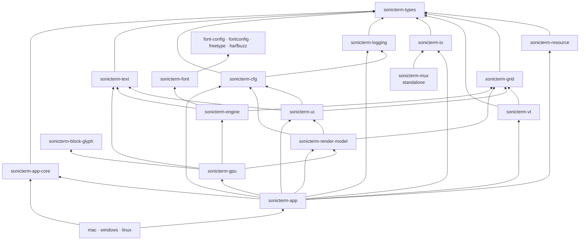

# Crate Reference / Crate 参考

## English

This is the canonical map of the 24 Rust crates in the Cargo workspace. The root
`Cargo.toml` supplies their version, edition, Rust version, authors, license, and
repository metadata. `sonicterm-app` is the default workspace member. The
shipping binaries are `sonicterm-mac`, `sonicterm-windows`, and
`sonicterm-linux`; the Linux executable is named `sonicterm`.

## Dependency overview

The diagram shows the main architecture edges. Each entry below gives the exact
first-party Cargo dependencies.

## Contracts and terminal core

### `sonicterm-types`

**Role:** dependency-light contracts shared across the workspace: cells,
geometry, colors, actions, modifier keys, glyph/window/hyperlink identifiers,
shell quoting, resource types, and backend traits.

**First-party dependencies:** none.

**Read:** `src/{cell,action,glyph_key,geom,resource}.rs`, `src/traits/`.

### `sonicterm-resource`

**Role:** process-local resource governor with owner hierarchy, sharded ledger,
RAII reservations, cancellation tokens, and a bounded reaper supervisor.

**First-party dependencies:** `sonicterm-types`.

**Read:** `src/{ledger,owner,reservation,reaper,cancel}.rs`.

### `sonicterm-grid`

**Role:** primary and alternate screens, visible rows, bounded scrollback,
cursor state, wide and combining cells, hyperlinks, prompt regions, dirty rows,
and line storage.

**First-party dependencies:** `sonicterm-types`.

**Read:** `src/{grid,line,hyperlink}.rs`.

### `sonicterm-vt`

**Role:** vte-based ANSI/VT parser and performer. It turns control sequences into
grid changes, terminal replies, and typed events. OSC 7 retains authority and
decoded path separately for host-aware working-directory use.

**First-party dependencies:** `sonicterm-grid`, `sonicterm-types`.

**Read:** `src/vt.rs`, `tests/autowrap/main.rs`,
`tests/control_sequences/main.rs`.

### `sonicterm-io`

**Role:** local PTY and process transport, resize and child cleanup, shell
selection, foreground-process discovery, and the optional SSH backend.

**First-party dependencies:** `sonicterm-types`.

**Feature:** `ssh` enables `russh` and Tokio; it is off by default.

**Read:** `src/{pty,ssh,proc_info,foreground_proc}.rs`.

## Configuration, UI, and frame data

### `sonicterm-logging`

**Role:** tracing sinks, log retention, panic artifacts, fatal-exit markers,
session markers, bounded breadcrumbs, postmortem discovery, and process-memory
sampling.

**First-party dependencies:** `sonicterm-types`; tests additionally use
`sonicterm-resource` with `test-util`.

**Read:** `src/{lib,config,cleanup,crash,exit_trace,breadcrumbs,postmortem,session_state}.rs`.
Detailed fields and procedures belong on [Logging](Logging).

### `sonicterm-cfg`

**Role:** the only parser for `sonicterm.toml`, theme and keymap TOML, dimensions,
asset lookup, typed URI/path detection, and safe URI-open policy.

**First-party dependencies:** `sonicterm-logging`, `sonicterm-types`.

**Read:** `src/{config,theme,keymap,assets,url_scan,url_open,dimension}.rs`.

### `sonicterm-ui`

**Role:** renderer-independent UI state and layout for tabs, panes, command
palette, search, selection, READONLY/copy mode, scrollbar, IME, broadcast,
notifications, and localization.

**First-party dependencies:** `sonicterm-cfg`, `sonicterm-grid`,
`sonicterm-text`, `sonicterm-types`.

**Read:** `src/{tabs,pane,command_palette,search,selection,copy_mode,ime,overlays,i18n}.rs`.

### `sonicterm-render-model`

**Role:** renderer-neutral pane, geometry, overlay, and input bundles. It
re-exports grid/config/UI type identities through `boundary::{grid,cfg,ui}` so
the GPU crate has one declared model boundary.

**First-party dependencies:** `sonicterm-cfg`, `sonicterm-grid`,
`sonicterm-types`, `sonicterm-ui`.

**Read:** `src/{pane_render,inputs,geometry,lib}.rs`.

## Text and fonts

### `sonicterm-text`

**Role:** CPU glyph atlas, row glyph cache, shaping records, and the
`GlyphInstance` data consumed by the renderer.

**First-party dependencies:** `sonicterm-types`.

**Read:** `src/{glyph_atlas,row_glyph_cache,shape,lib}.rs`.

### `sonicterm-font-config`

**Role:** font configuration value model: text styles, attributes, weights,
stretches, rasterizer selection, and policy. Its Rust library name is `config`.

**First-party dependencies:** none.

**Feature:** `distro-defaults` changes platform/distribution defaults.

**Read:** `src/lib.rs`.

### `sonicterm-fontconfig`

**Role:** generated Fontconfig ABI plus the build/link shim used for Android and
non-macOS Unix font discovery. `build.rs` probes system Fontconfig through
pkg-config.

**First-party dependencies:** none.

**Read:** `build.rs`, generated `src/lib.rs`.

### `sonicterm-freetype`

**Role:** generated FreeType ABI and fixed-point helpers. `build.rs` compiles the
embedded zlib, libpng, and FreeType sources and exports their build paths.

**First-party dependencies:** none.

**Read:** `build.rs`, `bindings.h`, `src/{lib,types,fixed_point}.rs`.

### `sonicterm-harfbuzz`

**Role:** generated HarfBuzz ABI. `build.rs` compiles the embedded HarfBuzz C++
amalgamation against the FreeType build.

**First-party dependencies:** `sonicterm-freetype` under the dependency alias
`freetype`.

**Read:** `build.rs`, `bindings.h`, generated `src/lib.rs`.

### `sonicterm-font`

**Role:** safe font discovery and matching, HarfBuzz shaping, fallback,
FreeType/DirectWrite/HarfBuzz rasterization, COLR glyphs, and native-handle
wrappers.

**First-party dependencies:** `sonicterm-font-config` as `config`,
`sonicterm-freetype` as `freetype`, and `sonicterm-harfbuzz` as `harfbuzz`;
Android and non-macOS Unix builds also use `sonicterm-fontconfig` as
`fontconfig`.

**Features:** `vendor-jetbrains`, `vendor-nerd-font-symbols`,
`vendor-noto-emoji`, and `vendor-roboto` compatibility switches.

**Read:** `src/db.rs`, `src/locator/`, `src/shaper/`, `src/rasterizer/`,
`src/{ftwrap,hbwrap,fcwrap,parser}.rs`.

### `sonicterm-engine`

**Role:** small font-facing engine seam. `FontStack` turns shaping and raster
results into cell metrics and atlas `RasterTile`s.

**First-party dependencies:** `sonicterm-font-config` as `config`,
`sonicterm-font`, `sonicterm-grid`, `sonicterm-text`, `sonicterm-types`.

**Read:** `src/fontstack.rs`.

### `sonicterm-block-glyph`

**Role:** geometry and rasterization for box drawing, block elements,
Powerline, Braille, sextants, octants, and synthetic terminal symbols.

**First-party dependencies:** none.

**Read:** `src/{lib,glue,customglyph}.rs`; attribution is in
`LICENSE-WEZTERM`.

## Renderer and application

### `sonicterm-gpu`

**Role:** wgpu device and surface owner, frame assembly, dirty-row damage, quad
and glyph emission, atlas upload, retained frames, software-adapter detection,
and Windows CPU presentation data.

**First-party dependencies:** `sonicterm-block-glyph`, `sonicterm-engine`,
`sonicterm-render-model`, `sonicterm-text`, `sonicterm-types`.

**Read:** `src/{core,atlas_upload,row_quad_cache,chrome_text,cursor,color,software_windows}.rs`.

### `sonicterm-app-core`

**Role:** backend-free `AppIntent`, `AppEffect`, `AppState`, reducer, stable
effect ordering, and state machine. Live window/tab/pane topology remains in
`sonicterm-app`.

**First-party dependencies:** `sonicterm-types`.

**Read:** `src/{app_state,intent,effect,reducer,state_machine}.rs`.

### `sonicterm-app`

**Role:** cross-platform winit orchestration for windows, renderers, tabs,
panes, PTYs/parsers, input, config reload, redraw, overlays, tab transfer,
bounded target probes, and native direct-open dispatch.

**First-party dependencies:** `sonicterm-app-core`, `sonicterm-cfg`,
`sonicterm-gpu`, `sonicterm-grid`, `sonicterm-io`, `sonicterm-logging`,
`sonicterm-render-model`, `sonicterm-resource`, `sonicterm-text`,
`sonicterm-types`, `sonicterm-ui`, `sonicterm-vt`.

**Feature:** `ssh` forwards to `sonicterm-io/ssh`. The GUI does not complete a
live SSH connection.

**Read:** `src/app/mod.rs`,
`src/app/{event_loop,window_event,spawn_pane,keymap_dispatch,path_target,tear_out}.rs`,
`src/shell.rs`.

## Platform and standalone crates

### `sonicterm-mac`

**Role:** macOS binary and AppKit glue: startup, NSMenu, open-document events,
NSPasteboard tab handoff, NSWindow setup, and bundle entry point.

**First-party dependencies:** `sonicterm-app`, `sonicterm-app-core`,
`sonicterm-cfg`, `sonicterm-logging`.

**Read:** `src/{main,menubar,open_documents,os_drag_mac,tab_drag_os}.rs`.
Native details belong on [Platform Integration](Platform-Integration).

### `sonicterm-windows`

**Role:** Windows binary and Win32 GUI glue: DPI setup, CLI, `muda` menu, DWM
backdrop, OLE tab drag/drop, software presentation support, Win32 resources, and
WiX metadata. ConPTY remains behind `sonicterm-io`.

**First-party dependencies:** `sonicterm-app`, `sonicterm-app-core`,
`sonicterm-cfg`, `sonicterm-logging`, `sonicterm-types`.

**Read:** `src/{main,cli,startup,backdrop,menubar,os_drag_win,software_presenter}.rs`,
`build.rs`, `wix/main.wxs`.

### `sonicterm-linux`

**Role:** shipping Linux `sonicterm` binary: X11/Wayland identity, capability
normalization, diagnostics, packaged-font preflight, and desktop/AppStream
metadata.

**First-party dependencies:** `sonicterm-app`, `sonicterm-app-core`,
`sonicterm-cfg`, `sonicterm-engine`, `sonicterm-logging`.

**Read:** `src/main.rs`, `resources/`.

### `sonicterm-mux`

**Role:** standalone persistent-PTY multiplexer daemon with a framed bincode
protocol, raw-byte replay ring, and attach/input/resize/kill operations. It is a
workspace crate, is not consumed by the GUI, and is not included in release
packages.

**First-party dependencies:** `sonicterm-io`.

**Read:** `src/{main,proto,frame,server}.rs`.

Every crate has a local `CLAUDE.md` with its guardrails and local gate. Package
layouts belong on [Packaging](Packaging); CI and release behavior belong on
[Development and Release](Development-and-Release).

## 中文

本页是 Cargo workspace 中 24 个 Rust crate 的规范映射。根 `Cargo.toml`
统一提供版本、edition、Rust 版本、作者、许可证和仓库信息。默认 workspace member
是 `sonicterm-app`。发布的二进制 crate 是 `sonicterm-mac`、
`sonicterm-windows` 和 `sonicterm-linux`；Linux 可执行文件名为 `sonicterm`。

## 依赖概览

图中只画主要架构依赖。下方每个条目列出准确的第一方 Cargo 依赖。

## 契约与终端核心

### `sonicterm-types`

**职责：** 供整个 workspace 共用的轻量契约，包括单元格、几何、颜色、操作、
修饰键、字形/窗口/超链接标识、shell 引用、资源类型和后端 trait。

**第一方依赖：** 无。

**阅读：** `src/{cell,action,glyph_key,geom,resource}.rs`、`src/traits/`。

### `sonicterm-resource`

**职责：** 进程内资源治理器，包含 owner 层级、分片账本、自动释放的 RAII
预留、取消 token 和有界回收任务管理器。

**第一方依赖：** `sonicterm-types`。

**阅读：** `src/{ledger,owner,reservation,reaper,cancel}.rs`。

### `sonicterm-grid`

**职责：** 主屏幕和备用屏幕、可见行、有界回滚缓冲、光标、宽字符和组合字符、
超链接、提示区、脏行与行存储。

**第一方依赖：** `sonicterm-types`。

**阅读：** `src/{grid,line,hyperlink}.rs`。

### `sonicterm-vt`

**职责：** 基于 vte 的 ANSI/VT 解析器与执行器，把控制序列转换为网格修改、
终端回复和类型化事件。OSC 7 会分别保留主机 authority 与解码后的路径，供需要
识别主机的工作目录逻辑使用。

**第一方依赖：** `sonicterm-grid`、`sonicterm-types`。

**阅读：** `src/vt.rs`、`tests/autowrap/main.rs`、
`tests/control_sequences/main.rs`。

### `sonicterm-io`

**职责：** 本地 PTY 与进程传输、调整大小和子进程清理、shell 选择、前台进程
发现，以及可选 SSH 后端。

**第一方依赖：** `sonicterm-types`。

**Feature：** `ssh` 会启用 `russh` 和 Tokio，默认关闭。

**阅读：** `src/{pty,ssh,proc_info,foreground_proc}.rs`。

## 配置、界面与帧数据

### `sonicterm-logging`

**职责：** tracing 输出、日志保留、panic 工件、致命退出标记、会话标记、
有界诊断记录、事后证据发现和进程内存采样。

**第一方依赖：** `sonicterm-types`；测试还以 `test-util` 使用
`sonicterm-resource`。

**阅读：** `src/{lib,config,cleanup,crash,exit_trace,breadcrumbs,postmortem,session_state}.rs`。
具体字段和排查方法见[日志](Logging)。

### `sonicterm-cfg`

**职责：** 唯一负责解析 `sonicterm.toml`、主题和键位 TOML、尺寸、资源查找、
类型化 URI/路径识别，以及安全 URI 打开策略。

**第一方依赖：** `sonicterm-logging`、`sonicterm-types`。

**阅读：** `src/{config,theme,keymap,assets,url_scan,url_open,dimension}.rs`。

### `sonicterm-ui`

**职责：** 与渲染器无关的界面状态和布局，包括标签页、窗格、命令面板、搜索、
选区、READONLY/复制模式、滚动条、输入法、广播、通知和本地化。

**第一方依赖：** `sonicterm-cfg`、`sonicterm-grid`、`sonicterm-text`、
`sonicterm-types`。

**阅读：** `src/{tabs,pane,command_palette,search,selection,copy_mode,ime,overlays,i18n}.rs`。

### `sonicterm-render-model`

**职责：** 与具体渲染器无关的窗格、几何、覆盖层和输入数据。它通过
`boundary::{grid,cfg,ui}` 重新导出网格、配置和界面类型，让 GPU crate 只依赖一条
明确的模型边界。

**第一方依赖：** `sonicterm-cfg`、`sonicterm-grid`、`sonicterm-types`、
`sonicterm-ui`。

**阅读：** `src/{pane_render,inputs,geometry,lib}.rs`。

## 文本与字体

### `sonicterm-text`

**职责：** CPU 字形图集、行级字形缓存、塑形记录，以及渲染器使用的
`GlyphInstance` 数据。

**第一方依赖：** `sonicterm-types`。

**阅读：** `src/{glyph_atlas,row_glyph_cache,shape,lib}.rs`。

### `sonicterm-font-config`

**职责：** 字体配置值模型，包括文本样式、属性、字重、宽度、光栅器选择和策略。
Rust library 名为 `config`。

**第一方依赖：** 无。

**Feature：** `distro-defaults` 调整平台或发行版默认值。

**阅读：** `src/lib.rs`。

### `sonicterm-fontconfig`

**职责：** 生成的 Fontconfig ABI，以及 Android 和非 macOS Unix 字体发现所用的
构建/链接封装。`build.rs` 通过 pkg-config 探测系统 Fontconfig。

**第一方依赖：** 无。

**阅读：** `build.rs`、生成的 `src/lib.rs`。

### `sonicterm-freetype`

**职责：** 生成的 FreeType ABI 和定点数工具。`build.rs` 编译内嵌的 zlib、libpng
与 FreeType，并导出构建路径。

**第一方依赖：** 无。

**阅读：** `build.rs`、`bindings.h`、`src/{lib,types,fixed_point}.rs`。

### `sonicterm-harfbuzz`

**职责：** 生成的 HarfBuzz ABI。`build.rs` 针对 FreeType 构建结果编译内嵌的
HarfBuzz C++ 合并源码。

**第一方依赖：** 以依赖别名 `freetype` 使用 `sonicterm-freetype`。

**阅读：** `build.rs`、`bindings.h`、生成的 `src/lib.rs`。

### `sonicterm-font`

**职责：** 安全的字体发现和匹配、HarfBuzz 塑形、回退、
FreeType/DirectWrite/HarfBuzz 光栅化、COLR 字形和原生 handle 封装。

**第一方依赖：** 以 `config` 使用 `sonicterm-font-config`，以 `freetype` 使用
`sonicterm-freetype`，以 `harfbuzz` 使用 `sonicterm-harfbuzz`；Android 和非 macOS
Unix 构建还以 `fontconfig` 使用 `sonicterm-fontconfig`。

**Features：** `vendor-jetbrains`、`vendor-nerd-font-symbols`、
`vendor-noto-emoji`、`vendor-roboto` 兼容开关。

**阅读：** `src/db.rs`、`src/locator/`、`src/shaper/`、`src/rasterizer/`、
`src/{ftwrap,hbwrap,fcwrap,parser}.rs`。

### `sonicterm-engine`

**职责：** 小型字体引擎边界。`FontStack` 把塑形与光栅结果转换为单元格尺寸和
图集 `RasterTile`。

**第一方依赖：** 以 `config` 使用 `sonicterm-font-config`，另依赖
`sonicterm-font`、`sonicterm-grid`、`sonicterm-text`、`sonicterm-types`。

**阅读：** `src/fontstack.rs`。

### `sonicterm-block-glyph`

**职责：** 方框线、块元素、Powerline、Braille、六分块、八分块和合成终端符号的
几何与光栅化。

**第一方依赖：** 无。

**阅读：** `src/{lib,glue,customglyph}.rs`；来源说明见 `LICENSE-WEZTERM`。

## 渲染与应用

### `sonicterm-gpu`

**职责：** wgpu 设备与 surface、帧组装、脏行损伤、quad 与字形输出、图集上传、
保留帧、软件 adapter 检测，以及 Windows CPU 呈现数据。

**第一方依赖：** `sonicterm-block-glyph`、`sonicterm-engine`、
`sonicterm-render-model`、`sonicterm-text`、`sonicterm-types`。

**阅读：** `src/{core,atlas_upload,row_quad_cache,chrome_text,cursor,color,software_windows}.rs`。

### `sonicterm-app-core`

**职责：** 不依赖后端的 `AppIntent`、`AppEffect`、`AppState`、reducer、稳定的
effect 顺序和状态机。实时窗口/标签页/窗格结构仍由 `sonicterm-app` 持有。

**第一方依赖：** `sonicterm-types`。

**阅读：** `src/{app_state,intent,effect,reducer,state_machine}.rs`。

### `sonicterm-app`

**职责：** 跨平台 winit 编排，管理窗口、渲染器、标签页、窗格、PTY/解析器、
输入、配置重载、重绘、覆盖层、标签页转移、有界目标探测和原生直接打开。

**第一方依赖：** `sonicterm-app-core`、`sonicterm-cfg`、`sonicterm-gpu`、
`sonicterm-grid`、`sonicterm-io`、`sonicterm-logging`、
`sonicterm-render-model`、`sonicterm-resource`、`sonicterm-text`、
`sonicterm-types`、`sonicterm-ui`、`sonicterm-vt`。

**Feature：** `ssh` 转发到 `sonicterm-io/ssh`。GUI 尚不能完成实时 SSH 连接。

**阅读：** `src/app/mod.rs`、
`src/app/{event_loop,window_event,spawn_pane,keymap_dispatch,path_target,tear_out}.rs`、
`src/shell.rs`。

## 平台与独立 crate

### `sonicterm-mac`

**职责：** macOS 二进制与 AppKit 胶水，包括启动、NSMenu、打开文档事件、
NSPasteboard 标签页交接、NSWindow 设置和 app bundle 入口。

**第一方依赖：** `sonicterm-app`、`sonicterm-app-core`、`sonicterm-cfg`、
`sonicterm-logging`。

**阅读：** `src/{main,menubar,open_documents,os_drag_mac,tab_drag_os}.rs`。
原生边界见[平台集成](Platform-Integration)。

### `sonicterm-windows`

**职责：** Windows 二进制与 Win32 界面胶水，包括 DPI 设置、CLI、`muda` 菜单、
DWM backdrop、OLE 标签页拖放、软件呈现支持、Win32 资源和 WiX metadata。
ConPTY 仍封装在 `sonicterm-io` 后。

**第一方依赖：** `sonicterm-app`、`sonicterm-app-core`、`sonicterm-cfg`、
`sonicterm-logging`、`sonicterm-types`。

**阅读：** `src/{main,cli,startup,backdrop,menubar,os_drag_win,software_presenter}.rs`、
`build.rs`、`wix/main.wxs`。

### `sonicterm-linux`

**职责：** 发布用 Linux `sonicterm` 二进制，包括 X11/Wayland identity、能力收敛、
诊断、打包字体预检和 desktop/AppStream metadata。

**第一方依赖：** `sonicterm-app`、`sonicterm-app-core`、`sonicterm-cfg`、
`sonicterm-engine`、`sonicterm-logging`。

**阅读：** `src/main.rs`、`resources/`。

### `sonicterm-mux`

**职责：** 独立的持久 PTY multiplexer daemon，提供 framed bincode 协议、原始字节
回放环，以及 attach/input/resize/kill 操作。它属于 workspace，但 GUI 不依赖它，
发布包也不包含它。

**第一方依赖：** `sonicterm-io`。

**阅读：** `src/{main,proto,frame,server}.rs`。

每个 crate 都有本地 `CLAUDE.md`，记录约束和本地 gate。安装包布局见[打包](Packaging)；
CI 与发布行为见[开发与发布](Development-and-Release)。
