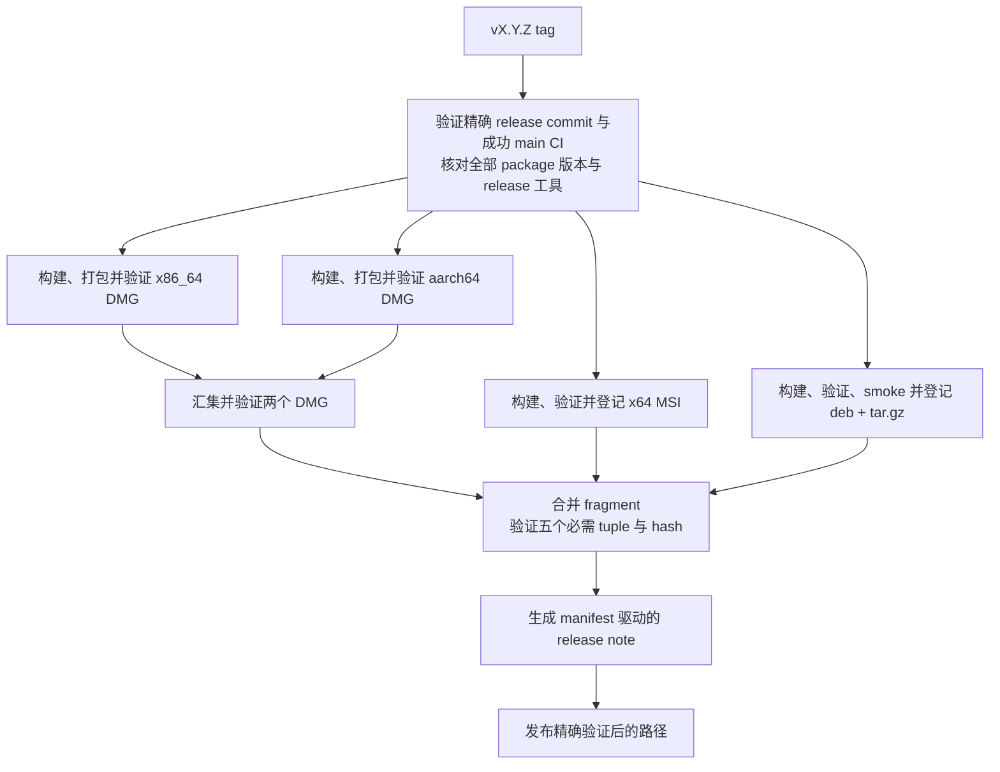
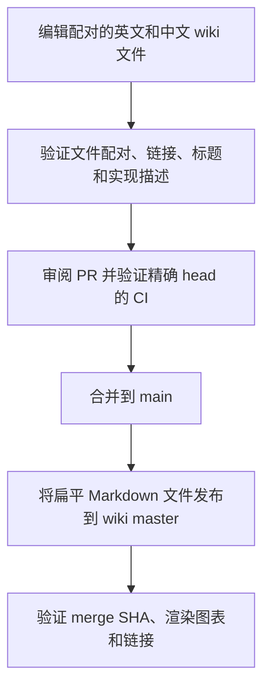

# 开发与发布

[English](Development-and-Release)

提交 PR 前运行下方完整本地 gate；合并前要求准确 head 的各平台 CI 成功，合并后验证
Wiki 发布。Release tag 另需授权和精确成功的 `main` CI。本地打包见[打包](Packaging-zh-CN)，
crate 职责见[Crate 参考](Crate-Reference-zh-CN)。

## 仓库与工具链

```text
Cargo.toml     workspace member、共享 package metadata、依赖、profile、lint
crates/        23 个第一方 Rust crate
assets/        字体、主题、键位、图标、本地化、截图
wiki/          规范双语文档
scripts/       扁平的第一方 shell 与 PowerShell 自动化
.github/       CI、release、Wiki 发布、issue、PR 与依赖自动化
```

Workspace 使用 resolver 2、Rust edition 2021，最低 Rust 版本为 1.95。
`rust-toolchain.toml` 选择 stable，并安装 rustfmt 与 clippy。权威版本位于
`Cargo.toml [workspace.package].version`；所有 workspace package 与内部 path requirement
都使用该版本。

请在对应原生主机上构建或运行平台入口：

```sh
cargo build
cargo run -p sonicterm-mac       # macOS
cargo run -p sonicterm-windows   # Windows
cargo run -p sonicterm-linux     # Linux；可执行文件名为 sonicterm
```

每个第一方 workspace crate 都有本地 `CLAUDE.md`。单元测试采用扁平 sibling 形式 `foo.rs` +
`foo_tests.rs`，并由 `#[cfg(test)] #[path = "foo_tests.rs"] mod foo_tests;` 声明。
Crate root 使用 `lib_tests.rs` 或 `main_tests.rs`；`tests/` 只用于通过 public API 或跨
crate 行为的 integration test。`sonicterm-ui` 与 `sonicterm-render-model` 的 crate-root
测试会清点每个直接源码模块，并要求它具有准确的 sibling 声明或一条非空的显式豁免说明。
已声明的 sibling 文件必须存在且包含 `#[test]`；源码目录模块会使这项扁平清单失败。模块一旦
获得自己的 sibling suite，对应豁免就会立即变为过期并使测试失败。

对捕获到的 tracing 输出做断言的测试使用 `sonicterm_logging::test_capture`。
它的 `with_default` 包装保留每个测试自己的 subscriber、filter 和 sink，同时用一个不记录事件的
进程全局 dispatcher，避免未捕获线程的首次调用把调用点禁用。捕获范围之外的线程仍不接收事件。
不要在同一个测试进程中将此辅助模块与生产日志初始化混用。

## 原生依赖维护

`scripts/native-dependencies.json` 是内嵌原生库及固定版本 winit 源码的机器可读清单。每个条目固定上游
发布提交、归档校验和、明确的源码子集、在该发布之上携带的上游修复，以及完整导入源码树
的摘要。`upstream_fixes` 记录只表示来源：完整的上游修订号和可供阅读的 URL。仓库不再
保存本地补丁文件，因为 SonicTerm 构建的事实来源是已导入的第三方源码本身，而不是
「归档加补丁序列」。保留必需源码、头文件、许可证和变更日志；不需要的上游示例及 CI
目录不属于构建输入。这独立于 Cargo.lock 和由平台提供的 Cairo/Fontconfig。

`crates/sonicterm-winit` 保留上游 winit 0.30.13 的 Windows/macOS/Linux 源码子集，
以及仅 Windows 使用的原生按键元数据扩展。包名仍为 `winit`，不属于第一方 workspace
成员；目录名不表示它采用 SonicTerm 的版本号。Cargo 固定该版本并通过 patch 指向本地
源码。保留共享代码、桌面后端、必需测试数据、单元测试、Send/Sync/serde 集成测试和
Apache-2.0 许可证；不保留示例、仅供示例使用的开发依赖、历史文档以及
Android/iOS/Web/Redox 后端，不支持的目标会被拒绝。

源码清单保留原始归档校验和及上游修订号，记录导入子集，并固定本地树中每个文件的
摘要。子集列表不会让额外文件逃过验证。修改过的上游文件携带本地修改声明，不将这些
修改列为上游修复。Apache-2.0 许可证随各桌面安装包分发，见[打包](Packaging-zh-CN)。

保留的 winit 上游源码不参加第一方 authored-comment 扫描；自行编写的键盘同级测试
仍接受检查。审查者逐一检查混合上游文件中修改的代码块是否具备用途、安全与控制流说明。
源码树摘要能发现字节漂移，但不能代替该审查。每种桌面主机的 gate 都显式运行该依赖
启用 `serde` 的单元及集成测试，以及将警告视为错误的 Rustdoc，因为 workspace 排除
也会使它不参加 workspace 测试与文档生成。Windows 包含原生元数据单元测试。
两次调用均使用 `--locked` 和子集独立精简后的 `Cargo.lock`；只检查 workspace lockfile
不能覆盖这套依赖图。构建产物写入仓库的 target 目录，不写入固定的源码树。

验证工具只使用 Python 标准库，不访问网络，且只做检查：

```sh
python3 scripts/native-dependencies.py check
python3 scripts/native-dependencies.py check --library freetype
python3 scripts/native-dependencies_tests.py
```

`check` 拒绝缺失、修改或额外的第三方文件，拒绝未固定的源码树摘要，拒绝仍声明已废弃
`patches` 键的清单条目，也拒绝缺少修订号或 URL、或指向本地文件的 `upstream_fixes`
记录。摘要包含路径和原始字节，不包含可执行位及空目录。`.gitattributes` 对第三方源码树
关闭换行转换，使 Windows 检查相同的上游字节。

摘要一致只证明工作副本仍是经过审查并提交的那些字节；它不等于发布者身份验证，也不证明
不存在漏洞，后者来自清单记录的基础发布版本，以及在上游逐条阅读所记录的修复。本工具没有
任何命令可以重建带本地补丁的源码树，也不会假装具备该能力。

每次以单个库为单位进行可审查的更新：

1. 阅读官方发布和安全公告，包括新版本引入的回归。验证发布者/来源和可用签名或独立
   发布的校验和，记录验证限制。新版本不自动等于已修复版本，不使用浮动分支或无人审核导入。
2. 用不可变发布身份和已验证的归档摘要更新清单条目。把每个必需上游修复记录为完整修订号
   和 URL，并在上游审查其前置条件。仅在证明新版本已包含该修复后才移除记录，不禁用无关
   原生功能。
3. 单独下载清单记录的归档并在仓库之外解包。手工导入记录的源码子集，并依据上游提交本身
   逐条应用所记录的上游修复——与所导入的发布版本比对，而不是与仓库内的副本比对。将结果
   与当前第三方目录做差异比较，只替换干净的对应目录；审查该差异后，再把 `check` 输出的
   摘要填入新的 `tree_sha256`。核对新增/删除的 C/C++ 文件和 `build.rs`；导入成功不是
   编译成功。
4. 更新 FreeType/HarfBuzz 时，用 `cargo install bindgen-cli --version 0.71.1 --locked`
   安装工具，再运行 `bash scripts/regenerate-freetype.sh` 或
   `bash scripts/regenerate-harfbuzz.sh`。`BINDGEN` 可指定单独安装的相同版本可执行文件。
   两个脚本编译小型 `scripts/freetype-config.rs` 辅助程序，复用构建时的配置头文件。
   审查 ABI 与行为变化，不能只改版本号；重新生成必须保留 crate 自有模块和测试。
5. 运行离线检查、原生 crate 测试、完整本地 gate，以及正常颜色配置下的原生渲染检查；
   配置/日志使用独立临时目录并保留 HOME。比较可变/彩色字体、CJK、emoji、连字、回退及
   光栅输出。要求准确 head 的平台 CI；本地 macOS 测试不验证 Windows 代码或 Intel
   二进制。在同一 PR 更新 wiki 的两个语言部分。

仓库内的 FreeType 带有 2.14.3 之后两项多余坐标处理修复；仓库内的 zlib 带有 1.3.2 之后
的无效距离解码修复及相关 gzip 写入修复。这些修复已存在于导入的源码中，清单记录了每项
修复的完整上游提交号。这些选择不证明每个公告都能从 SonicTerm 触发，也不表示所有剩余
上游缺陷均已修复。准备每次依赖更新和发布前都应重新检查上游版本/公告；更新始终经过
审查，而不是自动合并。

## 本地验证 gate

`scripts/local-gate.py` 是仓库唯一可运行、区分主机的 gate 定义。请在仓库根目录运行，并完整运行到最后：

```sh
python3 scripts/local-gate.py
```

<!-- local-gate:begin -->

| 步骤 | 命令 | 本地主机 | 类别 | 前置条件 | CI job |
| --- | --- | --- | --- | --- | --- |
| `pty-close-baseline` | `cargo test -p sonicterm-app --lib pty_close_baseline -- --ignored --nocapture` | macOS、Windows、Linux | `local` | `rust`、`native` | `macos-core`、`windows-tests`、`linux-core` |
| `fmt` | `cargo fmt --all --check` | macOS、Windows、Linux | `local` | `rust` | `macos-core`、`windows-checks`、`linux-core` |
| `clippy` | `cargo clippy --workspace --all-targets -- -D warnings` | macOS、Windows、Linux | `local` | `rust`、`native` | `macos-core`、`windows-checks`、`linux-core` |
| `doc` | `RUSTDOCFLAGS="-D warnings" cargo doc --workspace --no-deps` | macOS、Windows、Linux | `local` | `rust`、`native` | `macos-core`、`windows-checks`、`linux-core` |
| `doc-resource-features` | `RUSTDOCFLAGS="-D warnings" cargo doc -p sonicterm-resource --all-features --no-deps` | macOS、Windows、Linux | `local` | `rust` | `linux-core` |
| `authored-comments` | `bash scripts/check-authored-rust-comments.sh` | macOS、Windows、Linux | `local` | `bash` | `macos-core`、`windows-checks`、`linux-core` |
| `no-raw-exit` | `bash scripts/check-no-raw-process-exit.sh` | macOS、Windows、Linux | `local` | `bash` | `macos-core`、`windows-checks`、`linux-core` |
| `rust-version` | `bash scripts/check-rust-version.sh` | macOS、Windows、Linux | `local` | `rust`、`bash` | `macos-core`、`windows-checks`、`linux-core` |
| `window-owner` | `bash scripts/check-window-owner-registration.sh` | macOS、Windows、Linux | `local` | `bash` | `macos-core`、`windows-checks`、`linux-core` |
| `workflow-supply-chain` | `bash scripts/check-workflow-supply-chain.sh` | macOS、Windows、Linux | `local` | `rust`、`bash` | `macos-core`、`windows-checks`、`linux-core` |
| `workspace-crates` | `bash scripts/check-workspace-crates.sh` | macOS、Windows、Linux | `local` | `rust`、`native`、`bash` | `macos-core`、`windows-tests`、`linux-core` |
| `doctests` | `cargo test --workspace --doc --no-fail-fast` | macOS、Windows、Linux | `local` | `rust`、`native` | `macos-core`、`windows-tests`、`linux-core` |
| `pty-feasibility` | `bash scripts/pty-backend-feasibility.sh --check` | macOS、Windows、Linux | `local` | `rust`、`bash` | `macos-core`、`windows-tests` |
| `resource-inventory` | `bash scripts/test-resource-inventory.sh` | macOS、Windows、Linux | `local` | `bash` | `macos-core`、`windows-tests` |
| `resource-baseline-tests` | `bash scripts/test-resource-baseline-evidence.sh` | macOS、Windows、Linux | `local` | `bash` | `macos-core`、`windows-tests` |
| `soak-harness` | `bash scripts/test-soak-harness.sh` | macOS、Windows、Linux | `local` | `bash` | `macos-core`、`windows-tests` |
| `linux-packages-tests` | `bash scripts/test-linux-packages.sh` | macOS、Windows、Linux | `local` | `bash` | `linux-core` |
| `release-assets-tests` | `bash scripts/test-release-assets.sh` | macOS、Windows、Linux | `local` | `rust`、`bash` | `linux-core` |
| `release-notes-tests` | `bash scripts/test-release-notes.sh` | macOS、Windows、Linux | `local` | `bash` | `macos-core`、`windows-tests`、`linux-core` |
| `wiki-publish-tests` | `bash scripts/test-wiki-publish.sh` | macOS、Windows、Linux | `local` | `rust`、`bash` | `macos-core`、`windows-tests`、`linux-core` |
| `logic-coverage` | `scripts/rust-logic-coverage.sh` | macOS、Linux | `local` | `rust`、`native`、`llvm-cov` | `macos-coverage` |
| `windows-warp-allocator` | `cargo test -p sonicterm-gpu --test windows_warp_allocator_baseline -- --nocapture` | Windows | `local` | `rust`、`native`、`warp` | `windows-tests` |
| `msi-validator-tests` | `.\scripts\validate-windows-msi_tests.ps1` | Windows | `local` | `pwsh` | `windows-tests` |
| `macos-selection-build` | `cargo build --locked -p sonicterm-app --example native_split_selection` | macOS | `local` | `rust`、`native` | `macos-smoke` |
| `macos-selection-smoke` | `python3 scripts/native-selection-smoke.py` | macOS | `local` | `rust`、`native` | `macos-smoke` |
| `release-macos` | `cargo build --release -p sonicterm-mac` | macOS | `release` | `rust`、`native` | `macos-smoke` |
| `release-windows` | `cargo build --release -p sonicterm-windows` | Windows | `release` | `rust`、`native` | `windows-smoke` |
| `release-linux` | `cargo build --release -p sonicterm-linux` | Linux | `release` | `rust`、`native` | `linux-packages` |
| `windows-target` | `bash scripts/check-windows-target.sh` | macOS | `optional` | `rust`、`win-target`、`bash` | — |

类别：`local` 步骤默认运行；`release` 步骤需加 `--with-release`；`optional` 步骤需加 `--with-optional`，且从不在 CI 中运行。

本地主机是 runner 会选择该步骤的主机。CI job 是 CI 运行它的位置，可能覆盖更少的主机，或一个也没有。

前置条件：

- `rust`：`rust-toolchain.toml` 指定的 Rust 工具链，包含 rustfmt 与 clippy。
- `native`：平台原生构建库：macOS 上的 Cairo 与 pkg-config（`brew install cairo pkg-config`），Windows 上由 `scripts/setup-windows-cairo.ps1` 安装的 Cairo，以及 Linux 上 `linux-core` job 安装的软件包。
- `bash`：`PATH` 上的 `bash`；在 Windows 上请从 Git Bash 运行 gate，使 Git 的 `bash` 优先被找到。
- `pwsh`：`PATH` 上的 PowerShell 7（`pwsh`）。
- `llvm-cov`：`ci.yml` 中 `CARGO_LLVM_COV_VERSION` 固定版本的 `cargo-llvm-cov`。
- `win-target`：`x86_64-pc-windows-msvc` 标准库（`rustup target add x86_64-pc-windows-msvc`）。
- `warp`：支持 allocator report 的 DX12 WARP adapter。
- 每个步骤还需要 `PATH` 上的 Git 与 Python 3。

<!-- local-gate:end -->

`pty-close-baseline` 在每个桌面主机上显式运行标记为 ignored 的真实 PTY 测量。
本地上限为 1200 秒，与 CI 的 20 分钟步骤相同；CI 紧接 Cargo 依赖缓存恢复运行它，
上限包含测试二进制构建。只有基线使用 640 秒隔离子进程观察预算和 1 MiB 完整输出上限。
输出溢出时明确失败，但仍持续排空两条管道，绝不把截断报告当作成功。普通 `isolated()` 调用
仍保持 60 秒期限、64 KiB 诊断尾部和成功静默行为。

观察预算容纳 ordinary 与 stalled 各 20 个样本。ordinary 设置有一次 4 秒等待；Windows stalled
设置另有一次 4 秒 flood 等待。原生代码已配置的接收与重试等待合计 6.5 秒：cancel 共用一次
500 ms，reader、writer、termination retry、reap 各 500 ms，ConPTY close 与 drain 各 2 秒。
观察者的 4 秒限时与 2 秒完成余量和 close 重叠，因此取两条路径的最大值，不重复相加。
每个样本另留 2 秒 fixture 清理，启动、调度和报告共留 60 秒，得到 640 秒测量预算。
这不是生产 close 的耗时上界：原生调用、锁和 join 仍可能卡住。真正的 close 卡死仍使 harness
失败，并在总期限到达时清理子进程树；有界但未完成的样本仍可输出汇总。

ordinary 与 stalled 场景使用相同 shell、一个 pane，每场景 20 个样本。
设置、settlement 和清理仍受隔离子进程期限约束，汇总使用 nearest-rank 百分位。
每条 `PTY_CLOSE_BASELINE` 样本及 p50/p95/max 汇总区分 `close_pty_pane` 调用线程的阻塞时间，
与独立进程观察者记录的 settlement 时间，两者都从 close 开始计时。调用者是无窗口的 App
所属测试线程，不是运行中的原生事件循环。Windows 填满 ConPTY 输出队列；Unix 由 shell
session 外的测试进程持有 slave 描述符，直到观察结束。Windows 观察者保留 shell、其后代
及从外部识别的 conhost/OpenConsole 进程句柄。Unix 用 PID 和启动时间匹配身份：shell 必须
已消失（`observation=reaped`），后代可消失或成为 zombie（`observation=exited_or_zombie`）；
接管它的新父进程不回收时，zombie 条目可能保留。测试从不回收 PTY shell。
settlement 达到四秒上限后记录截尾样本 `>4000.000`，每条汇总写明 `censored` 数量并保留
百分位的下界标记；之后的清理不能把它改成成功测量。
测试不因耗时而失败，只因设置或观察失败而失败。close 本身不返回时，由隔离子进程期限终止运行并
保留最后阶段，不会声称已得到完整样本。原生场景设置成功不代表历史 teardown 卡顿已复现。

runner 选择当前主机的 `local` 步骤，并按表格顺序运行。`--with-release` 加入当前主机的
`release` 步骤，`--with-optional` 加入 `optional` 步骤，`--step ID` 只运行指定步骤，
`--list` 列出所选步骤及其超时、前置条件和 CI job。每个步骤在独立进程组中运行，截止时间到达时终止
该进程组，并复用 native smoke runner 的启动与整树终止逻辑；某一步失败、超时或无法启动后，
后续步骤仍会运行。在 macOS 与 Linux 上，如果步骤的进程组成员在 leader 退出两秒后仍在运行，
该步骤也会失败：runner 终止这些进程，并在步骤日志和两份 summary 中记录数量。runner 观察 leader
的退出但不回收它：Python 提供 `os.waitid` 时使用 `os.waitid` 与 `WNOWAIT`，否则（在没有
`os.waitid` 的 macOS Python 构建上）使用 kqueue 退出事件。leader 保持为未回收的僵尸进程，因此在
runner 轮询并终止该进程组期间，它的 PID（即进程组 id）不会被无关的进程组复用；此后 runner 才回收
leader。在 macOS 上，当未回收的 leader 是进程组中仅剩的成员时，终止进程组会以 EPERM 失败，而 Linux
报告成功。如果截止时间或 Ctrl-C 在 leader 退出之后到来，runner 会在步骤的 detail 中记录这次拒绝，并仍然终止或回收
leader，因此步骤会记录其结果，两份 summary 也会写入。在 macOS 与 Linux 上，如果 SIGCHLD 被忽略，runner
拒绝启动（退出码 2），因为此时内核可能在 runner 读取 leader 的退出状态或保留其进程组 id 之前回收每个
leader。当 runner 发现在步骤运行期间有其它回收者回收了 leader 时，该步骤失败，其退出状态记为不可用而从不记为 0，
runner 也不会向该 leader 的 pid 或进程组发送任何信号。在 runner 已看到 leader 退出之后、自己回收它之前回收
leader 的并发回收者不受支持：这段时间内的进程组扫描或终止可能指向一个没有任何进程保留的进程组 id。如果 POSIX
主机的 Python 两种机制都不提供，runner 会像以前一样先回收
leader，因此在这类主机上，进程组 id 可能在该进程组被终止之前被复用；这类主机也无法发现被其它回收者回收的
leader，因为此时 Popen 报告退出码 0。进程组是否为空取决于成员列表：Linux 上读取 `/proc`，其它主机
上读取 `ps`，列表不含僵尸进程；宽限期结束时仍无法读取成员列表，runner 就终止该进程组，步骤失败，残留
进程数记为未知。Windows 没有
进程组是否为空的检查，因此在 Windows 上，不持有输出管道的后代进程可能比其步骤存活更久，这是
沿用自 native smoke runner 的限制。在 macOS 与 Linux 上，残留检查只能看到步骤的进程组：调用
`setsid` 或以其它方式离开该进程组的子进程既不会被发现，也不会被终止；如果它还把输出重定向到
步骤管道之外，runner 完全不会约束它，因为截止时间只终止该进程组。

每步日志、`summary.txt` 与 `summary.json` 写入新的临时目录或 `--log-dir`，后者不能是仓库根目录或
其祖先目录（退出码 2）；任一步骤失败时退出码非零。步骤日志保留每个步骤输出的原始字节；控制台无法编码的
文本（例如 cp1252 Windows 控制台上的中日韩文字）会以转义形式输出，而不会中止运行。由于 summary 在最后
一次快照之后写入，runner
还会在任何步骤运行之前拒绝 runner 自有的输出路径（步骤日志、`summary.txt` 或 `summary.json`），
只要该路径已被跟踪（按不区分大小写比较）、是符号链接或是硬链接（退出码 2）。runner 以新文件的形式创建每个
步骤日志与 summary：该文件在日志目录中以独占方式创建，再重命名到输出路径上，因此在那里发现的符号链接或
硬链接会被替换，而不会经由它写入其指向的内容；读取日志尾部时也不跟随符号链接。运行期间出现在输出路径上的
符号链接或硬链接，或者运行期间被替换的日志目录，都会使运行失败，并给出指明该路径的消息。runner
发现日志目录被替换时，会停止启动步骤：其余步骤不会运行，也不会写入任何 summary。runner 在运行前后
记录已跟踪与未跟踪的 Git 状态，包括每个路径的类型与权限位：运行前已有的改动报告为既有改动，
运行期间产生的改动会使 gate 失败，runner 从不清理工作树。只有 runner 自己的未跟踪日志与 summary
不参与这项比较。

每个步骤的超时来自它的 CI 预算；没有 CI job 运行的步骤使用远高于实测耗时的上限。因此，慢速机器或
冷构建可能让本会通过的步骤报告 `TIMEOUT`；构建预热后，请用 `--step ID` 重新运行该步骤。

`ci.yml` 保留显式步骤，以便逐步显示进度与超时；表格用于校验它，而不是生成它。
`scripts/local-gate_tests.py` 通过 `check-workflow-supply-chain.sh` 在 `macos-core`、
`windows-checks` 与 `linux-core` 中运行。以下情况会使它失败：表格命令没有出现在它所列的 CI job 中；
`ci.yml` 步骤运行了 `scripts/` gate 或 `cargo fmt|clippy|doc|test` 命令，但它既不是表格步骤，
也不在附带理由的仅 CI 列表中；本页、英文页面或 `CLAUDE.md` 的 gate 块与
`python3 scripts/local-gate.py --render zh-CN` 或 `--render en` 的输出不一致。`ci.yml` 读取器按本仓库的
workflow 布局建模，遇到任何未建模的 `run:` 写法都会报错，使一致性检查明确失败，而不是跳过某个步骤。
workflow 顶层或 job 中的 `defaults:` 键同样会报错，无论块形式还是流形式，因为继承的 `run` 默认值
（`working-directory`、`shell`）作用于每个 run 步骤，而读取器不对其建模；任何不是普通 `key:` 行的
顶层行也会报错。步骤的 `shell:` 必须是普通的 `bash` 或 `pwsh`：其它 shell、自定义模板，或者带引号、
流形式、块形式或跨行续写的写法都会报错，与 `working-directory:` 相同。分类命令之前，它会规范化 `cargo +toolchain`、带引号的脚本路径和 `scripts\` 分隔符；
它检查以 `&&` 或 `;` 连接的每条命令以及 `run:` 块的每一行，并报告它无法证明的 gate，例如位于管道、
`||`、包装命令或命令替换中的 gate。它还会报告出现在决定运行内容的任何位置上的 `${{ }}` workflow
表达式：命令词、cargo 子命令（包括位于 `+toolchain` 或开头的 cargo 选项之后的子命令）、解释器的
脚本参数（包括位于解释器选项之后的脚本参数），以及第一方脚本 `--` 分隔符之后的命令。普通数据参数
中的表达式仍受支持。分类器不分析 shell 退出状态：检查复合行或块中的每条命令，并不能证明失败会被
传递。`;` 之前或块中较早一行的失败是否使步骤失败，取决于 shell 自身的错误处理，例如 `bash -e` 或
PowerShell 的最后退出码，而一致性检查不对此建模。一致性检查只比较命令文本，因此既不对 job 或 workflow 的 `env:` 建模（例如会改变
未改动 gate 的行为的 `BASH_ENV` 或 `RUSTFLAGS`），也不对在运行时提供 gate 词或脚本路径的 shell 展开建模，例如
`cargo $SUB`、`bash "$SCRIPT"` 或 `cargo $(echo test)`；workflow 的修改与其它修改一样经过审查。每个仅 CI 条目都附带理由：依赖安装；
对同一 job 的 workspace 步骤已运行的
integration test 做证据重跑；或需要托管 runner、release 二进制或已构建 package 的运行时与 package
证据。只在 CI 中运行的第一方测试或 `cargo fmt|clippy|doc` 不能列为仅 CI，因此缺失的本地测试或
gate 会使一致性检查失败。

必须单独运行 `doc-resource-features` 步骤：`test-util` 是 workspace 唯一的
optional feature，而 `cargo doc` 不构建 dev-dependency。`sonicterm-logging` 以
dev-dependency 使用 `test-util`，因此 workspace Clippy 和测试已经编译它。字体栈没有可选
vendor feature：St.Helens 是普通的已跟踪资源，其它回退字体来自原生平台发现。
`check-workspace-crates.sh` 先运行原生源码验证器的单元测试、离线完整性检查和可跨平台运行的
macOS bundle 测试，再对默认
feature 运行一次 fail-complete 的 `cargo test --workspace --lib --bins --tests --no-fail-fast`；
即使前一阶段失败，后续阶段仍会执行。它覆盖全部
workspace library、binary 和 integration-test target，且不会再用逐 package 串行循环重复执行
unit 与 binary target。它的固定 winit 阶段沿用调用方设置的 `CARGO_TARGET_DIR`。该命令不编译
doctest。`doctests` 步骤编译并运行普通 doctest，只编译不运行 `no_run` 示例，并跳过 `ignore` 示例。

第一方注释 checker 要求有效公开函数和公开 trait 函数带用途 Rustdoc，公开 unsafe 函数带
`# Safety`，并检查准确锚定的 `// When:`、`// SAFETY:`、`// Lock order:`、
`// Ordering:` 和 `// Lifecycle:` 契约。`check-no-raw-process-exit.sh` 要求发布代码通过
`sonicterm_logging::exit_with` 退出。`check-workflow-supply-chain.sh` 强制执行
[工作流供应链](#工作流供应链)所述的工作流契约；它会先运行自己的解析器测试，
因此一次静默停止匹配的扫描不会被当成通过的 gate。它还会运行 local-gate runner 与一致性测试。

`windows-warp-allocator` 步骤是 Windows 上会阻断 release 的确定性 allocator 测试。它要求
DX12 WARP adapter 和 allocator report。生产策略 reserved bytes 必须低于 64 MiB，最大 block
低于 128 MiB，且生产策略 reserved bytes 低于旧默认 control。只有 Windows CI 能可靠编译并运行
`#![cfg(target_os = "windows")]` 测试；在 macOS 上，这类文件可能编译成零个测试。

可选的 `windows-target` 步骤是 macOS 上的 pre-push 辅助检查，绝不是 CI gate。
`scripts/check-windows-target.sh` 在某个 workspace 成员不属于它的两个列表中任何一个时失败，
随后对不需要 Windows C 工具链的 13 个成员运行
`cargo clippy --locked --target x86_64-pc-windows-msvc --all-targets -- -D warnings`：
`sonicterm-types`、`-grid`、`-vt`、`-cfg`、`-logging`、`-resource`、`-text`、`-ui`、
`-app-core`、`-io`（包括其 ConPTY 代码与 Windows-gated 测试）、`-render-model`、
`-block-glyph` 与 `-font-config`。检查范围是默认 feature、全部 target，以及该 target 专属的
dev 与 build 依赖闭包，并使用独立的 target 目录。它还对固定版本的 winit 以 `serde` 运行
`cargo check --locked`，使其 Windows 键盘测试得到编译；缺少该 target 时，它会给出
`rustup target add x86_64-pc-windows-msvc` 提示并失败。它不检查其余十个成员：
`sonicterm-freetype` 与 `sonicterm-harfbuzz` 运行原生 C/C++ 构建，`sonicterm-fontconfig`
通过 pkg-config 发现系统库，`sonicterm-font`、`-engine`、`-gpu`、`-app`、`-mac`、
`-windows` 与 `-linux` 需要尚未验证的原生字体与 Cairo 依赖闭包。Cairo 是系统依赖而非
vendored 源码：它的 pkg-config 探测会拒绝交叉编译 target；绕过后，第一个原生阻塞点是
`sonicterm-freetype` 中 vendored zlib 所需的 Windows CRT 头文件。该检查只做编译与 lint；
Windows 代码仍只在 Windows CI 中运行。CI 不运行该步骤，而是运行一项静态的分类完整性检查：
`scripts/local-gate_tests.py` 在 `macos-core`、`windows-checks` 与 `linux-core` 中比对该脚本的两个
crate 列表与 workspace 成员，而不运行该脚本，因此每个新 crate 都必须归类。

Windows 的 `windows_font_weight_present` 测试在设置、渲染、捕获、每次字重操作和缓存
检查之间返回原生消息循环。每个阶段检查窗口仍能响应；出错和完成时都释放 renderer，并验证
存活 renderer 数量恢复到基线。缺失重绘会在测试的 180 秒截止时间到达时失败。原生 GDI 像素
比较仍是必要条件，包括通过 `SONICTERM_FONT_PROBE_DIR` 开启密集读回和图像记录时。

Release 准备还要构建发布平台二进制：`python3 scripts/local-gate.py --with-release` 会加入当前主机的
`release` 步骤。

### 原生分屏选择

`windows_native_split_selection` 随 Windows 工作区集成测试运行。它创建原生窗口和
renderer，再把进程内合成的指针事件送入生产 App 处理路径。主窗口和子窗口覆盖左右、上下和
嵌套分屏，断言检查选区所属窗格、完整复制文本、终端鼠标报告、Shift 选择和帧计数前进。
复制使用内存剪贴板，不使用 PTY 或系统剪贴板。这不是物理拖动手势或像素读回证据。

Fixture 在两次呈现之间把控制权交还原生事件循环。每次原生重绘把实际窗口 id 映射到
fixture 的 App 条目，只尝试一次生产绘制。本地按下和释放阶段各自要求完成一帧；物理指针
和键盘输入被忽略。阶段与超时记录包含两个窗口 id、原生/App 重绘次数、完成帧数，以及
最后观察到的原生遮挡事件。没有事件不能证明窗口可见，`is_visible` 也不是原生遮挡状态。
缺少重绘路由时报告失败；已尝试绘制但首帧始终未完成时报告 `BLOCKED`，不推断原因；
后续阶段超时则报告失败。这些结果都不能满足原生验收。

macOS 通过进程主线程上的 example 执行同一个 fixture。普通工作区测试和覆盖率不会运行
这个 example，因此 macOS 本地 gate 显式构建并运行它。两个必需的 `macos-smoke` CI
矩阵分支在打包前执行相同命令。Example 构建给两个架构的冷依赖构建保留 25 分钟上限；
整个原生 smoke job 为独立的 debug/release 构建和打包设置 75 分钟上限。
选择测试的运行时上限独立设置，不随构建预算改变：

```sh
cargo build --locked -p sonicterm-app --example native_split_selection
python3 scripts/native-selection-smoke.py
```

校验器选择 Metal，开启 renderer 在 stderr 上的适配器记录，移除继承的 `NO_COLOR`，
并保留 `HOME`。它把 Python 选定的操作系统临时目录根路径作为 `TMPDIR` 传入，使 Rust
使用相同根路径。校验器从仓库根目录启动
`cargo run --locked -p sonicterm-app --example native_split_selection -- --run <fixture>`，
而不是猜测可执行文件路径。Cargo 解析 `CARGO_TARGET_DIR`、`CARGO_BUILD_TARGET_DIR`、
`build.target-dir` 和配置的 target，并在执行前检查构建是否需要更新。找不到 Cargo、
构建或配置错误、超时都会使 gate 失败，不会退回默认目录中的旧程序。Fixture 使用操作系统
临时目录下一个尚不存在的子目录，分别隔离配置和日志，不假定 `RUNNER_TEMP` 就是原生
临时目录。进程 watchdog 仍为 180 秒，每个窗口/分屏布局用例的截止时间仍为 20 秒。
校验器直接复用本地 gate 的进程组启动器，对 Cargo 和 example（包括必要的重新构建）
设置 190 秒上限，保留未回收 leader 的所有权，并在退出后检查残留进程。应先运行独立的
构建步骤，让冷编译使用自己的预算。本地 gate 已说明的 `setsid` 逃离限制同样适用。

通过要求退出码为 0，每个主窗口/子窗口布局各有唯一 PASS，并有唯一最终 PASS；每个用例
还必须记录 Metal、非 CPU 设备类型和 `software_rendering=false` 的适配器选择结果。
缺失或重复用例、`NOT_EXERCISED`、`BLOCKED`、panic、清理警告、残留 fixture 目录或
进程组成员都会使 gate 失败。启动器最多保留 8 MiB 子进程输出，超限后继续排空管道并报告
失败，不接受截断结果。证据保存在输出所示的操作系统临时目录中；CI 失败时上传该目录。
只保留必要证据，然后清理目录。Windows 通过不能替代 macOS 执行，直接调用 example
但不传 `--run` 也不能算验收。

### 经过评审的块字形栅格

`sonicterm-block-glyph` 在 `crates/sonicterm-block-glyph/raster-digests.golden.tsv`
中保存经过评审的栅格摘要表。每一行记录一个 codepoint、单元格宽度、高度与下划线粗细、
alpha 总和、墨迹包围盒，以及对 tile 尺寸和逐行 alpha（renderer 唯一保留的通道）计算的
FNV-1a 64 摘要。该表包含 37 个 codepoint，`from_char` 映射的每个 block key 类别至少有
一个。测试要求为这些 codepoint 与六种 case 尺寸的全部 222 个组合提供经过评审的行：5×9/1、
8×16/1、15×31/2、16×32/2、30×40/2 和 45×60/3（单元格宽 × 高 / 下划线，单位为 texel）。
`raster_digests_match_reviewed_table` 要求在每个 host 上都完全一致，不允许任何容差；
对每个不一致的行，它会打印新旧值和重新生成命令。

Spinner 片段在窄小单元格中仍可栅格化。内部清除圆退化时不会产生路径，也不会清除任何像素；
外圆填充和其余扇区清除路径仍继续执行。这不会改变非空路径，也不会改变孔半径为正时的栅格。
Spinner 回归测试包含 1×1 单元格，以及 `min(宽, 高) = 6 × 下划线` 边界两侧的两种方向。
极小单元格中的亚像素扇区可以完全透明，但 tile 仍必须具有请求的尺寸和存储长度。

只有在明确命名的几何变更时才重新生成该表：

```sh
SONICTERM_BLESS_BLOCK_GLYPH=1 cargo test -p sonicterm-block-glyph raster_digests
cargo test -p sonicterm-block-glyph
```

bless 运行会重写该表、以十六进制打印每个变化的栅格，并且总是失败，因此只有随后的普通
重新运行才能通过。评审者比较每个变化行的新旧 alpha 总和与包围盒。摘要变化必须对应一个
明确命名的几何变更并附上栅格，否则就是回归。

摘要不是唯一的判据。`customglyph_tests.rs` 不依赖存储数据，在 8×16/1 与 16×32/2 两种
尺寸下栅格化每个已映射 codepoint，要求尺寸符合请求并有可见墨迹，只有 U+2800 允许空白；
它还固定实心块不透明度、阴影级别、线条居中与粗细、框线连接、盲文点位置以及 Powerline
覆盖面积。如果不同 host 在抗锯齿 texel 上不一致，请报告逐 texel
差异；由维护者选择有文档记录的容差或按平台分开的表。

## Pull-request 与 main CI

`.github/workflows/ci.yml` 在 pull request 和推送到 `main` 时运行。Pull-request run 使用
按 ref 区分的 concurrency group；ref 前进时会取消已过时的 run。每次 `main` push 则使用按
SHA 区分的 group，且不会在运行中被取消，因此后续合并不能抹去前一个 merge SHA 的精确验证记录。

只要任一必需的 pull-request job 仍在排队、运行、缺失、被取消、意外跳过或失败，就绝不能
合并，也不能启用 auto-merge。macOS、Windows 与 Ubuntu job 必须都在完全相同的已审核 head
commit 上成功结束后才能合并。Windows 成功是强制条件，因为只有该 job 能可靠编译并运行
Windows-only 测试；本地、macOS、Ubuntu 或 review 结果都不能替代它。每次合并后，必须先验证
Wiki 发布，再开始下一个串行 pull request。成功的 exact-head PR CI 是 PR 工作的 CI 门槛；
`main` CI 仅作为 release 来源验证门槛，不阻塞下一个 PR。

所有等待都必须从主 agent 移出。每个需要等待或监控的生命周期——长时间本地 gate、pull-request
CI、合并后的 Wiki 发布、release 来源验证所需的 `main` CI，或 release workflow——启动一个专用 watcher subagent，
而不是每个 job 启动一个 subagent。交接内容必须不可变并包含 repository/worktree 路径、预期 commit
SHA、PR 编号或 run ID、准确的必需 job 或命令、timeout 与成功标准。Watcher 负责该生命周期，直到
`SUCCESS`、`FAILURE`、`BLOCKED` 或 `STALE`，并报告预期与实际 SHA、run ID、每个必需结果和可执行的
失败证据。若 head 改变，或必需 job 失败、取消、意外跳过，它必须立即返回；绝不能静默跟随替代 run，
也不能只按 branch 名接受 green 结果。

Watcher 运行期间，主 agent 只在基于当前默认分支的独立 worktree 中推进不重叠的工作项，绝不修改
正在测试的 worktree。Watcher 不得 push、merge、tag、publish 或清理共享状态。同一主机一次最多运行
一个完整 Cargo gate 或 build，并且并发 worktree 绝不能共享 `CARGO_TARGET_DIR`；重型 gate 运行期间，
主 agent 应进行 research、编辑或轻量检查。Watcher 报告 failure、blocker 或 stale SHA 时，主 agent
必须立即返回当前生命周期处理。

并发不会放宽发布顺序：当前 pull request 的 exact-head 检查通过前不得合并；当前 pull request
合并且其 exact merge-SHA Wiki 发布验证完成前，不得打开下一个 pull request。推进 PR 工作不等待
`main` CI；验证 release commit 时才要求它成功。之后先把
下一个 worktree 更新到新的默认分支 tip，并重新运行受影响的验证，再发布。这些 gate 通过后，fetch
并 prune 默认 remote，再按它的 symbolic default branch 清理本地状态。只移除 HEAD 已合并到该分支
的干净、未锁定 worktree，并且只删除已合并且未被保留 worktree 使用的本地分支。绝不能强制移除或
丢弃 dirty、未合并、已锁定的 worktree，也不能丢弃任何 stash。

### macOS 14 与 Windows latest

稳定的必需检查是 fail-closed 汇总 job：`macos-14 / unit tests` 同时依赖 `macos-core`、
`macos-coverage` 与 `macos-smoke`，而 `windows-latest / unit tests` 同时依赖
`windows-native`、`windows-checks`、`windows-tests` 与 `windows-smoke`。每个汇总 job
都使用 `if: always()`，且只接受显式 `success`，因此任一 shard 失败、取消或跳过都不会变成
成功的必需检查。

macOS core shard 在 Cargo 缓存恢复后先测量真实 PTY 关闭基线，再运行源码策略检查、严格 Rustdoc、一次性 workspace 测试 gate、workspace doctest、host probe、
工具测试与真实 resource baseline 采集。独立的 coverage shard 安装固定版本的
`cargo-llvm-cov`，运行确定性 logic coverage gate，并在 coverage 步骤开始后，于成功和失败后上传证据
artifact。
只恢复缓存的 `macos-smoke` 矩阵分别在
macOS 14 Apple Silicon 和 macOS 15 Intel 上构建 release 二进制，使用不同依赖缓存键。
两个 lane 都要求原始二进制的有界 smoke 成功，然后在相同架构主机生成并挂载 DMG。
另有一个带独立超时的步骤，要求原始二进制的 `frame-validation` 场景 smoke 成功。
安装后的 bundle 验证相对动态库依赖、签名、部署下限、拒绝 Homebrew 读取时的应用/Cairo
绘制，以及实际 bundle 字体注册；同一可执行文件的镜像对比记录压缩后字体节省量。
macOS 汇总 gate 要求两个 lane 都成功。Release job 同样在对应架构打包，最终 macOS
产物 job 只汇集已经验证的 DMG。

Windows 先通过 vcpkg 准备静态 Cairo。它先恢复 binary cache，冷 miss 时完成构建，并在三个依赖
shard 启动前立即保存结果。消费方为 Cairo 安装保留 12 分钟：托管镜像或 vcpkg 版本变化后，
恢复的回退归档可能不含任何 ABI 兼容的包，因此依赖安装仍须允许冷构建。
生产方保留 30 分钟安装限制。Windows tests job 的总上限为 65 分钟，因为前置的 App-only
基线构建可能在 workspace 统一 dev-dependency feature 后重新编译。macOS 与 Ubuntu core job
仍使用 45 分钟上限。
checks shard 运行 format、Clippy、源码策略、注释与 Rustdoc gate；
tests shard 在 Cargo 缓存恢复后先测量真实 PTY 关闭基线，再运行一次性 workspace 测试、doctest、host probe、fail-closed GDI 呈现验证、WARP allocator、
software-selection presentation、工具测试与真实 resource baseline 采集。GDI wrapper 只接受
唯一的 `capability=EXERCISED` verdict；`HOST_INCAPABLE` 仍是信息性结果，不能满足必需 gate。
只恢复缓存的 `windows-smoke` shard 会构建发布用 release 二进制，并要求其有界原生 smoke 成功；
另有一个带独立超时的步骤，要求其 `frame-validation` 场景 smoke 成功。

每个平台所有使用 Rust 的 shard 共用一个依赖 cache key，且不缓存 workspace crate artifact。
只有 core/checks shard 可以保存，且仅限推送到 `main`；coverage、test、package 与全部
pull-request lane 均为 restore-only。这样既限制 cache 条目，也避免并行写入不可变 key，同时为
后续 run 预热依赖。

普通 CI、发布和 Wiki 发布工作流中的每个任务及手写步骤都有显式超时，阈值高于近期冷缓存运行
时间。快速检查、传输和原生探针使用较短限制；workspace、覆盖率、依赖安装、原生构建和打包阶段
保留更大的编译与网络余量。真实 resource baseline 采集器还会把每个聚焦 PTY 命令限制为 30 秒，
把 live soak 限制为 90 秒。超时会终止该命令的整个进程树，在证据包中记录退出码 124 和部分
stdout/stderr，并继续写入校验和；工作流的十分钟限制是采集器外层的最终保护。

Python `*_tests.py` 入口默认使用 verbose `unittest` 输出：测试执行前立即刷新测试名称，
随后报告结果。原生依赖检查向 stderr 输出并立即刷新
`[native-dependencies] start NAME` 和 `finish NAME exit=N`。native-smoke CLI 在启动前输出
`[native-smoke] start timeout=Ns`，在 capability 验证后输出 `finish exit=N`；最终状态之前
先刷新捕获的子进程输出。安装包检查输出 `[package-check] start LABEL timeout=Ns` 和
`finish LABEL exit=N`；字体/Cairo 探针则在报告验证后以 `result=PASS` 或 `result=FAIL` 结束。
这些进度行立即刷新到 stderr，不改变 stdout 载荷、退出码或捕获的日志文件。
resource-baseline 采集器同样输出并刷新每条命令的开始/结束进度。开始行只表明正在执行，
不代表检查已通过。

### Ubuntu 22.04

稳定的 `ubuntu 22.04 / workspace, packages, X11, Wayland` 汇总 job 同时依赖
`linux-core` 与 `linux-packages`，并使用与 macOS、Windows 相同的 fail-closed 结果检查。
core shard 安装 Linux 编译依赖，并为 GPU 测试和 adapter probe 安装 Vulkan/lavapipe，
在 Cargo 缓存恢复后测量真实 PTY 关闭基线，随后运行 format、Clippy、Rustdoc（包括带 `test-util` feature 的 `sonicterm-resource`）、一次性
workspace 测试、doctest、第一方注释、exit、Rust 版本、window-owner、工作流供应链、Linux package、
release-asset、release-note 与 Wiki publisher gate。

CI 与 Release 中的三个 Ubuntu 依赖安装步骤都使用有界的 20 分钟上限，使较慢的冷 Jammy
mirror 能完成，且不会削弱 CI shard 的 fail-closed 结果或 release provenance 边界。独立的
package/runtime shard 安装 Mesa Vulkan/lavapipe、
Xvfb、Weston 和 Debian 打包工具，随后：

1. 以 release 模式构建 `sonicterm-linux`；
2. 从 Cargo metadata 推导唯一 workspace 版本；
3. 生成并验证 x86_64 `.tar.gz` 与 `.deb`；
4. 验证 desktop/AppStream metadata，并以 advisory 方式运行 `lintian`；
5. 用 Vulkan/lavapipe 在 X11/Xvfb 和 Wayland/Weston 上运行两种 package layout，先执行默认
   场景，再以独立计时步骤执行 frame-validation 场景；
6. 上传 package，失败时上传名称包含场景的 smoke log。

任何平台的默认 smoke 若没有原生窗口、渲染器/设备、实时 grid 中观察到的平台 shell PTY marker、
之后的原生 frame 呈现、默认预热渲染器的创建/报告/采用/子窗口呈现/释放并恢复进程渲染器计数，
以及 GPU 故障阶段，就不能通过：隔离故障之后仍须有一帧呈现；保留资源故障须停止所有呈现，而
重新执行的 PTY marker 仍须到达；设备销毁须记录为丢失，同时另一个 marker 须到达。每次调用都
使用分开的临时 config/log 根目录和可回收完整进程树的 wrapper；预热生命周期失败使用退出码
`16`，故障隔离失败使用 `17`，设备丢失失败使用 `18`。每个新建的 frame-validation 进程则要求
初次原生呈现、使后续呈现停止的持续故障，以及停止后新执行的 PTY marker。Linux 的两个场景
矩阵各有独立的五分钟步骤期限及不同的状态/日志路径。其它阶段成功但原生清理未完成时退出码
为 `20`；更早的失败保留原退出码。core shard 是唯一可在 `main` 写入 Linux 依赖 cache 的 job；
package shard 只恢复，且 workspace crate artifact 始终排除在 cache 外。

macOS 与 Windows smoke 还会读取原生编号标题，并在启动窗口及预热采用窗口上执行
Unicode 重命名与重置。读回不匹配会在 display 边界失败（退出码 `11`）。Linux 仍需
外部 X11 属性或 Wayland 合成器可见证据：winit 的 X11 getter 未实现，Wayland getter
只返回缓存。这些检查不验证操作系统切换器标签。

默认 Windows smoke 还安装生产 OLE 后端，要求主窗口、预热采用窗口及新建子窗口各自注册并撤销
自定义 drop target；运行后的报告必须证明三对成功操作、零存活注册和零失败，然后才取消
OLE 初始化。仅 Windows 的 COM 测试使用隐藏 HWND 和真实数据对象，验证重复所有者拒绝、
Unicode 文件交付、精确目标身份及清理；它们不合成或验证物理拖放手势。见
[平台集成](Platform-Integration-zh-CN)。

## Gate 盲区

- 一次性 workspace gate 包含全部 23 个 package 的 integration test，但仍只能运行当前 host
  能够编译与执行的 target。
- `rust-logic-coverage.sh` 只对选中的确定性代码子集要求 80% line coverage。其 ignore
  regex 完全排除 9 个 crate，包括 `sonicterm-app` 与 `sonicterm-gpu`，还排除其它 crate
  中点名的原生/控制器文件。CI 只在 macOS 上运行它，但本地 runner 在 Linux 上也会选择它。
  Coverage 通过不能证明原生窗口、真实 PTY、GPU surface、生成 FFI、installer 或 Windows-only logic。
- 同一次运行还不带 ignore regex 重新报告同一批 profile，打印每个 workspace member 的
  line coverage，并由 `scripts/coverage-floor.py` 把每个已测量 crate 与
  `scripts/coverage-baseline.json` 中的条目比较。crate 比条目低 1.0 个百分点以上或
  没有条目时，以及报告与 workspace member 和已声明 not measured 的 crate 不一致时，CI 失败：
  有条目的 crate 不再被测量、member 既未测量也未声明，或已声明的 crate 开始报告代码行。
  测试、vendored、生成与 build script 代码会被排除并打印计数；没有可计入行的 crate 显示为
  `not measured` 及其原因。该下限只拦截回归，不拦截低覆盖率：一直偏低的 crate 仍会通过。
  `sonicterm-windows` 与 `sonicterm-linux` 两行测量的是在 macOS 上编译的代码，不是这些平台
  上的执行覆盖率。baseline 绑定 macOS arm64 CI runner；其它 host 上的 CI 以不可比较失败，
  本地运行只打印参考性 delta，不给结论。下限数值只能根据已保留运行的已验证证据，通过经过评审的 diff 调整，
  见 [Coverage 证据与重新建立基线](#coverage-证据与重新建立基线)。
- `deny.toml` 记录 advisory、license、source 与 wildcard dependency policy，但没有 CI job
  运行 `cargo deny check`。
- AppKit、Win32、X11/Wayland、字体发现、PTY、GPU 和 installer 的真实行为仍依赖平台测试、
  package smoke、release build 与手工使用；只检查 symbol 不能证明这些边界。

## Coverage 证据与重新建立基线

per-crate 下限只在 macOS arm64 CI runner 上强制执行，而 CI 跟随 stable Rust channel，因此新的
stable 版本或 runner 镜像可能在源码不变时改变 crate 的测量覆盖率。所以每次 coverage 运行都会保留
证据，下限只能根据已保留运行的已验证证据调整。

### 证据 artifact

`macOS logic coverage` job 为每个 coverage 步骤已开始的 run attempt，在成功和失败后，只要 runner
仍能执行清理步骤，就上传一个 artifact：`rust-logic-coverage-evidence-<run id>-<attempt>`。在该步骤
之前失败（checkout、工具链、缓存或 `cargo-llvm-cov` 安装）不会留下 artifact；它的 job 日志是唯一的
诊断信息。上传步骤的超时为 5 分钟，
保留 90 天（受仓库策略限制），并设置 `if-no-files-found: error`。coverage 步骤自身的 20 分钟期限
加上上传的 5 分钟，在 job 的 35 分钟中为准备步骤留下 10 分钟；近期运行中准备步骤不到 2 分钟，
coverage 步骤约 10 分钟。runner 丢失、取消或 job 自身超时仍可能导致没有任何上传。没有该 artifact
的运行属于不可用证据：它从来不是完整测量，也从来不允许据此重新建立基线。

artifact 的布局如下：

```text
rust-logic-coverage-evidence-<run id>-<attempt>/
  coverage-provenance.json
  measurement/coverage-summary.json
  measurement/workspace-metadata.json
```

job 上传 `target/rust-logic-coverage-evidence`。暂存目录与 checkout 固定记录位于
`target/rust-logic-coverage-work/`，该目录从不上传。

### 内容与完整性

`scripts/rust-logic-coverage.sh` 依次运行 `self-test`、`toolchain`、`instrumented-tests`、`report`、
`inventory` 与 `publish` 阶段，再运行 `subset-gate`（80% 子集 gate）与 `floor` 两项检查。`self-test`
阶段在写入任何记录之前，先在工作目录的 `checkout-pin.json` 中一次性固定 checkout：commit、它的
tree、该 tree 的路径映射，以及未提交的改动。每个阶段开始前，脚本都会把 `coverage-provenance.json`
重写为预写记录；阶段失败时再补上退出码，因此在阶段中途被终止的运行仍会指出停在哪里
（`interrupted before the phase finished`）。写入记录失败时会保留上一条记录。在 `subset-gate`
开始之前，该记录把运行标记为不完整；在 `subset-gate` 或 `floor` 期间，它可能描述一次完整的
测量，只是某项检查仍为 `not finished`。如果完全无法写入记录，例如 provenance 写入器本身失败，
退出 trap 会写入一条最小记录：
`measurement: incomplete`、`failed_phase`，以及说明无法写入 provenance 记录的 `failure`。

报告与 inventory 先写入暂存目录。在 `publish` 阶段，记录会先检查 `HEAD`、它的 tree 以及 coverage
相关的未提交路径列表是否仍与固定记录相同：

- **漂移：** 测量不完整（`failed_phase: publish`），记录在 `failure` 与 `checkout_drift` 中指出
  漂移，不发布任何文件，运行以退出码 3 失败。构建或测试在 `publish` 之前改动了原本干净的已跟踪
  coverage 相关文件，或留下未跟踪的此类文件，会向该列表加入路径，因此同样属于漂移。
- **无漂移：** 一次 rename 把暂存目录移动到位，成为 `measurement/`，之后才写入完整记录。该写入是
  原子的：先写入隐藏的临时文件（upload-artifact 默认跳过隐藏文件），再执行 rename。随后子集 gate
  与下限检查已发布的测量，因此 gate 或下限失败时文件仍会保留，job 也保持失败状态。

这项检查有边界：它把 `HEAD`、它的 tree 以及未提交的 coverage 相关路径名称列表与固定记录比较，
不比较文件字节或状态，因此对固定时已列出路径的进一步改动不会被发现；无论如何，`--update-baseline`
都会拒绝 `worktree_changes` 不为空的记录。在固定与发布之间做出又撤销的改动不会被发现，检查与
rename 之间的间隔也不受检查。

这些文件要么一起出现，要么都不出现，并且只有摘要一致的完整记录才能为它们作证。记录不完整的
artifact 属于不可用证据，无论其中包含哪些文件。在 rename 之后、或在写入完整记录的过程中被终止的
运行，会把两个文件留在上一条记录旁边，该记录显示运行在 `publish` 中被中断；这属于不可用证据。

- **完整：** 记录写明 `measurement: complete`，包含两个文件的 SHA-256 摘要，并把每项检查记为
  `exit status N`、`not finished` 或 `not run`。
- **不完整：** 记录写明 `measurement: incomplete`，并给出 `failed_phase` 与 `failure`，不包含摘要。
  不完整证据永远不会初始化或改变下限。

每条记录还包含 `target`、`runner`（`ImageOS/RUNNER_ARCH`）、`image_version`、`rustc_version` 与完整的
`rustc_verbose`（`rustc -vV`）、`cargo_llvm_cov`、`repository`、`workflow`、`run_id`、`run_attempt`、
`job`、`event`、`ref`、`run_url`、`artifact`、`pull_request_head`、`report_sha256`、`inventory_sha256`，
以及 `checkout_drift`：`publish` 检查发现的漂移列表，在其它所有阶段为 null。`commit` 与 `tree`（pull
request 上为 GitHub 的测试 merge）、`worktree_changes` 以及 `tree_entries`（固定 tree 中每个路径及其
mode 与 object id）都是固定值；之后不会重新读取。

### 获取与验证

按 run ID 从 GitHub 把 artifact 下载到 checkout 之外的目录（checkout 内的未跟踪文件会被视为未提交
改动）。通过 API 确认该 run attempt 与记录一致，再把记录的 `commit` 与该运行关联起来：

```bash
run=RUN_ID attempt=ATTEMPT
dir="$(mktemp -d)"
gh run download "$run" -R D0n9X1n/SonicTerm \
  -n "rust-logic-coverage-evidence-$run-$attempt" -D "$dir"
gh api "repos/D0n9X1n/SonicTerm/actions/runs/$run/attempts/$attempt" \
  --jq '[.repository.full_name, .path, .run_attempt, .event, .status, .head_sha] | @tsv'
gh api "repos/D0n9X1n/SonicTerm/actions/runs/$run/attempts/$attempt/jobs?per_page=100" \
  --jq '.jobs[] | select(.name == "macOS logic coverage") | [.conclusion, .head_sha] | @tsv'
python3 -c 'import json, sys; record = json.load(open(sys.argv[1])); record.pop("tree_entries"); print(json.dumps(record, indent=2))' \
  "$dir/coverage-provenance.json"
commit="$(python3 -c 'import json, sys; print(json.load(open(sys.argv[1]))["commit"])' "$dir/coverage-provenance.json")"
gh api "repos/D0n9X1n/SonicTerm/git/commits/$commit" \
  --jq '[.tree.sha, (.parents | map(.sha) | join(" "))] | @tsv'
```

如果该运行发布了报告与 inventory，它们位于 `$dir/measurement/`。只有以下各项全部成立才能继续：

- `.repository.full_name` 等于 `repository`，`.path` 等于 `workflow`，即
  `.github/workflows/ci.yml`。
- `.run_attempt` 等于 `run_attempt`，artifact 名称等于 `artifact`。
- 该 attempt 的 `.status` 为 `completed`；`macOS logic coverage` job（记录中的 `job`，即
  `macos-coverage`）存在，且两项检查都为 `exit status 0` 时结论为 `success`，否则为 `failure`。
- 记录写明 `measurement: complete`。
- push 运行中，`commit` 等于该 attempt 的 `.head_sha`。pull request 运行中，`commit` 是 GitHub 的
  测试 merge commit，且 `.head_sha` 等于 `pull_request_head`。
- 两种情况下，该 commit 的 `.tree.sha` 都等于记录的 `tree`；pull request 上它的 parents 还必须包含
  记录的 `pull_request_head`。

任何不一致、缺少 artifact 或记录不完整，都表示该运行属于不可用证据。`--update-baseline` 的离线检查
只证明记录自洽：文件与其摘要一致，其路径映射哈希后等于其 `tree`。把记录与它的运行、commit 和 tree
关联起来的是这些 API 检查。

### 重新建立基线的流程

1. 按上文获取并验证 artifact。
2. 检出 coverage 相关内容与被测 tree 相同的 tree：push 运行对应被测 commit；pull request 运行对应
   已与 base 同步的 head，此时它的 tree 与测试 merge 相同。
3. 更新下限；按 crate 更新时遵守同一 host 规则：

   ```bash
   python3 scripts/coverage-floor.py --update-baseline \
     --report "$dir/measurement/coverage-summary.json" \
     --metadata "$dir/measurement/workspace-metadata.json" \
     --baseline scripts/coverage-baseline.json --target aarch64-apple-darwin \
     --provenance "$dir/coverage-provenance.json" \
     --crate NAME --reason "CAUSE"
   ```

   host 迁移时运行同一命令但不带 `--crate`。完整更新可以把 baseline 迁移到记录中的 host，它写入的
   原因以 `Host migration from <old target> on <old runner> to <new target> on <new runner>.` 开头。
4. 工具会在所述原因后追加运行、attempt、job、artifact、host、镜像、工具链与 commit。所述原因必须
   说明起因：工具链或镜像变化可能导致 DROP，但仅凭这一点不能成为降低下限的理由。
5. 像其它下限变更一样评审并提交 diff。

### 拒绝条件

检查器离线运行，只检查完整性；每次拒绝都会指出不同之处。`--update-baseline` 会拒绝：

- 不带 `--provenance` 修改指名 CI host 的 baseline；只有 CI 从不强制执行的 `--runner local`
  baseline 可以不带它写入；
- 不完整的记录（会指出失败阶段），或缺少字段的记录；
- 指出 checkout 漂移的记录；
- 不恰好包含 `subset-gate` 与 `floor` 两项的 `checks`，其中某项的状态不是 gate 脚本写出的状态
  （`exit status N`、`not finished` 或 `not run`），或两者不是一次运行能够产生的组合；
- 不是 checkout 对象格式（`git rev-parse --show-object-format`）下完整小写 object ID 的 `commit`、
  `tree` 或 `pull_request_head`；
- 哈希结果不等于 `tree` 的 `tree_entries`：工具按 Git 的名称顺序、以 `100644`、`100755`、`120000`
  与 `160000` 这些 mode 重建嵌套的 Git tree，并指出两个 ID；
- SHA-256 与记录不一致的报告或 inventory，或 tool 与 `cargo_llvm_cov` 不一致的报告；
- 与记录冲突的 `--target` 或 `--runner`；
- 在 CI 之外或由其它 job、workflow 测得的记录，或 artifact 名称、`rustc -vV` host、`rustc_version`
  与其它字段矛盾的记录；
- coverage 相关源码或策略与当前 checkout 的 `HEAD` 不同的被测 tree、被测 checkout 中的未提交改动、
  当前 checkout 中未提交的 coverage 相关改动，或不在 Git checkout 中的 baseline。

coverage 相关是指除 `scripts/coverage-baseline.json`、Markdown 文件以及 `wiki/` 与 `docs/` 目录之外
的每个受跟踪路径，因此只接受仅在 baseline 或文档上不同的 tree。这些离线检查只证明记录自洽，不能证明
记录的来源；获取与验证中的 API 检查才把它与它的运行、commit 和 tree 关联起来。

### DROP 发现与建议 baseline

DROP 仍会让 CI 失败，并且从不产生自己的建议 baseline；同一次运行中为其它发现打印的建议会保留已
下降的下限。在 CI 中，DROP 消息会指出该运行的证据 artifact、运行 URL 与本节。其它发现仍可能打印
建议 baseline，但只作为预览：下限数值只能通过上述流程改变，not measured 声明及其原因仍是经过评审的
手工编辑。

## 工作流供应链

`scripts/check-workflow-supply-chain.sh` 在本地及 macOS、Windows、Ubuntu core/checks
shard 强制检查 action 固定版本与 token 权限。Release 要求包含这些检查的精确成功
`main` CI run，之后才启动平台 job。

**远程 action 固定到完整小写 40 位提交 SHA**，并附发布版本 `# vX.Y.Z`。不同于 tag 或
分支，这个身份不能在本仓库没有可审阅变更时被重新指向。Checker 拒绝 tag、分支、缩写或
大写 SHA、tag 固定的 `docker://`，以及同一 action 的两个不同固定值。本地 `./` action
无需固定，因为代码在同一 PR 中审阅。

`dtolnay/rust-toolchain` 与其它远程 action 一样，固定到完整 commit SHA，并附 `# v1`
版本注释。每个调用点都显式传入 `toolchain: stable`。Action 实现不可变，但请求的 Rust
channel 仍跟随 stable。版本注释不等于可变的 tag 引用。

**`contents: write` 只存在于执行发布的那个 job。** 每个工作流都默认 `contents: read`，
只有 `release.yml` 与 `publish-wiki.yml` 的 `publish` job 在 job 作用域重新授予写权限。
第三方 action 继承的是所在 job 的 token，因此工作流级别的写授权等于把仓库写权限交给每个
job 中的每个 action——包括那些只做编译和打包的 job。在 release 上的后果很具体：上传步骤
在校验和合并之后运行，因此构建 job 中一个具备写权限的 token 可以发布与已验证集合不同的
字节。被允许的 job 及其准确可写 scope 列在
`scripts/check-workflow-supply-chain.py` 的 `WRITE_BOUNDARY` 中；新增一个是对该列表的
可审阅修改，而不是工作流里一行无人注意的改动。

Checker 只接受为 `jobs`、`steps`、`uses` 和 `permissions` 直接写出的 block mapping。
它会拒绝 flow mapping、显式 mapping key、anchor、alias 和 merge key，而不是尝试局部解释
可能隐藏可变 action 或写权限的 YAML 形式。出于同样原因，显式 YAML type tag 也会被拒绝。
带引号的标量 key 和权限值仍受支持，并会在策略检查前规范化。

Dependabot 的 `github-actions` 生态被刻意设为不过滤，这与 `cargo` 生态只允许 patch 的策略
不同。固定的 SHA 没有浮动 tag 去吸收上游修复，因此一个 Dependabot 无法推进的固定引用就是
一个会腐坏的固定引用，它压住的安全补丁永远不会到达。Dependabot 会同时改写 SHA 和它的尾注
版本号。

## Release workflow

推送符合 `v<semver>` 的 tag 会启动 `.github/workflows/release.yml`。所有者批准推送 tag
与本地运行打包是两件事。含 `-` 的 pre-release tag 会自动标为 prerelease。

任何平台 job 开始前，验证步骤会把 tag ref 解引用到对应 commit，获取完整的 `origin/main`
历史，要求该 commit 是其祖先，并用只读 `actions` 权限查找 head 完全等于该 commit、已完成且
成功的 `CI` push run。这个精确 run 已包含全部源码、unit、integration、平台 runtime、allocator、
coverage、package 与 Wiki 工具 gate。因此 release validator 在打包前只检查 workspace 版本和
release asset 工具，不会重新运行平台测试图。位于未审核分支的 tag、缺失或失败的 main run、
版本不一致或 release asset 契约失败都不能进入 package 构建。



三个打包链都会阻断发布。两个 macOS 架构和 Windows release job 都会在 artifact 继续流转前，
以默认和 `frame-validation` 两种场景运行刚构建的发行二进制原生 smoke；Windows 不会重复运行
GDI 测试，因为 release 来源验证已要求完全相同 commit 的成功 `main` CI 结果，其中已经证明
`EXERCISED`。Windows Release 会恢复由
`main` 发布的 vcpkg binary cache，但其 Rust target 构建不会写入 Release cache。全部 Release
Rust target build 均独立于 cache，避免 tag 专属 cache 条目挤出有界的 CI 依赖 cache。Linux 链
用分别计时的步骤，在 X11 与 Wayland 上运行默认和 frame-validation 包冒烟场景；只有全部
通过后其 artifact 才能进入发布。

### 发布资产

五个必需 package asset 为：

- `SonicTerm-<tag>-mac-aarch64.dmg`
- `SonicTerm-<tag>-mac-x86_64.dmg`
- `SonicTerm-<tag>-windows-x86_64.msi`
- `SonicTerm-<tag>-linux-x86_64.deb`
- `SonicTerm-<tag>-linux-x86_64.tar.gz`

每个 package job 会生成类型化 fragment，记录 tag、扁平文件名、platform、architecture、kind
和 SHA-256。Publish job 只下载已登记的 package bundle，验证文件与 hash，要求五个
platform/architecture/kind tuple，拒绝重复 tuple/名称和未登记的 release-like 文件，然后生成：

- `release-assets.json`
- 确定性的 `SHA256SUMS.txt`，其中也包含 manifest hash
- `release-upload-paths.txt`，即传给 GitHub Release 的精确列表

Release note 保留 manifest 驱动的下载列表、完整性 metadata、验证说明，以及前一个可达 tag
之后的非 merge commit 历史（不是版本号最大的 tag）。默认情况下查找前序 tag 失败就会终止；
应获取完整 tag 历史，而不是静默把查找失败视为首个 release。只有显式 `RELEASE_FIRST=1` 才允许
无 base 的 notes，且与任何已设置的 `PREVIOUS_TAG` 冲突。Shallow 仓库会被拒绝。首个 release
模式下展示最多 200 个 commit；issue 选择仍在明确上限内检查全部可达历史。GitHub Release 最终收到五个 package、
`release-assets.json` 和 `SHA256SUMS.txt`；fragment 文件与 `release-upload-paths.txt`
只是 workflow 内部数据。

### 已解决 issue 的来源证据

`scripts/release-issues.py` 生成 **Resolved issues** 部分。它先把 head/base 解析为 commit，
要求 base 是 head 的祖先，再选取从 head 可达而从 base 不可达的所有 commit，包括 merge commit。
分页的 REST commit-to-PR 关联只用于发现候选；已合并 PR 的 GraphQL `closingIssuesReferences`
及 commit 中明确的关闭关键字提名 issue。`Refs #123`、milestone 和当前 closed 状态都不是关闭
证据。脚本区分 issue 与 PR，对 issue 去重、排序、转义 Markdown；链接只使用已验证的
owner/repository 和整数编号构造。

仅当 GraphQL `ClosedEvent.closer` 指向范围内的 commit，或其 `mergeCommit` 在范围内的已合并
PR 时，issue 才会入选。这支持 merge、squash 与 rebase，不要求 REST timeline 的 `commit_id`
非空。可编辑的 PR 链接本身不能证明修复已交付；已在 base 祖先中关闭的 issue 不会当作新交付，
head 之后的关闭也不会入选。空 commit-to-PR 关联列表是正常结果。确实没有匹配时明确显示
**No linked issues resolved in this release range**。

Git 规范消息 `This reverts commit <完整 SHA>` 会取消目标贡献；merge revert 也取消该 merge
引入的 commit，revert-of-revert 则恢复原贡献。若 PR 关联的某个组成 commit 被 revert，会保守
省略整个 PR。没有规范 Git 标记的纯文字、部分或语义性反向变更不会被推断。这是 GitHub 关闭关联
证据，不声称发现全部修复，也不证明任意变更的运行时效果。缺失/删除的 metadata、未知的非空 closer
类型、错误 schema、不一致分页和含糊来源会使生成失败，而不是发布不完整列表。

null closer 绝不会进入 **Resolved issues**。被范围内变更提名、当前仍关闭的 issue，若当前关闭事件
晚于 base commit 日期且不晚于 head commit 日期（首次发布没有日期下限），可单独列入
**Manually closed issues (unverified release linkage)**。事件与 issue 的关闭时间必须相差不超过一秒，
以适应 GitHub 时间精度；缺失或无效日期、多个匹配事件仍会失败。此前已交付的 commit 关联关闭仍被
排除。单独披露会注明关闭日期，并明确不证明该版本解决了 issue；可编辑 PR 链接与日期绝不替代
已验证列表中的祖先关系检查。

Collector 缓存精确 API page，每页请求 100 项；每个 connection 最多 20 页，范围最多 2,000 个
commit，最多 1,000 次 API 尝试，每个子进程输出最多 4 MiB，API 总输出最多 32 MiB。每次请求
15 秒，总 deadline 240 秒；超时或输出超限会终止并回收其子进程树。Windows 上，确认子进程已退出、
两条输出管道均到达 EOF 且输出解码成功后，返回时不再启动 `taskkill`。超时、输出超限和解码失败
仍执行进程树清理；POSIX 清理行为不变。仅 timeout、HTTP 429、明确
rate limit 和 HTTP 5xx 会重试（最多三次尝试、有界退避）。认证和 schema 失败不重试。任何超限
都失败，绝不静默截断。只有 publish job 在现有 `contents: write` 之外增加 `issues: read` 和
`pull-requests: read`，生成步骤通过 `GH_TOKEN` 使用短生命周期 job token；打包权限和
exact-tag 来源验证保持不变。

打 tag 前，可在检出仓库内使用已认证的 `gh` 会话进行只读预览（CI 使用 job token）：

```sh
python3 scripts/release-issues.py --repo D0n9X1n/SonicTerm \
  --head <exact-reviewed-merge-sha> --base <previous-tag-or-commit>
```

只有首个 release 才省略 `--base`。Helper 不创建也不要求新 tag。
`bash scripts/test-release-notes.sh` 同时运行离线临时 Git 历史、fake-`gh` 测试和
manifest/download 集成检查。

## 手工发布检查

推送 tag 前：

- 确认 workspace 版本和目标 tag；
- 运行完整 gate 与原生 release build；
- 对照当前 config、logging、input、palette、rendering、window、platform 和 package 行为，
  检查 README 与所有受影响 Wiki 页面；
- 启动 package，测试备用屏幕进入/退出、滚动、繁忙窗格、标签页拖出与子进程清理，
  并在相关场景检查 adapter 日志。

推送后，验证每个 release job，以及实际上传的精确资产和 checksum。本地生成 package 不等于发布。

## Wiki 源码与发布

受版本控制的 `wiki/` 是唯一文档事实来源。每个主题分别使用英文 `<Page>.md` 和中文
`<Page>-zh-CN.md`，标题深度顺序一致、事实等价。标题和正文使用各文件的语言，不把完整翻译
合在一个文件中。描述必须对照当前实现验证，并在同一变更中更新两个文件。控制流和数据流
使用 Mermaid，两个语言版本结构等价、标签本地化。

Agent 加载日常上下文时只读英文文件。只有编辑或验证翻译时才读中文文件，不随英文版本
自动加载中文副本。`CLAUDE.md` 指向英文入口页。

跨页链接使用不带扩展名的页面名，除互相切换语言的链接外，保持当前语言。Checker 要求
每对文件齐全、拒绝旧语言分节标题、比较标题深度并检查链接目标。`Home` 列出全部英文页，
`Home-zh-CN` 列出全部中文页，两个 Crate Reference 文件都必须包含 Cargo workspace 全部
package 名。Checker 检查页面目标，不检查标题锚点；受影响的锚点链接还需在渲染后检查：

```sh
python3 scripts/check-wiki.py
bash scripts/test-wiki-publish.sh
```

`.github/workflows/publish-wiki.yml` 在每次推送到 `main` 后运行，包括每个合并的 pull request，
也支持 `workflow_dispatch`。它使用生命周期短、只限本仓库且具有 `contents: write` 的
`GITHUB_TOKEN` 克隆 `D0n9X1n/SonicTerm.wiki.git`。`scripts/publish-wiki.sh` 替换全部
扁平 Markdown；只有内容变化时才提交 `Publish wiki from <source-sha>`。Workflow 推送
`HEAD:master`，Wiki 的渲染分支是 `master`。重命名和删除都会同步；内容相同时成功 no-op。



网页端编辑不是事实来源，下次发布会覆盖它。该 workflow 不应使用 PAT、GitHub App private key
或其它长期凭据。

每次合并后，确认最新发布 run 对应 merge SHA：

```sh
gh run list --workflow=publish-wiki.yml --limit 3
gh run view <run-id>
tmp="$(mktemp -d)"
git clone "https://github.com/D0n9X1n/SonicTerm.wiki.git" "$tmp/wiki"
git -C "$tmp/wiki" log -1 --oneline
ls "$tmp/wiki"
```

若 `wiki/` 有变化，最新 Wiki commit 必须标识该 merge SHA；若无变化，run 应成功 no-op 且不
创建新 Wiki commit。最后打开在线 Wiki，点击具有代表性的英文和中文链接；workflow 成功本身
不能证明页面渲染和导航正确。
