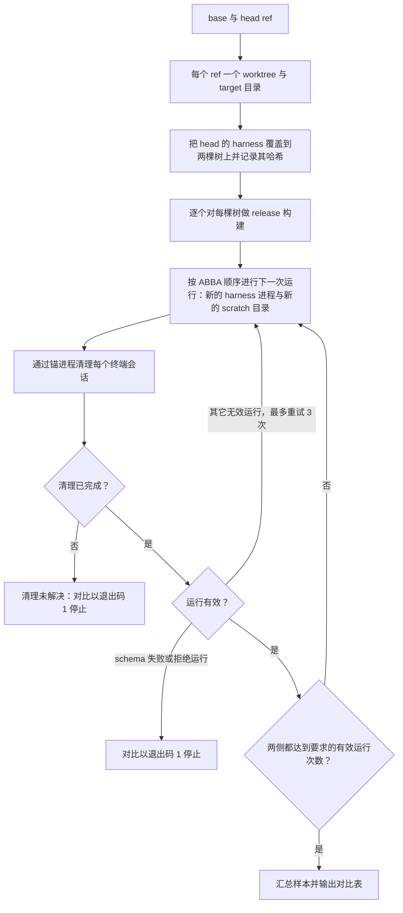
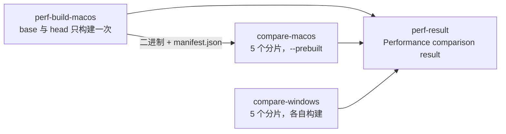

# 开发与发布

[English](Development-and-Release)

提交 PR 前运行下方完整本地 gate；合并前要求准确 head 的各平台 CI 成功，合并后验证
Wiki 发布。Release tag 另需授权和精确成功的 `main` CI。本地打包见[打包](Packaging-zh-CN)，
crate 职责见[Crate 参考](Crate-Reference-zh-CN)。

每个主题各有一页：

- [仓库与工具链](Repository-and-Toolchain-zh-CN) — 仓库布局、工具链、构建入口、代码约定与原生依赖维护
- [本地 gate](Local-Gate-zh-CN) — runner 如何执行每个 gate 步骤：进程组、Windows job、日志、超时、CI 一致性与各步骤说明
- [CI 与 Coverage](CI-and-Coverage-zh-CN) — pull-request 与 `main` CI job、通过的 gate 不能证明的内容，以及工作流供应链
- [发布流程](Release-Process-zh-CN) — tag 驱动的 release workflow、发布资产、已解决 issue 的来源证据与手工检查
- [Wiki 发布](Wiki-Publication-zh-CN) — Wiki 源码规则、检查器与每次合并后的发布

## 本地验证 gate

`scripts/local-gate.py` 是仓库唯一可运行、区分主机的 gate 定义。请在仓库根目录运行，并完整运行到最后：

```sh
python3 scripts/local-gate.py
```

<!-- local-gate:begin -->

| 步骤 | 命令 | 本地主机 | 类别 | 前置条件 | CI job |
| --- | --- | --- | --- | --- | --- |
| `pty-close-baseline` | `cargo test -p sonicterm-app --lib pty_close_baseline -- --ignored --nocapture` | macOS、Windows、Linux | `local` | `rust`、`native` | `macos-core`、`windows-tests`、`linux-core` |
| `fmt` | `cargo fmt --all --check` | macOS、Windows、Linux | `local` | `rust` | `macos-core`、`windows-checks`、`linux-core` |
| `clippy` | `cargo clippy --workspace --all-targets -- -D warnings` | macOS、Windows、Linux | `local` | `rust`、`native` | `macos-core`、`windows-checks`、`linux-core` |
| `perf-scenarios-counters-clippy` | `cargo clippy --locked -p sonicterm-app --example perf_scenarios --features perf-counters,perf-hook-checkpoint-memory,perf-hook-trim -- -D warnings` | macOS、Windows、Linux | `local` | `rust`、`native` | `macos-core`、`windows-checks`、`linux-core` |
| `perf-scenarios-frame-texture-clippy` | `cargo clippy --locked -p sonicterm-app --example perf_scenarios --features perf-frame-texture -- -D warnings` | macOS、Windows、Linux | `local` | `rust`、`native` | `macos-core`、`windows-checks`、`linux-core` |
| `perf-scenarios-echo-trace-clippy` | `cargo clippy --locked -p sonicterm-app --example perf_scenarios --features perf-echo-trace -- -D warnings` | macOS、Windows、Linux | `local` | `rust`、`native` | `macos-core`、`windows-checks`、`linux-core` |
| `doc` | `RUSTDOCFLAGS="-D warnings" cargo doc --workspace --no-deps` | macOS、Windows、Linux | `local` | `rust`、`native` | `macos-core`、`windows-checks`、`linux-core` |
| `doc-resource-features` | `RUSTDOCFLAGS="-D warnings" cargo doc -p sonicterm-resource --all-features --no-deps` | macOS、Windows、Linux | `local` | `rust` | `linux-core` |
| `authored-comments` | `bash scripts/check-authored-rust-comments.sh` | macOS、Windows、Linux | `local` | `bash` | `macos-core`、`windows-checks`、`linux-core` |
| `script-identifiers` | `bash scripts/check-script-identifiers.sh` | macOS、Windows、Linux | `local` | `bash` | `macos-core`、`windows-checks`、`linux-core` |
| `no-raw-exit` | `bash scripts/check-no-raw-process-exit.sh` | macOS、Windows、Linux | `local` | `bash` | `macos-core`、`windows-checks`、`linux-core` |
| `rust-version` | `bash scripts/check-rust-version.sh` | macOS、Windows、Linux | `local` | `rust`、`bash` | `macos-core`、`windows-checks`、`linux-core` |
| `window-owner` | `bash scripts/check-window-owner-registration.sh` | macOS、Windows、Linux | `local` | `bash` | `macos-core`、`windows-checks`、`linux-core` |
| `workflow-supply-chain` | `bash scripts/check-workflow-supply-chain.sh` | macOS、Windows、Linux | `local` | `rust`、`bash` | `macos-core`、`windows-checks`、`linux-core` |
| `workspace-crates` | `bash scripts/check-workspace-crates.sh` | macOS、Windows、Linux | `local` | `rust`、`native`、`bash` | `macos-core`、`windows-tests`、`linux-core` |
| `doctests` | `cargo test --workspace --doc --no-fail-fast` | macOS、Windows、Linux | `local` | `rust`、`native` | `macos-core`、`windows-tests`、`linux-core` |
| `perf-scenarios-tests` | `cargo test --locked -p sonicterm-app --example perf_scenarios` | macOS、Windows、Linux | `local` | `rust`、`native` | `macos-core`、`windows-tests`、`linux-core` |
| `perf-scenarios-counters-tests` | `cargo test --locked -p sonicterm-app --example perf_scenarios --features perf-counters,perf-hook-checkpoint-memory,perf-hook-trim` | macOS、Windows、Linux | `local` | `rust`、`native` | `macos-core`、`windows-tests`、`linux-core` |
| `glyph-atlas-working-set` | `cargo test --locked -p sonicterm-app --example perf_scenarios glyph_atlas_working_set -- --ignored --nocapture` | macOS、Windows | `local` | `rust`、`native` | `macos-core`、`windows-tests` |
| `perf-scenarios-frame-texture-tests` | `cargo test --locked -p sonicterm-app --example perf_scenarios --features perf-frame-texture` | macOS、Windows、Linux | `local` | `rust`、`native` | `macos-core`、`windows-tests`、`linux-core` |
| `perf-scenarios-echo-trace-tests` | `cargo test --locked -p sonicterm-app --example perf_scenarios --features perf-echo-trace` | macOS、Windows、Linux | `local` | `rust`、`native` | `macos-core`、`windows-tests`、`linux-core` |
| `pty-feasibility` | `bash scripts/pty-backend-feasibility.sh --check` | macOS、Windows、Linux | `local` | `rust`、`bash` | `macos-core`、`windows-tests` |
| `resource-inventory` | `bash scripts/test-resource-inventory.sh` | macOS、Windows、Linux | `local` | `bash` | `macos-core`、`windows-tests` |
| `resource-baseline-tests` | `bash scripts/test-resource-baseline-evidence.sh` | macOS、Windows、Linux | `local` | `bash` | `macos-core`、`windows-tests` |
| `soak-harness` | `bash scripts/test-soak-harness.sh` | macOS、Windows、Linux | `local` | `bash` | `macos-core`、`windows-tests` |
| `linux-packages-tests` | `bash scripts/test-linux-packages.sh` | macOS、Windows、Linux | `local` | `bash` | `linux-core` |
| `release-assets-tests` | `bash scripts/test-release-assets.sh` | macOS、Windows、Linux | `local` | `rust`、`bash` | `linux-core` |
| `release-notes-tests` | `bash scripts/test-release-notes.sh` | macOS、Windows、Linux | `local` | `bash` | `macos-core`、`windows-tests`、`linux-core` |
| `wiki-publish-tests` | `bash scripts/test-wiki-publish.sh` | macOS、Windows、Linux | `local` | `rust`、`bash` | `macos-core`、`windows-tests`、`linux-core` |
| `logic-coverage` | `scripts/rust-logic-coverage.sh` | macOS、Linux | `local` | `rust`、`native`、`llvm-cov` | `macos-coverage` |
| `windows-warp-allocator` | `cargo test -p sonicterm-gpu --test windows_warp_allocator_baseline -- --nocapture` | Windows | `local` | `rust`、`native`、`warp` | `windows-tests` |
| `msi-validator-tests` | `.\scripts\validate-windows-msi_tests.ps1` | Windows | `local` | `pwsh` | `windows-tests` |
| `windows-perf-build` | `cargo build --locked -p sonicterm-app --example perf_scenarios` | Windows | `local` | `rust`、`native` | `windows-tests` |
| `windows-perf-smoke` | `python scripts/perf-compare.py --smoke` | Windows | `local` | `rust`、`native` | `windows-tests` |
| `macos-selection-build` | `cargo build --locked -p sonicterm-app --example native_split_selection` | macOS | `local` | `rust`、`native` | `macos-smoke` |
| `macos-selection-smoke` | `python3 scripts/native-selection-smoke.py` | macOS | `local` | `rust`、`native` | `macos-smoke` |
| `macos-perf-smoke` | `python3 scripts/perf-compare.py --smoke` | macOS | `local` | `rust`、`native` | `macos-smoke` |
| `release-macos` | `cargo build --release -p sonicterm-mac` | macOS | `release` | `rust`、`native` | `macos-smoke` |
| `release-windows` | `cargo build --release -p sonicterm-windows` | Windows | `release` | `rust`、`native` | `windows-smoke` |
| `release-linux` | `cargo build --release -p sonicterm-linux` | Linux | `release` | `rust`、`native` | `linux-packages` |
| `windows-target` | `bash scripts/check-windows-target.sh` | macOS | `optional` | `rust`、`win-target`、`bash` | — |

类别：`local` 步骤默认运行；`release` 步骤需加 `--with-release`；`optional` 步骤需加 `--with-optional`，且从不在 CI 中运行。

本地主机是 runner 会选择该步骤的主机。CI job 是 CI 运行它的位置，可能覆盖更少的主机，或一个也没有。

前置条件：

- `rust`：`rust-toolchain.toml` 指定的 Rust 工具链，包含 rustfmt 与 clippy。
- `native`：平台原生构建库：macOS 上的 Cairo 与 pkg-config（`brew install cairo pkg-config`），Windows 上由 `scripts/setup-windows-cairo.ps1` 安装的 Cairo，以及 Linux 上 `linux-core` job 安装的软件包。
- `bash`：`PATH` 上的 `bash`；在 Windows 上请从 Git Bash 运行 gate，使 Git 的 `bash` 优先被找到。
- `pwsh`：`PATH` 上的 PowerShell 7（`pwsh`）。
- `llvm-cov`：`ci.yml` 中 `CARGO_LLVM_COV_VERSION` 固定版本的 `cargo-llvm-cov`。
- `win-target`：`x86_64-pc-windows-msvc` 标准库（`rustup target add x86_64-pc-windows-msvc`）。
- `warp`：支持 allocator report 的 DX12 WARP adapter。
- 每个步骤还需要 `PATH` 上的 Git 与 Python 3。

<!-- local-gate:end -->

[本地 gate](Local-Gate-zh-CN) 说明 runner 如何执行这些步骤：进程组与残留进程检测、Windows Job Object 与准备阶段、
输出路径与 Git 状态、超时与 CI 一致性。

## 性能对比

`scripts/perf-compare.py` 在同一台 macOS 或 Windows 主机上用同一个场景 harness 测量两个版本，并输出前后
对比表。每个性能 pull request 都贴出这张表，数据取自其 merge base 与 head 的实测，不能用估算代替。
这张表在 CI 中由 `Performance comparison` 工作流在 GitHub 托管的 runner 上测量（见[CI 能测量什么](#ci-能测量什么)），
从不在开发者的 Mac 上测量：桌面主机正在被使用，其输入、焦点变化与负载会使运行无效或放大噪声。本地运行只说明
工具能够构建并正常工作。
场景在 macOS 与 Windows 上运行；Linux 只构建 harness，harness 在那里输出 `NOT_EXERCISED`。CI 的 Windows 对比表测量软件渲染路径；硬件 GPU 的数字来自本地对比（见[Windows 对比](#windows-对比)）。

### 运行对比

在仓库根目录运行：

```sh
python3 scripts/perf-compare.py --base <ref> --head <ref> --scenario <ID|ID/variant|all>... --runs 5
```

`--scenario` 接受多个值：场景 ID（例如 `S4`）、变体（例如 `S6/flood`）或 `all`。S10 有 `S10`
与 `S10/sync` 两种形式，因此完整基线运行 `--scenario all S10/sync`。`--runs` 是每侧需要的有效
运行次数。

| 选项 | 作用 |
| --- | --- |
| `--short` | 用 harness 的 `--short` 保持时长（5 s）与更小的输出量运行每个场景，用于快速对比；对比表的细节会注明 |
| `--laps` | 运行 lap 运行：它们以 `debug` 记录日志，因此增加逐帧的 `render_timing` 行；lap 运行自成一组，从不与计时运行合并统计 |
| `--laps-scenario ID[/variant]` | 只为该变体运行独立的 lap 组（裸 ID 指其 `default`）；可重复；与 `--laps` 同用，或该变体未被 `--scenario` 选中、未被列出时报错 |
| `--laps-runs N` | lap 组的有效运行次数（默认取 `--runs`）；需要 `--laps` 或 `--laps-scenario`；在 `--short` 下 `run_caps` 上限仍然适用 |
| `--alloc` | 通过 `perf_scenarios_alloc` 报告每帧分配次数；计时运行从不使用计数分配器 |
| `--counters` | 当 head 的 `sonicterm-app` 声明 `perf-counters` feature 时，以该 feature 构建每个声明它的 ref，并在计时组与 lap 组之后运行强制开启帧计数器的计数器组（harness 的 `--counters`）：在 head 上运行，base 也声明该 feature 时也在 base 上运行；它从不与这些组合并统计。不声明该 feature 的 head 会跳过该组，对比表会注明 |
| `--counters-runs N` | 计数器组的有效运行次数（默认取 `--runs`）；需要 `--counters` |
| `--keep` | 对比结束后保留每个 ref 的 worktree；默认会删除它们 |
| `--out <dir>` | `comparison.md` 与原始证据的输出位置 |
| `--require-base` | 让 base 与 head 适用同样的标准：base 无法构建、无法 `--list` 或无法凑满每组的有效运行时，对比失败（退出码 1），`comparison.md` 以 `**Incomplete comparison:**` 开头并列出每个缺口；base 未声明 `perf-counters` 时其计数器组仍显示 `n/a`。每个 CI 对比都传入它 |
| `--build-only <dir>` | 把两个 ref 各构建一次、对两个二进制运行 `--list`，把它们连同 `manifest.json` 复制到 `<dir>/base/` 与 `<dir>/head/`，打印 `manifest_sha256=<hex>`，不做任何测量；需要 `--require-base`，不接受运行、计数器、`--keep` 或 `--out` 选项（`--alloc` 会加入 alloc 示例）；构建日志写入 `<dir>/build-logs` |
| `--prebuilt <dir>` | 测量 `--build-only` 发布的二进制而不自行构建；需要 `--prebuilt-run-id`、`--prebuilt-attempt` 与 `--prebuilt-manifest-sha256`，并拒绝任何与本 job 不一致的 manifest 或二进制（见[CI 能测量什么](#ci-能测量什么)） |

本地运行自己构建两个 ref。不传 `--require-base` 时保持宽松：无法构建或运行的 base 被报告为 `blocked`，head 仍会被测量。

lap 运行还会记录字体 crate 的 `font operation` 计时记录，lap 表为每个 lap 变体增加 `fallback_receive` 行：运行中被检查的慢分发
之内与之外的等待（次数、总和与最大值，单位 ms），以及每一侧的结论。每个阶段记录其最长的 64 次分发及其开始与结束时刻
（`slow_dispatches`）和 `dispatch_count`；被检查的是不低于该阶段 `dispatch_ms` p95 的那些。一次等待 `[t − elapsed_ms, t]`（`t`
为其日志时间戳）落在同一运行、同一阶段的某次慢分发内（该分发两端放宽时间戳精度加 1 ms）时与之匹配。某一侧有一次运行中，某次被检查
的分发所匹配的等待之和不少于其时长的一半时，该侧为 `supported`；否则为 `inconclusive`，例如没有等待、没有日志、有 `unparsed` 记录
或覆盖不完整（不低于 p95 的分发多于所记录的）。不存在“被否定”的结论。结论单元格写明覆盖情况、`unparsed`（格式错误的
`fallback_receive` 记录）以及配对计数 `unmatched_enter` 与 `unmatched_return`，配对计数从不改变结论。

S10 的 `stream` 阶段在 `result.json` 中记录 `updates`：其工作负载播放的逻辑更新数，取自该次运行的 `Workload::Frames`
次数（`--short` 时 300，完整长度时 1,200）。其他阶段都不写这个键。计时表为 S10/default 与 S10/sync 增加
`stream presented frames per update (ratio)` 行：每次运行的 `presented_frames` 除以该次运行自己的 `updates`，从不除以常数，
并像其他按运行统计的行一样汇总。harness 早于该字段的一侧显示 `n/a`，不显示变化；`updates` 不是正整数的结果无效。

在 `--short` 下，harness 的 `--list` 条目声明了上限（`run_caps`）的变体在每个组（计时、lap、计数器与分配）中每侧取
min(请求次数, 上限) 次有效运行；其行显示 `(runs N of M)`，`comparison.md` 列出被限制的变体。release 对比不受限制。
每棵树在构建、`--build-only` 与 `--prebuilt` 对比中都恰好以它支持的 perf feature 构建，每次构建都是本地
门禁为该 feature 组合审阅过的步骤：声明了 `perf-counters` 且有带过滤器的日志 API 时用 `perf-counters`，声明了
`perf-frame-texture` 时用它，声明了 `perf-hook-checkpoint-memory` 且 app 源码定义了
`App::__perf_checkpoint_memory` 时用它，声明了 `perf-echo-trace` 且该树也支持 `perf-counters` 时用它，
声明了 `perf-hook-trim` 且 app 源码定义了 `App::__trim_covered_now` 时用它。本地门禁为五个 perf feature 的
每个有序子集各审阅四个构建步骤（base 与 head，各自针对普通示例与分配计数示例）：32 个子集，128 个步骤。一次
对比只构建每侧支持的那一个子集，且只构建其运行所需的示例。manifest 记录每一侧的 feature，不一致时拒绝。

一次完整对比要运行数小时，期间测量窗口一直显示在屏幕上。在本地运行时，请让主机保持空闲、接通交流电源、
显示器保持唤醒且屏幕不锁定，例如在 `caffeinate -dis` 下运行脚本：

```sh
caffeinate -dis python3 scripts/perf-compare.py --base <ref> --head <ref> --scenario all S10/sync --runs 5
```

显示器休眠、屏幕保护程序或锁屏都可能遮住测量窗口，而遮挡会使该次运行无效。窗口浮在其它
窗口之上但不获取键盘焦点，前台应用保留焦点；对该窗口的物理输入以及焦点抢占同样会使运行无效。

每次本地运行，无论是对比还是 smoke，还要求主显示器（harness 打开窗口的显示器）显示桌面 Space，
而不是全屏应用。若那里有全屏应用，harness 窗口会打开在被隐藏的桌面 Space 上，不呈现任何帧。一打开就被
隐藏的窗口不会发出遮挡事件，因为 winit 只在遮挡状态变化时报告遮挡。10 秒上限负责发现这种情况：主窗口
打开后 10 秒内没有呈现任何帧时，harness 把该次运行判为无效并结束（退出码 3）。原因会说明 10 秒内没有帧
呈现，因此该次运行被视为疑似遮挡，可能是其显示器上的全屏应用所致；没有帧并不能证明发生了遮挡。对比会
重试该次运行；smoke 把它作为遮挡重试，没有得到有效运行时报告 `BLOCKED`。

### Windows 对比

在 Windows 上，从 Git Bash 或 PowerShell 用 `python` 运行同一命令。`Performance comparison` 工作流的 Windows
分支运行在没有 GPU 的 GitHub 托管 runner 上，因此其对比表测量软件渲染路径（见[CI 能测量什么](#ci-能测量什么)）。
硬件 GPU 的数字来自一台空闲 Windows 主机上的对比，运行期间没有用户输入，并由 PR 写明该主机；Windows CI smoke 只检查工具（见[Windows](Local-Gate-zh-CN#windows)）。整个对比期间保持显示器唤醒、
会话不锁定。Windows 主机只与自身对比：某次运行所用的适配器或呈现器与该组第一次有效运行不同时，这一对
运行无效。

与 macOS 的不同之处：

- **托管。** 每次运行在自己的 Windows Job Object 中执行，而不是进程组；harness 退出后 job 中仍有存活
  成员时该次运行失败，截止时间用例除外，其 job 在被结束后必须经验证为空。
- **焦点。** 脚本采样前台窗口。第一个位于前台的应用是基线，之后前台进程的任何变化都会使该次运行无效；
  在 GitHub 托管的 runner 上没有用户会话，变化只记录在 `outcome.json` 的 `foreground_changes` 中。
  在整个运行期间（从其窗口打开之前开始），harness 用 `LockSetForegroundWindow` 锁定前台切换，因此其窗口打开时
  不会获得焦点。锁定期间其它应用都无法获得前台；按下 Alt 或点击其它窗口会结束锁定。锁定失败时记录在结果的
  `notes` 中。窗口打开时静止在其下方的指针不算输入：窗口在 GO 之前收到的第一个原生指针移动，或位置与上一个原生
  位置相同的移动，会被丢弃并计入 `result.json` 的 `native_cursor_rest_events_dropped`。任何移动仍会使该次
  运行无效；GO 之后的第一个原生移动也是如此，因为指针是在那时进入窗口的。
- **网格。** 窗口按其显示器与缩放所允许的网格打开，例如在 175% 缩放下为 281x58，因此一次运行可以测量
  任意网格。与 macOS 一样，一组对比的两侧必须使用同一网格，对比表的 `grid` 行记录每一侧的网格。
- **变体。** S1、S5 与 S11 有 `gdi` 和 `wgpu` 变体，分别把 `[appearance].software_render_mode` 设为
  `force` 与 `off`。在 CPU 适配器上默认通过 GDI 呈现，因此只有 `wgpu` 测量 wgpu 呈现。没有通过 GDI 呈现
  的 `gdi` 运行，或发生降级的 `wgpu` 运行，为 `blocked`。S1 的 `role-exit` 变体用于 smoke。
- **对比表。** 每个场景有一行 `presenter`，写出呈现器与适配器。macOS 结果也记录呈现器，因此 macOS 对比表
  也有这一行，内容为 `wgpu` 或 `wgpu, degraded`；有效的 macOS 结果缺少该记录属于模式问题。在短裁剪实验之外，S12 的 uncover 与遮挡期间释放内存两行
  为 `n/a`，因为 Windows 不报告遮挡；该实验以合成方式发送遮挡，因此其 uncover 行有实测值；每个检查点的 footprint 行为 `n/a`，因为 Windows 没有 `footprint`。
- **交付。** 在测量运行之前，对比用 head 构建的 `--capture-delivery` 通过 ConPTY 回放 S3、S9、S10 与 S11，
  写出 `delivery.json`。每项检查成为双方共用的一行 `delivery:`；检查未通过，或记录与回放的退出码
  不一致，都会使该场景的每一组为 `blocked`。回放的清理未解决时（例如 job 的托管未经验证），对比以退出码 1
  停止，与测量运行相同。
- **交付重试。** 一次回放最多尝试 3 次，且只重试一种失败：步骤以 `FAIL`、退出码 5 结束且清理已验证，记录为
  schema 2，唯一未通过的检查是 `sync brackets`，其 `unseen`、`brackets` 与 `unseen_markers` 字段与其 detail
  一致，并表明至少有一个帧标记从未找到；在 `default` 变体中还要求完全没有括号。该次尝试还必须保留了其交付文本，
  可读、不超过 64 MiB 上限，且长度等于记录的 `bytes_kept`。schema 2 的 S10 记录在被接纳或重试之前会被整体
  验证：`schema_version` 为整数 2，`unseen` 与 `brackets` 为非负整数，`unseen_markers` 列出 `min(unseen, 8)`
  个字符串，detail 恰为 `enclosed N, empty pair ahead N, absent N[, never painted N]` 且其数字与这些字段一致，
  结论也由它们得出；格式错误的记录会阻塞。其他任何失败都在发生的那次尝试
  上阻塞：其他检查或第二项检查未通过，记录缺失、格式错误或为 schema 1，记录与步骤不一致，崩溃、超时或任何其他
  退出码。任何一次尝试的清理未解决时，对比仍会停止。每次尝试使用新的 scratch 与相同的期限，并保留其记录、
  所分类的交付文本与日志，保存在对比的 `delivery/` 目录中，分别为 `delivery-<ID>-<variant>-attempt<N>.json`、
  `.txt` 与 `NN-delivery-<ID>-<variant>-attempt<N>.log`。该行的备注始终写明尝试次数，例如 `passed on attempt 2 of 3`，
  以及每次被重试的尝试的 detail 及其缺失的标记。这是一条接纳测量的规则，而不是交付没有缺陷的证明：间歇性的交付
  故障可能在之后的尝试中通过，所披露的尝试与保留的证据就是它显现的地方。
- **运行检查。** Windows 运行还会判断自身的交付。某个角色 pane 的程序在运行结束前退出时，该次运行无效，
  原因指出该 pane。S11 的图像在其阶段开始后 10 秒内没有注册，或已注册但图像图集始终没有增长时，为
  `blocked`。S3 的 READY 行与其 sentinel 行之间不恰好是计划的各行按 pane 宽度占据的行数（换行的行按其
  占据的每一行计数），或 sentinel 上方保留的、跨换行拼接的各行与 `bulk.txt` 的结尾不一致时，为 `blocked`。S9 的网格缺少其 fixture 输出的某个宽字符 token 时，为 `blocked`。窗口打开
  后 10 秒内没有帧呈现时，原因会把锁定或断开的会话列为可能的原因。

### 对比的执行过程


```mermaid
flowchart TD
    refs["base 与 head ref"] --> trees["每个 ref 一个 worktree 与 target 目录"]
    trees --> overlay["把 head 的 harness 覆盖到两棵树上并记录其哈希"]
    overlay --> build["逐个对每棵树做 release 构建"]
    build --> run["按 ABBA 顺序进行下一次运行：新的 harness 进程与新的 scratch 目录"]
    run --> cleanup["通过锚进程清理每个终端会话"]
    cleanup --> settled{"清理已完成？"}
    settled -- 否 --> failed["清理未解决：对比以退出码 1 停止"]
    settled -- 是 --> valid{"运行有效？"}
    valid -- schema 失败或拒绝运行 --> stopped["对比以退出码 1 停止"]
    valid -- 其它无效运行，最多重试 3 次 --> run
    valid -- 是 --> enough{"两侧都达到要求的有效运行次数？"}
    enough -- 否 --> run
    enough -- 是 --> table["汇总样本并输出对比表"]
```

每个 ref 使用独立的 worktree 与 Cargo target 目录，逐个做 release 构建。head 的 harness，即 example
目录及其两个 `[[example]]` 条目（`src/` 下的任何内容都不包括），会覆盖到两棵树上，因此两侧运行相同的
场景与测量代码。`perf-compare.py` 对这份覆盖内容计算哈希，并通过 `--harness-hash` 传给每次运行。两侧
按 ABBA 顺序交替运行，直到每侧都达到要求的有效运行次数。每次运行都是一个新的 harness 进程，使用新的
scratch 目录，以 `--managed` 启动，并以本侧的 worktree 为工作目录，因此 App 加载的是该 ref 的已跟踪字体。

以 `perf-hook-checkpoint-memory` 构建的 harness 会在每个检查点取一次内存样本，并标注检查点的序号、标签与
尝试次数。没有窗格因锁被占用而跳过时，样本即完整。不完整的样本每 50 毫秒重试一次，自首次起 500 毫秒内最多
十次；每次重试前都会先检查时限，因此迟到的轮次不会取样。无论是否受管，检查点只有在其 footprint（受管运行）
已应答、且取样已完整或次数用尽时才继续。`result.json` 记录 `checkpoint_memory`（`supported` 或
`unsupported`），并为每个检查点记录 `sampling`、`attempts` 与 `last_attempt_complete`。

短 S12 计划在 App 收到 `Occluded(true)`（macOS 上来自原生事件或 2 秒回退）后的第一轮，向 App 的遮挡窗口
裁剪钩子询问测量窗口；如果遮挡保持阶段先结束，则从不调用钩子。Windows 不报告遮挡，因此 harness 在那里自行
在钩子之前发送 `Occluded(true)`，并在取消遮挡时发送 `Occluded(false)`。这一步既不等待也不改变计划，因此两侧
运行同一套流程。`result.json` 把结果记为 `hooks.trim`：`not-reached`（计划不请求裁剪，或保持阶段先结束）、
`unsupported`、`skipped` 或 `trimmed`，另记 `trim_experiment`（该计划为 `s12-short-trim`，否则为 null）与
`trim_seq_after_hook`（钩子的裁剪编号，未裁剪时为 null）。未启用 `perf-hook-trim` 的构建记为 `unsupported`：
该运行是未裁剪的基线。`unsupported` 不改变内存读数：有效的测量仍是数值，`unsupported` 既不会凭空产生 0，
也不会让有效读数变为不可用。真实的 0，或因其他原因不可用的检查点取样，仍可能出现。较旧的 harness 不写
`hooks`；给出其他结果的 result 会被拒绝。

在该实验中，`covered` 内存行遵循裁剪规则。钩子已裁剪的一侧只计入读数为 `trimmed=true`、来源为 `hook` 或
`scheduler`、且 `trim_seq` 不小于 `trim_seq_after_hook` 的样本：较早或未裁剪的样本为 `n/a: stale`，缺少状态或来源
为其他值时为 `n/a: schema`。`unsupported` 一侧带有裁剪标注时为 `n/a: schema`；任何一侧的行上出现值无法读取的裁剪标注（例如 `trimmed=bogus` 或
`trim_seq=-1`）时也为 `n/a: schema`；只有完全不带裁剪标注的行才是未裁剪的基线。钩子为 `skipped`、`not-reached` 或未记录
的一侧分别为 `n/a: trim skipped`、`n/a: trim not reached` 或 `n/a: trim not recorded`，从不作为已裁剪的数值；其原始读数
保留在单独的 `covered renderer_total_bytes, uncredited trim` 行中。`hooks.trim` 为 `trimmed` 的结果必须带有正整数的
`trim_seq_after_hook`，其他结果必须为 null，裁剪实验的结果必须记录 `hooks`。其 `covered` 阶段在两个平台上报告
墙钟时长、以计数表示的已呈现帧与重绘请求以及 CPU，从不报告帧率或呈现间隔。Windows 结果只有在该实验中才可以
带有 `synthetic_occlusion = true`。

有三类运行会使对比立即以退出码 1 停止，且从不重试：未解决的清理、schema 失败与拒绝运行。
`perf-compare.py` 中的 `classify_outcome` 在任何可重试的原因之前按以下顺序检查它们，因此带有其中之一的
运行即使同时有可重试的问题，也会使对比停止：

1. 由结果之外的证据表明的未解决清理，例如 `run_step` 的截止时间或 Ctrl-C，见下文；
2. schema 失败：无法解析或不符合结果 schema 的 `result.json`、`managed` 不为 true 的结果，或 harness
   哈希不是脚本所传哈希的结果。无论 harness 如何结束都是如此，包括 harness 超时（退出码 4）与当前树
   不支持该场景（退出码 5）。`run_step` 报告 PASS 且退出码为 0、因而退出状态可信时，缺少 `result.json`
   （除非 harness 输出了 `NOT_EXERCISED`）或结果状态不是 `valid` 也属于 schema 失败；
3. 由结果表明的未解决清理：`finish_session` 未完成，无论以哪种退出码结束；
4. 拒绝运行：harness 拒绝了该次运行（退出码 2），例如因为继承了不安全的设置，或 scratch 目录已经存在。

其它无效运行都会重试，最多 3 次。其中包括 harness 以退出码 0 结束、但 `run_step` 报告 PASS、TIMEOUT 与
INTERRUPTED 以外状态的运行，以及 harness 在自己的截止时间（即其场景的超时）以退出码 4 结束的运行。相比之下，
`run_step` 的截止时间（状态 TIMEOUT）或被 Ctrl-C 中断的 `run_step`（状态 INTERRUPTED）属于未解决的清理：
无论 harness 的退出码如何，对比都会以退出码 1 停止，而不是开始下一次尝试。`run_step` 的截止时间比 harness
自己的截止时间晚 30 秒，正好在 harness 的 watchdog 将要中止 harness 的时刻或之前。

harness 报告显示其窗口的显示器：名称、刷新率与缩放，不包括分辨率。每次运行的显示器必须在双方都报告的
每个字段上与对比的参考显示器一致；任一方为 null 的字段不检查，参考显示器缺少的字段取自之后的运行。
不一致会使该次运行无效并重试；原因会列出两个显示器以及不同的字段。

`perf-compare.py` 在被测进程之外判断焦点，用 `lsappinfo` 采样前台应用。另一个应用在前台时
harness 成为前台应用，该次运行即无效；采样失败的运行同样无效。在没有前台应用的主机上，激活不算抢占。
在 GitHub 托管的 runner 上（`GITHUB_ACTIONS=true` 且 `RUNNER_ENVIRONMENT=github-hosted`）没有用户持有焦点，
因此那里的 smoke 与对比都只记录这次激活，采样失败仍会使运行失败（[本地 gate](Local-Gate-zh-CN#性能场景-smoke)）。
自托管 runner 或桌面主机保持严格检查。脚本的输出会在每次对比中列出一次焦点规则，以及它读取的 runner 变量。

每次运行之后，包括在截止时间被终止的运行，脚本都会通过每个会话的锚进程清理各终端会话的进程。
shell 是自己会话的首进程，进程组终止无法触及它；锚进程保证会话 id 在会话中每个成员都收到信号
之前不会被复用。在 smoke 的截止时间用例中，脚本只在该进程仍具有 harness 被接受时记录的 pid 与启动
时间时，才向 harness 发送信号。该用例只有在 `run_step` 随后自己回收了 harness 时才通过：状态为 FAIL、
退出码为 `-9`，且没有残留的进程组成员。只有这次计划内的终止会跳过 schema 与 `finish_session` 检查，
因为它的结果本就预期缺失或不完整；发出信号之后的任何其它结果都会使 smoke 失败。

清理以一次最终扫描结束：它重新验证每条从未被确认的会话记录，包括被拒绝的记录。有有效锚进程的记录按
正常方式清理；否则该会话的成员作为残留进程列入 `cleanup.json`，且不向任何成员发送信号。未解决的清理会使
对比以退出码 1 停止。结果之外的证据表明了它的大多数原因：残留进程、没有有效锚进程的会话成员、比 harness
存活得更久或无法计数的进程组成员、`run_step` 的截止时间或 Ctrl-C，以及 `run_step` 从未收集到的 harness
退出。在截止时间或 Ctrl-C 时，`run_step` 终止并回收 harness，但不对其进程组计数，因此原因会说明：要么进程组
没有被计数，要么进程组之外的某个进程占用了输出；无论哪种情况，比 harness 存活得更久的进程都无从测量。
`run_step` 从未收集其退出的 harness 可能仍在运行，因此其进程组计数说明不了什么。最后一个原因由结果表明：
`finish_session` 未完成。它在 schema 检查之后、任何可重试的原因之前读取，无论以哪种退出码结束，因此这样的
运行从不作为遮挡重试。

### 隔离检查

运行不得改动用户的 SonicTerm 状态。每次对比运行和每个 smoke 用例都在运行前后为 `~/.sonicterm`
做快照，并用一个哨兵文件标记运行开始。其中出现新增、修改或删除的文件，会使该次运行无效，
或使 smoke 失败。属于另一个 SonicTerm 实例的改动是例外：

- 以其它进程命名的 breadcrumb 文件：breadcrumb 文件为
  `breadcrumbs/breadcrumbs-<session id>.log`，session id 包含写入它的进程的 id；
- 另一个 SonicTerm 实例运行期间，按天日志的增长或日志的删除。

`.DS_Store` 会被忽略。harness 在启动时记录自己的 scratch 路径，因此误写入 `~/.sonicterm` 的日志
能被识别为 harness 自己的日志。

该检查只读取。对于 `~/.sonicterm` 下的符号链接，它记录链接的目标文本以及目标的大小与 mtime，因此
经由链接的写入也算改动；对于悬空链接，它只记录目标文本。它也会遍历符号链接指向的目录，每个真实目录只
遍历一次，因此循环会结束；遍历在 200,000 个条目或 32 层处停止。目标无法读取或遍历在该上限处停止时，
检查无法得出结论：`home-check.json` 记录 `"unresolved": true`，该次运行无效，在 smoke 中则失败。

### 读取对比表

脚本输出 pull request 用的对比表，每个场景与指标一行，列为 Scenario、Metric (unit)、Baseline、
PR 与 Change。

- 帧级指标（例如两次呈现之间的间隔）把所有有效运行的样本合并为一个中位数与 nearest-rank p95，
  并给出各次运行中位数与 p95 的最小–最大值。
- 运行级指标（例如 CPU 时间）给出各次运行的中位数与最小–最大值。
- 噪声下限就是这一逐次运行的离散范围，而不是合并后帧样本的极值；落在其中的变化视为噪声。
- `n/a` 表示 base 不报告该字段，`blocked` 表示 base 无法构建或运行该场景，并附带错误。
- 检查点的内存取自该检查点自己带标注的 `memory snapshot` 行，再加上 macOS `footprint` 读数；
  该日志行见[日志](Logging-zh-CN#info-级别的聚合快照)。权威样本是尝试次数最高的完整样本；没有完整样本时取
  最后一次不完整的尝试，它仍计入，单元格会加上 `, N partial`。从不以周期性样本替代。同一次尝试的两个完整样本
  总量不同时显示 `n/a: conflicting samples`，harness 没有该钩子的一侧显示 `n/a: unsupported`。
  该样本带有网格字段时，检查点还会多一行 `grid bytes per pane`：
  `grid_visible_bytes + grid_history_bytes + grid_alternate_bytes` 除以 `panes_sampled`。
  该样本带有 `renderer_row_glyph_cache_bytes` 时，检查点还会多出这一行，遵循相同的 unsupported、partial、
  conflicting 与过时规则；该字段属于比较两个样本时使用的总量。它是所有渲染器之和，因此按存活渲染器数
  × 512 MiB 解读，从不作为门槛。行中缺少该字段的 base 显示 `n/a`，其他总量照常比较。短运行中 S3 的
  `end` 检查点在洪泛结束 5 秒后取样（完整运行为 60 秒）；S7 的 `end` 至少在滚轮停止 1.5 秒后取样。
  该样本带有字形图集事实时，其中列出的每个渲染器以逻辑身份各多出六行，例如
  `end main glyph_atlas_dim (px)`：`glyph_atlas_dim`、`glyph_atlas_packed_pixels`、`glyph_atlas_fit`、
  `glyph_atlas_growths`、`glyph_atlas_evictions` 与 `glyph_atlas_max_tile`。可见渲染器在分解中的标签是原生
  窗口 id，每次运行都不同，所以检查点 `atlas_readings` 条目指名为主窗口的那个记作 `main`；预热渲染器保留其池
  槽位 `warm[slot]`；其他可见渲染器，以及没有该读数的运行中的所有可见渲染器，按标签顺序记作 `visible#k`。
  `renderer_native_id` 行列出每次运行的原生 id。所有运行一致时单元格给出该值，
  否则给出每个不同的值及其运行次数，例如 `evicted ×1; no_headroom ×1`。fit 取值为 `256`、`512`、`1024`、
  `2048`、`no_headroom`、`does_not_fit` 或 `evicted`。四个数值事实的变化比较中位数；fit 与最大字形块没有变化。
  早于这些事实构建的 base 显示 `n/a`。
- S2 只在能把样本无歧义地归属到某一帧时才计入按键到呈现的延迟，并报告归属覆盖率；阅读延迟时
  要同时看覆盖率。
- 当测试工具以 `perf-echo-trace` 构建且计数器开启时，S2/default 被记功的样本还会在 flush 发布处拆分
  （各部分的定义见[日志](Logging-zh-CN#s2-回显监视)）。测试工具的 `--list` 在每种构建中都声明
  `capabilities.latency_split_schema: 1`，其 `latency` 对象随之带有 `split_schema: 1`、`split_count`、
  `split_reasons` 与 `split_coverage`。对比从 head 的列表读取这一能力，并以它约束两侧，因为两侧运行的
  都是 head 的测试工具；早于该能力的 head 沿用旧的延迟约定。无法拆分的样本给出 22 种原因之一；
  `unsupported` 表示未启用该特性的构建，或 S2/default 之外的变体。计数器表增加 S2/default `typing` 行：
  三个部分的中位数与 p95、投递滞后的 p95、拆分覆盖率，以及原因计数与 suppressed、coalesced、
  `sync_open` 的计数。未启用该特性构建的 base 显示 `n/a (unsupported)`。计时运行保持计数器关闭，因此
  其样本记为 `arm-gate-off`。

使用 `--counters` 时，计时对比表（以及运行了 lap 组时的 lap 表）之后还有两张表。Frame counters 表
给出 base 与 head 的计数器运行，每个场景、阶段与非零计数器一行；各字段的含义见[日志](Logging-zh-CN#帧与锁计数器)。

- 计数是各次运行该阶段增量的中位数，并附最小–最大值。
- 直方图的 p95 与 max 是所有运行事件合并后的桶边界（`≤17 ms`，溢出桶为 `>100 ms`），从不是精确值；
  其 mean 是总耗时除以事件数。
- 以 `_ns` 结尾的字段是累加的纳秒。它作为精确整数相减、比较与汇总，只在显示时换算为保留两位小数的微秒。
- 每个阶段还有渲染器的渲染尝试汇总拆分：全部尝试一行，携带回退应用的尝试一行。在报告该类全部字段的运行中，
  先对匹配的总和求和，再分为塑形、光栅化与其余部分的占比，并给出每次尝试的平均值，因此占比之和总是 100%。
  任何一侧都没有绘制尝试的阶段显示为一行 `no render attempts`；缺少这些字段的一侧显示 `n/a`。详情块为
  任何运行绘制了渲染尝试的每个阶段列出各次运行自己的拆分。
- 每个阶段还有派生行，每行标明其公式与汇总方式，只在某一侧的分母非零时列出：行缓存命中率
  `hits / (hits + misses)`，汇总所有计数器运行；每次计数器运行的组装均值
  `assembly_sum_us / Σ assembly_buckets`，按运行精确计算并给出汇总均值（直方图没有精确分位数，因此只显示
  其 p95 边界，从不设门槛）；以及仅供参考的每个已绘制帧的塑形与测量请求数
  `shape_requests / (gpu_frames + software_frames)` 和部分帧回退比例
  `partial_fallbacks / (partial_frames + partial_fallbacks)`；以及每次组装的标签标题复用数
  `tab_title_reuses / Σ assembly_buckets` 和每次组装的界面文本段复用数 `chrome_run_reuses / Σ assembly_buckets`，
  汇总所有计数器运行。缺少这些字段或分母为 0 的一侧显示 `n/a`，没有变化。
- Change 列比较计数的中位数，或直方图的 mean。base 不声明 `perf-counters` 时（该组只在 head 上运行），
  以及 base 较旧的契约缺少某个字段时，Baseline 列与变化为 `n/a`；缺少字段在 base 上不算 schema 失败，
  在 head 上算。
- 两侧每次运行都为 0 的计数器不列出，表上方的说明给出不列出的个数。
- 内存样本带有字形图集事实的每个检查点多出一行 `glyph_atlas_growths, snapshot/counted`。每次内存采样尝试时，
  harness 在检查点的 `atlas_readings` 中记录主窗口的原生标签、每个存活窗口自创建起计数的 `glyph_atlas_growths`，
  以及已关闭窗口的总数。每次运行中每个存活窗口，snapshot 中的增长数（从渲染器构建起计数）必须等于同一次尝试中
  该窗口计数的增长数，显示为 `main 2/2`；任何差异都是不一致。预热渲染器不绘制，不参与比较；已关闭窗口的增长
  列为 `closed N`。没有计数数字的可见窗口，或没有该读数的运行，结论不定，并显示 snapshot 之和与各阶段计数之和，
  因为启动增长和已关闭窗口使两者之间的不等式什么也证明不了。单元格给出最差的结论：`mismatch in N of M runs`，
  其次 `inconclusive in N of M runs`，否则 `consistent`。只在 head 上运行的计数器组在 base 一侧显示 `n/a`。

Counters overhead 表只覆盖 S2 与 S3，在计时对比表的指标上比较 head 的计数器运行与它的计时运行。这两组
先后运行而不是交错运行，因此其中的小变化可能来自两组之间的漂移，而不是来自计数器。

计数器组及两张表在 macOS 与 Windows 上都会运行。Windows runner 通过 GDI 呈现，因此其帧计入
`software_frames`，`gpu_frames` 保持为 0。若某次计数器运行的帧计数与其 `result.json` 记录的呈现器相矛盾，
计数器表上方的说明会点名该运行，绝不会静默通过。

表格下方是主机信息、两个 SHA、harness 哈希、命令与原始日志路径；把它们与对比表一起贴出。
主机信息给出机型、操作系统、GPU、电源与低电量模式，列出每个显示器的分辨率、逻辑尺寸、刷新率
与缩放，并给出测量显示器的名称、刷新率与缩放。

### 场景

| ID | 负载 |
| --- | --- |
| S1 | 空闲 60 秒。 |
| S2 | 以每秒 10 个字符输入 200 个字符；按键到呈现的延迟及其归属覆盖率，在计数器运行中于 flush 处拆分。 |
| S3 | `yes \| head -n 2000000`，再 `cat` 一个 50 MB 文件（吞吐量），然后空闲 60 秒。 |
| S4 | 每 10 毫秒刷新一次的可见 `date` 循环，持续 60 秒。 |
| S5 | S4 的循环在后台标签页中运行，活动标签页保持空闲。 |
| S6 | 指针在标签栏与网格上扫动 10 秒。 |
| S7 | 用滚轮滚动整个保留的回滚历史：配置 10,000 行，250×70 单元格时保留 4,124 行。随后是单独报告的 `settle` 阶段：1.5 s 无输入（`--short` 运行也一样），覆盖滚动条 600 ms 空闲窗口和 300 ms 淡出。 |
| S8 | 在密集的 `e` 匹配中搜索。 |
| S9 | 新窗口中首次出现的 emoji 与 CJK 字形。 |
| S10 | 播放全屏 TUI 重绘流，不带 DEC 2026 同步输出括号。 |
| S11 | 一张内联 Sixel 图像，然后切换到没有媒体的标签页并空闲 120 秒。 |
| S12 | 三个带完整回滚历史的窗格加上预热窗口，然后窗口被遮挡 90 秒后再取消遮挡。 |

| 变体 | 负载 |
| --- | --- |
| `S2/flood` | S3 的输出洪流在第一个窗格中运行，同时 S2 的输入发往一个分屏窗格的 shell。 |
| `S6/flood` | 在 S3 的输出洪流期间进行 S6 的指针扫动。 |
| `S6/selection-drag` | 在一屏静态密集文本上反复按下、在网格上移动并释放，持续 10 秒，只在网格区域内进行。 |
| `S10/sync` | S10 的重绘流，每一帧都包在 `ESC[?2026h` … `ESC[?2026l` 之间。 |
| `S1/gdi`、`S5/gdi`、`S11/gdi` | 仅 Windows：该场景使用 `[appearance].software_render_mode = "force"`，通过 GDI 呈现。 |
| `S1/wgpu`、`S5/wgpu`、`S11/wgpu` | 仅 Windows：该场景使用 `software_render_mode = "off"`，通过 wgpu 呈现且不降级。 |
| `S11/release` | 显示图像后切换到没有媒体的标签页，直到切换后第一帧呈现（上限 5 秒），从该帧起保持 65 秒（从不缩短），记录 `released` 检查点，其内存读数只采用该帧之后至少 30 秒的样本（`fresh_after_unix_s`），然后切换回来，直到呈现一个图像图集含有条目的帧（上限 10 秒）。 |
| `S1/role-exit` | 仅 Windows：角色程序在 GO 之后立即以 1 退出，该次运行必须以无效结束；smoke 使用它。 |
| `S1/atlas-retry` | 只在计数器组中运行；没有计数器组时被拒绝。70 行静态文本稳定后，运行 8 个恢复回合，每回合四个强制帧：A 重试一次注入的字形图集变更，B 是第一次呈现的恢复帧，C 与 D 重绘不变的画面。`result.json` 以 `atlas_recovery` 记录每帧的计数器增量，对比增加一张 "Atlas retry recovery" 表，在被接受的计数器运行上汇总每帧的行缓存未命中与命中、塑形请求和尝试次数。 |
| `S10/powerline`、`S10/cjk-tui`、`S10/unique` | 只在计数器组中运行；没有计数器组时被拒绝。行文本段塑形诊断的工作负载，运行在 row-run 窗格实测的网格上：角色 READY 之后、GO 之前，探针读取窗格实际的列数与行数；网格小于 120 x 22 时以 `row-run-grid-too-small` 及实测尺寸拒绝；否则为该网格生成全部更新（第 1 行为标题，rows - 2 行正文由粗体、常规与斜体段组成，最后一行为页脚），任何会换行或被截断的行都会被拒绝。CJK 段需要塑形，数字字段保持 ASCII 快速路径。网格被冻结：GO 之前或之后尺寸改变都会使运行无效。托管运行实测 macOS 为 237 x 43，Windows 为 281 x 58。`warm` 阶段逐个写入 20 次更新，每次都在探针看到上一次更新完整出现在网格中（每行正文的数字都已到位，且光标停在页脚之后，即该次更新的最后一次写入）且之后有一帧呈现后才写入（没有其他呈现时，测试框架强制呈现一次）；随后 `stream` 阶段以约每秒 60 次的速度运行，`--short` 下 10 秒（完整 60 秒），更新计数从 warm 延续。powerline 与 cjk-tui 重复其需塑形的段；unique 作为负对照，9 次更新内从不重复。它们从不做投递回放。 |

pull request 性能流水线在 macOS 和 Windows 上按名称运行 `S2/flood`、`S6/flood`、
`S6/selection-drag`、`S1/atlas-retry`、`S10/powerline`、`S10/cjk-tui` 和 `S10/unique`；它们所在的分片见 [CI 能测量什么](#ci-能测量什么)。

`S10/powerline`、`S10/cjk-tui` 与 `S10/unique` 只在计数器数据集中运行。在 `--short` 下，每个变体每侧运行两次，先是 20 次已呈现更新的预热阶段，再是 10 秒的流式阶段。macOS 上，powerline 与 cjk-tui 运行在 S4-S5-S11，unique 运行在 S2-S10sync。Windows 上，powerline 与 cjk-tui 运行在 S2-S10sync，unique 运行在 S1-S3-S6-S8-S12。现有 atlas-retry 的分片不变。

分片规划为每个变体（两侧合计）预留 140 秒。这是保守且未经测量的余量，不是场景时长，也不是执行上限。该分片安排已对照运行 37325514262、37333587004、37341446398 与 37353681544 检查。历史关键路径的富余不能证明满足 1,800 秒预算。合并前，用确切 head 的 CI 证据替换名义成本，披露重试与排队，必要时重新均衡，但不减少所需证据，也不添加上限回退。

每个对比分片的报告有一张 "Row-run shaping (partial shard evidence)" 表：对其测量的每个决策阶段，给出各计数器在被接受的计数器运行上的总和，以及 R、T、O_asm 与 O_att。它不做决策。分片还在 `comparison.md` 与 `timing.json` 旁写出 `row-run-evidence.json`：其标识、设置、协议摘要，以及每个阶段每侧每次被接受运行的原始字段与实测网格，和被拒绝的尝试。`result.json` 以 `row_run_geometry`（契约版本、列数、行数、正文行数）记录 row-run 运行的网格；协议摘要绑定该契约版本。`perf-compare.py --row-run-decide <artifact-dir>... --row-run-execution <run-record> <attempt> --row-run-head <sha> --row-run-base <sha>` 只做分析：它校验这些产物属于同一个合格的工作流执行（及其唯一一次同 head 替换），从各次运行重建每个阶段，并打印两次执行、被选中的执行、每个平台的实测网格、每一步的状态、开销门槛与结果。它要求：perf.yml 的作业清单齐全，且每个作业都在运行创建后 1,800 s 内结束；替换执行在第一次执行结束后才开始；执行路径为规范路径并与产物中的尝试目录一致；保留的结果与所声明的运行和测试框架绑定；构建设置类型完整且两侧都带计数器特性；每个平台在 base、head、三个 row-run 变体与替换执行之间只有一个有效的实测网格。R、T 与开销依赖该网格，因为 row-run 计数随其正文行数变化；分片表在它们旁边打印网格，不同网格上的数值不可比较。无效证据以 2 退出且不做决策；退出码 0 只表示证据通过校验。协调者在合并前把该输出发到 issue 与 PR。BUILD、CLOSE 或 PENDING 结果不改变 Performance comparison 作业的结果，第 3 步的开销上限是人工合并门槛：较早的步骤已做出决定时，开销显示 "not evaluated"，从不算通过。

每个场景的最终内存检查点都至少在 GO（harness 让各负载开始运行的时刻）之后 60 秒（使用 `--short` 时为
5 秒，smoke 即如此）。多数场景以一段至少持续到那时的空闲期结束；S4 与 S5 则结束于 60 秒的输出流阶段，此时
`date` 循环仍在运行，S12 结束于取消遮挡后 10 秒的保持阶段。内存数据来自该最终检查点，以及 S11 与 S12 的
中间检查点。shell 负载来自 harness 在 scratch 目录中生成的脚本。生成的内容，例如回滚文本、密集搜索文本、
emoji 与 CJK 行、TUI 重绘流与 Sixel 图像，来自带哈希的 fixture，因此两侧收到相同的字节。

在 Windows 上没有 shell 脚本运行负载。harness 二进制就是每个 pane 的程序：ConPTY 不带参数启动它，并把
`SONICTERM_PERF_SCRATCH` 设为该次运行的 scratch 目录，它从那里的 `program.json` 读取角色的步骤。这些步骤
重现角色脚本的输出：来自同一 fixture 的 `yes` 与 `cat`、C locale 格式的 UTC `date` 行，以及相同的帧。
S2 的输入发给 `cmd.exe /d`，并设置 `PROMPT=perf$$$S`，它渲染出 harness 等待的 `perf$ ` 提示符。Windows
上的 S11 用一个 OSC 1337 序列以内联 PNG 输出图像，因为 ConPTY 不传递 Sixel。

S11 的图像阶段结束于一个已知显示该图像的帧。harness 的网格扫描第一次看到该图像已注册时，harness 清除
渲染器保留的帧标识（`crates/sonicterm-gpu/src/core.rs` 中的 `invalidate_retained_frame`），并通过 App
自己的输出路径请求重绘测量窗口，使下一帧完整组装并绘制，而不会因为未变化而被跳过。该阶段在扫描看到图像
之后呈现的第一帧处结束；若 1 秒内没有帧呈现，该次运行无效，原因会说明没有任何帧已知显示该图像。重绘请求
可能合并，因此这次请求不一定会多出一个呈现的帧。每次对比的两侧都会这样做。

### 场景 harness

场景位于按需构建的 example `perf_scenarios`（`crates/sonicterm-app/examples/perf_scenarios/`）中，
由 `perf-compare.py` 构建并运行；任何发布二进制都不包含它。

```text
perf_scenarios --list
perf_scenarios --run <ID> [--variant <name>] [--managed] [--short] [--laps] [--harness-hash <hex>] <scratch>
perf_scenarios --run <ID> [--variant <name>] [--short] --capture-delivery <scratch>
```

| 选项 | 作用 |
| --- | --- |
| `--managed` | 由 `perf-compare.py` 驱动该运行：它验证并确认每条会话记录，用 `footprint` 读数应答检查点请求，并在运行后清理各会话。不带该选项的运行自行确认自己的记录，并被标为 unmanaged，因此从不进入对比。 |
| `--short` | 每段保持只持续 5 秒，S3 输出 `head -n 200000` 与一个 5 MB 文件；smoke 使用它 |
| `--laps` | 该运行以 `debug` 记录日志，因此增加逐帧的 `render_timing` 行；lap 运行自成一组，从不与计时运行合并统计 |
| `--harness-hash <hex>` | `perf-compare.py` 对覆盖用 harness（即 example 目录及其两个 `[[example]]` 条目）计算的哈希；harness 把它记入 `result.json`，不一致即为 schema 失败 |
| `--capture-delivery <scratch>` | 仅 Windows，适用于 S3、S9、S10 与 S11：不进行测量运行，而是在 250x70 的 ConPTY 中启动该场景的角色程序，不打开窗口，并把 `delivery.json`（schema 2）写入 `<scratch>`，每项交付属性一项检查，其中 S10 的检查另有 `unseen`、`brackets` 与前 8 个 `unseen_markers`；保留了输出时，旁边还有 `delivery.txt`，即它所分类的交付文本；全部检查通过时退出码为 0，有检查未通过时为 5，被拒绝时为 2，未写出记录时为 1。它不接受 `--managed`、`--laps` 或 `--harness-hash` |

- 每次 `--run` 都是一个新进程。`perf-compare.py` 以构建其二进制的源码树为工作目录启动每次运行：对比中
  是本侧的 worktree，`--smoke` 中是仓库根目录。App 在那里找到已跟踪的字体，因此每一侧使用自己 ref 的
  字体。`asset_dir()`（`crates/sonicterm-cfg/src/assets.rs`）在打包位置之后，到工作目录及其各级上级
  目录中查找 `assets/`，因此单独的 `--run` 只有在 checkout 内启动时才能找到已跟踪的字体。每次构建之后，
  `perf-compare.py` 按 `asset_dir()` 的方式解析该树的资源；资源必须解析到该树自己的 `assets/`，且
  `assets/fonts` 中有字体。否则 smoke 以退出码 1 结束；在对比中，
  资源无法解析的 head 会使对比失败，这样的 base 则为 `blocked`。`<scratch>` 是操作系统临时目录下新建的
  目录，存放该次运行的配置与日志，`perf-compare.py` 把日志与证据保留在它的证据目录中。`HOME` 保持不变，
  因此 shell 与系统字体发现看到的是真实主机。
- 运行之后，若 `run_step` 日志或该次运行的日志中出现 `Unable to load the configured primary font` 这一行，
  该次运行无效：smoke 立即失败，对比则重试该次运行。
- harness 拒绝继承的 `NO_COLOR` 或 `RUST_LOG`，在打开任何窗口之前以退出码 2 退出：`NO_COLOR`
  会改变终端颜色，`RUST_LOG` 会替换配置的日志级别。
- 它只用合成输入驱动真实的 `App`。输入文字是 `Ime::Commit`，跳过 keymap 与按键编码，因此 S2
  两者都不测量；指针与滚轮事件是合成的；标签页、分屏与搜索通过 `App::run_action` 打开。窗口浮在
  其它窗口之上但不获取键盘焦点；对它的任何物理输入、未请求的遮挡或焦点抢占都会使运行无效。
  在 Windows 上，窗口打开时静止在其下方的指针不算输入；任何指针移动都算。

| 退出码 | 含义 |
| --- | --- |
| 0 | 有效运行 |
| 2 | 拒绝运行，例如继承了 `NO_COLOR` 或 `RUST_LOG` |
| 3 | 无效运行 |
| 4 | harness 超时 |
| 5 | blocked：该次运行无法测量它所指的内容，例如当前树不支持该场景，或在 Windows 上没有得到其变体要求的呈现器、交付检查未通过；对比表输出 `blocked` |

在 Linux 上，harness 输出 `NOT_EXERCISED`。第二个 example `perf_scenarios_alloc` 在计数全局
分配器下运行相同场景，报告每帧分配次数。分配器在构建二进制时就已确定，因此计时运行从不使用它：
计时运行使用 `perf_scenarios`，它与每个发布二进制一样不声明全局分配器。

### CI 能测量什么

`Performance comparison` 工作流（`.github/workflows/perf.yml`）有 pull request 与 release 两种模式，两者共用一张 job 图：


```mermaid
flowchart LR
  producer["perf-build-macos<br/>base 与 head 只构建一次"] -->|"二进制 + manifest.json"| macos["compare-macos<br/>5 个分片，--prebuilt"]
  windows["compare-windows<br/>5 个分片，各自构建"]
  producer --> result["perf-result<br/>Performance comparison result"]
  macos --> result
  windows --> result
```

- `perf-build-macos`（`macos-14`）解析 ref，并以 `--require-base --build-only` 通过 gate 已审核的构建步骤把两个 ref
  各构建一次。它从文件重新计算 manifest 的 sha256，与脚本打印的摘要不一致时失败，然后把二进制打成 tarball（保留可执行位）上传，
  名为 `perf-binaries-macOS-<run id>-<attempt>`，保留一天。它的构建日志作为证据上传。
- 每个 `compare-macos` 分片需要 producer 成功。它自行解析 ref，与 producer 的不一致时失败；解析出 base 而 producer 没有发布
  manifest 时也失败。它下载 producer 那次 attempt 的 tarball，并以 `--require-base --prebuilt` 运行，绑定本次运行的 id、
  producer 的 attempt 与其 manifest 摘要。测量之前，`perf-compare.py` 会拒绝：目录或 manifest 缺失、schema 不同；manifest 的
  sha256 不是 producer 发布的；运行或 attempt 不同；base 或 head SHA 不同；harness hash 不同；Cargo feature 不同；target、
  工具链（`rustc -vV`、`cargo -V`）或 runner 镜像（`ImageOS`、`ImageVersion`）不同；profile 不同（每侧的 LTO 与
  `CARGO_PROFILE_RELEASE_*` 覆盖）；二进制缺失、是符号链接、不可执行或摘要不符，或某组需要的示例没有构建；以及副本无法
  `--list` 或找不到其所在树自己的资源。因此 producer 与分片之间工具链或镜像的更替会以拒绝告终。只有可执行文件被转移：副本位于
  工作目录下，旁边没有 `assets`，所以每个 ref 仍从自己的 worktree 运行并使用自己的资源。二进制动态链接 Homebrew 的 Cairo，
  因此每个分片仍会安装它。
- “Re-run failed jobs” 保留成功的 producer，其 `attempt` 输出仍是构建 artifact 的那次 attempt，重新运行的分片下载的就是它。
  “Re-run all jobs” 会运行新的 producer，其分片拒绝之前 attempt 的 manifest。
- 每个 `compare-windows` 分片自行构建两个 ref，并传入 `--require-base`。
- `perf-result` 需要全部三个 job，在同样的触发条件下以 `always()` 运行。它不 checkout，也不使用任何 action：只有一个
  内联步骤，仅当 producer 与两个对比 job 都成功时才通过。只有符合条件的运行把它命名为 `Performance comparison result`；
  不符合条件的运行（例如给带 `perf` 标签的 pull request 再加一个标签）会跳过每个 job。GitHub 从不求值被跳过 job 的
  `name:`，因此它的结果检查显示原始的名称表达式（其中同时引用 `Performance comparison result` 与
  `Performance comparison result (not run)`），从不显示真正的名称。
- 首个 release 没有更早的 tag：producer 什么也不构建，每个 macOS 分片不计划对比并跳过下载，Windows 分片跳过对比，四个 job
  全部成功。

同一 pull request（或同一 tag）的符合条件的运行共用一个工作流级 concurrency group。较新的符合条件的 pull request 运行会
整个取消较旧的运行；较旧运行的结果 job 仍以 `always()` 运行并失败，因此被取代的运行从不显示为成功。每个不符合条件的运行
都有以其 run id 为键的独立 group，不取消任何运行。正在运行的 release 对比从不被取消：同一 tag 的较新运行会等待，GitHub
每个 group 只保留一个等待中的运行。重新运行较旧的符合条件的运行会重新加入该 group 并取消较新的运行，因此只重新运行最新的
符合条件的运行。

合并证据是那次符合条件的运行中的 `Performance comparison result` job：结论为 SUCCESS，所在运行的 head SHA 正是该 pull
request 的确切 head，并按该运行的 id 读取（`gh run view <run-id> --json headSha,jobs`）。绝不能只按检查名称读取，
`gh pr checks` 就是这样做的：该视图对每个名称只保留最新开始的检查，因此被取代或无关的运行可能顶替真正算数的那次运行。
例如，在较新的符合条件的运行进行期间，`gh pr checks` 会把被取消的较旧运行的结果列为 `fail`，直到正在进行的运行的结果
job 完成。被取代、被取消或被跳过的运行从不算作成功。

每个 CI 对比都通过 `--require-base` 让 base 与 head 适用同样的标准：base 无法构建、无法列出场景或无法凑满某组的有效运行时，
该分片失败，其 `comparison.md` 以 `**Incomplete comparison:**` 开头。唯一允许的缺口是 base 未声明 `perf-counters` 时的计数器组，
它仍显示 `n/a`。macOS 分片运行 S7；S9、S10、S6/flood 与 S6/selection-drag；S2、S10/sync 与 S10/unique；S4、S5、S11、S11/release、S1/atlas-retry、S10/powerline 与 S10/cjk-tui；
以及 S1、S3、S6、S8、S12 与 S2/flood。同名的 Windows 分片运行 S7；S9、S10、S6/flood、S6/selection-drag 与 S2/flood；
S2、S10/sync、S10/powerline 与 S10/cjk-tui；S4、S5、S11、S11/release、S11/gdi 与 S11/wgpu；以及 S1、S3、S6、S8、S12、S1/atlas-retry 与 S10/unique，以均衡各平台分片的实测时长。
两个平台的 S9-S10 分片还运行 S9 的 lap 组（`--laps-scenario S9 --laps-runs 2`，由该矩阵条目的 `laps` 字段设置；其他条目不传
lap 选项），每个平台的对比表给出各自的 `fallback_receive` 结论。
裸场景 ID 只选择其默认变体，因此每个变体都按名称列出。在 `--short` 下，`S2/flood` 每侧上限 2 次，`S11/release` 上限 1 次，
`S11/gdi`、`S11/wgpu`、`S1/atlas-retry`、`S10/powerline`、`S10/cjk-tui` 与 `S10/unique` 上限 2 次。`S2/flood` 的上限只为让 pull request 对比保持在 30 分钟内：release 对比完整运行它。
带 `perf-frame-texture` 时，S11 的 `end` 检查点记录 `frame_texture_bytes`：head 在 GDI 下为 4 B，未声明该 feature 的 base
为 `n/a`。每个分片在自己的 runner 上交错运行其场景组的 base 与 head 运行，因此一次对比从不跨 runner 或平台。macOS 分片数（目前为五个）
根据实测的关键路径选定。两种模式都会运行计数器组，在 head 上，以及在声明 `perf-counters` 的 base 上：pull request 为每个场景、
每一侧运行两次计数器运行以保持在 30 分钟内，release 运行 `--runs` 次。Windows runner 没有 GPU，也没有用户会话：其对比表测量
软件渲染路径，前台变化在那里只被记录，不被判定。

| 模式 | 时机 | 对比 | 运行 | Release profile | 时长 |
| --- | --- | --- | --- | --- | --- |
| Pull request | 带 `perf` 标签的 pull request：加上该标签时，以及标签存在期间的每次 push | merge base 与 head | `--short --runs 5 --counters --counters-runs 2` | 两个 ref 都关闭 LTO、使用 16 个 codegen unit | 从运行创建起 30 分钟内，包含排队时间 |
| Release | 推送的 `v*` tag | 上一个 release tag 与该 tag | 完整时长，`--runs 5 --counters` | 发布用的 profile | 可能数小时 |

每个对比 job 把它的 `comparison.md` 写入 job summary，并把它、它的 `timing.json` 与每次运行的日志和记录一起作为 artifact
上传，artifact 名称以运行的 attempt 结尾，因此重新运行的证据从不替换第一次 attempt 的证据。对比表的细节记录运行时长、任何 release profile 覆盖，以及在 macOS 上 producer 的
运行、attempt 与 manifest 摘要。该工作流不是必需的 CI job 之一；它输出的表就是该 pull request 的证据。Pull request 在放宽的
profile 上的短运行只是快速检查；release 对比在完整时长下测量发布用的 profile。共享 runner 的噪声比空闲的桌面主机大，因此
应以同类 runner、同一模式的 A/A 对比来解读一项改动。

Pull request 的预算是从运行创建到其最后一个 job 结束的 30 分钟，包含排队时间与重新运行；只算分片时长不算数。
`python3 scripts/perf-critical-path.py --run <id>` 负责核算（`--fixture <file>` 读取已记录的运行）。它把经过的时间分到每次
attempt 与重新运行之间的等待，把每次重新运行中继承的 job 行映射到实际执行它们的唯一 attempt，并把每次 attempt 中每条
needs 链拆成兄弟等待、创建等待、runner 排队与运行时间类别（setup、build、打包与上传、下载与解包、compare、evidence、check、
teardown 与 gap），指出 slack 为零的关键路径。带有 `timing.json` 的运行会把 compare 步骤进一步拆成 prepare、scenarios 与
report。没有它的旧运行按历史模式读取：每个 job 的证据是在其时间窗口内创建的同名 artifact，其 compare 步骤保持为一个类别。
`--ci-run <id>` 额外输出 perf 与 CI 两次运行中 macOS job 的并发情况，作为争用的证据，而不是配额的证据。它在预算内退出码为 0，
超出为 1，job 行无法对上时为 2。由作者为 pull request 的证据运行它；工作流不会运行它。

`macos-perf-smoke` gate
步骤在两个 `macos-smoke` 分支中运行 `python3 scripts/perf-compare.py --smoke`。它以 debug 构建
当前树的 harness，以 `--short` 运行三个简短用例（S1、S3，以及会话一启动就像到达截止时间的运行那样被终止的 S1），只检查
该树的资源能否解析、结果 schema、焦点安全、`~/.sonicterm` 快照、App 是否加载了配置的主字体，以及清理后没有进程残留。它不断言任何耗时数值，
因此通过只说明工具可用，从不说明某项改动更快。在 Windows 上，`windows-tests` job 构建 harness 并运行
`python scripts/perf-compare.py --smoke`：同样的三个用例、S1 `wgpu`、S1 `role-exit`，以及一次 S10/sync
交付回放（见[Windows](Local-Gate-zh-CN#windows)）。托管 runner 使用软件适配器渲染，因此这只检查工具、
wgpu 呈现器与角色退出处理，从不检查计时。Linux CI 只构建 harness 而不运行场景，每个平台都通过 `check-workflow-supply-chain.sh` 运行 `scripts/perf-compare_tests.py` 与
`scripts/perf-critical-path_tests.py`。
smoke 的失败规则见[本地 gate](Local-Gate-zh-CN#性能场景-smoke)。

## Coverage 证据与重新建立基线

per-crate 下限只在 macOS arm64 CI runner 上强制执行，而 CI 跟随 stable Rust channel，因此新的
stable 版本或 runner 镜像可能在源码不变时改变 crate 的测量覆盖率。所以每次 coverage 运行都会保留
证据，下限只能根据已保留运行的已验证证据调整。

### 证据 artifact

`macOS logic coverage` job 为每个 coverage 步骤已开始的 run attempt，在成功和失败后，只要 runner
仍能执行清理步骤，就上传一个 artifact：`rust-logic-coverage-evidence-<run id>-<attempt>`。在该步骤
之前失败（checkout、工具链、缓存或 `cargo-llvm-cov` 安装）不会留下 artifact；它的 job 日志是唯一的
诊断信息。上传步骤保留 90 天（受仓库策略限制），并设置 `if-no-files-found: error`，
但不设置 CI 超时覆盖项。coverage 步骤及其 job 同样没有超时覆盖项。挂起的 coverage 步骤
可能耗尽 GitHub Actions 平台的 job 时限，导致证据上传无法执行。runner 丢失或取消也可能阻止上传。没有该 artifact
的运行属于不可用证据：它从来不是完整测量，也从来不允许据此重新建立基线。

artifact 的布局如下：

```text
rust-logic-coverage-evidence-<run id>-<attempt>/
  coverage-provenance.json
  measurement/coverage-summary.json
  measurement/workspace-metadata.json
```

job 上传 `target/rust-logic-coverage-evidence`。暂存目录与 checkout 固定记录位于
`target/rust-logic-coverage-work/`，该目录从不上传。

### 内容与完整性

`scripts/rust-logic-coverage.sh` 依次运行 `self-test`、`toolchain`、`instrumented-tests`、`report`、
`inventory` 与 `publish` 阶段，再运行 `subset-gate`（80% 子集 gate）与 `floor` 两项检查。`self-test`
阶段在写入任何记录之前，先在工作目录的 `checkout-pin.json` 中一次性固定 checkout：commit、它的
tree、该 tree 的路径映射，以及未提交的改动。每个阶段开始前，脚本都会把 `coverage-provenance.json`
重写为预写记录；阶段失败时再补上退出码，因此在阶段中途被终止的运行仍会指出停在哪里
（`interrupted before the phase finished`）。写入记录失败时会保留上一条记录。在 `subset-gate`
开始之前，该记录把运行标记为不完整；在 `subset-gate` 或 `floor` 期间，它可能描述一次完整的
测量，只是某项检查仍为 `not finished`。如果完全无法写入记录，例如 provenance 写入器本身失败，
退出 trap 会写入一条最小记录：
`measurement: incomplete`、`failed_phase`，以及说明无法写入 provenance 记录的 `failure`。

报告与 inventory 先写入暂存目录。在 `publish` 阶段，记录会先检查 `HEAD`、它的 tree 以及 coverage
相关的未提交路径列表是否仍与固定记录相同：

- **漂移：** 测量不完整（`failed_phase: publish`），记录在 `failure` 与 `checkout_drift` 中指出
  漂移，不发布任何文件，运行以退出码 3 失败。构建或测试在 `publish` 之前改动了原本干净的已跟踪
  coverage 相关文件，或留下未跟踪的此类文件，会向该列表加入路径，因此同样属于漂移。
- **无漂移：** 一次 rename 把暂存目录移动到位，成为 `measurement/`，之后才写入完整记录。该写入是
  原子的：先写入隐藏的临时文件（upload-artifact 默认跳过隐藏文件），再执行 rename。随后子集 gate
  与下限检查已发布的测量，因此 gate 或下限失败时文件仍会保留，job 也保持失败状态。

这项检查有边界：它把 `HEAD`、它的 tree 以及未提交的 coverage 相关路径名称列表与固定记录比较，
不比较文件字节或状态，因此对固定时已列出路径的进一步改动不会被发现；无论如何，`--update-baseline`
都会拒绝 `worktree_changes` 不为空的记录。在固定与发布之间做出又撤销的改动不会被发现，检查与
rename 之间的间隔也不受检查。

这些文件要么一起出现，要么都不出现，并且只有摘要一致的完整记录才能为它们作证。记录不完整的
artifact 属于不可用证据，无论其中包含哪些文件。在 rename 之后、或在写入完整记录的过程中被终止的
运行，会把两个文件留在上一条记录旁边，该记录显示运行在 `publish` 中被中断；这属于不可用证据。

- **完整：** 记录写明 `measurement: complete`，包含两个文件的 SHA-256 摘要，并把每项检查记为
  `exit status N`、`not finished` 或 `not run`。
- **不完整：** 记录写明 `measurement: incomplete`，并给出 `failed_phase` 与 `failure`，不包含摘要。
  不完整证据永远不会初始化或改变下限。

每条记录还包含 `target`、`runner`（`ImageOS/RUNNER_ARCH`）、`image_version`、`rustc_version` 与完整的
`rustc_verbose`（`rustc -vV`）、`cargo_llvm_cov`、`repository`、`workflow`、`run_id`、`run_attempt`、
`job`、`event`、`ref`、`run_url`、`artifact`、`pull_request_head`、`report_sha256`、`inventory_sha256`，
以及 `checkout_drift`：`publish` 检查发现的漂移列表，在其它所有阶段为 null。`commit` 与 `tree`（pull
request 上为 GitHub 的测试 merge）、`worktree_changes` 以及 `tree_entries`（固定 tree 中每个路径及其
mode 与 object id）都是固定值；之后不会重新读取。

### 获取与验证

按 run ID 从 GitHub 把 artifact 下载到 checkout 之外的目录（checkout 内的未跟踪文件会被视为未提交
改动）。通过 API 确认该 run attempt 与记录一致，再把记录的 `commit` 与该运行关联起来：

```bash
run=RUN_ID attempt=ATTEMPT
dir="$(mktemp -d)"
gh run download "$run" -R D0n9X1n/SonicTerm \
  -n "rust-logic-coverage-evidence-$run-$attempt" -D "$dir"
gh api "repos/D0n9X1n/SonicTerm/actions/runs/$run/attempts/$attempt" \
  --jq '[.repository.full_name, .path, .run_attempt, .event, .status, .head_sha] | @tsv'
gh api "repos/D0n9X1n/SonicTerm/actions/runs/$run/attempts/$attempt/jobs?per_page=100" \
  --jq '.jobs[] | select(.name == "macOS logic coverage") | [.conclusion, .head_sha] | @tsv'
python3 -c 'import json, sys; record = json.load(open(sys.argv[1])); record.pop("tree_entries"); print(json.dumps(record, indent=2))' \
  "$dir/coverage-provenance.json"
commit="$(python3 -c 'import json, sys; print(json.load(open(sys.argv[1]))["commit"])' "$dir/coverage-provenance.json")"
gh api "repos/D0n9X1n/SonicTerm/git/commits/$commit" \
  --jq '[.tree.sha, (.parents | map(.sha) | join(" "))] | @tsv'
```

如果该运行发布了报告与 inventory，它们位于 `$dir/measurement/`。只有以下各项全部成立才能继续：

- `.repository.full_name` 等于 `repository`，`.path` 等于 `workflow`，即
  `.github/workflows/ci.yml`。
- `.run_attempt` 等于 `run_attempt`，artifact 名称等于 `artifact`。
- 该 attempt 的 `.status` 为 `completed`；`macOS logic coverage` job（记录中的 `job`，即
  `macos-coverage`）存在，且两项检查都为 `exit status 0` 时结论为 `success`，否则为 `failure`。
- 记录写明 `measurement: complete`。
- push 运行中，`commit` 等于该 attempt 的 `.head_sha`。pull request 运行中，`commit` 是 GitHub 的
  测试 merge commit，且 `.head_sha` 等于 `pull_request_head`。
- 两种情况下，该 commit 的 `.tree.sha` 都等于记录的 `tree`；pull request 上它的 parents 还必须包含
  记录的 `pull_request_head`。

任何不一致、缺少 artifact 或记录不完整，都表示该运行属于不可用证据。`--update-baseline` 的离线检查
只证明记录自洽：文件与其摘要一致，其路径映射哈希后等于其 `tree`。把记录与它的运行、commit 和 tree
关联起来的是这些 API 检查。

### 重新建立基线的流程

1. 按上文获取并验证 artifact。
2. 检出 coverage 相关内容与被测 tree 相同的 tree：push 运行对应被测 commit；pull request 运行对应
   已与 base 同步的 head，此时它的 tree 与测试 merge 相同。
3. 更新下限；按 crate 更新时遵守同一 host 规则：

   ```bash
   python3 scripts/coverage-floor.py --update-baseline \
     --report "$dir/measurement/coverage-summary.json" \
     --metadata "$dir/measurement/workspace-metadata.json" \
     --baseline scripts/coverage-baseline.json --target aarch64-apple-darwin \
     --provenance "$dir/coverage-provenance.json" \
     --crate NAME --reason "CAUSE"
   ```

   host 迁移时运行同一命令但不带 `--crate`。完整更新可以把 baseline 迁移到记录中的 host，它写入的
   原因以 `Host migration from <old target> on <old runner> to <new target> on <new runner>.` 开头。
4. 工具会在所述原因后追加运行、attempt、job、artifact、host、镜像、工具链与 commit。所述原因必须
   说明起因：工具链或镜像变化可能导致 DROP，但仅凭这一点不能成为降低下限的理由。
5. 像其它下限变更一样评审并提交 diff。

### 拒绝条件

检查器离线运行，只检查完整性；每次拒绝都会指出不同之处。`--update-baseline` 会拒绝：

- 不带 `--provenance` 修改指名 CI host 的 baseline；只有 CI 从不强制执行的 `--runner local`
  baseline 可以不带它写入；
- 不完整的记录（会指出失败阶段），或缺少字段的记录；
- 指出 checkout 漂移的记录；
- 不恰好包含 `subset-gate` 与 `floor` 两项的 `checks`，其中某项的状态不是 gate 脚本写出的状态
  （`exit status N`、`not finished` 或 `not run`），或两者不是一次运行能够产生的组合；
- 不是 checkout 对象格式（`git rev-parse --show-object-format`）下完整小写 object ID 的 `commit`、
  `tree` 或 `pull_request_head`；
- 哈希结果不等于 `tree` 的 `tree_entries`：工具按 Git 的名称顺序、以 `100644`、`100755`、`120000`
  与 `160000` 这些 mode 重建嵌套的 Git tree，并指出两个 ID；
- SHA-256 与记录不一致的报告或 inventory，或 tool 与 `cargo_llvm_cov` 不一致的报告；
- 与记录冲突的 `--target` 或 `--runner`；
- 在 CI 之外或由其它 job、workflow 测得的记录，或 artifact 名称、`rustc -vV` host、`rustc_version`
  与其它字段矛盾的记录；
- coverage 相关源码或策略与当前 checkout 的 `HEAD` 不同的被测 tree、被测 checkout 中的未提交改动、
  当前 checkout 中未提交的 coverage 相关改动，或不在 Git checkout 中的 baseline。

coverage 相关是指除 `scripts/coverage-baseline.json`、Markdown 文件以及 `wiki/` 与 `docs/` 目录之外
的每个受跟踪路径，因此只接受仅在 baseline 或文档上不同的 tree。这些离线检查只证明记录自洽，不能证明
记录的来源；获取与验证中的 API 检查才把它与它的运行、commit 和 tree 关联起来。

### DROP 发现与建议 baseline

DROP 仍会让 CI 失败，并且从不产生自己的建议 baseline；同一次运行中为其它发现打印的建议会保留已
下降的下限。在 CI 中，DROP 消息会指出该运行的证据 artifact、运行 URL 与本节。其它发现仍可能打印
建议 baseline，但只作为预览：下限数值只能通过上述流程改变，not measured 声明及其原因仍是经过评审的
手工编辑。
