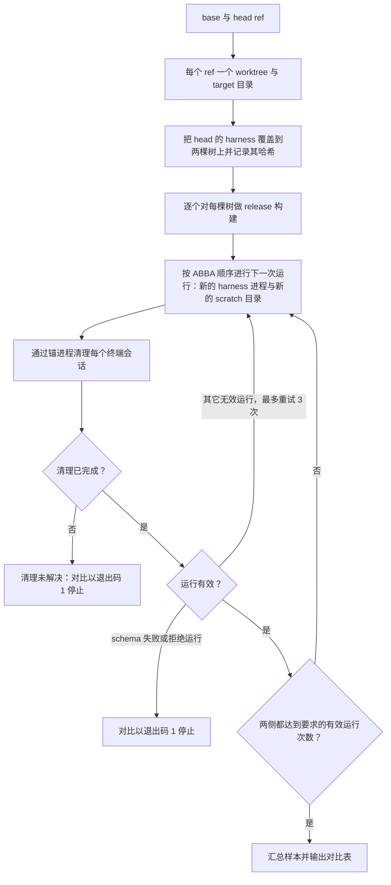

# 开发与发布

[English](Development-and-Release)

提交 PR 前运行下方完整本地 gate；合并前要求准确 head 的各平台 CI 成功，合并后验证
Wiki 发布。Release tag 另需授权和精确成功的 `main` CI。本地打包见[打包](Packaging-zh-CN)，
crate 职责见[Crate 参考](Crate-Reference-zh-CN)。

每个主题各有一页：

- [仓库与工具链](Repository-and-Toolchain-zh-CN) — 仓库布局、工具链、构建入口、代码约定与原生依赖维护
- [本地 gate](Local-Gate-zh-CN) — runner 如何执行每个 gate 步骤：进程组、Windows job、日志、超时、CI 一致性与各步骤说明
- [CI 与 Coverage](CI-and-Coverage-zh-CN) — pull-request 与 `main` CI job、通过的 gate 不能证明的内容，以及工作流供应链
- [发布流程](Release-Process-zh-CN) — tag 驱动的 release workflow、发布资产、已解决 issue 的来源证据与手工检查
- [Wiki 发布](Wiki-Publication-zh-CN) — Wiki 源码规则、检查器与每次合并后的发布

## 本地验证 gate

`scripts/local-gate.py` 是仓库唯一可运行、区分主机的 gate 定义。请在仓库根目录运行，并完整运行到最后：

```sh
python3 scripts/local-gate.py
```

<!-- local-gate:begin -->

| 步骤 | 命令 | 本地主机 | 类别 | 前置条件 | CI job |
| --- | --- | --- | --- | --- | --- |
| `pty-close-baseline` | `cargo test -p sonicterm-app --lib pty_close_baseline -- --ignored --nocapture` | macOS、Windows、Linux | `local` | `rust`、`native` | `macos-core`、`windows-tests`、`linux-core` |
| `fmt` | `cargo fmt --all --check` | macOS、Windows、Linux | `local` | `rust` | `macos-core`、`windows-checks`、`linux-core` |
| `clippy` | `cargo clippy --workspace --all-targets -- -D warnings` | macOS、Windows、Linux | `local` | `rust`、`native` | `macos-core`、`windows-checks`、`linux-core` |
| `doc` | `RUSTDOCFLAGS="-D warnings" cargo doc --workspace --no-deps` | macOS、Windows、Linux | `local` | `rust`、`native` | `macos-core`、`windows-checks`、`linux-core` |
| `doc-resource-features` | `RUSTDOCFLAGS="-D warnings" cargo doc -p sonicterm-resource --all-features --no-deps` | macOS、Windows、Linux | `local` | `rust` | `linux-core` |
| `authored-comments` | `bash scripts/check-authored-rust-comments.sh` | macOS、Windows、Linux | `local` | `bash` | `macos-core`、`windows-checks`、`linux-core` |
| `script-identifiers` | `bash scripts/check-script-identifiers.sh` | macOS、Windows、Linux | `local` | `bash` | `macos-core`、`windows-checks`、`linux-core` |
| `no-raw-exit` | `bash scripts/check-no-raw-process-exit.sh` | macOS、Windows、Linux | `local` | `bash` | `macos-core`、`windows-checks`、`linux-core` |
| `rust-version` | `bash scripts/check-rust-version.sh` | macOS、Windows、Linux | `local` | `rust`、`bash` | `macos-core`、`windows-checks`、`linux-core` |
| `window-owner` | `bash scripts/check-window-owner-registration.sh` | macOS、Windows、Linux | `local` | `bash` | `macos-core`、`windows-checks`、`linux-core` |
| `workflow-supply-chain` | `bash scripts/check-workflow-supply-chain.sh` | macOS、Windows、Linux | `local` | `rust`、`bash` | `macos-core`、`windows-checks`、`linux-core` |
| `workspace-crates` | `bash scripts/check-workspace-crates.sh` | macOS、Windows、Linux | `local` | `rust`、`native`、`bash` | `macos-core`、`windows-tests`、`linux-core` |
| `doctests` | `cargo test --workspace --doc --no-fail-fast` | macOS、Windows、Linux | `local` | `rust`、`native` | `macos-core`、`windows-tests`、`linux-core` |
| `pty-feasibility` | `bash scripts/pty-backend-feasibility.sh --check` | macOS、Windows、Linux | `local` | `rust`、`bash` | `macos-core`、`windows-tests` |
| `resource-inventory` | `bash scripts/test-resource-inventory.sh` | macOS、Windows、Linux | `local` | `bash` | `macos-core`、`windows-tests` |
| `resource-baseline-tests` | `bash scripts/test-resource-baseline-evidence.sh` | macOS、Windows、Linux | `local` | `bash` | `macos-core`、`windows-tests` |
| `soak-harness` | `bash scripts/test-soak-harness.sh` | macOS、Windows、Linux | `local` | `bash` | `macos-core`、`windows-tests` |
| `linux-packages-tests` | `bash scripts/test-linux-packages.sh` | macOS、Windows、Linux | `local` | `bash` | `linux-core` |
| `release-assets-tests` | `bash scripts/test-release-assets.sh` | macOS、Windows、Linux | `local` | `rust`、`bash` | `linux-core` |
| `release-notes-tests` | `bash scripts/test-release-notes.sh` | macOS、Windows、Linux | `local` | `bash` | `macos-core`、`windows-tests`、`linux-core` |
| `wiki-publish-tests` | `bash scripts/test-wiki-publish.sh` | macOS、Windows、Linux | `local` | `rust`、`bash` | `macos-core`、`windows-tests`、`linux-core` |
| `logic-coverage` | `scripts/rust-logic-coverage.sh` | macOS、Linux | `local` | `rust`、`native`、`llvm-cov` | `macos-coverage` |
| `windows-warp-allocator` | `cargo test -p sonicterm-gpu --test windows_warp_allocator_baseline -- --nocapture` | Windows | `local` | `rust`、`native`、`warp` | `windows-tests` |
| `msi-validator-tests` | `.\scripts\validate-windows-msi_tests.ps1` | Windows | `local` | `pwsh` | `windows-tests` |
| `macos-selection-build` | `cargo build --locked -p sonicterm-app --example native_split_selection` | macOS | `local` | `rust`、`native` | `macos-smoke` |
| `macos-selection-smoke` | `python3 scripts/native-selection-smoke.py` | macOS | `local` | `rust`、`native` | `macos-smoke` |
| `macos-perf-smoke` | `python3 scripts/perf-compare.py --smoke` | macOS | `local` | `rust`、`native` | `macos-smoke` |
| `release-macos` | `cargo build --release -p sonicterm-mac` | macOS | `release` | `rust`、`native` | `macos-smoke` |
| `release-windows` | `cargo build --release -p sonicterm-windows` | Windows | `release` | `rust`、`native` | `windows-smoke` |
| `release-linux` | `cargo build --release -p sonicterm-linux` | Linux | `release` | `rust`、`native` | `linux-packages` |
| `windows-target` | `bash scripts/check-windows-target.sh` | macOS | `optional` | `rust`、`win-target`、`bash` | — |

类别：`local` 步骤默认运行；`release` 步骤需加 `--with-release`；`optional` 步骤需加 `--with-optional`，且从不在 CI 中运行。

本地主机是 runner 会选择该步骤的主机。CI job 是 CI 运行它的位置，可能覆盖更少的主机，或一个也没有。

前置条件：

- `rust`：`rust-toolchain.toml` 指定的 Rust 工具链，包含 rustfmt 与 clippy。
- `native`：平台原生构建库：macOS 上的 Cairo 与 pkg-config（`brew install cairo pkg-config`），Windows 上由 `scripts/setup-windows-cairo.ps1` 安装的 Cairo，以及 Linux 上 `linux-core` job 安装的软件包。
- `bash`：`PATH` 上的 `bash`；在 Windows 上请从 Git Bash 运行 gate，使 Git 的 `bash` 优先被找到。
- `pwsh`：`PATH` 上的 PowerShell 7（`pwsh`）。
- `llvm-cov`：`ci.yml` 中 `CARGO_LLVM_COV_VERSION` 固定版本的 `cargo-llvm-cov`。
- `win-target`：`x86_64-pc-windows-msvc` 标准库（`rustup target add x86_64-pc-windows-msvc`）。
- `warp`：支持 allocator report 的 DX12 WARP adapter。
- 每个步骤还需要 `PATH` 上的 Git 与 Python 3。

<!-- local-gate:end -->

[本地 gate](Local-Gate-zh-CN) 说明 runner 如何执行这些步骤：进程组与残留进程检测、Windows Job Object 与准备阶段、
输出路径与 Git 状态、超时与 CI 一致性。

## 性能对比

`scripts/perf-compare.py` 在同一台 macOS 主机上用同一个场景 harness 测量两个版本，并输出前后
对比表。每个性能 pull request 都贴出这张表，数据取自其 merge base 与 head 的实测，不能用估算代替。
场景只在 macOS 上运行：Windows 与 Linux 只构建 harness，harness 在那里输出 `NOT_EXERCISED`。

### 运行对比

在仓库根目录运行：

```sh
python3 scripts/perf-compare.py --base <ref> --head <ref> --scenario <ID|ID/variant|all>... --runs 5
```

`--scenario` 接受多个值：场景 ID（例如 `S4`）、变体（例如 `S6/flood`）或 `all`。S10 有 `S10`
与 `S10/sync` 两种形式，因此完整基线运行 `--scenario all S10/sync`。`--runs` 是每侧需要的有效
运行次数。

| 选项 | 作用 |
| --- | --- |
| `--laps` | 运行 lap 运行：它们以 `debug` 记录日志，因此增加逐帧的 `render_timing` 行；lap 运行自成一组，从不与计时运行合并统计 |
| `--alloc` | 通过 `perf_scenarios_alloc` 报告每帧分配次数；计时运行从不使用计数分配器 |
| `--keep` | 对比结束后保留每个 ref 的 worktree；默认会删除它们 |
| `--out <dir>` | `comparison.md` 与原始证据的输出位置 |

一次完整对比要运行数小时，期间测量窗口一直显示在屏幕上。请让主机保持空闲、接通交流电源、
显示器保持唤醒且屏幕不锁定，例如在 `caffeinate -dis` 下运行脚本：

```sh
caffeinate -dis python3 scripts/perf-compare.py --base <ref> --head <ref> --scenario all S10/sync --runs 5
```

显示器休眠、屏幕保护程序或锁屏都可能遮住测量窗口，而遮挡会使该次运行无效。窗口浮在其它
窗口之上但不获取键盘焦点，前台应用保留焦点；对该窗口的物理输入以及焦点抢占同样会使运行无效。

每次本地运行，无论是对比还是 smoke，还要求主显示器（harness 打开窗口的显示器）显示桌面 Space，
而不是全屏应用。若那里有全屏应用，harness 窗口会打开在被隐藏的桌面 Space 上，不呈现任何帧。一打开就被
隐藏的窗口不会发出遮挡事件，因为 winit 只在遮挡状态变化时报告遮挡。10 秒上限负责发现这种情况：主窗口
打开后 10 秒内没有呈现任何帧时，harness 把该次运行判为无效并结束（退出码 3），原因会说明窗口在启动期间
被遮挡，并指出可能的原因：其显示器上有全屏应用。对比会重试该次运行；smoke 把它作为遮挡重试，没有得到
有效运行时报告 `BLOCKED`。

### 对比的执行过程


```mermaid
flowchart TD
    refs["base 与 head ref"] --> trees["每个 ref 一个 worktree 与 target 目录"]
    trees --> overlay["把 head 的 harness 覆盖到两棵树上并记录其哈希"]
    overlay --> build["逐个对每棵树做 release 构建"]
    build --> run["按 ABBA 顺序进行下一次运行：新的 harness 进程与新的 scratch 目录"]
    run --> cleanup["通过锚进程清理每个终端会话"]
    cleanup --> settled{"清理已完成？"}
    settled -- 否 --> failed["清理未解决：对比以退出码 1 停止"]
    settled -- 是 --> valid{"运行有效？"}
    valid -- schema 失败或拒绝运行 --> stopped["对比以退出码 1 停止"]
    valid -- 其它无效运行，最多重试 3 次 --> run
    valid -- 是 --> enough{"两侧都达到要求的有效运行次数？"}
    enough -- 否 --> run
    enough -- 是 --> table["汇总样本并输出对比表"]
```

每个 ref 使用独立的 worktree 与 Cargo target 目录，逐个做 release 构建。head 的 harness，即 example
目录及其两个 `[[example]]` 条目（`src/` 下的任何内容都不包括），会覆盖到两棵树上，因此两侧运行相同的
场景与测量代码。`perf-compare.py` 对这份覆盖内容计算哈希，并通过 `--harness-hash` 传给每次运行。两侧
按 ABBA 顺序交替运行，直到每侧都达到要求的有效运行次数。每次运行都是一个新的 harness 进程，使用新的
scratch 目录，以 `--managed` 启动，并以本侧的 worktree 为工作目录，因此 App 加载的是该 ref 的已跟踪字体。

有三类运行会使对比立即以退出码 1 停止，且从不重试；其它无效运行都会重试，最多 3 次：

- 未解决的清理，见下文；
- schema 失败：无法解析或不符合结果 schema 的 `result.json`、`managed` 不为 true 的结果，或 harness
  哈希不是脚本所传哈希的结果。无论运行如何结束都是如此，包括 harness 超时（退出码 4）、`run_step`
  超时，以及当前树不支持该场景（退出码 5）；
- 拒绝运行：harness 拒绝了该次运行（退出码 2），例如因为继承了不安全的设置，或 scratch 目录已经存在。

harness 报告显示其窗口的显示器：名称、刷新率与缩放，不包括分辨率。每次运行的显示器必须在双方都报告的
每个字段上与对比的参考显示器一致；任一方为 null 的字段不检查，参考显示器缺少的字段取自之后的运行。
不一致会使该次运行无效并重试；原因会列出两个显示器以及不同的字段。

`perf-compare.py` 在被测进程之外判断焦点，用 `lsappinfo` 采样前台应用。另一个应用在前台时
harness 成为前台应用，该次运行即无效。在没有前台应用的主机上，或在 GitHub Actions runner
（`GITHUB_ACTIONS=true`）上，激活不算抢占：这种 runner 虽然报告前台应用，但没有用户的焦点可被抢占，
日志只记录这次激活。
每次运行之后，包括在截止时间被终止的运行，脚本都会通过每个会话的锚进程清理各终端会话的进程。
shell 是自己会话的首进程，进程组终止无法触及它；锚进程保证会话 id 在会话中每个成员都收到信号
之前不会被复用。在 smoke 的截止时间用例中，脚本只在该进程仍具有 harness 被接受时记录的 pid 与启动
时间时，才向 harness 发送信号。

清理以一次最终扫描结束：它重新验证每条从未被确认的会话记录，包括被拒绝的记录。有有效锚进程的记录按
正常方式清理；否则该会话的成员作为残留进程列入 `cleanup.json`，且不向任何成员发送信号。未解决的清理会使
对比以退出码 1 停止，其原因包括残留进程、比 harness 存活得更久或无法计数的进程组成员、未完成的
`finish_session`，以及没有有效锚进程的会话成员。harness 以退出码 3 或 4 结束时，若结果的
`finish_session_settled` 不为 true，就是清理失败；这在遮挡检查之前判定，因此这样的运行从不作为遮挡重试。
harness 以退出码 0 结束、但 `run_step` 报告 PASS 以外的状态时，该次运行无效，会被重试。

### 隔离检查

运行不得改动用户的 SonicTerm 状态。每次对比运行和每个 smoke 用例都在运行前后为 `~/.sonicterm`
做快照，并用一个哨兵文件标记运行开始。其中出现新增、修改或删除的文件，会使该次运行无效，
或使 smoke 失败。属于另一个 SonicTerm 实例的改动是例外：

- 以其它进程命名的 breadcrumb 文件：breadcrumb 文件为
  `breadcrumbs/breadcrumbs-<session id>.log`，session id 包含写入它的进程的 id；
- 另一个 SonicTerm 实例运行期间，按天日志的增长或日志的删除。

`.DS_Store` 会被忽略。harness 在启动时记录自己的 scratch 路径，因此误写入 `~/.sonicterm` 的日志
能被识别为 harness 自己的日志。

该检查只读取。对于 `~/.sonicterm` 下的符号链接，它记录链接的目标文本以及目标的大小与 mtime，因此
经由链接的写入也算改动；对于悬空链接，它只记录目标文本。它也会遍历符号链接指向的目录，每个真实目录只
遍历一次，因此循环会结束；遍历在 200,000 个条目或 32 层处停止。目标无法读取或遍历在该上限处停止时，
检查无法得出结论：`home-check.json` 记录 `"unresolved": true`，该次运行无效，在 smoke 中则失败。

### 读取对比表

脚本输出 pull request 用的对比表，每个场景与指标一行，列为 Scenario、Metric (unit)、Baseline、
PR 与 Change。

- 帧级指标（例如两次呈现之间的间隔）把所有有效运行的样本合并为一个中位数与 nearest-rank p95，
  并给出各次运行中位数与 p95 的最小–最大值。
- 运行级指标（例如 CPU 时间）给出各次运行的中位数与最小–最大值。
- 噪声下限就是这一逐次运行的离散范围，而不是合并后帧样本的极值；落在其中的变化视为噪声。
- `n/a` 表示 base 不报告该字段，`blocked` 表示 base 无法构建或运行该场景，并附带错误。
- 检查点的内存取自该时刻或之前最新的 `memory snapshot` 行，再加上 macOS `footprint` 读数；
  该日志行见[日志](Logging-zh-CN#info-级别的聚合快照)。
- S2 只在能把样本无歧义地归属到某一帧时才计入按键到呈现的延迟，并报告归属覆盖率；阅读延迟时
  要同时看覆盖率。

表格下方是主机信息、两个 SHA、harness 哈希、命令与原始日志路径；把它们与对比表一起贴出。
主机信息给出机型、操作系统、GPU、电源与低电量模式，列出每个显示器的分辨率、逻辑尺寸、刷新率
与缩放，并给出测量显示器的名称、刷新率与缩放。

### 场景

| ID | 负载 |
| --- | --- |
| S1 | 空闲 60 秒。 |
| S2 | 以每秒 10 个字符输入 200 个字符；按键到呈现的延迟及其归属覆盖率。 |
| S3 | `yes \| head -n 2000000`，再 `cat` 一个 50 MB 文件（吞吐量），然后空闲 60 秒。 |
| S4 | 每 10 毫秒刷新一次的可见 `date` 循环，持续 60 秒。 |
| S5 | S4 的循环在后台标签页中运行，活动标签页保持空闲。 |
| S6 | 指针在标签栏与网格上扫动 10 秒。 |
| S7 | 用滚轮滚动整个保留的回滚历史：配置 10,000 行，250×70 单元格时保留 4,124 行。 |
| S8 | 在密集的 `e` 匹配中搜索。 |
| S9 | 新窗口中首次出现的 emoji 与 CJK 字形。 |
| S10 | 播放全屏 TUI 重绘流，不带 DEC 2026 同步输出括号。 |
| S11 | 一张内联 Sixel 图像，然后切换到没有媒体的标签页并空闲 120 秒。 |
| S12 | 三个带完整回滚历史的窗格加上预热窗口，然后窗口被遮挡 90 秒后再取消遮挡。 |

| 变体 | 负载 |
| --- | --- |
| `S2/flood` | S3 的输出洪流在第一个窗格中运行，同时 S2 的输入发往一个分屏窗格的 shell。 |
| `S6/flood` | 在 S3 的输出洪流期间进行 S6 的指针扫动。 |
| `S6/selection-drag` | 在一屏静态密集文本上反复按下、在网格上移动并释放，持续 10 秒，只在网格区域内进行。 |
| `S10/sync` | S10 的重绘流，每一帧都包在 `ESC[?2026h` … `ESC[?2026l` 之间。 |

每个场景都以一段空闲期结束，空闲期至少持续到负载开始后 60 秒（使用 `--short` 时为 5 秒，smoke 即
如此），随后取最终内存检查点。内存数据来自该检查点，以及 S11 与 S12 的中间检查点。shell 负载来自 harness 在
scratch 目录中生成的脚本。生成的内容，例如回滚文本、密集搜索文本、emoji 与 CJK 行、TUI 重绘流
与 Sixel 图像，来自带哈希的 fixture，因此两侧收到相同的字节。

S11 的图像阶段结束于一个已知显示该图像的帧。harness 的网格扫描第一次看到该图像已注册时，harness 通过
App 自己的输出路径请求对测量窗口做一次完整重绘，该阶段在此后呈现的第一帧处结束。若扫描看到图像后 1 秒内
没有帧呈现，该次运行无效，原因会说明没有任何帧已知显示该图像。这次重绘让 S11 的图像阶段多出一帧，每次
对比的两侧都是如此。

### 场景 harness

场景位于按需构建的 example `perf_scenarios`（`crates/sonicterm-app/examples/perf_scenarios/`）中，
由 `perf-compare.py` 构建并运行；任何发布二进制都不包含它。

```text
perf_scenarios --list
perf_scenarios --run <ID> [--variant <name>] [--managed] [--short] [--laps] [--harness-hash <hex>] <scratch>
```

| 选项 | 作用 |
| --- | --- |
| `--managed` | 由 `perf-compare.py` 驱动该运行：它验证并确认每条会话记录，用 `footprint` 读数应答检查点请求，并在运行后清理各会话。不带该选项的运行自行确认自己的记录，并被标为 unmanaged，因此从不进入对比。 |
| `--short` | 每段保持只持续 5 秒，S3 输出 `head -n 200000` 与一个 5 MB 文件；smoke 使用它 |
| `--laps` | 该运行以 `debug` 记录日志，因此增加逐帧的 `render_timing` 行；lap 运行自成一组，从不与计时运行合并统计 |
| `--harness-hash <hex>` | `perf-compare.py` 对覆盖用 harness（即 example 目录及其两个 `[[example]]` 条目）计算的哈希；harness 把它记入 `result.json`，不一致即为 schema 失败 |

- 每次 `--run` 都是一个新进程。`perf-compare.py` 以构建其二进制的源码树为工作目录启动每次运行：对比中
  是本侧的 worktree，`--smoke` 中是仓库根目录。App 在那里找到已跟踪的字体，因此每一侧使用自己 ref 的
  字体。`asset_dir()`（`crates/sonicterm-cfg/src/assets.rs`）在打包位置之后，到工作目录及其各级上级
  目录中查找 `assets/`，因此单独的 `--run` 只有在 checkout 内启动时才能找到已跟踪的字体。每次构建之后，
  `perf-compare.py` 按 `asset_dir()` 的方式解析该树的资源；资源必须解析到该树自己的 `assets/`，且
  `assets/fonts` 中有字体。否则 smoke 以退出码 1 结束；在对比中，
  资源无法解析的 head 会使对比失败，这样的 base 则为 `blocked`。`<scratch>` 是操作系统临时目录下新建的
  目录，存放该次运行的配置与日志，`perf-compare.py` 把日志与证据保留在它的证据目录中。`HOME` 保持不变，
  因此 shell 与系统字体发现看到的是真实主机。
- 运行之后，若 `run_step` 日志或该次运行的日志中出现 `Unable to load the configured primary font` 这一行，
  该次运行无效：smoke 立即失败，对比则重试该次运行。
- harness 拒绝继承的 `NO_COLOR` 或 `RUST_LOG`，在打开任何窗口之前以退出码 2 退出：`NO_COLOR`
  会改变终端颜色，`RUST_LOG` 会替换配置的日志级别。
- 它只用合成输入驱动真实的 `App`。输入文字是 `Ime::Commit`，跳过 keymap 与按键编码，因此 S2
  两者都不测量；指针与滚轮事件是合成的；标签页、分屏与搜索通过 `App::run_action` 打开。窗口浮在
  其它窗口之上但不获取键盘焦点；对它的任何物理输入、未请求的遮挡或焦点抢占都会使运行无效。

| 退出码 | 含义 |
| --- | --- |
| 0 | 有效运行 |
| 2 | 拒绝运行，例如继承了 `NO_COLOR` 或 `RUST_LOG` |
| 3 | 无效运行 |
| 4 | harness 超时 |
| 5 | 当前树不支持该场景；对比表输出 `blocked` |

在 macOS 之外，harness 输出 `NOT_EXERCISED`。第二个 example `perf_scenarios_alloc` 在计数全局
分配器下运行相同场景，报告每帧分配次数。分配器在构建二进制时就已确定，因此计时运行从不使用它：
计时运行使用 `perf_scenarios`，它与每个发布二进制一样不声明全局分配器。

### CI 能测量什么

CI 从不运行对比：共享 runner 上的 GUI 计时不够确定，无法代替一次对比。`macos-perf-smoke` gate
步骤在两个 `macos-smoke` 分支中运行 `python3 scripts/perf-compare.py --smoke`。它以 debug 构建
当前树的 harness，以 `--short` 运行三个简短用例（S1、S3，以及会话一启动就像到达截止时间的运行那样被终止的 S1），只检查
该树的资源能否解析、结果 schema、焦点安全、`~/.sonicterm` 快照、App 是否加载了配置的主字体，以及清理后没有进程残留。它不断言任何耗时数值，
因此通过只说明工具可用，从不说明某项改动更快。Windows 与 Linux CI 只构建 harness 而不运行
场景，每个平台都通过 `check-workflow-supply-chain.sh` 运行 `scripts/perf-compare_tests.py`。
smoke 的失败规则见[本地 gate](Local-Gate-zh-CN#性能场景-smoke)。

## Coverage 证据与重新建立基线

per-crate 下限只在 macOS arm64 CI runner 上强制执行，而 CI 跟随 stable Rust channel，因此新的
stable 版本或 runner 镜像可能在源码不变时改变 crate 的测量覆盖率。所以每次 coverage 运行都会保留
证据，下限只能根据已保留运行的已验证证据调整。

### 证据 artifact

`macOS logic coverage` job 为每个 coverage 步骤已开始的 run attempt，在成功和失败后，只要 runner
仍能执行清理步骤，就上传一个 artifact：`rust-logic-coverage-evidence-<run id>-<attempt>`。在该步骤
之前失败（checkout、工具链、缓存或 `cargo-llvm-cov` 安装）不会留下 artifact；它的 job 日志是唯一的
诊断信息。上传步骤保留 90 天（受仓库策略限制），并设置 `if-no-files-found: error`，
但不设置 CI 超时覆盖项。coverage 步骤及其 job 同样没有超时覆盖项。挂起的 coverage 步骤
可能耗尽 GitHub Actions 平台的 job 时限，导致证据上传无法执行。runner 丢失或取消也可能阻止上传。没有该 artifact
的运行属于不可用证据：它从来不是完整测量，也从来不允许据此重新建立基线。

artifact 的布局如下：

```text
rust-logic-coverage-evidence-<run id>-<attempt>/
  coverage-provenance.json
  measurement/coverage-summary.json
  measurement/workspace-metadata.json
```

job 上传 `target/rust-logic-coverage-evidence`。暂存目录与 checkout 固定记录位于
`target/rust-logic-coverage-work/`，该目录从不上传。

### 内容与完整性

`scripts/rust-logic-coverage.sh` 依次运行 `self-test`、`toolchain`、`instrumented-tests`、`report`、
`inventory` 与 `publish` 阶段，再运行 `subset-gate`（80% 子集 gate）与 `floor` 两项检查。`self-test`
阶段在写入任何记录之前，先在工作目录的 `checkout-pin.json` 中一次性固定 checkout：commit、它的
tree、该 tree 的路径映射，以及未提交的改动。每个阶段开始前，脚本都会把 `coverage-provenance.json`
重写为预写记录；阶段失败时再补上退出码，因此在阶段中途被终止的运行仍会指出停在哪里
（`interrupted before the phase finished`）。写入记录失败时会保留上一条记录。在 `subset-gate`
开始之前，该记录把运行标记为不完整；在 `subset-gate` 或 `floor` 期间，它可能描述一次完整的
测量，只是某项检查仍为 `not finished`。如果完全无法写入记录，例如 provenance 写入器本身失败，
退出 trap 会写入一条最小记录：
`measurement: incomplete`、`failed_phase`，以及说明无法写入 provenance 记录的 `failure`。

报告与 inventory 先写入暂存目录。在 `publish` 阶段，记录会先检查 `HEAD`、它的 tree 以及 coverage
相关的未提交路径列表是否仍与固定记录相同：

- **漂移：** 测量不完整（`failed_phase: publish`），记录在 `failure` 与 `checkout_drift` 中指出
  漂移，不发布任何文件，运行以退出码 3 失败。构建或测试在 `publish` 之前改动了原本干净的已跟踪
  coverage 相关文件，或留下未跟踪的此类文件，会向该列表加入路径，因此同样属于漂移。
- **无漂移：** 一次 rename 把暂存目录移动到位，成为 `measurement/`，之后才写入完整记录。该写入是
  原子的：先写入隐藏的临时文件（upload-artifact 默认跳过隐藏文件），再执行 rename。随后子集 gate
  与下限检查已发布的测量，因此 gate 或下限失败时文件仍会保留，job 也保持失败状态。

这项检查有边界：它把 `HEAD`、它的 tree 以及未提交的 coverage 相关路径名称列表与固定记录比较，
不比较文件字节或状态，因此对固定时已列出路径的进一步改动不会被发现；无论如何，`--update-baseline`
都会拒绝 `worktree_changes` 不为空的记录。在固定与发布之间做出又撤销的改动不会被发现，检查与
rename 之间的间隔也不受检查。

这些文件要么一起出现，要么都不出现，并且只有摘要一致的完整记录才能为它们作证。记录不完整的
artifact 属于不可用证据，无论其中包含哪些文件。在 rename 之后、或在写入完整记录的过程中被终止的
运行，会把两个文件留在上一条记录旁边，该记录显示运行在 `publish` 中被中断；这属于不可用证据。

- **完整：** 记录写明 `measurement: complete`，包含两个文件的 SHA-256 摘要，并把每项检查记为
  `exit status N`、`not finished` 或 `not run`。
- **不完整：** 记录写明 `measurement: incomplete`，并给出 `failed_phase` 与 `failure`，不包含摘要。
  不完整证据永远不会初始化或改变下限。

每条记录还包含 `target`、`runner`（`ImageOS/RUNNER_ARCH`）、`image_version`、`rustc_version` 与完整的
`rustc_verbose`（`rustc -vV`）、`cargo_llvm_cov`、`repository`、`workflow`、`run_id`、`run_attempt`、
`job`、`event`、`ref`、`run_url`、`artifact`、`pull_request_head`、`report_sha256`、`inventory_sha256`，
以及 `checkout_drift`：`publish` 检查发现的漂移列表，在其它所有阶段为 null。`commit` 与 `tree`（pull
request 上为 GitHub 的测试 merge）、`worktree_changes` 以及 `tree_entries`（固定 tree 中每个路径及其
mode 与 object id）都是固定值；之后不会重新读取。

### 获取与验证

按 run ID 从 GitHub 把 artifact 下载到 checkout 之外的目录（checkout 内的未跟踪文件会被视为未提交
改动）。通过 API 确认该 run attempt 与记录一致，再把记录的 `commit` 与该运行关联起来：

```bash
run=RUN_ID attempt=ATTEMPT
dir="$(mktemp -d)"
gh run download "$run" -R D0n9X1n/SonicTerm \
  -n "rust-logic-coverage-evidence-$run-$attempt" -D "$dir"
gh api "repos/D0n9X1n/SonicTerm/actions/runs/$run/attempts/$attempt" \
  --jq '[.repository.full_name, .path, .run_attempt, .event, .status, .head_sha] | @tsv'
gh api "repos/D0n9X1n/SonicTerm/actions/runs/$run/attempts/$attempt/jobs?per_page=100" \
  --jq '.jobs[] | select(.name == "macOS logic coverage") | [.conclusion, .head_sha] | @tsv'
python3 -c 'import json, sys; record = json.load(open(sys.argv[1])); record.pop("tree_entries"); print(json.dumps(record, indent=2))' \
  "$dir/coverage-provenance.json"
commit="$(python3 -c 'import json, sys; print(json.load(open(sys.argv[1]))["commit"])' "$dir/coverage-provenance.json")"
gh api "repos/D0n9X1n/SonicTerm/git/commits/$commit" \
  --jq '[.tree.sha, (.parents | map(.sha) | join(" "))] | @tsv'
```

如果该运行发布了报告与 inventory，它们位于 `$dir/measurement/`。只有以下各项全部成立才能继续：

- `.repository.full_name` 等于 `repository`，`.path` 等于 `workflow`，即
  `.github/workflows/ci.yml`。
- `.run_attempt` 等于 `run_attempt`，artifact 名称等于 `artifact`。
- 该 attempt 的 `.status` 为 `completed`；`macOS logic coverage` job（记录中的 `job`，即
  `macos-coverage`）存在，且两项检查都为 `exit status 0` 时结论为 `success`，否则为 `failure`。
- 记录写明 `measurement: complete`。
- push 运行中，`commit` 等于该 attempt 的 `.head_sha`。pull request 运行中，`commit` 是 GitHub 的
  测试 merge commit，且 `.head_sha` 等于 `pull_request_head`。
- 两种情况下，该 commit 的 `.tree.sha` 都等于记录的 `tree`；pull request 上它的 parents 还必须包含
  记录的 `pull_request_head`。

任何不一致、缺少 artifact 或记录不完整，都表示该运行属于不可用证据。`--update-baseline` 的离线检查
只证明记录自洽：文件与其摘要一致，其路径映射哈希后等于其 `tree`。把记录与它的运行、commit 和 tree
关联起来的是这些 API 检查。

### 重新建立基线的流程

1. 按上文获取并验证 artifact。
2. 检出 coverage 相关内容与被测 tree 相同的 tree：push 运行对应被测 commit；pull request 运行对应
   已与 base 同步的 head，此时它的 tree 与测试 merge 相同。
3. 更新下限；按 crate 更新时遵守同一 host 规则：

   ```bash
   python3 scripts/coverage-floor.py --update-baseline \
     --report "$dir/measurement/coverage-summary.json" \
     --metadata "$dir/measurement/workspace-metadata.json" \
     --baseline scripts/coverage-baseline.json --target aarch64-apple-darwin \
     --provenance "$dir/coverage-provenance.json" \
     --crate NAME --reason "CAUSE"
   ```

   host 迁移时运行同一命令但不带 `--crate`。完整更新可以把 baseline 迁移到记录中的 host，它写入的
   原因以 `Host migration from <old target> on <old runner> to <new target> on <new runner>.` 开头。
4. 工具会在所述原因后追加运行、attempt、job、artifact、host、镜像、工具链与 commit。所述原因必须
   说明起因：工具链或镜像变化可能导致 DROP，但仅凭这一点不能成为降低下限的理由。
5. 像其它下限变更一样评审并提交 diff。

### 拒绝条件

检查器离线运行，只检查完整性；每次拒绝都会指出不同之处。`--update-baseline` 会拒绝：

- 不带 `--provenance` 修改指名 CI host 的 baseline；只有 CI 从不强制执行的 `--runner local`
  baseline 可以不带它写入；
- 不完整的记录（会指出失败阶段），或缺少字段的记录；
- 指出 checkout 漂移的记录；
- 不恰好包含 `subset-gate` 与 `floor` 两项的 `checks`，其中某项的状态不是 gate 脚本写出的状态
  （`exit status N`、`not finished` 或 `not run`），或两者不是一次运行能够产生的组合；
- 不是 checkout 对象格式（`git rev-parse --show-object-format`）下完整小写 object ID 的 `commit`、
  `tree` 或 `pull_request_head`；
- 哈希结果不等于 `tree` 的 `tree_entries`：工具按 Git 的名称顺序、以 `100644`、`100755`、`120000`
  与 `160000` 这些 mode 重建嵌套的 Git tree，并指出两个 ID；
- SHA-256 与记录不一致的报告或 inventory，或 tool 与 `cargo_llvm_cov` 不一致的报告；
- 与记录冲突的 `--target` 或 `--runner`；
- 在 CI 之外或由其它 job、workflow 测得的记录，或 artifact 名称、`rustc -vV` host、`rustc_version`
  与其它字段矛盾的记录；
- coverage 相关源码或策略与当前 checkout 的 `HEAD` 不同的被测 tree、被测 checkout 中的未提交改动、
  当前 checkout 中未提交的 coverage 相关改动，或不在 Git checkout 中的 baseline。

coverage 相关是指除 `scripts/coverage-baseline.json`、Markdown 文件以及 `wiki/` 与 `docs/` 目录之外
的每个受跟踪路径，因此只接受仅在 baseline 或文档上不同的 tree。这些离线检查只证明记录自洽，不能证明
记录的来源；获取与验证中的 API 检查才把它与它的运行、commit 和 tree 关联起来。

### DROP 发现与建议 baseline

DROP 仍会让 CI 失败，并且从不产生自己的建议 baseline；同一次运行中为其它发现打印的建议会保留已
下降的下限。在 CI 中，DROP 消息会指出该运行的证据 artifact、运行 URL 与本节。其它发现仍可能打印
建议 baseline，但只作为预览：下限数值只能通过上述流程改变，not measured 声明及其原因仍是经过评审的
手工编辑。
