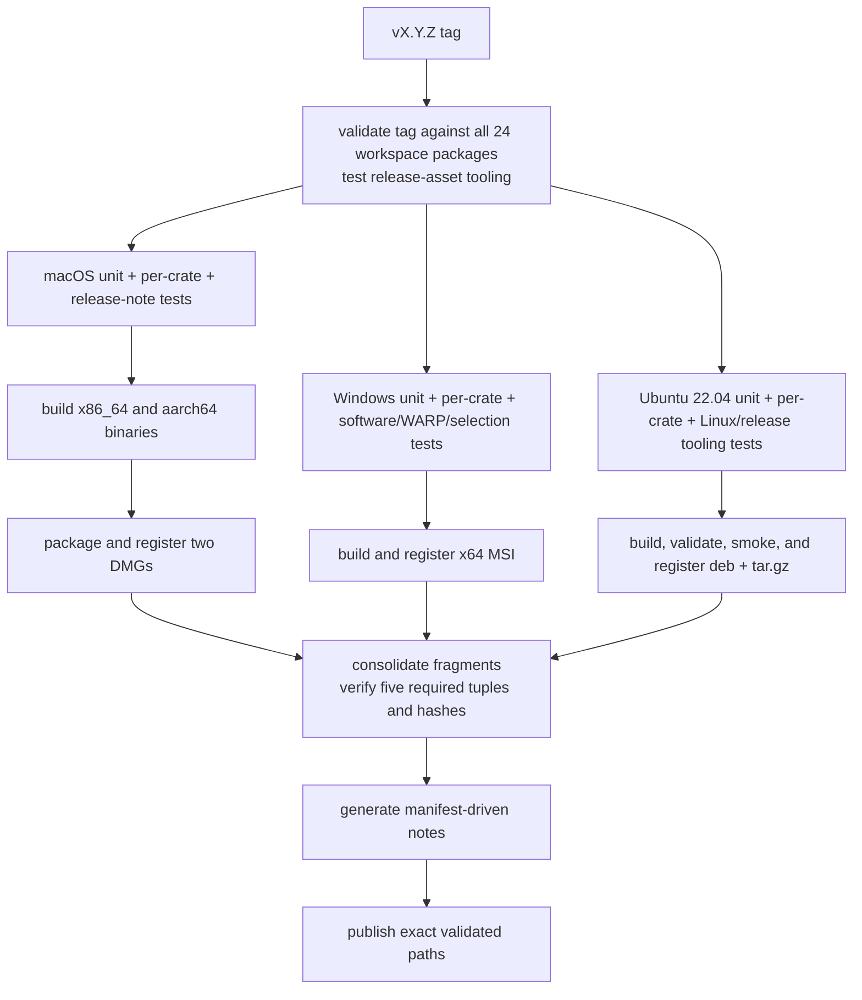
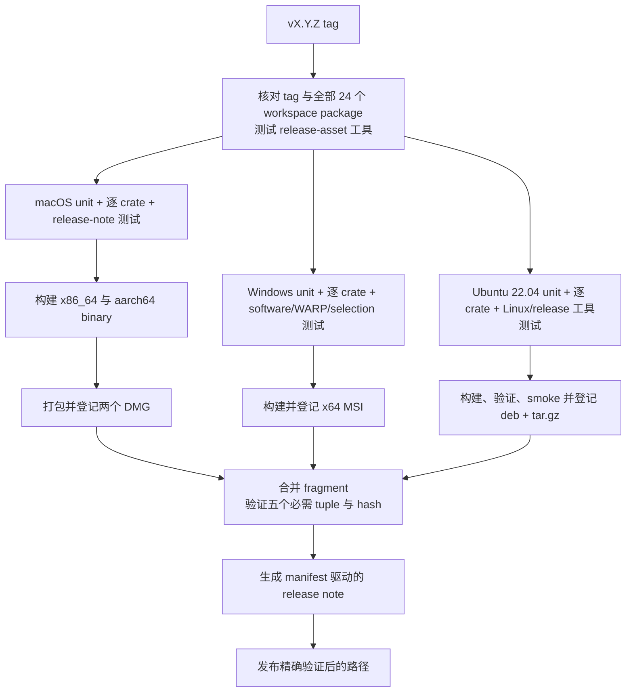

# Development and Release / 开发与发布

## English

This page owns contributor gates, pull-request CI, release publication, and the
one-way GitHub Wiki mirror. Crate responsibilities belong on
[Crate Reference](Crate-Reference), local package commands and layouts on
[Packaging](Packaging), native boundaries on
[Platform Integration](Platform-Integration), and diagnostic fields on
[Logging](Logging).

## Repository and toolchain

```text
Cargo.toml     workspace members, shared package metadata, dependencies, profiles, lints
crates/        24 first-party Rust crates
assets/        fonts, themes, keymaps, icons, localization, screenshots
wiki/          canonical bilingual documentation
scripts/       flat first-party shell and PowerShell automation
.github/       CI, release, wiki publication, issue, PR, and dependency automation
```

The workspace uses resolver 2, Rust edition 2021, and minimum Rust 1.95.
`rust-toolchain.toml` selects stable with rustfmt and clippy. The authoritative
version is `Cargo.toml [workspace.package].version`; every workspace package and
internal path requirement uses it.

Build or run the platform entry point on its native host:

```sh
cargo build
cargo run -p sonicterm-mac       # macOS
cargo run -p sonicterm-windows   # Windows
cargo run -p sonicterm-linux     # Linux; executable name: sonicterm
```

Every crate has a local `CLAUDE.md`. Unit tests use the flat sibling pattern
`foo.rs` + `foo_tests.rs`, declared with `#[cfg(test)] #[path =
"foo_tests.rs"] mod foo_tests;`. Crate roots use `lib_tests.rs` or
`main_tests.rs`; `tests/` is reserved for integration tests through public or
cross-crate behavior.

## Local verification gate

Run the repository gate to the end:

```sh
cargo fmt --all --check
cargo clippy --workspace --all-targets -- -D warnings
cargo clippy -p sonicterm-io --features ssh --all-targets -- -D warnings
RUSTDOCFLAGS="-D warnings" cargo doc --workspace --no-deps
RUSTDOCFLAGS="-D warnings" cargo doc -p sonicterm-io --no-deps --features ssh
cargo test --workspace --lib --bins
bash scripts/check-authored-rust-comments.sh
bash scripts/check-no-raw-process-exit.sh
bash scripts/check-rust-version.sh
bash scripts/check-window-owner-registration.sh
bash scripts/check-workspace-crates.sh
bash scripts/pty-backend-feasibility.sh --check
bash scripts/test-resource-inventory.sh
bash scripts/test-resource-baseline-evidence.sh
bash scripts/test-soak-harness.sh
bash scripts/test-linux-packages.sh
bash scripts/test-release-assets.sh
bash scripts/test-release-notes.sh
bash scripts/test-wiki-publish.sh
scripts/rust-logic-coverage.sh
```

The separate SSH clippy and Rustdoc commands are required because
`--all-targets` does not enable optional features. `cargo test --workspace --lib
--bins` excludes every integration-test binary. `check-workspace-crates.sh`
derives all members from Cargo metadata and runs each package's library/binary
and `--tests` surface; do not stop after the workspace unit command.

The authored-comment checker enforces purpose Rustdoc on effectively public
functions and public trait functions, `# Safety` on public unsafe functions, and
anchored `// When:`, `// SAFETY:`, `// Lock order:`, `// Ordering:`, and
`// Lifecycle:` contracts. `check-no-raw-process-exit.sh` requires shipping code
to exit through `sonicterm_logging::exit_with`.

On Windows, also run the release-blocking deterministic allocator test:

```sh
cargo test -p sonicterm-gpu --test windows_warp_allocator_baseline -- --nocapture
```

It requires a DX12 WARP adapter and allocator report. Production reserved bytes
must be below 64 MiB, the largest block below 128 MiB, and production reserved
bytes below the old-default control. Windows CI is the only reliable compiler
and runner for `#![cfg(target_os = "windows")]` tests; on macOS such files can
compile to no tests. Cross-compiling is unavailable because the Cairo build is
host-architecture-specific.

Release preparation also builds the shipping platform binary, for example:

```sh
cargo build --release -p sonicterm-mac
```

## Pull-request and main CI

`.github/workflows/ci.yml` runs on pull requests and pushes to `main`.

### macOS 14 and Windows latest

Both matrix hosts run:

- rustfmt, workspace clippy, optional-SSH clippy, Cargo metadata, declared
  Rust-version verification, process-exit and window-owner checks;
- authored Rust comments, strict workspace and optional-SSH Rustdoc;
- workspace unit tests and the per-crate library/binary/integration gate;
- host-window, adapter-classification, and renderer-churn probes;
- release-note, wiki-publisher, PTY feasibility, resource inventory, soak, and
  resource-baseline tooling tests, followed by a real resource-baseline capture
  and artifact upload.

Windows additionally installs static Cairo through vcpkg and runs software
presentation capability, WARP allocator, and software-selection presentation
tests. macOS additionally installs `cargo-llvm-cov` and runs the deterministic
logic coverage gate.

### Ubuntu 22.04

The Linux container installs Cairo, Fontconfig, X11, Wayland, Mesa
Vulkan/lavapipe, Xvfb, Weston, and Debian packaging tools. It runs full format,
clippy, Rustdoc, workspace unit, per-crate, authored-comment, exit, Rust-version,
window-owner, Linux package, release-asset, release-note, and wiki-publisher
gates. It then:

1. builds `sonicterm-linux` in release mode;
2. derives one workspace version from Cargo metadata;
3. creates and validates the x86_64 `.tar.gz` and `.deb`;
4. validates desktop/AppStream metadata and runs advisory `lintian`;
5. runs both package layouts on X11/Xvfb and Wayland/Weston with Vulkan/lavapipe;
6. uploads the packages, or smoke logs on failure.

A package smoke cannot pass without a native window, GPU initialization,
`/bin/sh` PTY marker round-trip, and a later native frame presentation.

## Gate blind spots

- `cargo test --workspace --lib --bins` omits integration tests. The per-crate
  gate is what runs `--tests` for all 24 packages.
- `rust-logic-coverage.sh` requires 80% line coverage only for its selected
  deterministic subset. Its ignore regex excludes 11 whole crates, including
  `sonicterm-app` and `sonicterm-gpu`, plus named native/controller files in
  other crates. It runs only on macOS CI. A green percentage does not cover
  native windows, real PTYs/SSH, GPU surfaces, generated FFI, installers, or
  Windows-only logic.
- `deny.toml` records advisory, license, source, and wildcard-dependency policy,
  but no CI job runs `cargo deny check`.
- Native AppKit, Win32, X11/Wayland, font-discovery, PTY, GPU, and installer
  behavior still depends on platform tests, package smokes, release builds, and
  manual use; a symbol-only test cannot prove those boundaries.

## Release workflow

Pushing a tag matching `v<semver>` starts `.github/workflows/release.yml`.
Owner approval to push the tag is separate from running local packaging.
Pre-release tags containing `-` are marked prerelease.



All three platform chains block publication. In particular,
`unit-tests-windows → build-windows → publish` keeps the WARP allocator gate in
the MSI path, and `unit-tests-linux → package-linux → publish` requires both
package layouts to pass both display-system smokes.

### Published assets

The five required package assets are:

- `SonicTerm-<tag>-mac-aarch64.dmg`
- `SonicTerm-<tag>-mac-x86_64.dmg`
- `SonicTerm-<tag>-windows-x86_64.msi`
- `SonicTerm-<tag>-linux-x86_64.deb`
- `SonicTerm-<tag>-linux-x86_64.tar.gz`

Each package job emits a typed fragment containing tag, flat filename,
platform, architecture, kind, and SHA-256. The publish job downloads only the
registered package bundles, verifies each file and hash, requires the five
platform/architecture/kind tuples, rejects duplicate tuples/names and
unregistered release-like files, then generates:

- `release-assets.json`
- deterministic `SHA256SUMS.txt`, including the manifest hash
- `release-upload-paths.txt`, the exact list supplied to GitHub Release

Release notes enumerate the manifest and commits since the preceding tag. The
GitHub Release receives the five packages, `release-assets.json`, and
`SHA256SUMS.txt`; fragment files and `release-upload-paths.txt` are internal
workflow data.

## Manual release checks

Before pushing a tag:

- verify the workspace version and intended tag;
- run the full gate and native release build;
- compare README and every affected wiki page with current config, logging,
  input, palette, rendering, window, platform, and package behavior;
- launch the package, exercise alternate-screen entry/exit, scrolling, busy
  panes, tab tear-out and child cleanup, and inspect adapter logs where relevant.

After pushing, verify every release job and the exact uploaded assets and
checksums. A local package build is not publication.

## Wiki source and publication

The tracked `wiki/` directory is the only documentation source of truth. Every
page has one `## English` half and one `## 中文` half with matching heading-depth
order and equivalent facts. Cross-page source links use bare page names. The
checker also requires a flat Markdown tree, valid links, navigation from each
Home language half to every page, and all Cargo workspace package names in both
Crate Reference halves:

```sh
python3 scripts/check-wiki.py
bash scripts/test-wiki-publish.sh
```

`.github/workflows/publish-wiki.yml` runs after every push to `main`, including
every merged pull request, and by `workflow_dispatch`. It uses the short-lived,
repository-scoped `GITHUB_TOKEN` with `contents: write` to clone
`D0n9X1n/SonicTerm.wiki.git`. `scripts/publish-wiki.sh` replaces the flat
Markdown set and commits `Publish wiki from <source-sha>` only when content
changed. The workflow pushes `HEAD:master`; the Wiki's rendered branch is
`master`. Renames and deletions propagate, and an unchanged mirror is a
successful no-op.

Browser edits are not source and are overwritten by the next publication. Do
not use a PAT, GitHub App private key, or other long-lived credential for this
workflow.

After every merge, verify the newest publication run corresponds to the merge
SHA:

```sh
gh run list --workflow=publish-wiki.yml --limit 3
gh run view <run-id>
tmp="$(mktemp -d)"
git clone "https://github.com/D0n9X1n/SonicTerm.wiki.git" "$tmp/wiki"
git -C "$tmp/wiki" log -1 --oneline
ls "$tmp/wiki"
```

When `wiki/` changed, the newest Wiki commit must identify that merge SHA. When
it did not change, the run should report a successful no-op without a new Wiki
commit. Finally open the live Wiki and click representative English and Chinese
links; workflow success alone does not prove rendering and navigation.

## 中文

本页负责贡献者 gate、pull-request CI、release 发布和 GitHub Wiki 单向镜像。Crate 职责见
[Crate 参考](Crate-Reference)，本地打包命令与布局见[打包](Packaging)，原生边界见
[平台集成](Platform-Integration)，诊断字段见[日志](Logging)。

## 仓库与工具链

```text
Cargo.toml     workspace member、共享 package metadata、依赖、profile、lint
crates/        24 个第一方 Rust crate
assets/        字体、主题、键位、图标、本地化、截图
wiki/          规范双语文档
scripts/       扁平的第一方 shell 与 PowerShell 自动化
.github/       CI、release、Wiki 发布、issue、PR 与依赖自动化
```

Workspace 使用 resolver 2、Rust edition 2021，最低 Rust 版本为 1.95。
`rust-toolchain.toml` 选择 stable，并安装 rustfmt 与 clippy。权威版本位于
`Cargo.toml [workspace.package].version`；所有 workspace package 与内部 path requirement
都使用该版本。

请在对应原生主机上构建或运行平台入口：

```sh
cargo build
cargo run -p sonicterm-mac       # macOS
cargo run -p sonicterm-windows   # Windows
cargo run -p sonicterm-linux     # Linux；可执行文件名为 sonicterm
```

每个 crate 都有本地 `CLAUDE.md`。单元测试采用扁平 sibling 形式 `foo.rs` +
`foo_tests.rs`，并由 `#[cfg(test)] #[path = "foo_tests.rs"] mod foo_tests;` 声明。
Crate root 使用 `lib_tests.rs` 或 `main_tests.rs`；`tests/` 只用于通过 public API 或跨
crate 行为的 integration test。

## 本地验证 gate

请把仓库 gate 完整运行到最后：

```sh
cargo fmt --all --check
cargo clippy --workspace --all-targets -- -D warnings
cargo clippy -p sonicterm-io --features ssh --all-targets -- -D warnings
RUSTDOCFLAGS="-D warnings" cargo doc --workspace --no-deps
RUSTDOCFLAGS="-D warnings" cargo doc -p sonicterm-io --no-deps --features ssh
cargo test --workspace --lib --bins
bash scripts/check-authored-rust-comments.sh
bash scripts/check-no-raw-process-exit.sh
bash scripts/check-rust-version.sh
bash scripts/check-window-owner-registration.sh
bash scripts/check-workspace-crates.sh
bash scripts/pty-backend-feasibility.sh --check
bash scripts/test-resource-inventory.sh
bash scripts/test-resource-baseline-evidence.sh
bash scripts/test-soak-harness.sh
bash scripts/test-linux-packages.sh
bash scripts/test-release-assets.sh
bash scripts/test-release-notes.sh
bash scripts/test-wiki-publish.sh
scripts/rust-logic-coverage.sh
```

必须单独运行 SSH clippy 与 Rustdoc，因为 `--all-targets` 不会启用 optional feature。
`cargo test --workspace --lib --bins` 会排除所有 integration-test binary。
`check-workspace-crates.sh` 从 Cargo metadata 推导 member，并对每个 package 运行
library/binary 和 `--tests`；不能在 workspace unit command 后就停止。

第一方注释 checker 要求有效公开函数和公开 trait 函数带用途 Rustdoc，公开 unsafe 函数带
`# Safety`，并检查准确锚定的 `// When:`、`// SAFETY:`、`// Lock order:`、
`// Ordering:` 和 `// Lifecycle:` 契约。`check-no-raw-process-exit.sh` 要求发布代码通过
`sonicterm_logging::exit_with` 退出。

Windows 还要运行会阻断 release 的确定性 allocator 测试：

```sh
cargo test -p sonicterm-gpu --test windows_warp_allocator_baseline -- --nocapture
```

它要求 DX12 WARP adapter 和 allocator report。生产策略 reserved bytes 必须低于 64 MiB，
最大 block 低于 128 MiB，且生产策略 reserved bytes 低于旧默认 control。只有 Windows CI
能可靠编译并运行 `#![cfg(target_os = "windows")]` 测试；在 macOS 上，这类文件可能编译成
零个测试。Cairo 构建依赖主机架构，因此无法用 cross-compile 替代。

Release 准备还要构建发布平台二进制，例如：

```sh
cargo build --release -p sonicterm-mac
```

## Pull-request 与 main CI

`.github/workflows/ci.yml` 在 pull request 和推送到 `main` 时运行。

### macOS 14 与 Windows latest

两个 matrix host 都运行：

- rustfmt、workspace clippy、optional-SSH clippy、Cargo metadata、声明 Rust 版本校验、
  process-exit 与 window-owner 检查；
- 第一方 Rust 注释、严格 workspace 与 optional-SSH Rustdoc；
- workspace unit test 和逐 crate library/binary/integration gate；
- host-window、adapter 分类和 renderer churn probe；
- release-note、Wiki publisher、PTY feasibility、resource inventory、soak 和
  resource-baseline 工具测试，随后采集真实 resource baseline 并上传 artifact。

Windows 还通过 vcpkg 安装静态 Cairo，并运行 software presentation capability、WARP
allocator 和 software-selection presentation 测试。macOS 还安装 `cargo-llvm-cov`，运行
确定性 logic coverage gate。

### Ubuntu 22.04

Linux container 会安装 Cairo、Fontconfig、X11、Wayland、Mesa Vulkan/lavapipe、Xvfb、
Weston 和 Debian 打包工具。它运行完整 format、clippy、Rustdoc、workspace unit、逐 crate、
第一方注释、exit、Rust 版本、window-owner、Linux package、release-asset、release-note 和
Wiki publisher gate。随后：

1. 以 release 模式构建 `sonicterm-linux`；
2. 从 Cargo metadata 推导唯一 workspace 版本；
3. 生成并验证 x86_64 `.tar.gz` 与 `.deb`；
4. 验证 desktop/AppStream metadata，并以 advisory 方式运行 `lintian`；
5. 用 Vulkan/lavapipe 在 X11/Xvfb 和 Wayland/Weston 上运行两种 package layout；
6. 上传 package，失败时上传 smoke log。

没有原生窗口、GPU 初始化、`/bin/sh` PTY marker 往返和之后的原生 frame 呈现，
package smoke 就不能通过。

## Gate 盲区

- `cargo test --workspace --lib --bins` 不运行 integration test；逐 crate gate 才会对
  24 个 package 运行 `--tests`。
- `rust-logic-coverage.sh` 只对选中的确定性代码子集要求 80% line coverage。其 ignore
  regex 完全排除 11 个 crate，包括 `sonicterm-app` 与 `sonicterm-gpu`，还排除其它 crate
  中点名的原生/控制器文件。它只在 macOS CI 运行。Coverage 通过不能证明原生窗口、真实
  PTY/SSH、GPU surface、生成 FFI、installer 或 Windows-only logic。
- `deny.toml` 记录 advisory、license、source 与 wildcard dependency policy，但没有 CI job
  运行 `cargo deny check`。
- AppKit、Win32、X11/Wayland、字体发现、PTY、GPU 和 installer 的真实行为仍依赖平台测试、
  package smoke、release build 与手工使用；只检查 symbol 不能证明这些边界。

## Release workflow

推送符合 `v<semver>` 的 tag 会启动 `.github/workflows/release.yml`。所有者批准推送 tag
与本地运行打包是两件事。含 `-` 的 pre-release tag 会自动标为 prerelease。



三个平台链都会阻断发布。`unit-tests-windows → build-windows → publish` 把 WARP allocator
gate 留在 MSI 路径中；`unit-tests-linux → package-linux → publish` 要求两种 package layout
都通过两种 display system smoke。

### 发布资产

五个必需 package asset 为：

- `SonicTerm-<tag>-mac-aarch64.dmg`
- `SonicTerm-<tag>-mac-x86_64.dmg`
- `SonicTerm-<tag>-windows-x86_64.msi`
- `SonicTerm-<tag>-linux-x86_64.deb`
- `SonicTerm-<tag>-linux-x86_64.tar.gz`

每个 package job 会生成类型化 fragment，记录 tag、扁平文件名、platform、architecture、kind
和 SHA-256。Publish job 只下载已登记的 package bundle，验证文件与 hash，要求五个
platform/architecture/kind tuple，拒绝重复 tuple/名称和未登记的 release-like 文件，然后生成：

- `release-assets.json`
- 确定性的 `SHA256SUMS.txt`，其中也包含 manifest hash
- `release-upload-paths.txt`，即传给 GitHub Release 的精确列表

Release note 会列出 manifest 内容和上一个 tag 之后的 commit。GitHub Release 最终收到五个
package、`release-assets.json` 和 `SHA256SUMS.txt`；fragment 文件和
`release-upload-paths.txt` 只是 workflow 内部数据。

## 手工发布检查

推送 tag 前：

- 确认 workspace 版本和目标 tag；
- 运行完整 gate 与原生 release build；
- 对照当前 config、logging、input、palette、rendering、window、platform 和 package 行为，
  检查 README 与所有受影响 Wiki 页面；
- 启动 package，测试备用屏幕进入/退出、滚动、繁忙窗格、标签页拖出与子进程清理，
  并在相关场景检查 adapter 日志。

推送后，验证每个 release job，以及实际上传的精确资产和 checksum。本地生成 package 不等于发布。

## Wiki 源码与发布

受版本控制的 `wiki/` 是唯一文档事实来源。每页包含一个 `## English` 和一个 `## 中文`，
两半标题深度顺序一致、事实等价。跨页链接使用不带扩展名的页面名。Checker 还要求 Markdown
树保持扁平、链接有效、Home 的两个语言半页都能导航到每个页面，并要求 Crate Reference
两半都包含 Cargo workspace 全部 package 名：

```sh
python3 scripts/check-wiki.py
bash scripts/test-wiki-publish.sh
```

`.github/workflows/publish-wiki.yml` 在每次推送到 `main` 后运行，包括每个合并的 pull request，
也支持 `workflow_dispatch`。它使用生命周期短、只限本仓库且具有 `contents: write` 的
`GITHUB_TOKEN` 克隆 `D0n9X1n/SonicTerm.wiki.git`。`scripts/publish-wiki.sh` 替换全部
扁平 Markdown；只有内容变化时才提交 `Publish wiki from <source-sha>`。Workflow 推送
`HEAD:master`，Wiki 的渲染分支是 `master`。重命名和删除都会同步；内容相同时成功 no-op。

网页端编辑不是事实来源，下次发布会覆盖它。该 workflow 不应使用 PAT、GitHub App private key
或其它长期凭据。

每次合并后，确认最新发布 run 对应 merge SHA：

```sh
gh run list --workflow=publish-wiki.yml --limit 3
gh run view <run-id>
tmp="$(mktemp -d)"
git clone "https://github.com/D0n9X1n/SonicTerm.wiki.git" "$tmp/wiki"
git -C "$tmp/wiki" log -1 --oneline
ls "$tmp/wiki"
```

若 `wiki/` 有变化，最新 Wiki commit 必须标识该 merge SHA；若无变化，run 应成功 no-op 且不
创建新 Wiki commit。最后打开在线 Wiki，点击具有代表性的英文和中文链接；workflow 成功本身
不能证明页面渲染和导航正确。
