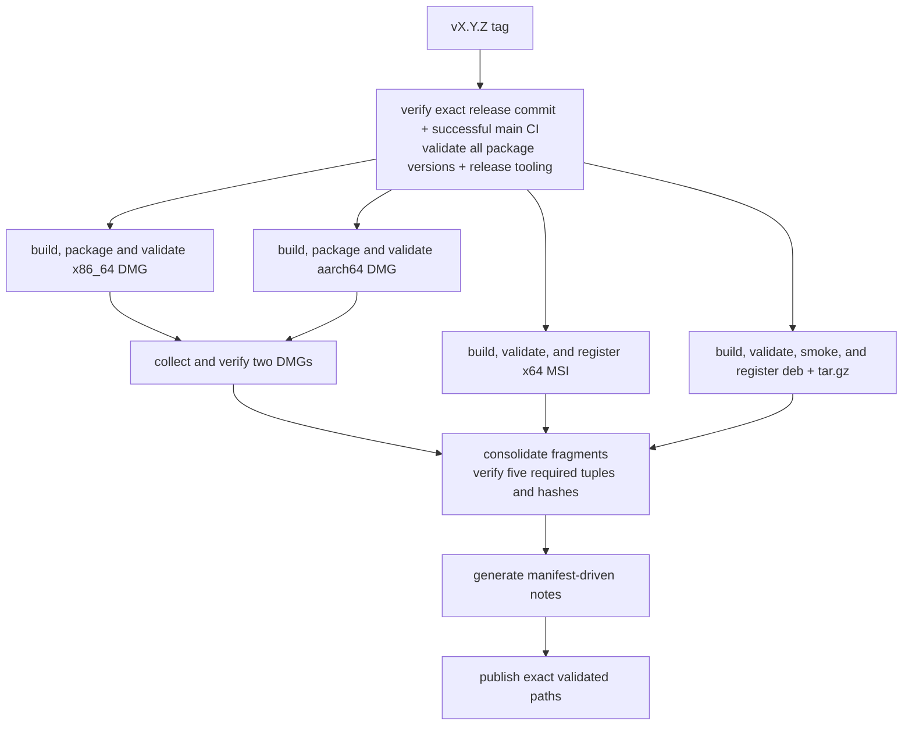
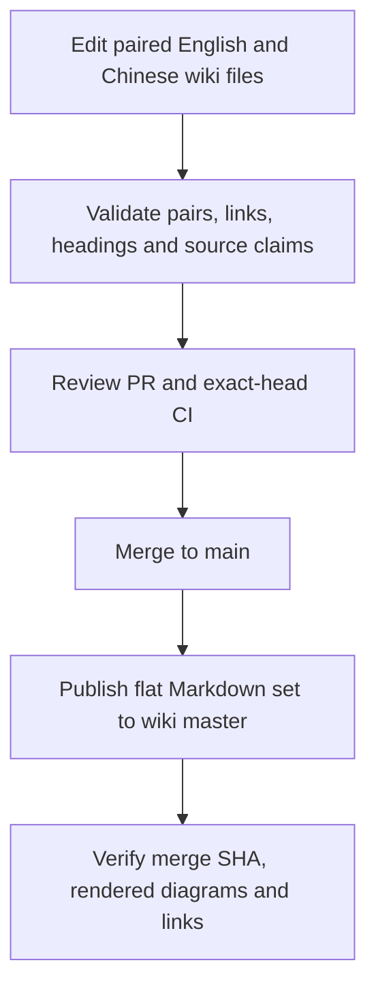

# Development and Release

[简体中文](Development-and-Release-zh-CN)

Before a PR, run the full local gate below. Before merging, require exact-head
platform CI; after merging, verify Wiki publication. Release tags need separate
approval and exact successful `main` CI. Local package commands are in
[Packaging](Packaging), and crate responsibilities in [Crate Reference](Crate-Reference).

## Repository and toolchain

```text
Cargo.toml     workspace members, shared package metadata, dependencies, profiles, lints
crates/        23 first-party Rust crates
assets/        fonts, themes, keymaps, icons, localization, screenshots
wiki/          canonical bilingual documentation
scripts/       flat first-party shell and PowerShell automation
.github/       CI, release, wiki publication, issue, PR, and dependency automation
```

The workspace uses resolver 2, Rust edition 2021, and minimum Rust 1.95.
`rust-toolchain.toml` selects stable with rustfmt and clippy. The authoritative
version is `Cargo.toml [workspace.package].version`; every workspace package and
internal path requirement uses it.

Build or run the platform entry point on its native host:

```sh
cargo build
cargo run -p sonicterm-mac       # macOS
cargo run -p sonicterm-windows   # Windows
cargo run -p sonicterm-linux     # Linux; executable name: sonicterm
```

Every first-party workspace crate has a local `CLAUDE.md`. Unit tests use the flat sibling pattern
`foo.rs` + `foo_tests.rs`, declared with `#[cfg(test)] #[path =
"foo_tests.rs"] mod foo_tests;`. Crate roots use `lib_tests.rs` or
`main_tests.rs`; `tests/` is reserved for integration tests through public or
cross-crate behavior. The `sonicterm-ui` and `sonicterm-render-model` crate-root
suites inventory every direct source module and require either that exact sibling
declaration or a non-empty explicit exemption. A declared sibling file must
exist and contain a `#[test]`; source-directory modules fail the flat inventory.
An exemption becomes stale as soon as the module gains its own sibling suite.

## Native dependency maintenance

`scripts/native-dependencies.json` is the machine-readable inventory for the
embedded native libraries and the pinned winit source. Each entry pins an upstream release commit,
archive checksum, explicit source subset, the upstream fixes carried on top of
that release, and the complete imported tree checksum. An `upstream_fixes` record
is provenance only: a full upstream revision and the URL to read it. The
repository keeps no local patch files, because the vendored sources — not an
archive plus a patch series — are the source of truth for what SonicTerm builds.
Required sources, headers, licenses, and changelogs are retained; unneeded
upstream demos and CI trees are not build inputs. This is separate from
Cargo.lock and from platform-provided Cairo/Fontconfig.

`crates/sonicterm-winit` retains the Windows/macOS/Linux source subset of upstream
winit 0.30.13, with the Windows-only native-key metadata extension. Its package
identity remains `winit`, and it is excluded from first-party workspace membership;
the directory name does not make it a SonicTerm-versioned package. Cargo pins that
version and patches it to this local source. Shared code, desktop backends, required
fixture data, unit tests, Send/Sync/serde integration tests and the Apache-2.0 license
are retained. Examples, example-only development dependencies, historical documentation,
and Android/iOS/Web/Redox backends are omitted; unsupported targets are rejected.

The source inventory keeps the original archive checksum and upstream revision,
records the imported subset, and pins a digest over every file in the local tree.
The subset list does not hide extra files from verification. Modified upstream
files carry local change notices, not entries claiming upstream fixes. The
Apache-2.0 license ships with each desktop package; see [Packaging](Packaging).

Preserved winit source is excluded from the first-party authored-comment scan.
The authored keyboard sibling test remains checked; reviewers inspect every changed
hunk in mixed upstream files for purpose, safety and control-flow rationale.
A matching tree digest detects source drift but does not replace that review.
On every desktop host the gate explicitly runs the dependency's unit and integration
tests with `serde`, plus warnings-denied Rustdoc, because workspace exclusion also
excludes it from workspace tests and documentation. Windows includes the native
metadata unit tests. Both invocations use `--locked` with the subset's independently
pruned `Cargo.lock`; checks of the workspace lockfile alone do not cover that graph.
Build output goes to the repository target directory, not the pinned source tree.

The verifier is Python-standard-library-only, offline, and check-only:

```sh
python3 scripts/native-dependencies.py check
python3 scripts/native-dependencies.py check --library freetype
python3 scripts/native-dependencies_tests.py
```

`check` rejects missing, modified, or additional vendor files, unpinned tree
hashes, manifest entries that still declare the retired `patches` key, and
`upstream_fixes` records that omit a revision or URL or name a local file.
Source paths and raw bytes form the hash; executable modes and empty directories
do not. `.gitattributes` disables newline conversion for vendor trees so Windows
checks the same upstream bytes.

A matching digest proves the working copy still holds the reviewed, committed
bytes. It does not establish publisher identity and does not prove absence of
vulnerabilities; that evidence comes from the recorded base release and from
reading each recorded upstream fix at its source. There is no command that
reconstructs a locally patched tree, and the tool does not pretend otherwise.

For an update, use one reviewable library change at a time:

1. Review the official release and advisories, including regressions in the new
   release. Verify the publisher/source and available signature or independently
   published checksum; record any verification limitation. A newer version is not
   automatically a fixed version. Avoid branch-head or unattended imports.
2. Update that manifest entry with the immutable release identity and verified
   archive hash. Record every required upstream fix as a full revision and URL,
   and inspect its prerequisites upstream. Drop a recorded fix only after proving
   the selected release contains it. Keep unrelated native features enabled.
3. Download the recorded archive separately and expand it outside the repository.
   Import the recorded source subset by hand and apply each recorded upstream fix
   from its upstream commit, comparing that commit against the release you are
   importing rather than against a stored copy. Diff the result against the
   current vendor tree, replace only that clean vendor directory, then record the
   new `tree_sha256` from `check`'s reported digest after reviewing the diff.
   Review added/removed C/C++ files against `build.rs`; an import is not a
   compilation result.
4. For FreeType/HarfBuzz, use `cargo install bindgen-cli --version 0.71.1 --locked`
   and run `bash scripts/regenerate-freetype.sh` or
   `bash scripts/regenerate-harfbuzz.sh`. `BINDGEN` can select a separately installed
   executable of that exact version. Both scripts compile the small
   `scripts/freetype-config.rs` helper to reuse the build's configured header.
   Review ABI and behavioral changes, not just
   version strings; regeneration must preserve crate-owned modules and tests.
5. Run the offline checks, native crate tests, full local gate, and native
   rendering checks under normal colors with isolated config/log roots and HOME
   preserved. Compare variable/color fonts, CJK, emoji, ligatures, fallback and
   raster output. Require exact-head platform CI; local macOS tests do not validate
   Windows code or Intel binaries. Update both wiki language files in the same PR.

The vendored FreeType carries two upstream fixes for excess-coordinate handling
after 2.14.3; the vendored zlib carries the invalid-distance decoding fix and the
related gzip-write corrections after 1.3.2. Those fixes are already present in the
imported sources, and the manifest records the full upstream commits for each one.
These choices do not establish that every advisory is reachable through SonicTerm
or that every remaining upstream defect is fixed. Recheck upstream
releases/advisories when preparing each dependency update and before a release;
updates remain reviewed changes rather than automatic merges.

## Local verification gate

Run the repository gate to the end:

```sh
cargo fmt --all --check
cargo clippy --workspace --all-targets -- -D warnings
RUSTDOCFLAGS="-D warnings" cargo doc --workspace --no-deps
RUSTDOCFLAGS="-D warnings" cargo doc -p sonicterm-resource --all-features --no-deps
bash scripts/check-authored-rust-comments.sh
bash scripts/check-no-raw-process-exit.sh
bash scripts/check-rust-version.sh
bash scripts/check-window-owner-registration.sh
bash scripts/check-workflow-supply-chain.sh
bash scripts/check-workspace-crates.sh
bash scripts/pty-backend-feasibility.sh --check
bash scripts/test-resource-inventory.sh
bash scripts/test-resource-baseline-evidence.sh
bash scripts/test-soak-harness.sh
bash scripts/test-linux-packages.sh
bash scripts/test-release-assets.sh
bash scripts/test-release-notes.sh
bash scripts/test-wiki-publish.sh
scripts/rust-logic-coverage.sh
```

The separate `sonicterm-resource` Rustdoc command is required because
`test-util` is the workspace's only optional feature and `cargo doc` builds no
dev-dependencies. Workspace Clippy and tests already compile `test-util`
through `sonicterm-logging`'s dev-dependency on it. The font stack has no
optional vendor features: St.Helens is a normal tracked asset and other fallback
faces come from native discovery.
`check-workspace-crates.sh` first runs the native-source verifier unit tests,
its offline integrity check, and portable macOS bundle tests, then runs one fail-complete
`cargo test --workspace --lib --bins --tests --no-fail-fast` command for default
features. Each phase runs even if an earlier phase fails. It covers every workspace library, binary, and integration-test target
without repeating the unit and binary targets in a serial per-package loop.

The authored-comment checker enforces purpose Rustdoc on effectively public
functions and public trait functions, `# Safety` on public unsafe functions, and
anchored `// When:`, `// SAFETY:`, `// Lock order:`, `// Ordering:`, and
`// Lifecycle:` contracts. `check-no-raw-process-exit.sh` requires shipping code
to exit through `sonicterm_logging::exit_with`.
`check-workflow-supply-chain.sh` enforces the workflow contract described in
[Workflow supply chain](#workflow-supply-chain); it runs its own parser tests
first, so a scan that silently stops matching cannot report a green gate.

On Windows, also run the release-blocking deterministic allocator test:

```sh
cargo test -p sonicterm-gpu --test windows_warp_allocator_baseline -- --nocapture
```

It requires a DX12 WARP adapter and allocator report. Production reserved bytes
must be below 64 MiB, the largest block below 128 MiB, and production reserved
bytes below the old-default control. Windows CI is the only reliable compiler
and runner for `#![cfg(target_os = "windows")]` tests; on macOS such files can
compile to no tests. Cross-compiling is unavailable because the Cairo build is
host-architecture-specific.

The Windows `windows_font_weight_present` test yields to native message dispatch
between setup, render, capture, individual weight actions, and cache checks.
Every phase checks that its window remains responsive; errors and completion
release the renderer and verify the live-renderer baseline. A missing redraw
fails at the 180-second test deadline. Native GDI pixel comparisons remain
required, including when `SONICTERM_FONT_PROBE_DIR` enables dense readback and
image evidence.

Release preparation also builds the shipping platform binary, for example:

```sh
cargo build --release -p sonicterm-mac
```

## Pull-request and main CI

`.github/workflows/ci.yml` runs on pull requests and pushes to `main`. Pull-request
runs share a ref-specific concurrency group and cancel an obsolete run when that
ref advances. Each `main` push instead has a SHA-specific group and never
cancels in progress, so a later merge cannot erase the exact-SHA verification
record for an earlier one.

Never merge or enable auto-merge while a required pull-request job is queued,
in progress, missing, cancelled, unexpectedly skipped, or failed. The macOS,
Windows, and Ubuntu jobs must each finish successfully on the exact reviewed
head commit before merge. Windows success is mandatory because that job is the
only reliable compiler and runner for Windows-only tests; local, macOS, Ubuntu,
or review results cannot substitute for it. After every merge, verify Wiki
publication before starting the next serialized pull request. Successful
exact-head PR CI is the CI gate for PR work; `main` CI is a release-provenance
gate only and does not block the next PR.

Keep every wait off the main agent. For each lifecycle that must wait or monitor
— a long local gate, pull-request CI, post-merge Wiki publication,
release-provenance `main` CI, or a release workflow — start one dedicated watcher subagent, not one subagent
per job. Give it an immutable handoff: repository/worktree path, expected commit
SHA, PR number or run ID, exact required jobs or commands, timeout, and success
criteria. The watcher owns that lifecycle until terminal `SUCCESS`, `FAILURE`,
`BLOCKED`, or `STALE`, and reports the expected and observed SHA, run IDs, every
required result, and actionable failure evidence. It returns immediately when
the head changes or a required job fails, is cancelled, or is unexpectedly
skipped; it never follows a replacement run or accepts a green result by branch
name alone.

While the watcher runs, the main agent advances only a non-overlapping item in a
separate worktree based on the current default branch; it never edits the tree
being tested. Watchers do not push, merge, tag, publish, or clean shared state.
Run at most one full Cargo gate or build on the host at once, never share a
`CARGO_TARGET_DIR` between concurrent worktrees, and use heavy-gate time for
research, editing, or lightweight checks. A watcher failure, blocker, or stale
SHA immediately returns the main agent to the current lifecycle.

Concurrency does not relax publication order: do not merge before the current
pull request's exact-head checks pass, and do not open the next pull request
before the current one is merged and its exact merge-SHA Wiki publication is
verified. Do not wait for `main` CI to advance PR work; require it when validating
a release commit. Then update the next worktree onto the new
default-branch tip and rerun affected validation before publication. Once those
gates pass, fetch and prune the default remote, then clean local state against
its symbolic default branch. Remove only clean, unlocked worktrees whose HEAD is
merged there, and delete only merged local branches not attached to a preserved
worktree. Never force removal or discard dirty, unmerged, or locked worktrees or
any stash.

### macOS 14 and Windows latest

The stable required checks are fail-closed aggregate jobs: `macos-14 / unit
tests` requires `macos-core`, `macos-coverage`, and `macos-smoke`, while
`windows-latest / unit tests` requires `windows-native`, `windows-checks`,
`windows-tests`, and `windows-smoke`.
Each aggregate runs with `if: always()` and accepts only explicit `success`
results, so a failed, cancelled, or skipped shard cannot turn into a successful
required check.

The macOS core shard runs source-policy checks, strict Rustdoc, the one-pass
workspace test gate, host probes, tooling tests, and real resource-baseline
capture. Its independent coverage shard installs the pinned
`cargo-llvm-cov` and runs the deterministic logic coverage gate. The restore-only
`macos-smoke` matrix builds shipping release binaries on macOS 14 Apple Silicon
and macOS 15 Intel with distinct dependency-cache keys. Both lanes require the
bounded raw-binary smoke, then build and mount a DMG on that same architecture.
The installed bundle passes relative-library closure, signature, deployment-floor,
Homebrew-denied runtime/Cairo drawing, and exact bundled-font registration checks;
a controlled same-binary image pair records compressed font savings. The macOS
aggregate requires both matrix lanes. Release jobs also package on their matching
architecture; the final macOS artifact job collects already-validated DMGs.

Windows first prepares static Cairo through vcpkg. It restores the binary cache,
builds a cold miss, and saves that result immediately before the three dependent
shards start. Consumers allow 12 minutes for Cairo installation: a restored
fallback archive may contain no compatible packages after a hosted-image or
vcpkg revision change, so dependency setup must still accommodate a cold build.
The producer retains its 30-minute limit, and consumer job limits are unchanged.
The checks shard runs format, Clippy, source-policy, comment, and
Rustdoc gates. The test shard runs the one-pass workspace tests, host
probes, fail-closed GDI presentation verification, WARP allocator,
software-selection presentation, tooling tests, and real resource-baseline
capture. The GDI wrapper accepts only one `capability=EXERCISED` verdict;
`HOST_INCAPABLE` remains informational and cannot satisfy the gate. The
restore-only `windows-smoke` shard builds the shipping release binary and
requires its bounded native smoke.

Each platform's Rust-consuming shards share one dependency cache key and exclude
workspace-crate artifacts. Only the core/checks shard may save it, and only on a
push to `main`; coverage, test, package, and every pull-request lane are
restore-only. This bounds cache entries and prevents parallel immutable-key
writers while still warming later runs.

Every job and authored step in the normal-CI, release, and wiki-publication
workflows has an explicit timeout sized above recent cold-cache runtime. Fast
checks, transfers, and native probes use short limits; workspace, coverage,
dependency, native-build, and package stages retain larger compile/network
margins. The real resource-baseline collector separately bounds each focused PTY
command at 30 seconds and its live soak at 90 seconds. A timeout kills the
command's process tree, records exit 124 plus partial stdout/stderr in the
evidence bundle, and continues writing checksums; the workflow's ten-minute
limit is the final guard around that collector.

Python `*_tests.py` entry points default to verbose `unittest` output: each test's
name is flushed before its body runs, followed by its result. Native dependency
checks emit flushed `[native-dependencies] start NAME` and `finish NAME exit=N`
lines to stderr. The native-smoke CLI emits `[native-smoke] start timeout=Ns`
before launch and `finish exit=N` after capability validation; captured child
output is flushed before the final status. Package checks emit
`[package-check] start LABEL timeout=Ns` and `finish LABEL exit=N`; the font/Cairo
probe instead finishes with `result=PASS` or `result=FAIL` after report validation.
These progress lines are flushed to stderr without changing stdout payloads,
exit codes, or captured log files. The resource-baseline collector also emits
flushed per-command start/finish progress. A start line identifies work in
progress, not a passing check.

### Ubuntu 22.04

The stable `ubuntu 22.04 / workspace, packages, X11, Wayland` aggregate requires
`linux-core` and `linux-packages`, using the same fail-closed result check as
the macOS and Windows aggregates. The core shard installs the compile-time Linux
dependencies plus Vulkan/lavapipe for GPU tests and adapter probes, then runs
format, Clippy, Rustdoc (including `sonicterm-resource` with its `test-util`
feature), the one-pass workspace test gate, authored-comment, exit,
Rust-version, window-owner, workflow supply-chain, Linux-package, release-asset,
release-note, and wiki-publisher checks.

All three Ubuntu dependency-install steps in CI and Release allow 20 bounded
minutes so a slow cold Jammy mirror can finish without weakening the CI shards'
fail-closed result or the release provenance boundary.
The independent package/runtime shard installs Mesa Vulkan/lavapipe, Xvfb,
Weston, and Debian packaging tools, then:

1. builds `sonicterm-linux` in release mode;
2. derives one workspace version from Cargo metadata;
3. creates and validates the x86_64 `.tar.gz` and `.deb`;
4. validates desktop/AppStream metadata and runs advisory `lintian`;
5. runs both package layouts on X11/Xvfb and Wayland/Weston with Vulkan/lavapipe;
6. uploads the packages, or smoke logs on failure.

A platform smoke cannot pass without a native window, renderer/device, a
platform-shell PTY marker observed in the live grid, a later native frame
presentation, and the default warm renderer's create/report/adopt/child-present/
release lifecycle with the process renderer count restored. Every invocation
uses separate scratch config/log roots and the process-tree-reaping wrapper; a
warm-lifecycle failure exits `16`. The core shard is the sole main-only Linux
dependency-cache writer; the package shard is restore-only and workspace-crate
artifacts remain excluded.

macOS and Windows smoke also read back native numbered titles and exercise
Unicode rename/reset on startup and warm-adopted windows. Mismatches fail at the
display boundary (exit `11`). Linux still requires external X11 property or
Wayland compositor-visible evidence: winit's X11 getter is unimplemented and its
Wayland getter is only cached state. These checks do not verify OS switcher labels.

Windows smoke additionally installs the production OLE backend. Main, warm-adopted,
and fresh child windows must each register and revoke their custom drop target;
the post-run report requires three successful pairs, zero live registrations and
zero failures before OLE is uninitialized. Windows-only COM tests use hidden HWNDs
and real data objects to verify duplicate-owner refusal, Unicode file delivery,
exact target identity and cleanup. They do not synthesize or verify physical drag
gestures. See [Platform Integration](Platform-Integration).

## Gate blind spots

- The one-pass workspace gate includes integration tests for all 23 packages,
  but it still exercises only targets that can compile and run on its host.
- `rust-logic-coverage.sh` requires 80% line coverage only for its selected
  deterministic subset. Its ignore regex excludes 10 whole crates, including
  `sonicterm-app` and `sonicterm-gpu`, plus named native/controller files in
  other crates. It runs only on macOS CI. A green percentage does not cover
  native windows, real PTYs, GPU surfaces, generated FFI, installers, or
  Windows-only logic.
- The same run reports its profiles again without the ignore regex and prints
  line coverage for every workspace member, and `scripts/coverage-floor.py`
  holds each measured crate to its entry in `scripts/coverage-baseline.json`.
  CI fails when a crate drops more than 1.0 percentage point below its entry
  or has no entry, and when the report disagrees with the workspace members and
  declared not-measured crates: a crate with an entry stops being measured, a
  member is neither measured nor declared, or a declared crate starts reporting
  lines. Test, vendored, generated, and build-script code is excluded with
  printed counts; a crate with no eligible line prints `not measured` with its
  reason. The floor catches regressions, not low coverage: a crate that stays
  low still passes. The `sonicterm-windows` and `sonicterm-linux` rows measure
  code compiled on macOS, not execution on those platforms. The baseline is
  keyed to the macOS arm64 CI runner; CI on another host fails as not
  comparable, and local runs print informational deltas without a verdict. The
  floor changes only in a reviewed diff with a stated reason, produced by
  `coverage-floor.py --update-baseline --reason` or copied from the proposed
  baseline CI prints when a crate lacks an entry or the host changed.
- `deny.toml` records advisory, license, source, and wildcard-dependency policy,
  but no CI job runs `cargo deny check`.
- Native AppKit, Win32, X11/Wayland, font-discovery, PTY, GPU, and installer
  behavior still depends on platform tests, package smokes, release builds, and
  manual use; a symbol-only test cannot prove those boundaries.

## Workflow supply chain

`scripts/check-workflow-supply-chain.sh` enforces action pins and token scope
locally and in macOS, Windows, and Ubuntu core/checks shards. Release requires
an exact successful `main` CI run containing these checks before platform jobs.

**Pin every remote action to a full lowercase 40-character commit SHA**, followed
by its release comment `# vX.Y.Z`. Unlike tags or branches, that identity cannot
be retargeted without a reviewed change here. The checker rejects tags, branches,
abbreviated or uppercase SHAs, tag-pinned `docker://` references, and two different
pins for the same action. Local `./` actions need no pin: their code is reviewed
in the same PR.

`dtolnay/rust-toolchain` is pinned to a full commit SHA with a `# v1` version
comment, like the other remote actions. Every call passes `toolchain: stable`
explicitly. The action implementation is immutable; the requested Rust channel
still follows stable. A version comment is not a mutable tag reference.

**`contents: write` exists only on the job that publishes.** Every workflow
defaults to `contents: read`, and only `release.yml`'s and `publish-wiki.yml`'s
`publish` jobs re-grant write, at job scope. The token a third-party action
inherits is the job's, so a workflow-level write grant hands repository write
access to every action in every job — including the ones that only compile and
package. The release consequence is concrete: the uploader runs after checksum
consolidation, so a write-capable token in a build job could publish bytes
other than the validated set. The permitted jobs and their exact writable scopes are enumerated in
`WRITE_BOUNDARY` in `scripts/check-workflow-supply-chain.py`; adding one is a
reviewable edit to that list, not an unnoticed line in a workflow.

The checker accepts directly written block mappings for `jobs`, `steps`,
`uses`, and `permissions`. It rejects flow mappings, explicit mapping keys,
anchors, aliases, and merge keys rather than trying to partially interpret
YAML forms that could hide a mutable action or write grant. Explicit YAML type
tags are rejected for the same reason. Quoted scalar keys and permission values
remain supported and are normalized before policy checks.

Dependabot's `github-actions` ecosystem is deliberately unfiltered, unlike the
`cargo` ecosystem's patch-only policy. A pinned SHA has no floating tag
absorbing upstream fixes, so a pin Dependabot may not advance is a pin that
rots and never receives the security patch it is holding back. Dependabot
rewrites both the SHA and its trailing version comment.

## Release workflow

Pushing a tag matching `v<semver>` starts `.github/workflows/release.yml`.
Owner approval to push the tag is separate from running local packaging.
Pre-release tags containing `-` are marked prerelease.

Before any platform job starts, validation peels the tag ref to its commit,
fetches full `origin/main` history, requires that commit to be its ancestor, and
uses read-only `actions` access to find a completed successful `CI` push run
whose head is exactly that commit. That exact run already includes the full
source, unit, integration, platform-runtime, allocator, coverage, package, and
Wiki-tooling gates. The release validator therefore checks only the workspace
version and release-asset tooling before packaging; it does not rerun the
platform test graph. A tag on an unreviewed branch, a tag whose main run failed
or is missing, a version mismatch, or a release-asset contract failure cannot
reach package construction.



All three packaging chains block publication. Each macOS architecture and the
Windows release job run the exact built shipping binary's native smoke before
its artifact can advance; Windows does not rerun the GDI test because the release
provenance boundary already requires the exact successful `main` CI result that
proved `EXERCISED`. Windows Release restores the main-published vcpkg binary
cache but performs its Rust target build without a Release cache write. All
Release Rust target builds are cache-independent, so tag-specific cache entries
cannot displace the bounded CI dependency caches. The Linux chain retains both
X11 and Wayland package smokes before its artifacts can reach publication.

### Published assets

The five required package assets are:

- `SonicTerm-<tag>-mac-aarch64.dmg`
- `SonicTerm-<tag>-mac-x86_64.dmg`
- `SonicTerm-<tag>-windows-x86_64.msi`
- `SonicTerm-<tag>-linux-x86_64.deb`
- `SonicTerm-<tag>-linux-x86_64.tar.gz`

Each package job emits a typed fragment containing tag, flat filename,
platform, architecture, kind, and SHA-256. The publish job downloads only the
registered package bundles, verifies each file and hash, requires the five
platform/architecture/kind tuples, rejects duplicate tuples/names and
unregistered release-like files, then generates:

- `release-assets.json`
- deterministic `SHA256SUMS.txt`, including the manifest hash
- `release-upload-paths.txt`, the exact list supplied to GitHub Release

Release notes retain manifest-derived downloads, integrity metadata, verification,
and non-merge commit history since the preceding reachable tag (not the highest
version tag). Missing predecessor lookup fails by default; fetch the complete
tag history rather than silently treating a lookup failure as a first release.
Only explicit `RELEASE_FIRST=1` permits no-base notes and conflicts with any set
`PREVIOUS_TAG`. Shallow repositories are rejected. In first-release mode the
displayed history is limited to 200 commits; issue selection still considers the
entire reachable history within its explicit bounds. The GitHub Release receives the five packages,
`release-assets.json`, and `SHA256SUMS.txt`; fragment files and
`release-upload-paths.txt` are internal workflow data.

### Resolved-issue provenance

`scripts/release-issues.py` supplies the **Resolved issues** section. It resolves
head/base to commits, requires base ancestry, and includes every commit reachable
from head but not base, including merge commits. Paginated REST commit-to-PR
associations are discovery hints; a merged PR's GraphQL `closingIssuesReferences`
and explicit commit closing keywords nominate issues. `Refs #123`, a milestone,
and present-day closed state are not closure evidence. Issue-vs-PR identity is
checked and issue entries are deduplicated, sorted, and Markdown-escaped; links
are constructed only from validated owner/repository names and integer numbers.

An issue is included only when a GraphQL `ClosedEvent.closer` identifies an
in-range commit, or a merged PR whose `mergeCommit` is in range. This supports
merge, squash, and rebase integration without requiring REST timeline `commit_id`
to be non-null. Mutable PR links alone cannot establish shipped closure; prior
ancestor closures are not presented as newly delivered, and closures after head
are excluded. Empty commit-to-PR association lists are normal. A genuine empty
result says **No linked issues resolved in this release range**.

Canonical `This reverts commit <full SHA>` Git messages cancel the target's
contribution; merge reverts also cancel introduced commits, and reverting a revert
restores its contribution. A PR with a reverted associated constituent is omitted
conservatively. Prose-only or partial/semantic reversals without canonical Git
markers are not inferred. This is linked GitHub closure evidence, not a claim to
find every fix or prove the runtime effect of arbitrary changes. Missing/deleted
metadata, unknown non-null closer types, malformed schemas, inconsistent pagination,
and ambiguous provenance fail generation instead of publishing a partial list.

A null closer never enters **Resolved issues**. Instead, nominated issues that are
currently closed can appear under **Manually closed issues (unverified release
linkage)** when their current closure event falls after the base commit date and
no later than the head commit date (first releases have no lower date bound).
The event and issue closure timestamps must agree within one second, accommodating
GitHub's timestamp precision; missing/invalid dates or multiple matching events
still fail. Previously shipped commit-linked closures remain excluded. This
separate disclosure names the closure date and explicitly does not prove that
the release resolved the issue; mutable PR links and dates never replace ancestry
checks in the verified list.

The collector caches exact API pages, requests 100 entries per page, and permits
at most 20 pages per connection, 2,000 range commits, 1,000 API attempts, 4 MiB per
child output, and 32 MiB aggregate API output. Each request has 15 seconds inside
a 240-second total deadline; owned child trees are killed/reaped on timeout or
output overflow. Only timeout, HTTP 429, explicit rate limits, and HTTP 5xx retry
(up to three attempts, bounded backoff). Authentication and schema failures do
not retry. Exceeding a cap fails, never silently truncates. The publish job alone
adds `issues: read` and `pull-requests: read` alongside its existing
`contents: write`, and note generation receives the short-lived job token as
`GH_TOKEN`; packaging permissions and exact-tag provenance remain unchanged.

For a read-only pre-tag preview, run from the checked-out repository with an
existing authenticated `gh` session (CI uses its job token):

```sh
python3 scripts/release-issues.py --repo D0n9X1n/SonicTerm \
  --head <exact-reviewed-merge-sha> --base <previous-tag-or-commit>
```

Omit `--base` only for the first release. This helper does not create or require a
new tag. `bash scripts/test-release-notes.sh` runs offline temporary Git-history
and fake-`gh` tests as well as the manifest/download integration checks.

## Manual release checks

Before pushing a tag:

- verify the workspace version and intended tag;
- run the full gate and native release build;
- compare README and every affected wiki page with current config, logging,
  input, palette, rendering, window, platform, and package behavior;
- launch the package, exercise alternate-screen entry/exit, scrolling, busy
  panes, tab tear-out and child cleanup, and inspect adapter logs where relevant.

After pushing, verify every release job and the exact uploaded assets and
checksums. A local package build is not publication.

## Wiki source and publication

The tracked `wiki/` directory is the only documentation source of truth. Each
topic has an English `<Page>.md` and a Chinese `<Page>-zh-CN.md` with matching
heading-depth order and equivalent facts. Titles and prose stay in the file's
language; full translations never share a file. Verify descriptions against the
current implementation and update both files together. Use Mermaid for control
and data flows, with equivalent structure and localized labels.

Agents load only English files for routine context. Chinese files are read when
editing or verifying translations, not loaded automatically with their English
counterparts. `CLAUDE.md` points to the English entry pages.

Cross-page source links use bare page names and stay in the current language,
except for reciprocal language-switch links. The checker requires both members
of every pair, rejects legacy language headings, compares heading depths, and
checks link targets. `Home` lists every English page; `Home-zh-CN` lists every
Chinese page. Both Crate Reference files must name every Cargo workspace package.
The checker validates page destinations, not heading fragments; check affected
anchor links in the rendered pages too:

```sh
python3 scripts/check-wiki.py
bash scripts/test-wiki-publish.sh
```

`.github/workflows/publish-wiki.yml` runs after every push to `main`, including
every merged pull request, and by `workflow_dispatch`. It uses the short-lived,
repository-scoped `GITHUB_TOKEN` with `contents: write` to clone
`D0n9X1n/SonicTerm.wiki.git`. `scripts/publish-wiki.sh` replaces the flat
Markdown set and commits `Publish wiki from <source-sha>` only when content
changed. The workflow pushes `HEAD:master`; the Wiki's rendered branch is
`master`. Renames and deletions propagate, and an unchanged mirror is a
successful no-op.



Browser edits are not source and are overwritten by the next publication. Do
not use a PAT, GitHub App private key, or other long-lived credential for this
workflow.

After every merge, verify the newest publication run corresponds to the merge
SHA:

```sh
gh run list --workflow=publish-wiki.yml --limit 3
gh run view <run-id>
tmp="$(mktemp -d)"
git clone "https://github.com/D0n9X1n/SonicTerm.wiki.git" "$tmp/wiki"
git -C "$tmp/wiki" log -1 --oneline
ls "$tmp/wiki"
```

When `wiki/` changed, the newest Wiki commit must identify that merge SHA. When
it did not change, the run should report a successful no-op without a new Wiki
commit. Finally open the live Wiki and click representative English and Chinese
links; workflow success alone does not prove rendering and navigation.
