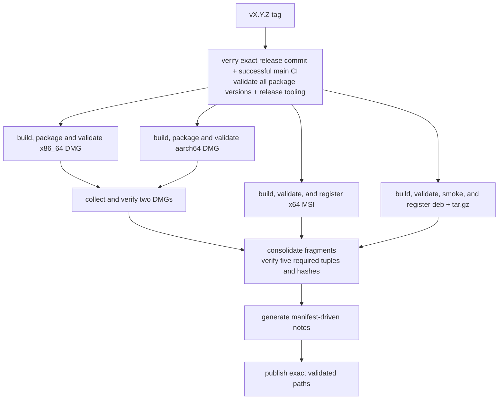
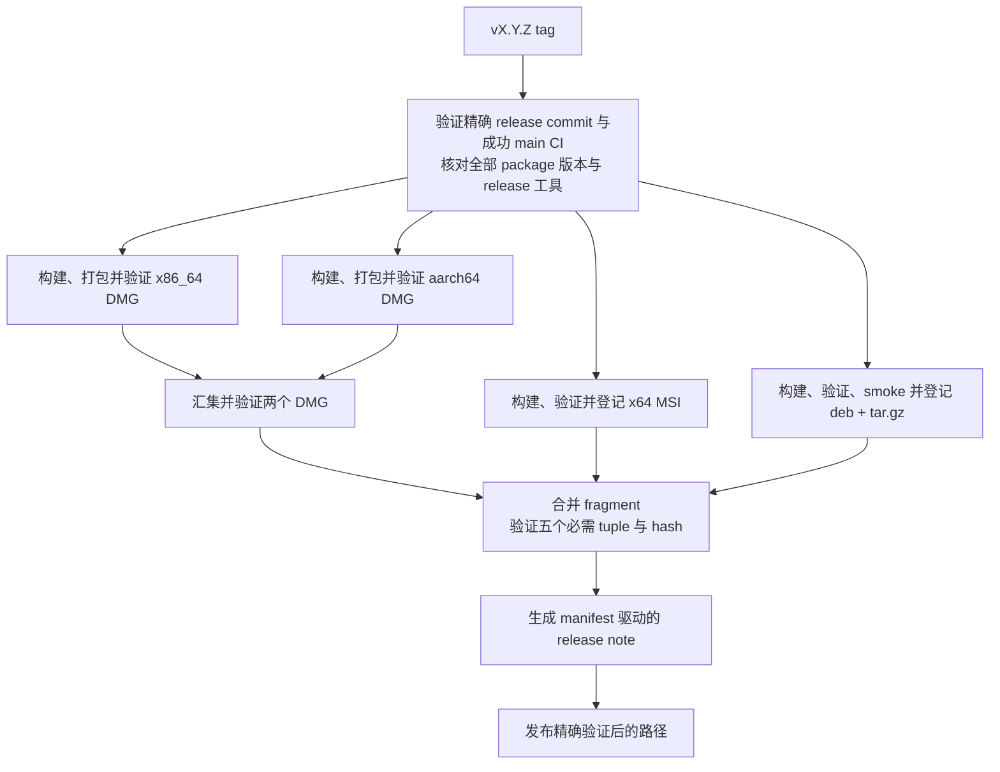

# Development and Release / 开发与发布

## English

Before a PR, run the full local gate below. Before merging, require exact-head
platform CI; after merging, verify Wiki publication. Release tags need separate
approval and exact successful `main` CI. Local package commands are in
[Packaging](Packaging), and crate responsibilities in [Crate Reference](Crate-Reference).

## Repository and toolchain

```text
Cargo.toml     workspace members, shared package metadata, dependencies, profiles, lints
crates/        23 first-party Rust crates
assets/        fonts, themes, keymaps, icons, localization, screenshots
wiki/          canonical bilingual documentation
scripts/       flat first-party shell and PowerShell automation
.github/       CI, release, wiki publication, issue, PR, and dependency automation
```

The workspace uses resolver 2, Rust edition 2021, and minimum Rust 1.95.
`rust-toolchain.toml` selects stable with rustfmt and clippy. The authoritative
version is `Cargo.toml [workspace.package].version`; every workspace package and
internal path requirement uses it.

Build or run the platform entry point on its native host:

```sh
cargo build
cargo run -p sonicterm-mac       # macOS
cargo run -p sonicterm-windows   # Windows
cargo run -p sonicterm-linux     # Linux; executable name: sonicterm
```

Every crate has a local `CLAUDE.md`. Unit tests use the flat sibling pattern
`foo.rs` + `foo_tests.rs`, declared with `#[cfg(test)] #[path =
"foo_tests.rs"] mod foo_tests;`. Crate roots use `lib_tests.rs` or
`main_tests.rs`; `tests/` is reserved for integration tests through public or
cross-crate behavior. The `sonicterm-ui` and `sonicterm-render-model` crate-root
suites inventory every direct source module and require either that exact sibling
declaration or a non-empty explicit exemption. A declared sibling file must
exist and contain a `#[test]`; source-directory modules fail the flat inventory.
An exemption becomes stale as soon as the module gains its own sibling suite.

## Native dependency maintenance

`scripts/native-dependencies.json` is the machine-readable inventory for the
embedded native libraries and the pinned winit source. Each entry pins an upstream release commit,
archive checksum, explicit source subset, the upstream fixes carried on top of
that release, and the complete imported tree checksum. An `upstream_fixes` record
is provenance only: a full upstream revision and the URL to read it. The
repository keeps no local patch files, because the vendored sources — not an
archive plus a patch series — are the source of truth for what SonicTerm builds.
Required sources, headers, licenses, and changelogs are retained; unneeded
upstream demos and CI trees are not build inputs. This is separate from
Cargo.lock and from platform-provided Cairo/Fontconfig.

`third_party/winit` retains the complete published winit 0.30.13 crate, with a
Windows-only native-key metadata extension. Cargo pins that version and patches
it to the reviewed local source; it is excluded from first-party workspace
membership. The source inventory records its archive checksum, upstream revision,
and patched-tree digest. Local Windows changes are marked in the modified files,
not listed as upstream fixes. The Apache-2.0 license ships with each desktop
package; see [Packaging](Packaging).

Preserved winit source is excluded from the first-party authored-comment scan.
The new authored sibling test remains checked; reviewers inspect every changed
hunk in the mixed upstream files for purpose, safety and control-flow rationale.
A matching tree digest detects source drift but does not replace that review.
The Windows gate runs the pinned dependency's native metadata unit tests explicitly,
since workspace exclusion also excludes it from `cargo test --workspace`.
That test invocation uses the retained upstream `Cargo.lock`, including its
separate development dependencies; a cold cache requires their registry downloads.
It is not covered by checks that inspect only the first-party workspace lockfile.
Build output goes to the repository target directory, not the pinned source tree.

The verifier is Python-standard-library-only, offline, and check-only:

```sh
python3 scripts/native-dependencies.py check
python3 scripts/native-dependencies.py check --library freetype
python3 scripts/native-dependencies_tests.py
```

`check` rejects missing, modified, or additional vendor files, unpinned tree
hashes, manifest entries that still declare the retired `patches` key, and
`upstream_fixes` records that omit a revision or URL or name a local file.
Source paths and raw bytes form the hash; executable modes and empty directories
do not. `.gitattributes` disables newline conversion for vendor trees so Windows
checks the same upstream bytes.

A matching digest proves the working copy still holds the reviewed, committed
bytes. It does not establish publisher identity and does not prove absence of
vulnerabilities; that evidence comes from the recorded base release and from
reading each recorded upstream fix at its source. There is no command that
reconstructs a locally patched tree, and the tool does not pretend otherwise.

For an update, use one reviewable library change at a time:

1. Review the official release and advisories, including regressions in the new
   release. Verify the publisher/source and available signature or independently
   published checksum; record any verification limitation. A newer version is not
   automatically a fixed version. Avoid branch-head or unattended imports.
2. Update that manifest entry with the immutable release identity and verified
   archive hash. Record every required upstream fix as a full revision and URL,
   and inspect its prerequisites upstream. Drop a recorded fix only after proving
   the selected release contains it. Keep unrelated native features enabled.
3. Download the recorded archive separately and expand it outside the repository.
   Import the recorded source subset by hand and apply each recorded upstream fix
   from its upstream commit, comparing that commit against the release you are
   importing rather than against a stored copy. Diff the result against the
   current vendor tree, replace only that clean vendor directory, then record the
   new `tree_sha256` from `check`'s reported digest after reviewing the diff.
   Review added/removed C/C++ files against `build.rs`; an import is not a
   compilation result.
4. For FreeType/HarfBuzz, use `cargo install bindgen-cli --version 0.71.1 --locked`
   and run `bash scripts/regenerate-freetype.sh` or
   `bash scripts/regenerate-harfbuzz.sh`. `BINDGEN` can select a separately installed
   executable of that exact version. Both scripts compile the small
   `scripts/freetype-config.rs` helper to reuse the build's configured header.
   Review ABI and behavioral changes, not just
   version strings; regeneration must preserve crate-owned modules and tests.
5. Run the offline checks, native crate tests, full local gate, and native
   rendering checks under normal colors with isolated config/log roots and HOME
   preserved. Compare variable/color fonts, CJK, emoji, ligatures, fallback and
   raster output. Require exact-head platform CI; local macOS tests do not validate
   Windows code or Intel binaries. Update both wiki language halves in the same PR.

The vendored FreeType carries two upstream fixes for excess-coordinate handling
after 2.14.3; the vendored zlib carries the invalid-distance decoding fix and the
related gzip-write corrections after 1.3.2. Those fixes are already present in the
imported sources, and the manifest records the full upstream commits for each one.
These choices do not establish that every advisory is reachable through SonicTerm
or that every remaining upstream defect is fixed. Recheck upstream
releases/advisories when preparing each dependency update and before a release;
updates remain reviewed changes rather than automatic merges.

## Local verification gate

Run the repository gate to the end:

```sh
cargo fmt --all --check
cargo clippy --workspace --all-targets -- -D warnings
# Windows only: use aws-lc-sys's checked-in assembly objects.
export AWS_LC_SYS_PREBUILT_NASM=1
cargo clippy -p sonicterm-app -p sonicterm-io -p sonicterm-font-config -p sonicterm-resource --all-features --all-targets -- -D warnings
RUSTDOCFLAGS="-D warnings" cargo doc --workspace --no-deps
RUSTDOCFLAGS="-D warnings" cargo doc -p sonicterm-app -p sonicterm-io -p sonicterm-font-config -p sonicterm-resource --all-features --no-deps
cargo test -p sonicterm-app -p sonicterm-io -p sonicterm-font-config -p sonicterm-resource --all-features --lib --bins --tests --no-fail-fast
bash scripts/check-authored-rust-comments.sh
bash scripts/check-no-raw-process-exit.sh
bash scripts/check-rust-version.sh
bash scripts/check-window-owner-registration.sh
bash scripts/check-workflow-supply-chain.sh
bash scripts/check-workspace-crates.sh
bash scripts/pty-backend-feasibility.sh --check
bash scripts/test-resource-inventory.sh
bash scripts/test-resource-baseline-evidence.sh
bash scripts/test-soak-harness.sh
bash scripts/test-linux-packages.sh
bash scripts/test-release-assets.sh
bash scripts/test-release-notes.sh
bash scripts/test-wiki-publish.sh
scripts/rust-logic-coverage.sh
```

The separate optional-feature Clippy, Rustdoc, and test commands are required
because `--all-targets` does not enable optional features. They cover the app
and IO `ssh` branches, `distro-defaults`, and `test-util`. This is compile-,
lint-, documentation-, and test-surface verification; it does not claim that
the GUI completes a live SSH connection. The font stack has no optional vendor
features: St.Helens is a normal tracked asset and other fallback faces come from
native discovery. On Windows, `AWS_LC_SYS_PREBUILT_NASM=1` selects aws-lc-sys's
checked-in assembly objects, so the SSH feature gate does not depend on NASM or
CMake being installed.
`check-workspace-crates.sh` first runs the native-source verifier unit tests,
its offline integrity check, and portable macOS bundle tests, then runs one fail-complete
`cargo test --workspace --lib --bins --tests --no-fail-fast` command for default
features. Each phase runs even if an earlier phase fails. It covers every workspace library, binary, and integration-test target
without repeating the unit and binary targets in a serial per-package loop.

The authored-comment checker enforces purpose Rustdoc on effectively public
functions and public trait functions, `# Safety` on public unsafe functions, and
anchored `// When:`, `// SAFETY:`, `// Lock order:`, `// Ordering:`, and
`// Lifecycle:` contracts. `check-no-raw-process-exit.sh` requires shipping code
to exit through `sonicterm_logging::exit_with`.
`check-workflow-supply-chain.sh` enforces the workflow contract described in
[Workflow supply chain](#workflow-supply-chain); it runs its own parser tests
first, so a scan that silently stops matching cannot report a green gate.

On Windows, also run the release-blocking deterministic allocator test:

```sh
cargo test -p sonicterm-gpu --test windows_warp_allocator_baseline -- --nocapture
```

It requires a DX12 WARP adapter and allocator report. Production reserved bytes
must be below 64 MiB, the largest block below 128 MiB, and production reserved
bytes below the old-default control. Windows CI is the only reliable compiler
and runner for `#![cfg(target_os = "windows")]` tests; on macOS such files can
compile to no tests. Cross-compiling is unavailable because the Cairo build is
host-architecture-specific.

Release preparation also builds the shipping platform binary, for example:

```sh
cargo build --release -p sonicterm-mac
```

## Pull-request and main CI

`.github/workflows/ci.yml` runs on pull requests and pushes to `main`. Pull-request
runs share a ref-specific concurrency group and cancel an obsolete run when that
ref advances. Each `main` push instead has a SHA-specific group and never
cancels in progress, so a later merge cannot erase the exact-SHA verification
record for an earlier one.

Never merge or enable auto-merge while a required pull-request job is queued,
in progress, missing, cancelled, unexpectedly skipped, or failed. The macOS,
Windows, and Ubuntu jobs must each finish successfully on the exact reviewed
head commit before merge. Windows success is mandatory because that job is the
only reliable compiler and runner for Windows-only tests; local, macOS, Ubuntu,
or review results cannot substitute for it. After every merge, verify Wiki
publication before starting the next serialized pull request. Successful
exact-head PR CI is the CI gate for PR work; `main` CI is a release-provenance
gate only and does not block the next PR.

Keep every wait off the main agent. For each lifecycle that must wait or monitor
— a long local gate, pull-request CI, post-merge Wiki publication,
release-provenance `main` CI, or a release workflow — start one dedicated watcher subagent, not one subagent
per job. Give it an immutable handoff: repository/worktree path, expected commit
SHA, PR number or run ID, exact required jobs or commands, timeout, and success
criteria. The watcher owns that lifecycle until terminal `SUCCESS`, `FAILURE`,
`BLOCKED`, or `STALE`, and reports the expected and observed SHA, run IDs, every
required result, and actionable failure evidence. It returns immediately when
the head changes or a required job fails, is cancelled, or is unexpectedly
skipped; it never follows a replacement run or accepts a green result by branch
name alone.

While the watcher runs, the main agent advances only a non-overlapping item in a
separate worktree based on the current default branch; it never edits the tree
being tested. Watchers do not push, merge, tag, publish, or clean shared state.
Run at most one full Cargo gate or build on the host at once, never share a
`CARGO_TARGET_DIR` between concurrent worktrees, and use heavy-gate time for
research, editing, or lightweight checks. A watcher failure, blocker, or stale
SHA immediately returns the main agent to the current lifecycle.

Concurrency does not relax publication order: do not merge before the current
pull request's exact-head checks pass, and do not open the next pull request
before the current one is merged and its exact merge-SHA Wiki publication is
verified. Do not wait for `main` CI to advance PR work; require it when validating
a release commit. Then update the next worktree onto the new
default-branch tip and rerun affected validation before publication. Once those
gates pass, fetch and prune the default remote, then clean local state against
its symbolic default branch. Remove only clean, unlocked worktrees whose HEAD is
merged there, and delete only merged local branches not attached to a preserved
worktree. Never force removal or discard dirty, unmerged, or locked worktrees or
any stash.

### macOS 14 and Windows latest

The stable required checks are fail-closed aggregate jobs: `macos-14 / unit
tests` requires `macos-core`, `macos-features`, `macos-coverage`, and
`macos-smoke`, while `windows-latest / unit tests` requires `windows-native`,
`windows-checks`, `windows-features`, `windows-tests`, and `windows-smoke`.
Each aggregate runs with `if: always()` and accepts only explicit `success`
results, so a failed, cancelled, or skipped shard cannot turn into a successful
required check.

The macOS core shard runs source-policy checks, strict Rustdoc, the one-pass
workspace test gate, host probes, tooling tests, and real resource-baseline
capture. Its feature shard runs Clippy, Rustdoc, and tests for all app and IO
features on native macOS. Its independent coverage shard installs the pinned
`cargo-llvm-cov` and runs the deterministic logic coverage gate. The restore-only
`macos-smoke` matrix builds shipping release binaries on macOS 14 Apple Silicon
and macOS 15 Intel with distinct dependency-cache keys. Both lanes require the
bounded raw-binary smoke, then build and mount a DMG on that same architecture.
The installed bundle passes relative-library closure, signature, deployment-floor,
Homebrew-denied runtime/Cairo drawing, and exact bundled-font registration checks;
a controlled same-binary image pair records compressed font savings. The macOS
aggregate requires both matrix lanes. Release jobs also package on their matching
architecture; the final macOS artifact job collects already-validated DMGs.

Windows first prepares static Cairo through vcpkg. It restores the binary cache,
builds a cold miss, and saves that result immediately before the four dependent
shards start. Consumers allow 12 minutes for Cairo installation: a restored
fallback archive may contain no compatible packages after a hosted-image or
vcpkg revision change, so dependency setup must still accommodate a cold build.
The producer retains its 30-minute limit, and consumer job limits are unchanged.
The checks shard runs format, Clippy, source-policy, comment, and
Rustdoc gates. The feature shard runs all-feature app and IO Clippy, Rustdoc, and
tests on native Windows. The test shard runs the one-pass workspace tests, host
probes, fail-closed GDI presentation verification, WARP allocator,
software-selection presentation, tooling tests, and real resource-baseline
capture. The GDI wrapper accepts only one `capability=EXERCISED` verdict;
`HOST_INCAPABLE` remains informational and cannot satisfy the gate. The
restore-only `windows-smoke` shard builds the shipping release binary and
requires its bounded native smoke.

Each platform's Rust-consuming shards share one dependency cache key and exclude
workspace-crate artifacts. Only the core/checks shard may save it, and only on a
push to `main`; coverage, feature, test, package, and every pull-request lane are
restore-only. This bounds cache entries and prevents parallel immutable-key
writers while still warming later runs.

Every job and authored step in the normal-CI, release, and wiki-publication
workflows has an explicit timeout sized above recent cold-cache runtime. Fast
checks, transfers, and native probes use short limits; workspace, coverage,
dependency, native-build, and package stages retain larger compile/network
margins. The real resource-baseline collector separately bounds each focused PTY
command at 30 seconds and its live soak at 90 seconds. A timeout kills the
command's process tree, records exit 124 plus partial stdout/stderr in the
evidence bundle, and continues writing checksums; the workflow's ten-minute
limit is the final guard around that collector.

### Ubuntu 22.04

The stable `ubuntu 22.04 / workspace, packages, X11, Wayland` aggregate requires
`linux-core`, `linux-features`, and `linux-packages`, using the same fail-closed
result check as the macOS and Windows aggregates. The core shard installs the
compile-time Linux dependencies plus Vulkan/lavapipe for GPU tests and adapter
probes, then runs format, Clippy, Rustdoc, the one-pass workspace test gate,
authored-comment, exit, Rust-version, window-owner, workflow supply-chain,
Linux-package, release-asset, release-note, and wiki-publisher checks. The
parallel feature shard runs all-feature app and IO verification on native Linux
and is the single host that also verifies the platform-neutral
`distro-defaults` and `test-util` features.

All three Ubuntu dependency-install steps in CI and Release allow 20 bounded
minutes so a slow cold Jammy mirror can finish without weakening the CI shards'
fail-closed result or the release provenance boundary.
The independent package/runtime shard installs Mesa Vulkan/lavapipe, Xvfb,
Weston, and Debian packaging tools, then:

1. builds `sonicterm-linux` in release mode;
2. derives one workspace version from Cargo metadata;
3. creates and validates the x86_64 `.tar.gz` and `.deb`;
4. validates desktop/AppStream metadata and runs advisory `lintian`;
5. runs both package layouts on X11/Xvfb and Wayland/Weston with Vulkan/lavapipe;
6. uploads the packages, or smoke logs on failure.

A platform smoke cannot pass without a native window, renderer/device, a
platform-shell PTY marker observed in the live grid, a later native frame
presentation, and the default warm renderer's create/report/adopt/child-present/
release lifecycle with the process renderer count restored. Every invocation
uses separate scratch config/log roots and the process-tree-reaping wrapper; a
warm-lifecycle failure exits `16`. The core shard is the sole main-only Linux
dependency-cache writer; the package shard is restore-only and workspace-crate
artifacts remain excluded.

macOS and Windows smoke also read back native numbered titles and exercise
Unicode rename/reset on startup and warm-adopted windows. Mismatches fail at the
display boundary (exit `11`). Linux still requires external X11 property or
Wayland compositor-visible evidence: winit's X11 getter is unimplemented and its
Wayland getter is only cached state. These checks do not verify OS switcher labels.

## Gate blind spots

- The one-pass workspace gate includes integration tests for all 23 packages,
  but it still exercises only targets that can compile and run on its host.
- `rust-logic-coverage.sh` requires 80% line coverage only for its selected
  deterministic subset. Its ignore regex excludes 11 whole crates, including
  `sonicterm-app` and `sonicterm-gpu`, plus named native/controller files in
  other crates. It runs only on macOS CI. A green percentage does not cover
  native windows, real PTYs/SSH, GPU surfaces, generated FFI, installers, or
  Windows-only logic.
- `deny.toml` records advisory, license, source, and wildcard-dependency policy,
  but no CI job runs `cargo deny check`.
- Native AppKit, Win32, X11/Wayland, font-discovery, PTY, GPU, and installer
  behavior still depends on platform tests, package smokes, release builds, and
  manual use; a symbol-only test cannot prove those boundaries.

## Workflow supply chain

`scripts/check-workflow-supply-chain.sh` enforces action pins and token scope
locally and in macOS, Windows, and Ubuntu core/checks shards. Release requires
an exact successful `main` CI run containing these checks before platform jobs.

**Pin every remote action to a full lowercase 40-character commit SHA**, followed
by its release comment `# vX.Y.Z`. Unlike tags or branches, that identity cannot
be retargeted without a reviewed change here. The checker rejects tags, branches,
abbreviated or uppercase SHAs, tag-pinned `docker://` references, and two different
pins for the same action. Local `./` actions need no pin: their code is reviewed
in the same PR.

`dtolnay/rust-toolchain` is pinned to its `v1` tag and passes `toolchain: stable`
explicitly. Its `stable` branch is a rolling ref that is force-pushed, so a SHA
on it is orphaned by the next push and gives Dependabot no version to advance;
the `v1` tag declares `toolchain` required with no default, which is why the
input is now written at every call site.

**`contents: write` exists only on the job that publishes.** Every workflow
defaults to `contents: read`, and only `release.yml`'s and `publish-wiki.yml`'s
`publish` jobs re-grant write, at job scope. The token a third-party action
inherits is the job's, so a workflow-level write grant hands repository write
access to every action in every job — including the ones that only compile and
package. The release consequence is concrete: the uploader runs after checksum
consolidation, so a write-capable token in a build job could publish bytes
other than the validated set. The permitted jobs and their exact writable scopes are enumerated in
`WRITE_BOUNDARY` in `scripts/check-workflow-supply-chain.py`; adding one is a
reviewable edit to that list, not an unnoticed line in a workflow.

The checker accepts directly written block mappings for `jobs`, `steps`,
`uses`, and `permissions`. It rejects flow mappings, explicit mapping keys,
anchors, aliases, and merge keys rather than trying to partially interpret
YAML forms that could hide a mutable action or write grant. Explicit YAML type
tags are rejected for the same reason. Quoted scalar keys and permission values
remain supported and are normalized before policy checks.

Dependabot's `github-actions` ecosystem is deliberately unfiltered, unlike the
`cargo` ecosystem's patch-only policy. A pinned SHA has no floating tag
absorbing upstream fixes, so a pin Dependabot may not advance is a pin that
rots and never receives the security patch it is holding back. Dependabot
rewrites both the SHA and its trailing version comment.

## Release workflow

Pushing a tag matching `v<semver>` starts `.github/workflows/release.yml`.
Owner approval to push the tag is separate from running local packaging.
Pre-release tags containing `-` are marked prerelease.

Before any platform job starts, validation peels the tag ref to its commit,
fetches full `origin/main` history, requires that commit to be its ancestor, and
uses read-only `actions` access to find a completed successful `CI` push run
whose head is exactly that commit. That exact run already includes the full
source, unit, integration, platform-runtime, allocator, coverage, package, and
Wiki-tooling gates. The release validator therefore checks only the workspace
version and release-asset tooling before packaging; it does not rerun the
platform test graph. A tag on an unreviewed branch, a tag whose main run failed
or is missing, a version mismatch, or a release-asset contract failure cannot
reach package construction.



All three packaging chains block publication. Each macOS architecture and the
Windows release job run the exact built shipping binary's native smoke before
its artifact can advance; Windows does not rerun the GDI test because the release
provenance boundary already requires the exact successful `main` CI result that
proved `EXERCISED`. Windows Release restores the main-published vcpkg binary
cache but performs its Rust target build without a Release cache write. All
Release Rust target builds are cache-independent, so tag-specific cache entries
cannot displace the bounded CI dependency caches. The Linux chain retains both
X11 and Wayland package smokes before its artifacts can reach publication.

### Published assets

The five required package assets are:

- `SonicTerm-<tag>-mac-aarch64.dmg`
- `SonicTerm-<tag>-mac-x86_64.dmg`
- `SonicTerm-<tag>-windows-x86_64.msi`
- `SonicTerm-<tag>-linux-x86_64.deb`
- `SonicTerm-<tag>-linux-x86_64.tar.gz`

Each package job emits a typed fragment containing tag, flat filename,
platform, architecture, kind, and SHA-256. The publish job downloads only the
registered package bundles, verifies each file and hash, requires the five
platform/architecture/kind tuples, rejects duplicate tuples/names and
unregistered release-like files, then generates:

- `release-assets.json`
- deterministic `SHA256SUMS.txt`, including the manifest hash
- `release-upload-paths.txt`, the exact list supplied to GitHub Release

Release notes retain manifest-derived downloads, integrity metadata, verification,
and non-merge commit history since the preceding reachable tag (not the highest
version tag). Missing predecessor lookup fails by default; fetch the complete
tag history rather than silently treating a lookup failure as a first release.
Only explicit `RELEASE_FIRST=1` permits no-base notes and conflicts with any set
`PREVIOUS_TAG`. Shallow repositories are rejected. In first-release mode the
displayed history is limited to 200 commits; issue selection still considers the
entire reachable history within its explicit bounds. The GitHub Release receives the five packages,
`release-assets.json`, and `SHA256SUMS.txt`; fragment files and
`release-upload-paths.txt` are internal workflow data.

### Resolved-issue provenance

`scripts/release-issues.py` supplies the **Resolved issues** section. It resolves
head/base to commits, requires base ancestry, and includes every commit reachable
from head but not base, including merge commits. Paginated REST commit-to-PR
associations are discovery hints; a merged PR's GraphQL `closingIssuesReferences`
and explicit commit closing keywords nominate issues. `Refs #123`, a milestone,
and present-day closed state are not closure evidence. Issue-vs-PR identity is
checked and issue entries are deduplicated, sorted, and Markdown-escaped; links
are constructed only from validated owner/repository names and integer numbers.

An issue is included only when a GraphQL `ClosedEvent.closer` identifies an
in-range commit, or a merged PR whose `mergeCommit` is in range. This supports
merge, squash, and rebase integration without requiring REST timeline `commit_id`
to be non-null. Mutable PR links alone cannot establish shipped closure; prior
ancestor closures are not presented as newly delivered, and closures after head
are excluded. Empty commit-to-PR association lists are normal. A genuine empty
result says **No linked issues resolved in this release range**.

Canonical `This reverts commit <full SHA>` Git messages cancel the target's
contribution; merge reverts also cancel introduced commits, and reverting a revert
restores its contribution. A PR with a reverted associated constituent is omitted
conservatively. Prose-only or partial/semantic reversals without canonical Git
markers are not inferred. This is linked GitHub closure evidence, not a claim to
find every fix or prove the runtime effect of arbitrary changes. Missing/deleted
metadata, unknown non-null closer types, malformed schemas, inconsistent pagination,
and ambiguous provenance fail generation instead of publishing a partial list.

A null closer never enters **Resolved issues**. Instead, nominated issues that are
currently closed can appear under **Manually closed issues (unverified release
linkage)** when their current closure event falls after the base commit date and
no later than the head commit date (first releases have no lower date bound).
The event and issue closure timestamps must agree within one second, accommodating
GitHub's timestamp precision; missing/invalid dates or multiple matching events
still fail. Previously shipped commit-linked closures remain excluded. This
separate disclosure names the closure date and explicitly does not prove that
the release resolved the issue; mutable PR links and dates never replace ancestry
checks in the verified list.

The collector caches exact API pages, requests 100 entries per page, and permits
at most 20 pages per connection, 2,000 range commits, 1,000 API attempts, 4 MiB per
child output, and 32 MiB aggregate API output. Each request has 15 seconds inside
a 240-second total deadline; owned child trees are killed/reaped on timeout or
output overflow. Only timeout, HTTP 429, explicit rate limits, and HTTP 5xx retry
(up to three attempts, bounded backoff). Authentication and schema failures do
not retry. Exceeding a cap fails, never silently truncates. The publish job alone
adds `issues: read` and `pull-requests: read` alongside its existing
`contents: write`, and note generation receives the short-lived job token as
`GH_TOKEN`; packaging permissions and exact-tag provenance remain unchanged.

For a read-only pre-tag preview, run from the checked-out repository with an
existing authenticated `gh` session (CI uses its job token):

```sh
python3 scripts/release-issues.py --repo D0n9X1n/SonicTerm \
  --head <exact-reviewed-merge-sha> --base <previous-tag-or-commit>
```

Omit `--base` only for the first release. This helper does not create or require a
new tag. `bash scripts/test-release-notes.sh` runs offline temporary Git-history
and fake-`gh` tests as well as the manifest/download integration checks.

## Manual release checks

Before pushing a tag:

- verify the workspace version and intended tag;
- run the full gate and native release build;
- compare README and every affected wiki page with current config, logging,
  input, palette, rendering, window, platform, and package behavior;
- launch the package, exercise alternate-screen entry/exit, scrolling, busy
  panes, tab tear-out and child cleanup, and inspect adapter logs where relevant.

After pushing, verify every release job and the exact uploaded assets and
checksums. A local package build is not publication.

## Wiki source and publication

The tracked `wiki/` directory is the only documentation source of truth. Every
page has one `## English` half and one `## 中文` half with matching heading-depth
order and equivalent facts. Cross-page source links use bare page names. The
checker also requires a flat Markdown tree, valid links, navigation from each
Home language half to every page, and all Cargo workspace package names in both
Crate Reference halves:

```sh
python3 scripts/check-wiki.py
bash scripts/test-wiki-publish.sh
```

`.github/workflows/publish-wiki.yml` runs after every push to `main`, including
every merged pull request, and by `workflow_dispatch`. It uses the short-lived,
repository-scoped `GITHUB_TOKEN` with `contents: write` to clone
`D0n9X1n/SonicTerm.wiki.git`. `scripts/publish-wiki.sh` replaces the flat
Markdown set and commits `Publish wiki from <source-sha>` only when content
changed. The workflow pushes `HEAD:master`; the Wiki's rendered branch is
`master`. Renames and deletions propagate, and an unchanged mirror is a
successful no-op.

Browser edits are not source and are overwritten by the next publication. Do
not use a PAT, GitHub App private key, or other long-lived credential for this
workflow.

After every merge, verify the newest publication run corresponds to the merge
SHA:

```sh
gh run list --workflow=publish-wiki.yml --limit 3
gh run view <run-id>
tmp="$(mktemp -d)"
git clone "https://github.com/D0n9X1n/SonicTerm.wiki.git" "$tmp/wiki"
git -C "$tmp/wiki" log -1 --oneline
ls "$tmp/wiki"
```

When `wiki/` changed, the newest Wiki commit must identify that merge SHA. When
it did not change, the run should report a successful no-op without a new Wiki
commit. Finally open the live Wiki and click representative English and Chinese
links; workflow success alone does not prove rendering and navigation.

## 中文

提交 PR 前运行下方完整本地 gate；合并前要求准确 head 的各平台 CI 成功，合并后验证
Wiki 发布。Release tag 另需授权和精确成功的 `main` CI。本地打包见[打包](Packaging)，
crate 职责见[Crate 参考](Crate-Reference)。

## 仓库与工具链

```text
Cargo.toml     workspace member、共享 package metadata、依赖、profile、lint
crates/        23 个第一方 Rust crate
assets/        字体、主题、键位、图标、本地化、截图
wiki/          规范双语文档
scripts/       扁平的第一方 shell 与 PowerShell 自动化
.github/       CI、release、Wiki 发布、issue、PR 与依赖自动化
```

Workspace 使用 resolver 2、Rust edition 2021，最低 Rust 版本为 1.95。
`rust-toolchain.toml` 选择 stable，并安装 rustfmt 与 clippy。权威版本位于
`Cargo.toml [workspace.package].version`；所有 workspace package 与内部 path requirement
都使用该版本。

请在对应原生主机上构建或运行平台入口：

```sh
cargo build
cargo run -p sonicterm-mac       # macOS
cargo run -p sonicterm-windows   # Windows
cargo run -p sonicterm-linux     # Linux；可执行文件名为 sonicterm
```

每个 crate 都有本地 `CLAUDE.md`。单元测试采用扁平 sibling 形式 `foo.rs` +
`foo_tests.rs`，并由 `#[cfg(test)] #[path = "foo_tests.rs"] mod foo_tests;` 声明。
Crate root 使用 `lib_tests.rs` 或 `main_tests.rs`；`tests/` 只用于通过 public API 或跨
crate 行为的 integration test。`sonicterm-ui` 与 `sonicterm-render-model` 的 crate-root
测试会清点每个直接源码模块，并要求它具有准确的 sibling 声明或一条非空的显式豁免说明。
已声明的 sibling 文件必须存在且包含 `#[test]`；源码目录模块会使这项扁平清单失败。模块一旦
获得自己的 sibling suite，对应豁免就会立即变为过期并使测试失败。

## 原生依赖维护

`scripts/native-dependencies.json` 是内嵌原生库及固定版本 winit 源码的机器可读清单。每个条目固定上游
发布提交、归档校验和、明确的源码子集、在该发布之上携带的上游修复，以及完整导入源码树
的摘要。`upstream_fixes` 记录只表示来源：完整的上游修订号和可供阅读的 URL。仓库不再
保存本地补丁文件，因为 SonicTerm 构建的事实来源是已导入的第三方源码本身，而不是
「归档加补丁序列」。保留必需源码、头文件、许可证和变更日志；不需要的上游示例及 CI
目录不属于构建输入。这独立于 Cargo.lock 和由平台提供的 Cairo/Fontconfig。

`third_party/winit` 保留完整发布的 winit 0.30.13 crate，并加入仅 Windows 使用的原生
按键元数据扩展。Cargo 固定该版本并通过 patch 指向已审查的本地源码；该依赖不属于第一方
workspace 成员。源码清单记录归档校验和、上游修订号及修改后源码树摘要。本地 Windows
修改在对应文件中明确标注，不列为上游修复。Apache-2.0 许可证随各桌面安装包分发，见
[打包](Packaging)。

保留的 winit 上游源码不参加第一方 authored-comment 扫描；新增的同级测试文件仍接受
检查。审查者逐一检查混合上游文件中修改的代码块是否具备用途、安全与控制流说明。
源码树摘要能发现字节漂移，但不能代替该审查。Windows gate 显式运行固定依赖的原生
元数据单元测试，因为 workspace 排除也使它不参加 `cargo test --workspace`。
该测试使用保留的上游 `Cargo.lock`，包含独立的开发依赖；冷缓存需要从 registry 下载这些
依赖。只检查第一方 workspace lockfile 的检查不覆盖这套测试依赖。构建产物写入仓库
的 target 目录，不写入固定的源码树。

验证工具只使用 Python 标准库，不访问网络，且只做检查：

```sh
python3 scripts/native-dependencies.py check
python3 scripts/native-dependencies.py check --library freetype
python3 scripts/native-dependencies_tests.py
```

`check` 拒绝缺失、修改或额外的第三方文件，拒绝未固定的源码树摘要，拒绝仍声明已废弃
`patches` 键的清单条目，也拒绝缺少修订号或 URL、或指向本地文件的 `upstream_fixes`
记录。摘要包含路径和原始字节，不包含可执行位及空目录。`.gitattributes` 对第三方源码树
关闭换行转换，使 Windows 检查相同的上游字节。

摘要一致只证明工作副本仍是经过审查并提交的那些字节；它不等于发布者身份验证，也不证明
不存在漏洞，后者来自清单记录的基础发布版本，以及在上游逐条阅读所记录的修复。本工具没有
任何命令可以重建带本地补丁的源码树，也不会假装具备该能力。

每次以单个库为单位进行可审查的更新：

1. 阅读官方发布和安全公告，包括新版本引入的回归。验证发布者/来源和可用签名或独立
   发布的校验和，记录验证限制。新版本不自动等于已修复版本，不使用浮动分支或无人审核导入。
2. 用不可变发布身份和已验证的归档摘要更新清单条目。把每个必需上游修复记录为完整修订号
   和 URL，并在上游审查其前置条件。仅在证明新版本已包含该修复后才移除记录，不禁用无关
   原生功能。
3. 单独下载清单记录的归档并在仓库之外解包。手工导入记录的源码子集，并依据上游提交本身
   逐条应用所记录的上游修复——与所导入的发布版本比对，而不是与仓库内的副本比对。将结果
   与当前第三方目录做差异比较，只替换干净的对应目录；审查该差异后，再把 `check` 输出的
   摘要填入新的 `tree_sha256`。核对新增/删除的 C/C++ 文件和 `build.rs`；导入成功不是
   编译成功。
4. 更新 FreeType/HarfBuzz 时，用 `cargo install bindgen-cli --version 0.71.1 --locked`
   安装工具，再运行 `bash scripts/regenerate-freetype.sh` 或
   `bash scripts/regenerate-harfbuzz.sh`。`BINDGEN` 可指定单独安装的相同版本可执行文件。
   两个脚本编译小型 `scripts/freetype-config.rs` 辅助程序，复用构建时的配置头文件。
   审查 ABI 与行为变化，不能只改版本号；重新生成必须保留 crate 自有模块和测试。
5. 运行离线检查、原生 crate 测试、完整本地 gate，以及正常颜色配置下的原生渲染检查；
   配置/日志使用独立临时目录并保留 HOME。比较可变/彩色字体、CJK、emoji、连字、回退及
   光栅输出。要求准确 head 的平台 CI；本地 macOS 测试不验证 Windows 代码或 Intel
   二进制。在同一 PR 更新 wiki 的两个语言部分。

仓库内的 FreeType 带有 2.14.3 之后两项多余坐标处理修复；仓库内的 zlib 带有 1.3.2 之后
的无效距离解码修复及相关 gzip 写入修复。这些修复已存在于导入的源码中，清单记录了每项
修复的完整上游提交号。这些选择不证明每个公告都能从 SonicTerm 触发，也不表示所有剩余
上游缺陷均已修复。准备每次依赖更新和发布前都应重新检查上游版本/公告；更新始终经过
审查，而不是自动合并。

## 本地验证 gate

请把仓库 gate 完整运行到最后：

```sh
cargo fmt --all --check
cargo clippy --workspace --all-targets -- -D warnings
# Windows only: use aws-lc-sys's checked-in assembly objects.
export AWS_LC_SYS_PREBUILT_NASM=1
cargo clippy -p sonicterm-app -p sonicterm-io -p sonicterm-font-config -p sonicterm-resource --all-features --all-targets -- -D warnings
RUSTDOCFLAGS="-D warnings" cargo doc --workspace --no-deps
RUSTDOCFLAGS="-D warnings" cargo doc -p sonicterm-app -p sonicterm-io -p sonicterm-font-config -p sonicterm-resource --all-features --no-deps
cargo test -p sonicterm-app -p sonicterm-io -p sonicterm-font-config -p sonicterm-resource --all-features --lib --bins --tests --no-fail-fast
bash scripts/check-authored-rust-comments.sh
bash scripts/check-no-raw-process-exit.sh
bash scripts/check-rust-version.sh
bash scripts/check-window-owner-registration.sh
bash scripts/check-workflow-supply-chain.sh
bash scripts/check-workspace-crates.sh
bash scripts/pty-backend-feasibility.sh --check
bash scripts/test-resource-inventory.sh
bash scripts/test-resource-baseline-evidence.sh
bash scripts/test-soak-harness.sh
bash scripts/test-linux-packages.sh
bash scripts/test-release-assets.sh
bash scripts/test-release-notes.sh
bash scripts/test-wiki-publish.sh
scripts/rust-logic-coverage.sh
```

必须单独运行 optional-feature Clippy、Rustdoc 和测试，因为 `--all-targets` 不会启用
optional feature。它们覆盖应用与 IO 的 `ssh` 分支、`distro-defaults` 和 `test-util`。
这些 gate 只证明对应 feature 能编译、通过 lint、生成文档并通过测试，不表示 GUI 已能完成
实时 SSH 连接。字体栈没有可选 vendor feature：St.Helens 是普通的已跟踪资源，其它回退字体
来自原生平台发现。Windows 上的 `AWS_LC_SYS_PREBUILT_NASM=1` 会选择 aws-lc-sys 已签入的汇编
对象，因此 SSH feature gate 不依赖 runner 另行安装 NASM 或 CMake。
`check-workspace-crates.sh` 先运行原生源码验证器的单元测试、离线完整性检查和可跨平台运行的
macOS bundle 测试，再对默认
feature 运行一次 fail-complete 的 `cargo test --workspace --lib --bins --tests --no-fail-fast`；
即使前一阶段失败，后续阶段仍会执行。它覆盖全部
workspace library、binary 和 integration-test target，且不会再用逐 package 串行循环重复执行
unit 与 binary target。

第一方注释 checker 要求有效公开函数和公开 trait 函数带用途 Rustdoc，公开 unsafe 函数带
`# Safety`，并检查准确锚定的 `// When:`、`// SAFETY:`、`// Lock order:`、
`// Ordering:` 和 `// Lifecycle:` 契约。`check-no-raw-process-exit.sh` 要求发布代码通过
`sonicterm_logging::exit_with` 退出。`check-workflow-supply-chain.sh` 强制执行
[工作流供应链](#工作流供应链)所述的工作流契约；它会先运行自己的解析器测试，
因此一次静默停止匹配的扫描不会被当成通过的 gate。

Windows 还要运行会阻断 release 的确定性 allocator 测试：

```sh
cargo test -p sonicterm-gpu --test windows_warp_allocator_baseline -- --nocapture
```

它要求 DX12 WARP adapter 和 allocator report。生产策略 reserved bytes 必须低于 64 MiB，
最大 block 低于 128 MiB，且生产策略 reserved bytes 低于旧默认 control。只有 Windows CI
能可靠编译并运行 `#![cfg(target_os = "windows")]` 测试；在 macOS 上，这类文件可能编译成
零个测试。Cairo 构建依赖主机架构，因此无法用 cross-compile 替代。

Release 准备还要构建发布平台二进制，例如：

```sh
cargo build --release -p sonicterm-mac
```

## Pull-request 与 main CI

`.github/workflows/ci.yml` 在 pull request 和推送到 `main` 时运行。Pull-request run 使用
按 ref 区分的 concurrency group；ref 前进时会取消已过时的 run。每次 `main` push 则使用按
SHA 区分的 group，且不会在运行中被取消，因此后续合并不能抹去前一个 merge SHA 的精确验证记录。

只要任一必需的 pull-request job 仍在排队、运行、缺失、被取消、意外跳过或失败，就绝不能
合并，也不能启用 auto-merge。macOS、Windows 与 Ubuntu job 必须都在完全相同的已审核 head
commit 上成功结束后才能合并。Windows 成功是强制条件，因为只有该 job 能可靠编译并运行
Windows-only 测试；本地、macOS、Ubuntu 或 review 结果都不能替代它。每次合并后，必须先验证
Wiki 发布，再开始下一个串行 pull request。成功的 exact-head PR CI 是 PR 工作的 CI 门槛；
`main` CI 仅作为 release 来源验证门槛，不阻塞下一个 PR。

所有等待都必须从主 agent 移出。每个需要等待或监控的生命周期——长时间本地 gate、pull-request
CI、合并后的 Wiki 发布、release 来源验证所需的 `main` CI，或 release workflow——启动一个专用 watcher subagent，
而不是每个 job 启动一个 subagent。交接内容必须不可变并包含 repository/worktree 路径、预期 commit
SHA、PR 编号或 run ID、准确的必需 job 或命令、timeout 与成功标准。Watcher 负责该生命周期，直到
`SUCCESS`、`FAILURE`、`BLOCKED` 或 `STALE`，并报告预期与实际 SHA、run ID、每个必需结果和可执行的
失败证据。若 head 改变，或必需 job 失败、取消、意外跳过，它必须立即返回；绝不能静默跟随替代 run，
也不能只按 branch 名接受 green 结果。

Watcher 运行期间，主 agent 只在基于当前默认分支的独立 worktree 中推进不重叠的工作项，绝不修改
正在测试的 worktree。Watcher 不得 push、merge、tag、publish 或清理共享状态。同一主机一次最多运行
一个完整 Cargo gate 或 build，并且并发 worktree 绝不能共享 `CARGO_TARGET_DIR`；重型 gate 运行期间，
主 agent 应进行 research、编辑或轻量检查。Watcher 报告 failure、blocker 或 stale SHA 时，主 agent
必须立即返回当前生命周期处理。

并发不会放宽发布顺序：当前 pull request 的 exact-head 检查通过前不得合并；当前 pull request
合并且其 exact merge-SHA Wiki 发布验证完成前，不得打开下一个 pull request。推进 PR 工作不等待
`main` CI；验证 release commit 时才要求它成功。之后先把
下一个 worktree 更新到新的默认分支 tip，并重新运行受影响的验证，再发布。这些 gate 通过后，fetch
并 prune 默认 remote，再按它的 symbolic default branch 清理本地状态。只移除 HEAD 已合并到该分支
的干净、未锁定 worktree，并且只删除已合并且未被保留 worktree 使用的本地分支。绝不能强制移除或
丢弃 dirty、未合并、已锁定的 worktree，也不能丢弃任何 stash。

### macOS 14 与 Windows latest

稳定的必需检查是 fail-closed 汇总 job：`macos-14 / unit tests` 同时依赖 `macos-core`、
`macos-features`、`macos-coverage` 与 `macos-smoke`，而 `windows-latest / unit tests`
同时依赖 `windows-native`、`windows-checks`、`windows-features`、`windows-tests` 与
`windows-smoke`。每个汇总 job
都使用 `if: always()`，且只接受显式 `success`，因此任一 shard 失败、取消或跳过都不会变成
成功的必需检查。

macOS core shard 运行源码策略检查、严格 Rustdoc、一次性 workspace 测试 gate、host probe、
工具测试与真实 resource baseline 采集。feature shard 在原生 macOS 上对应用与 IO 的全部
feature 运行 Clippy、Rustdoc 与测试。独立的 coverage shard 安装固定版本的
`cargo-llvm-cov`，并运行确定性 logic coverage gate。只恢复缓存的 `macos-smoke` 矩阵分别在
macOS 14 Apple Silicon 和 macOS 15 Intel 上构建 release 二进制，使用不同依赖缓存键。
两个 lane 都要求原始二进制的有界 smoke 成功，然后在相同架构主机生成并挂载 DMG。
安装后的 bundle 验证相对动态库依赖、签名、部署下限、拒绝 Homebrew 读取时的应用/Cairo
绘制，以及实际 bundle 字体注册；同一可执行文件的镜像对比记录压缩后字体节省量。
macOS 汇总 gate 要求两个 lane 都成功。Release job 同样在对应架构打包，最终 macOS
产物 job 只汇集已经验证的 DMG。

Windows 先通过 vcpkg 准备静态 Cairo。它先恢复 binary cache，冷 miss 时完成构建，并在四个依赖
shard 启动前立即保存结果。消费方为 Cairo 安装保留 12 分钟：托管镜像或 vcpkg 版本变化后，
恢复的回退归档可能不含任何 ABI 兼容的包，因此依赖安装仍须允许冷构建。
生产方保留 30 分钟安装限制，消费方任务的总超时不变。
checks shard 运行 format、Clippy、源码策略、注释与 Rustdoc gate；
feature shard 在原生 Windows 上对应用与 IO 的全部 feature 运行 Clippy、Rustdoc 与测试；
tests shard 运行一次性 workspace 测试、host probe、fail-closed GDI 呈现验证、WARP allocator、
software-selection presentation、工具测试与真实 resource baseline 采集。GDI wrapper 只接受
唯一的 `capability=EXERCISED` verdict；`HOST_INCAPABLE` 仍是信息性结果，不能满足必需 gate。
只恢复缓存的 `windows-smoke` shard 会构建发布用 release 二进制，并要求其有界原生 smoke 成功。

每个平台所有使用 Rust 的 shard 共用一个依赖 cache key，且不缓存 workspace crate artifact。
只有 core/checks shard 可以保存，且仅限推送到 `main`；coverage、feature、test、package 与全部
pull-request lane 均为 restore-only。这样既限制 cache 条目，也避免并行写入不可变 key，同时为
后续 run 预热依赖。

普通 CI、发布和 Wiki 发布工作流中的每个任务及手写步骤都有显式超时，阈值高于近期冷缓存运行
时间。快速检查、传输和原生探针使用较短限制；workspace、覆盖率、依赖安装、原生构建和打包阶段
保留更大的编译与网络余量。真实 resource baseline 采集器还会把每个聚焦 PTY 命令限制为 30 秒，
把 live soak 限制为 90 秒。超时会终止该命令的整个进程树，在证据包中记录退出码 124 和部分
stdout/stderr，并继续写入校验和；工作流的十分钟限制是采集器外层的最终保护。

### Ubuntu 22.04

稳定的 `ubuntu 22.04 / workspace, packages, X11, Wayland` 汇总 job 同时依赖
`linux-core`、`linux-features` 与 `linux-packages`，并使用与 macOS、Windows 相同的
fail-closed 结果检查。core shard 安装 Linux 编译依赖，并为 GPU 测试和 adapter probe 安装
Vulkan/lavapipe，随后运行 format、Clippy、Rustdoc、一次性 workspace 测试、第一方注释、exit、
Rust 版本、window-owner、工作流供应链、Linux package、release-asset、release-note 与 Wiki
publisher gate。并行 feature shard 在原生 Linux 上验证应用与 IO 的全部 feature，并且只在
这个 host 上额外验证平台无关的 `distro-defaults` 与 `test-util` feature。

CI 与 Release 中的三个 Ubuntu 依赖安装步骤都使用有界的 20 分钟上限，使较慢的冷 Jammy
mirror 能完成，且不会削弱 CI shard 的 fail-closed 结果或 release provenance 边界。独立的
package/runtime shard 安装 Mesa Vulkan/lavapipe、
Xvfb、Weston 和 Debian 打包工具，随后：

1. 以 release 模式构建 `sonicterm-linux`；
2. 从 Cargo metadata 推导唯一 workspace 版本；
3. 生成并验证 x86_64 `.tar.gz` 与 `.deb`；
4. 验证 desktop/AppStream metadata，并以 advisory 方式运行 `lintian`；
5. 用 Vulkan/lavapipe 在 X11/Xvfb 和 Wayland/Weston 上运行两种 package layout；
6. 上传 package，失败时上传 smoke log。

任何平台 smoke 若没有原生窗口、渲染器/设备、实时 grid 中观察到的平台 shell PTY marker、
之后的原生 frame 呈现，以及默认预热渲染器的创建/报告/采用/子窗口呈现/释放并恢复进程渲染器
计数，就不能通过。每次调用都使用分开的临时 config/log 根目录和可回收完整进程树的 wrapper；
预热生命周期失败使用退出码 `16`。core shard 是唯一可在 `main` 写入 Linux 依赖 cache 的 job；
package shard 只恢复，且 workspace crate artifact 始终排除在 cache 外。

macOS 与 Windows smoke 还会读取原生编号标题，并在启动窗口及预热采用窗口上执行
Unicode 重命名与重置。读回不匹配会在 display 边界失败（退出码 `11`）。Linux 仍需
外部 X11 属性或 Wayland 合成器可见证据：winit 的 X11 getter 未实现，Wayland getter
只返回缓存。这些检查不验证操作系统切换器标签。

## Gate 盲区

- 一次性 workspace gate 包含全部 23 个 package 的 integration test，但仍只能运行当前 host
  能够编译与执行的 target。
- `rust-logic-coverage.sh` 只对选中的确定性代码子集要求 80% line coverage。其 ignore
  regex 完全排除 11 个 crate，包括 `sonicterm-app` 与 `sonicterm-gpu`，还排除其它 crate
  中点名的原生/控制器文件。它只在 macOS CI 运行。Coverage 通过不能证明原生窗口、真实
  PTY/SSH、GPU surface、生成 FFI、installer 或 Windows-only logic。
- `deny.toml` 记录 advisory、license、source 与 wildcard dependency policy，但没有 CI job
  运行 `cargo deny check`。
- AppKit、Win32、X11/Wayland、字体发现、PTY、GPU 和 installer 的真实行为仍依赖平台测试、
  package smoke、release build 与手工使用；只检查 symbol 不能证明这些边界。

## 工作流供应链

`scripts/check-workflow-supply-chain.sh` 在本地及 macOS、Windows、Ubuntu core/checks
shard 强制检查 action 固定版本与 token 权限。Release 要求包含这些检查的精确成功
`main` CI run，之后才启动平台 job。

**远程 action 固定到完整小写 40 位提交 SHA**，并附发布版本 `# vX.Y.Z`。不同于 tag 或
分支，这个身份不能在本仓库没有可审阅变更时被重新指向。Checker 拒绝 tag、分支、缩写或
大写 SHA、tag 固定的 `docker://`，以及同一 action 的两个不同固定值。本地 `./` action
无需固定，因为代码在同一 PR 中审阅。

`dtolnay/rust-toolchain` 固定到它的 `v1` tag，并显式传入 `toolchain: stable`。它的
`stable` 分支是会被 force-push 的滚动引用，因此固定其上的 SHA 会在下一次推送后成为孤立
提交，也不给 Dependabot 任何可推进的版本；而 `v1` tag 把 `toolchain` 声明为必填且无默认
值，这正是现在每个调用点都写出该输入的原因。

**`contents: write` 只存在于执行发布的那个 job。** 每个工作流都默认 `contents: read`，
只有 `release.yml` 与 `publish-wiki.yml` 的 `publish` job 在 job 作用域重新授予写权限。
第三方 action 继承的是所在 job 的 token，因此工作流级别的写授权等于把仓库写权限交给每个
job 中的每个 action——包括那些只做编译和打包的 job。在 release 上的后果很具体：上传步骤
在校验和合并之后运行，因此构建 job 中一个具备写权限的 token 可以发布与已验证集合不同的
字节。被允许的 job 及其准确可写 scope 列在
`scripts/check-workflow-supply-chain.py` 的 `WRITE_BOUNDARY` 中；新增一个是对该列表的
可审阅修改，而不是工作流里一行无人注意的改动。

Checker 只接受为 `jobs`、`steps`、`uses` 和 `permissions` 直接写出的 block mapping。
它会拒绝 flow mapping、显式 mapping key、anchor、alias 和 merge key，而不是尝试局部解释
可能隐藏可变 action 或写权限的 YAML 形式。出于同样原因，显式 YAML type tag 也会被拒绝。
带引号的标量 key 和权限值仍受支持，并会在策略检查前规范化。

Dependabot 的 `github-actions` 生态被刻意设为不过滤，这与 `cargo` 生态只允许 patch 的策略
不同。固定的 SHA 没有浮动 tag 去吸收上游修复，因此一个 Dependabot 无法推进的固定引用就是
一个会腐坏的固定引用，它压住的安全补丁永远不会到达。Dependabot 会同时改写 SHA 和它的尾注
版本号。

## Release workflow

推送符合 `v<semver>` 的 tag 会启动 `.github/workflows/release.yml`。所有者批准推送 tag
与本地运行打包是两件事。含 `-` 的 pre-release tag 会自动标为 prerelease。

任何平台 job 开始前，验证步骤会把 tag ref 解引用到对应 commit，获取完整的 `origin/main`
历史，要求该 commit 是其祖先，并用只读 `actions` 权限查找 head 完全等于该 commit、已完成且
成功的 `CI` push run。这个精确 run 已包含全部源码、unit、integration、平台 runtime、allocator、
coverage、package 与 Wiki 工具 gate。因此 release validator 在打包前只检查 workspace 版本和
release asset 工具，不会重新运行平台测试图。位于未审核分支的 tag、缺失或失败的 main run、
版本不一致或 release asset 契约失败都不能进入 package 构建。



三个打包链都会阻断发布。两个 macOS 架构和 Windows release job 都会在 artifact 继续流转前，
运行刚构建的发行二进制原生 smoke；Windows 不会重复运行 GDI 测试，因为 release 来源验证已要求
完全相同 commit 的成功 `main` CI 结果，其中已经证明 `EXERCISED`。Windows Release 会恢复由
`main` 发布的 vcpkg binary cache，但其 Rust target 构建不会写入 Release cache。全部 Release
Rust target build 均独立于 cache，避免 tag 专属 cache 条目挤出有界的 CI 依赖 cache。Linux 链
会保留 X11 与 Wayland 两种 package smoke，只有全部通过后其 artifact 才能进入发布。

### 发布资产

五个必需 package asset 为：

- `SonicTerm-<tag>-mac-aarch64.dmg`
- `SonicTerm-<tag>-mac-x86_64.dmg`
- `SonicTerm-<tag>-windows-x86_64.msi`
- `SonicTerm-<tag>-linux-x86_64.deb`
- `SonicTerm-<tag>-linux-x86_64.tar.gz`

每个 package job 会生成类型化 fragment，记录 tag、扁平文件名、platform、architecture、kind
和 SHA-256。Publish job 只下载已登记的 package bundle，验证文件与 hash，要求五个
platform/architecture/kind tuple，拒绝重复 tuple/名称和未登记的 release-like 文件，然后生成：

- `release-assets.json`
- 确定性的 `SHA256SUMS.txt`，其中也包含 manifest hash
- `release-upload-paths.txt`，即传给 GitHub Release 的精确列表

Release note 保留 manifest 驱动的下载列表、完整性 metadata、验证说明，以及前一个可达 tag
之后的非 merge commit 历史（不是版本号最大的 tag）。默认情况下查找前序 tag 失败就会终止；
应获取完整 tag 历史，而不是静默把查找失败视为首个 release。只有显式 `RELEASE_FIRST=1` 才允许
无 base 的 notes，且与任何已设置的 `PREVIOUS_TAG` 冲突。Shallow 仓库会被拒绝。首个 release
模式下展示最多 200 个 commit；issue 选择仍在明确上限内检查全部可达历史。GitHub Release 最终收到五个 package、
`release-assets.json` 和 `SHA256SUMS.txt`；fragment 文件与 `release-upload-paths.txt`
只是 workflow 内部数据。

### 已解决 issue 的来源证据

`scripts/release-issues.py` 生成 **Resolved issues** 部分。它先把 head/base 解析为 commit，
要求 base 是 head 的祖先，再选取从 head 可达而从 base 不可达的所有 commit，包括 merge commit。
分页的 REST commit-to-PR 关联只用于发现候选；已合并 PR 的 GraphQL `closingIssuesReferences`
及 commit 中明确的关闭关键字提名 issue。`Refs #123`、milestone 和当前 closed 状态都不是关闭
证据。脚本区分 issue 与 PR，对 issue 去重、排序、转义 Markdown；链接只使用已验证的
owner/repository 和整数编号构造。

仅当 GraphQL `ClosedEvent.closer` 指向范围内的 commit，或其 `mergeCommit` 在范围内的已合并
PR 时，issue 才会入选。这支持 merge、squash 与 rebase，不要求 REST timeline 的 `commit_id`
非空。可编辑的 PR 链接本身不能证明修复已交付；已在 base 祖先中关闭的 issue 不会当作新交付，
head 之后的关闭也不会入选。空 commit-to-PR 关联列表是正常结果。确实没有匹配时明确显示
**No linked issues resolved in this release range**。

Git 规范消息 `This reverts commit <完整 SHA>` 会取消目标贡献；merge revert 也取消该 merge
引入的 commit，revert-of-revert 则恢复原贡献。若 PR 关联的某个组成 commit 被 revert，会保守
省略整个 PR。没有规范 Git 标记的纯文字、部分或语义性反向变更不会被推断。这是 GitHub 关闭关联
证据，不声称发现全部修复，也不证明任意变更的运行时效果。缺失/删除的 metadata、未知的非空 closer
类型、错误 schema、不一致分页和含糊来源会使生成失败，而不是发布不完整列表。

null closer 绝不会进入 **Resolved issues**。被范围内变更提名、当前仍关闭的 issue，若当前关闭事件
晚于 base commit 日期且不晚于 head commit 日期（首次发布没有日期下限），可单独列入
**Manually closed issues (unverified release linkage)**。事件与 issue 的关闭时间必须相差不超过一秒，
以适应 GitHub 时间精度；缺失或无效日期、多个匹配事件仍会失败。此前已交付的 commit 关联关闭仍被
排除。单独披露会注明关闭日期，并明确不证明该版本解决了 issue；可编辑 PR 链接与日期绝不替代
已验证列表中的祖先关系检查。

Collector 缓存精确 API page，每页请求 100 项；每个 connection 最多 20 页，范围最多 2,000 个
commit，最多 1,000 次 API 尝试，每个子进程输出最多 4 MiB，API 总输出最多 32 MiB。每次请求
15 秒，总 deadline 240 秒；超时或输出超限会终止并回收其子进程树。仅 timeout、HTTP 429、明确
rate limit 和 HTTP 5xx 会重试（最多三次尝试、有界退避）。认证和 schema 失败不重试。任何超限
都失败，绝不静默截断。只有 publish job 在现有 `contents: write` 之外增加 `issues: read` 和
`pull-requests: read`，生成步骤通过 `GH_TOKEN` 使用短生命周期 job token；打包权限和
exact-tag 来源验证保持不变。

打 tag 前，可在检出仓库内使用已认证的 `gh` 会话进行只读预览（CI 使用 job token）：

```sh
python3 scripts/release-issues.py --repo D0n9X1n/SonicTerm \
  --head <exact-reviewed-merge-sha> --base <previous-tag-or-commit>
```

只有首个 release 才省略 `--base`。Helper 不创建也不要求新 tag。
`bash scripts/test-release-notes.sh` 同时运行离线临时 Git 历史、fake-`gh` 测试和
manifest/download 集成检查。

## 手工发布检查

推送 tag 前：

- 确认 workspace 版本和目标 tag；
- 运行完整 gate 与原生 release build；
- 对照当前 config、logging、input、palette、rendering、window、platform 和 package 行为，
  检查 README 与所有受影响 Wiki 页面；
- 启动 package，测试备用屏幕进入/退出、滚动、繁忙窗格、标签页拖出与子进程清理，
  并在相关场景检查 adapter 日志。

推送后，验证每个 release job，以及实际上传的精确资产和 checksum。本地生成 package 不等于发布。

## Wiki 源码与发布

受版本控制的 `wiki/` 是唯一文档事实来源。每页包含一个 `## English` 和一个 `## 中文`，
两半标题深度顺序一致、事实等价。跨页链接使用不带扩展名的页面名。Checker 还要求 Markdown
树保持扁平、链接有效、Home 的两个语言半页都能导航到每个页面，并要求 Crate Reference
两半都包含 Cargo workspace 全部 package 名：

```sh
python3 scripts/check-wiki.py
bash scripts/test-wiki-publish.sh
```

`.github/workflows/publish-wiki.yml` 在每次推送到 `main` 后运行，包括每个合并的 pull request，
也支持 `workflow_dispatch`。它使用生命周期短、只限本仓库且具有 `contents: write` 的
`GITHUB_TOKEN` 克隆 `D0n9X1n/SonicTerm.wiki.git`。`scripts/publish-wiki.sh` 替换全部
扁平 Markdown；只有内容变化时才提交 `Publish wiki from <source-sha>`。Workflow 推送
`HEAD:master`，Wiki 的渲染分支是 `master`。重命名和删除都会同步；内容相同时成功 no-op。

网页端编辑不是事实来源，下次发布会覆盖它。该 workflow 不应使用 PAT、GitHub App private key
或其它长期凭据。

每次合并后，确认最新发布 run 对应 merge SHA：

```sh
gh run list --workflow=publish-wiki.yml --limit 3
gh run view <run-id>
tmp="$(mktemp -d)"
git clone "https://github.com/D0n9X1n/SonicTerm.wiki.git" "$tmp/wiki"
git -C "$tmp/wiki" log -1 --oneline
ls "$tmp/wiki"
```

若 `wiki/` 有变化，最新 Wiki commit 必须标识该 merge SHA；若无变化，run 应成功 no-op 且不
创建新 Wiki commit。最后打开在线 Wiki，点击具有代表性的英文和中文链接；workflow 成功本身
不能证明页面渲染和导航正确。
