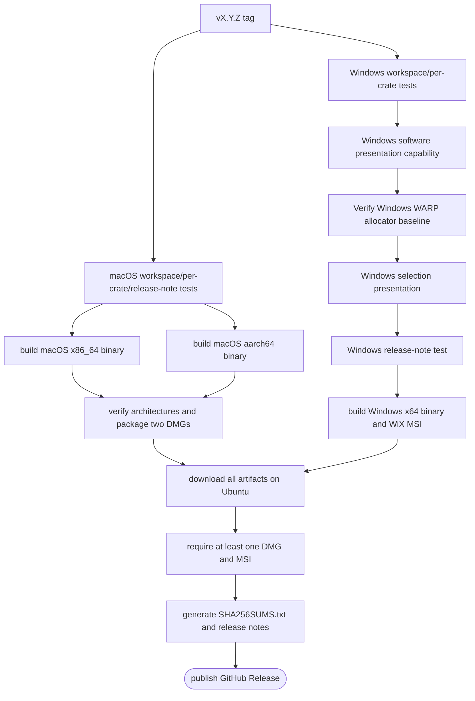
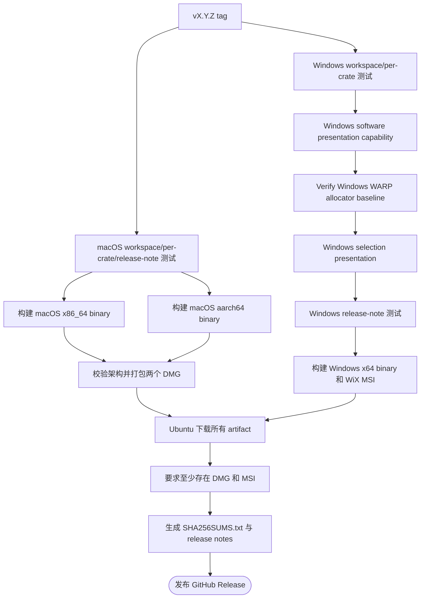

# Development and Release / 开发与发布

## English

> Canonical packaging instructions:
> [Packaging](Packaging).
> Canonical release boundary:
> [Architecture Internals](Architecture-Internals).

## Repository layout

```text
Cargo.toml                 workspace members, shared version/dependencies/lints
crates/                    23 first-party Rust crates
assets/                    fonts, themes, keymaps, icons, i18n, screenshots
wiki/                      canonical bilingual documentation, all of it
scripts/                   flat first-party shell/PowerShell automation
.github/                   CI, release, issue, PR, and dependency automation
```

The workspace uses Rust edition 2021 and a pinned minimum Rust version from the
root manifest. `rust-toolchain.toml` selects stable with rustfmt and clippy.
`Cargo.toml [workspace.package].version` is authoritative for every first-party
crate and internal path requirement.

## Build and run

```sh
cargo build
cargo run -p sonicterm-mac       # macOS
cargo run -p sonicterm-windows   # Windows
```

Windows CI and release builds install static Cairo through vcpkg. macOS release
builders install Cairo and pkg-config through Homebrew. Native Fontconfig,
FreeType, HarfBuzz, AppKit, Win32, and installer behavior require their relevant
platform or build boundary; do not replace those checks with empty symbol tests.

## Crate-local guidance

Every crate has a local `CLAUDE.md` describing purpose, key files, local gate,
guardrails, and cross-references. Read the root instructions and the relevant
crate instructions before changing a boundary.

The short crate map is [Crate Reference](Crate-Reference) and
[Crate Reference](Crate-Reference).

## Test organization

Unit tests follow one exact flat sibling convention:

```text
foo.rs
foo_tests.rs
```

`foo.rs` declares:

```rust
#[cfg(test)]
#[path = "foo_tests.rs"]
mod foo_tests;
```

Crate roots use `lib_tests.rs` or `main_tests.rs`. Do not create inline
`mod tests`, generic `tests.rs`, or `<module>/tests.rs`. A crate's `tests/`
directory is reserved for genuine integration tests that exercise public or
cross-crate behavior.

The test surface includes:

- reducer intent/effect contracts;
- VT control-sequence and same-frame dirty-row regressions;
- grid wide-cell, scrollback, line-storage, and hyperlink behavior;
- UI tabs/search/selection/IME/pane layout;
- text atlas and row-cache behavior;
- GPU pure damage/color/software-composition helpers;
- app cross-window, redraw, broadcast, resize, and update flows;
- platform-specific CLI and software-present primitives.

## Authored Rust comment contract

First-party Rust comments are part of the checked source contract. Effectively
public authored functions and public trait functions require concise purpose
Rustdoc; public unsafe functions also require a `# Safety` section. Objective
control-flow boundaries require substantive `// When:` rationale, while
mechanical value selectors remain advisories. Unsafe boundaries require
`// SAFETY:`, functions that order distinct locks require `// Lock order:`,
non-`SeqCst` atomic protocols require `// Ordering:`, and `Drop`
implementations require `// Lifecycle:`.

Each marker stays at the exact checker-required anchor, names the relevant
identifiers, and is limited to two comment lines and 160 characters. Comments
describe current behavior and why the boundary exists, never issue, pull-request,
or authoring history. Vendored, generated, preserved-upstream, build, and
ordinary test contexts are excluded from non-safety rules; unsafe constructs in
test code still require `// SAFETY:`. Run
`scripts/check-authored-rust-comments.sh` to execute the checker's contract tests
before scanning the repository.

## Local gates

The complete local verification set documented by the architecture and PR
template is:

```sh
cargo fmt --all --check
cargo clippy --workspace --all-targets -- -D warnings
cargo clippy -p sonicterm-io --features ssh --all-targets -- -D warnings
RUSTDOCFLAGS="-D warnings" cargo doc --workspace --no-deps
RUSTDOCFLAGS="-D warnings" cargo doc -p sonicterm-io --no-deps --features ssh
cargo metadata --no-deps --format-version 1
cargo test --workspace --lib --bins
# Windows only: deterministic DX12 WARP allocator baseline
cargo test -p sonicterm-gpu --test windows_warp_allocator_baseline -- --nocapture
bash scripts/check-authored-rust-comments.sh
bash scripts/check-no-raw-process-exit.sh
bash scripts/check-rust-version.sh
bash scripts/check-window-owner-registration.sh
bash scripts/check-workspace-crates.sh
bash scripts/pty-backend-feasibility.sh --check
bash scripts/test-resource-inventory.sh
bash scripts/test-resource-baseline-evidence.sh
bash scripts/test-soak-harness.sh
bash scripts/test-release-notes.sh
bash scripts/test-wiki-publish.sh
scripts/rust-logic-coverage.sh
```

The root `CLAUDE.md` is authoritative for this gate; CI also runs the
resource-evidence, soak, and wiki-publisher checks listed here. The WARP command
is Windows-only and runs explicitly in Windows CI and Windows release unit
tests. It requests a headless DX12 CPU fallback, requires WARP and an allocator
report, then compares the old default policy with the production software-adapter
policy. Missing capability or report data and reserve/largest-block threshold
failures fail the gate. Note that `cargo test --workspace --lib --bins` excludes
integration tests — the cross-crate suites, including the counting-allocator
heap-truth tests, run under `scripts/rust-logic-coverage.sh`.

Release preparation additionally builds the shipping platform binary, for
example:

```sh
cargo build --release -p sonicterm-mac
```

`check-no-raw-process-exit.sh` requires shipped process exits to pass through
`sonicterm_logging::exit_with`. `check-workspace-crates.sh` derives all members
from Cargo metadata and runs each crate's supported unit/build gate.
`rust-logic-coverage.sh` uses `cargo llvm-cov`, excludes native/non-deterministic
boundaries by explicit regex, and requires 80% line coverage of deterministic
Rust logic.

## Pull-request CI

`.github/workflows/ci.yml` runs on pull requests and on pushes to `main`, with a
macOS 14 / Windows latest matrix:

```mermaid
flowchart TD
    checkout["checkout + stable Rust"]
    cairo["Windows: cache/install Cairo with vcpkg"]
    comments["authored Rust comment contract"]
    rustdoc["strict workspace + SSH Rustdoc"]
    exitpolicy["process-exit policy"]
    wstest["cargo test --workspace --lib --bins"]
    percrate["per-crate unit/build gate"]
    hostprobe["host window capability probe"]
    adapterprobe["adapter classification probe"]
    churn["renderer churn baseline"]
    softpresent["Windows only: software presentation capability"]
    warp["Verify Windows WARP allocator baseline"]
    selection["Windows only: selection presentation"]
    notes["release-note unit test"]
    pty["frozen PTY feasibility evidence check"]
    inventory["resource inventory verification"]
    soak["deterministic soak control gate"]
    baseline["resource baseline evidence collector test + capture"]
    coverage(["macOS only: install cargo-llvm-cov and enforce coverage"])

    checkout --> cairo
    cairo --> comments
    comments --> rustdoc
    rustdoc --> exitpolicy
    exitpolicy --> wstest
    wstest --> percrate
    percrate --> hostprobe
    hostprobe --> adapterprobe
    adapterprobe --> churn
    churn --> softpresent
    softpresent --> warp
    warp --> selection
    selection --> notes
    notes --> pty
    pty --> inventory
    inventory --> soak
    soak --> baseline
    baseline --> coverage
```



CI runs `cargo fmt --all --check`, the authored Rust comment checker, strict
workspace Rustdoc, and `cargo clippy --workspace --all-targets` with warnings
denied. The `sonicterm-io` SSH feature receives separate clippy and strict
Rustdoc passes because `--all-targets` does not enable optional features.
Windows additionally runs the explicit `Verify Windows WARP allocator baseline`
step, which executes the deterministic `windows_warp_allocator_baseline`
integration test. It requests DX12 CPU fallback and compares the old
wgpu default against the production software-adapter memory policy. The gate
fails without WARP or an allocator report, when production reserved bytes are
not below 64 MiB, when the largest block is not below 128 MiB, or when
production reserved bytes do not improve on the control. `deny.toml` is present
but no `cargo deny check` job enforces it, so dependency policy is checked by
hand rather than by a gate.

## Coverage boundary

Coverage is designed for deterministic Rust logic. The script excludes native
GPU surfaces, real PTYs/SSH, AppKit/Win32, generated FFI, installer code, and
similar boundaries where a unit test would not prove the real behavior. Those
surfaces rely on platform CI, integration tests, release builds, and manual smoke
checks.

The coverage job currently runs only on macOS. Windows-only deterministic logic
is compiled and tested by Windows CI but does not contribute to the llvm-cov
threshold.

## Release sequence

Pushing a matching `v*` tag starts `.github/workflows/release.yml`:



The Windows allocator test is release-blocking. The current verified Windows
release dependency is `unit-tests-windows → build-windows → publish`, so a WARP
baseline failure prevents both the MSI build and publication.

Pre-release tags containing `-` are marked prerelease automatically.

### macOS assets

The workflow publishes:

- `SonicTerm-<version>-mac-aarch64.dmg`
- `SonicTerm-<version>-mac-x86_64.dmg`

The package includes themes, keymaps, fonts, icons, i18n, app metadata, and an
ad-hoc signature. Release verification checks each binary's architecture with
`lipo` before building the DMGs.

### Windows assets

The workflow publishes an x64 `.msi` built with `cargo wix` and WiX 3.14. The
MSI contains the executable, themes, keymaps, bundled fonts, and shortcuts.

### Shared assets

The publish job creates `SHA256SUMS.txt` over all DMG/MSI files and generates
release notes from commits since the previous tag. The release workflow fails
if either a DMG or MSI is absent.

## Manual release checks

Before a release, verify user-facing README, canonical docs, and all tracked
`wiki/` pages against changed config, input, logging, palette, rendering, and
window behavior. Recommended smoke checks include:

- launch the packaged app;
- exercise Vim/nvim alternate-screen entry, scrolling, and exit;
- create busy multi-pane output;
- tear a tab into a child window, close it, and confirm surviving windows remain
  responsive and child processes are reaped;
- inspect hardware/software adapter logs where relevant.

## Documentation and Wiki workflow

The repository-tracked `wiki/` directory is the only source of truth for
SonicTerm's bilingual user documentation. Edit the relevant Markdown pages in
the same branch and pull request as the behavior they describe so code and user
guidance are reviewed and versioned together.

`.github/workflows/publish-wiki.yml` runs after every push to `main` — including
every merged pull request — and can also be run with `workflow_dispatch`. It
publishes the directory as a one-way GitHub Wiki mirror. `scripts/publish-wiki.sh`
replaces the flat Markdown page set on the wiki's `master` branch, which carries
page additions, changes, renames, and deletions; an unchanged mirror succeeds
without creating a commit. Browser edits are not source and are overwritten by
the next publication.

The workflow authenticates with its short-lived, repository-scoped
`GITHUB_TOKEN` and grants only `contents: write`; no PAT, GitHub App key, or
long-lived secret is stored. Do not replace it with an account-wide classic PAT.

After every pull request merges, verify the newest `publish-wiki.yml` run
corresponds to the merge SHA. When `wiki/` changed, the newest wiki commit must
also correspond to that SHA; otherwise the run should report a successful no-op
without creating a wiki commit. Then inspect the live Wiki and click representative
English and Chinese navigation links. A successful workflow exit alone does not
prove the published pages render and link correctly.

## Other automation

| File | Purpose |
| --- | --- |
| `scripts/check-authored-rust-comments.sh` | test and enforce first-party Rust comment contracts |
| `scripts/release-notes.sh` | commit-derived release notes and asset list |
| `scripts/test-release-notes.sh` | throwaway-repository unit test for notes |
| `scripts/publish-wiki.sh` | deletion-aware flat wiki mirror builder |
| `scripts/test-wiki-publish.sh` | throwaway-repository wiki publication test |
| `.github/workflows/publish-wiki.yml` | publish `wiki/` to the GitHub Wiki after merge |
| `scripts/bake-icons.sh` | regenerate platform icon exports |
| `scripts/regenerate-freetype.sh` | regenerate FreeType bindings |
| `scripts/regenerate-harfbuzz.sh` | regenerate HarfBuzz bindings |
| `scripts/setup-windows-cairo.ps1` | install/export static Cairo via vcpkg |
| `deny.toml` | advisory, license, source, and wildcard-dependency policy |
| `.github/dependabot.yml` | weekly dependency update policy |

## Where to read the code

| Topic | Primary paths |
| --- | --- |
| Contributor workflow | `CONTRIBUTING.md`, `.github/pull_request_template.md` |
| CI | `.github/workflows/ci.yml` |
| Wiki publication | `.github/workflows/publish-wiki.yml`, `scripts/publish-wiki.sh` |
| Release | `.github/workflows/release.yml` |
| Coverage | `scripts/rust-logic-coverage.sh` |
| Per-crate gate | `scripts/check-workspace-crates.sh` |
| Exit policy | `scripts/check-no-raw-process-exit.sh` |
| macOS package | `scripts/make-macos-dmg.sh`, `Packaging` |
| Windows package | `crates/sonicterm-windows/wix/main.wxs`, `Packaging` |
| Wiki publication rule | root `CLAUDE.md` under “Wiki” |

## 中文

> 规范打包说明：
> [Packaging](Packaging)。
> 规范发布边界：
> [Architecture Internals](Architecture-Internals)。

## 仓库布局

```text
Cargo.toml                 workspace member、共享版本/依赖/lint
crates/                    23 个第一方 Rust crate
assets/                    字体、主题、keymap、icon、i18n、截图
wiki/                      规范双语文档，全部文档均在此
scripts/                   扁平第一方 shell/PowerShell 自动化
.github/                   CI、发布、issue、PR 和依赖自动化
```

workspace 使用 Rust edition 2021，最低 Rust 版本由根 manifest 固定。`rust-toolchain.toml`
选择 stable，并安装 rustfmt 与 clippy。`Cargo.toml [workspace.package].version` 是全部第一方
crate 和内部 path requirement 的权威版本。

## 构建与运行

```sh
cargo build
cargo run -p sonicterm-mac       # macOS
cargo run -p sonicterm-windows   # Windows
```

Windows CI/release 经 vcpkg 安装静态 Cairo；macOS release builder 经 Homebrew 安装 Cairo 与 pkg-config。
Fontconfig、FreeType、HarfBuzz、AppKit、Win32 和 installer 行为需要相应平台/build boundary，
不能用空洞的符号测试代替。

## Crate 本地说明

每个 crate 都有本地 `CLAUDE.md`，记录 purpose、关键文件、local gate、guardrail 和 cross-reference。
修改边界前先阅读根说明和相关 crate 说明。

简短 crate 映射见 [Crate 参考](Crate-Reference) 与
[Crate Reference](Crate-Reference)。

## 测试组织

单元测试使用唯一的扁平 sibling 规范：

```text
foo.rs
foo_tests.rs
```

`foo.rs` 中声明：

```rust
#[cfg(test)]
#[path = "foo_tests.rs"]
mod foo_tests;
```

crate root 使用 `lib_tests.rs` 或 `main_tests.rs`。不要创建 inline `mod tests`、通用 `tests.rs`
或 `<module>/tests.rs`。crate 的 `tests/` 目录只用于真正通过 public API 或跨 crate 行为的 integration test。

测试覆盖包括：

- reducer intent/effect 契约；
- VT 控制序列与同帧脏行回归；
- grid 宽字符、scrollback、line storage、hyperlink；
- UI 标签页、搜索、选区、IME、pane layout；
- text atlas 与 row cache；
- GPU 纯 damage/color/software composition helper；
- app 跨窗口、redraw、broadcast、resize 与 update flow；
- 平台专属 CLI 与 software-present primitive。

## 第一方 Rust 注释契约

第一方 Rust 注释属于受检查的源码契约。有效公开的第一方函数和公开 trait
函数必须有简洁的用途 Rustdoc；公开 unsafe 函数还必须有 `# Safety` 章节。
客观控制流边界必须有实质性的 `// When:` 理由，而机械式值选择器只作为
advisory。unsafe 边界必须有 `// SAFETY:`；对不同锁规定获取顺序的函数必须有
`// Lock order:`；使用非 `SeqCst` 原子顺序的协议必须有 `// Ordering:`；
`Drop` 实现必须有 `// Lifecycle:`。

每个 marker 必须位于 checker 要求的准确锚点，点名相关 identifier，并限制在
两行注释、160 个字符以内。注释只描述当前行为以及边界存在的原因，不记录 issue、
pull request 或编写历史。vendored、generated、保留的 upstream、build 和普通 test
上下文不执行非 safety 规则；test 代码中的 unsafe construct 仍需 `// SAFETY:`。
运行 `scripts/check-authored-rust-comments.sh` 时，会先执行 checker 契约测试，再扫描
整个仓库。

## 本地 gate

架构文档与 PR template 记录的完整本地验证集合：

```sh
cargo fmt --all --check
cargo clippy --workspace --all-targets -- -D warnings
cargo clippy -p sonicterm-io --features ssh --all-targets -- -D warnings
RUSTDOCFLAGS="-D warnings" cargo doc --workspace --no-deps
RUSTDOCFLAGS="-D warnings" cargo doc -p sonicterm-io --no-deps --features ssh
cargo metadata --no-deps --format-version 1
cargo test --workspace --lib --bins
# Windows only: deterministic DX12 WARP allocator baseline
cargo test -p sonicterm-gpu --test windows_warp_allocator_baseline -- --nocapture
bash scripts/check-authored-rust-comments.sh
bash scripts/check-no-raw-process-exit.sh
bash scripts/check-rust-version.sh
bash scripts/check-window-owner-registration.sh
bash scripts/check-workspace-crates.sh
bash scripts/pty-backend-feasibility.sh --check
bash scripts/test-resource-inventory.sh
bash scripts/test-resource-baseline-evidence.sh
bash scripts/test-soak-harness.sh
bash scripts/test-release-notes.sh
bash scripts/test-wiki-publish.sh
scripts/rust-logic-coverage.sh
```

根 `CLAUDE.md` 是这组 gate 的权威来源；CI 也会运行这里列出的资源证据、soak 和
Wiki publisher 检查。WARP 命令仅适用于 Windows，并在 Windows CI 与 Windows release
unit tests 中显式运行。它请求 headless DX12 CPU fallback，要求得到 WARP 与 allocator
report，再比较旧的默认策略和生产环境的软件 adapter 策略。缺少 capability/report，
或 reserve/largest-block threshold 失败，都会让 gate 失败。注意
`cargo test --workspace --lib --bins` 不包含集成测试——跨 crate 套件（含计数分配器
heap-truth 测试）由 `scripts/rust-logic-coverage.sh` 执行。

release prep 还要构建发布平台二进制，例如：

```sh
cargo build --release -p sonicterm-mac
```

`check-no-raw-process-exit.sh` 要求发布代码只通过 `sonicterm_logging::exit_with` 退出。
`check-workspace-crates.sh` 从 Cargo metadata 推导 member 并运行各 crate 可支持的 unit/build gate。
`rust-logic-coverage.sh` 使用 `cargo llvm-cov`，通过显式 regex 排除原生/非确定性边界，并要求确定性 Rust logic
达到 80% line coverage。

## Pull-request CI

`.github/workflows/ci.yml` 在 PR 以及推送到 `main` 时运行 macOS 14 /
Windows latest matrix：

```mermaid
flowchart TD
    checkout["checkout + stable Rust"]
    cairo["Windows：缓存/安装 vcpkg Cairo"]
    comments["第一方 Rust 注释契约"]
    rustdoc["严格 workspace + SSH Rustdoc"]
    exitpolicy["process-exit policy"]
    wstest["cargo test --workspace --lib --bins"]
    percrate["per-crate unit/build gate"]
    hostprobe["host window capability probe"]
    adapterprobe["adapter classification probe"]
    churn["renderer churn baseline"]
    softpresent["仅 Windows：software presentation capability"]
    warp["Verify Windows WARP allocator baseline"]
    selection["仅 Windows：selection presentation"]
    notes["release-note unit test"]
    pty["冻结的 PTY feasibility evidence 校验"]
    inventory["resource inventory 校验"]
    soak["确定性 soak control gate"]
    baseline["resource baseline evidence 收集器测试与采集"]
    coverage(["仅 macOS：安装 cargo-llvm-cov 并执行 coverage gate"])

    checkout --> cairo
    cairo --> comments
    comments --> rustdoc
    rustdoc --> exitpolicy
    exitpolicy --> wstest
    wstest --> percrate
    percrate --> hostprobe
    hostprobe --> adapterprobe
    adapterprobe --> churn
    churn --> softpresent
    softpresent --> warp
    warp --> selection
    selection --> notes
    notes --> pty
    pty --> inventory
    inventory --> soak
    soak --> baseline
    baseline --> coverage
```



CI 会运行 `cargo fmt --all --check`、第一方 Rust 注释 checker、严格 workspace
Rustdoc，以及 warning 视为错误的 `cargo clippy --workspace --all-targets`。由于
`--all-targets` 不会启用 optional feature，`sonicterm-io` 的 `ssh` feature 另有
clippy 和严格 Rustdoc gate。Windows 还会运行显式的
`Verify Windows WARP allocator baseline` 步骤，执行确定性的
`windows_warp_allocator_baseline` integration test。它请求 DX12 CPU fallback，并比较
旧的 wgpu 默认策略与生产环境的软件 adapter 内存策略。没有 WARP 或 allocator report、
生产策略的 reserved bytes 不低于 64 MiB、最大 block 不低于 128 MiB，或生产策略的
reserved bytes 未优于 control，都会使 gate 失败。`deny.toml` 存在，但没有
`cargo deny check` job 强制执行它，因此依赖策略靠人工检查，而不是由 gate 保证。

## Coverage 边界

coverage 面向确定性 Rust logic。脚本排除原生 GPU surface、真实 PTY/SSH、AppKit/Win32、生成 FFI、
installer 等单元测试无法证明真实行为的边界。这些 surface 依赖平台 CI、integration test、release build 和手工 smoke check。

coverage job 当前只在 macOS 运行。Windows-only 确定性 logic 会在 Windows CI 编译和测试，但不计入 llvm-cov threshold。

## 发布顺序

push 匹配的 `v*` tag 会启动 `.github/workflows/release.yml`：



Windows allocator 测试会阻断发布。当前已验证的 Windows release dependency 是
`unit-tests-windows → build-windows → publish`，因此 WARP baseline 失败会阻止 MSI
构建与发布。

包含 `-` 的 prerelease tag 会自动标记为 prerelease。

### macOS 资产

workflow 发布：

- `SonicTerm-<version>-mac-aarch64.dmg`
- `SonicTerm-<version>-mac-x86_64.dmg`

package 包含 theme、keymap、font、icon、i18n、app metadata 和 ad-hoc signature。
构建 DMG 前用 `lipo` 校验 binary architecture。

### Windows 资产

workflow 发布由 `cargo wix` 和 WiX 3.14 生成的 x64 `.msi`，包含 executable、theme、keymap、
内置字体和 shortcut。

### 共享资产

publish job 为全部 DMG/MSI 生成 `SHA256SUMS.txt`，并根据上一个 tag 之后的 commit 生成 release notes。
缺少 DMG 或 MSI 时 workflow 失败。

## 手工发布检查

release 前，对照配置、输入、日志、palette、rendering 和 window 行为检查 README、规范 docs 和仓库内全部 `wiki/` 页面。
建议 smoke check：

- 启动打包后的 app；
- 测试 Vim/nvim 备用屏幕进入、滚动与退出；
- 创建繁忙多窗格输出；
- 把 tab 拖到子窗口并关闭，确认存活窗口仍响应、子进程被回收；
- 相关情况下检查硬件/软件 adapter 日志。

## 文档与 Wiki 工作流

仓库内受版本控制的 `wiki/` 目录是 SonicTerm 双语用户文档的唯一事实来源。请在描述相关行为的同一分支和 pull request 中编辑对应 Markdown 页面，让代码和用户指南一起接受审查并保持版本一致。

`.github/workflows/publish-wiki.yml` 会在每次推送到 `main` 后运行——包括每个合并的 pull request——也支持 `workflow_dispatch` 手动运行，并把该目录单向发布为 GitHub Wiki 镜像。`scripts/publish-wiki.sh` 会替换 Wiki `master` 分支上的全部扁平 Markdown 页面，因此新增、修改、重命名和删除都会同步；内容未变化时会成功结束且不创建空 commit。网页端编辑不是事实来源，并会在下次发布时被覆盖。

workflow 使用生命周期短、只限本仓库的 `GITHUB_TOKEN`，并仅授予 `contents: write`；不保存 PAT、GitHub App key 或其它长期 secret。不要改用覆盖整个账号的 classic PAT。

每个 pull request 合并后，都要确认最新的 `publish-wiki.yml` run 对应 merge SHA。若 `wiki/` 有变更，最新 Wiki commit 也必须对应该 SHA；若无变更，该 run 应成功 no-op 且不创建 Wiki commit。随后打开在线 Wiki，并点击具有代表性的英文和中文导航链接。workflow 成功退出本身不能证明发布页面可以正确渲染和跳转。

## 其它自动化

| 文件 | 用途 |
| --- | --- |
| `scripts/check-authored-rust-comments.sh` | 测试并执行第一方 Rust 注释契约 |
| `scripts/release-notes.sh` | 根据 commit 生成 release note 与资产列表 |
| `scripts/test-release-notes.sh` | 在临时仓库中测试 note 脚本 |
| `scripts/publish-wiki.sh` | 构建可同步删除的扁平 Wiki 镜像 |
| `scripts/test-wiki-publish.sh` | 在临时仓库中测试 Wiki 发布 |
| `.github/workflows/publish-wiki.yml` | 合并后把 `wiki/` 发布到 GitHub Wiki |
| `scripts/bake-icons.sh` | 重新生成平台 icon export |
| `scripts/regenerate-freetype.sh` | 重新生成 FreeType binding |
| `scripts/regenerate-harfbuzz.sh` | 重新生成 HarfBuzz binding |
| `scripts/setup-windows-cairo.ps1` | 通过 vcpkg 安装/导出静态 Cairo |
| `deny.toml` | advisory、license、source 与 wildcard dependency policy |
| `.github/dependabot.yml` | 每周依赖更新策略 |

## 从哪里阅读源码

| 主题 | 主要路径 |
| --- | --- |
| Contributor workflow | `CONTRIBUTING.md`, `.github/pull_request_template.md` |
| CI | `.github/workflows/ci.yml` |
| Wiki 发布 | `.github/workflows/publish-wiki.yml`, `scripts/publish-wiki.sh` |
| Release | `.github/workflows/release.yml` |
| Coverage | `scripts/rust-logic-coverage.sh` |
| Per-crate gate | `scripts/check-workspace-crates.sh` |
| Exit policy | `scripts/check-no-raw-process-exit.sh` |
| macOS package | `scripts/make-macos-dmg.sh`, `Packaging` |
| Windows package | `crates/sonicterm-windows/wix/main.wxs`, `Packaging` |
| Wiki 发布规则 | 根 `CLAUDE.md` 的“Wiki”章节 |
