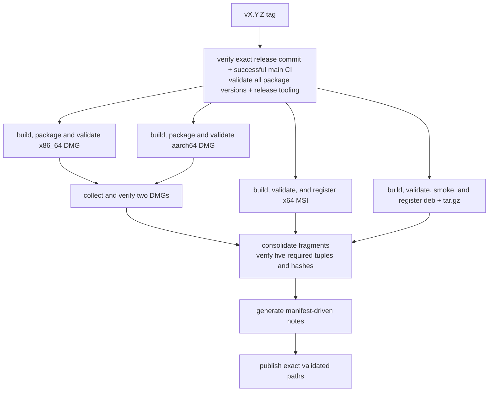
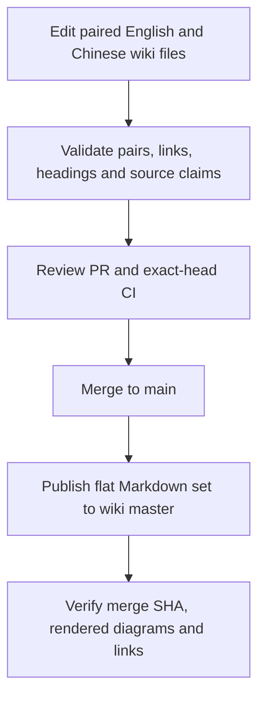

# Development and Release

[简体中文](Development-and-Release-zh-CN)

Before a PR, run the full local gate below. Before merging, require exact-head
platform CI; after merging, verify Wiki publication. Release tags need separate
approval and exact successful `main` CI. Local package commands are in
[Packaging](Packaging), and crate responsibilities in [Crate Reference](Crate-Reference).

## Repository and toolchain

```text
Cargo.toml     workspace members, shared package metadata, dependencies, profiles, lints
crates/        23 first-party Rust crates
assets/        fonts, themes, keymaps, icons, localization, screenshots
wiki/          canonical bilingual documentation
scripts/       flat first-party shell and PowerShell automation
.github/       CI, release, wiki publication, issue, PR, and dependency automation
```

The workspace uses resolver 2, Rust edition 2021, and minimum Rust 1.95.
`rust-toolchain.toml` selects stable with rustfmt and clippy. The authoritative
version is `Cargo.toml [workspace.package].version`; every workspace package and
internal path requirement uses it.

Build or run the platform entry point on its native host:

```sh
cargo build
cargo run -p sonicterm-mac       # macOS
cargo run -p sonicterm-windows   # Windows
cargo run -p sonicterm-linux     # Linux; executable name: sonicterm
```

Every first-party workspace crate has a local `CLAUDE.md`. Unit tests use the flat sibling pattern
`foo.rs` + `foo_tests.rs`, declared with `#[cfg(test)] #[path =
"foo_tests.rs"] mod foo_tests;`. Crate roots use `lib_tests.rs` or
`main_tests.rs`; `tests/` is reserved for integration tests through public or
cross-crate behavior. The `sonicterm-ui` and `sonicterm-render-model` crate-root
suites inventory every direct source module and require either that exact sibling
declaration or a non-empty explicit exemption. A declared sibling file must
exist and contain a `#[test]`; source-directory modules fail the flat inventory.
An exemption becomes stale as soon as the module gains its own sibling suite.

Tests that assert on captured tracing output use `sonicterm_logging::test_capture`.
Its `with_default` wrapper keeps each test's subscriber, filter, and sink while a
silent process-global dispatcher prevents an uncaptured first reach from disabling
the call site. Threads outside a capture still admit no events. Do not combine
this helper with production logging initialization in the same test process.

## Native dependency maintenance

`scripts/native-dependencies.json` is the machine-readable inventory for the
embedded native libraries and the pinned winit source. Each entry pins an upstream release commit,
archive checksum, explicit source subset, the upstream fixes carried on top of
that release, and the complete imported tree checksum. An `upstream_fixes` record
is provenance only: a full upstream revision and the URL to read it. The
repository keeps no local patch files, because the vendored sources — not an
archive plus a patch series — are the source of truth for what SonicTerm builds.
Required sources, headers, licenses, and changelogs are retained; unneeded
upstream demos and CI trees are not build inputs. This is separate from
Cargo.lock and from platform-provided Cairo/Fontconfig.

`crates/sonicterm-winit` retains the Windows/macOS/Linux source subset of upstream
winit 0.30.13, with the Windows-only native-key metadata extension. Its package
identity remains `winit`, and it is excluded from first-party workspace membership;
the directory name does not make it a SonicTerm-versioned package. Cargo pins that
version and patches it to this local source. Shared code, desktop backends, required
fixture data, unit tests, Send/Sync/serde integration tests and the Apache-2.0 license
are retained. Examples, example-only development dependencies, historical documentation,
and Android/iOS/Web/Redox backends are omitted; unsupported targets are rejected.

The source inventory keeps the original archive checksum and upstream revision,
records the imported subset, and pins a digest over every file in the local tree.
The subset list does not hide extra files from verification. Modified upstream
files carry local change notices, not entries claiming upstream fixes. The
Apache-2.0 license ships with each desktop package; see [Packaging](Packaging).

Preserved winit source is excluded from the first-party authored-comment scan.
The authored keyboard sibling test remains checked; reviewers inspect every changed
hunk in mixed upstream files for purpose, safety and control-flow rationale.
A matching tree digest detects source drift but does not replace that review.
On every desktop host the gate explicitly runs the dependency's unit and integration
tests with `serde`, plus warnings-denied Rustdoc, because workspace exclusion also
excludes it from workspace tests and documentation. Windows includes the native
metadata unit tests. Both invocations use `--locked` with the subset's independently
pruned `Cargo.lock`; checks of the workspace lockfile alone do not cover that graph.
Build output goes to the repository target directory, not the pinned source tree.

The verifier is Python-standard-library-only, offline, and check-only:

```sh
python3 scripts/native-dependencies.py check
python3 scripts/native-dependencies.py check --library freetype
python3 scripts/native-dependencies_tests.py
```

`check` rejects missing, modified, or additional vendor files, unpinned tree
hashes, manifest entries that still declare the retired `patches` key, and
`upstream_fixes` records that omit a revision or URL or name a local file.
Source paths and raw bytes form the hash; executable modes and empty directories
do not. `.gitattributes` disables newline conversion for vendor trees so Windows
checks the same upstream bytes.

A matching digest proves the working copy still holds the reviewed, committed
bytes. It does not establish publisher identity and does not prove absence of
vulnerabilities; that evidence comes from the recorded base release and from
reading each recorded upstream fix at its source. There is no command that
reconstructs a locally patched tree, and the tool does not pretend otherwise.

For an update, use one reviewable library change at a time:

1. Review the official release and advisories, including regressions in the new
   release. Verify the publisher/source and available signature or independently
   published checksum; record any verification limitation. A newer version is not
   automatically a fixed version. Avoid branch-head or unattended imports.
2. Update that manifest entry with the immutable release identity and verified
   archive hash. Record every required upstream fix as a full revision and URL,
   and inspect its prerequisites upstream. Drop a recorded fix only after proving
   the selected release contains it. Keep unrelated native features enabled.
3. Download the recorded archive separately and expand it outside the repository.
   Import the recorded source subset by hand and apply each recorded upstream fix
   from its upstream commit, comparing that commit against the release you are
   importing rather than against a stored copy. Diff the result against the
   current vendor tree, replace only that clean vendor directory, then record the
   new `tree_sha256` from `check`'s reported digest after reviewing the diff.
   Review added/removed C/C++ files against `build.rs`; an import is not a
   compilation result.
4. For FreeType/HarfBuzz, use `cargo install bindgen-cli --version 0.71.1 --locked`
   and run `bash scripts/regenerate-freetype.sh` or
   `bash scripts/regenerate-harfbuzz.sh`. `BINDGEN` can select a separately installed
   executable of that exact version. Both scripts compile the small
   `scripts/freetype-config.rs` helper to reuse the build's configured header.
   Review ABI and behavioral changes, not just
   version strings; regeneration must preserve crate-owned modules and tests.
5. Run the offline checks, native crate tests, full local gate, and native
   rendering checks under normal colors with isolated config/log roots and HOME
   preserved. Compare variable/color fonts, CJK, emoji, ligatures, fallback and
   raster output. Require exact-head platform CI; local macOS tests do not validate
   Windows code or Intel binaries. Update both wiki language files in the same PR.

The vendored FreeType carries two upstream fixes for excess-coordinate handling
after 2.14.3; the vendored zlib carries the invalid-distance decoding fix and the
related gzip-write corrections after 1.3.2. Those fixes are already present in the
imported sources, and the manifest records the full upstream commits for each one.
These choices do not establish that every advisory is reachable through SonicTerm
or that every remaining upstream defect is fixed. Recheck upstream
releases/advisories when preparing each dependency update and before a release;
updates remain reviewed changes rather than automatic merges.

## Local verification gate

`scripts/local-gate.py` is the repository's one runnable, host-aware gate
definition. Run it from the repository root, to the end:

```sh
python3 scripts/local-gate.py
```

<!-- local-gate:begin -->

| Step | Command | Local hosts | Class | Needs | CI jobs |
| --- | --- | --- | --- | --- | --- |
| `pty-close-baseline` | `cargo test -p sonicterm-app --lib pty_close_baseline -- --ignored --nocapture` | macOS, Windows, Linux | `local` | `rust`, `native` | `macos-core`, `windows-tests`, `linux-core` |
| `fmt` | `cargo fmt --all --check` | macOS, Windows, Linux | `local` | `rust` | `macos-core`, `windows-checks`, `linux-core` |
| `clippy` | `cargo clippy --workspace --all-targets -- -D warnings` | macOS, Windows, Linux | `local` | `rust`, `native` | `macos-core`, `windows-checks`, `linux-core` |
| `doc` | `RUSTDOCFLAGS="-D warnings" cargo doc --workspace --no-deps` | macOS, Windows, Linux | `local` | `rust`, `native` | `macos-core`, `windows-checks`, `linux-core` |
| `doc-resource-features` | `RUSTDOCFLAGS="-D warnings" cargo doc -p sonicterm-resource --all-features --no-deps` | macOS, Windows, Linux | `local` | `rust` | `linux-core` |
| `authored-comments` | `bash scripts/check-authored-rust-comments.sh` | macOS, Windows, Linux | `local` | `bash` | `macos-core`, `windows-checks`, `linux-core` |
| `no-raw-exit` | `bash scripts/check-no-raw-process-exit.sh` | macOS, Windows, Linux | `local` | `bash` | `macos-core`, `windows-checks`, `linux-core` |
| `rust-version` | `bash scripts/check-rust-version.sh` | macOS, Windows, Linux | `local` | `rust`, `bash` | `macos-core`, `windows-checks`, `linux-core` |
| `window-owner` | `bash scripts/check-window-owner-registration.sh` | macOS, Windows, Linux | `local` | `bash` | `macos-core`, `windows-checks`, `linux-core` |
| `workflow-supply-chain` | `bash scripts/check-workflow-supply-chain.sh` | macOS, Windows, Linux | `local` | `rust`, `bash` | `macos-core`, `windows-checks`, `linux-core` |
| `workspace-crates` | `bash scripts/check-workspace-crates.sh` | macOS, Windows, Linux | `local` | `rust`, `native`, `bash` | `macos-core`, `windows-tests`, `linux-core` |
| `doctests` | `cargo test --workspace --doc --no-fail-fast` | macOS, Windows, Linux | `local` | `rust`, `native` | `macos-core`, `windows-tests`, `linux-core` |
| `pty-feasibility` | `bash scripts/pty-backend-feasibility.sh --check` | macOS, Windows, Linux | `local` | `rust`, `bash` | `macos-core`, `windows-tests` |
| `resource-inventory` | `bash scripts/test-resource-inventory.sh` | macOS, Windows, Linux | `local` | `bash` | `macos-core`, `windows-tests` |
| `resource-baseline-tests` | `bash scripts/test-resource-baseline-evidence.sh` | macOS, Windows, Linux | `local` | `bash` | `macos-core`, `windows-tests` |
| `soak-harness` | `bash scripts/test-soak-harness.sh` | macOS, Windows, Linux | `local` | `bash` | `macos-core`, `windows-tests` |
| `linux-packages-tests` | `bash scripts/test-linux-packages.sh` | macOS, Windows, Linux | `local` | `bash` | `linux-core` |
| `release-assets-tests` | `bash scripts/test-release-assets.sh` | macOS, Windows, Linux | `local` | `rust`, `bash` | `linux-core` |
| `release-notes-tests` | `bash scripts/test-release-notes.sh` | macOS, Windows, Linux | `local` | `bash` | `macos-core`, `windows-tests`, `linux-core` |
| `wiki-publish-tests` | `bash scripts/test-wiki-publish.sh` | macOS, Windows, Linux | `local` | `rust`, `bash` | `macos-core`, `windows-tests`, `linux-core` |
| `logic-coverage` | `scripts/rust-logic-coverage.sh` | macOS, Linux | `local` | `rust`, `native`, `llvm-cov` | `macos-coverage` |
| `windows-warp-allocator` | `cargo test -p sonicterm-gpu --test windows_warp_allocator_baseline -- --nocapture` | Windows | `local` | `rust`, `native`, `warp` | `windows-tests` |
| `msi-validator-tests` | `.\scripts\validate-windows-msi_tests.ps1` | Windows | `local` | `pwsh` | `windows-tests` |
| `macos-selection-build` | `cargo build --locked -p sonicterm-app --example native_split_selection` | macOS | `local` | `rust`, `native` | `macos-smoke` |
| `macos-selection-smoke` | `python3 scripts/native-selection-smoke.py` | macOS | `local` | `rust`, `native` | `macos-smoke` |
| `release-macos` | `cargo build --release -p sonicterm-mac` | macOS | `release` | `rust`, `native` | `macos-smoke` |
| `release-windows` | `cargo build --release -p sonicterm-windows` | Windows | `release` | `rust`, `native` | `windows-smoke` |
| `release-linux` | `cargo build --release -p sonicterm-linux` | Linux | `release` | `rust`, `native` | `linux-packages` |
| `windows-target` | `bash scripts/check-windows-target.sh` | macOS | `optional` | `rust`, `win-target`, `bash` | — |

Classes: `local` steps run by default; `release` steps run with `--with-release`; `optional` steps run with `--with-optional` and never run in CI.

Local hosts are the hosts where the runner selects a step. CI jobs are where CI runs it, which can cover fewer hosts, or none.

Needs:

- `rust`: the Rust toolchain from `rust-toolchain.toml`, with rustfmt and clippy.
- `native`: the platform's native build libraries: Cairo and pkg-config on macOS (`brew install cairo pkg-config`), Cairo from `scripts/setup-windows-cairo.ps1` on Windows, and the packages the `linux-core` job installs on Linux.
- `bash`: `bash` on `PATH`; on Windows, run the gate from Git Bash so Git's `bash` is found first.
- `pwsh`: PowerShell 7 (`pwsh`) on `PATH`.
- `llvm-cov`: `cargo-llvm-cov` at the `CARGO_LLVM_COV_VERSION` that `ci.yml` pins.
- `win-target`: the `x86_64-pc-windows-msvc` standard library (`rustup target add x86_64-pc-windows-msvc`).
- `warp`: a DX12 WARP adapter with allocator reporting.
- Every step also needs Git and Python 3 on `PATH`.

<!-- local-gate:end -->

`pty-close-baseline` explicitly selects the ignored real-PTY measurement on every
desktop host. Its 1200-second local budget matches the 20-minute CI step, which
runs immediately after Cargo dependency restore and includes building the test
binary. Only the baseline uses a 640-second isolated-child observation envelope
and 1 MiB complete-output cap. Output overflow fails explicitly while both pipes
continue draining, never producing a successful truncated report. Ordinary
`isolated()` callers retain their 60-second deadline, 64 KiB diagnostic tail,
and quiet successful output.

The envelope reserves 20 ordinary and 20 stalled samples. Ordinary setup has one
4-second wait; the Windows stalled setup also has a 4-second flood wait. The
configured native receive/retry waits total 6.5 seconds: one shared 500 ms cancel,
500 ms each for reader, writer, termination retry and reap, plus 2 seconds each
for ConPTY close and drain. The observer's 4-second limit and 2-second completion
allowance overlap close, so their maximum is used rather than adding both paths.
Each sample also allows 2 seconds for fixture cleanup; 60 seconds covers launch,
scheduling and reporting. The resulting 640 seconds is a measurement budget,
not a production-close upper bound: native calls, locks and joins can still hang.
A genuine close hang remains a harness failure with child-tree cleanup at the
enclosing deadline, while bounded unsettled samples still reach the summaries.

For ordinary and stalled scenarios it uses the same shell, one pane, and 20
samples per scenario. Setup, settlement and cleanup remain bounded within the
isolated child's deadline; summaries use nearest-rank percentiles.
Every `PTY_CLOSE_BASELINE` sample and p50/p95/max summary distinguishes the
`close_pty_pane` caller's blocking time from an independent process observer's
settlement time, both starting at close. The caller is the headless App-owning
test thread, not a running native event loop. Windows fills the ConPTY output
queue; Unix keeps a slave descriptor open in the test process, outside the shell
session, through the observation. The observer uses retained Windows handles for
the shell, its descendant and externally identified conhost/OpenConsole. Unix
matches PID plus start time: the shell must be absent (`observation=reaped`),
while descendants may be absent or zombie (`observation=exited_or_zombie`); a
zombie may remain when its new parent does not reap it. The test never reaps the
PTY shell. A four-second settlement limit prints a censored `>4000.000` sample;
each summary includes its `censored` count and preserves lower-bound percentile
markers. Cleanup afterward cannot turn it into a successful measurement. Durations never
fail the test; setup/observation failures do. If close itself never returns, the
isolated child deadline ends the run and retains the last phase, rather than
claiming a completed sample. Native scenario setup is not proof that the
historical stalled teardown reproduced.

The runner selects the host's `local` steps and runs them in table order.
`--with-release` adds the host's `release` steps, `--with-optional` adds its
`optional` steps, `--step ID` runs only the named steps, and `--list` prints the
selection with each step's timeout, prerequisites, and CI jobs. POSIX steps run in
their own process groups under deadlines, reusing the native smoke runner's
launch and tree-kill logic. Windows uses owned jobs as described below. Later
steps still run after failure, timeout, or launch error. On macOS and Linux a step also fails when
members of its process group are still running two seconds after its leader
exits: the runner kills them and records the count in the step log and both
summaries. The runner observes the leader's exit without reaping it, with
`os.waitid` and `WNOWAIT` where Python provides it and otherwise, on macOS
Python builds without `os.waitid`, with a kqueue exit event. The leader stays an
unreaped zombie, so its PID, which is the process-group id, cannot be reused by
an unrelated group while the runner polls and kills the group; only then is the
leader reaped. On macOS a group kill fails with EPERM when the unreaped leader
is the only member left, where Linux reports success. When a deadline or Ctrl-C
comes after the leader has exited, the runner records that refusal in the step's
detail and still kills or reaps the leader, so the step records its result and
the summaries are written. On macOS and Linux the runner refuses to start when
SIGCHLD is ignored (exit 2), because the kernel can then reap each leader
before the runner can read its exit status or hold its group id. When the
runner detects that another reaper collected a leader during a step, the step
fails with its exit status recorded as unavailable, never as 0, and the runner
sends no signal to that leader's pid or group. A concurrent reaper that
collects the leader after the runner has seen it exit, and before the runner
reaps it, is unsupported: a group scan or kill in that window can aim at a
group id no process reserves. A POSIX host whose Python has neither mechanism
reaps the leader first, as before, so there the group id can be reused before
the group is killed, and such a host cannot detect a leader that another reaper
collected, because Popen then reports exit 0. Group emptiness comes from the
member list, read from `/proc` on Linux and from `ps` elsewhere, which leaves
zombies out; when the list still cannot be read at the end of the grace period,
the group is killed and the step fails with an unknown leftover count.
On macOS and Linux the leftover check sees only the step's process
group: a child that calls `setsid`, or otherwise leaves the group, is neither
seen nor killed, and if it also redirects its output away from the step's pipe,
the runner does not bound it at all, because the deadline kills only the group.

On Windows, only the local gate uses an unnamed kill-on-close Job Object without
breakaway. A trusted bootstrap is assigned through its retained process handle
before it can launch the target; assignment or startup-protocol failure refuses
execution. Job `ActiveProcesses` is checked before waiting for output EOF, with
a two-second grace capped by the step deadline and a two-second cleanup budget.
Cleanup terminates the owned job, never processes selected by name or reopened
PID. Accounting, protocol, output, and cleanup errors fail the step; closing the
job handle alone is not evidence of verified emptiness. A Python startup hang
before assignment remains outside the parent-crash containment guarantee.

The Windows policy defaults to strict: surviving descendants fail mixed tests,
doctests, workspace scripts, and native steps, including compiler helpers in
those steps. Only `clippy`, `doc`, `doc-resource-features`, and `release-windows`
permit forced compilation cleanup after target exit 0, complete capture and
protocol, and verified job emptiness. Their result is `CLEANED_NOT_NATURAL`, not
`PASS`. Logs and JSON preserve the original unsigned target exit, policy, job
accounting, and cleanup outcome; the text summary counts cleaned steps separately.
A run containing only `PASS` and permitted `CLEANED_NOT_NATURAL` steps exits 0,
but its overall verdict remains `CLEANED_NOT_NATURAL` if any step required cleanup.
Mixed cold steps can still fail; no process-name exemption changes that boundary.

The local gate preserves DEVNULL input, argv, working directory, environment,
and existing color settings. One merged output pipe streams raw bytes to disk
without retaining the complete output in memory. Without an explicit cap the
full stream is logged; an explicit cap keeps its prefix, drains excess output,
and fails on overflow. Console output remains step progress and log tails.
`native-smoke-runner.py` and direct CI/Release invocations retain their existing
behavior; this local custody policy does not apply to those callers. Windows
custody regressions run through `local-gate_tests.py` with a cleanup-inclusive
60-second group budget; the complete supply-chain step retains its 120-second budget.

Per-step logs, `summary.txt`, and `summary.json` go to a new temporary
directory, or to `--log-dir`, which cannot be the repository root or an
ancestor of it (exit 2), and the exit status is nonzero when any step fails.
Step logs keep each step's exact output bytes, and console text that the
console cannot encode, such as CJK text on a cp1252 Windows console, is printed
escaped instead of stopping the run.
Because the summaries are written after the final snapshot, the runner also
refuses, before any step runs, a runner-owned output path (a step log,
`summary.txt`, or `summary.json`) that is tracked, compared case-insensitively,
or that is a symlink or a hard link (exit 2). The runner creates each step log
and summary as a new file, created exclusively in the log directory and renamed
onto the output path, so a symlink or hard link found there is replaced, never
written through, and a log tail is read without following a symlink. A symlink
or hard link that appears at an output path during the run, or a log directory
replaced during the run, fails the run with a message naming the path. When the
runner finds the log directory replaced, it stops starting steps: the remaining
steps do not run and no summaries are written. The runner records tracked and
untracked Git state, including each path's type and permission bits, before and
after the run: changes already present are reported as pre-existing, a change
made during the run fails the gate, and the runner never cleans the tree. Only
the runner's own untracked logs and summaries are left out of that comparison.

Each step's timeout comes from its CI budget; a step that no CI job runs gets a
bound well above its measured runtime. A slow machine or a cold build can
therefore report `TIMEOUT` for a step that would pass; rerun that step with
`--step ID` once the build is warm.

`ci.yml` keeps explicit steps for per-step progress and timeouts; the table is
checked against it, not generated into it. `scripts/local-gate_tests.py` runs
through `check-workflow-supply-chain.sh` in `macos-core`, `windows-checks`, and
`linux-core`. It fails when a table command is missing from a CI job it names,
when a `ci.yml` step runs a `scripts/` gate or a `cargo fmt|clippy|doc|test`
command that is neither a table step nor on the reasoned CI-only list, and when
this block, the Chinese page's block, or the `CLAUDE.md` block differs from
`python3 scripts/local-gate.py --render en` or `--render zh-CN`. The `ci.yml`
reader models this repository's workflow layout and raises on any `run:` form it
does not model, so parity fails loudly instead of skipping a step. It also raises
on a `defaults:` key at the workflow's top level or in a job, in block or flow
form, because inherited `run` defaults (`working-directory`, `shell`) apply to
every run step and the reader does not model them, and on any top-level line
that is not a plain `key:` line. A step's `shell:` must be a plain `bash` or
`pwsh`: another shell, a custom template, or a quoted, flow, block, or
continued spelling raises, like a `working-directory:`. Before classifying a
command it normalizes
`cargo +toolchain`, quoted script paths, and `scripts\` separators; it checks
every command joined by `&&` or `;` and every line of a `run:` block, and it
reports a gate it cannot prove, such as one behind a pipe, `||`, a wrapper
command, or a command substitution. It also reports a `${{ }}` workflow
expression in any position that decides what runs: the command word, the cargo
subcommand (also after `+toolchain` or a leading cargo option), an
interpreter's script argument (also after interpreter options), and the command
after a first-party script's `--` separator. Expressions in ordinary data
arguments stay supported. The classifier does not analyze shell exit status:
checking every command on a compound line or block does not prove that a
failure propagates. Whether a failure before `;` or on an earlier line of a
block fails the step depends on the shell's own error handling, such as
`bash -e` or PowerShell's last exit code, which the parity check does not
model. Parity compares command text only, so it does not model job or workflow
`env:`, such as a `BASH_ENV` or `RUSTFLAGS` that changes what an unchanged gate
does, or a shell expansion that supplies a gate word or script path at run time,
such as `cargo $SUB`, `bash "$SCRIPT"`, or `cargo $(echo test)`; a workflow edit
is reviewed like any other change. Each CI-only entry
carries a reason: dependency setup, an evidence rerun of an integration test
that the same job's workspace step already runs, or runtime and package evidence
that needs hosted runners, release binaries, or built packages. A first-party
test, or a `cargo fmt|clippy|doc` run, that only CI runs cannot be CI-only, so a
missing local test or gate fails parity.

The separate `doc-resource-features` step is required because
`test-util` is the workspace's only optional feature and `cargo doc` builds no
dev-dependencies. Workspace Clippy and tests already compile `test-util`
through `sonicterm-logging`'s dev-dependency on it. The font stack has no
optional vendor features: St.Helens is a normal tracked asset and other fallback
faces come from native discovery.
`check-workspace-crates.sh` first runs the native-source verifier unit tests,
its offline integrity check, and portable macOS bundle tests, then runs one fail-complete
`cargo test --workspace --lib --bins --tests --no-fail-fast` command for default
features. Each phase runs even if an earlier phase fails. It covers every workspace library, binary, and integration-test target
without repeating the unit and binary targets in a serial per-package loop. Its
pinned winit phases honor a caller's `CARGO_TARGET_DIR`. That command compiles no
doctests. The `doctests` step compiles and runs ordinary doctests, compiles
`no_run` examples without running them, and skips `ignore` examples.

The authored-comment checker enforces purpose Rustdoc on effectively public
functions and public trait functions, `# Safety` on public unsafe functions, and
anchored `// When:`, `// SAFETY:`, `// Lock order:`, `// Ordering:`, and
`// Lifecycle:` contracts. `check-no-raw-process-exit.sh` requires shipping code
to exit through `sonicterm_logging::exit_with`.
`check-workflow-supply-chain.sh` enforces the workflow contract described in
[Workflow supply chain](#workflow-supply-chain); it runs its own parser tests
first, so a scan that silently stops matching cannot report a green gate. It
also runs the local-gate runner and parity tests.

The `windows-warp-allocator` step is the release-blocking deterministic
allocator test on Windows. It requires a DX12 WARP adapter and allocator report.
Production reserved bytes must be below 64 MiB, the largest block below 128 MiB,
and production reserved bytes below the old-default control. Windows CI is the
only reliable compiler and runner for `#![cfg(target_os = "windows")]` tests; on
macOS such files can compile to no tests.

The optional `windows-target` step is a pre-push aid on macOS, never a CI gate.
`scripts/check-windows-target.sh` fails when a workspace member is in neither of
its two lists, then runs
`cargo clippy --locked --target x86_64-pc-windows-msvc --all-targets -- -D warnings`
on the 13 members that need no Windows C toolchain: `sonicterm-types`, `-grid`,
`-vt`, `-cfg`, `-logging`, `-resource`, `-text`, `-ui`, `-app-core`, `-io`
(including its ConPTY code and Windows-gated tests), `-render-model`,
`-block-glyph`, and `-font-config`. That scope is default features, all targets,
and the target-specific dev and build closure, in a separate target directory. It
also runs `cargo check --locked` on the pinned winit with `serde`, so its Windows
keyboard tests compile, and it fails with the
`rustup target add x86_64-pc-windows-msvc` hint when the target is missing. It
does not check the other ten members: `sonicterm-freetype` and
`sonicterm-harfbuzz` run native C/C++ builds, `sonicterm-fontconfig` discovers a
system library through pkg-config, and `sonicterm-font`, `-engine`, `-gpu`,
`-app`, `-mac`, `-windows`, and `-linux` need the unverified native font and
Cairo closure. Cairo is a system dependency, not vendored: its pkg-config probe
rejects the cross-compile target, and with that probe bypassed the first native
blocker is `sonicterm-freetype`'s vendored zlib, which needs Windows CRT
headers. The check compiles and lints only; Windows CI is the only place
Windows code runs. CI runs a static classification-completeness check instead of
the step: `scripts/local-gate_tests.py` compares the script's two crate lists
with the workspace members in `macos-core`, `windows-checks`, and `linux-core`
without running the script, so every new crate must be classified.

The Windows `windows_font_weight_present` test yields to native message dispatch
between setup, render, capture, individual weight actions, and cache checks.
Every phase checks that its window remains responsive; errors and completion
release the renderer and verify the live-renderer baseline. A missing redraw
fails at the 180-second test deadline. Native GDI pixel comparisons remain
required, including when `SONICTERM_FONT_PROBE_DIR` enables dense readback and
image evidence.

Release preparation also builds the shipping platform binary:
`python3 scripts/local-gate.py --with-release` adds the host's `release` step.

### Native split selection

`windows_native_split_selection` runs with the Windows workspace integration
tests. It creates native windows and renderers, then sends synthetic in-process
pointer events through the production App handlers. Main and child windows cover
side-by-side, stacked, and nested splits; the assertions check the selected pane,
exact copied text, terminal mouse reports, Shift selection, and frame-count
advancement. Copy uses an in-memory clipboard; no PTY or system clipboard is used.
This is not physical drag-gesture or pixel-readback evidence.

The fixture returns to the native event loop between presentations. Each native
redraw maps the actual window id to the fixture's App entry and makes one
production redraw attempt. Local press and release stages each require a completed
frame; physical pointer and keyboard input are ignored. Stage and deadline records
include both window ids, native/App redraw counts, completed frames, and the last
observed native occlusion event. A missing event does not establish visibility;
`is_visible` is not the native occlusion state. Missing redraw routing is a failure.
Attempts that never complete the first frame report `BLOCKED` without inferring a
cause; later deadlines fail. Neither result satisfies native acceptance.

macOS runs the same fixture through an example on the process main thread.
Ordinary workspace tests and coverage do not execute the example, so the macOS
local gate explicitly builds and runs it. Both required `macos-smoke` CI matrix
legs run the same commands before packaging. The example build has a 25-minute
budget for cold dependencies on either architecture; the combined native-smoke
job has a 75-minute budget for its separate debug/release builds and packaging.
The selection runtime limits are independent and unchanged:

```sh
cargo build --locked -p sonicterm-app --example native_split_selection
python3 scripts/native-selection-smoke.py
```

The verifier selects Metal, enables the renderer's adapter records on stderr,
removes inherited `NO_COLOR`, and preserves `HOME`. It passes Python's selected
OS temporary root as `TMPDIR` so Rust uses the same root. The verifier launches
`cargo run --locked -p sonicterm-app --example native_split_selection -- --run <fixture>`
from the repository root rather than guessing an executable path. Cargo resolves
`CARGO_TARGET_DIR`, `CARGO_BUILD_TARGET_DIR`, `build.target-dir` and the configured
target, and checks build freshness before execution. A missing Cargo executable,
build/configuration error or timeout fails the gate; it never falls back to an
older default-path binary. The fixture gets a new child under the OS temporary
directory, not an assumed `RUNNER_TEMP` location, with isolated config and logs.
Its watchdog remains 180 seconds and each window/topology case has a 20-second
deadline. The verifier directly reuses the local gate's 190-second process-group
launcher for Cargo and the example, including any needed rebuild, unreaped-leader
ownership and the post-exit leftover check. Run the separate build step first to
keep cold compilation within its own budget. The local gate's documented `setsid`
escape limitation also applies here.

Success requires exit 0, exactly one PASS for every main/child topology, one final
PASS, and a selected-adapter record per case with Metal, a non-CPU device type, and
`software_rendering=false`. Missing or duplicate cases, `NOT_EXERCISED`, `BLOCKED`,
panics, cleanup warnings, surviving fixture directories or process-group members
fail the gate. The launcher retains at most 8 MiB of child output, continues
draining after overflow, and fails instead of accepting truncation. Evidence stays
in the printed OS-temporary directory; CI uploads it on failure. Retain only the
needed evidence, then remove that directory. A Windows pass cannot substitute for
macOS execution, and a direct example invocation without `--run` is not acceptance.

### Reviewed block-glyph rasters

`sonicterm-block-glyph` keeps a reviewed raster digest table in
`crates/sonicterm-block-glyph/raster-digests.golden.tsv`. Each row records a
codepoint, the cell width, height, and underline thickness, the alpha sum, the
ink bounding box, and an FNV-1a 64 digest over the tile size and row-major
alpha, the only channel the renderer keeps. The table holds 37 codepoints,
including at least one from each block-key family that `from_char` maps. The
test requires a reviewed row for all 222 combinations of these codepoints and
the six case sizes: 5×9/1, 8×16/1, 15×31/2, 16×32/2, 30×40/2, and 45×60/3 (cell
width × height / underline, in texels). `raster_digests_match_reviewed_table`
requires an exact match on every host, with no tolerance, and prints old and
new values and the regeneration command for each differing row.

Spinner segments remain rasterizable in thin and small cells. When their
inner clear circle collapses, it contributes no path and clears no pixels;
the outer fill and the remaining sector-clearing paths still run. This does
not alter nonempty paths or the rasters at sizes where the hole is positive.
The spinner regression tests include 1×1 cells and both orientations around
the `min(width, height) = 6 × underline` boundary. A subpixel sector may be
fully transparent in a tiny cell; its tile must still have the requested
size and storage.

Regenerate the table only for a named geometry change:

```sh
SONICTERM_BLESS_BLOCK_GLYPH=1 cargo test -p sonicterm-block-glyph raster_digests
cargo test -p sonicterm-block-glyph
```

The bless run rewrites the table, prints each changed raster in hex, and always
fails, so only the plain rerun can pass. Reviewers compare the old and new alpha
sums and bounding boxes of each changed row. A digest change needs a named
geometry change and the attached rasters; otherwise it is a regression.

Digests are not the only oracle. Without stored data, `customglyph_tests.rs`
rasterizes every mapped codepoint at two sizes, 8×16/1 and 16×32/2, and requires
the requested size and visible ink, with U+2800 as the only blank. It also pins
full-block opacity, shade levels, line centering and thickness, box joins,
Braille dot positions, and Powerline coverage. If hosts disagree on
anti-aliased texels, report the per-texel deltas; the maintainer chooses a
documented tolerance or per-platform tables.

## Pull-request and main CI

`.github/workflows/ci.yml` runs on pull requests and pushes to `main`. Pull-request
runs share a ref-specific concurrency group and cancel an obsolete run when that
ref advances. Each `main` push instead has a SHA-specific group and never
cancels in progress, so a later merge cannot erase the exact-SHA verification
record for an earlier one.

Never merge or enable auto-merge while a required pull-request job is queued,
in progress, missing, cancelled, unexpectedly skipped, or failed. The macOS,
Windows, and Ubuntu jobs must each finish successfully on the exact reviewed
head commit before merge. Windows success is mandatory because that job is the
only reliable compiler and runner for Windows-only tests; local, macOS, Ubuntu,
or review results cannot substitute for it. After every merge, verify Wiki
publication before starting the next serialized pull request. Successful
exact-head PR CI is the CI gate for PR work; `main` CI is a release-provenance
gate only and does not block the next PR.

Keep every wait off the main agent. For each lifecycle that must wait or monitor
— a long local gate, pull-request CI, post-merge Wiki publication,
release-provenance `main` CI, or a release workflow — start one dedicated watcher subagent, not one subagent
per job. Give it an immutable handoff: repository/worktree path, expected commit
SHA, PR number or run ID, exact required jobs or commands, timeout, and success
criteria. The watcher owns that lifecycle until terminal `SUCCESS`, `FAILURE`,
`BLOCKED`, or `STALE`, and reports the expected and observed SHA, run IDs, every
required result, and actionable failure evidence. It returns immediately when
the head changes or a required job fails, is cancelled, or is unexpectedly
skipped; it never follows a replacement run or accepts a green result by branch
name alone.

While the watcher runs, the main agent advances only a non-overlapping item in a
separate worktree based on the current default branch; it never edits the tree
being tested. Watchers do not push, merge, tag, publish, or clean shared state.
Run at most one full Cargo gate or build on the host at once, never share a
`CARGO_TARGET_DIR` between concurrent worktrees, and use heavy-gate time for
research, editing, or lightweight checks. A watcher failure, blocker, or stale
SHA immediately returns the main agent to the current lifecycle.

Concurrency does not relax publication order: do not merge before the current
pull request's exact-head checks pass, and do not open the next pull request
before the current one is merged and its exact merge-SHA Wiki publication is
verified. Do not wait for `main` CI to advance PR work; require it when validating
a release commit. Then update the next worktree onto the new
default-branch tip and rerun affected validation before publication. Once those
gates pass, fetch and prune the default remote, then clean local state against
its symbolic default branch. Remove only clean, unlocked worktrees whose HEAD is
merged there, and delete only merged local branches not attached to a preserved
worktree. Never force removal or discard dirty, unmerged, or locked worktrees or
any stash.

### macOS 14 and Windows latest

The stable required checks are fail-closed aggregate jobs: `macos-14 / unit
tests` requires `macos-core`, `macos-coverage`, and `macos-smoke`, while
`windows-latest / unit tests` requires `windows-native`, `windows-checks`,
`windows-tests`, and `windows-smoke`.
Each aggregate runs with `if: always()` and accepts only explicit `success`
results, so a failed, cancelled, or skipped shard cannot turn into a successful
required check.

The macOS core shard first measures the real PTY close baseline after Cargo
restore, then runs source-policy checks, strict Rustdoc, the one-pass workspace
test gate, workspace doctests, host probes, tooling tests, and real resource-baseline
capture. Its independent coverage shard installs the pinned
`cargo-llvm-cov`, runs the deterministic logic coverage gate, and uploads its
evidence artifact after success and after failure once the coverage step has started. The restore-only
`macos-smoke` matrix builds shipping release binaries on macOS 14 Apple Silicon
and macOS 15 Intel with distinct dependency-cache keys. Both lanes require the
bounded raw-binary smoke, then build and mount a DMG on that same architecture.
The installed bundle passes relative-library closure, signature, deployment-floor,
Homebrew-denied runtime/Cairo drawing, and exact bundled-font registration checks;
a controlled same-binary image pair records compressed font savings. The macOS
aggregate requires both matrix lanes. Release jobs also package on their matching
architecture; the final macOS artifact job collects already-validated DMGs.

Windows first prepares static Cairo through vcpkg. It restores the binary cache,
builds a cold miss, and saves that result immediately before the three dependent
shards start. Consumers allow 12 minutes for Cairo installation: a restored
fallback archive may contain no compatible packages after a hosted-image or
vcpkg revision change, so dependency setup must still accommodate a cold build.
The producer retains its 30-minute limit. The Windows tests job allows 65 minutes:
the early app-only baseline build can be rebuilt under the workspace's unified
dev-dependency features. The macOS and Ubuntu core jobs retain 45-minute limits.
The checks shard runs format, Clippy, source-policy, comment, and
Rustdoc gates. The test shard measures the real PTY close baseline after Cargo
restore, then runs the one-pass workspace tests, doctests, host probes,
fail-closed GDI presentation verification, WARP allocator,
software-selection presentation, tooling tests, and real resource-baseline
capture. The GDI wrapper accepts only one `capability=EXERCISED` verdict;
`HOST_INCAPABLE` remains informational and cannot satisfy the gate. The
restore-only `windows-smoke` shard builds the shipping release binary and
requires its bounded native smoke.

Each platform's Rust-consuming shards share one dependency cache key and exclude
workspace-crate artifacts. Only the core/checks shard may save it, and only on a
push to `main`; coverage, test, package, and every pull-request lane are
restore-only. This bounds cache entries and prevents parallel immutable-key
writers while still warming later runs.

Every job and authored step in the normal-CI, release, and wiki-publication
workflows has an explicit timeout sized above recent cold-cache runtime. Fast
checks, transfers, and native probes use short limits; workspace, coverage,
dependency, native-build, and package stages retain larger compile/network
margins. The real resource-baseline collector separately bounds each focused PTY
command at 30 seconds and its live soak at 90 seconds. A timeout kills the
command's process tree, records exit 124 plus partial stdout/stderr in the
evidence bundle, and continues writing checksums; the workflow's ten-minute
limit is the final guard around that collector.

Python `*_tests.py` entry points default to verbose `unittest` output: each test's
name is flushed before its body runs, followed by its result. Native dependency
checks emit flushed `[native-dependencies] start NAME` and `finish NAME exit=N`
lines to stderr. The native-smoke CLI emits `[native-smoke] start timeout=Ns`
before launch and `finish exit=N` after capability validation; captured child
output is flushed before the final status. Package checks emit
`[package-check] start LABEL timeout=Ns` and `finish LABEL exit=N`; the font/Cairo
probe instead finishes with `result=PASS` or `result=FAIL` after report validation.
These progress lines are flushed to stderr without changing stdout payloads,
exit codes, or captured log files. The resource-baseline collector also emits
flushed per-command start/finish progress. A start line identifies work in
progress, not a passing check.

### Ubuntu 22.04

The stable `ubuntu 22.04 / workspace, packages, X11, Wayland` aggregate requires
`linux-core` and `linux-packages`, using the same fail-closed result check as
the macOS and Windows aggregates. The core shard installs the compile-time Linux
dependencies plus Vulkan/lavapipe for GPU tests and adapter probes, measures the
real PTY close baseline after Cargo restore, then runs format, Clippy, Rustdoc (including `sonicterm-resource` with its `test-util`
feature), the one-pass workspace test gate, doctests, authored-comment, exit,
Rust-version, window-owner, workflow supply-chain, Linux-package, release-asset,
release-note, and wiki-publisher checks.

All three Ubuntu dependency-install steps in CI and Release allow 20 bounded
minutes so a slow cold Jammy mirror can finish without weakening the CI shards'
fail-closed result or the release provenance boundary.
The independent package/runtime shard installs Mesa Vulkan/lavapipe, Xvfb,
Weston, and Debian packaging tools, then:

1. builds `sonicterm-linux` in release mode;
2. derives one workspace version from Cargo metadata;
3. creates and validates the x86_64 `.tar.gz` and `.deb`;
4. validates desktop/AppStream metadata and runs advisory `lintian`;
5. runs both package layouts on X11/Xvfb and Wayland/Weston with Vulkan/lavapipe;
6. uploads the packages, or smoke logs on failure.

A platform smoke cannot pass without a native window, renderer/device, a
platform-shell PTY marker observed in the live grid, a later native frame
presentation, and the default warm renderer's create/report/adopt/child-present/
release lifecycle with the process renderer count restored. Every invocation
uses separate scratch config/log roots and the process-tree-reaping wrapper; a
warm-lifecycle failure exits `16`. The core shard is the sole main-only Linux
dependency-cache writer; the package shard is restore-only and workspace-crate
artifacts remain excluded.

macOS and Windows smoke also read back native numbered titles and exercise
Unicode rename/reset on startup and warm-adopted windows. Mismatches fail at the
display boundary (exit `11`). Linux still requires external X11 property or
Wayland compositor-visible evidence: winit's X11 getter is unimplemented and its
Wayland getter is only cached state. These checks do not verify OS switcher labels.

Windows smoke additionally installs the production OLE backend. Main, warm-adopted,
and fresh child windows must each register and revoke their custom drop target;
the post-run report requires three successful pairs, zero live registrations and
zero failures before OLE is uninitialized. Windows-only COM tests use hidden HWNDs
and real data objects to verify duplicate-owner refusal, Unicode file delivery,
exact target identity and cleanup. They do not synthesize or verify physical drag
gestures. See [Platform Integration](Platform-Integration).

## Gate blind spots

- The one-pass workspace gate includes integration tests for all 23 packages,
  but it still exercises only targets that can compile and run on its host.
- `rust-logic-coverage.sh` requires 80% line coverage only for its selected
  deterministic subset. Its ignore regex excludes 9 whole crates, including
  `sonicterm-app` and `sonicterm-gpu`, plus named native/controller files in
  other crates. CI runs it only on macOS, although the local runner also selects
  it on Linux. A green percentage does not cover native windows, real PTYs, GPU
  surfaces, generated FFI, installers, or Windows-only logic.
- The same run reports its profiles again without the ignore regex and prints
  line coverage for every workspace member, and `scripts/coverage-floor.py`
  holds each measured crate to its entry in `scripts/coverage-baseline.json`.
  CI fails when a crate drops more than 1.0 percentage point below its entry
  or has no entry, and when the report disagrees with the workspace members and
  declared not-measured crates: a crate with an entry stops being measured, a
  member is neither measured nor declared, or a declared crate starts reporting
  lines. Test, vendored, generated, and build-script code is excluded with
  printed counts; a crate with no eligible line prints `not measured` with its
  reason. The floor catches regressions, not low coverage: a crate that stays
  low still passes. The `sonicterm-windows` and `sonicterm-linux` rows measure
  code compiled on macOS, not execution on those platforms. The baseline is
  keyed to the macOS arm64 CI runner; CI on another host fails as not
  comparable, and local runs print informational deltas without a verdict. Floor
  numbers change only in a reviewed diff from a retained run's verified
  evidence, as [Coverage evidence and rebaselining](#coverage-evidence-and-rebaselining)
  describes.
- `deny.toml` records advisory, license, source, and wildcard-dependency policy,
  but no CI job runs `cargo deny check`.
- Native AppKit, Win32, X11/Wayland, font-discovery, PTY, GPU, and installer
  behavior still depends on platform tests, package smokes, release builds, and
  manual use; a symbol-only test cannot prove those boundaries.

## Coverage evidence and rebaselining

The per-crate floor is enforced only on the macOS arm64 CI runner, and CI tracks
the stable Rust channel, so a new stable release or runner image can move a
crate's measured coverage with no source change. Each coverage run therefore
keeps its evidence, and a floor changes only from a retained run's verified
evidence.

### Evidence artifact

The `macOS logic coverage` job uploads one artifact per run attempt whose
coverage step started, `rust-logic-coverage-evidence-<run id>-<attempt>`, after
success and after failure whenever the runner can still run cleanup steps. A
failure before that step (checkout, toolchain, cache, or the `cargo-llvm-cov`
install) leaves no artifact; its job log is the only diagnostic. The upload step has a
5-minute timeout, 90-day retention (subject to repository policy), and
`if-no-files-found: error`. The coverage step's own 20-minute deadline plus the
upload's 5 minutes leave 10 of the job's 35 for setup, which took under two
minutes in recent runs while the coverage step took about ten. Runner loss, a
cancellation, or the job's own timeout can still prevent any upload. A run
without the artifact is unavailable evidence: never a complete measurement, and
never permission to rebaseline.

The artifact has this layout:

```text
rust-logic-coverage-evidence-<run id>-<attempt>/
  coverage-provenance.json
  measurement/coverage-summary.json
  measurement/workspace-metadata.json
```

The job uploads `target/rust-logic-coverage-evidence`. Staging and the checkout
pin live in `target/rust-logic-coverage-work/`, which is never uploaded.

### Contents and completeness

`scripts/rust-logic-coverage.sh` runs the phases `self-test`, `toolchain`,
`instrumented-tests`, `report`, `inventory`, and `publish`, then the checks
`subset-gate` (the 80% subset gate) and `floor`. The `self-test` phase first
pins the checkout once, before any record, in `checkout-pin.json` in the work
directory: the commit, its tree, the tree's path map, and the uncommitted
changes. Before each phase the script rewrites `coverage-provenance.json` as a
write-ahead record, and it adds the exit status when a phase fails, so a run
killed inside a phase still names where it stopped (`interrupted before the
phase finished`). A failure to write a record keeps the previous one. Before
`subset-gate` begins, that record marks the run incomplete; during `subset-gate`
or `floor`, it can describe a complete measurement whose check reads
`not finished`. When no record can be written at all, for
example because the provenance writer itself fails, the exit trap writes a
minimal record: `measurement: incomplete`, `failed_phase`, and a `failure` that
says no provenance record could be written.

The report and inventory are written into a staging directory. In the `publish`
phase, the record first checks that `HEAD`, its tree, and the list of
uncommitted coverage-relevant paths still equal the pin:

- **Drift:** the measurement is incomplete (`failed_phase: publish`), the record
  names the drift in `failure` and in `checkout_drift`, nothing is published,
  and the run fails with exit status 3. A build or a test that changes a clean
  tracked coverage-relevant file, or leaves an untracked one, before `publish`
  adds a path to that list, so it is drift too.
- **No drift:** one rename moves the staging directory into place as
  `measurement/`, and only then is the complete record written. That write is
  atomic: a hidden temporary file, which upload-artifact skips by default, then
  a rename. The subset gate and the floor then judge the published measurement,
  so a failing gate or floor keeps its files and the job keeps its failing
  status.

The check is bounded. It compares `HEAD`, its tree, and the list of
uncommitted coverage-relevant path names with the pin, not file bytes or
status, so a further change to a path already listed at the pin is not seen;
`--update-baseline` refuses a record whose `worktree_changes` is not empty in
any case. A change made and reverted between the pin and publication is not
seen, and the interval between the check and the rename is not checked.

The files appear together or not at all, and only a complete record whose
digests match vouches for them. An artifact whose record is not complete is
unavailable evidence, whatever files it holds. A run killed after the rename, or
inside the complete record's write, leaves both files beside the previous
record, which reads as interrupted in `publish`; that is unavailable evidence.

- **Complete:** the record says `measurement: complete`, carries the SHA-256
  digests of both files, and gives each check as `exit status N`,
  `not finished`, or `not run`.
- **Incomplete:** the record says `measurement: incomplete` with `failed_phase`
  and `failure`, and carries no digests. Incomplete evidence never initializes
  or changes a floor.

Every record also carries `target`, `runner` (`ImageOS/RUNNER_ARCH`),
`image_version`, `rustc_version` and the full `rustc_verbose` (`rustc -vV`),
`cargo_llvm_cov`, `repository`, `workflow`, `run_id`, `run_attempt`, `job`,
`event`, `ref`, `run_url`, `artifact`, `pull_request_head`, `report_sha256`,
`inventory_sha256`, and `checkout_drift`: the drift the `publish` check found,
as a list, and null in every other phase. `commit` and `tree` (GitHub's test
merge on a pull request), `worktree_changes`, and `tree_entries` (every path of
the pinned tree with its mode and object id) are the pinned values; nothing
re-reads them later.

### Retrieval and verification

Download the artifact from GitHub by run ID into a directory outside the
checkout, where an untracked file would count as an uncommitted change. Confirm
through the API that the run attempt matches the record, then bind the record's
`commit` to the run:

```bash
run=RUN_ID attempt=ATTEMPT
dir="$(mktemp -d)"
gh run download "$run" -R D0n9X1n/SonicTerm \
  -n "rust-logic-coverage-evidence-$run-$attempt" -D "$dir"
gh api "repos/D0n9X1n/SonicTerm/actions/runs/$run/attempts/$attempt" \
  --jq '[.repository.full_name, .path, .run_attempt, .event, .status, .head_sha] | @tsv'
gh api "repos/D0n9X1n/SonicTerm/actions/runs/$run/attempts/$attempt/jobs?per_page=100" \
  --jq '.jobs[] | select(.name == "macOS logic coverage") | [.conclusion, .head_sha] | @tsv'
python3 -c 'import json, sys; record = json.load(open(sys.argv[1])); record.pop("tree_entries"); print(json.dumps(record, indent=2))' \
  "$dir/coverage-provenance.json"
commit="$(python3 -c 'import json, sys; print(json.load(open(sys.argv[1]))["commit"])' "$dir/coverage-provenance.json")"
gh api "repos/D0n9X1n/SonicTerm/git/commits/$commit" \
  --jq '[.tree.sha, (.parents | map(.sha) | join(" "))] | @tsv'
```

When the run published them, the report and inventory are in
`$dir/measurement/`. Continue only when every comparison holds:

- `.repository.full_name` equals `repository`, and `.path` equals `workflow`,
  `.github/workflows/ci.yml`.
- `.run_attempt` equals `run_attempt`, and the artifact name equals `artifact`.
- The attempt's `.status` is `completed`, and the `macOS logic coverage` job
  (the record's `job`, `macos-coverage`) exists with conclusion `success` when
  both checks read `exit status 0`, and `failure` otherwise.
- The record says `measurement: complete`.
- On a push run, `commit` equals the attempt's `.head_sha`. On a pull-request
  run, `commit` is GitHub's test-merge commit, and `.head_sha` equals
  `pull_request_head`.
- In both cases the commit's `.tree.sha` equals the record's `tree`, and on a
  pull request its parents include the record's `pull_request_head`.

A mismatch, a missing artifact, or an incomplete record makes the run
unavailable evidence. The offline check in `--update-baseline` proves only that
the record is self-consistent: the files match its digests, and its path map
hashes to its `tree`. These API checks are what bind the record to its run, its
commit, and its tree.

### Rebaselining procedure

1. Retrieve and verify the artifact as above.
2. Check out a tree whose coverage-relevant content equals the measured tree:
   the measured commit for a push run, or for a pull-request run the head once
   it is up to date with its base, when its tree equals the test merge's.
3. Update the floor, per crate under the same-host rule:

   ```bash
   python3 scripts/coverage-floor.py --update-baseline \
     --report "$dir/measurement/coverage-summary.json" \
     --metadata "$dir/measurement/workspace-metadata.json" \
     --baseline scripts/coverage-baseline.json --target aarch64-apple-darwin \
     --provenance "$dir/coverage-provenance.json" \
     --crate NAME --reason "CAUSE"
   ```

   For a host migration, run the same command without `--crate`. A full update
   may move the baseline to the record's host, and the reason it writes starts
   `Host migration from <old target> on <old runner> to <new target> on <new runner>.`
4. The tool appends the run, attempt, job, artifact, host, image, toolchain, and
   commit to the stated reason. The stated reason must give the cause: a
   toolchain or image change can cause a DROP, but that alone does not justify
   lowering a floor.
5. Review and commit the diff like any other floor change.

### Refusals

The checker works offline and checks integrity; each refusal names what
differs. `--update-baseline` refuses:

- a change to a baseline that names a CI host without `--provenance`; only a
  `--runner local` baseline, which CI never enforces, is written without one;
- an incomplete record, naming the failed phase, or a record with a missing
  field;
- a record that names checkout drift;
- `checks` that do not hold exactly the `subset-gate` and `floor` entries, each
  with a status the gate script writes (`exit status N`, `not finished`, or
  `not run`), in a pair a run can produce;
- a `commit`, `tree`, or `pull_request_head` that is not a full lowercase object
  ID in the checkout's object format (`git rev-parse --show-object-format`);
- `tree_entries` that do not hash to `tree`: the tool rebuilds the nested Git
  trees in Git's name order, with modes `100644`, `100755`, `120000`, and
  `160000`, and names both IDs;
- a report or inventory whose SHA-256 differs from the record, or a report whose
  tool differs from `cargo_llvm_cov`;
- a `--target` or `--runner` that conflicts with the record;
- a record measured outside CI or by another job or workflow, or one whose
  artifact name, `rustc -vV` host, or `rustc_version` contradicts its other
  fields;
- a measured tree whose coverage-relevant source or policy differs from this
  checkout's `HEAD`, uncommitted changes in the measured checkout, uncommitted
  coverage-relevant changes in this checkout, or a baseline outside a Git
  checkout.

Coverage-relevant means every tracked path except
`scripts/coverage-baseline.json`, Markdown files, and the `wiki/` and `docs/`
trees, so only a tree that differs in the baseline or documentation is accepted.
These offline checks prove only that the record is self-consistent, not where it
came from; the API checks under Retrieval and verification bind it to its run,
its commit, and its tree.

### DROP findings and proposals

A DROP still fails CI and never produces a proposal of its own; a proposal that
another finding prints in the same run keeps the dropped floor. In CI, the DROP
message names the run's evidence artifact, the run URL, and this section. Other
findings can still print a proposed baseline, but only as a preview: floor
numbers change only through the procedure above, while not-measured
declarations and their reasons stay reviewed hand edits.

## Workflow supply chain

`scripts/check-workflow-supply-chain.sh` enforces action pins and token scope
locally and in macOS, Windows, and Ubuntu core/checks shards. Release requires
an exact successful `main` CI run containing these checks before platform jobs.

**Pin every remote action to a full lowercase 40-character commit SHA**, followed
by its release comment `# vX.Y.Z`. Unlike tags or branches, that identity cannot
be retargeted without a reviewed change here. The checker rejects tags, branches,
abbreviated or uppercase SHAs, tag-pinned `docker://` references, and two different
pins for the same action. Local `./` actions need no pin: their code is reviewed
in the same PR.

`dtolnay/rust-toolchain` is pinned to a full commit SHA with a `# v1` version
comment, like the other remote actions. Every call passes `toolchain: stable`
explicitly. The action implementation is immutable; the requested Rust channel
still follows stable. A version comment is not a mutable tag reference.

**`contents: write` exists only on the job that publishes.** Every workflow
defaults to `contents: read`, and only `release.yml`'s and `publish-wiki.yml`'s
`publish` jobs re-grant write, at job scope. The token a third-party action
inherits is the job's, so a workflow-level write grant hands repository write
access to every action in every job — including the ones that only compile and
package. The release consequence is concrete: the uploader runs after checksum
consolidation, so a write-capable token in a build job could publish bytes
other than the validated set. The permitted jobs and their exact writable scopes are enumerated in
`WRITE_BOUNDARY` in `scripts/check-workflow-supply-chain.py`; adding one is a
reviewable edit to that list, not an unnoticed line in a workflow.

The checker accepts directly written block mappings for `jobs`, `steps`,
`uses`, and `permissions`. It rejects flow mappings, explicit mapping keys,
anchors, aliases, and merge keys rather than trying to partially interpret
YAML forms that could hide a mutable action or write grant. Explicit YAML type
tags are rejected for the same reason. Quoted scalar keys and permission values
remain supported and are normalized before policy checks.

Dependabot's `github-actions` ecosystem is deliberately unfiltered, unlike the
`cargo` ecosystem's patch-only policy. A pinned SHA has no floating tag
absorbing upstream fixes, so a pin Dependabot may not advance is a pin that
rots and never receives the security patch it is holding back. Dependabot
rewrites both the SHA and its trailing version comment.

## Release workflow

Pushing a tag matching `v<semver>` starts `.github/workflows/release.yml`.
Owner approval to push the tag is separate from running local packaging.
Pre-release tags containing `-` are marked prerelease.

Before any platform job starts, validation peels the tag ref to its commit,
fetches full `origin/main` history, requires that commit to be its ancestor, and
uses read-only `actions` access to find a completed successful `CI` push run
whose head is exactly that commit. That exact run already includes the full
source, unit, integration, platform-runtime, allocator, coverage, package, and
Wiki-tooling gates. The release validator therefore checks only the workspace
version and release-asset tooling before packaging; it does not rerun the
platform test graph. A tag on an unreviewed branch, a tag whose main run failed
or is missing, a version mismatch, or a release-asset contract failure cannot
reach package construction.



All three packaging chains block publication. Each macOS architecture and the
Windows release job run the exact built shipping binary's native smoke before
its artifact can advance; Windows does not rerun the GDI test because the release
provenance boundary already requires the exact successful `main` CI result that
proved `EXERCISED`. Windows Release restores the main-published vcpkg binary
cache but performs its Rust target build without a Release cache write. All
Release Rust target builds are cache-independent, so tag-specific cache entries
cannot displace the bounded CI dependency caches. The Linux chain retains both
X11 and Wayland package smokes before its artifacts can reach publication.

### Published assets

The five required package assets are:

- `SonicTerm-<tag>-mac-aarch64.dmg`
- `SonicTerm-<tag>-mac-x86_64.dmg`
- `SonicTerm-<tag>-windows-x86_64.msi`
- `SonicTerm-<tag>-linux-x86_64.deb`
- `SonicTerm-<tag>-linux-x86_64.tar.gz`

Each package job emits a typed fragment containing tag, flat filename,
platform, architecture, kind, and SHA-256. The publish job downloads only the
registered package bundles, verifies each file and hash, requires the five
platform/architecture/kind tuples, rejects duplicate tuples/names and
unregistered release-like files, then generates:

- `release-assets.json`
- deterministic `SHA256SUMS.txt`, including the manifest hash
- `release-upload-paths.txt`, the exact list supplied to GitHub Release

Release notes retain manifest-derived downloads, integrity metadata, verification,
and non-merge commit history since the preceding reachable tag (not the highest
version tag). Missing predecessor lookup fails by default; fetch the complete
tag history rather than silently treating a lookup failure as a first release.
Only explicit `RELEASE_FIRST=1` permits no-base notes and conflicts with any set
`PREVIOUS_TAG`. Shallow repositories are rejected. In first-release mode the
displayed history is limited to 200 commits; issue selection still considers the
entire reachable history within its explicit bounds. The GitHub Release receives the five packages,
`release-assets.json`, and `SHA256SUMS.txt`; fragment files and
`release-upload-paths.txt` are internal workflow data.

### Resolved-issue provenance

`scripts/release-issues.py` supplies the **Resolved issues** section. It resolves
head/base to commits, requires base ancestry, and includes every commit reachable
from head but not base, including merge commits. Paginated REST commit-to-PR
associations are discovery hints; a merged PR's GraphQL `closingIssuesReferences`
and explicit commit closing keywords nominate issues. `Refs #123`, a milestone,
and present-day closed state are not closure evidence. Issue-vs-PR identity is
checked and issue entries are deduplicated, sorted, and Markdown-escaped; links
are constructed only from validated owner/repository names and integer numbers.

An issue is included only when a GraphQL `ClosedEvent.closer` identifies an
in-range commit, or a merged PR whose `mergeCommit` is in range. This supports
merge, squash, and rebase integration without requiring REST timeline `commit_id`
to be non-null. Mutable PR links alone cannot establish shipped closure; prior
ancestor closures are not presented as newly delivered, and closures after head
are excluded. Empty commit-to-PR association lists are normal. A genuine empty
result says **No linked issues resolved in this release range**.

Canonical `This reverts commit <full SHA>` Git messages cancel the target's
contribution; merge reverts also cancel introduced commits, and reverting a revert
restores its contribution. A PR with a reverted associated constituent is omitted
conservatively. Prose-only or partial/semantic reversals without canonical Git
markers are not inferred. This is linked GitHub closure evidence, not a claim to
find every fix or prove the runtime effect of arbitrary changes. Missing/deleted
metadata, unknown non-null closer types, malformed schemas, inconsistent pagination,
and ambiguous provenance fail generation instead of publishing a partial list.

A null closer never enters **Resolved issues**. Instead, nominated issues that are
currently closed can appear under **Manually closed issues (unverified release
linkage)** when their current closure event falls after the base commit date and
no later than the head commit date (first releases have no lower date bound).
The event and issue closure timestamps must agree within one second, accommodating
GitHub's timestamp precision; missing/invalid dates or multiple matching events
still fail. Previously shipped commit-linked closures remain excluded. This
separate disclosure names the closure date and explicitly does not prove that
the release resolved the issue; mutable PR links and dates never replace ancestry
checks in the verified list.

The collector caches exact API pages, requests 100 entries per page, and permits
at most 20 pages per connection, 2,000 range commits, 1,000 API attempts, 4 MiB per
child output, and 32 MiB aggregate API output. Each request has 15 seconds inside
a 240-second total deadline; owned child trees are killed/reaped on timeout or
output overflow. On Windows, a child whose exit and both output EOFs are observed
and whose output decodes successfully returns without starting `taskkill`.
Timeout, overflow, and decoding failure retain tree cleanup; POSIX cleanup is
unchanged. Only timeout, HTTP 429, explicit rate limits, and HTTP 5xx retry
(up to three attempts, bounded backoff). Authentication and schema failures do
not retry. Exceeding a cap fails, never silently truncates. The publish job alone
adds `issues: read` and `pull-requests: read` alongside its existing
`contents: write`, and note generation receives the short-lived job token as
`GH_TOKEN`; packaging permissions and exact-tag provenance remain unchanged.

For a read-only pre-tag preview, run from the checked-out repository with an
existing authenticated `gh` session (CI uses its job token):

```sh
python3 scripts/release-issues.py --repo D0n9X1n/SonicTerm \
  --head <exact-reviewed-merge-sha> --base <previous-tag-or-commit>
```

Omit `--base` only for the first release. This helper does not create or require a
new tag. `bash scripts/test-release-notes.sh` runs offline temporary Git-history
and fake-`gh` tests as well as the manifest/download integration checks.

## Manual release checks

Before pushing a tag:

- verify the workspace version and intended tag;
- run the full gate and native release build;
- compare README and every affected wiki page with current config, logging,
  input, palette, rendering, window, platform, and package behavior;
- launch the package, exercise alternate-screen entry/exit, scrolling, busy
  panes, tab tear-out and child cleanup, and inspect adapter logs where relevant.

After pushing, verify every release job and the exact uploaded assets and
checksums. A local package build is not publication.

## Wiki source and publication

The tracked `wiki/` directory is the only documentation source of truth. Each
topic has an English `<Page>.md` and a Chinese `<Page>-zh-CN.md` with matching
heading-depth order and equivalent facts. Titles and prose stay in the file's
language; full translations never share a file. Verify descriptions against the
current implementation and update both files together. Use Mermaid for control
and data flows, with equivalent structure and localized labels.

Agents load only English files for routine context. Chinese files are read when
editing or verifying translations, not loaded automatically with their English
counterparts. `CLAUDE.md` points to the English entry pages.

Cross-page source links use bare page names and stay in the current language,
except for reciprocal language-switch links. The checker requires both members
of every pair, rejects legacy language headings, compares heading depths, and
checks link targets. `Home` lists every English page; `Home-zh-CN` lists every
Chinese page. Both Crate Reference files must name every Cargo workspace package.
The checker validates page destinations, not heading fragments; check affected
anchor links in the rendered pages too:

```sh
python3 scripts/check-wiki.py
bash scripts/test-wiki-publish.sh
```

`.github/workflows/publish-wiki.yml` runs after every push to `main`, including
every merged pull request, and by `workflow_dispatch`. It uses the short-lived,
repository-scoped `GITHUB_TOKEN` with `contents: write` to clone
`D0n9X1n/SonicTerm.wiki.git`. `scripts/publish-wiki.sh` replaces the flat
Markdown set and commits `Publish wiki from <source-sha>` only when content
changed. The workflow pushes `HEAD:master`; the Wiki's rendered branch is
`master`. Renames and deletions propagate, and an unchanged mirror is a
successful no-op.



Browser edits are not source and are overwritten by the next publication. Do
not use a PAT, GitHub App private key, or other long-lived credential for this
workflow.

After every merge, verify the newest publication run corresponds to the merge
SHA:

```sh
gh run list --workflow=publish-wiki.yml --limit 3
gh run view <run-id>
tmp="$(mktemp -d)"
git clone "https://github.com/D0n9X1n/SonicTerm.wiki.git" "$tmp/wiki"
git -C "$tmp/wiki" log -1 --oneline
ls "$tmp/wiki"
```

When `wiki/` changed, the newest Wiki commit must identify that merge SHA. When
it did not change, the run should report a successful no-op without a new Wiki
commit. Finally open the live Wiki and click representative English and Chinese
links; workflow success alone does not prove rendering and navigation.
