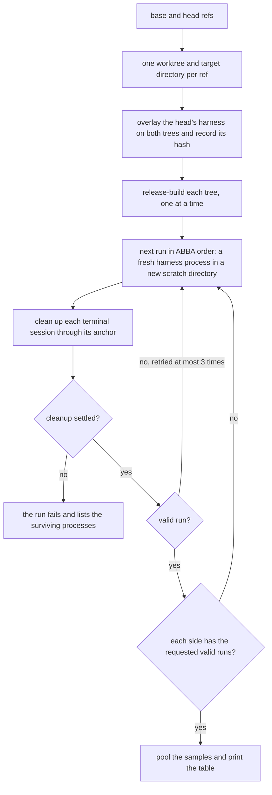

# Development and Release

[简体中文](Development-and-Release-zh-CN)

Before a PR, run the full local gate below. Before merging, require exact-head
platform CI; after merging, verify Wiki publication. Release tags need separate
approval and exact successful `main` CI. Local package commands are in
[Packaging](Packaging), and crate responsibilities in [Crate Reference](Crate-Reference).

Each topic has its own page:

- [Repository and Toolchain](Repository-and-Toolchain) — layout, toolchain, build entry points, code conventions, and native dependency maintenance
- [Local Gate](Local-Gate) — how the runner executes each gate step: process groups, Windows jobs, logs, timeouts, CI parity, and per-step notes
- [CI and Coverage](CI-and-Coverage) — pull-request and `main` CI jobs, what a green gate does not prove, and the workflow supply chain
- [Release Process](Release-Process) — the tag-driven release workflow, published assets, resolved-issue provenance, and manual checks
- [Wiki Publication](Wiki-Publication) — wiki source rules, the checker, and publication after every merge

## Local verification gate

`scripts/local-gate.py` is the repository's one runnable, host-aware gate
definition. Run it from the repository root, to the end:

```sh
python3 scripts/local-gate.py
```

<!-- local-gate:begin -->

| Step | Command | Local hosts | Class | Needs | CI jobs |
| --- | --- | --- | --- | --- | --- |
| `pty-close-baseline` | `cargo test -p sonicterm-app --lib pty_close_baseline -- --ignored --nocapture` | macOS, Windows, Linux | `local` | `rust`, `native` | `macos-core`, `windows-tests`, `linux-core` |
| `fmt` | `cargo fmt --all --check` | macOS, Windows, Linux | `local` | `rust` | `macos-core`, `windows-checks`, `linux-core` |
| `clippy` | `cargo clippy --workspace --all-targets -- -D warnings` | macOS, Windows, Linux | `local` | `rust`, `native` | `macos-core`, `windows-checks`, `linux-core` |
| `doc` | `RUSTDOCFLAGS="-D warnings" cargo doc --workspace --no-deps` | macOS, Windows, Linux | `local` | `rust`, `native` | `macos-core`, `windows-checks`, `linux-core` |
| `doc-resource-features` | `RUSTDOCFLAGS="-D warnings" cargo doc -p sonicterm-resource --all-features --no-deps` | macOS, Windows, Linux | `local` | `rust` | `linux-core` |
| `authored-comments` | `bash scripts/check-authored-rust-comments.sh` | macOS, Windows, Linux | `local` | `bash` | `macos-core`, `windows-checks`, `linux-core` |
| `script-identifiers` | `bash scripts/check-script-identifiers.sh` | macOS, Windows, Linux | `local` | `bash` | `macos-core`, `windows-checks`, `linux-core` |
| `no-raw-exit` | `bash scripts/check-no-raw-process-exit.sh` | macOS, Windows, Linux | `local` | `bash` | `macos-core`, `windows-checks`, `linux-core` |
| `rust-version` | `bash scripts/check-rust-version.sh` | macOS, Windows, Linux | `local` | `rust`, `bash` | `macos-core`, `windows-checks`, `linux-core` |
| `window-owner` | `bash scripts/check-window-owner-registration.sh` | macOS, Windows, Linux | `local` | `bash` | `macos-core`, `windows-checks`, `linux-core` |
| `workflow-supply-chain` | `bash scripts/check-workflow-supply-chain.sh` | macOS, Windows, Linux | `local` | `rust`, `bash` | `macos-core`, `windows-checks`, `linux-core` |
| `workspace-crates` | `bash scripts/check-workspace-crates.sh` | macOS, Windows, Linux | `local` | `rust`, `native`, `bash` | `macos-core`, `windows-tests`, `linux-core` |
| `doctests` | `cargo test --workspace --doc --no-fail-fast` | macOS, Windows, Linux | `local` | `rust`, `native` | `macos-core`, `windows-tests`, `linux-core` |
| `pty-feasibility` | `bash scripts/pty-backend-feasibility.sh --check` | macOS, Windows, Linux | `local` | `rust`, `bash` | `macos-core`, `windows-tests` |
| `resource-inventory` | `bash scripts/test-resource-inventory.sh` | macOS, Windows, Linux | `local` | `bash` | `macos-core`, `windows-tests` |
| `resource-baseline-tests` | `bash scripts/test-resource-baseline-evidence.sh` | macOS, Windows, Linux | `local` | `bash` | `macos-core`, `windows-tests` |
| `soak-harness` | `bash scripts/test-soak-harness.sh` | macOS, Windows, Linux | `local` | `bash` | `macos-core`, `windows-tests` |
| `linux-packages-tests` | `bash scripts/test-linux-packages.sh` | macOS, Windows, Linux | `local` | `bash` | `linux-core` |
| `release-assets-tests` | `bash scripts/test-release-assets.sh` | macOS, Windows, Linux | `local` | `rust`, `bash` | `linux-core` |
| `release-notes-tests` | `bash scripts/test-release-notes.sh` | macOS, Windows, Linux | `local` | `bash` | `macos-core`, `windows-tests`, `linux-core` |
| `wiki-publish-tests` | `bash scripts/test-wiki-publish.sh` | macOS, Windows, Linux | `local` | `rust`, `bash` | `macos-core`, `windows-tests`, `linux-core` |
| `logic-coverage` | `scripts/rust-logic-coverage.sh` | macOS, Linux | `local` | `rust`, `native`, `llvm-cov` | `macos-coverage` |
| `windows-warp-allocator` | `cargo test -p sonicterm-gpu --test windows_warp_allocator_baseline -- --nocapture` | Windows | `local` | `rust`, `native`, `warp` | `windows-tests` |
| `msi-validator-tests` | `.\scripts\validate-windows-msi_tests.ps1` | Windows | `local` | `pwsh` | `windows-tests` |
| `macos-selection-build` | `cargo build --locked -p sonicterm-app --example native_split_selection` | macOS | `local` | `rust`, `native` | `macos-smoke` |
| `macos-selection-smoke` | `python3 scripts/native-selection-smoke.py` | macOS | `local` | `rust`, `native` | `macos-smoke` |
| `macos-perf-smoke` | `python3 scripts/perf-compare.py --smoke` | macOS | `local` | `rust`, `native` | `macos-smoke` |
| `release-macos` | `cargo build --release -p sonicterm-mac` | macOS | `release` | `rust`, `native` | `macos-smoke` |
| `release-windows` | `cargo build --release -p sonicterm-windows` | Windows | `release` | `rust`, `native` | `windows-smoke` |
| `release-linux` | `cargo build --release -p sonicterm-linux` | Linux | `release` | `rust`, `native` | `linux-packages` |
| `windows-target` | `bash scripts/check-windows-target.sh` | macOS | `optional` | `rust`, `win-target`, `bash` | — |

Classes: `local` steps run by default; `release` steps run with `--with-release`; `optional` steps run with `--with-optional` and never run in CI.

Local hosts are the hosts where the runner selects a step. CI jobs are where CI runs it, which can cover fewer hosts, or none.

Needs:

- `rust`: the Rust toolchain from `rust-toolchain.toml`, with rustfmt and clippy.
- `native`: the platform's native build libraries: Cairo and pkg-config on macOS (`brew install cairo pkg-config`), Cairo from `scripts/setup-windows-cairo.ps1` on Windows, and the packages the `linux-core` job installs on Linux.
- `bash`: `bash` on `PATH`; on Windows, run the gate from Git Bash so Git's `bash` is found first.
- `pwsh`: PowerShell 7 (`pwsh`) on `PATH`.
- `llvm-cov`: `cargo-llvm-cov` at the `CARGO_LLVM_COV_VERSION` that `ci.yml` pins.
- `win-target`: the `x86_64-pc-windows-msvc` standard library (`rustup target add x86_64-pc-windows-msvc`).
- `warp`: a DX12 WARP adapter with allocator reporting.
- Every step also needs Git and Python 3 on `PATH`.

<!-- local-gate:end -->

[Local Gate](Local-Gate) describes how the runner executes these steps: process
groups and leftover detection, Windows job objects and preparation, output paths
and Git state, timeouts, and CI parity.

## Comparing performance

`scripts/perf-compare.py` measures two revisions with the same scenario harness
on one macOS host and prints a before/after table. Every performance pull
request posts that table, measured on its merge base and head; an estimate never
substitutes for it. Scenarios run only on macOS: Windows and Linux build the
harness, which prints `NOT_EXERCISED` there.

### Running a comparison

Run it from the repository root:

```sh
python3 scripts/perf-compare.py --base <ref> --head <ref> --scenario <ID|ID/variant|all>... --runs 5
```

`--scenario` takes several values: an ID such as `S4`, a variant such as
`S6/flood`, or `all`. S10 has two forms, `S10` and `S10/sync`, so the full
baseline runs `--scenario all S10/sync`. `--runs` is the number of valid runs
each side needs.

| Option | Effect |
| --- | --- |
| `--laps` | runs laps runs, which log at `debug` and so add the per-frame `render_timing` line; they form their own set and are never pooled with timed runs |
| `--alloc` | reports allocations per frame from `perf_scenarios_alloc`; timed runs never use the counting allocator |
| `--keep` | keeps the per-ref worktrees after the comparison; by default they are removed |
| `--out <dir>` | where `comparison.md` and the raw evidence go |

A full comparison runs for hours with measurement windows on screen. Keep the
host idle, on AC power, with the display awake and the screen unlocked, for
example by running the script under `caffeinate -dis`:

```sh
caffeinate -dis python3 scripts/perf-compare.py --base <ref> --head <ref> --scenario all S10/sync --runs 5
```

Display sleep, a screen saver, or a locked screen can cover the measurement
window, and an occlusion invalidates the run. The window floats above other
windows without taking keyboard focus, so the front application keeps it;
physical input to the window and focus theft also invalidate a run.

### How a comparison runs


```mermaid
flowchart TD
    refs["base and head refs"] --> trees["one worktree and target directory per ref"]
    trees --> overlay["overlay the head's harness on both trees and record its hash"]
    overlay --> build["release-build each tree, one at a time"]
    build --> run["next run in ABBA order: a fresh harness process in a new scratch directory"]
    run --> cleanup["clean up each terminal session through its anchor"]
    cleanup --> settled{"cleanup settled?"}
    settled -- no --> failed["the run fails and lists the surviving processes"]
    settled -- yes --> valid{"valid run?"}
    valid -- no, retried at most 3 times --> run
    valid -- yes --> enough{"each side has the requested valid runs?"}
    enough -- no --> run
    enough -- yes --> table["pool the samples and print the table"]
```

Each ref gets its own worktree and Cargo target directory, and the trees are
release-built one at a time. The head's harness, meaning the example directory
and its two `[[example]]` entries and never anything under `src/`, is overlaid on
both trees, so both sides run the same scenarios and measurement code.
`perf-compare.py` hashes that overlay and passes the hash to every run with
`--harness-hash`. Runs alternate between the sides in ABBA order until each side
has the requested valid runs; an invalid run is retried at most 3 times. Every
run is one fresh harness process in a new scratch directory, started with
`--managed`.

`perf-compare.py` judges focus from outside the measured process, sampling the
front application with `lsappinfo`. A run in which the harness became the front
application while another application was front is invalid. Activation is not
theft on a host with no front application, or on a GitHub Actions runner
(`GITHUB_ACTIONS=true`), which reports a front application but has no user whose
focus could be taken; the run's log notes it instead. After every
run, including one killed at its deadline, the script cleans up the processes of
each terminal session through a per-session anchor process. A shell leads its
own session, which a process-group kill does not reach, and the anchor keeps the
session id from being reused until every member has been signalled. A run whose
cleanup does not settle fails and lists the surviving processes.

### Isolation checks

A run must leave the user's SonicTerm state alone. Every comparison run and
every smoke case snapshots `~/.sonicterm` before and after the run, and a
sentinel file marks the run's start. A new, changed, or removed file there
invalidates the run, or fails the smoke. Changes that belong to another
SonicTerm instance are the exceptions:

- breadcrumb files named for another process: a breadcrumb file is
  `breadcrumbs/breadcrumbs-<session id>.log`, and the session id includes the id
  of the process that writes it;
- daily-log growth or log removals while another SonicTerm instance is running.

`.DS_Store` is ignored. The harness logs its scratch path at startup, so a log
misdirected into `~/.sonicterm` is recognized as the harness's own.

### Reading the table

The script prints the pull-request table, one row per scenario and metric, with
the columns Scenario, Metric (unit), Baseline, PR, and Change.

- Frame-level metrics, such as the interval between presents, pool the samples
  of all valid runs into one median and nearest-rank p95, and also show the
  min–max of the per-run medians and p95s.
- Run-level metrics, such as CPU time, show the median and min–max of the runs.
- The noise floor is that per-run spread, never the extremes of pooled frames; a
  change inside it is noise.
- `n/a` marks a field the base does not report, and `blocked` marks a scenario
  the base cannot build or run, with the error.
- Memory at a checkpoint comes from the latest `memory snapshot` line at or
  before it, plus a macOS `footprint` reading;
  [Logging](Logging#aggregate-snapshot-at-info) describes the line.
- S2 credits a keypress-to-present latency only when it can attribute the
  sample to one frame unambiguously, and reports the attribution coverage; read
  the latency together with its coverage.

Below the table come the host (machine, OS, GPU, display refresh rate and scale,
power source, and Low Power Mode), both SHAs, the harness hash, the commands,
and the raw-log paths; post them with the table.

### Scenarios

| ID | Workload |
| --- | --- |
| S1 | Idle for 60 s. |
| S2 | Type 200 characters at 10 per second; keypress-to-present latency with its attribution coverage. |
| S3 | `yes \| head -n 2000000`, then `cat` of a 50 MB file (throughput), then 60 s idle. |
| S4 | A visible `date` loop every 10 ms for 60 s. |
| S5 | The S4 loop in a background tab while the active tab idles. |
| S6 | A pointer sweep across the tab bar and the grid for 10 s. |
| S7 | Wheel scroll through the retained scrollback: 10,000 rows configured, 4,124 retained at 250×70 cells. |
| S8 | Search with dense `e` matches. |
| S9 | The first emoji and CJK glyphs in a fresh window. |
| S10 | Full-screen TUI redraw streams, played without DEC 2026 synchronized-output brackets. |
| S11 | An inline Sixel image, then a switch to a media-free tab and 120 s idle. |
| S12 | Three panes with full scrollback plus the warm window, then the window covered for 90 s and uncovered. |

| Variant | Workload |
| --- | --- |
| `S2/flood` | S3's flood runs in the first pane while S2's typing goes to a split pane's shell. |
| `S6/flood` | S6's pointer sweep during an S3 flood. |
| `S6/selection-drag` | On a screen of static dense text, a repeated press, move across the grid, and release for 10 s, inside the grid area only. |
| `S10/sync` | S10's redraw streams with each frame wrapped in `ESC[?2026h` … `ESC[?2026l`. |

Every scenario ends with an idle phase that lasts until at least 60 s after its
workload starts (5 s with `--short`, which the smoke uses), then a final memory
checkpoint. The memory figures come from that checkpoint, plus S11's and S12's
intermediate checkpoints. Shell workloads run from scripts that the harness
generates in the scratch directory. Generated content, such as scrollback text,
dense search text, emoji and CJK lines, TUI redraw streams, and the Sixel image,
comes from hashed fixtures, so both sides receive the same bytes.

### Scenario harness

The scenarios live in the opt-in example `perf_scenarios`
(`crates/sonicterm-app/examples/perf_scenarios/`), which `perf-compare.py` builds
and runs; no shipping binary contains it.

```text
perf_scenarios --list
perf_scenarios --run <ID> [--variant <name>] [--managed] [--short] [--laps] [--harness-hash <hex>] <scratch>
```

| Option | Effect |
| --- | --- |
| `--managed` | `perf-compare.py` drives the run: it validates and acknowledges each session record, answers checkpoint requests with a `footprint` reading, and cleans up the sessions afterwards. A run without the flag acknowledges its own records and is marked unmanaged, so it never enters a comparison. |
| `--short` | every hold lasts 5 s, and S3 floods `head -n 200000` and a 5 MB file; the smoke uses it |
| `--laps` | the run logs at `debug`, which adds the per-frame `render_timing` line; laps runs form their own set and are never pooled with timed runs |
| `--harness-hash <hex>` | the hash `perf-compare.py` computed over the overlaid harness, meaning the example directory plus its two `[[example]]` entries; the harness records it in `result.json`, and a mismatch is a schema failure |

- Each `--run` is one fresh process. `<scratch>` is a new directory under the
  OS temporary directory; config and logs go only there, and `HOME` is
  unchanged, so the shell and font discovery see the real host.
- The harness refuses an inherited `NO_COLOR` or `RUST_LOG` and exits 2 before
  any window opens: `NO_COLOR` changes terminal colors, and `RUST_LOG` replaces
  the configured log level.
- It drives the real `App` with synthetic input only. Typing is `Ime::Commit`,
  which skips the keymap and key encoding, so S2 measures neither; pointer and
  wheel events are synthetic; tabs, splits, and search open through
  `App::run_action`. The window floats above other windows without taking
  keyboard focus, and any physical input to it, an unrequested occlusion, or
  focus theft invalidates a run.

| Exit | Meaning |
| --- | --- |
| 0 | valid run |
| 2 | refusal, such as an inherited `NO_COLOR` or `RUST_LOG` |
| 3 | invalid run |
| 4 | harness timeout |
| 5 | scenario not supported by this tree; the table prints `blocked` |

Off macOS the harness prints `NOT_EXERCISED`. A second example,
`perf_scenarios_alloc`, runs the same scenarios under a counting global
allocator and reports allocations per frame. An allocator is fixed when a binary
is built, so timed runs never use it: they use `perf_scenarios`, which, like
every shipping binary, declares no global allocator.

### What CI measures

CI never runs a comparison: GUI timing on a shared runner is not deterministic
enough to stand in for one. The `macos-perf-smoke` gate step runs
`python3 scripts/perf-compare.py --smoke` in both `macos-smoke` legs. It builds
the current tree's harness in debug, runs three short cases with `--short` (S1,
S3, and an S1 killed like a run at its deadline as soon as its session starts),
and checks only the result schema, focus safety, the `~/.sonicterm` snapshot,
and that no process survives cleanup. It asserts no timing value, so a pass shows that the
tooling works, never that a change is faster. Windows and Linux CI build the
harness without running a scenario, and every platform runs
`scripts/perf-compare_tests.py` through `check-workflow-supply-chain.sh`.
[Local Gate](Local-Gate#performance-scenario-smoke) has the smoke's failure
rules.

## Coverage evidence and rebaselining

The per-crate floor is enforced only on the macOS arm64 CI runner, and CI tracks
the stable Rust channel, so a new stable release or runner image can move a
crate's measured coverage with no source change. Each coverage run therefore
keeps its evidence, and a floor changes only from a retained run's verified
evidence.

### Evidence artifact

The `macOS logic coverage` job uploads one artifact per run attempt whose
coverage step started, `rust-logic-coverage-evidence-<run id>-<attempt>`, after
success and after failure whenever the runner can still run cleanup steps. A
failure before that step (checkout, toolchain, cache, or the `cargo-llvm-cov`
install) leaves no artifact; its job log is the only diagnostic. The upload step
keeps 90-day retention (subject to repository policy) and
`if-no-files-found: error`, without a CI timeout override. The coverage step and
job also have no timeout overrides. A hung coverage step may consume the GitHub
Actions platform job limit and prevent evidence upload. Runner loss or cancellation
can also prevent upload. A run without the artifact is unavailable evidence:
never a complete measurement, and
never permission to rebaseline.

The artifact has this layout:

```text
rust-logic-coverage-evidence-<run id>-<attempt>/
  coverage-provenance.json
  measurement/coverage-summary.json
  measurement/workspace-metadata.json
```

The job uploads `target/rust-logic-coverage-evidence`. Staging and the checkout
pin live in `target/rust-logic-coverage-work/`, which is never uploaded.

### Contents and completeness

`scripts/rust-logic-coverage.sh` runs the phases `self-test`, `toolchain`,
`instrumented-tests`, `report`, `inventory`, and `publish`, then the checks
`subset-gate` (the 80% subset gate) and `floor`. The `self-test` phase first
pins the checkout once, before any record, in `checkout-pin.json` in the work
directory: the commit, its tree, the tree's path map, and the uncommitted
changes. Before each phase the script rewrites `coverage-provenance.json` as a
write-ahead record, and it adds the exit status when a phase fails, so a run
killed inside a phase still names where it stopped (`interrupted before the
phase finished`). A failure to write a record keeps the previous one. Before
`subset-gate` begins, that record marks the run incomplete; during `subset-gate`
or `floor`, it can describe a complete measurement whose check reads
`not finished`. When no record can be written at all, for
example because the provenance writer itself fails, the exit trap writes a
minimal record: `measurement: incomplete`, `failed_phase`, and a `failure` that
says no provenance record could be written.

The report and inventory are written into a staging directory. In the `publish`
phase, the record first checks that `HEAD`, its tree, and the list of
uncommitted coverage-relevant paths still equal the pin:

- **Drift:** the measurement is incomplete (`failed_phase: publish`), the record
  names the drift in `failure` and in `checkout_drift`, nothing is published,
  and the run fails with exit status 3. A build or a test that changes a clean
  tracked coverage-relevant file, or leaves an untracked one, before `publish`
  adds a path to that list, so it is drift too.
- **No drift:** one rename moves the staging directory into place as
  `measurement/`, and only then is the complete record written. That write is
  atomic: a hidden temporary file, which upload-artifact skips by default, then
  a rename. The subset gate and the floor then judge the published measurement,
  so a failing gate or floor keeps its files and the job keeps its failing
  status.

The check is bounded. It compares `HEAD`, its tree, and the list of
uncommitted coverage-relevant path names with the pin, not file bytes or
status, so a further change to a path already listed at the pin is not seen;
`--update-baseline` refuses a record whose `worktree_changes` is not empty in
any case. A change made and reverted between the pin and publication is not
seen, and the interval between the check and the rename is not checked.

The files appear together or not at all, and only a complete record whose
digests match vouches for them. An artifact whose record is not complete is
unavailable evidence, whatever files it holds. A run killed after the rename, or
inside the complete record's write, leaves both files beside the previous
record, which reads as interrupted in `publish`; that is unavailable evidence.

- **Complete:** the record says `measurement: complete`, carries the SHA-256
  digests of both files, and gives each check as `exit status N`,
  `not finished`, or `not run`.
- **Incomplete:** the record says `measurement: incomplete` with `failed_phase`
  and `failure`, and carries no digests. Incomplete evidence never initializes
  or changes a floor.

Every record also carries `target`, `runner` (`ImageOS/RUNNER_ARCH`),
`image_version`, `rustc_version` and the full `rustc_verbose` (`rustc -vV`),
`cargo_llvm_cov`, `repository`, `workflow`, `run_id`, `run_attempt`, `job`,
`event`, `ref`, `run_url`, `artifact`, `pull_request_head`, `report_sha256`,
`inventory_sha256`, and `checkout_drift`: the drift the `publish` check found,
as a list, and null in every other phase. `commit` and `tree` (GitHub's test
merge on a pull request), `worktree_changes`, and `tree_entries` (every path of
the pinned tree with its mode and object id) are the pinned values; nothing
re-reads them later.

### Retrieval and verification

Download the artifact from GitHub by run ID into a directory outside the
checkout, where an untracked file would count as an uncommitted change. Confirm
through the API that the run attempt matches the record, then bind the record's
`commit` to the run:

```bash
run=RUN_ID attempt=ATTEMPT
dir="$(mktemp -d)"
gh run download "$run" -R D0n9X1n/SonicTerm \
  -n "rust-logic-coverage-evidence-$run-$attempt" -D "$dir"
gh api "repos/D0n9X1n/SonicTerm/actions/runs/$run/attempts/$attempt" \
  --jq '[.repository.full_name, .path, .run_attempt, .event, .status, .head_sha] | @tsv'
gh api "repos/D0n9X1n/SonicTerm/actions/runs/$run/attempts/$attempt/jobs?per_page=100" \
  --jq '.jobs[] | select(.name == "macOS logic coverage") | [.conclusion, .head_sha] | @tsv'
python3 -c 'import json, sys; record = json.load(open(sys.argv[1])); record.pop("tree_entries"); print(json.dumps(record, indent=2))' \
  "$dir/coverage-provenance.json"
commit="$(python3 -c 'import json, sys; print(json.load(open(sys.argv[1]))["commit"])' "$dir/coverage-provenance.json")"
gh api "repos/D0n9X1n/SonicTerm/git/commits/$commit" \
  --jq '[.tree.sha, (.parents | map(.sha) | join(" "))] | @tsv'
```

When the run published them, the report and inventory are in
`$dir/measurement/`. Continue only when every comparison holds:

- `.repository.full_name` equals `repository`, and `.path` equals `workflow`,
  `.github/workflows/ci.yml`.
- `.run_attempt` equals `run_attempt`, and the artifact name equals `artifact`.
- The attempt's `.status` is `completed`, and the `macOS logic coverage` job
  (the record's `job`, `macos-coverage`) exists with conclusion `success` when
  both checks read `exit status 0`, and `failure` otherwise.
- The record says `measurement: complete`.
- On a push run, `commit` equals the attempt's `.head_sha`. On a pull-request
  run, `commit` is GitHub's test-merge commit, and `.head_sha` equals
  `pull_request_head`.
- In both cases the commit's `.tree.sha` equals the record's `tree`, and on a
  pull request its parents include the record's `pull_request_head`.

A mismatch, a missing artifact, or an incomplete record makes the run
unavailable evidence. The offline check in `--update-baseline` proves only that
the record is self-consistent: the files match its digests, and its path map
hashes to its `tree`. These API checks are what bind the record to its run, its
commit, and its tree.

### Rebaselining procedure

1. Retrieve and verify the artifact as above.
2. Check out a tree whose coverage-relevant content equals the measured tree:
   the measured commit for a push run, or for a pull-request run the head once
   it is up to date with its base, when its tree equals the test merge's.
3. Update the floor, per crate under the same-host rule:

   ```bash
   python3 scripts/coverage-floor.py --update-baseline \
     --report "$dir/measurement/coverage-summary.json" \
     --metadata "$dir/measurement/workspace-metadata.json" \
     --baseline scripts/coverage-baseline.json --target aarch64-apple-darwin \
     --provenance "$dir/coverage-provenance.json" \
     --crate NAME --reason "CAUSE"
   ```

   For a host migration, run the same command without `--crate`. A full update
   may move the baseline to the record's host, and the reason it writes starts
   `Host migration from <old target> on <old runner> to <new target> on <new runner>.`
4. The tool appends the run, attempt, job, artifact, host, image, toolchain, and
   commit to the stated reason. The stated reason must give the cause: a
   toolchain or image change can cause a DROP, but that alone does not justify
   lowering a floor.
5. Review and commit the diff like any other floor change.

### Refusals

The checker works offline and checks integrity; each refusal names what
differs. `--update-baseline` refuses:

- a change to a baseline that names a CI host without `--provenance`; only a
  `--runner local` baseline, which CI never enforces, is written without one;
- an incomplete record, naming the failed phase, or a record with a missing
  field;
- a record that names checkout drift;
- `checks` that do not hold exactly the `subset-gate` and `floor` entries, each
  with a status the gate script writes (`exit status N`, `not finished`, or
  `not run`), in a pair a run can produce;
- a `commit`, `tree`, or `pull_request_head` that is not a full lowercase object
  ID in the checkout's object format (`git rev-parse --show-object-format`);
- `tree_entries` that do not hash to `tree`: the tool rebuilds the nested Git
  trees in Git's name order, with modes `100644`, `100755`, `120000`, and
  `160000`, and names both IDs;
- a report or inventory whose SHA-256 differs from the record, or a report whose
  tool differs from `cargo_llvm_cov`;
- a `--target` or `--runner` that conflicts with the record;
- a record measured outside CI or by another job or workflow, or one whose
  artifact name, `rustc -vV` host, or `rustc_version` contradicts its other
  fields;
- a measured tree whose coverage-relevant source or policy differs from this
  checkout's `HEAD`, uncommitted changes in the measured checkout, uncommitted
  coverage-relevant changes in this checkout, or a baseline outside a Git
  checkout.

Coverage-relevant means every tracked path except
`scripts/coverage-baseline.json`, Markdown files, and the `wiki/` and `docs/`
trees, so only a tree that differs in the baseline or documentation is accepted.
These offline checks prove only that the record is self-consistent, not where it
came from; the API checks under Retrieval and verification bind it to its run,
its commit, and its tree.

### DROP findings and proposals

A DROP still fails CI and never produces a proposal of its own; a proposal that
another finding prints in the same run keeps the dropped floor. In CI, the DROP
message names the run's evidence artifact, the run URL, and this section. Other
findings can still print a proposed baseline, but only as a preview: floor
numbers change only through the procedure above, while not-measured
declarations and their reasons stay reviewed hand edits.
