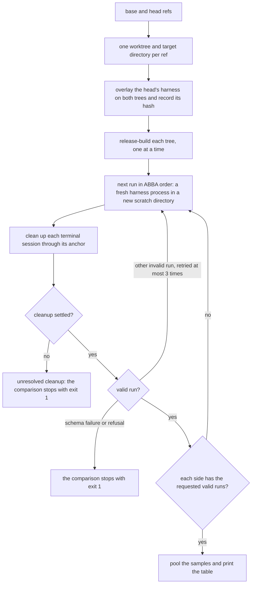
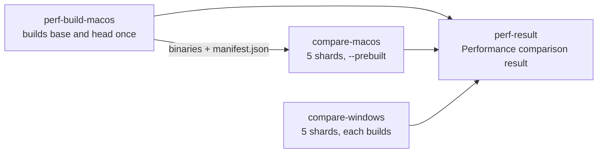

# Development and Release

[简体中文](Development-and-Release-zh-CN)

Before a PR, run the full local gate below. Before merging, require exact-head
platform CI; after merging, verify Wiki publication. Release tags need separate
approval and exact successful `main` CI. Local package commands are in
[Packaging](Packaging), and crate responsibilities in [Crate Reference](Crate-Reference).

Each topic has its own page:

- [Repository and Toolchain](Repository-and-Toolchain) — layout, toolchain, build entry points, code conventions, and native dependency maintenance
- [Local Gate](Local-Gate) — how the runner executes each gate step: process groups, Windows jobs, logs, timeouts, CI parity, and per-step notes
- [CI and Coverage](CI-and-Coverage) — pull-request and `main` CI jobs, what a green gate does not prove, and the workflow supply chain
- [Release Process](Release-Process) — the tag-driven release workflow, published assets, resolved-issue provenance, and manual checks
- [Wiki Publication](Wiki-Publication) — wiki source rules, the checker, and publication after every merge

## Local verification gate

`scripts/local-gate.py` is the repository's one runnable, host-aware gate
definition. Run it from the repository root, to the end:

```sh
python3 scripts/local-gate.py
```

<!-- local-gate:begin -->

| Step | Command | Local hosts | Class | Needs | CI jobs |
| --- | --- | --- | --- | --- | --- |
| `pty-close-baseline` | `cargo test -p sonicterm-app --lib pty_close_baseline -- --ignored --nocapture` | macOS, Windows, Linux | `local` | `rust`, `native` | `macos-core`, `windows-tests`, `linux-core` |
| `fmt` | `cargo fmt --all --check` | macOS, Windows, Linux | `local` | `rust` | `macos-core`, `windows-checks`, `linux-core` |
| `clippy` | `cargo clippy --workspace --all-targets -- -D warnings` | macOS, Windows, Linux | `local` | `rust`, `native` | `macos-core`, `windows-checks`, `linux-core` |
| `perf-scenarios-counters-clippy` | `cargo clippy --locked -p sonicterm-app --example perf_scenarios --features perf-counters,perf-hook-checkpoint-memory -- -D warnings` | macOS, Windows, Linux | `local` | `rust`, `native` | `macos-core`, `windows-checks`, `linux-core` |
| `perf-scenarios-frame-texture-clippy` | `cargo clippy --locked -p sonicterm-app --example perf_scenarios --features perf-frame-texture -- -D warnings` | macOS, Windows, Linux | `local` | `rust`, `native` | `macos-core`, `windows-checks`, `linux-core` |
| `doc` | `RUSTDOCFLAGS="-D warnings" cargo doc --workspace --no-deps` | macOS, Windows, Linux | `local` | `rust`, `native` | `macos-core`, `windows-checks`, `linux-core` |
| `doc-resource-features` | `RUSTDOCFLAGS="-D warnings" cargo doc -p sonicterm-resource --all-features --no-deps` | macOS, Windows, Linux | `local` | `rust` | `linux-core` |
| `authored-comments` | `bash scripts/check-authored-rust-comments.sh` | macOS, Windows, Linux | `local` | `bash` | `macos-core`, `windows-checks`, `linux-core` |
| `script-identifiers` | `bash scripts/check-script-identifiers.sh` | macOS, Windows, Linux | `local` | `bash` | `macos-core`, `windows-checks`, `linux-core` |
| `no-raw-exit` | `bash scripts/check-no-raw-process-exit.sh` | macOS, Windows, Linux | `local` | `bash` | `macos-core`, `windows-checks`, `linux-core` |
| `rust-version` | `bash scripts/check-rust-version.sh` | macOS, Windows, Linux | `local` | `rust`, `bash` | `macos-core`, `windows-checks`, `linux-core` |
| `window-owner` | `bash scripts/check-window-owner-registration.sh` | macOS, Windows, Linux | `local` | `bash` | `macos-core`, `windows-checks`, `linux-core` |
| `workflow-supply-chain` | `bash scripts/check-workflow-supply-chain.sh` | macOS, Windows, Linux | `local` | `rust`, `bash` | `macos-core`, `windows-checks`, `linux-core` |
| `workspace-crates` | `bash scripts/check-workspace-crates.sh` | macOS, Windows, Linux | `local` | `rust`, `native`, `bash` | `macos-core`, `windows-tests`, `linux-core` |
| `doctests` | `cargo test --workspace --doc --no-fail-fast` | macOS, Windows, Linux | `local` | `rust`, `native` | `macos-core`, `windows-tests`, `linux-core` |
| `perf-scenarios-tests` | `cargo test --locked -p sonicterm-app --example perf_scenarios` | macOS, Windows, Linux | `local` | `rust`, `native` | `macos-core`, `windows-tests`, `linux-core` |
| `perf-scenarios-counters-tests` | `cargo test --locked -p sonicterm-app --example perf_scenarios --features perf-counters,perf-hook-checkpoint-memory` | macOS, Windows, Linux | `local` | `rust`, `native` | `macos-core`, `windows-tests`, `linux-core` |
| `perf-scenarios-frame-texture-tests` | `cargo test --locked -p sonicterm-app --example perf_scenarios --features perf-frame-texture` | macOS, Windows, Linux | `local` | `rust`, `native` | `macos-core`, `windows-tests`, `linux-core` |
| `pty-feasibility` | `bash scripts/pty-backend-feasibility.sh --check` | macOS, Windows, Linux | `local` | `rust`, `bash` | `macos-core`, `windows-tests` |
| `resource-inventory` | `bash scripts/test-resource-inventory.sh` | macOS, Windows, Linux | `local` | `bash` | `macos-core`, `windows-tests` |
| `resource-baseline-tests` | `bash scripts/test-resource-baseline-evidence.sh` | macOS, Windows, Linux | `local` | `bash` | `macos-core`, `windows-tests` |
| `soak-harness` | `bash scripts/test-soak-harness.sh` | macOS, Windows, Linux | `local` | `bash` | `macos-core`, `windows-tests` |
| `linux-packages-tests` | `bash scripts/test-linux-packages.sh` | macOS, Windows, Linux | `local` | `bash` | `linux-core` |
| `release-assets-tests` | `bash scripts/test-release-assets.sh` | macOS, Windows, Linux | `local` | `rust`, `bash` | `linux-core` |
| `release-notes-tests` | `bash scripts/test-release-notes.sh` | macOS, Windows, Linux | `local` | `bash` | `macos-core`, `windows-tests`, `linux-core` |
| `wiki-publish-tests` | `bash scripts/test-wiki-publish.sh` | macOS, Windows, Linux | `local` | `rust`, `bash` | `macos-core`, `windows-tests`, `linux-core` |
| `logic-coverage` | `scripts/rust-logic-coverage.sh` | macOS, Linux | `local` | `rust`, `native`, `llvm-cov` | `macos-coverage` |
| `windows-warp-allocator` | `cargo test -p sonicterm-gpu --test windows_warp_allocator_baseline -- --nocapture` | Windows | `local` | `rust`, `native`, `warp` | `windows-tests` |
| `msi-validator-tests` | `.\scripts\validate-windows-msi_tests.ps1` | Windows | `local` | `pwsh` | `windows-tests` |
| `windows-perf-build` | `cargo build --locked -p sonicterm-app --example perf_scenarios` | Windows | `local` | `rust`, `native` | `windows-tests` |
| `windows-perf-smoke` | `python scripts/perf-compare.py --smoke` | Windows | `local` | `rust`, `native` | `windows-tests` |
| `macos-selection-build` | `cargo build --locked -p sonicterm-app --example native_split_selection` | macOS | `local` | `rust`, `native` | `macos-smoke` |
| `macos-selection-smoke` | `python3 scripts/native-selection-smoke.py` | macOS | `local` | `rust`, `native` | `macos-smoke` |
| `macos-perf-smoke` | `python3 scripts/perf-compare.py --smoke` | macOS | `local` | `rust`, `native` | `macos-smoke` |
| `release-macos` | `cargo build --release -p sonicterm-mac` | macOS | `release` | `rust`, `native` | `macos-smoke` |
| `release-windows` | `cargo build --release -p sonicterm-windows` | Windows | `release` | `rust`, `native` | `windows-smoke` |
| `release-linux` | `cargo build --release -p sonicterm-linux` | Linux | `release` | `rust`, `native` | `linux-packages` |
| `windows-target` | `bash scripts/check-windows-target.sh` | macOS | `optional` | `rust`, `win-target`, `bash` | — |

Classes: `local` steps run by default; `release` steps run with `--with-release`; `optional` steps run with `--with-optional` and never run in CI.

Local hosts are the hosts where the runner selects a step. CI jobs are where CI runs it, which can cover fewer hosts, or none.

Needs:

- `rust`: the Rust toolchain from `rust-toolchain.toml`, with rustfmt and clippy.
- `native`: the platform's native build libraries: Cairo and pkg-config on macOS (`brew install cairo pkg-config`), Cairo from `scripts/setup-windows-cairo.ps1` on Windows, and the packages the `linux-core` job installs on Linux.
- `bash`: `bash` on `PATH`; on Windows, run the gate from Git Bash so Git's `bash` is found first.
- `pwsh`: PowerShell 7 (`pwsh`) on `PATH`.
- `llvm-cov`: `cargo-llvm-cov` at the `CARGO_LLVM_COV_VERSION` that `ci.yml` pins.
- `win-target`: the `x86_64-pc-windows-msvc` standard library (`rustup target add x86_64-pc-windows-msvc`).
- `warp`: a DX12 WARP adapter with allocator reporting.
- Every step also needs Git and Python 3 on `PATH`.

<!-- local-gate:end -->

[Local Gate](Local-Gate) describes how the runner executes these steps: process
groups and leftover detection, Windows job objects and preparation, output paths
and Git state, timeouts, and CI parity.

## Comparing performance

`scripts/perf-compare.py` measures two revisions with the same scenario harness
on one macOS or Windows host and prints a before/after table. Every performance pull
request posts that table, measured on its merge base and head; an estimate never
substitutes for it. The table is measured in CI, by the `Performance comparison`
workflow on a GitHub-hosted runner ([What CI measures](#what-ci-measures)), never
on a developer's Mac: a desk is in use, and its input, focus changes and load
invalidate runs or widen the noise. A local run only shows that the tooling
builds and works. Scenarios run on macOS and Windows; Linux builds the harness,
which prints `NOT_EXERCISED` there. CI's Windows table measures the
software-rendering path; numbers for a hardware GPU come from a local
comparison ([Windows comparisons](#windows-comparisons)).

### Running a comparison

Run it from the repository root:

```sh
python3 scripts/perf-compare.py --base <ref> --head <ref> --scenario <ID|ID/variant|all>... --runs 5
```

`--scenario` takes several values: an ID such as `S4`, a variant such as
`S6/flood`, or `all`. S10 has two forms, `S10` and `S10/sync`, so the full
baseline runs `--scenario all S10/sync`. `--runs` is the number of valid runs
each side needs.

| Option | Effect |
| --- | --- |
| `--short` | runs every scenario with the harness's `--short` holds (5 s) and smaller floods, for a quick comparison; the table's details say so |
| `--laps` | runs laps runs, which log at `debug` and so add the per-frame `render_timing` line; they form their own set and are never pooled with timed runs |
| `--laps-scenario ID[/variant]` | runs the separate laps set for this variant only (a bare ID is its `default`); repeatable; an error with `--laps`, or when the variant is not selected by `--scenario` or not listed |
| `--laps-runs N` | valid runs of the laps set (default: `--runs`); needs `--laps` or `--laps-scenario`; under `--short` a `run_caps` cap still applies |
| `--alloc` | reports allocations per frame from `perf_scenarios_alloc`; timed runs never use the counting allocator |
| `--counters` | when the head's `sonicterm-app` declares the `perf-counters` feature, builds each ref that declares it with that feature and runs a counters set with the frame counters forced on (the harness's `--counters`) after the timed and laps sets, on the head and on a base that declares the feature; it is never pooled with them. A head without the feature skips the set, and the table says so |
| `--counters-runs N` | valid runs of the counters set (default: `--runs`); needs `--counters` |
| `--keep` | keeps the per-ref worktrees after the comparison; by default they are removed |
| `--out <dir>` | where `comparison.md` and the raw evidence go |
| `--require-base` | holds the base to the head's standard: a base that cannot build, `--list` or fill every set's valid runs fails the comparison (exit 1), and `comparison.md` opens with `**Incomplete comparison:**` naming each gap; a counters set on a base without `perf-counters` still reads `n/a`. Every CI comparison passes it |
| `--build-only <dir>` | builds both refs once, lists both binaries, copies them to `<dir>/base/` and `<dir>/head/` with `manifest.json`, prints `manifest_sha256=<hex>` and measures nothing; needs `--require-base` and takes no run, counters, `--keep` or `--out` option (`--alloc` adds the alloc example); the build logs go to `<dir>/build-logs` |
| `--prebuilt <dir>` | measures the binaries a `--build-only` run published instead of building; needs `--prebuilt-run-id`, `--prebuilt-attempt` and `--prebuilt-manifest-sha256`, and refuses any manifest or binary that disagrees with the job ([What CI measures](#what-ci-measures)) |

A local run builds both refs itself. Without `--require-base` it stays
lenient: a base that cannot build or run is reported `blocked` and the head is
still measured.

A laps run also logs the font crate's `font operation` timing records, and the
laps table adds `fallback_receive` rows for each laps variant: the waits inside
and outside the run's examined slow dispatches (count, sum and max in ms), and a
verdict per side. Each phase records its 64 longest dispatches with their start
and end (`slow_dispatches`) and `dispatch_count`; the examined ones are those at
or above the phase's p95 of `dispatch_ms`. A wait `[t − elapsed_ms, t]`, `t`
being its log stamp, matches a slow dispatch of the same run and phase when it
lies inside the dispatch widened by the stamp's resolution plus 1 ms. A side is
`supported` when one of its runs has an examined dispatch whose matched waits
sum to at least half its duration; otherwise it is `inconclusive`, for example
with no waits, no log, `unparsed` records or incomplete coverage (more
dispatches at or above p95 than were recorded). There is no refuted verdict.
The verdict cell shows the coverage, `unparsed` (malformed `fallback_receive`
records) and the `unmatched_enter` and `unmatched_return` pairing counts, which
never change the verdict.

Under `--short`, a variant whose harness `--list` entry declares a cap
(`run_caps`) takes min(requested, cap) valid runs per side in every set (timed,
laps, counters and alloc); its rows read `(runs N of M)`, and `comparison.md`
lists the capped variants. A release comparison is uncapped. A tree that
declares the `perf-frame-texture` marker feature builds with it in building,
`--build-only` and `--prebuilt` comparisons alike; the manifest records it, and
a mismatch is refused.

A full comparison runs for hours with measurement windows on screen. To run one
locally, keep the host idle, on AC power, with the display awake and the screen unlocked, for
example by running the script under `caffeinate -dis`:

```sh
caffeinate -dis python3 scripts/perf-compare.py --base <ref> --head <ref> --scenario all S10/sync --runs 5
```

Display sleep, a screen saver, or a locked screen can cover the measurement
window, and an occlusion invalidates the run. The window floats above other
windows without taking keyboard focus, so the front application keeps it;
physical input to the window and focus theft also invalidate a run.

Every local run, a comparison or the smoke, also needs the main display, where
the harness opens its window, to show a desktop Space, not a full-screen app.
With a full-screen app there, the harness window opens on the hidden desktop
Space and presents no frame. A window that opens already hidden sends no
occlusion event, because winit reports occlusion only when it changes. A 10 s
bound catches it instead: when the main window presents no frame within 10 s of
opening, the harness ends the run as invalid (exit 3). The reason says that no
frame presented within 10 s, so the run is treated as a suspected occlusion,
likely caused by a full-screen app on its display; a missing frame does not
prove an occlusion. A comparison retries the run; the smoke retries it as an
occlusion and reports `BLOCKED` when no valid run results.

### Windows comparisons

On Windows, run the same command with `python` from Git Bash or PowerShell. The
`Performance comparison` workflow's Windows legs run on a GitHub-hosted runner
with no GPU, so their table measures the software-rendering path ([What CI
measures](#what-ci-measures)). Numbers for a hardware GPU come from a
comparison on an idle Windows host with no user input during the runs, and the
PR names that host; the Windows CI smoke checks the tooling only
([Windows](Local-Gate#windows)). Keep the display awake and the session unlocked
for the whole comparison. A Windows host is compared only with itself: a run on
another adapter or presenter than its set's first valid run makes the pair
invalid.

What differs from macOS:

- **Custody.** Each run executes in its own Windows job object, not a process
  group; a job member still alive after the harness exits fails the run, except
  in the deadline case, whose job must be verified empty after the job ends it.
- **Focus.** The script samples the foreground window. The first application in
  the foreground is the baseline, and any later change of the foreground process
  invalidates the run; on a GitHub-hosted runner, with no user session, a change
  is only recorded in `outcome.json`'s `foreground_changes`. For the whole run,
  from before its window opens, the harness locks foreground changes with
  `LockSetForegroundWindow`, so its window opens without taking focus. No other
  application can take the foreground while the lock is held; pressing Alt or
  clicking another window ends it. A failed lock is recorded in the result's
  `notes`. A pointer at rest under the opening window is not input: a native
  pointer move that is the window's first and arrives before GO, or that is at
  the last native position, is dropped and counted in `result.json`'s
  `native_cursor_rest_events_dropped`. Any movement still invalidates the run,
  as does a first native move after GO: the pointer entered the window then.
- **Grid.** The window opens at the grid its display and scale allow, such as
  281x58 at 175% scale, so a run measures any grid. As on macOS, both sides of a
  pair must share one grid, and the table's `grid` row records each side's grid.
- **Variants.** S1, S5 and S11 have `gdi` and `wgpu` variants, which set
  `[appearance].software_render_mode` to `force` and `off`. On a CPU adapter the
  default presents through GDI, so only `wgpu` measures wgpu presentation. A
  `gdi` run that did not present through GDI, or a `wgpu` run that degraded, is
  `blocked`. S1's `role-exit` variant is for the smoke.
- **Table.** Each scenario gets a `presenter` row naming the presenter and
  adapter. S12's uncover and memory-released-while-covered rows read `n/a`,
  because Windows reports no occlusion, and every checkpoint's footprint row
  reads `n/a`, because Windows has no `footprint`.
- **Delivery.** Before its measured runs, a comparison replays S3, S9, S10 and
  S11 through ConPTY with the head build's `--capture-delivery`, which writes
  `delivery.json`. Each check becomes a `delivery:` row shared by both sides; a
  failed check, or a record that does not agree with the replay's exit code,
  blocks every set of that scenario. A replay whose cleanup is unresolved, such
  as a job whose custody is not verified, stops the comparison with exit 1, as a
  measured run's does.
- **Delivery retry.** A replay gets up to 3 attempts, and only one failure is
  retried: the step ended `FAIL` with exit 5 and verified teardown, the record is
  schema 2, and its only failed check is `sync brackets`, whose `unseen`,
  `brackets` and `unseen_markers` fields agree with its detail and show at least
  one frame marker never found, with no bracket at all in the `default` variant.
  The attempt must also have kept its delivered text, readable, within the
  64 MiB cap and as long as the record's `bytes_kept`. Before a schema 2 S10
  record is admitted or retried it is validated whole: `schema_version` is the
  integer 2, `unseen` and `brackets` are non-negative integers, `unseen_markers`
  lists `min(unseen, 8)` strings, the detail is exactly `enclosed N, empty pair
  ahead N, absent N[, never painted N]` with numbers that agree with those
  fields, and the verdict follows from them; a malformed record blocks.
  Every other failure blocks on the attempt where it happens: another or a
  second failed check, a missing, malformed or schema 1 record, a record that
  disagrees with the step, a crash, a timeout or any other exit. Unresolved
  cleanup on any attempt still stops the comparison. Each attempt runs in a fresh
  scratch with the same deadline and keeps its record, the delivered text it
  classified and its log in the comparison's `delivery/` directory, as
  `delivery-<ID>-<variant>-attempt<N>.json` and `.txt`, and
  `NN-delivery-<ID>-<variant>-attempt<N>.log`. The row's note always
  states the attempt count, such as `passed on attempt 2 of 3`, and each retried
  attempt's detail with its missing markers. This is a rule for admitting a
  measurement, not proof that delivery has no defect: an intermittent delivery
  fault can pass a later attempt, and the disclosed attempts and kept evidence
  are where it shows.
- **Run checks.** A Windows run also judges its own delivery. A role pane whose
  program exits before the run finishes makes the run invalid, naming the pane.
  S11 is `blocked` when its image does not register within 10 s of its phase, or
  registers but the image atlas never grows. S3 is `blocked` unless exactly the
  rows its planned lines fill at the pane's width, a wrapped line counting each of
  its rows, lie between its READY row and its sentinel's row, and the retained
  lines above the sentinel, joined across wraps, match the end of `bulk.txt`. S9
  is `blocked` when the
  grid lacks a wide token its fixture printed. When no frame presents within
  10 s of the window opening, the reason names a locked or disconnected session
  as the likely cause.

### How a comparison runs


```mermaid
flowchart TD
    refs["base and head refs"] --> trees["one worktree and target directory per ref"]
    trees --> overlay["overlay the head's harness on both trees and record its hash"]
    overlay --> build["release-build each tree, one at a time"]
    build --> run["next run in ABBA order: a fresh harness process in a new scratch directory"]
    run --> cleanup["clean up each terminal session through its anchor"]
    cleanup --> settled{"cleanup settled?"}
    settled -- no --> failed["unresolved cleanup: the comparison stops with exit 1"]
    settled -- yes --> valid{"valid run?"}
    valid -- schema failure or refusal --> stopped["the comparison stops with exit 1"]
    valid -- other invalid run, retried at most 3 times --> run
    valid -- yes --> enough{"each side has the requested valid runs?"}
    enough -- no --> run
    enough -- yes --> table["pool the samples and print the table"]
```

Each ref gets its own worktree and Cargo target directory, and the trees are
release-built one at a time. The head's harness, meaning the example directory
and its two `[[example]]` entries and never anything under `src/`, is overlaid on
both trees, so both sides run the same scenarios and measurement code.
`perf-compare.py` hashes that overlay and passes the hash to every run with
`--harness-hash`. Runs alternate between the sides in ABBA order until each side
has the requested valid runs. Every run is one fresh harness process in a new
scratch directory, started with `--managed` and with its side's worktree as its
working directory, so the App loads that ref's tracked fonts.

Three kinds of run stop the comparison at once with exit 1 and are never
retried: an unresolved cleanup, a schema failure, and a refusal.
`classify_outcome` in `perf-compare.py` checks for them before any retryable
reason, in this order, so a run that has one stops the comparison even when it
also has a retryable problem:

1. an unresolved cleanup that evidence other than the result shows, such as a
   `run_step` deadline or Ctrl-C, described below;
2. a schema failure: a `result.json` that cannot be parsed or does not match the
   result schema, a result whose `managed` is not true, or one whose harness hash
   is not the hash the script passed. This holds however the harness ended,
   including a harness timeout (exit 4) and a block (exit 5). Once `run_step` has
   reported PASS with exit 0, so the exit can be trusted, a missing `result.json`
   (unless the harness printed `NOT_EXERCISED`) or a result whose status is not
   `valid` is one too;
3. an unresolved cleanup that the result shows: a `finish_session` that did not
   settle, whatever the exit;
4. a refusal: the harness refused the run (exit 2), for example over an unsafe
   inherited setting or a scratch directory that already exists.

Every other invalid run is retried, at most 3 times. That includes a run whose
harness exits 0 while `run_step` reports a status other than PASS, TIMEOUT, or
INTERRUPTED, and one whose harness exits 4 at its own deadline, its scenario's
timeout. A `run_step` deadline (status TIMEOUT) or a `run_step` interrupted by
Ctrl-C (status INTERRUPTED), by contrast, is an unresolved cleanup: whatever the
harness's exit, the comparison stops with exit 1 instead of starting its next
attempt. `run_step`'s deadline is 30 s past the harness's own deadline, at or
just before the point where the harness's watchdog would abort the harness.

The harness reports the display that shows its window: its name, refresh rate,
and scale, not its resolution. Each run's display must match the comparison's
reference display in every field both reported; a field that either left null is
not checked, and the reference takes a field it lacked from a later run. A
mismatch makes the run invalid, and the run is retried; the reason names both
displays and the fields that differ.

`perf-compare.py` judges focus from outside the measured process, sampling the
front application with `lsappinfo`. A run in which the harness became the front
application while another application was front is invalid, and so is a run
with a failed sample. Activation is not theft on a host with no front
application. On a GitHub-hosted runner (`GITHUB_ACTIONS=true` and
`RUNNER_ENVIRONMENT=github-hosted`) no user holds focus, so the smoke and a
comparison there record the activation instead, and a failed sample still fails
the run ([Local Gate](Local-Gate#performance-scenario-smoke)). A self-hosted
runner or a desk keeps the strict check. The script's output names the focus
rule once per comparison, with the runner variables it read.

After every run, including one killed at its deadline, the script cleans up the
processes of each terminal session through a per-session anchor process. A shell
leads its own session, which a process-group kill does not reach, and the anchor
keeps the session id from being reused until every member has been signalled.
In the smoke's deadline case, the script signals the harness only while that
process still has the pid and start time recorded when the harness was
accepted. The case passes only when `run_step` itself then reaped the harness:
status FAIL, exit `-9`, and no process-group member left. Only that planned kill
skips the schema and `finish_session` checks, since its result is expected to be
missing or partial; any other outcome after the signal fails the smoke.

Cleanup ends with a final scan that revalidates every session record that was
never acknowledged, rejected ones included. A record with a valid anchor gets
the normal cleanup; otherwise the session's members are listed as survivors in
`cleanup.json`, and none is signalled. An unresolved cleanup stops the
comparison with exit 1. Evidence other than the result shows most of its
causes: survivors, session members without a valid anchor, process-group members
that outlived the harness or could not be counted, a `run_step` deadline or
Ctrl-C, and a harness exit that `run_step` never collected. At its deadline or on
Ctrl-C, `run_step` kills and reaps the harness without counting its process
group, so the reason says that either the group was not counted or a process
outside it held the output open; either way a process that outlived the harness
goes unmeasured. A harness whose exit `run_step` never collected may still run,
so its process-group count measures nothing. The result shows the
last cause: a `finish_session` that did not settle. That is read after the
schema check, whatever the exit, and before any retryable reason, so such a run
is never retried as an occlusion.

### Isolation checks

A run must leave the user's SonicTerm state alone. Every comparison run and
every smoke case snapshots `~/.sonicterm` before and after the run, and a
sentinel file marks the run's start. A new, changed, or removed file there
invalidates the run, or fails the smoke. Changes that belong to another
SonicTerm instance are the exceptions:

- breadcrumb files named for another process: a breadcrumb file is
  `breadcrumbs/breadcrumbs-<session id>.log`, and the session id includes the id
  of the process that writes it;
- daily-log growth or log removals while another SonicTerm instance is running.

`.DS_Store` is ignored. The harness logs its scratch path at startup, so a log
misdirected into `~/.sonicterm` is recognized as the harness's own.

The check only reads. For a symlink under `~/.sonicterm`, it records the link's
target text and the target's size and mtime, so a write through the link counts
as a change; for a dangling link, it records only the target text. It walks
symlinked directories too, each real directory once, so a cycle ends, and it
stops at 200,000 entries or 32 levels. When a target is unreadable or the walk
stops at that bound, the check is unresolved: `home-check.json` records
`"unresolved": true`, and the run is invalid, or the smoke fails.

### Reading the table

The script prints the pull-request table, one row per scenario and metric, with
the columns Scenario, Metric (unit), Baseline, PR, and Change.

- Frame-level metrics, such as the interval between presents, pool the samples
  of all valid runs into one median and nearest-rank p95, and also show the
  min–max of the per-run medians and p95s.
- Run-level metrics, such as CPU time, show the median and min–max of the runs.
- The noise floor is that per-run spread, never the extremes of pooled frames; a
  change inside it is noise.
- `n/a` marks a field the base does not report, and `blocked` marks a scenario
  the base cannot build or run, with the error.
- Memory at a checkpoint comes from the latest `memory snapshot` line at or
  before it, plus a macOS `footprint` reading;
  [Logging](Logging#aggregate-snapshot-at-info) describes the line. When that
  line carries the grid fields, the checkpoint also gets a `grid bytes per pane`
  row: `grid_visible_bytes + grid_history_bytes + grid_alternate_bytes` divided
  by `panes_sampled`.
- S2 credits a keypress-to-present latency only when it can attribute the
  sample to one frame unambiguously, and reports the attribution coverage; read
  the latency together with its coverage.

With `--counters`, two more tables follow the timed table (and the laps table,
when run). The Frame counters table shows the counters runs of the base and the
head, one row per scenario, phase and non-zero counter;
[Logging](Logging#frame-and-lock-counters) explains each field.

- A count is the median of the runs' per-phase deltas, with their min–max.
- A histogram's p95 and max are bucket bounds over every run's events (`≤17 ms`,
  or `>100 ms` for the overflow bucket), never exact values; its mean is the
  summed time over the event count.
- The Change column compares a count's medians, or a histogram's means. The
  Baseline column, and the change, read `n/a` when the base does not declare
  `perf-counters` (the set then runs on the head only), and for a field the
  base's older contract lacks; a missing field is not a schema failure on the
  base, but it is on the head.
- A counter that was 0 in every run on both sides is left out, and the note
  above the table says how many.

The Counters overhead table, for S2 and S3 only, compares the head's counters
runs with its timed runs on the timed table's metrics. The two sets run one
after the other, not interleaved, so a small change there can come from drift
between the sets rather than from the counters.

The counters set and both tables run on macOS and on Windows. The Windows runner
presents through GDI, so its frames count as `software_frames` and `gpu_frames`
stays 0. A counters run whose frame counts contradict the presenter its
`result.json` records is named in the note above the counters table; it is never
passed silently.

Below the table come the host block, both SHAs, the harness hash, the commands,
and the raw-log paths; post them with the table. The host block names the
machine, OS, GPU, power source, and Low Power Mode, lists each display's
resolution, logical size, refresh rate, and scale, and names the measurement
display with its refresh rate and scale.

### Scenarios

| ID | Workload |
| --- | --- |
| S1 | Idle for 60 s. |
| S2 | Type 200 characters at 10 per second; keypress-to-present latency with its attribution coverage. |
| S3 | `yes \| head -n 2000000`, then `cat` of a 50 MB file (throughput), then 60 s idle. |
| S4 | A visible `date` loop every 10 ms for 60 s. |
| S5 | The S4 loop in a background tab while the active tab idles. |
| S6 | A pointer sweep across the tab bar and the grid for 10 s. |
| S7 | Wheel scroll through the retained scrollback: 10,000 rows configured, 4,124 retained at 250×70 cells. Then a `settle` phase, reported separately: 1.5 s with no input (also in `--short` runs), covering the scrollbar's 600 ms idle window and 300 ms fade-out. |
| S8 | Search with dense `e` matches. |
| S9 | The first emoji and CJK glyphs in a fresh window. |
| S10 | Full-screen TUI redraw streams, played without DEC 2026 synchronized-output brackets. |
| S11 | An inline Sixel image, then a switch to a media-free tab and 120 s idle. |
| S12 | Three panes with full scrollback plus the warm window, then the window covered for 90 s and uncovered. |

| Variant | Workload |
| --- | --- |
| `S2/flood` | S3's flood runs in the first pane while S2's typing goes to a split pane's shell. |
| `S6/flood` | S6's pointer sweep during an S3 flood. |
| `S6/selection-drag` | On a screen of static dense text, a repeated press, move across the grid, and release for 10 s, inside the grid area only. |
| `S10/sync` | S10's redraw streams with each frame wrapped in `ESC[?2026h` … `ESC[?2026l`. |
| `S1/gdi`, `S5/gdi`, `S11/gdi` | Windows only: the scenario with `[appearance].software_render_mode = "force"`, presenting through GDI. |
| `S1/wgpu`, `S5/wgpu`, `S11/wgpu` | Windows only: the scenario with `software_render_mode = "off"`, presenting through wgpu without degrading. |
| `S11/release` | The image, then a switch to a media-free tab until the first frame after the switch presents (5 s bound), a 65 s hold from that frame (never shortened), the `released` checkpoint, whose memory reading counts only from a sample at least 30 s after that frame (`fresh_after_unix_s`), then a switch back until a frame with an image atlas item presents (10 s bound). |
| `S1/role-exit` | Windows only: the role's program exits 1 right after GO, which must end the run invalid; the smoke uses it. |

The pull-request perf pipeline runs `S2/flood`, `S6/flood` and `S6/selection-drag`
by name on macOS and Windows; [What CI measures](#what-ci-measures) lists their shards.

Every scenario's final memory checkpoint comes at least 60 s after GO, when the
harness releases the workloads (5 s with `--short`, which the smoke uses). Most
scenarios end with an idle phase that lasts at least until then; S4 and S5 end
instead on their 60 s stream phase, with the `date` loop still running, and S12
ends on its 10 s uncovered hold. The memory figures come from that final
checkpoint, plus S11's and S12's intermediate checkpoints. Shell workloads run
from scripts that the harness generates in the scratch directory. Generated
content, such as scrollback text, dense search text, emoji and CJK lines, TUI
redraw streams, and the Sixel image, comes from hashed fixtures, so both sides
receive the same bytes.

On Windows no shell script runs the workloads. The harness binary is every
pane's program: ConPTY starts it with no arguments and `SONICTERM_PERF_SCRATCH`
set to the run's scratch directory, and it reads the role's steps from
`program.json` there. The steps reproduce the role script's output: `yes` and
`cat` from the same fixtures, a UTC `date` line in the C locale's format, and the
same frames. S2's typing goes to `cmd.exe /d` with `PROMPT=perf$$$S`, which
renders the `perf$ ` prompt the harness waits for. Windows S11 prints its image
as an inline PNG in one OSC 1337 sequence, because ConPTY does not pass Sixel
through.

S11's image phase ends at a frame known to show the image. When the harness's
grid scan first sees the image registered, the harness clears the renderer's
retained frame identity (`invalidate_retained_frame` in
`crates/sonicterm-gpu/src/core.rs`) and requests a redraw of the measurement
window through the App's own output path, so the next frame assembles and draws
in full instead of being skipped as unchanged. The phase ends at the first frame
presented after the scan saw the image; if none presents within 1 s, the run is
invalid, with a reason saying no frame is known to show the image. Redraw
requests can coalesce, so the request need not add a presented frame. Both
sides of every comparison do this.

### Scenario harness

The scenarios live in the opt-in example `perf_scenarios`
(`crates/sonicterm-app/examples/perf_scenarios/`), which `perf-compare.py` builds
and runs; no shipping binary contains it.

```text
perf_scenarios --list
perf_scenarios --run <ID> [--variant <name>] [--managed] [--short] [--laps] [--harness-hash <hex>] <scratch>
perf_scenarios --run <ID> [--variant <name>] [--short] --capture-delivery <scratch>
```

| Option | Effect |
| --- | --- |
| `--managed` | `perf-compare.py` drives the run: it validates and acknowledges each session record, answers checkpoint requests with a `footprint` reading, and cleans up the sessions afterwards. A run without the flag acknowledges its own records and is marked unmanaged, so it never enters a comparison. |
| `--short` | every hold lasts 5 s, and S3 floods `head -n 200000` and a 5 MB file; the smoke uses it |
| `--laps` | the run logs at `debug`, which adds the per-frame `render_timing` line; laps runs form their own set and are never pooled with timed runs |
| `--harness-hash <hex>` | the hash `perf-compare.py` computed over the overlaid harness, meaning the example directory plus its two `[[example]]` entries; the harness records it in `result.json`, and a mismatch is a schema failure |
| `--capture-delivery <scratch>` | Windows only, for S3, S9, S10 and S11: instead of a measured run, start the scenario's role program under a 250x70 ConPTY, open no window, and write `delivery.json` (schema 2) into `<scratch>` with one check per delivery property, the S10 check adding `unseen`, `brackets` and the first 8 `unseen_markers`, beside `delivery.txt`, the delivered text it classified when it kept any; exit 0 when every check passed, 5 when one failed, 2 when refused, 1 when no record was written. It takes no `--managed`, `--laps` or `--harness-hash` |

- Each `--run` is one fresh process. `perf-compare.py` starts each run with the
  source tree that built its binary as its working directory: the side's
  worktree in a comparison, and the repository root for `--smoke`. The App finds
  the tracked fonts there, so each side uses its own ref's fonts. `asset_dir()`
  (`crates/sonicterm-cfg/src/assets.rs`) looks for `assets/` in the working
  directory and its ancestors after the packaged locations, so a standalone
  `--run` finds the tracked fonts only when it is started inside a checkout.
  After each build, `perf-compare.py` resolves the tree's assets the way
  `asset_dir()` does; they must resolve to the tree's own `assets/`, with a font
  in `assets/fonts`. If they do not, the smoke exits 1; in a comparison, a head
  whose assets do not resolve fails the comparison, and such a base is
  `blocked`. `<scratch>` is a new directory under the OS temporary directory for
  the run's config and logs, and `perf-compare.py` keeps the logs and evidence in
  its evidence directory. `HOME` is unchanged, so the shell and system font
  discovery see the real host.
- After a run, the line `Unable to load the configured primary font` in the
  `run_step` log or the run's logs makes the run invalid: the smoke fails at
  once, and a comparison retries the run.
- The harness refuses an inherited `NO_COLOR` or `RUST_LOG` and exits 2 before
  any window opens: `NO_COLOR` changes terminal colors, and `RUST_LOG` replaces
  the configured log level.
- It drives the real `App` with synthetic input only. Typing is `Ime::Commit`,
  which skips the keymap and key encoding, so S2 measures neither; pointer and
  wheel events are synthetic; tabs, splits, and search open through
  `App::run_action`. The window floats above other windows without taking
  keyboard focus, and any physical input to it, an unrequested occlusion, or
  focus theft invalidates a run. On Windows a pointer at rest under the opening
  window is not input; any pointer movement is.

| Exit | Meaning |
| --- | --- |
| 0 | valid run |
| 2 | refusal, such as an inherited `NO_COLOR` or `RUST_LOG` |
| 3 | invalid run |
| 4 | harness timeout |
| 5 | blocked: the run cannot measure what it names, such as a scenario this tree does not support, or on Windows a presenter its variant did not get, or a delivery check that failed; the table prints `blocked` |

On Linux the harness prints `NOT_EXERCISED`. A second example,
`perf_scenarios_alloc`, runs the same scenarios under a counting global
allocator and reports allocations per frame. An allocator is fixed when a binary
is built, so timed runs never use it: they use `perf_scenarios`, which, like
every shipping binary, declares no global allocator.

### What CI measures

The `Performance comparison` workflow (`.github/workflows/perf.yml`) has two
modes, pull request and release, which share one job graph:


```mermaid
flowchart LR
  producer["perf-build-macos<br/>builds base and head once"] -->|"binaries + manifest.json"| macos["compare-macos<br/>5 shards, --prebuilt"]
  windows["compare-windows<br/>5 shards, each builds"]
  producer --> result["perf-result<br/>Performance comparison result"]
  macos --> result
  windows --> result
```

- `perf-build-macos` (`macos-14`) resolves the refs and builds both once
  through the gate's reviewed build steps with `--require-base --build-only`.
  It recomputes the manifest's sha256 from the file, fails if that differs
  from the digest the script printed, and uploads the binaries as a tarball,
  which keeps the executable bit, named `perf-binaries-macOS-<run id>-<attempt>`
  and kept for one day. Its build logs are uploaded as evidence.
- Each `compare-macos` shard needs the producer's success. It resolves the refs
  itself and fails when they differ from the producer's, or when a base was
  resolved and the producer published no manifest. It downloads the producer
  attempt's tarball and runs `--require-base --prebuilt`, bound to this run's
  id, the producer's attempt and its manifest digest. Before measuring,
  `perf-compare.py` refuses a missing directory or manifest or another schema;
  a manifest whose sha256 is not the producer's; another run or attempt;
  another base or head SHA; another harness hash; other Cargo features; another
  target, toolchain (`rustc -vV`, `cargo -V`) or runner image (`ImageOS`,
  `ImageVersion`); another profile (each side's LTO and the
  `CARGO_PROFILE_RELEASE_*` overrides); a binary that is missing, a symlink,
  not executable or misdigested, or an example a set needs that was not built;
  and a copy that cannot `--list` or would not find its own tree's assets. A
  toolchain or image rollover between the producer and a shard therefore fails
  closed. Only the executable moves: the copies sit under the work directory
  with no `assets` beside them, so each ref still runs from its own worktree
  with its own assets. The binaries link Homebrew's Cairo dynamically, so each
  shard still installs it.
- "Re-run failed jobs" keeps a successful producer, so its `attempt` output
  stays the attempt that built the artifact, and a rerun shard downloads that
  one. "Re-run all jobs" runs a new producer, and its shards refuse the earlier
  attempt's manifest.
- Each `compare-windows` shard builds both refs itself, with `--require-base`.
- `perf-result` needs all three jobs and runs with `always()` under the same
  eligibility. It checks out nothing and uses no action: one inline step passes
  only when the producer and both comparison jobs succeeded. Only an eligible
  run names it `Performance comparison result`. An ineligible run, such as
  another label added to a `perf` pull request, skips every job. GitHub never
  evaluates a skipped job's `name:`, so its result check shows the raw name
  expression (which quotes both `Performance comparison result` and
  `Performance comparison result (not run)`), never the real name.
- A first release has no earlier tag: the producer builds nothing, each macOS
  shard plans no comparison and skips the download, the Windows shards skip
  their comparison, and all four jobs succeed.

Eligible runs of one pull request, or one tag, share a workflow-level
concurrency group. A newer eligible pull-request run cancels the older run
whole; the older run's result job still runs under `always()` and fails, so a
superseded run never reads as success. Each ineligible run has a group of its
own, keyed by its run id, and cancels nothing. A running release comparison is
never cancelled: a newer run of the same tag waits, and GitHub keeps one waiting
run per group. Re-running an older eligible run rejoins the group and cancels a
newer one, so re-run only the newest eligible run.

Merge evidence is the exact eligible run's `Performance comparison result` job:
SUCCESS, in the run whose head SHA is the pull request's exact head, read by
that run's id (`gh run view <run-id> --json headSha,jobs`). Never read it by
check name alone, as `gh pr checks` does: that view keeps the latest started
check of each name, so a superseded or unrelated run can stand in for the one
that counts. While a newer eligible run is in progress, for example, `gh pr
checks` lists the cancelled older run's result as `fail` until the live run's
result job finishes. A superseded, cancelled or skipped run is never counted as
success.

`--require-base` holds the base to the head's standard in every CI comparison:
a base that cannot build, list or fill a set's valid runs fails the shard, and
its `comparison.md` opens with `**Incomplete comparison:**`. The one allowed gap
is a counters set on a base that does not declare `perf-counters`, which still
reads `n/a`. The macOS shards run S7; S9, S10, S6/flood and S6/selection-drag;
S2 and S10/sync; S4, S5, S11 and S11/release; and S1, S3, S6, S8, S12 and
S2/flood. The Windows shards of the same names run S7; S9, S10, S6/flood,
S6/selection-drag and S2/flood; S2 and S10/sync; S4, S5, S11, S11/release,
S11/gdi and S11/wgpu; and S1, S3, S6, S8 and S12, which balances each
platform's measured shard times. On both platforms the S9-S10 shard also runs
S9's laps set (`--laps-scenario S9 --laps-runs 2`, set by that matrix entry's
`laps` field; the other entries pass no laps flags), and each platform's table
gives its own `fallback_receive` verdict. A bare scenario ID selects only its default
variant, so every variant is named explicitly. Under `--short`, `S2/flood` is
capped at 2 runs per side, `S11/release` at 1, and `S11/gdi` and `S11/wgpu` at
2. The `S2/flood` cap only keeps the pull-request comparison within 30 minutes:
a release comparison runs it in full. With `perf-frame-texture`, S11's
`end` checkpoint records `frame_texture_bytes`: 4 B under GDI on the head, `n/a`
on a base without the feature. Each shard runs its sets' base and head runs
interleaved on its own runner, so a comparison never crosses runners or
platforms. The macOS shard count, five today, is
chosen from measured critical paths. Both modes add the counters set, on the
head and on a base that declares `perf-counters`: a pull request takes two
counters runs per scenario and side to stay within 30 minutes, a release takes
`--runs`. The Windows runner has no GPU and no user session: its table measures
the software-rendering path, and a foreground change there is recorded, not
judged.

| Mode | When | Compares | Runs | Release profile | Time |
| --- | --- | --- | --- | --- | --- |
| Pull request | a pull request labelled `perf`, when the label is added and on every push while it is set | the merge base with the head | `--short --runs 5 --counters --counters-runs 2` | LTO off, 16 codegen units, for both refs | within 30 minutes of the run's creation, queue included |
| Release | a pushed `v*` tag | the previous release tag with the tag | full length, `--runs 5 --counters` | the shipping profile | may take hours |

Each comparison job writes its `comparison.md` to the job summary and uploads
it, its `timing.json` and each run's logs and records as an artifact whose name
ends in the run attempt, so a rerun's evidence never replaces the first
attempt's. The table's details record the run
length, any release-profile override and, on macOS, the producer run, attempt
and manifest digest. The workflow is not one of the required CI jobs; its table
is the pull request's evidence. A pull request's short runs, on a relaxed
profile, are a quick check; the release comparison measures the shipped profile
at full length. A shared runner is noisier than an idle desk, so read a change
against an A/A comparison from the same runner type and mode.

The pull-request budget is 30 minutes from the run's creation to its last job's
finish, queue time and reruns included; shard time alone does not count.
`python3 scripts/perf-critical-path.py --run <id>` accounts for it (`--fixture
<file>` reads a recorded run). It partitions the elapsed time into each attempt
and the waits between reruns, maps each rerun's inherited job rows to the one
attempt that executed them, and splits each attempt's chains of needs into
sibling wait, creation wait, runner queue and runtime classes (setup, build,
package and upload, download and extract, compare, evidence, check, teardown
and gap), naming the zero-slack critical path. In a run with `timing.json` the
compare step splits further into prepare, scenarios and report. An older run
without it is read in historical mode: each job's evidence is the same-name
artifact created inside its window, and its compare step stays one class.
`--ci-run <id>` adds the macOS jobs' concurrency across the perf and CI runs, as
evidence of contention, not of a quota. It exits 0 within budget, 1 over it,
and 2 when the rows do not reconcile. The author runs it for a pull request's
evidence; the workflow does not.

The `macos-perf-smoke` gate step runs
`python3 scripts/perf-compare.py --smoke` in both `macos-smoke` legs. It builds
the current tree's harness in debug, runs three short cases with `--short` (S1,
S3, and an S1 killed like a run at its deadline as soon as its session starts),
and checks only that the tree's assets resolve, the result schema, focus safety,
the `~/.sonicterm` snapshot, that the App loaded the configured primary font,
and that no process survives cleanup. It asserts no timing value, so a pass shows that the
tooling works, never that a change is faster. On Windows, the `windows-tests`
job builds the harness and runs `python scripts/perf-compare.py --smoke`: the
same three cases, S1 `wgpu`, S1 `role-exit`, and an S10/sync delivery replay
([Windows](Local-Gate#windows)). The hosted runner renders on a software
adapter, so this checks the tooling, the wgpu presenter and role-exit handling,
never timing. Linux CI builds the harness without running a scenario, and
every platform runs
`scripts/perf-compare_tests.py` and `scripts/perf-critical-path_tests.py`
through `check-workflow-supply-chain.sh`.
[Local Gate](Local-Gate#performance-scenario-smoke) has the smoke's failure
rules.

## Coverage evidence and rebaselining

The per-crate floor is enforced only on the macOS arm64 CI runner, and CI tracks
the stable Rust channel, so a new stable release or runner image can move a
crate's measured coverage with no source change. Each coverage run therefore
keeps its evidence, and a floor changes only from a retained run's verified
evidence.

### Evidence artifact

The `macOS logic coverage` job uploads one artifact per run attempt whose
coverage step started, `rust-logic-coverage-evidence-<run id>-<attempt>`, after
success and after failure whenever the runner can still run cleanup steps. A
failure before that step (checkout, toolchain, cache, or the `cargo-llvm-cov`
install) leaves no artifact; its job log is the only diagnostic. The upload step
keeps 90-day retention (subject to repository policy) and
`if-no-files-found: error`, without a CI timeout override. The coverage step and
job also have no timeout overrides. A hung coverage step may consume the GitHub
Actions platform job limit and prevent evidence upload. Runner loss or cancellation
can also prevent upload. A run without the artifact is unavailable evidence:
never a complete measurement, and
never permission to rebaseline.

The artifact has this layout:

```text
rust-logic-coverage-evidence-<run id>-<attempt>/
  coverage-provenance.json
  measurement/coverage-summary.json
  measurement/workspace-metadata.json
```

The job uploads `target/rust-logic-coverage-evidence`. Staging and the checkout
pin live in `target/rust-logic-coverage-work/`, which is never uploaded.

### Contents and completeness

`scripts/rust-logic-coverage.sh` runs the phases `self-test`, `toolchain`,
`instrumented-tests`, `report`, `inventory`, and `publish`, then the checks
`subset-gate` (the 80% subset gate) and `floor`. The `self-test` phase first
pins the checkout once, before any record, in `checkout-pin.json` in the work
directory: the commit, its tree, the tree's path map, and the uncommitted
changes. Before each phase the script rewrites `coverage-provenance.json` as a
write-ahead record, and it adds the exit status when a phase fails, so a run
killed inside a phase still names where it stopped (`interrupted before the
phase finished`). A failure to write a record keeps the previous one. Before
`subset-gate` begins, that record marks the run incomplete; during `subset-gate`
or `floor`, it can describe a complete measurement whose check reads
`not finished`. When no record can be written at all, for
example because the provenance writer itself fails, the exit trap writes a
minimal record: `measurement: incomplete`, `failed_phase`, and a `failure` that
says no provenance record could be written.

The report and inventory are written into a staging directory. In the `publish`
phase, the record first checks that `HEAD`, its tree, and the list of
uncommitted coverage-relevant paths still equal the pin:

- **Drift:** the measurement is incomplete (`failed_phase: publish`), the record
  names the drift in `failure` and in `checkout_drift`, nothing is published,
  and the run fails with exit status 3. A build or a test that changes a clean
  tracked coverage-relevant file, or leaves an untracked one, before `publish`
  adds a path to that list, so it is drift too.
- **No drift:** one rename moves the staging directory into place as
  `measurement/`, and only then is the complete record written. That write is
  atomic: a hidden temporary file, which upload-artifact skips by default, then
  a rename. The subset gate and the floor then judge the published measurement,
  so a failing gate or floor keeps its files and the job keeps its failing
  status.

The check is bounded. It compares `HEAD`, its tree, and the list of
uncommitted coverage-relevant path names with the pin, not file bytes or
status, so a further change to a path already listed at the pin is not seen;
`--update-baseline` refuses a record whose `worktree_changes` is not empty in
any case. A change made and reverted between the pin and publication is not
seen, and the interval between the check and the rename is not checked.

The files appear together or not at all, and only a complete record whose
digests match vouches for them. An artifact whose record is not complete is
unavailable evidence, whatever files it holds. A run killed after the rename, or
inside the complete record's write, leaves both files beside the previous
record, which reads as interrupted in `publish`; that is unavailable evidence.

- **Complete:** the record says `measurement: complete`, carries the SHA-256
  digests of both files, and gives each check as `exit status N`,
  `not finished`, or `not run`.
- **Incomplete:** the record says `measurement: incomplete` with `failed_phase`
  and `failure`, and carries no digests. Incomplete evidence never initializes
  or changes a floor.

Every record also carries `target`, `runner` (`ImageOS/RUNNER_ARCH`),
`image_version`, `rustc_version` and the full `rustc_verbose` (`rustc -vV`),
`cargo_llvm_cov`, `repository`, `workflow`, `run_id`, `run_attempt`, `job`,
`event`, `ref`, `run_url`, `artifact`, `pull_request_head`, `report_sha256`,
`inventory_sha256`, and `checkout_drift`: the drift the `publish` check found,
as a list, and null in every other phase. `commit` and `tree` (GitHub's test
merge on a pull request), `worktree_changes`, and `tree_entries` (every path of
the pinned tree with its mode and object id) are the pinned values; nothing
re-reads them later.

### Retrieval and verification

Download the artifact from GitHub by run ID into a directory outside the
checkout, where an untracked file would count as an uncommitted change. Confirm
through the API that the run attempt matches the record, then bind the record's
`commit` to the run:

```bash
run=RUN_ID attempt=ATTEMPT
dir="$(mktemp -d)"
gh run download "$run" -R D0n9X1n/SonicTerm \
  -n "rust-logic-coverage-evidence-$run-$attempt" -D "$dir"
gh api "repos/D0n9X1n/SonicTerm/actions/runs/$run/attempts/$attempt" \
  --jq '[.repository.full_name, .path, .run_attempt, .event, .status, .head_sha] | @tsv'
gh api "repos/D0n9X1n/SonicTerm/actions/runs/$run/attempts/$attempt/jobs?per_page=100" \
  --jq '.jobs[] | select(.name == "macOS logic coverage") | [.conclusion, .head_sha] | @tsv'
python3 -c 'import json, sys; record = json.load(open(sys.argv[1])); record.pop("tree_entries"); print(json.dumps(record, indent=2))' \
  "$dir/coverage-provenance.json"
commit="$(python3 -c 'import json, sys; print(json.load(open(sys.argv[1]))["commit"])' "$dir/coverage-provenance.json")"
gh api "repos/D0n9X1n/SonicTerm/git/commits/$commit" \
  --jq '[.tree.sha, (.parents | map(.sha) | join(" "))] | @tsv'
```

When the run published them, the report and inventory are in
`$dir/measurement/`. Continue only when every comparison holds:

- `.repository.full_name` equals `repository`, and `.path` equals `workflow`,
  `.github/workflows/ci.yml`.
- `.run_attempt` equals `run_attempt`, and the artifact name equals `artifact`.
- The attempt's `.status` is `completed`, and the `macOS logic coverage` job
  (the record's `job`, `macos-coverage`) exists with conclusion `success` when
  both checks read `exit status 0`, and `failure` otherwise.
- The record says `measurement: complete`.
- On a push run, `commit` equals the attempt's `.head_sha`. On a pull-request
  run, `commit` is GitHub's test-merge commit, and `.head_sha` equals
  `pull_request_head`.
- In both cases the commit's `.tree.sha` equals the record's `tree`, and on a
  pull request its parents include the record's `pull_request_head`.

A mismatch, a missing artifact, or an incomplete record makes the run
unavailable evidence. The offline check in `--update-baseline` proves only that
the record is self-consistent: the files match its digests, and its path map
hashes to its `tree`. These API checks are what bind the record to its run, its
commit, and its tree.

### Rebaselining procedure

1. Retrieve and verify the artifact as above.
2. Check out a tree whose coverage-relevant content equals the measured tree:
   the measured commit for a push run, or for a pull-request run the head once
   it is up to date with its base, when its tree equals the test merge's.
3. Update the floor, per crate under the same-host rule:

   ```bash
   python3 scripts/coverage-floor.py --update-baseline \
     --report "$dir/measurement/coverage-summary.json" \
     --metadata "$dir/measurement/workspace-metadata.json" \
     --baseline scripts/coverage-baseline.json --target aarch64-apple-darwin \
     --provenance "$dir/coverage-provenance.json" \
     --crate NAME --reason "CAUSE"
   ```

   For a host migration, run the same command without `--crate`. A full update
   may move the baseline to the record's host, and the reason it writes starts
   `Host migration from <old target> on <old runner> to <new target> on <new runner>.`
4. The tool appends the run, attempt, job, artifact, host, image, toolchain, and
   commit to the stated reason. The stated reason must give the cause: a
   toolchain or image change can cause a DROP, but that alone does not justify
   lowering a floor.
5. Review and commit the diff like any other floor change.

### Refusals

The checker works offline and checks integrity; each refusal names what
differs. `--update-baseline` refuses:

- a change to a baseline that names a CI host without `--provenance`; only a
  `--runner local` baseline, which CI never enforces, is written without one;
- an incomplete record, naming the failed phase, or a record with a missing
  field;
- a record that names checkout drift;
- `checks` that do not hold exactly the `subset-gate` and `floor` entries, each
  with a status the gate script writes (`exit status N`, `not finished`, or
  `not run`), in a pair a run can produce;
- a `commit`, `tree`, or `pull_request_head` that is not a full lowercase object
  ID in the checkout's object format (`git rev-parse --show-object-format`);
- `tree_entries` that do not hash to `tree`: the tool rebuilds the nested Git
  trees in Git's name order, with modes `100644`, `100755`, `120000`, and
  `160000`, and names both IDs;
- a report or inventory whose SHA-256 differs from the record, or a report whose
  tool differs from `cargo_llvm_cov`;
- a `--target` or `--runner` that conflicts with the record;
- a record measured outside CI or by another job or workflow, or one whose
  artifact name, `rustc -vV` host, or `rustc_version` contradicts its other
  fields;
- a measured tree whose coverage-relevant source or policy differs from this
  checkout's `HEAD`, uncommitted changes in the measured checkout, uncommitted
  coverage-relevant changes in this checkout, or a baseline outside a Git
  checkout.

Coverage-relevant means every tracked path except
`scripts/coverage-baseline.json`, Markdown files, and the `wiki/` and `docs/`
trees, so only a tree that differs in the baseline or documentation is accepted.
These offline checks prove only that the record is self-consistent, not where it
came from; the API checks under Retrieval and verification bind it to its run,
its commit, and its tree.

### DROP findings and proposals

A DROP still fails CI and never produces a proposal of its own; a proposal that
another finding prints in the same run keeps the dropped floor. In CI, the DROP
message names the run's evidence artifact, the run URL, and this section. Other
findings can still print a proposed baseline, but only as a preview: floor
numbers change only through the procedure above, while not-measured
declarations and their reasons stay reviewed hand edits.
