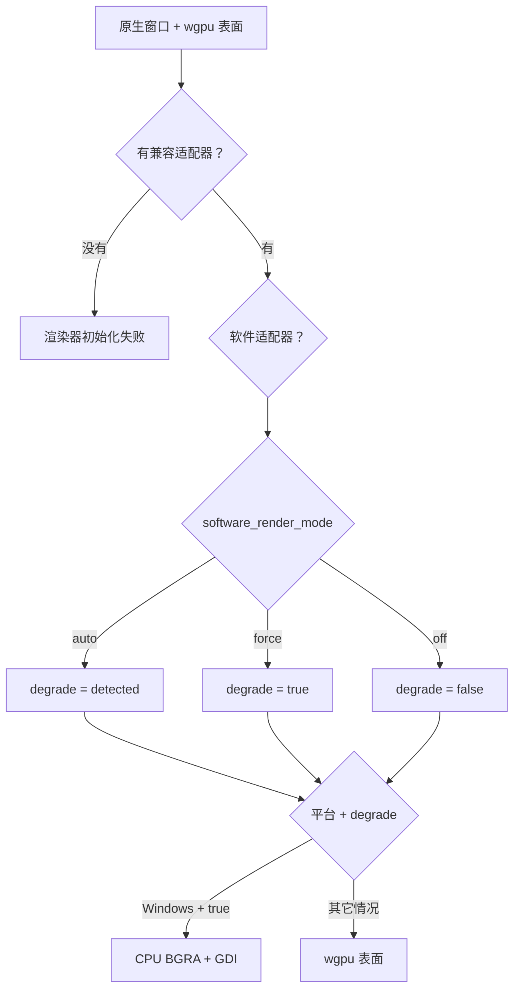

# 从按键到像素

[English](From-Keypress-to-Pixel)

本页跟踪大写英文字母 `A` 在当前应用中的完整路径。假设窗格已经获得焦点，采用普通文本
编码，没有启用 Win32 或 Kitty 键盘协商，并且命令面板、搜索框、复制模式、输入法组字和
键位绑定都没有接管该按键。

按下 `A` 不会直接画出 `A`。SonicTerm 先把字节发给子程序。只有子程序通过伪终端
（PTY）送回来的字节才会进入画面。交互式 shell 通常会回显该字节，所以整个往返看起来
几乎没有延迟。

```mermaid
flowchart LR
    key["WindowEvent::KeyboardInput<br/>逻辑字符 A"]
    encode["encode_key / encode_logical<br/>UTF-8 0x41"]
    inq["有界 PTY 输入队列"]
    writer["sonic-pty-writer"]
    child["子进程"]
    reader["sonic-pty-reader"]
    outq["有界 PTY 输出队列"]
    worker["每窗格 VT 工作线程"]
    parser["Parser::advance_with_replies / Performer"]
    grid["网格单元 A<br/>脏行 + revision"]
    event["RequestRedraw(WindowId)"]
    frame["完整 PaneRender 帧"]
    font["FontStack + GlyphAtlas"]
    choice{"呈现器"}
    wgpu["wgpu 保留帧"]
    cpu["WindowsSoftwareFrame + GDI"]
    pixels(["窗口像素"])

    key --> encode --> inq --> writer --> child
    child --> reader --> outq --> worker --> parser --> grid
    grid --> event --> frame --> font --> choice
    choice -- "wgpu" --> wgpu --> pixels
    choice -- "Windows 降级" --> cpu --> pixels
```

### 1. 窗口初始化准备整条路径

`App::do_resumed` 创建首个原生窗口和渲染器，启用输入法并记录显示器周期。
后续窗口通过 `GpuSharedContext` 共享第一套适配器/设备/队列，但各自拥有表面与绘制状态。

所有呈现器都要求 wgpu 初始化成功；Windows CPU/GDI 不是无需适配器的恢复路径。
适配器分类与 `auto`/`force`/`off` 策略相互独立，准确规则见[渲染模式](Rendering-Modes-zh-CN)。

渲染器准备保留帧、正文/页脚/标题字体栈、独立字形/图像图集及行缓存。
表面与帧节奏策略见[渲染模式](Rendering-Modes-zh-CN)，分配清单见[内存](Memory-zh-CN)。

### 2. 按键先交给当前输入所有者

winit 会为按下、重复和释放发送 `WindowEvent::KeyboardInput`。SonicTerm 保留完整事件：
物理按键、由布局解析的逻辑按键、操作系统生成的文本、小键盘位置、事件状态和重复标记。
在本例中，键盘布局已把逻辑字符和文本解析为大写 `A`。

本地输入所有者可以中止后续路径。主窗口和子窗口共用同一套以来源 `WindowId` 为目标的首次按下策略：

1. 退出确认；
2. 命令面板；
3. 活跃输入法组字；
4. 搜索；
5. READONLY 或复制模式；
6. 配置键位；
7. PTY 编码。

已接纳的重复和释放事件在首次按下策略之前仍沿记录的终端所有者发送。所有窗口中，打开的
搜索和正在组字的输入法都先于 READONLY 导航取得输入。快速选择的提示按键归提示层所有，
不会变为应用快捷键。退出警告属于事件来源窗口，不改变记录的原生焦点。未知、已移除或
尚未启用的预热窗口不会落入主窗口输入路径。

IME 事件在主/子窗口分流前进入同一个以 `WindowId` 为目标的处理器。来源窗口的命令面板
优先消费组字事件；否则由该窗口的 IME 状态提供提交的 UTF-8 文本。该窗口的活动搜索先取得
提交文本，之后 READONLY/复制模式才可丢弃它；两者都不拥有输入时，经现有 PTY 与广播边界
发送给来源窗格。其他窗口的焦点不会改变目的地，未知或已移除窗口不产生动作。即使搜索窗格
暂时缺失，打开的搜索仍保留输入所有权。搜索提交与搜索按键分别使用共享的窗口级处理器，
保留视口锚定。组字期间，共享键盘路径拦截原始输入。修饰键变化和焦点清理也明确查找来源
窗口：失焦释放其已接纳的原生按键和锁定的指针手势、取消其预编辑文本，并只向活动窗格报告
焦点。重新聚焦只重置 IME 光标位置节流，不反复切换原生输入上下文。

终端输入法锚点由活动窗格的物理原点、内容内边距和光标单元格结合实时物理字格度量计算。
每个偏移只加一次，不再次乘 DPI。各窗口按 `(窗格 id、物理位置、物理尺寸)` 合并重复更新，
但相同单元格下的焦点切换、缩放、转移、字体/内边距变化和尺寸变化仍会更新原生锚点。
命令面板和搜索框保留各自的输入字段锚点，并在归还输入所有权前重置终端锚点缓存。

只有通过所有本地路由、且至少进入一个有界 PTY 输入队列的按下事件才会记为 PTY 所有。
成功接收的 pane 集合在整个按键生命周期内保持不变：重复事件会在后来打开的命令面板、搜索框
或 keymap owner 之前查询该集合；即使焦点或广播状态改变，释放事件也会返回该集合。原生
Win32 路由还保留按下被接纳时的协议代次；协议切换或重置会取消该路由，失焦时则在
Win32 仍启用的前提下发送合成释放并清除所有权。本地消费或被队列拒绝的按下事件不会产生
孤立的重复或释放事件。

### 3. `A` 变成终端输入字节

应用从窗格的一次一致快照选择编码协议。Windows 上，请求了 Win32 输入且没有非零
Kitty flags 时，使用该事件携带的原生元数据，不从 UTF-8 文本反推按键。其它路由调用
`encode_key`。在本例的普通文本路径中，`Key::Character` 没有 Control 或 Alt 时，
会原样使用操作系统生成文本的 UTF-8 字节。

| 属性 | 值 |
| --- | --- |
| 字符 | `A` |
| 码点 | `U+0041` |
| UTF-8 | `0x41` |
| 十进制字节 | `65` |

修饰键、小键盘、Win32 和 Kitty 编码见[键盘协议参考](Terminal-IO-and-VT-zh-CN)。本例仍为 UTF-8 `0x41`。

### 4. 字节进入一个或多个 PTY

应用只向获得焦点的源窗格写一次。只有当前窗格仍是开启广播的源窗格时，才会添加接收窗格。
`BroadcastScope::Tab` 选择同一标签页的其它窗格。`BroadcastScope::AllTabs` 选择跨标签页和
窗口的其它窗格。接收集合会排除源窗格，也会排除所在窗口处于 READONLY 模式的窗格。

每个目标都经过以下实时边界：

原生输入和广播路径不再构建临时状态机。显式的 `AppIntent::PtyWrite` 与
`AppEffect::PtyWrite` 按指定窗格 id 进入同一个有界写入边界。以窗口为目标的兼容输入会解析
该存活窗口的活动窗格，不使用零哨兵，也不猜测最前窗口；该窗口处于 READONLY 模式时，这类输入
会被丢弃。目标缺失时，不会把字节转给另一终端。

`PtyHandle::send_input_nonblocking` 使用 `try_send`：

- 每窗格队列容量为 4 条消息；
- 每条消息最多 16 MiB；
- 拒绝类型为 `MessageTooLarge`、`QueueFull`、`WriterDisconnected`。

每个 `PtyInputError` 在 IO 边界保留被拒绝的 `Vec<u8>`。应用先丢弃这些字节，再发送
只含元数据的 `UserEvent::PtyInputRejected`。它记录窗格标识、当前窗口、生产者指定的输入类别、
字节数、原因及并发队列/writer 观察值；窗格仍存在时在其窗口显示通知。它不会自动重试，
因为稍后重放时，子程序的输入状态可能已经改变。

专用 `sonic-pty-writer` 线程取出字节向量，调用 `write_all`，然后尝试一次不保证成功的
`flush`。写入失败会结束 writer。此时 SonicTerm 还没有画出任何 `A`。

### 5. 子程序决定返回什么

子程序从 PTY 一侧收到 `0x41`。普通交互式 shell 通常开启回显，因此 `0x41` 会作为输出
返回。回显属于子程序一侧的终端行为，不是 SonicTerm 自行显示输入。

原始模式编辑器可以消费 `A`，再发送更大的重画。密码提示可以不发送任何可见输出。
程序也可以发送不同内容。SonicTerm 只解析 PTY 主端实际返回的字节。

Unix 上由 `portable-pty` 提供原生 PTY。Windows 上由它提供 ConPTY。经过这个平台边界后，
字节、VT、网格、字体和渲染路径都是共享的。

### 6. PTY reader 施加有界背压

`sonic-pty-reader` 把数据读入可复用、连续的 64 KiB `BytesMut` 分配。它把已填充前缀拆成
带引用计数的 `Bytes` 视图，再包装为 `PtyOutputChunk`。这是可复用的平坦存储，不是循环
环形数据结构。旧视图仍占用该分配时，`reserve` 可能再分配一个 64 KiB 缓冲环。

输出通道最多保存 64 个数据块。通道满时不会丢弃输出。reader 会在阻塞 select 中等待，
让操作系统的 PTY 缓冲区向子程序施加背压。

通道最多保存 64 个数据块。reader 会先构造下一个数据块，再因通道已满而阻塞。若每个数据块
都占住不同的 64 KiB 缓冲环，结构最坏情况为 65 个缓冲环，即 4.0625 MiB。普通 shell 的
小块输出通常让许多排队视图共用一个缓冲环。`queued_output_bytes` 报告被占住的缓冲环分配量；
`queued_output_payload_bytes` 报告等待解析的负载字节。

主路径创建的窗格使用 `sonicterm-vt-loop`。直接在拆出窗口里创建的窗格使用
`sonicterm-vt-loop-child`。PTY 启动失败时，窗格仍然可见，但没有 PTY reader、writer 或
VT 工作线程。

### 7. VT 解析器修改网格

窗格工作线程收到数据块后，在 `Parser::advance_with_replies` 和读取键盘输入快照期间持有该
窗格的解析器锁。产生回复的分派会返回已消费的前缀、事件和回复；工作线程先释放锁，再处理事件、
合并回复，然后继续解析剩余后缀。完整回复在解析器锁外进入独立的回复 FIFO。

普通 ASCII `A` 通过可打印字符快速路径进入 `Performer::print_graphic`。其它可打印 UTF-8
由 vte 解码后进入同一操作。控制字符和转义序列会调用 `execute`、`csi_dispatch`、
`osc_dispatch`、`esc_dispatch`，或 DCS 的 `hook`、`put`、`unhook`。Kitty graphics 的
APC 输入会在 vte 之前被截获。

执行器附上当前前景色、背景色、粗体、斜体、下划线、反色和超链接编号。URI 本身留在
超链接注册表中。随后执行器调用网格。

`Grid::put_char_styled_in_region` 把 `A` 保存为宽度一的 `Cell`。普通情况下，它推进光标，
把该行标脏，推进行内容序号，并推进粗粒度网格 revision。

到达右边界时，自动换行会把光标放到越过末列一格的位置，并设置 `pending_wrap`。下一个
可打印字符才真正换行。只有实际发生这次转换时，目标 `Line` 才会标记为从前一行自动软换行；
仅有 pending 状态不会留下持久标记。LF、VT、FF、IND、NEL、整行擦除、结构性区域滚动、
行复用和不做 reflow 的尺寸变化，都会在无法证明连续性时清除该 provenance。这个 bit 打包在
现有行内容序号 word 中，因此不会增大 `Line`，同时会参与行相等性和 hash。关闭自动换行时，
光标停在最后一列。

脏行表示“这一行发生了变化”。脏位、内容序号、换行 provenance 和网格 revision 是独立记账
信号，分别用于重绘工作、逻辑行身份、内容身份和粗粒度帧身份。

本地目标查找沿已记录的自动换行向前后查找，总共最多连接 8 个可见行，并在 4 KiB 上限内
扁平化，同时保留 byte 到绝对 cell 的映射。硬换行、不可见边界、已淘汰的前驱或第 9 行都会
fail closed。异步 probe key 绑定有序行 fingerprint 与 wrap bit、
screen incarnation、viewport、准确 pane CWD、候选 span 和鼠标指向的绝对 cell。激活前会重建
该 key，再执行原生目标重新验证。

单元格如何表示字符是另一件事。宽字符使用 `WIDE` 与 `WIDE_CONT` 单元格。零宽字符附加到
首单元格的 `extras`，上限为 `MAX_CELL_EXTRAS_BYTES = 64`；超过上限的码点会被丢弃。

### 8. VT 工作线程请求稍后重绘

工作线程持有解析器锁时发布打包后的 `keyboard_input` 快照，其中包含键盘模式、Kitty flags
和协议 epoch。释放锁后，再根据返回的 `VtEvent::CursorVisibility` 事件更新 `cursor_visible`，
并处理剪贴板、命令和媒体事件。对事件循环代理的调用也发生在解析器锁外。

重绘请求按字节和时间合并：

- 待处理输出达到 128 KiB 时立即发出；
- 连续数据的最大等待时间为 8 ms；
- 否则，3 ms 没有新数据时发出尾部重绘。

达到任一边界后，工作线程在短暂的重绘目标锁内复制当前 `WindowId`。释放锁后，它发送
`UserEvent::RequestRedraw(WindowId)`。winit 线程查找存活窗口并调用 `request_redraw()`。
过期编号会被忽略。

这层间接关系让窗格可以跨窗口移动。转移只修改共享 `WindowId`；现有工作线程和子进程
保持不变。接收的标签页先激活，再按目标窗格矩形调整可见网格和 PTY，不经过整窗尺寸的
中间状态。缩放隐藏的兄弟窗格在再次可见之前保留原尺寸。

第二层帧节奏控制可能把持续输出推迟到下一个帧边界。硬件路径让纯输入重绘立即发生。
PTY 输出最多等待一个显示器帧周期。最终降级状态启用时，纯输入重绘也会合并到软件帧周期。
定时 `ControlFlow::WaitUntil` 会重新唤醒事件循环并请求该帧。

### 9. 事件循环构建完整帧

收到 `RedrawRequested` 后，应用先计算活动标签页的窗格矩形。它对每个必需的内联图像存储
和活动标签页解析器使用 `try_lock`，并让所有解析器锁守卫一直存活到渲染调用结束。任一锁
不可用时，应用会释放已经取得的全部锁守卫，记录待重绘状态，并在不调用渲染器的情况下
返回。帧要么完整，要么不存在；SonicTerm 不会呈现新旧窗格状态混合的画面。

应用为每个可见窗格构建 `PaneRender`，其中包含：

- 稳定窗格编号；
- 可变网格视图；
- 像素矩形和视口；
- 活动状态和光标样式；
- 广播接收状态；
- 滚动条透明度；
- 浅复制的内联图像记录，像素仍由共享 `Arc<[u8]>` 持有。

生产调用把窗格数组，以及独立的主题、光标、选区、复制模式、标签页、搜索、命令面板、
输入法、视口、通知和悬停 URL 数据交给 `GpuRenderer::render_with_outcome`。它不会构建一个总的
`RenderInputs` 对象。

### 10. 损伤区域和行缓存选择工作量

`FrameKey` 改变后才需要新工作。主屏幕修改损伤脏行条带；备用屏幕修改损伤整个窗格，
UI 修改可能要求完整表面。行缓存复用未变化的字形和背景。相同键跳过组帧；Windows 降级
呈现可再次 blit 已有 CPU 帧。准确的缓存键、容量、窗格淘汰和损伤规则见
[渲染与字体](Rendering-and-Fonts-zh-CN)。

### 11. 文字变成字形实例

字体样式兼容的单元格会组成文字段。保守的可打印 ASCII 文字段可以跳过完整塑形。每个单元格
都必须是可打印 ASCII，没有组合 `extras`，没有宽字符标志，也不能包含这些连字触发字符：
`= ! < > - _ : | & *`。普通 `A` 满足条件。

这条捷径不是第二套字体系统。图集未命中时仍会调用 `FontStack::rasterize`。Unicode、组合
文字、回退字体和可能形成连字的文字段会调用 `FontStack::shape_text_with_style`，由 HarfBuzz
塑形，再把字形簇映射回终端列。

字体栈依次尝试配置字体、回退字体和原生发现。匹配、平台光栅器、颜色和装饰细节见
[渲染与字体](Rendering-and-Fonts-zh-CN)。

### 12. 光栅化填充字形图集

光栅化返回位图和摆放度量，包括宽度、高度、bearing、advance，以及数据属于单色、子像素还是
自带颜色。这是一块可复用的小图，不是屏幕像素。

`GlyphAtlas::get_or_insert` 复用缓存图块，或分配新光栅图块。`GlyphInstance` 保存屏幕
矩形、图集 UV、前景色和采样标志。若图集淘汰使当前帧已有实例失效，渲染器会放弃该帧并
保留脏行重试；下一帧关闭淘汰，直到成功呈现一帧。图集存储和后备哨兵见
[渲染与字体](Rendering-and-Fonts-zh-CN)。

### 13. 选定的呈现器产生像素

wgpu 路径通过 `AtlasUpload::sync` 上传脏矩形；已缓存的 `A` 无需上传。绘制在损伤裁剪
内更新保留离屏帧，然后复制到表面、提交命令并调用 `queue.present(frame)`。

Windows 降级路径将同一批准备好的实例合成到完整 CPU BGRA 帧，以 `SetDIBitsToDevice`
呈现。CPU 图集字节不变，GPU 镜像保持占位符。颜色转换、图层顺序、采样与尺寸限制见
[渲染与字体](Rendering-and-Fonts-zh-CN)。

### 14. 成功后清除脏行

Windows CPU 呈现只有在 `SetDIBitsToDevice` 成功后才调用 `finish_successful_frame`。
wgpu 在提交命令并调用 `queue.present(frame)` 后调用它。wgpu present 本身没有可表示后续
合成器失败的返回值。

`finish_successful_frame` 保存新的 `FrameKey`，增加成功帧计数，并且只在窗格身份与网格修订号仍匹配帧计划时清除脏行。

wgpu 绘制前：

- 超时或遮挡会使键失效并请求重绘；
- 过期或次优还会重新配置表面；
- 表面丢失会重新创建；
- 验证错误会返回错误。

这些路径都不会清除脏行。因图集淘汰而放弃的帧也保留脏行。`RenderMode::Noop` 会保存键，
但不呈现、不清除脏行，因为它没有生成新画面。

真正画完一帧后，窗口合成器和显示系统会把新呈现的像素送到屏幕上。回显的 `A` 此时才
出现在屏幕上。

### 缓存失效触发条件

字体、DPI、主题、表面和窗格布局变化会使相关帧/缓存身份失效。准确操作见
[渲染与字体](Rendering-and-Fonts-zh-CN)；脏行确认条件见[架构内部机制](Architecture-Internals-zh-CN)。

### 窗格关闭时会发生什么

释放 `PtyHandle` 会取消 I/O、终止子进程，再执行有时限的平台关闭与回收。未完成清理
不等于成功。关闭顺序见[运行时生命周期](Runtime-Lifecycle-zh-CN)，Unix/ConPTY 期限见
[架构内部机制](Architecture-Internals-zh-CN)。验证与发布证据见[开发与发布](Development-and-Release-zh-CN)，
不能仅凭这条旅程推断。

### `A` 可能不出现的原因

| 边界 | 正常原因 |
| --- | --- |
| 本地输入所有者 | 命令面板、搜索、复制/READONLY 模式、输入法或键位消费了按键 |
| 子程序 | 关闭了回显、画了其它内容，或没有输出 |
| PTY 输入 | 消息过大、队列已满或 writer 已断开；应用会显示错误 |
| 窗格进程 | PTY 启动失败，因此可见窗格没有工作线程 |
| 帧收集 | 解析器或图像锁正忙；整帧被推迟 |
| 渲染器 | 表面或图集恢复路径要求稍后重画 |
| 缓存 | 复用了已有工作；可见结果不变 |

### 源码索引

| 步骤 | 主要路径 |
| --- | --- |
| 键盘与输入法路由 | `crates/sonicterm-app/src/app/{window_event,child_window}.rs` |
| 按键编码 | `crates/sonicterm-app/src/app/key_encoding.rs` |
| 意图/效果 PTY 边界 | `crates/sonicterm-app-core/src/{intent,effect,reducer,state_machine}.rs`、`crates/sonicterm-app/src/app/mod.rs` |
| PTY 队列与线程 | `crates/sonicterm-io/src/pty.rs` |
| VT 工作线程与重绘合并 | `crates/sonicterm-app/src/app/{spawn_pane,child_window,redraw_target}.rs` |
| VT 解析 | `crates/sonicterm-vt/src/vt.rs` |
| 单元格插入与脏行 | `crates/sonicterm-grid/src/grid.rs` |
| 帧收集 | `crates/sonicterm-app/src/app/{window_event,child_window}.rs` |
| 窗格帧类型 | `crates/sonicterm-render-model/src/pane_render.rs` |
| 损伤区域、缓存、字形实例和呈现 | `crates/sonicterm-gpu/src/{core,row_quad_cache,software_windows}.rs` |
| 字体 | `crates/sonicterm-engine/src/fontstack.rs`、`crates/sonicterm-font/src/` |
| CPU 字形图集和行字形缓存 | `crates/sonicterm-text/src/{glyph_atlas,row_glyph_cache}.rs` |
