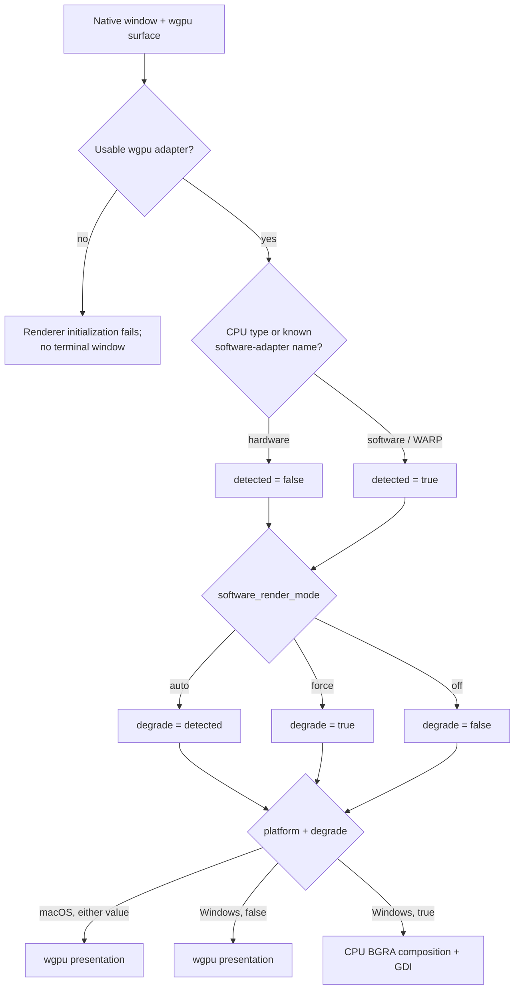
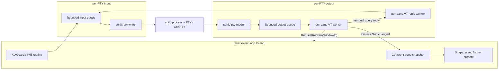
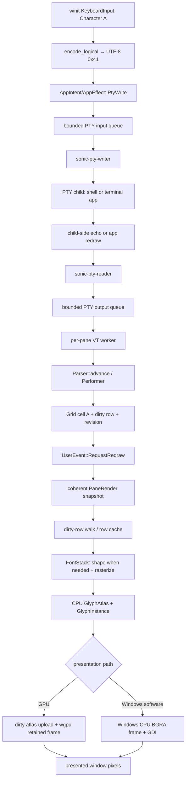
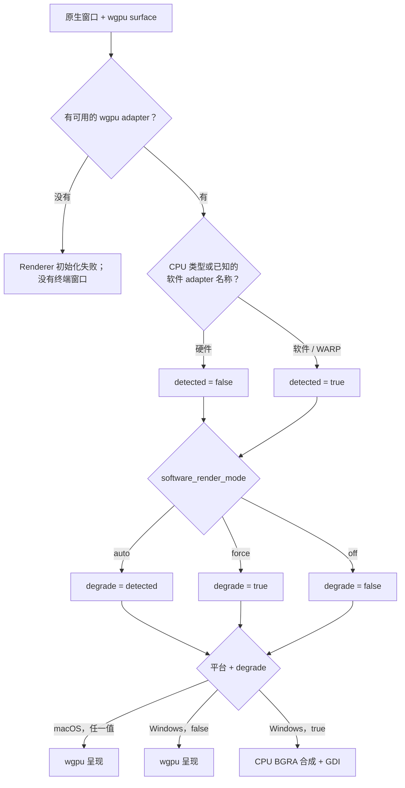
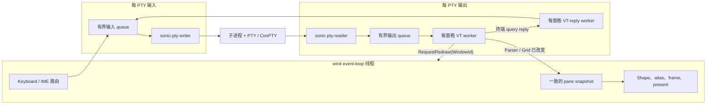
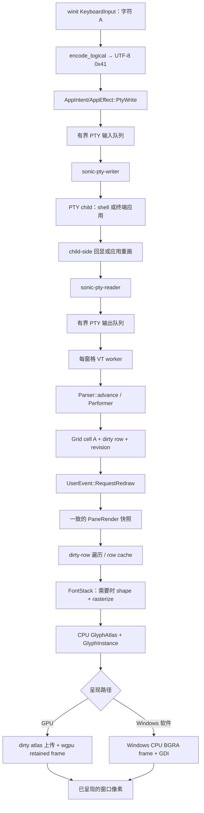

# From Keypress to Pixel / 从按键到像素

What really happens after you press `A`—told first as a tiny story, then as an
exact map of SonicTerm's current code.

按下 `A` 以后究竟发生了什么——先讲一个小小的故事，再给出 SonicTerm 当前代码的
精确地图。

Related / 相关: [Architecture](Architecture) · [Terminal IO and VT](Terminal-IO-and-VT) · [Rendering and Fonts](Rendering-and-Fonts)

## English

### The smallest true story

Imagine that `A` is a little letter riding in an envelope.

It must make **two trips**:

1. **You → the program:** SonicTerm puts `A` in an envelope and gives it to the
   shell or other program running in the pane.
2. **The program → SonicTerm → the screen:** if that program sends `A` back,
   SonicTerm puts it in a cell, makes a tiny picture of its shape, and paints
   that picture on the window.

The most important fact is this:

> Pressing `A` does not paint `A` directly. SonicTerm first sends the key to the
> child program. SonicTerm paints only the output that comes back through the
> pseudo-terminal.

An ordinary interactive shell usually has **echo** enabled, so it sends the
`A` back right away. That makes the round trip look instant. A full-screen app
such as an editor can turn echo off, keep the key, and send back something else—or
nothing at all.

```mermaid
flowchart LR
    finger["Finger presses A"] --> door["SonicTerm receives the key"]
    door --> envelope["UTF-8 envelope: 0x41"]
    envelope --> child["Shell or terminal program"]
    child -- "echoes or redraws" --> bytes["Output bytes return"]
    bytes --> grid["A goes into a grid cell"]
    grid --> stamp["Font makes an A-shaped stamp"]
    stamp --> painter["GPU or Windows CPU painter"]
    painter --> screen["A lights up on the screen"]
```



### Meet the helpers

| Helper in the story | What it really is |
| --- | --- |
| The door | winit's `WindowEvent::KeyboardInput` |
| The envelope maker | `encode_key` / `encode_logical` |
| The tube to the program | a PTY on macOS or ConPTY-backed PTY on Windows |
| The program | the shell, editor, TUI, or other child process in the pane |
| The listener | `sonic-pty-reader`, plus `sonicterm-vt-loop` for a main-created pane or `sonicterm-vt-loop-child` for a pane created directly in a torn-out window |
| The rule reader | public `sonicterm_vt::vt::Parser` and its private `Performer` |
| The box of letter places | `sonicterm_grid::grid::Grid` |
| The font helper | `sonicterm-engine::FontStack` and `sonicterm-font` |
| The stamp book | the CPU `GlyphAtlas`; wgpu also keeps a texture copy, while the Windows CPU painter reads the CPU copy directly |
| The painter | wgpu, or the Windows software frame when that path is active |

### Before the key: SonicTerm has already built the road

The same character pipeline is prepared when a window opens, before anyone
presses `A`:

1. The winit event-loop thread creates the native window and enables IME events.
2. The first renderer creates a wgpu instance; later windows clone the shared
   instance. Every renderer creates a surface for its own native window.
3. The first renderer asks wgpu for a high-performance adapter compatible with
   its surface. SonicTerm does not explicitly force a fallback adapter, but wgpu
   may return a CPU/software adapter when no usable hardware adapter is available.
   Later renderers reuse the first renderer's adapter, device, and queue.
4. SonicTerm records the adapter backend, name, driver, and device type, then
   classifies it as software when its type is `Cpu` or its name identifies
   Microsoft Basic Render Driver, llvmpipe, SwiftShader, or a software adapter.
5. For the first renderer, a wgpu device and queue are requested. An actually
   detected software adapter uses `MemoryHints::MemoryUsage`; a hardware adapter
   uses `MemoryHints::Performance`. This memory choice follows the real adapter,
   not a later `force`/`off` override, and is inherited by later renderers through
   the shared device and queue.
6. SonicTerm configures a BGRA8 sRGB surface, creates the text pipeline and
   retained frame, creates the CPU glyph atlas and 1×1 inline-image placeholder
   atlas with their matching GPU uploads, then builds font stacks at the window
   DPI. The image atlas expands only when an image is needed.
7. `[appearance].software_render_mode` and the detected adapter are combined to
   choose the resolved **degrade** state.

“Without a GPU” has a precise meaning here: **without a hardware GPU, but with a
usable wgpu software adapter**. There is no completely adapter-free/headless
renderer. If wgpu cannot create a compatible surface, return any suitable
adapter, or open a device, renderer initialization fails and SonicTerm cannot
show a terminal window. Even Windows' CPU/GDI presentation path is selected
inside an already-created `GpuRenderer`, so it still requires that startup wgpu
adapter/device setup.



#### The configuration truth table

| Actual adapter | `auto` | `force` | `off` |
| --- | --- | --- | --- |
| Hardware | normal state | degraded state | normal state |
| CPU/software | degraded state | degraded state | normal state, even though wgpu still rasterizes on the CPU |

The word **degraded** describes a resolved policy, not the adapter itself.
`force` can degrade a real GPU; `off` can decline to degrade WARP or another CPU
adapter.

#### The four concrete presentation cases

| Case | Final painter | Atlas used for `A` | Pacing and surface policy |
| --- | --- | --- | --- |
| macOS, `degrade = false` | wgpu, normally Metal when the selected backend is an ordinary native backend | full CPU atlas plus matching wgpu texture | monitor period; Mailbox when supported, otherwise FIFO; configured transparency allowed; up to 2 frames of surface latency |
| macOS, `degrade = true` | still wgpu—there is no macOS GDI-like CPU-frame branch | full CPU atlas plus matching wgpu texture | 25 ms period (~40 fps), 83.333 ms while IME composes (~12 fps); FIFO, opaque, 1 frame of surface latency, no fade-driven extra frames |
| Windows, `degrade = false` | wgpu, normally D3D12 when the selected backend is an ordinary native backend | full CPU atlas plus matching wgpu texture | monitor period; Mailbox when supported, otherwise FIFO; configured transparency allowed; up to 2 frames of surface latency |
| Windows, `degrade = true` | `WindowsSoftwareFrame` composes on the CPU, then GDI `SetDIBitsToDevice` copies BGRA pixels to the HWND | full CPU atlas; GPU glyph/image textures are reduced to 1×1 placeholders because this presenter does not sample them | 25 ms period (~40 fps), 83.333 ms while IME composes; full-surface CPU composition, opaque window, no fade-driven extra frames |

There is one easy-to-miss fifth combination inside the table: Windows on WARP
with `software_render_mode = "off"`. The adapter is software, but `degrade` is
false, so SonicTerm uses the normal wgpu texture/draw/present path on that CPU
adapter rather than the GDI software frame. Conversely, `force` on a hardware
Windows machine selects the CPU/GDI frame even though the detected adapter is
hardware.

wgpu chooses the compatible backend; SonicTerm does not hard-code Metal or
D3D12 in this constructor. Those are the normal native backends, but the selected
backend is logged, and a GLES backend is explicitly warned about.

#### Platform-specific input, child process, and font work

| Boundary | macOS | Windows |
| --- | --- | --- |
| Keyboard event | AppKit input reaches the same winit `KeyboardInput` / `Ime` handlers used by the cross-platform app | Win32 input reaches those same winit handlers |
| PTY implementation | `portable-pty` opens a native Unix PTY | `portable-pty` opens ConPTY |
| Default shell | `$SHELL`, falling back to `/bin/zsh`; zsh/tcsh/csh receive `-l`, while bash/fish receive `--login` | PowerShell 7 is preferred, then Windows PowerShell, then `cmd.exe`; PowerShell startup selects UTF-8 console input/output |
| Locale/encoding help | if `LC_ALL` is not explicit and neither `LC_CTYPE` nor `LANG` says UTF-8, SonicTerm sets `LC_CTYPE=UTF-8` and, only when `LANG` is empty, `LANG=en_US.UTF-8` | PowerShell startup sets .NET console input/output and `$OutputEncoding` to UTF-8 and changes the code page to 65001 |
| Font discovery | CoreText locator | GDI/DirectWrite-backed locator |
| Text shaping | HarfBuzz through `sonicterm-font` | HarfBuzz through the same `sonicterm-font` layer |
| Normal glyph rasterizer | FreeType | DirectWrite; if it cannot be constructed for a face, FreeType is the fallback |
| Final native presentation | wgpu surface | wgpu surface, or GDI only when resolved degradation is active |

The platform differences sit at the edges. From encoded bytes through VT
parsing, grid cells, dirty rows, row caches, `GlyphKey`, `GlyphInstance`, color,
and placement, the model is shared.

### Trip one: from your finger to the child program

#### 1. The operating system tells SonicTerm about the key

For this example, assume:

- the terminal pane has focus;
- the command palette, search, READONLY/copy mode, and IME composition are not
  consuming the key;
- no configured keybinding claims `A` as a SonicTerm action;
- the logical character reported by the keyboard layout is uppercase `A`.

winit delivers a pressed `WindowEvent::KeyboardInput`. SonicTerm uses the
layout-resolved `logical_key`, not the physical key position, so the operating
system and active keyboard layout have already decided that this press means
uppercase `A`.

Before encoding any terminal bytes, the owning window offers the event to every
local input owner. The exact order differs slightly because main and torn-out
windows store their local state differently, but both finish with keymap dispatch
and only then PTY encoding:

| Main window | Torn-out child window |
| --- | --- |
| quit guard → command palette → active IME composition → search → copy/READONLY mode → keymap → PTY encoding | quit guard → copy/READONLY mode → attached command palette → active IME composition → search → keymap → PTY encoding |

Any owner that consumes the key returns immediately. A shortcut belongs to
SonicTerm; only an unclaimed text key belongs to the terminal program.

An input method takes a nearby but separate path. While an IME is composing,
raw keyboard events are suppressed, because sending them as well would type the
text twice. `Ime::Commit` ends composition and makes the committed UTF-8 text
eligible for delivery—but an open palette or search field can consume that
commit, and copy/READONLY mode discards it. Only a commit with no local text
owner reaches the PTY.

#### 2. SonicTerm turns the logical key into bytes

`encode_key` calls `encode_logical`. For an ordinary `Key::Character` with no
Control or Alt modifier, SonicTerm sends the character's UTF-8 bytes unchanged.

For uppercase Latin `A`:

| Meaning | Value |
| --- | --- |
| Character | `A` |
| Unicode code point | `U+0041` |
| UTF-8 | one byte: `0x41` |
| Decimal byte value | `65` |

Other modifiers can make different envelopes. Control is checked first:
Control+A becomes byte `0x01`, and Control+Alt+A still takes that Control branch.
Without Control, Alt+A prefixes `ESC` before the UTF-8 bytes. Shift and
Super/Meta do not alter a `Key::Character` inside this encoder—the keyboard
layout has already produced `A`, although a keymap may have consumed the chord
earlier. Named keys use terminal protocols instead: unmodified arrows honor the
pane's lock-free application-cursor-mode snapshot, while modified arrows use
xterm's parameterized CSI form regardless of that mode. Function keys use
xterm-style sequences. Of the kitty keyboard protocol, the current encoder uses
the pane's nonzero flags specifically to encode Shift+Enter as CSI-u. This page
keeps following plain `A`.

#### 3. The bytes are routed to the focused pane

`write_to_pty` finds the active pane and writes it exactly once. Broadcast fan-out
happens only when broadcast is on **and** that active pane is still the source
pane that armed it. `BroadcastScope::Tab` chooses the other panes in the source's
tab; `BroadcastScope::AllTabs` chooses peers across tabs and windows. The source
is excluded from the receiver set, so it is never written twice.

Every destination independently crosses the backend-free app boundary as:

```text
AppIntent::PtyWrite → AppEffect::PtyWrite → live PaneState → PtyHandle
```

The final enqueue is deliberately non-blocking. A pane with a live local PTY has
an input queue of **4 messages**, and each message may be at most **16 MiB**.
`PtyHandle::send_input_nonblocking` uses `try_send`: an oversized, full, or
disconnected write is refused with the original bytes preserved in the typed
error. The app carries those bytes into `UserEvent::PtyInputRejected`, logs the
reason, and shows a notification instead of silently pretending the key was
delivered. It does not automatically retry, because replaying input later could
put bytes into the wrong application state. A one-byte `A` normally enters the
queue immediately.

#### 4. The PTY writer gives `A` to the program

The dedicated `sonic-pty-writer` thread receives the byte vector, writes all of
it to the PTY master, then makes a best-effort `flush` whose result is ignored. The operating system's PTY machinery
then presents that input to the child side, where the shell or current terminal
application reads it.

SonicTerm has still painted no `A`.

### The turn-around: why `A` normally comes back

In an ordinary interactive shell, the child-side terminal machinery usually has
echo enabled. The `0x41` input therefore appears again as output from the child
side of the PTY. It may come back alone or next to prompts, colors, cursor
commands, and other bytes.

| macOS Unix PTY | Windows ConPTY |
| --- | --- |
| The PTY slave's termios line discipline normally has `ECHO` enabled. A raw-mode application changes those modes and draws for itself. | The pseudoconsole/console input mode and the running application decide whether input is echoed or replaced by an application redraw. |

Echo is a child-side behavior, not a SonicTerm shortcut:

- a shell with echo enabled sends `A` back;
- an editor in raw mode may consume `A`, update its own buffer, and send a whole
  redraw made of text plus VT control sequences;
- a password prompt may intentionally send no visible character;
- a program may transform the key and output something different.

On both platforms SonicTerm follows the same rule: whatever bytes return through
the PTY master are what its VT parser interprets and displays.

### Trip two: from child output to a terminal cell

#### 5. The PTY reader carries output to the pane worker

The dedicated `sonic-pty-reader` thread reads the PTY master into a reusable,
contiguous **64 KiB `BytesMut` backing allocation**. It splits each filled prefix
into a ref-counted `Bytes` view wrapped by `PtyOutputChunk`; this is reusable
flat storage, not a circular ring buffer. If old views still pin that allocation,
`reserve` may create another backing allocation.

The output channel is bounded to **64 chunks**. A full channel does not drop the
next chunk: the reader waits in a blocking channel select, eventually letting the
operating system's PTY buffers apply back-pressure to the child. The theoretical
worst case is 64 distinct 64 KiB allocations pinned at once (4 MiB), while small
shell echoes normally share one backing allocation.

A pane created through the main path uses `sonicterm-vt-loop`; one created
directly inside a torn-out child window uses `sonicterm-vt-loop-child`. The worker
receives each chunk, locks that pane's parser for the whole parse batch and its
parser-derived snapshots, and calls `Parser::advance`. A pane whose PTY failed to
spawn remains visible but has no PTY reader/writer or VT worker.

#### 6. The VT parser decides whether a byte is text or an instruction

A terminal stream is not only letters. It can also contain instructions such
as “move the cursor,” “use red,” or “clear this row.” `sonicterm-vt::Parser`
uses a VT state machine to tell those apart.

Plain `A` is printable ASCII. When no escape sequence is in progress, the
parser's fast path sends it straight to `Performer::print_graphic`. Other
printable UTF-8 text is decoded by vte and reaches the same `print_graphic`
function through `Perform::print`. Control bytes and escape sequences instead
use callbacks such as `execute`, `csi_dispatch`, `osc_dispatch`, and
`esc_dispatch`; they do not all become text. One protocol—Kitty graphics,
arriving as an APC sequence (`ESC _`)—is intercepted before vte sees those
bytes; Sixel and other DCS use vte's `hook`/`put`/`unhook` callbacks.

The performer attaches the current terminal attributes—foreground, background,
bold, italic, underline, inverse, and an interned hyperlink id—and asks the grid
to store the character. The URI string itself remains in the hyperlink registry.

#### 7. The grid puts `A` in one cell

`Grid::put_char_styled_in_region` knows printable ASCII `A` has width one. It:

1. writes a `Cell` containing `A` and its current style at the cursor;
2. advances the cursor by one column in the ordinary interior case;
3. marks that row dirty;
4. advances the separate content sequence and stamps that row;
5. advances the coarse grid revision.

At the right margin, the cursor rule is more precise: with autowrap enabled it
moves to the one-past-edge sentinel and sets `pending_wrap`, so the **next**
printable character performs the line wrap; with autowrap disabled it remains
pinned to the final column. A pending wrap from an earlier character is resolved
before `A` is written.

“Dirty” does not mean bad. It means: **this row changed, so the painter must look
at it again.** The dirty bit, content sequence, and grid revision are three
different signals: repaint work, selection/content identity, and coarse rendered
state. Wide characters normally use adjacent `WIDE` and `WIDE_CONT` cells;
zero-width combining characters attach to the previous lead cell's `extras`
string, capped at 64 UTF-8 bytes; a codepoint that would exceed that budget is
dropped. `A` needs one ordinary cell.

#### 8. The worker asks the window for a future redraw

The VT worker releases the parser lock before touching the window system. It
tracks pending bytes and age instead of requesting one frame per chunk:

- **128 KiB pending** flushes a redraw immediately;
- **8 ms maximum age** flushes a continuing stream;
- otherwise **3 ms with no next chunk** flushes the trailing output.

After one of those boundaries, it copies the pane's current `WindowId` under a
short redraw-target lock, releases that lock, and posts
`UserEvent::RequestRedraw(WindowId)` through the event-loop proxy.

The winit event-loop thread resolves that id in the live window map and calls
`request_redraw()`; a stale id is simply ignored. A second event-loop pacing gate
can coalesce the resulting `RedrawRequested` to the next frame boundary. A typed
character becomes visible through its PTY echo, so that redraw counts as a PTY
burst even though the original keyboard event marked input dirty. Hardware keeps
pure input redraws immediate, while a PTY echo is bounded by one monitor frame;
resolved software degradation coalesces even pure input redraws to its CPU frame
cap. Nothing is dropped—the event loop schedules a timed wake and requests the
frame again.

This separation also lets a pane move to another window: tear-out changes only
the shared `WindowId`, so the existing worker follows the pane without calling
AppKit or Win32 directly.

### From a terminal cell to a tiny picture

#### 9. The event loop takes one coherent snapshot

When `RedrawRequested` arrives, the app uses `try_lock` for every active-tab
pane parser and for the window's inline-image stores. If any required lock is
busy, it defers the whole frame. It never calls the renderer with only part of
the required pane state.

For each visible pane in the active tab, the app builds a `PaneRender` containing
its stable pane id, mutable grid view, pixel rectangle, viewport, focus,
cursor style, scrollbar alpha, broadcast-receiver state, and shallow-cloned
inline-image records whose pixel payloads remain shared `Arc<[u8]>` allocations.
The current app assembly supplies `CursorStyle::default()` here. Cursor position
remains in the grid. The app passes the pane slice plus theme, cursor visibility,
selection, copy mode, tabs, search, palette, IME, the active pane's viewport top,
notification, and hovered-URL state as explicit arguments to
`GpuRenderer::render`—there is no single consolidated UI snapshot object on this
production call.

The parser locks are acquired with `try_lock` and retained for the frame. Inline
image stores are also sampled with `try_lock`; that pass currently visits the
window's pane registry, including hidden-tab panes. If any required lock is
busy, the app drops every acquired guard, records a pending redraw, returns
without calling the renderer, and retries from a timed event-loop wake. The
contract is “all required snapshots are available or no render call,” not one
simultaneous transaction across all independent locks.

#### 10. The renderer finds the changed row

The renderer compares a frame fingerprint with the last successful frame. If
nothing visible changed, it can skip the work. Here the grid revision and dirty
row say that the cell containing `A` is new.

SonicTerm keeps previous pixels in a distinct offscreen texture. On the normal
non-degraded wgpu path, a primary-screen pane contributes the union of its
dirty-row strips, clipped to the pane and surface. A dirty alternate-screen pane
instead contributes its whole clipped pane—not the whole window—because
full-screen apps move regions in ways for which a narrow row union would leave
stale pixels. The retained render pass loads the old texture and its scissor lets
pixels outside the final damage survive.

Resolved degradation changes this last step: whenever a degraded frame has real
work, the wgpu branch promotes damage to the **full surface**. On Windows that
same state selects `WindowsSoftwareFrame`, which also clears and composes a full
surface. Thus narrow primary-row damage applies to normal retained wgpu
presentation, while degraded presentation deliberately spends less often but
repaints whole frames when it does run.

Pixel damage and CPU frame assembly are separate. The current hardware policy
uses `RenderMode::Full`, so it can visit every visible row while the row cache
cheaply replays unchanged rows; only the damage scissor changes retained pixels.
Resolved degradation can return `Noop` when no visible signal changed. The dirty
mark for our row invalidates that row's cache entry, so its cells are grouped and
emitted again.

#### 11. `A` becomes a glyph request

Cells with the same style are grouped into runs. A simple printable-ASCII run
containing `A` can use the renderer's conservative ASCII fast path: `A` maps
one-to-one to a `GlyphKey` without shaping the whole run.

That is only a shortcut, not a second font system. On an atlas miss,
`FontStack::rasterize` still resolves the real font face and glyph. More complex
text—Unicode, combining marks, fallback fonts, or ligature-capable runs—uses
`FontStack::shape_text_with_style`, which drives SonicTerm's HarfBuzz-backed
font stack and maps shaped clusters back to terminal columns.

The font stack chooses a face that contains the glyph. The user's primary family
is followed by SonicTerm's synthesized fallback chain—JetBrains Mono, Symbols
Nerd Font Mono, and Noto Color Emoji—and `sonicterm-font` can continue resolving
missing clusters through platform-discovered fallback faces. This family list is
currently code-owned, not a `sonicterm.toml` list. SonicTerm normally uses
DirectWrite rasterization on Windows and FreeType elsewhere. On Windows,
DirectWrite construction or per-glyph failure falls back to FreeType; built-in
or memory-only font data that DirectWrite cannot open also takes that fallback.

For the renderer, a “style run” means only the bold and italic bits, because
those select a different face. Foreground color is carried later on each glyph
instance and does not split shaping. The ASCII shortcut is also exact: every cell
must be printable ASCII, have no combining `extras`, carry neither wide-cell
flag, and contain none of the ligature triggers `= ! < > - _ : | & *`. A plain
`A` qualifies even when bold or italic; the style bits simply become part of its
`GlyphKey`.

#### 11a. Shape, color, and decorations are separate jobs

The `Cell` still carries more than the font shaper needs:

- `ch` is the lead character;
- `fg` and `bg` are the theme default, one of 256 indexed colors, or a 24-bit RGB value;
- flags include bold, italic, underline, strikethrough, inverse, dim, hidden,
  blink, and wide-cell markers;
- rare boxed data holds the hyperlink id, combining `extras`, non-default
  underline style, and an explicit underline color.

The active renderer path uses those pieces at different stages. Bold and italic
choose the shape face. Foreground is resolved after shaping; inverse swaps the
foreground/background roles, and dim blends the foreground 45% toward the
effective background in the stored sRGB-encoded color space. Default and indexed
colors resolve through the current theme; draw values are then converted to
linear light where the sRGB surface or CPU blend expects it, preventing gamma
from being applied twice.

Backgrounds are not glyphs. Non-default adjacent backgrounds are coalesced into
wide base quads; the theme-default background is omitted because the damage
background/clear already supplies it. Underline runs are coalesced separately
and become single, double, curly, dotted, or dashed quads, using SGR 58's
explicit color when present and otherwise the cell foreground. Selection,
cursor, search, hyperlink, IME, and palette visuals are later quads or glyphs in
the painter order.

The VT parser also stores blink, hidden, and strikethrough flags, but the current
terminal renderer has no flag-specific draw branch for those three. This page
describes the code that exists rather than implying an unimplemented visual
step.

#### 11b. Two row caches avoid repeating different work

A changed row invalidates two separate caches:

- `RowGlyphCache` stores the row's `GlyphInstance`s, underline runs, tofu quads,
  and missing-codepoint list under the three-part key `(pane id, absolute row,
  row hash)`. The hash covers cell contents, style revision, cell geometry, and
  selection overlap. The atlas eviction count is stored alongside the cached
  value and compared after lookup; a mismatch rejects UVs that may now point at
  another atlas tile.
- `LineQuadCache` stores coalesced background `QuadInstance`s under a parallel
  pane/absolute-row/hash key. Its hash also covers pane origin and pane extent,
  because moving or clipping a split changes background geometry.

Both caches are sized to roughly four times the sum of visible rows across all
panes. A size change or capacity hit clears that cache wholesale. Font, theme,
scale, resize, and atlas replacement clear the appropriate cache; dirty rows
invalidate absolute-row entries. Both cache types define pane-local invalidation,
but the current renderer has no production caller for those methods. Cursor,
selection, search, quick-select, and other frame-specific overlays are not
replayed as background-cache payloads.

#### 12. The font helper cuts an `A`-shaped stamp

Rasterization turns the font's outline for `A` into a small rectangle of pixel
coverage plus placement measurements:

- how wide and tall the bitmap is;
- where it sits relative to the cell baseline;
- whether it is ordinary coverage, subpixel coverage, or a self-colored glyph.

This is not yet a screen pixel. It is a reusable little stamp.

#### 13. The stamp goes into the glyph atlas

`GlyphAtlas::get_or_insert` looks for the glyph key in a fixed **2048×2048
BGRA8 CPU atlas** (about 16 MiB), whose metadata is capped at **16,384 entries**.

- On a hit, SonicTerm reuses the existing tile and refreshes its last-used frame.
- On a miss, `FontStack` rasterizes it, the atlas tries a reclaimed rectangle and
  then its shelf packer, copies coverage into BGRA storage, and records that
  rectangle as dirty.
- Monochrome coverage is replicated into BGRA channels; color and subpixel BGRA
  data are copied as provided.
- A space gets a zero-area cached entry because there is no ink or upload.
- A failed or impossibly oversized raster gets a zero-area sentinel, avoiding an
  expensive retry every frame; the renderer skips the degenerate draw or emits
  its tofu fallback where that path applies.
- At metadata or packing pressure, the atlas implementation deterministically
  evicts the coldest quarter. Because instances already assembled in that frame
  may now hold stale UVs, the renderer detects the changed eviction count,
  resets the whole atlas in place, invalidates `RowGlyphCache`, abandons the
  current frame, and requests a fresh one. The next frame retries with eviction
  disabled; a successful presentation restores eviction. The fixed pixel
  allocation never grows.

The renderer computes `A`'s physical-pixel placement from the cell, baseline,
bearing, and tile size, snaps it to device pixels, then converts it to normalized
device coordinates. Its `GlyphInstance` stores that NDC `rect`, normalized atlas
UVs, linear-space foreground modulation, and a packed four-component flag vector:
`x` marks a self-colored glyph, `y` marks subpixel coverage, `z` selects the
separate inline-image atlas, and `w` is reserved. An ordinary `A` leaves the image
selector clear. In effect the record says:

> Sample this atlas rectangle for `A`, place it over this cell, and tint ordinary
> coverage with this foreground color.

The row cache remembers that instance for later unchanged frames under the key
`(pane, absolute row, row hash)`. It stores the atlas eviction count alongside
the entry and compares it after lookup, rejecting a hit whose UVs may now point
at a different tile.

### From the stamp to light on the display

#### 14. The wgpu path uploads only new atlas pieces

On the normal wgpu path, `AtlasUpload::sync` drains the atlas's dirty rectangles.
If `A` was newly rasterized, only its tightly packed region is written to the
GPU texture. If its tile was already warm, the upload is zero bytes. The Windows
CPU presenter does not perform this glyph-texture upload: it reads the CPU atlas,
clears the CPU atlas's dirty list, and keeps GPU glyph/image textures as 1×1
placeholders.

The wgpu path then acquires the window surface and draws into the retained
offscreen frame inside the damage scissor. The literal first item is a background
quad that clears the damaged region; the unified pipeline then draws these
categories in order:

```text
damage background + base quads → inline images → base glyphs → overlay quads → overlay glyphs
```

An ordinary `A` is a textured rectangle whose atlas alpha coverage is multiplied
by the cell's linear-space foreground color. Color glyphs and inline images keep
the tile's own colors instead of receiving ordinary text tint. The frame blitter
copies the retained result to the swapchain surface, wgpu submits the commands,
and the surface is presented.

#### 15. Windows software rendering uses the same prepared letter

When Windows' resolved degrade state is true, `WindowsSoftwareFrame` consumes the
same upstream `GlyphInstance` and CPU glyph atlas. It prepares and clears one
full-window BGRA buffer, blends base quads, images, glyphs, overlay quads, and
overlay glyphs, then uses GDI `SetDIBitsToDevice` to copy the complete width ×
height image to the HWND. Its CPU buffer accepts at most 16,384 pixels per axis
and 160 MiB of four-byte BGRA pixels. A wgpu surface has the same 160 MiB byte
ceiling, but its per-axis ceiling is the lower of 16,384 and the device's
`max_texture_dimension_2d`.

The outcomes are deliberately distinct. An invalid initial window size makes
renderer construction fail. A rejected later `try_resize` returns `false` and
leaves the old surface configured, so the event path can preserve the previous
usable size. `WindowsSoftwareFrame::new` or `prepare` returns its own error before
allocating if a CPU-frame size fails validation. None of those size checks is a
GDI presentation result.

This branch does not reshape `A`, choose another font, or invent a second
placement policy. GPU and Windows CPU presentation differ in who paints the
pixels, but start from the same grid cell, font result, atlas tile, placement,
and color. It is not a rescue path for total wgpu initialization failure:
`auto`, `force`, and `off` select it only inside a renderer that already has an
adapter and device.

#### 16. The frame succeeds, and the row becomes clean

For a frame that actually draws, `finish_successful_frame` remembers its
`FrameKey` and clears every rendered pane's dirty bits only after Windows GDI
presentation returns `Ok`, or, on the wgpu path, after command submission and
`queue.present(frame)` have been invoked. GDI `SetDIBitsToDevice` can report a
failure, which returns before the finish step. wgpu's `present` call itself has
no success result, so SonicTerm cannot directly observe a post-present failure
there.

Before a wgpu draw, timeout/occlusion, outdated, suboptimal, and lost surface
acquisition results invalidate the cached key and request another redraw;
outdated and suboptimal reconfigure the surface, while lost recreates it. A
validation error is propagated. No failed acquisition clears the grid's dirty
bits.

There is one deliberate non-present exception: under resolved degradation,
`RenderMode::Noop` may cache the new key and return when nothing visible changed.
It neither presents nor clears dirty rows, because there is no new picture to
complete.

After a drawn frame succeeds, the window compositor and display scan out the
newly presented pixels. Now you see `A`.

### Who does each job

The journey crosses several owners, but each mutable object still has one clear
home:

| Actor | Owns this part of the journey | Boundary rule |
| --- | --- | --- |
| winit event-loop thread | keyboard/IME routing, keymap actions, live windows/tabs/panes, coherent frame collection, `GpuRenderer::render`, wgpu submission, and Windows GDI presentation | the only thread that resolves a `WindowId` to a native window or presents a frame; render-path parser access uses `try_lock`, while resize, config reload, input, search/copy work, and tear-out or child-window installation can deliberately take a blocking `lock` |
| `sonic-pty-writer` per live PTY | removes owned `Vec<u8>` messages from the bounded input channel, calls `write_all`, then attempts `flush` | a failed write stops the writer; flush is best-effort |
| child process and OS PTY/ConPTY | shell line discipline, echo/raw mode, application input handling, and output buffering | decides whether `A`, another redraw, or no visible output comes back |
| `sonic-pty-reader` per live PTY | blocking reads into reusable `BytesMut` storage and bounded output-channel delivery | waits rather than dropping when the 64-slot output channel is full |
| per-pane VT worker | locks that pane's `Parser`, advances VT state, mutates its `Grid`, mirrors cursor/keyboard-mode atomics, collects typed side effects, then coalesces redraw requests | drops the parser lock before any event-loop proxy or native-window work |
| per-pane VT-reply worker (`sonicterm-vt-reply` or `sonicterm-vt-reply-child`) | forwards parser-generated DSR/DA/XTVERSION/palette/keyboard replies into the same typed PTY input seam | sends non-blockingly; a disconnected writer ends the thread, while a full queue may drop an idempotent status reply rather than stall parsing |
| font stack and renderer objects | font databases, shape/raster caches, CPU atlases, row caches, retained frame, and presenter state | invoked by the render path; current `sonicterm-engine` and `sonicterm-gpu` code receives wrapper outputs rather than raw FreeType/HarfBuzz/Fontconfig/DirectWrite handles, which are used inside `sonicterm-font` |



### Changing rendering paths while SonicTerm is running

An explicit config reload can change `software_render_mode` without changing the
actual adapter. SonicTerm discards the warm-window pool at the start of reload;
those renderers are destroyed rather than transitioned and are rebuilt later
from the new configuration. It recomputes the resolved degrade flag for the main
renderer and every torn-out child renderer, then each changed live renderer:

1. switches FIFO/Mailbox, alpha mode, and maximum frame latency as required;
2. reconfigures the existing wgpu surface;
3. invalidates its `FrameKey` and requests a full redraw.

On macOS, this remains a wgpu presenter in both states, so the full GPU atlas
textures remain. On Windows, crossing the degrade boundary also crosses between
the wgpu and CPU/GDI presenters. Their GPU atlas dimensions differ, so both row
caches are invalidated. Entering CPU presentation rebuilds GPU glyph/image
textures as 1×1 placeholders while retaining the full CPU glyph atlas. Returning
to wgpu resets glyph metadata and image-atlas state, recreates matching full-size
textures, invalidates every UV-bearing cache, and forces a new frame before those
textures are sampled. The real adapter's `MemoryHints` choice does not change;
it was fixed when the device was created.

Those other changes do not all share one invalidation switch. Font family,
point size, line height, or weight changes rebuild the font stacks, reset glyph
atlas metadata, and invalidate both renderer row caches and the frame key. A DPI
change additionally retargets font scaling and rebuilds matching atlas uploads.
A theme change updates renderer colors, bumps the style revision, invalidates the
row caches and frame key, and the app explicitly marks every pane row dirty.
An accepted surface resize replaces the retained frame texture, invalidates the
row caches and frame key, then resizes pane grids and PTYs; a topology change
supplies a different pane layout to frame construction. These paths therefore do
not reuse `A` with an incompatible size, color, UV, or position, but not every
path marks grid rows dirty.

### What happens when the pane closes

Moving a tab or tearing it into another window **inside this SonicTerm process**
does not drop its `PtyHandle`: the live pane, parser, PTY, and worker ownership
move together, and only the shared redraw `WindowId` changes. Closing the pane
does drop the handle. An accepted cross-process OS drag is also different: after
the destination acknowledges the serialized tab payload, the source detaches and
drops its local panes, ending their local shells through `PtyHandle`. Each drop is
a process-lifecycle boundary rather than a simple channel close.

Every platform begins teardown in the same order: signal the reader/writer
cancellation channels, cancel pending synchronous I/O where supported, and
terminate the child. The remaining order is platform-specific and bounded:

| macOS / Unix PTY | Windows ConPTY |
| --- | --- |
| Before teardown, the natural-exit probe uses `waitid(..., WEXITED \| WNOHANG \| WNOWAIT)` so it can observe status without reaping the leader or releasing its session identity; this probe is not teardown's first step. Drop then kills the original process group, repeatedly enumerates and kills remaining session members, closes the PTY master, waits up to 500 ms for the reader and independently up to 500 ms for the writer, and performs a separately bounded leader-reap check. If session cleanup still cannot be proved through its retry deadline, the leader is deliberately left unreaped rather than allowing its session id to be reused unsafely. | Teardown cancels pending reader/writer I/O, terminates the child, waits up to 500 ms for the reader and independently up to 500 ms for the writer, then starts dedicated `sonic-conpty-drain` and `sonic-conpty-close` helpers. The close helper gets up to 2 seconds. A close timeout produces the caller's incomplete-close warning and detaches both helpers. Failure to spawn either helper warns on that helper's own path, returns the same incomplete result, and therefore also produces the caller warning. If close finishes, the drainer gets its own additional wait of up to 2 seconds to observe EOF; a drain timeout detaches it silently. Teardown then performs a separately bounded child-exit/reap check instead of blocking the UI forever. |

Once the pane and its parser disappear, no later PTY bytes can mutate its grid.
A redraw event already queued by that pane carries only a `WindowId`: if the
window still exists it may harmlessly request one more frame, and if the window
is gone the event-loop lookup ignores the stale id. Either way, the closed pane
can no longer contribute a `PaneRender`.

### The whole journey, with the real boundaries



### Why the letter might not appear

The route also explains normal cases where pressing `A` shows no literal `A`:

| Stop or change | What happened |
| --- | --- |
| Command palette, search, copy/READONLY handling, or a SonicTerm keymap action | That owner consumed the key before PTY encoding |
| IME composition | SonicTerm waits for committed text instead of sending raw keys |
| READONLY/copy mode | Terminal input is intentionally blocked |
| Password prompt | The child intentionally disabled visible echo |
| Editor or TUI | The app consumed `A` and emitted its own redraw |
| Full/disconnected PTY input queue | The write was refused and surfaced as a notification |
| Busy parser during redraw | The frame was deferred until all panes could be snapshotted coherently |
| Warm row/glyph cache | Work was reused; the visible result is still the same |

### Where to read the code

| Step | Current source |
| --- | --- |
| Main and torn-out-window keyboard/IME routing | `crates/sonicterm-app/src/app/{window_event,child_window}.rs`, `crates/sonicterm-ui/src/ime.rs` |
| Palette/search/copy/READONLY/keymap precedence | `crates/sonicterm-app/src/app/{window_event,child_window,keymap_dispatch}.rs`, `crates/sonicterm-ui/src/copy_mode.rs` |
| Key-to-byte encoding and terminal-mode snapshots | `crates/sonicterm-app/src/app/{key_encoding,spawn_pane,child_window}.rs` |
| Broadcast receiver selection and fan-out | `crates/sonicterm-app/src/app/{mod,child_window}.rs`, `crates/sonicterm-ui/src/broadcast.rs` |
| Intent/effect translation | `crates/sonicterm-app-core/src/{intent,effect,reducer,state_machine}.rs` |
| Live pane lookup, bounded PTY enqueue, and rejection notification | `crates/sonicterm-app/src/app/{mod,event_loop}.rs` |
| Native PTY/ConPTY spawn, queues, reader/writer threads, and teardown | `crates/sonicterm-io/src/pty.rs` |
| Main/child VT workers, reply workers, and redraw handoff | `crates/sonicterm-app/src/app/{spawn_pane,child_window,redraw_target,event_loop,tear_out}.rs` |
| VT byte parsing, terminal modes, and performer | `crates/sonicterm-vt/src/vt.rs` |
| Cell representation | `crates/sonicterm-types/src/cell.rs` |
| Cell insertion, cursor/wrap rules, content sequence, revision, and dirty rows | `crates/sonicterm-grid/src/grid.rs` |
| Main/child coherent frame assembly | `crates/sonicterm-app/src/app/{window_event,child_window}.rs` |
| Pane frame boundary | `crates/sonicterm-render-model/src/pane_render.rs` |
| Adapter detection, render mode, damage, row walk, glyph instances, and surface recovery | `crates/sonicterm-gpu/src/core.rs` |
| Glyph and background row caches | `crates/sonicterm-text/src/row_glyph_cache.rs`, `crates/sonicterm-gpu/src/row_quad_cache.rs` |
| Font configuration, discovery, shaping, and rasterization | `crates/sonicterm-font-config/src/lib.rs`, `crates/sonicterm-engine/src/fontstack.rs`, `crates/sonicterm-font/src/{locator,shaper,rasterizer}/` |
| CPU glyph atlas | `crates/sonicterm-text/src/glyph_atlas.rs` |
| GPU atlas upload and unified draw | `crates/sonicterm-gpu/src/{atlas_upload,wezterm_pipeline}.rs` |
| Windows CPU composition and GDI present | `crates/sonicterm-gpu/src/software_windows.rs` |
| Software-mode config and live presenter transitions | `crates/sonicterm-cfg/src/config.rs`, `crates/sonicterm-app/src/app/{event_loop,config_apply}.rs`, `crates/sonicterm-gpu/src/core.rs` |

## 中文

### 最短、也最真实的故事

想象一下，`A` 是一封坐在小信封里的字母。

它必须旅行**两次**：

1. **你 → 程序：** SonicTerm 把 `A` 装进信封，交给窗格中运行的 shell 或其它程序。
2. **程序 → SonicTerm → 屏幕：** 如果程序把 `A` 送回来，SonicTerm 就把它放进一个格子，
   做出它形状的小图片，再把图片画到窗口上。

最重要的事实是：

> 按下 `A` 并不会直接把 `A` 画出来。SonicTerm 先把按键发给子程序。
> SonicTerm 只绘制子程序通过伪终端送回来的输出。

普通交互式 shell 通常开启了**回显（echo）**，所以它会立刻把 `A` 送回来。
这让来回旅行看起来像是瞬间完成的。编辑器等全屏程序可以关闭回显，收下按键，
然后送回其它内容，也可以什么都不送回来。

```mermaid
flowchart LR
    finger["小手按下 A"] --> door["SonicTerm 收到按键"]
    door --> envelope["UTF-8 信封：0x41"]
    envelope --> child["Shell 或终端程序"]
    child -- "回显或重画" --> bytes["输出字节回来"]
    bytes --> grid["A 放进网格单元"]
    grid --> stamp["字体做出 A 形状的小印章"]
    stamp --> painter["GPU 或 Windows CPU 画家"]
    painter --> screen["A 在屏幕上亮起来"]
```



### 认识这些小帮手

| 故事里的帮手 | 真正的名字 |
| --- | --- |
| 门口 | winit 的 `WindowEvent::KeyboardInput` |
| 做信封的人 | `encode_key` / `encode_logical` |
| 通往程序的管道 | macOS 上的 PTY，或 Windows 上由 ConPTY 支撑的 PTY |
| 程序 | 窗格中的 shell、编辑器、TUI 或其它子进程 |
| 听声音的人 | `sonic-pty-reader`；主路径创建的窗格使用 `sonicterm-vt-loop`，直接在拆出窗口中创建的窗格使用 `sonicterm-vt-loop-child` |
| 读规则的人 | 公共的 `sonicterm_vt::vt::Parser` 及其私有 `Performer` |
| 放字母位置的盒子 | `sonicterm_grid::grid::Grid` |
| 字体帮手 | `sonicterm-engine::FontStack` 与 `sonicterm-font` |
| 印章本 | CPU `GlyphAtlas`；wgpu 还保留一份 texture 副本，而 Windows CPU 画家直接读取 CPU 副本 |
| 画家 | wgpu；或 Windows 软件路径启用时的 software frame |

### 按键之前：SonicTerm 已经铺好了路

窗口打开时，同一条字符流水线就已经准备好；这发生在任何人按下 `A` 之前：

1. winit event-loop 线程创建原生窗口，并允许输入法事件。
2. 第一个 renderer 创建 wgpu instance；后续 window clone 共享的 instance。每个 renderer
   都为自己的原生 window 创建 surface。
3. 第一个 renderer 请求 wgpu 寻找与其 surface 兼容的 high-performance adapter。SonicTerm
   不会显式强制 fallback adapter；但没有可用硬件 adapter 时，wgpu 可能返回 CPU/software
   adapter。后续 renderer 复用第一个 renderer 的 adapter、device 与 queue。
4. SonicTerm 记录 adapter backend、名称、driver 与 device type；当 device type 为
   `Cpu`，或名称表明它是 Microsoft Basic Render Driver、llvmpipe、SwiftShader 或
   software adapter 时，将其分类为软件 adapter。
5. 第一个 renderer 请求 wgpu device 与 queue。真正检测到的软件 adapter 使用
   `MemoryHints::MemoryUsage`；硬件 adapter 使用 `MemoryHints::Performance`。这个内存选择
   跟随真实 adapter，而不是后面的 `force`/`off` 覆盖值；后续 renderer 通过共享 device 与
   queue 继承该选择。
6. SonicTerm 配置 BGRA8 sRGB surface，创建文字 pipeline 与 retained frame，创建 CPU glyph
   atlas、1×1 inline-image 占位 atlas 及其匹配的 GPU upload，然后按窗口 DPI 构建 font stack。
   只有真正需要图像时，image atlas 才会扩展。
7. `[appearance].software_render_mode` 与检测到的 adapter 一起决定最终的
   **degrade（降级）**状态。

这里的“没有 GPU”有一个精确含义：**没有硬件 GPU，但仍有可用的 wgpu 软件 adapter**。
SonicTerm 没有完全不需要 adapter 的 headless renderer。如果 wgpu 无法创建兼容 surface、
找不到任何合适 adapter，或无法打开 device，renderer 初始化就会失败，SonicTerm 也无法
显示终端窗口。即使 Windows 的 CPU/GDI 呈现路径也是在已经创建好的 `GpuRenderer` 内部
选择的，所以启动时仍需要完成 wgpu adapter/device 设置。



#### 配置真值表

| 实际 adapter | `auto` | `force` | `off` |
| --- | --- | --- | --- |
| 硬件 | 正常状态 | 降级状态 | 正常状态 |
| CPU/software | 降级状态 | 降级状态 | 正常状态，即使 wgpu 仍在 CPU 上光栅化 |

**Degraded（已降级）**描述的是最终策略，不是 adapter 本身。`force` 可以让真实 GPU
进入降级状态；`off` 可以拒绝对 WARP 或其它 CPU adapter 做降级处理。

#### 四种具体呈现情况

| 情况 | 最终画家 | `A` 使用的 atlas | 帧节奏与 surface 策略 |
| --- | --- | --- | --- |
| macOS，`degrade = false` | wgpu；当选中的 backend 为常规原生 backend 时通常是 Metal | 完整 CPU atlas 加匹配的 wgpu texture | 跟随显示器周期；支持时用 Mailbox，否则 FIFO；允许配置的透明效果；surface latency 最多 2 帧 |
| macOS，`degrade = true` | 仍然是 wgpu——macOS 没有类似 GDI 的 CPU frame 分支 | 完整 CPU atlas 加匹配的 wgpu texture | 25 ms 周期（约 40 fps），输入法组字时 83.333 ms（约 12 fps）；FIFO、不透明、surface latency 1 帧，不再为 fade 追加帧 |
| Windows，`degrade = false` | wgpu；当选中的 backend 为常规原生 backend 时通常是 D3D12 | 完整 CPU atlas 加匹配的 wgpu texture | 跟随显示器周期；支持时用 Mailbox，否则 FIFO；允许配置的透明效果；surface latency 最多 2 帧 |
| Windows，`degrade = true` | `WindowsSoftwareFrame` 在 CPU 上合成，再由 GDI `SetDIBitsToDevice` 把 BGRA 像素复制到 HWND | 完整 CPU atlas；GPU glyph/image texture 缩成 1×1 占位符，因为该 presenter 不会采样它们 | 25 ms 周期（约 40 fps），输入法组字时 83.333 ms（约 12 fps）；CPU 每次合成完整 surface、窗口不透明、不再为 fade 追加帧 |

表中还有一个很容易忽略的第五种组合：Windows 使用 WARP，但
`software_render_mode = "off"`。adapter 是软件 adapter，但 `degrade` 为 false，
所以 SonicTerm 会在这个 CPU adapter 上使用正常的 wgpu texture/draw/present 路径，
而不是 GDI software frame。反过来，在有硬件 GPU 的 Windows 机器上使用 `force`，
即使检测结果是硬件，也会选择 CPU/GDI frame。

兼容 backend 由 wgpu 选择；SonicTerm 的这个 constructor 不会硬编码 Metal 或 D3D12。
它们是常见的原生 backend，但实际选择会写入日志；如果选到 GLES，SonicTerm 会明确警告。

#### 各平台不同的输入、子进程与字体工作

| 边界 | macOS | Windows |
| --- | --- | --- |
| 键盘事件 | AppKit 输入进入跨平台 app 共用的 winit `KeyboardInput` / `Ime` handler | Win32 输入进入相同的 winit handler |
| PTY 实现 | `portable-pty` 打开原生 Unix PTY | `portable-pty` 打开 ConPTY |
| 默认 shell | `$SHELL`，没有时回退 `/bin/zsh`；zsh/tcsh/csh 接收 `-l`，bash/fish 接收 `--login` | 优先 PowerShell 7，其次 Windows PowerShell，最后 `cmd.exe`；PowerShell 启动时选择 UTF-8 console 输入/输出 |
| Locale/编码辅助 | 若 `LC_ALL` 未显式设置，且 `LC_CTYPE` 与 `LANG` 都未声明 UTF-8，SonicTerm 设置 `LC_CTYPE=UTF-8`；仅当 `LANG` 为空时再设置 `LANG=en_US.UTF-8` | PowerShell 启动时把 .NET console input/output 与 `$OutputEncoding` 设为 UTF-8，并把 code page 改为 65001 |
| 字体发现 | CoreText locator | GDI/DirectWrite-backed locator |
| 文字 shaping | 通过 `sonicterm-font` 使用 HarfBuzz | 通过相同的 `sonicterm-font` 层使用 HarfBuzz |
| 普通 glyph rasterizer | FreeType | DirectWrite；某个 face 无法构建 DirectWrite rasterizer 时回退 FreeType |
| 最终原生呈现 | wgpu surface | wgpu surface；只有最终降级状态启用时才使用 GDI |

平台差异留在边缘。从编码后的字节开始，经过 VT 解析、grid cell、dirty row、row cache、
`GlyphKey`、`GlyphInstance`、颜色与位置，使用的模型都是共享的。

### 第一次旅行：从手指到子程序

#### 1. 操作系统把按键告诉 SonicTerm

这个例子假设：

- 终端窗格拥有焦点；
- 命令面板、搜索、READONLY/copy mode 和输入法组字没有接管按键；
- 配置的快捷键没有把 `A` 认作 SonicTerm 自己的 action；
- 当前键盘布局报告的逻辑字符是大写 `A`。

winit 送来一个按下状态的 `WindowEvent::KeyboardInput`。SonicTerm 使用经过键盘布局解析的
`logical_key`，而不是按键的物理位置；因此操作系统与当前键盘布局已经决定这次按键表示
大写 `A`。

在编码任何终端字节之前，拥有该窗口的 input router 会依次把事件交给每个本地输入所有者。
主窗口与拆出窗口保存本地状态的方式略有不同，因此顺序不完全相同；但两者最后都会先处理
keymap，只有未被接管的按键才进入 PTY 编码：

| 主窗口 | 拆出的子窗口 |
| --- | --- |
| quit guard → command palette → 活跃 IME 组字 → search → copy/READONLY mode → keymap → PTY 编码 | quit guard → copy/READONLY mode → 挂载的 command palette → 活跃 IME 组字 → search → keymap → PTY 编码 |

任何一个所有者消费按键后都会立即返回。快捷键属于 SonicTerm；只有没有被接管的文字按键
才属于终端程序。

输入法走的是相邻但独立的路径。输入法正在组字时，原始键盘事件会被抑制；否则同时发送
原始按键会把同一段文字输入两次。`Ime::Commit` 会结束组字，让已提交的 UTF-8 文字具备
发送资格——但打开的 palette 或 search field 可以消费该 commit，copy/READONLY mode
会丢弃它。只有没有本地文字所有者的 commit 才进入 PTY。

#### 2. SonicTerm 把逻辑按键变成字节

`encode_key` 调用 `encode_logical`。对没有按住 Control 或 Alt 的普通
`Key::Character`，SonicTerm 会原样发送该字符的 UTF-8 字节。

大写拉丁字母 `A` 是：

| 含义 | 值 |
| --- | --- |
| 字符 | `A` |
| Unicode 码点 | `U+0041` |
| UTF-8 | 一个字节：`0x41` |
| 十进制字节值 | `65` |

其它修饰键会做出不同的信封。Control 最先判断：Control+A 变成字节 `0x01`，
Control+Alt+A 仍然走 Control 分支。没有 Control 时，Alt+A 会在 UTF-8 字节前加 `ESC`。
Shift 与 Super/Meta 不会在这个 encoder 内修改 `Key::Character`——键盘布局此前已经生成
`A`，但 keymap 可能更早消费该 chord。Named key 使用终端协议：未修改的方向键遵循窗格中
无锁保存的 application-cursor-mode snapshot；带修饰键的方向键则不看该 mode，使用 xterm
parameterized CSI。功能键使用 xterm-style sequence。当前 encoder 对 kitty keyboard protocol
的使用更窄：窗格 flag 非零时，专门把 Shift+Enter 编码为 CSI-u。本页继续追踪普通的 `A`。

#### 3. 字节被送到有焦点的窗格

`write_to_pty` 找出当前活动窗格，并且只写入它一次。只有 broadcast 已开启，且该活动窗格
仍是启动 broadcast 的 source pane 时，才会 fan-out。`BroadcastScope::Tab` 选择 source
所在标签页中的其它窗格；`BroadcastScope::AllTabs` 选择跨标签页和窗口的 peer。receiver set
会排除 source，因此 source 永远不会收到两次写入。

每个 destination 都独立穿过与后端无关的 app 边界：

```text
AppIntent::PtyWrite → AppEffect::PtyWrite → 存活的 PaneState → PtyHandle
```

最后的入队刻意设计为非阻塞。拥有存活本地 PTY 的窗格有一个 **4 条消息**的输入队列，
每条消息最多 **16 MiB**。`PtyHandle::send_input_nonblocking` 使用 `try_send`：消息太大、
队列已满或 writer 已断开时，写入会被拒绝，类型化错误中仍保留原始字节。app 把这些字节
带入 `UserEvent::PtyInputRejected`，记录原因并显示通知，而不会假装按键已经成功送达。
它不会自动重试，因为稍后重放输入可能把字节送进已经改变的应用状态。一个字节的 `A`
通常会立刻进入队列。

#### 4. PTY writer 把 `A` 交给程序

专用 `sonic-pty-writer` 线程收到字节向量，把它完整写入 PTY master，再执行一次忽略结果的 best-effort `flush`。
操作系统的 PTY 机制随后把输入呈现给 child side，由 shell 或当前终端应用读取。

此时 SonicTerm 仍然没有画出任何 `A`。

### 转身回来：为什么通常会看到 `A`

普通交互式 shell 中，child side 的终端机制通常开启了回显。因此输入的 `0x41` 会再次作为
PTY child side 的输出出现；它可能单独回来，也可能与提示符、颜色、光标命令等其它字节一起回来。

| macOS Unix PTY | Windows ConPTY |
| --- | --- |
| PTY slave 的 termios line discipline 通常开启 `ECHO`。raw-mode 应用会修改这些 mode，并自行绘制。 | pseudoconsole/console input mode 与正在运行的应用共同决定输入是被回显，还是被应用自己的重画取代。 |

回显是 child side 的行为，不是 SonicTerm 偷走的捷径：

- 开启回显的 shell 会把 `A` 送回来；
- raw mode 中的编辑器可能收下 `A`、修改自己的 buffer，再发送由文字和 VT 控制序列组成的整次重画；
- 密码提示可能故意不发送任何可见字符；
- 程序也可以改变按键，输出完全不同的内容。

两个平台遵循同一条 SonicTerm 规则：只有从 PTY master 返回的字节，才会由 VT parser 解释并显示。

### 第二次旅行：从子程序输出到终端单元格

#### 5. PTY reader 把输出交给窗格 worker

专用 `sonic-pty-reader` 线程把 PTY master 的数据读入一个可复用、连续的
**64 KiB `BytesMut` backing allocation**。它把每段已填充的前缀 split 成带引用计数的
`Bytes` view，再包装为 `PtyOutputChunk`；这是可复用的平坦存储，不是循环 ring buffer。
如果旧 view 仍占用该 allocation，`reserve` 可能创建另一个 backing allocation。

输出 channel 上限为 **64 个 chunk**。channel 满时不会丢弃下一个 chunk：reader 会在阻塞式
channel select 中等待，最终让操作系统 PTY buffer 对子程序施加背压。理论最坏情况是同时占住
64 个不同的 64 KiB allocation（4 MiB）；普通 shell 的小块回显通常共享同一个 allocation。

通过主路径创建的窗格使用 `sonicterm-vt-loop`；直接在拆出窗口内创建的窗格使用
`sonicterm-vt-loop-child`。worker 收到每个 chunk 后，在整个 parse batch 及其 parser-derived
snapshot 期间锁住该窗格的 parser，并调用 `Parser::advance`。如果窗格的 PTY 启动失败，
窗格仍会保留在界面中，但没有 PTY reader/writer 或 VT worker。

#### 6. VT parser 判断字节是文字还是指令

终端数据流里不只有字母，也可以有“移动光标”“使用红色”“清除此行”等指令。
`sonicterm-vt::Parser` 使用 VT 状态机把两者分开。

普通 `A` 是可打印 ASCII。在没有转义序列进行时，parser fast path 会直接把它交给
`Performer::print_graphic`。其它 UTF-8 可打印文字由 vte 状态机解码，再通过
`Perform::print` 调用同一个 `print_graphic`；控制字节和 escape sequence 则由
`execute`、`csi_dispatch`、`osc_dispatch`、`esc_dispatch` 等其它 callback 处理，并不都
变成文字。只有一个协议——以 APC 序列（`ESC _`）到达的 Kitty graphics——会在进入 vte
前被截获；Sixel 与其它 DCS 通过 vte 的 `hook`/`put`/`unhook` callback 处理。

performer 会附上当前终端属性——前景、背景、粗体、斜体、下划线、反色和已驻留的
hyperlink id——再请 grid 保存字符；URI 字符串本身留在 hyperlink registry 中。

#### 7. Grid 把 `A` 放入一个单元格

`Grid::put_char_styled_in_region` 知道可打印 ASCII `A` 的宽度为一。它会：

1. 在光标位置写入包含 `A` 与当前样式的 `Cell`；
2. 在普通的行中间位置，把光标向右移动一列；
3. 把这一行标记为 dirty；
4. 推进独立的 content sequence，并给这一行盖上该 sequence；
5. 推进粗粒度的 grid revision。

在右边界，光标规则更精确：autowrap 开启时，光标会移动到越过末列一格的 sentinel 并设置
`pending_wrap`，由**下一个**可打印字符真正换行；autowrap 关闭时，光标仍钉在最后一列。
如果前一个字符留下了 pending wrap，会先处理换行，再写入 `A`。

“Dirty” 不是“脏坏了”，而是：**这一行变了，画家必须再看它一次。** dirty bit、content
sequence 与 grid revision 是三个不同信号：分别表示重画工作、选区/内容身份与粗粒度渲染状态。
宽字符通常使用相邻的 `WIDE` 与 `WIDE_CONT` cell；零宽组合字符附着到前一个 lead cell 的
`extras` 字符串，该字符串最多保留 64 个 UTF-8 byte；超过预算的 codepoint 会被丢弃。
`A` 只需要一个普通 cell。

#### 8. Worker 请求窗口稍后重画

VT worker 会先释放 parser lock，再接触窗口系统。它跟踪 pending bytes 与等待时间，
而不是每个 chunk 都请求一帧：

- pending 达到 **128 KiB** 时立即发出重画；
- 连续数据等待达到 **8 ms 最大延迟**时发出重画；
- 否则，连续 **3 ms 没有下一个 chunk**时发出尾部重画。

达到任一边界后，它在短暂的 redraw-target lock 下复制窗格当前的 `WindowId`，释放 lock，
再通过 event-loop proxy 发送 `UserEvent::RequestRedraw(WindowId)`。

winit event-loop 线程在存活窗口 map 中解析该 id，再调用 `request_redraw()`；过期 id 会直接
忽略。第二层 event-loop pacing gate 可以把随后到达的 `RedrawRequested` 合并到下一个 frame
boundary。输入字符是通过 PTY 回显才变得可见，因此该重画既带有原始键盘事件留下的 input-dirty，
也属于 PTY burst。硬件路径让纯输入重画立即发生，但 PTY 回显最多等待一个显示器 frame；
最终降级状态启用时，连纯输入重画也会合并到 CPU frame cap。内容不会丢失——event loop
安排定时唤醒，再次请求该帧。

这种分离还允许窗格搬到另一个窗口：tear-out 只改变共享 `WindowId`，现有 worker 就能跟随
窗格，而不必直接调用 AppKit 或 Win32。

### 从终端单元格到一张小图片

#### 9. 事件循环取得一份一致的快照

`RedrawRequested` 到达时，app 会对活动标签页中每个窗格的 parser，以及该窗口的
inline-image store 使用 `try_lock`。只要任一必要 lock 正忙，就推迟整帧。它绝不会只带着
部分必需的窗格状态去调用 renderer。

app 为活动标签页中的每个可见窗格构建一个 `PaneRender`，包含稳定 pane id、可变 grid view、
像素矩形、viewport、焦点、cursor style、scrollbar alpha、broadcast-receiver 状态和浅层
clone 的内联图像；像素 payload 是共享的 `Arc<[u8]>` allocation，不会被逐字节复制。当前 app
assembly 在这里提供 `CursorStyle::default()`。光标位置仍在 grid 内。app 把 pane slice，
以及 theme、cursor visibility、selection、copy mode、tabs、search、palette、IME、活动 pane 的
viewport top、notification 与 hovered-URL 状态作为显式参数交给 `GpuRenderer::render`；生产调用中
没有一个合并后的 UI snapshot object。

parser lock 通过 `try_lock` 获取，并在 frame 期间保持。inline-image store 也通过 `try_lock`
采样；该 pass 当前会访问窗口 pane registry，包括隐藏标签页中的窗格。如果任一必要 lock 正忙，
app 会释放已经取得的所有 guard，记录 pending redraw，不调用 renderer 就返回，并由定时的
event-loop wake 重试。契约是“所有需要的 snapshot 都可用，否则不调用 render”，而不是所有
独立 lock 在同一瞬间组成一个事务。

#### 10. Renderer 找出改变的那一行

renderer 会把 frame fingerprint 与上一帧成功呈现的 frame 比较。如果可见内容没有变化，
就可以跳过工作。这里 grid revision 与 dirty row 表示包含 `A` 的 cell 是新的。

SonicTerm 把上一帧像素保存在独立的 offscreen texture 中。在正常、非降级的 wgpu 路径上，
primary-screen 窗格贡献各 dirty-row strip 的并集，并裁剪到窗格与 surface。dirty
alternate-screen 窗格则贡献整个裁剪后的窗格——不是整个窗口——因为全屏应用会移动区域，
只画窄 row union 会留下旧像素。retained render pass 会 load 旧 texture，scissor 让最终
damage 之外的像素继续保留。

最终降级状态会改变最后一步：只要降级 frame 真有工作，wgpu 分支会把 damage 提升为
**完整 surface**。Windows 上，同一状态会选择 `WindowsSoftwareFrame`，它同样先清空并合成
完整 surface。因此窄 primary-row damage 属于正常 retained wgpu 呈现；降级呈现则减少绘制
次数，但真正运行时刻意重画完整 frame。

Pixel damage 与 CPU frame assembly 是两件不同的事。当前硬件策略使用 `RenderMode::Full`，
所以可以访问所有可见行，而 row cache 会廉价重放未改变的行；真正改变 retained pixel 的只有
damage scissor。最终降级状态下，如果没有任何可见 signal 变化，可以返回 `Noop`。
我们的行带有 dirty mark，因此该行 cache entry 会失效，cell 会重新分组并发出。

#### 11. `A` 变成 glyph 请求

样式相同的 cell 会组成 run。包含 `A` 的简单可打印 ASCII run 可以走 renderer 的保守
ASCII fast path：`A` 一对一变成一个 `GlyphKey`，无需对整个 run 做 shaping。

这只是一条捷径，不是第二套字体系统。atlas miss 时，`FontStack::rasterize` 仍会解析真正的
font face 与 glyph。更复杂的文字——Unicode、组合字符、fallback font 或可能形成连字的 run——
会使用 `FontStack::shape_text_with_style`，驱动 SonicTerm 的 HarfBuzz-backed 字体栈，
再把 shaped cluster 映射回终端列。

字体栈会选择一个包含该 glyph 的 face。用户 primary family 后面接着 SonicTerm 在代码中
合成的 fallback chain：JetBrains Mono、Symbols Nerd Font Mono、Noto Color Emoji；
`sonicterm-font` 还能继续从平台发现的 fallback face 中解析缺失 cluster。这个 family list
目前由代码拥有，不是 `sonicterm.toml` 中的列表。Windows 通常使用 DirectWrite 光栅化，
其它平台通常使用 FreeType。Windows 上，DirectWrite 构建失败或单个 glyph 光栅失败时会回退
FreeType；DirectWrite 无法打开的 built-in 或 memory-only font data 也走该回退。

对 renderer 而言，“style run”只包含 bold 与 italic bit，因为只有它们会选择不同 face。
前景色稍后才放入每个 glyph instance，不会切分 shaping run。ASCII shortcut 的条件也很精确：
每个 cell 都必须是可打印 ASCII、没有组合 `extras`、不带任何 wide-cell flag，并且不包含
ligature trigger `= ! < > - _ : | & *`。普通 `A` 即使是 bold 或 italic 也符合条件；
style bit 只是成为 `GlyphKey` 的一部分。

#### 11a. Shape、颜色和装饰各做各的工作

`Cell` 保存的内容比 font shaper 所需的更多：

- `ch` 是 lead character；
- `fg` 与 `bg` 可以是 theme default、256 色 indexed color 或 24-bit RGB；
- flag 包含 bold、italic、underline、strikethrough、inverse、dim、hidden、blink 与 wide-cell marker；
- 较少使用的 boxed data 保存 hyperlink id、组合 `extras`、非默认 underline style 和显式 underline color。

活跃 renderer 会在不同阶段使用这些信息。Bold 与 italic 选择 shape face。前景色在 shaping
以后解析；inverse 交换前景与背景的职责，dim 在存储的 sRGB-encoded color space 中把前景色
向有效背景混合 45%。Default 与 indexed color 通过当前 theme 解析；随后在 sRGB surface 或
CPU blend 需要的位置把 draw value 转成 linear light，避免 gamma 被应用两次。

背景不是 glyph。相邻、相同的非默认背景会合并成宽 base quad；theme-default 背景会省略，
因为 damage background/clear 已经提供它。Underline run 也会单独合并，变成 single、double、
curly、dotted 或 dashed quad；存在 SGR 58 显式颜色时使用它，否则跟随 cell foreground。
Selection、cursor、search、hyperlink、IME 与 palette visual 是 painter order 中更晚的 quad 或 glyph。

VT parser 还会保存 blink、hidden 与 strikethrough flag，但当前 terminal renderer 没有针对这三个
flag 的 draw branch。本页只描述现有代码，不把尚未实现的视觉步骤写成已经存在。

#### 11b. 两个 row cache 避免重复不同的工作

改变的行会让两个独立 cache 失效：

- `RowGlyphCache` 使用三部分 key `(pane id, absolute row, row hash)` 保存该行的
  `GlyphInstance`、underline run、tofu quad 与 missing-codepoint list。hash 覆盖 cell content、
  style revision、cell geometry 与 selection overlap。atlas eviction 计数随 cached value 一起
  保存，并在 lookup 之后比较；不匹配时会拒绝 UV 可能已指向其它 atlas tile 的 entry。
- `LineQuadCache` 使用平行的 pane/absolute-row/hash key 保存合并后的背景 `QuadInstance`。
  它的 hash 还包含 pane origin 与 pane extent，因为 split 的移动或裁剪会改变背景几何。

两个 cache 的容量都约为所有窗格 visible row 总数的四倍。尺寸变化或达到容量时会整体清空该
cache。Font、theme、scale、resize 与 atlas replacement 会清除对应 cache；dirty row 会使
absolute-row entry 失效。两种 cache type 都定义了 pane-local invalidation，但当前 renderer 没有
生产调用点。Cursor、selection、search、quick-select 与其它逐帧 overlay 不会作为
background-cache payload 被重放。

#### 12. 字体帮手刻出 `A` 形状的小印章

光栅化会把字体中的 `A` 轮廓变成一块小小的像素 coverage 矩形，并附带摆放尺寸：

- bitmap 有多宽、多高；
- 相对 cell baseline 应该放在哪里；
- 它是普通 coverage、subpixel coverage，还是自带颜色的 glyph。

这还不是屏幕像素，只是一枚可以复用的小印章。

#### 13. 印章放进 glyph atlas

`GlyphAtlas::get_or_insert` 会在固定的 **2048×2048 BGRA8 CPU atlas**
（约 16 MiB）中查找 glyph key；metadata 上限为 **16,384 个 entry**。

- 命中时，SonicTerm 复用已有 tile，并刷新它的 last-used frame；
- 未命中时，`FontStack` 光栅化 glyph，atlas 先尝试回收矩形，再尝试 shelf packer，
  把 coverage 复制到 BGRA storage，并把该矩形记录为 dirty；
- 单色 coverage 会复制到 BGRA 各 channel；彩色与 subpixel BGRA 数据按原样复制；
- 空格没有墨迹或 upload，因此使用零面积 cached entry；
- 光栅失败或尺寸大到根本放不下时，会缓存零面积 sentinel，避免每帧重复做昂贵尝试；
  renderer 会跳过退化 draw，或在对应路径画 tofu fallback；
- metadata 或 packing 遇到压力时，atlas 实现会确定性淘汰最冷的四分之一。因为本帧较早
  组装的 instance 可能已经持有过期 UV，renderer 会检测 eviction 计数变化，就地 reset
  整个 atlas、使 `RowGlyphCache` 失效、放弃当前 frame，并请求一个新 frame。下一帧会在
  eviction 关闭时重试；成功呈现后重新开启 eviction。固定 pixel allocation 永远不会增长。

renderer 根据 cell、baseline、bearing 与 tile size 计算 `A` 的物理像素位置，snap 到 device
pixel，再转换为 normalized device coordinate。`GlyphInstance` 保存 NDC `rect`、归一化 atlas
UV、linear-space 前景调制色，以及一个打包的四分量 flag vector：`x` 表示自带颜色的 glyph，
`y` 表示 subpixel coverage，`z` 选择独立的 inline-image atlas，`w` 保留不用。普通 `A` 不会
设置 image selector。这个 record 表达的意思大致是：

> 采样 atlas 中 `A` 的这个矩形，把它放在这个 cell 上，并用这个前景色给普通 coverage 着色。

row cache 使用 key `(pane, absolute row, row hash)` 记住该 instance；atlas eviction 计数
随 entry 一起保存，并在 lookup 命中后比较，拒绝 UV 可能已指向其它 tile 的 entry。

### 从印章到显示器上的光

#### 14. wgpu 路径只上传新的 atlas 小块

在普通 wgpu 路径中，`AtlasUpload::sync` 会取走 atlas 的 dirty rectangle。
如果 `A` 刚刚完成光栅化，就只把它紧密打包的小区域写入 GPU texture；如果 tile 已经 warm，
本帧上传零字节。Windows CPU presenter 不执行这次 glyph texture 上传；它使用 CPU atlas，
清除 CPU atlas 的 dirty list，并把 GPU glyph/image texture 保持为 1×1 占位符。

wgpu 路径随后获取 window surface，并在 damage scissor 内绘制 retained offscreen frame。
真正的第一项是清理 damage 的背景 quad，之后统一 pipeline 按以下类别顺序绘制：

```text
damage background + base quads → inline images → base glyphs → overlay quads → overlay glyphs
```

普通 `A` glyph 是一个带纹理的矩形；atlas alpha coverage 会乘上 cell 的 linear-space
前景色。彩色 glyph 与 inline image 使用 tile 自己的颜色，不做普通文字 tint。frame blitter
把 retained 结果复制到 swapchain surface，wgpu 提交 command，surface 随后 present。

#### 15. Windows 软件渲染复用同一个准备好的字母

如果 Windows 的最终 degrade 状态为 true，`WindowsSoftwareFrame` 会使用同一个上游
`GlyphInstance` 与 CPU glyph atlas。它先按 window 尺寸准备并清空完整 BGRA buffer，依次
混合 base quad、image、glyph、overlay quad 与 overlay glyph，再用 GDI
`SetDIBitsToDevice` 把完整 width × height 的像素复制到 HWND。它的 CPU buffer 单边最多接受
16,384 像素，四字节 BGRA pixel 总量最多 160 MiB。wgpu surface 也有同样的 160 MiB byte
上限，但单边上限是 16,384 与 device `max_texture_dimension_2d` 中较小的一个。

这些结果被刻意分开。初始 window size 无效会让 renderer construction 失败；之后
`try_resize` 拒绝尺寸时返回 `false`，并保留旧 surface 配置，让 event path 可以继续使用之前
可用的尺寸。CPU frame 尺寸未通过验证时，`WindowsSoftwareFrame::new` 或 `prepare` 会在分配
之前返回自己的 error。这些 size check 都不是 GDI presentation result。

它不会重新 shape `A`、重新选择 font，也不会发明第二套 placement policy。GPU 与 Windows
CPU software path 的差别是由谁画像素；两者都从同一个 grid cell、字体结果、atlas tile、
位置和颜色开始。该路径不是 wgpu 初始化失败后的救援方案；`auto`、`force`、`off` 在已有
adapter/device 的 renderer 内选择它。

#### 16. 帧成功后，这一行变回 clean

对真正执行 draw 的 frame，只有 Windows GDI presentation 返回 `Ok`，或 wgpu 路径已经提交
command 并调用 `queue.present(frame)` 之后，`finish_successful_frame` 才会记住 `FrameKey`
并清除每个已渲染窗格的 dirty bit。GDI `SetDIBitsToDevice` 可以报告失败，此时会在 finish
step 前返回；wgpu 的 `present` 调用本身不返回 success result，因此 SonicTerm 无法直接观察
present 之后的失败。

在 wgpu draw 之前，timeout/occlusion、outdated、suboptimal 与 lost surface acquisition
result 都会让 cached key 失效并请求重画；outdated 与 suboptimal 会重新 configure surface，
lost 会重建 surface，validation error 则向上传播。任何失败的 acquisition 都不会清除 grid
dirty bit。

有一个刻意的“不 present”例外：最终降级状态下，如果没有任何可见变化，
`RenderMode::Noop` 可以缓存新 key 后返回。它既不 present，也不清除 dirty row，因为没有
新画面需要完成。

真正绘制的 frame 成功后，window compositor 与显示器扫描新呈现的像素。现在你看见了 `A`。

### 每一项工作由谁完成

这趟旅程跨越多个 owner，但每个可变对象仍有清晰的归属：

| Actor | 负责旅程中的哪一段 | 边界规则 |
| --- | --- | --- |
| winit event-loop 线程 | keyboard/IME 路由、keymap action、存活的 window/tab/pane、一致 frame 收集、`GpuRenderer::render`、wgpu submit 与 Windows GDI present | 唯一把 `WindowId` 解析为原生窗口或呈现 frame 的线程；render path 上访问 parser 使用 `try_lock`，而 resize、config reload、输入、search/copy 工作，以及 tear-out 或 child-window installation 可有意使用阻塞 `lock` |
| 每个存活 PTY 的 `sonic-pty-writer` | 从有界输入 channel 取出拥有所有权的 `Vec<u8>`，调用 `write_all`，然后尝试 `flush` | write 失败会结束 writer；flush 是 best-effort |
| 子进程与 OS PTY/ConPTY | shell line discipline、echo/raw mode、应用输入处理与输出 buffering | 决定送回 `A`、另一份重画，还是不送回任何可见输出 |
| 每个存活 PTY 的 `sonic-pty-reader` | 阻塞读取到可复用 `BytesMut`，再交给有界输出 channel | 64-slot 输出 channel 已满时等待而不是丢弃 |
| 每窗格 VT worker | 锁住该窗格的 `Parser`、推进 VT state、修改 `Grid`、镜像 cursor/keyboard-mode atomic、收集类型化 side effect，再合并 redraw request | 在触碰 event-loop proxy 或原生窗口之前释放 parser lock |
| 每窗格 VT-reply worker（`sonicterm-vt-reply` 或 `sonicterm-vt-reply-child`） | 把 parser 生成的 DSR/DA/XTVERSION/palette/keyboard reply 送回同一类型化 PTY 输入接缝 | 非阻塞发送；writer 断开时结束线程，queue 满时可丢弃幂等状态回复，而不是拖住 parsing |
| font stack 与 renderer object | font database、shape/raster cache、CPU atlas、row cache、retained frame 与 presenter state | 由 render path 调用；当前 `sonicterm-engine` 与 `sonicterm-gpu` 代码接收 wrapper output，而不是 `sonicterm-font` 内部使用的原始 FreeType/HarfBuzz/Fontconfig/DirectWrite handle |



### SonicTerm 运行中切换渲染路径

显式 config reload 可以改变 `software_render_mode`，但不会改变实际 adapter。SonicTerm 会在
reload 开始时丢弃整个 warm-window pool；这些 renderer 不执行状态转换，而是被销毁，稍后按
新配置重建。SonicTerm 会为 main renderer 与每个 torn-out child renderer 重新计算最终
degrade flag；每个状态改变的存活 renderer 随后：

1. 按需要切换 FIFO/Mailbox、alpha mode 与 maximum frame latency；
2. 重新 configure 现有 wgpu surface；
3. 使 `FrameKey` 失效并请求完整 redraw。

macOS 在两种状态下都仍由 wgpu 呈现，因此完整 GPU atlas texture 会保留。Windows 跨越
degrade 边界时，也会在 wgpu presenter 与 CPU/GDI presenter 之间切换。两者使用不同的 GPU
atlas 尺寸，因此两个 row cache 都会失效。进入 CPU 呈现时，GPU glyph/image texture 会重建为
1×1 占位符，同时保留完整 CPU glyph atlas。返回 wgpu 时会 reset glyph metadata 与 image-atlas
state，重新创建匹配的完整 texture，使每个带 UV 的 cache 失效，并在采样新 texture 之前强制
产生新 frame。真实 adapter 的 `MemoryHints` 不会改变；它在 device 创建时已经确定。

这些其它变化并不共用一个 invalidation switch。Font family、point size、line height 或 weight
变化会重建 font stack、reset glyph atlas metadata，并使两个 renderer row cache 与 frame key
失效。DPI 变化还会重新设定 font scaling，并重建与之匹配的 atlas upload。Theme 变化会更新
renderer color、递增 style revision、使 row cache 与 frame key 失效，而且 app 会显式把每个 pane
的所有 row 标记为 dirty。被接受的 surface resize 会替换 retained frame texture、使 row cache 与
frame key 失效，再 resize pane grid 与 PTY；topology 变化则向 frame construction 提供不同的 pane
layout。因此这些路径都不会用不兼容的尺寸、颜色、UV 或位置来复用 `A`，但并非每条路径都会
把 grid row 标记为 dirty。

### 窗格关闭时会发生什么

在**同一个 SonicTerm 进程内**移动 tab 或把它拆到另一个窗口，不会 drop 其 `PtyHandle`：
存活 pane、parser、PTY 与 worker ownership 会一起移动，只有共享 redraw `WindowId` 改变。
真正关闭窗格会 drop handle。已被接收的跨进程 OS drag 也不同：destination 确认序列化 tab
payload 后，source 会 detach 并 drop 本地 pane，通过 `PtyHandle` 结束其本地 shell。每次 drop
都是进程生命周期边界，而不只是关闭 channel。

每个平台都以相同顺序开始 teardown：向 reader/writer cancellation channel 发信号，在支持时取消
pending synchronous I/O，然后终止 child。剩余顺序因平台而异，并且都有 deadline：

| macOS / Unix PTY | Windows ConPTY |
| --- | --- |
| Teardown 之前，natural-exit probe 使用 `waitid(..., WEXITED \| WNOHANG \| WNOWAIT)`，所以可以观察 status，而不会 reap leader 或释放其 session identity；这个 probe 并不是 teardown 的第一步。Drop 随后杀死原始 process group，反复枚举并杀死仍存活的 session member，关闭 PTY master，给 reader 最多 500 ms，再独立给 writer 最多 500 ms，并执行另一个有界 leader-reap 检查。若经过重试 deadline 仍无法证明 session 已清理，会刻意让 leader 保持 unreaped，避免其 session id 被不安全地复用。 | Teardown 会取消 reader/writer 的 pending I/O、终止 child，给 reader 最多 500 ms，再独立给 writer 最多 500 ms，然后启动专用 `sonic-conpty-drain` 与 `sonic-conpty-close` helper。close helper 最多等待 2 秒。close timeout 会产生 caller 的 incomplete-close warning，并 detach 两个 helper。任一 helper spawn 失败会在该 helper 自己的路径记录 warning、返回同一个 incomplete result，因此也会产生 caller warning。若 close 完成，drainer 会再独立获得最多 2 秒来观察 EOF；drain timeout 会静默 detach。之后 teardown 执行另一个有界 child-exit/reap 检查，而不会永远阻塞 UI。 |

pane 与 parser 消失后，后续 PTY byte 无法再修改其 grid。该 pane 先前已经排队的 redraw event
只携带 `WindowId`：window 仍存在时，它可能无害地再请求一帧；window 已消失时，event-loop lookup
会忽略过期 id。无论哪种情况，已关闭 pane 都无法再贡献 `PaneRender`。

### 完整旅程与真实边界



### 为什么字母可能不会出现

这条路线也能解释一些按下 `A` 却没有显示普通 `A` 的正常情况：

| 停下或改变的位置 | 发生了什么 |
| --- | --- |
| Command palette、search、copy/READONLY 处理或 SonicTerm keymap action | 该所有者在 PTY 编码之前消费了按键 |
| 输入法组字 | SonicTerm 等待提交文本，而不发送原始按键 |
| READONLY/copy mode | 终端输入被有意阻止 |
| 密码提示 | 子程序故意关闭可见回显 |
| 编辑器或 TUI | 应用消费了 `A`，并输出自己的重画 |
| PTY 输入队列已满或断开 | 写入被拒绝，并显示为通知 |
| 重画时 parser 正忙 | 帧被推迟，直到所有窗格都能形成一致快照 |
| row/glyph cache 已 warm | 工作被复用；可见结果仍然相同 |

### 从哪里阅读源码

| 步骤 | 当前源码 |
| --- | --- |
| 主窗口与拆出窗口的 keyboard/IME 路由 | `crates/sonicterm-app/src/app/{window_event,child_window}.rs`、`crates/sonicterm-ui/src/ime.rs` |
| Palette/search/copy/READONLY/keymap 优先级 | `crates/sonicterm-app/src/app/{window_event,child_window,keymap_dispatch}.rs`、`crates/sonicterm-ui/src/copy_mode.rs` |
| 按键到字节的编码与终端模式 snapshot | `crates/sonicterm-app/src/app/{key_encoding,spawn_pane,child_window}.rs` |
| Broadcast receiver 选择与 fan-out | `crates/sonicterm-app/src/app/{mod,child_window}.rs`、`crates/sonicterm-ui/src/broadcast.rs` |
| Intent/effect 转换 | `crates/sonicterm-app-core/src/{intent,effect,reducer,state_machine}.rs` |
| 存活 pane 查找、有界 PTY 入队与拒绝通知 | `crates/sonicterm-app/src/app/{mod,event_loop}.rs` |
| 原生 PTY/ConPTY 启动、queue、reader/writer 线程与 teardown | `crates/sonicterm-io/src/pty.rs` |
| 主/子窗口 VT worker、reply worker 与 redraw 交接 | `crates/sonicterm-app/src/app/{spawn_pane,child_window,redraw_target,event_loop,tear_out}.rs` |
| VT 字节解析、终端模式与 performer | `crates/sonicterm-vt/src/vt.rs` |
| Cell 表示 | `crates/sonicterm-types/src/cell.rs` |
| Cell 插入、光标/wrap 规则、content sequence、revision 与 dirty row | `crates/sonicterm-grid/src/grid.rs` |
| 主/子窗口一致 frame 组装 | `crates/sonicterm-app/src/app/{window_event,child_window}.rs` |
| Pane frame 边界 | `crates/sonicterm-render-model/src/pane_render.rs` |
| Adapter 检测、render mode、damage、row walk、glyph instance 与 surface 恢复 | `crates/sonicterm-gpu/src/core.rs` |
| Glyph 与背景 row cache | `crates/sonicterm-text/src/row_glyph_cache.rs`、`crates/sonicterm-gpu/src/row_quad_cache.rs` |
| Font 配置、发现、shaping 与 rasterization | `crates/sonicterm-font-config/src/lib.rs`、`crates/sonicterm-engine/src/fontstack.rs`、`crates/sonicterm-font/src/{locator,shaper,rasterizer}/` |
| CPU glyph atlas | `crates/sonicterm-text/src/glyph_atlas.rs` |
| GPU atlas 上传与统一绘制 | `crates/sonicterm-gpu/src/{atlas_upload,wezterm_pipeline}.rs` |
| Windows CPU 合成与 GDI present | `crates/sonicterm-gpu/src/software_windows.rs` |
| Software-mode 配置与运行中 presenter 转换 | `crates/sonicterm-cfg/src/config.rs`、`crates/sonicterm-app/src/app/{event_loop,config_apply}.rs`、`crates/sonicterm-gpu/src/core.rs` |
