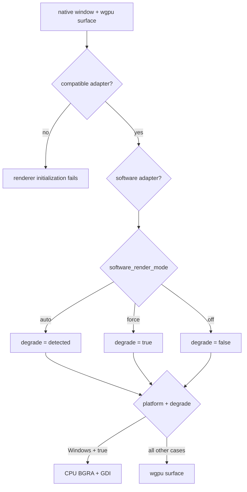
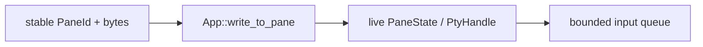

# From Keypress to Pixel

[简体中文](From-Keypress-to-Pixel-zh-CN)

This page follows one plain uppercase `A` through the current application. The
pane has focus and uses plain text encoding, without active Win32 or Kitty
keyboard negotiation. No palette, search field, copy mode, IME composition, or
key binding consumes the key.

Pressing `A` does not draw `A` directly. SonicTerm sends bytes to the child
program. It draws only bytes that return through the pseudo-terminal (PTY).
An interactive shell usually echoes the byte, which makes the round trip look
immediate.

```mermaid
flowchart LR
    key["WindowEvent::KeyboardInput<br/>logical A"]
    encode["encode_key / encode_logical<br/>UTF-8 0x41"]
    inq["bounded PTY input queue"]
    writer["sonic-pty-writer"]
    child["child process"]
    reader["sonic-pty-reader"]
    outq["bounded PTY output queue"]
    worker["per-pane VT worker"]
    parser["Parser::advance_with_replies / Performer"]
    grid["Grid cell A<br/>dirty row + revision"]
    event["RequestRedraw(WindowId)"]
    frame["complete PaneRender frame"]
    font["FontStack + GlyphAtlas"]
    choice{"presenter"}
    wgpu["retained wgpu frame"]
    cpu["WindowsSoftwareFrame + GDI"]
    pixels(["window pixels"])

    key --> encode --> inq --> writer --> child
    child --> reader --> outq --> worker --> parser --> grid
    grid --> event --> frame --> font --> choice
    choice -- "wgpu" --> wgpu --> pixels
    choice -- "Windows degraded" --> cpu --> pixels
```

### 1. Window setup prepares the path

`App::do_resumed` creates the first native window and renderer, enables IME,
and records the monitor period. Later windows share the first adapter/device/queue
through `GpuSharedContext`, but own their surfaces and drawing state.

Every presenter requires successful wgpu initialization: Windows CPU/GDI is not
an adapter-free recovery path. Adapter classification and `auto`/`force`/`off`
policy are separate; see [Rendering Modes](Rendering-Modes) for their exact rules.

The renderer prepares a retained frame, body/footer/title font stacks, separate
glyph and image atlases, and row caches. Surface and pacing policy are detailed
in [Rendering Modes](Rendering-Modes); allocations are listed in [Memory](Memory).

### 2. The key reaches the active input owner

winit sends `WindowEvent::KeyboardInput` for presses, repeats, and releases.
SonicTerm retains the complete event: the physical key, layout-resolved logical
key, operating-system-produced text, keypad location, event state, and repeat
marker. For this example the layout has resolved the logical character and text
as uppercase `A`.

A local input owner may stop the route. Main and child windows share the same
source-`WindowId` first-press policy:

1. quit confirmation;
2. command palette;
3. active IME composition;
4. search;
5. READONLY or copy mode;
6. configured keymap;
7. PTY encoding.

Previously accepted repeats and releases keep their recorded terminal owners
before this first-press policy runs. An open search and active composition take
precedence over READONLY navigation in every window. Quick-select hint keys stay
with the hint overlay instead of becoming application shortcuts. Quit warnings
belong to the event's source window, without changing recorded native focus.
Unknown, removed and unpromoted warm windows cannot fall through to main input.

IME events use one `WindowId`-scoped handler before the main/child dispatch split.
The source window's palette consumes composition first; otherwise that window's
IME state supplies committed UTF-8. Its active search owns the commit before
READONLY/copy mode can discard it; without either owner, the source pane receives
it through the existing PTY and broadcast boundaries. Focus in another window
cannot redirect it, and an unknown or removed window does nothing. An open search
retains ownership even if its pane is temporarily missing. Search commits and
search keystrokes share window-scoped handlers that preserve viewport anchoring.
While composition is active, the shared keyboard route suppresses raw input.
Modifier changes and focus cleanup also resolve the source window explicitly:
blur releases its accepted native keys and latched pointer gesture, cancels its
preedit, and reports focus only to its active pane. Focus-in resets its IME caret
throttle without toggling the native input context.

The terminal IME anchor uses the active pane's physical origin, content padding,
and cursor cell with live physical cell metrics. It adds each offset once,
without another DPI multiplication. Each window coalesces identical
`(pane id, physical position, physical size)` updates; equal-cell focus changes,
zoom, transfer, font/padding changes, and resize still update the native anchor.
Palette and search retain their separate field anchors and reset the terminal
anchor cache before returning input ownership.

Only a press that survives local routing and reaches at least one bounded PTY
input queue is recorded as PTY-owned. Its accepted pane set stays fixed for the
whole lifecycle: repeats consult it before any palette, search, or keymap owner
that opened later, and releases return to it even if focus or broadcast state
changed. Native Win32 routes additionally retain their accepted protocol epoch;
a protocol transition or reset cancels them, and focus loss drains their
synthetic releases while Win32 remains active. A locally consumed or rejected
press creates no orphan repeat or release event.

### 3. `A` becomes terminal input bytes

The app selects the encoding protocol from one coherent pane snapshot. On
Windows, requested Win32 input with no active Kitty flags uses the native
metadata carried by that event; it does not reconstruct a key from UTF-8 text.
Other routes call `encode_key`. In this plain-text example, `Key::Character`
with no Control or Alt modifier uses the operating-system-produced UTF-8 text
unchanged.

| Property | Value |
| --- | --- |
| Character | `A` |
| Code point | `U+0041` |
| UTF-8 | `0x41` |
| Decimal byte | `65` |

Modified, keypad, Win32, and Kitty encodings follow the [keyboard protocol reference](Terminal-IO-and-VT). This example remains UTF-8 `0x41`.

### 4. The bytes enter one or more PTYs

The app writes the focused source pane exactly once. Broadcast adds peers only
when the focused pane is still the pane that armed broadcast.
`BroadcastScope::Tab` selects peers in that tab.
`BroadcastScope::AllTabs` selects peers across tabs and windows. The source is
excluded from the receiver set.

Each destination crosses this live boundary:

There is no transient state machine on the native input or broadcast path.
Explicit `AppIntent::PtyWrite` and `AppEffect::PtyWrite` enter the same bounded
write boundary with their named pane id. Window-targeted compatibility input
resolves that live window's active pane, never a zero sentinel or guessed
frontmost window. A missing target cannot redirect bytes to another terminal.

`PtyHandle::send_input_nonblocking` uses `try_send`:

- queue capacity: 4 messages per pane;
- message limit: 16 MiB;
- rejection cases: `MessageTooLarge`, `QueueFull`, `WriterDisconnected`.

Every `PtyInputError` retains the rejected `Vec<u8>` at the IO boundary. The app
drops those bytes before posting metadata-only `UserEvent::PtyInputRejected`.
It logs pane identity, the current window, producer-assigned input category,
byte count, reason, and concurrent queue/writer observations, then notifies the
pane's window if it still exists. It does not retry automatically because the
child's input state may change before a later replay.

The dedicated `sonic-pty-writer` thread removes the owned byte vector, calls
`write_all`, then attempts a best-effort `flush`. A failed write stops the
writer. At this point SonicTerm has drawn no `A`.

### 5. The child decides what comes back

The child program receives `0x41` from its PTY side. An ordinary interactive
shell usually has echo enabled, so `0x41` returns as output. Echo belongs to the
child-side terminal behavior, not to SonicTerm.

A raw-mode editor can consume `A` and send a larger redraw. A password prompt
can send no visible output. A program can send different text. SonicTerm parses
only the bytes that return through the PTY master.

On Unix, `portable-pty` supplies a native PTY. On Windows it supplies ConPTY.
The shared byte, VT, grid, font, and renderer path starts after this platform
boundary.

### 6. The PTY reader applies bounded back-pressure

`sonic-pty-reader` reads into a reusable contiguous 64 KiB `BytesMut`
allocation. It splits filled prefixes into reference-counted `Bytes` views and
wraps them in `PtyOutputChunk`. This is reusable flat storage, not a circular
ring data structure. If old views pin the allocation, `reserve` can allocate
another 64 KiB ring.

The output channel holds 64 chunks. A full channel does not drop output. The
reader waits in a blocking select, which lets the operating system's PTY buffers
apply back-pressure to the child.

The channel can hold 64 chunks. The reader constructs one more chunk before a
full-channel send blocks. If every chunk pins a distinct 64 KiB ring, the
structural maximum is 65 rings, or 4.0625 MiB. Small shell output normally keeps
many queued views in one ring. `queued_output_bytes` reports pinned ring
allocation; `queued_output_payload_bytes` reports bytes waiting to be parsed.

A pane created through the main path uses `sonicterm-vt-loop`. A pane created
directly in a torn-out window uses `sonicterm-vt-loop-child`. A pane whose PTY
spawn fails remains visible but has no PTY reader, writer, or VT worker.

### 7. The VT parser updates the grid

The pane worker receives a chunk and holds that pane's parser lock for
`Parser::advance_with_replies` and its keyboard-input snapshot. A reply-producing
dispatch yields the consumed prefix, events, and replies; the worker releases
the lock before handling events and batching replies, then resumes the remaining
suffix. Complete replies reach the separate reply FIFO outside parser locks.

Plain ASCII `A` takes the parser's printable fast path to
`Performer::print_graphic`. Other printable UTF-8 reaches the same operation
through vte. Controls and escapes use `execute`, `csi_dispatch`, `osc_dispatch`,
`esc_dispatch`, or DCS `hook`/`put`/`unhook`. Kitty graphics APC input is
intercepted before vte.

The performer applies the current foreground, background, bold, italic,
underline, inverse, and hyperlink id. The URI remains in the hyperlink registry.
The performer then calls the grid.

`Grid::put_char_styled_in_region` stores `A` as a width-one `Cell`. It advances
the cursor in the ordinary case, marks the row dirty, advances the row content
sequence, and advances the coarse grid revision.

At the right margin, autowrap sets a one-past-edge cursor and `pending_wrap`.
The next printable character performs the wrap. Only that actual transition
marks the destination `Line` as soft-wrapped from its predecessor; a pending
wrap alone records nothing persistent. LF, VT, FF, IND, NEL, full-row erase,
structural region scrolling, row recycling, and non-reflow resize clear
provenance where continuity cannot be proved. The bit is packed into the row's
existing content-sequence word, so `Line` does not grow, and it participates in
row equality and hashing. Without autowrap, the cursor stays on the final
column.

Dirty means “this row changed.” The dirty bit, content sequence, wrap provenance,
and grid revision are separate bookkeeping signals for repaint work, logical
line identity, content identity, and coarse frame identity.

Local-target lookup can walk backward and forward through at most eight visible
rows joined by recorded automatic wraps, flattening at most 4 KiB while retaining
a byte-to-absolute-cell map. Hard line breaks, an offscreen edge, an evicted
predecessor, or a ninth row fail closed. The asynchronous
probe key binds the ordered row fingerprints and wrap bits, screen incarnation,
viewport, exact pane CWD, candidate spans, and pointed absolute cell. Activation
rebuilds that key before native target revalidation.

Cell representation is a separate concern. Wide characters use `WIDE` and
`WIDE_CONT` cells. Zero-width characters append to the lead cell's `extras`,
capped by `MAX_CELL_EXTRAS_BYTES = 64`; a code point that would exceed the cap
is dropped.

### 8. The VT worker requests a later redraw

While holding the parser lock, the worker publishes the packed `keyboard_input`
snapshot, including keyboard modes, Kitty flags, and the protocol epoch. After
unlocking, it updates `cursor_visible` from returned `VtEvent::CursorVisibility`
events and handles clipboard, command, and media events. Calls to the event-loop
proxy also occur outside the parser lock.

Redraw requests are coalesced by bytes and time:

- 128 KiB pending output flushes immediately;
- 8 ms maximum pending age flushes a continuing stream;
- otherwise 3 ms without another chunk flushes trailing output.

At a flush boundary, the worker copies the pane's current `WindowId` under a
short redraw-target lock. It releases that lock and sends
`UserEvent::RequestRedraw(WindowId)`. The winit thread looks up the live window
and calls `request_redraw()`. A stale id is ignored.

This indirection lets a pane move between windows. Transfer changes the shared
`WindowId`; the existing worker and child process continue unchanged. The
receiving tab is activated before its visible grids and PTYs are resized to the
destination pane rectangles, without a whole-window intermediate size.
Zoom-hidden siblings keep their prior size until they become visible.

A second pacing gate may defer streaming output to the next frame boundary.
Hardware keeps pure input redraws immediate. PTY output is bounded by the
monitor frame period. Resolved degradation also coalesces pure input redraws to
the software frame period. A timed `ControlFlow::WaitUntil` wakes the event loop
and requests the frame again.

### 9. The event loop builds a complete frame

On `RedrawRequested`, the app computes the active tab's pane rectangles. It
uses `try_lock` for every required inline-image store and every active-tab
parser, and keeps all parser guards for the render call. If one lock is
unavailable, it drops every collected guard, records a pending redraw, and
returns without calling the renderer. The frame is complete or absent;
SonicTerm does not present a mix of old and new pane state.

For each visible pane, the app builds `PaneRender` with:

- stable pane id;
- mutable grid view;
- pixel rectangle and viewport;
- active status and cursor style;
- broadcast-receiver status;
- scrollbar alpha;
- shallow-cloned inline-image records with shared `Arc<[u8]>` pixels.

The production call passes the pane slice plus explicit theme, cursor,
selection, copy mode, tabs, search, palette, IME, viewport, notification, and
hovered-URL data to `GpuRenderer::render`. It does not construct one aggregate
`RenderInputs` value.

### 10. Damage and row caches select work

A changed `FrameKey` triggers work. Primary-screen changes damage dirty-row
strips; an alternate-screen change damages its complete pane. UI changes can
require the full surface. Row caches reuse unchanged glyphs and backgrounds.
An identical key skips assembly; Windows degraded presentation may reblit its
existing CPU frame. Exact keys, capacity, pane eviction, and damage rules live in
[Rendering and Fonts](Rendering-and-Fonts).

### 11. Text becomes glyph instances

Cells with compatible font style form runs. A conservative printable-ASCII run
can skip full shaping. Each cell must contain printable ASCII, no combining
`extras`, no wide-cell flag, and none of these ligature triggers:
`= ! < > - _ : | & *`. Plain `A` qualifies.

The shortcut is not a second font system. An atlas miss still calls
`FontStack::rasterize`. Unicode, combining text, fallback fonts, and
ligature-capable runs call `FontStack::shape_text_with_style`, which uses
HarfBuzz and maps shaped clusters back to terminal columns.

The font stack tries the configured family, configured fallbacks, then native
discovery. Matching, platform rasterizers, color, and decorations are detailed
in [Rendering and Fonts](Rendering-and-Fonts).

### 12. Rasterization fills the glyph atlas

Rasterization returns a bitmap and placement metrics: width, height, bearing,
advance, and whether the data is monochrome, subpixel, or self-colored. This is
a reusable tile, not a screen pixel.

`GlyphAtlas::get_or_insert` reuses a cached tile or allocates a rasterized one.
`GlyphInstance` records its screen rectangle, atlas UVs, foreground, and sampling
flags. If atlas eviction invalidates earlier instances in this frame, the
renderer abandons it and retries without clearing dirty rows. The next frame
disables eviction until one presentation succeeds. Atlas storage and fallback
sentinels are documented in [Rendering and Fonts](Rendering-and-Fonts).

### 13. The selected presenter produces pixels

On wgpu, `AtlasUpload::sync` uploads dirty rectangles; a cached `A` needs no
upload. Drawing updates the retained offscreen frame inside its damage scissor,
blits it to the surface, submits commands, and calls `queue.present(frame)`.

On Windows with degradation enabled, the same prepared instances are composed
into a full CPU BGRA frame and presented with `SetDIBitsToDevice`. CPU atlas bytes
remain unchanged; the GPU mirrors are placeholders. Color conversion, layer order,
sampling, and size limits are specified in [Rendering and Fonts](Rendering-and-Fonts).

### 14. Success clears the dirty row

Windows CPU presentation calls `finish_successful_frame` only after
`SetDIBitsToDevice` returns success. wgpu calls it after command submission and
`queue.present(frame)`. The wgpu present call itself has no success result for a
later compositor failure.

`finish_successful_frame` stores the new `FrameKey`, increments the successful
frame count, and clears dirty rows only when pane identity and grid revision still match the frame plan.

Before a wgpu draw:

- timeout or occlusion invalidates the key and requests another redraw;
- outdated or suboptimal also reconfigures the surface;
- lost recreates the surface;
- validation errors return an error.

None of those acquisition paths clears dirty rows. An eviction-aborted frame
also leaves them set. `RenderMode::Noop` stores a key but does not present or
clear dirty rows because it produced no image.

After a drawn frame completes, the window compositor and display system scan out
the newly presented pixels. The echoed `A` is now visible.

### Cache invalidation triggers

Font, DPI, theme, surface, and pane-layout changes invalidate the affected
frame/cache identity. See [Rendering and Fonts](Rendering-and-Fonts) for the
exact operations; [Architecture Internals](Architecture-Internals) defines when
dirty rows may be acknowledged.

### What happens when the pane closes

Dropping `PtyHandle` cancels I/O and terminates the child, then performs bounded
platform-specific close and reaping. Incomplete cleanup is not success. See
[Runtime Lifecycle](Runtime-Lifecycle) for close order and
[Architecture Internals](Architecture-Internals) for Unix/ConPTY deadlines.
Validation and release evidence are described in
[Development and Release](Development-and-Release), not inferred from this journey.

### Why `A` may not appear

| Boundary | Normal reason |
| --- | --- |
| Local input owner | palette, search, copy/READONLY mode, IME, or a key binding consumed it |
| Child program | echo is off, the program drew something else, or it emitted nothing |
| PTY input | the message was too large, the queue was full, or the writer disconnected; the app shows an error |
| Pane process | PTY spawn failed, so the visible pane has no worker |
| Frame collection | a parser or image lock was busy; the whole frame was deferred |
| Renderer | a surface or atlas recovery path requested a later frame |
| Cache | work was reused; the visible result is unchanged |

### Source map

| Step | Primary paths |
| --- | --- |
| Keyboard and IME routing | `crates/sonicterm-app/src/app/{window_event,child_window}.rs` |
| Key encoding | `crates/sonicterm-app/src/app/key_encoding.rs` |
| Intent/effect PTY boundary | `crates/sonicterm-app-core/src/{intent,effect,reducer,state_machine}.rs`, `crates/sonicterm-app/src/app/mod.rs` |
| PTY queues and threads | `crates/sonicterm-io/src/pty.rs` |
| VT workers and redraw coalescing | `crates/sonicterm-app/src/app/{spawn_pane,child_window,redraw_target}.rs` |
| VT parsing | `crates/sonicterm-vt/src/vt.rs` |
| Cell insertion and dirty rows | `crates/sonicterm-grid/src/grid.rs` |
| Frame collection | `crates/sonicterm-app/src/app/{window_event,child_window}.rs` |
| Pane frame type | `crates/sonicterm-render-model/src/pane_render.rs` |
| Damage, caches, glyph instances, and presentation | `crates/sonicterm-gpu/src/{core,row_quad_cache,software_windows}.rs` |
| Fonts | `crates/sonicterm-engine/src/fontstack.rs`, `crates/sonicterm-font/src/` |
| CPU glyph atlas and row glyph cache | `crates/sonicterm-text/src/{glyph_atlas,row_glyph_cache}.rs` |
