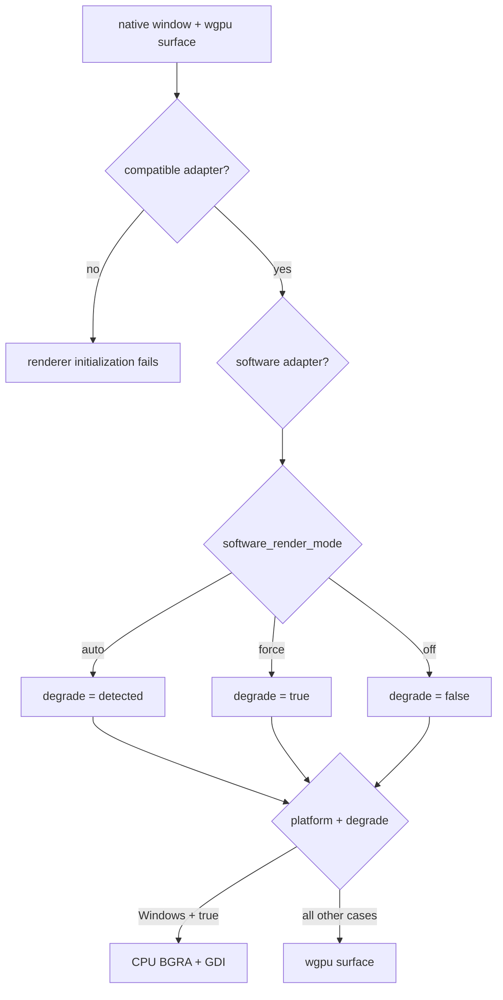
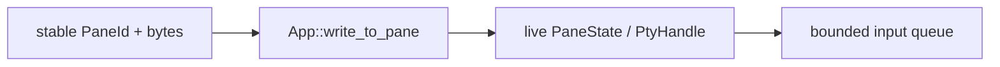
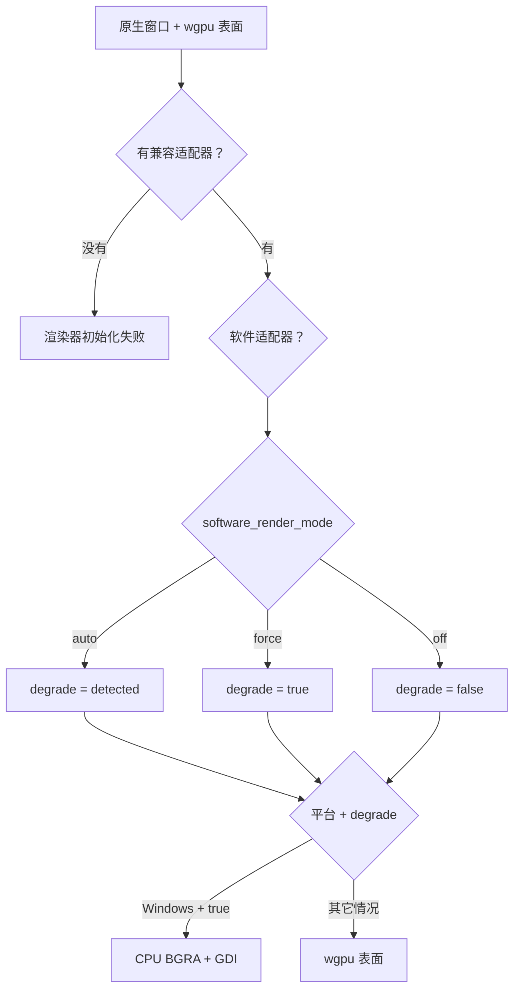

# From Keypress to Pixel / 从按键到像素

## English

This page follows one plain uppercase `A` through the current application. The
pane has focus. No palette, search field, copy mode, IME composition, or key
binding consumes the key.

Pressing `A` does not draw `A` directly. SonicTerm sends bytes to the child
program. It draws only bytes that return through the pseudo-terminal (PTY).
An interactive shell usually echoes the byte, which makes the round trip look
immediate.

### 1. Window setup prepares the path

`App::do_resumed` creates the first native window and renderer, enables IME,
and records the monitor period. Later windows share the first adapter/device/queue
through `GpuSharedContext`, but own their surfaces and drawing state.

Every presenter requires successful wgpu initialization: Windows CPU/GDI is not
an adapter-free recovery path. Adapter classification and `auto`/`force`/`off`
policy are separate; see [Rendering Modes](Rendering-Modes) for their exact rules.

The renderer prepares a retained frame, body/footer/title font stacks, separate
glyph and image atlases, and row caches. Surface and pacing policy are detailed
in [Rendering Modes](Rendering-Modes); allocations are listed in [Memory](Memory).

### 2. The key reaches the active input owner

winit sends `WindowEvent::KeyboardInput` for presses, repeats, and releases.
SonicTerm retains the complete event: the physical key, layout-resolved logical
key, operating-system-produced text, keypad location, event state, and repeat
marker. For this example the layout has resolved the logical character and text
as uppercase `A`.

A local input owner may stop the route. The main window checks:

1. quit confirmation;
2. command palette;
3. active IME composition;
4. search;
5. READONLY or copy mode;
6. configured keymap;
7. PTY encoding.

A torn-out window checks quit confirmation first, then its local copy mode,
attached palette, active IME composition, search, keymap, and PTY encoding.
The copy-mode position differs because child-window state is local to that
`WindowState`.

While an IME composition is active, raw key events do not reach the PTY. An
`Ime::Commit` supplies UTF-8 text after composition. A palette or search field
can consume that commit. READONLY or copy mode can discard it.

The terminal IME anchor uses the active pane's physical origin, content padding,
and cursor cell with live physical cell metrics. It adds each offset once,
without another DPI multiplication. Each window coalesces identical
`(pane id, physical position, physical size)` updates; equal-cell focus changes,
zoom, transfer, font/padding changes, and resize still update the native anchor.
Palette and search retain their separate field anchors and reset the terminal
anchor cache before returning input ownership.

Only a press that survives local routing and reaches at least one bounded PTY
input queue is recorded as PTY-owned. Its accepted pane set stays fixed for the
whole lifecycle: repeats consult it before any palette, search, or keymap owner
that opened later, and releases return to it even if focus or broadcast state
changed. A locally consumed or rejected press creates no orphan repeat or
release event.

### 3. `A` becomes terminal input bytes

`encode_key` consumes the complete event and the active pane's negotiated
keyboard snapshot. A plain `Key::Character` with no Control or Alt modifier
uses the operating-system-produced UTF-8 text unchanged.

| Property | Value |
| --- | --- |
| Character | `A` |
| Code point | `U+0041` |
| UTF-8 | `0x41` |
| Decimal byte | `65` |

Modified, keypad, and negotiated Kitty encodings follow the [keyboard protocol reference](Terminal-IO-and-VT). This example remains UTF-8 `0x41`.

### 4. The bytes enter one or more PTYs

The app writes the focused source pane exactly once. Broadcast adds peers only
when the focused pane is still the pane that armed broadcast.
`BroadcastScope::Tab` selects peers in that tab.
`BroadcastScope::AllTabs` selects peers across tabs and windows. The source is
excluded from the receiver set.

Each destination crosses this live boundary:

There is no transient state machine on the native input or broadcast path.
Explicit `AppIntent::PtyWrite` and `AppEffect::PtyWrite` enter the same bounded
write boundary with their named pane id. Window-targeted compatibility input
resolves that live window's active pane, never a zero sentinel or guessed
frontmost window. A missing target cannot redirect bytes to another terminal.

`PtyHandle::send_input_nonblocking` uses `try_send`:

- queue capacity: 4 messages per pane;
- message limit: 16 MiB;
- rejection cases: `MessageTooLarge`, `QueueFull`, `WriterDisconnected`.

Every `PtyInputError` retains the rejected `Vec<u8>` at the IO boundary. The app
drops those bytes before posting metadata-only `UserEvent::PtyInputRejected`.
It logs pane identity, the current window, producer-assigned input category,
byte count, reason, and concurrent queue/writer observations, then notifies the
pane's window if it still exists. It does not retry automatically because the
child's input state may change before a later replay.

The dedicated `sonic-pty-writer` thread removes the owned byte vector, calls
`write_all`, then attempts a best-effort `flush`. A failed write stops the
writer. At this point SonicTerm has drawn no `A`.

### 5. The child decides what comes back

The child program receives `0x41` from its PTY side. An ordinary interactive
shell usually has echo enabled, so `0x41` returns as output. Echo belongs to the
child-side terminal behavior, not to SonicTerm.

A raw-mode editor can consume `A` and send a larger redraw. A password prompt
can send no visible output. A program can send different text. SonicTerm parses
only the bytes that return through the PTY master.

On Unix, `portable-pty` supplies a native PTY. On Windows it supplies ConPTY.
The shared byte, VT, grid, font, and renderer path starts after this platform
boundary.

### 6. The PTY reader applies bounded back-pressure

`sonic-pty-reader` reads into a reusable contiguous 64 KiB `BytesMut`
allocation. It splits filled prefixes into reference-counted `Bytes` views and
wraps them in `PtyOutputChunk`. This is reusable flat storage, not a circular
ring data structure. If old views pin the allocation, `reserve` can allocate
another 64 KiB ring.

The output channel holds 64 chunks. A full channel does not drop output. The
reader waits in a blocking select, which lets the operating system's PTY buffers
apply back-pressure to the child.

The channel can hold 64 chunks. The reader constructs one more chunk before a
full-channel send blocks. If every chunk pins a distinct 64 KiB ring, the
structural maximum is 65 rings, or 4.0625 MiB. Small shell output normally keeps
many queued views in one ring. `queued_output_bytes` reports pinned ring
allocation; `queued_output_payload_bytes` reports bytes waiting to be parsed.

A pane created through the main path uses `sonicterm-vt-loop`. A pane created
directly in a torn-out window uses `sonicterm-vt-loop-child`. A pane whose PTY
spawn fails remains visible but has no PTY reader, writer, or VT worker.

### 7. The VT parser updates the grid

The pane worker receives a chunk and holds that pane's parser lock for
`Parser::advance` and parser-derived snapshots.

Plain ASCII `A` takes the parser's printable fast path to
`Performer::print_graphic`. Other printable UTF-8 reaches the same operation
through vte. Controls and escapes use `execute`, `csi_dispatch`, `osc_dispatch`,
`esc_dispatch`, or DCS `hook`/`put`/`unhook`. Kitty graphics APC input is
intercepted before vte.

The performer applies the current foreground, background, bold, italic,
underline, inverse, and hyperlink id. The URI remains in the hyperlink registry.
The performer then calls the grid.

`Grid::put_char_styled_in_region` stores `A` as a width-one `Cell`. It advances
the cursor in the ordinary case, marks the row dirty, advances the row content
sequence, and advances the coarse grid revision.

At the right margin, autowrap sets a one-past-edge cursor and `pending_wrap`.
The next printable character performs the wrap. Only that actual transition
marks the destination `Line` as soft-wrapped from its predecessor; a pending
wrap alone records nothing persistent. LF, VT, FF, IND, NEL, full-row erase,
structural region scrolling, row recycling, and non-reflow resize clear
provenance where continuity cannot be proved. The bit is packed into the row's
existing content-sequence word, so `Line` does not grow, and it participates in
row equality and hashing. Without autowrap, the cursor stays on the final
column.

Dirty means “this row changed.” The dirty bit, content sequence, wrap provenance,
and grid revision are separate bookkeeping signals for repaint work, logical
line identity, content identity, and coarse frame identity.

Local-target lookup can walk backward and forward across at most eight recorded
wrap boundaries, flattening at most 4 KiB while retaining a byte-to-absolute-cell
map. Every row must remain visible. Hard line breaks, an offscreen edge, an
evicted predecessor, or a ninth continuation fail closed. The asynchronous
probe key binds the ordered row fingerprints and wrap bits, screen incarnation,
viewport, exact pane CWD, candidate spans, and pointed absolute cell. Activation
rebuilds that key before native target revalidation.

Cell representation is a separate concern. Wide characters use `WIDE` and
`WIDE_CONT` cells. Zero-width characters append to the lead cell's `extras`,
capped by `MAX_CELL_EXTRAS_BYTES = 64`; a code point that would exceed the cap
is dropped.

### 8. The VT worker requests a later redraw

The worker mirrors cursor visibility, Kitty keyboard flags, and the packed
DECCKM/DECKPAM/DECBKM/newline/`modifyOtherKeys` snapshot into atomics while it
holds the parser lock. It collects title, command, and media side effects. It
then releases the parser lock before it reaches the event-loop proxy.

Redraw requests are coalesced by bytes and time:

- 128 KiB pending output flushes immediately;
- 8 ms maximum pending age flushes a continuing stream;
- otherwise 3 ms without another chunk flushes trailing output.

At a flush boundary, the worker copies the pane's current `WindowId` under a
short redraw-target lock. It releases that lock and sends
`UserEvent::RequestRedraw(WindowId)`. The winit thread looks up the live window
and calls `request_redraw()`. A stale id is ignored.

This indirection lets a pane move between windows. Transfer changes the shared
`WindowId`; the existing worker and child process continue unchanged. The
receiving tab is activated before its visible grids and PTYs are resized to the
destination pane rectangles, without a whole-window intermediate size.
Zoom-hidden siblings keep their prior size until they become visible.

A second pacing gate may defer streaming output to the next frame boundary.
Hardware keeps pure input redraws immediate. PTY output is bounded by the
monitor frame period. Resolved degradation also coalesces pure input redraws to
the software frame period. A timed `ControlFlow::WaitUntil` wakes the event loop
and requests the frame again.

### 9. The event loop builds a complete frame

On `RedrawRequested`, the app computes the active tab's pane rectangles. It
uses `try_lock` for every required inline-image store and every active-tab
parser, and keeps all parser guards for the render call. If one lock is
unavailable, it drops every collected guard, records a pending redraw, and
returns without calling the renderer. The frame is complete or absent;
SonicTerm does not present a mix of old and new pane state.

For each visible pane, the app builds `PaneRender` with:

- stable pane id;
- mutable grid view;
- pixel rectangle and viewport;
- active status and cursor style;
- broadcast-receiver status;
- scrollbar alpha;
- shallow-cloned inline-image records with shared `Arc<[u8]>` pixels.

The production call passes the pane slice plus explicit theme, cursor,
selection, copy mode, tabs, search, palette, IME, viewport, notification, and
hovered-URL data to `GpuRenderer::render`. It does not construct one aggregate
`RenderInputs` value.

### 10. Damage and row caches select work

A changed `FrameKey` triggers work. Primary-screen changes damage dirty-row
strips; an alternate-screen change damages its complete pane. UI changes can
require the full surface. Row caches reuse unchanged glyphs and backgrounds.
An identical key skips assembly; Windows degraded presentation may reblit its
existing CPU frame. Exact keys, capacity, pane eviction, and damage rules live in
[Rendering and Fonts](Rendering-and-Fonts).

### 11. Text becomes glyph instances

Cells with compatible font style form runs. A conservative printable-ASCII run
can skip full shaping. Each cell must contain printable ASCII, no combining
`extras`, no wide-cell flag, and none of these ligature triggers:
`= ! < > - _ : | & *`. Plain `A` qualifies.

The shortcut is not a second font system. An atlas miss still calls
`FontStack::rasterize`. Unicode, combining text, fallback fonts, and
ligature-capable runs call `FontStack::shape_text_with_style`, which uses
HarfBuzz and maps shaped clusters back to terminal columns.

The font stack tries the configured family, configured fallbacks, then native
discovery. Matching, platform rasterizers, color, and decorations are detailed
in [Rendering and Fonts](Rendering-and-Fonts).

### 12. Rasterization fills the glyph atlas

Rasterization returns a bitmap and placement metrics: width, height, bearing,
advance, and whether the data is monochrome, subpixel, or self-colored. This is
a reusable tile, not a screen pixel.

`GlyphAtlas::get_or_insert` reuses a cached tile or allocates a rasterized one.
`GlyphInstance` records its screen rectangle, atlas UVs, foreground, and sampling
flags. If atlas eviction invalidates earlier instances in this frame, the
renderer abandons it and retries without clearing dirty rows. The next frame
disables eviction until one presentation succeeds. Atlas storage and fallback
sentinels are documented in [Rendering and Fonts](Rendering-and-Fonts).

### 13. The selected presenter produces pixels

On wgpu, `AtlasUpload::sync` uploads dirty rectangles; a cached `A` needs no
upload. Drawing updates the retained offscreen frame inside its damage scissor,
blits it to the surface, submits commands, and calls `queue.present(frame)`.

On Windows with degradation enabled, the same prepared instances are composed
into a full CPU BGRA frame and presented with `SetDIBitsToDevice`. CPU atlas bytes
remain unchanged; the GPU mirrors are placeholders. Color conversion, layer order,
sampling, and size limits are specified in [Rendering and Fonts](Rendering-and-Fonts).

### 14. Success clears the dirty row

Windows CPU presentation calls `finish_successful_frame` only after
`SetDIBitsToDevice` returns success. wgpu calls it after command submission and
`queue.present(frame)`. The wgpu present call itself has no success result for a
later compositor failure.

`finish_successful_frame` stores the new `FrameKey`, increments the successful
frame count, and clears dirty rows only when pane identity and grid revision still match the frame plan.

Before a wgpu draw:

- timeout or occlusion invalidates the key and requests another redraw;
- outdated or suboptimal also reconfigures the surface;
- lost recreates the surface;
- validation errors return an error.

None of those acquisition paths clears dirty rows. An eviction-aborted frame
also leaves them set. `RenderMode::Noop` stores a key but does not present or
clear dirty rows because it produced no image.

After a drawn frame completes, the window compositor and display system scan out
the newly presented pixels. The echoed `A` is now visible.

### Cache invalidation triggers

Font, DPI, theme, surface, and pane-layout changes invalidate the affected
frame/cache identity. See [Rendering and Fonts](Rendering-and-Fonts) for the
exact operations; [Architecture Internals](Architecture-Internals) defines when
dirty rows may be acknowledged.

### What happens when the pane closes

Dropping `PtyHandle` cancels I/O and terminates the child, then performs bounded
platform-specific close and reaping. Incomplete cleanup is not success. See
[Runtime Lifecycle](Runtime-Lifecycle) for close order and
[Architecture Internals](Architecture-Internals) for Unix/ConPTY deadlines.
Validation and release evidence are described in
[Development and Release](Development-and-Release), not inferred from this journey.

### Why `A` may not appear

| Boundary | Normal reason |
| --- | --- |
| Local input owner | palette, search, copy/READONLY mode, IME, or a key binding consumed it |
| Child program | echo is off, the program drew something else, or it emitted nothing |
| PTY input | the message was too large, the queue was full, or the writer disconnected; the app shows an error |
| Pane process | PTY spawn failed, so the visible pane has no worker |
| Frame collection | a parser or image lock was busy; the whole frame was deferred |
| Renderer | a surface or atlas recovery path requested a later frame |
| Cache | work was reused; the visible result is unchanged |

### Source map

| Step | Primary paths |
| --- | --- |
| Keyboard and IME routing | `crates/sonicterm-app/src/app/{window_event,child_window}.rs` |
| Key encoding | `crates/sonicterm-app/src/app/key_encoding.rs` |
| Intent/effect PTY boundary | `crates/sonicterm-app-core/src/{intent,effect,reducer,state_machine}.rs`, `crates/sonicterm-app/src/app/mod.rs` |
| PTY queues and threads | `crates/sonicterm-io/src/pty.rs` |
| VT workers and redraw coalescing | `crates/sonicterm-app/src/app/{spawn_pane,child_window,redraw_target}.rs` |
| VT parsing | `crates/sonicterm-vt/src/vt.rs` |
| Cell insertion and dirty rows | `crates/sonicterm-grid/src/grid.rs` |
| Frame collection | `crates/sonicterm-app/src/app/{window_event,child_window}.rs` |
| Pane frame type | `crates/sonicterm-render-model/src/pane_render.rs` |
| Damage, caches, glyph instances, and presentation | `crates/sonicterm-gpu/src/{core,row_quad_cache,software_windows}.rs` |
| Fonts | `crates/sonicterm-engine/src/fontstack.rs`, `crates/sonicterm-font/src/` |
| CPU glyph atlas and row glyph cache | `crates/sonicterm-text/src/{glyph_atlas,row_glyph_cache}.rs` |

## 中文

本页跟踪大写英文字母 `A` 在当前应用中的完整路径。假设窗格已经获得焦点，并且命令面板、
搜索框、复制模式、输入法组字和键位绑定都没有接管该按键。

按下 `A` 不会直接画出 `A`。SonicTerm 先把字节发给子程序。只有子程序通过伪终端
（PTY）送回来的字节才会进入画面。交互式 shell 通常会回显该字节，所以整个往返看起来
几乎没有延迟。

### 1. 窗口初始化准备整条路径

`App::do_resumed` 创建首个原生窗口和渲染器，启用输入法并记录显示器周期。
后续窗口通过 `GpuSharedContext` 共享第一套适配器/设备/队列，但各自拥有表面与绘制状态。

所有呈现器都要求 wgpu 初始化成功；Windows CPU/GDI 不是无需适配器的恢复路径。
适配器分类与 `auto`/`force`/`off` 策略相互独立，准确规则见[渲染模式](Rendering-Modes)。

渲染器准备保留帧、正文/页脚/标题字体栈、独立字形/图像图集及行缓存。
表面与帧节奏策略见[渲染模式](Rendering-Modes)，分配清单见[内存](Memory)。

### 2. 按键先交给当前输入所有者

winit 会为按下、重复和释放发送 `WindowEvent::KeyboardInput`。SonicTerm 保留完整事件：
物理按键、由布局解析的逻辑按键、操作系统生成的文本、小键盘位置、事件状态和重复标记。
在本例中，键盘布局已把逻辑字符和文本解析为大写 `A`。

本地输入所有者可以中止后续路径。主窗口按以下顺序检查：

1. 退出确认；
2. 命令面板；
3. 活跃输入法组字；
4. 搜索；
5. READONLY 或复制模式；
6. 配置键位；
7. PTY 编码。

拆出窗口先检查退出确认，然后依次检查本窗口的复制模式、附着的命令面板、输入法组字、
搜索、键位和 PTY 编码。复制模式的位置不同，因为子窗口把这份状态保存在自己的
`WindowState` 中。

输入法正在组字时，原始按键不会进入 PTY。`Ime::Commit` 在组字完成后提供 UTF-8 文本。
命令面板或搜索框可以消费提交文本。READONLY 或复制模式可以丢弃它。

终端输入法锚点由活动窗格的物理原点、内容内边距和光标单元格结合实时物理字格度量计算。
每个偏移只加一次，不再次乘 DPI。各窗口按 `(窗格 id、物理位置、物理尺寸)` 合并重复更新，
但相同单元格下的焦点切换、缩放、转移、字体/内边距变化和尺寸变化仍会更新原生锚点。
命令面板和搜索框保留各自的输入字段锚点，并在归还输入所有权前重置终端锚点缓存。

只有通过所有本地路由、且至少进入一个有界 PTY 输入队列的按下事件才会记为 PTY 所有。
成功接收的 pane 集合在整个按键生命周期内保持不变：重复事件会在后来打开的命令面板、搜索框
或 keymap owner 之前查询该集合；即使焦点或广播状态改变，释放事件也会返回该集合。本地消费
或被队列拒绝的按下事件不会产生孤立的重复或释放事件。

### 3. `A` 变成终端输入字节

`encode_key` 使用完整事件和活动 pane 已协商的键盘快照。普通 `Key::Character` 在没有
Control 或 Alt 时，会原样使用操作系统生成文本的 UTF-8 字节。

| 属性 | 值 |
| --- | --- |
| 字符 | `A` |
| 码点 | `U+0041` |
| UTF-8 | `0x41` |
| 十进制字节 | `65` |

修饰键、小键盘和已协商 Kitty 编码见[键盘协议参考](Terminal-IO-and-VT)。本例仍为 UTF-8 `0x41`。

### 4. 字节进入一个或多个 PTY

应用只向获得焦点的源窗格写一次。只有当前窗格仍是开启广播的源窗格时，才会添加接收窗格。
`BroadcastScope::Tab` 选择同一标签页的其它窗格。`BroadcastScope::AllTabs` 选择跨标签页和
窗口的其它窗格。接收集合会排除源窗格。

每个目标都经过以下实时边界：

原生输入和广播路径不再构建临时状态机。显式的 `AppIntent::PtyWrite` 与
`AppEffect::PtyWrite` 按指定窗格 id 进入同一个有界写入边界。以窗口为目标的兼容输入会解析
该存活窗口的活动窗格，不使用零哨兵，也不猜测最前窗口。目标缺失时，不会把字节转给另一终端。

`PtyHandle::send_input_nonblocking` 使用 `try_send`：

- 每窗格队列容量为 4 条消息；
- 每条消息最多 16 MiB；
- 拒绝类型为 `MessageTooLarge`、`QueueFull`、`WriterDisconnected`。

每个 `PtyInputError` 在 IO 边界保留被拒绝的 `Vec<u8>`。应用先丢弃这些字节，再发送
只含元数据的 `UserEvent::PtyInputRejected`。它记录窗格标识、当前窗口、生产者指定的输入类别、
字节数、原因及并发队列/writer 观察值；窗格仍存在时在其窗口显示通知。它不会自动重试，
因为稍后重放时，子程序的输入状态可能已经改变。

专用 `sonic-pty-writer` 线程取出字节向量，调用 `write_all`，然后尝试一次不保证成功的
`flush`。写入失败会结束 writer。此时 SonicTerm 还没有画出任何 `A`。

### 5. 子程序决定返回什么

子程序从 PTY 一侧收到 `0x41`。普通交互式 shell 通常开启回显，因此 `0x41` 会作为输出
返回。回显属于子程序一侧的终端行为，不是 SonicTerm 自行显示输入。

原始模式编辑器可以消费 `A`，再发送更大的重画。密码提示可以不发送任何可见输出。
程序也可以发送不同内容。SonicTerm 只解析 PTY 主端实际返回的字节。

Unix 上由 `portable-pty` 提供原生 PTY。Windows 上由它提供 ConPTY。经过这个平台边界后，
字节、VT、网格、字体和渲染路径都是共享的。

### 6. PTY reader 施加有界背压

`sonic-pty-reader` 把数据读入可复用、连续的 64 KiB `BytesMut` 分配。它把已填充前缀拆成
带引用计数的 `Bytes` 视图，再包装为 `PtyOutputChunk`。这是可复用的平坦存储，不是循环
环形数据结构。旧视图仍占用该分配时，`reserve` 可能再分配一个 64 KiB 缓冲环。

输出通道最多保存 64 个数据块。通道满时不会丢弃输出。reader 会在阻塞 select 中等待，
让操作系统的 PTY 缓冲区向子程序施加背压。

通道最多保存 64 个数据块。reader 会先构造下一个数据块，再因通道已满而阻塞。若每个数据块
都占住不同的 64 KiB 缓冲环，结构最坏情况为 65 个缓冲环，即 4.0625 MiB。普通 shell 的
小块输出通常让许多排队视图共用一个缓冲环。`queued_output_bytes` 报告被占住的缓冲环分配量；
`queued_output_payload_bytes` 报告等待解析的负载字节。

主路径创建的窗格使用 `sonicterm-vt-loop`。直接在拆出窗口里创建的窗格使用
`sonicterm-vt-loop-child`。PTY 启动失败时，窗格仍然可见，但没有 PTY reader、writer 或
VT 工作线程。

### 7. VT 解析器修改网格

窗格工作线程收到数据块后，在 `Parser::advance` 和读取解析器快照期间持有该窗格的解析器锁。

普通 ASCII `A` 通过可打印字符快速路径进入 `Performer::print_graphic`。其它可打印 UTF-8
由 vte 解码后进入同一操作。控制字符和转义序列会调用 `execute`、`csi_dispatch`、
`osc_dispatch`、`esc_dispatch`，或 DCS 的 `hook`、`put`、`unhook`。Kitty graphics 的
APC 输入会在 vte 之前被截获。

执行器附上当前前景色、背景色、粗体、斜体、下划线、反色和超链接编号。URI 本身留在
超链接注册表中。随后执行器调用网格。

`Grid::put_char_styled_in_region` 把 `A` 保存为宽度一的 `Cell`。普通情况下，它推进光标，
把该行标脏，推进行内容序号，并推进粗粒度网格 revision。

到达右边界时，自动换行会把光标放到越过末列一格的位置，并设置 `pending_wrap`。下一个
可打印字符才真正换行。只有实际发生这次转换时，目标 `Line` 才会标记为从前一行自动软换行；
仅有 pending 状态不会留下持久标记。LF、VT、FF、IND、NEL、整行擦除、结构性区域滚动、
行复用和不做 reflow 的尺寸变化，都会在无法证明连续性时清除该 provenance。这个 bit 打包在
现有行内容序号 word 中，因此不会增大 `Line`，同时会参与行相等性和 hash。关闭自动换行时，
光标停在最后一列。

脏行表示“这一行发生了变化”。脏位、内容序号、换行 provenance 和网格 revision 是独立记账
信号，分别用于重绘工作、逻辑行身份、内容身份和粗粒度帧身份。

本地目标查找最多沿已记录的自动换行边界向前后各走到总计 8 行，并在 4 KiB 上限内扁平化，
同时保留 byte 到绝对 cell 的映射。每一行都必须仍在 viewport 内。硬换行、不可见边界、已淘汰
的前驱或第 9 个连续行都会 fail closed。异步 probe key 绑定有序行 fingerprint 与 wrap bit、
screen incarnation、viewport、准确 pane CWD、候选 span 和鼠标指向的绝对 cell。激活前会重建
该 key，再执行原生目标重新验证。

单元格如何表示字符是另一件事。宽字符使用 `WIDE` 与 `WIDE_CONT` 单元格。零宽字符附加到
首单元格的 `extras`，上限为 `MAX_CELL_EXTRAS_BYTES = 64`；超过上限的码点会被丢弃。

### 8. VT 工作线程请求稍后重绘

工作线程在持有解析器锁时，把光标可见性、Kitty keyboard flag，以及打包后的
DECCKM/DECKPAM/DECBKM/newline/`modifyOtherKeys` 快照镜像到原子值，并收集标题、命令和
媒体副作用。随后先释放解析器锁，再访问事件循环代理。

重绘请求按字节和时间合并：

- 待处理输出达到 128 KiB 时立即发出；
- 连续数据的最大等待时间为 8 ms；
- 否则，3 ms 没有新数据时发出尾部重绘。

达到任一边界后，工作线程在短暂的重绘目标锁内复制当前 `WindowId`。释放锁后，它发送
`UserEvent::RequestRedraw(WindowId)`。winit 线程查找存活窗口并调用 `request_redraw()`。
过期编号会被忽略。

这层间接关系让窗格可以跨窗口移动。转移只修改共享 `WindowId`；现有工作线程和子进程
保持不变。接收的标签页先激活，再按目标窗格矩形调整可见网格和 PTY，不经过整窗尺寸的
中间状态。缩放隐藏的兄弟窗格在再次可见之前保留原尺寸。

第二层帧节奏控制可能把持续输出推迟到下一个帧边界。硬件路径让纯输入重绘立即发生。
PTY 输出最多等待一个显示器帧周期。最终降级状态启用时，纯输入重绘也会合并到软件帧周期。
定时 `ControlFlow::WaitUntil` 会重新唤醒事件循环并请求该帧。

### 9. 事件循环构建完整帧

收到 `RedrawRequested` 后，应用先计算活动标签页的窗格矩形。它对每个必需的内联图像存储
和活动标签页解析器使用 `try_lock`，并让所有解析器锁守卫一直存活到渲染调用结束。任一锁
不可用时，应用会释放已经取得的全部锁守卫，记录待重绘状态，并在不调用渲染器的情况下
返回。帧要么完整，要么不存在；SonicTerm 不会呈现新旧窗格状态混合的画面。

应用为每个可见窗格构建 `PaneRender`，其中包含：

- 稳定窗格编号；
- 可变网格视图；
- 像素矩形和视口；
- 活动状态和光标样式；
- 广播接收状态；
- 滚动条透明度；
- 浅复制的内联图像记录，像素仍由共享 `Arc<[u8]>` 持有。

生产调用把窗格数组，以及独立的主题、光标、选区、复制模式、标签页、搜索、命令面板、
输入法、视口、通知和悬停 URL 数据交给 `GpuRenderer::render`。它不会构建一个总的
`RenderInputs` 对象。

### 10. 损伤区域和行缓存选择工作量

`FrameKey` 改变后才需要新工作。主屏幕修改损伤脏行条带；备用屏幕修改损伤整个窗格，
UI 修改可能要求完整表面。行缓存复用未变化的字形和背景。相同键跳过组帧；Windows 降级
呈现可再次 blit 已有 CPU 帧。准确的缓存键、容量、窗格淘汰和损伤规则见
[渲染与字体](Rendering-and-Fonts)。

### 11. 文字变成字形实例

字体样式兼容的单元格会组成文字段。保守的可打印 ASCII 文字段可以跳过完整塑形。每个单元格
都必须是可打印 ASCII，没有组合 `extras`，没有宽字符标志，也不能包含这些连字触发字符：
`= ! < > - _ : | & *`。普通 `A` 满足条件。

这条捷径不是第二套字体系统。图集未命中时仍会调用 `FontStack::rasterize`。Unicode、组合
文字、回退字体和可能形成连字的文字段会调用 `FontStack::shape_text_with_style`，由 HarfBuzz
塑形，再把字形簇映射回终端列。

字体栈依次尝试配置字体、回退字体和原生发现。匹配、平台光栅器、颜色和装饰细节见
[渲染与字体](Rendering-and-Fonts)。

### 12. 光栅化填充字形图集

光栅化返回位图和摆放度量，包括宽度、高度、bearing、advance，以及数据属于单色、子像素还是
自带颜色。这是一块可复用的小图，不是屏幕像素。

`GlyphAtlas::get_or_insert` 复用缓存图块，或分配新光栅图块。`GlyphInstance` 保存屏幕
矩形、图集 UV、前景色和采样标志。若图集淘汰使当前帧已有实例失效，渲染器会放弃该帧并
保留脏行重试；下一帧关闭淘汰，直到成功呈现一帧。图集存储和后备哨兵见
[渲染与字体](Rendering-and-Fonts)。

### 13. 选定的呈现器产生像素

wgpu 路径通过 `AtlasUpload::sync` 上传脏矩形；已缓存的 `A` 无需上传。绘制在损伤裁剪
内更新保留离屏帧，然后复制到表面、提交命令并调用 `queue.present(frame)`。

Windows 降级路径将同一批准备好的实例合成到完整 CPU BGRA 帧，以 `SetDIBitsToDevice`
呈现。CPU 图集字节不变，GPU 镜像保持占位符。颜色转换、图层顺序、采样与尺寸限制见
[渲染与字体](Rendering-and-Fonts)。

### 14. 成功后清除脏行

Windows CPU 呈现只有在 `SetDIBitsToDevice` 成功后才调用 `finish_successful_frame`。
wgpu 在提交命令并调用 `queue.present(frame)` 后调用它。wgpu present 本身没有可表示后续
合成器失败的返回值。

`finish_successful_frame` 保存新的 `FrameKey`，增加成功帧计数，并且只在窗格身份与网格修订号仍匹配帧计划时清除脏行。

wgpu 绘制前：

- 超时或遮挡会使键失效并请求重绘；
- 过期或次优还会重新配置表面；
- 表面丢失会重新创建；
- 验证错误会返回错误。

这些路径都不会清除脏行。因图集淘汰而放弃的帧也保留脏行。`RenderMode::Noop` 会保存键，
但不呈现、不清除脏行，因为它没有生成新画面。

真正画完一帧后，窗口合成器和显示系统会把新呈现的像素送到屏幕上。回显的 `A` 此时才
出现在屏幕上。

### 缓存失效触发条件

字体、DPI、主题、表面和窗格布局变化会使相关帧/缓存身份失效。准确操作见
[渲染与字体](Rendering-and-Fonts)；脏行确认条件见[架构内部机制](Architecture-Internals)。

### 窗格关闭时会发生什么

释放 `PtyHandle` 会取消 I/O、终止子进程，再执行有时限的平台关闭与回收。未完成清理
不等于成功。关闭顺序见[运行时生命周期](Runtime-Lifecycle)，Unix/ConPTY 期限见
[架构内部机制](Architecture-Internals)。验证与发布证据见[开发与发布](Development-and-Release)，
不能仅凭这条旅程推断。

### `A` 可能不出现的原因

| 边界 | 正常原因 |
| --- | --- |
| 本地输入所有者 | 命令面板、搜索、复制/READONLY 模式、输入法或键位消费了按键 |
| 子程序 | 关闭了回显、画了其它内容，或没有输出 |
| PTY 输入 | 消息过大、队列已满或 writer 已断开；应用会显示错误 |
| 窗格进程 | PTY 启动失败，因此可见窗格没有工作线程 |
| 帧收集 | 解析器或图像锁正忙；整帧被推迟 |
| 渲染器 | 表面或图集恢复路径要求稍后重画 |
| 缓存 | 复用了已有工作；可见结果不变 |

### 源码索引

| 步骤 | 主要路径 |
| --- | --- |
| 键盘与输入法路由 | `crates/sonicterm-app/src/app/{window_event,child_window}.rs` |
| 按键编码 | `crates/sonicterm-app/src/app/key_encoding.rs` |
| 意图/效果 PTY 边界 | `crates/sonicterm-app-core/src/{intent,effect,reducer,state_machine}.rs`、`crates/sonicterm-app/src/app/mod.rs` |
| PTY 队列与线程 | `crates/sonicterm-io/src/pty.rs` |
| VT 工作线程与重绘合并 | `crates/sonicterm-app/src/app/{spawn_pane,child_window,redraw_target}.rs` |
| VT 解析 | `crates/sonicterm-vt/src/vt.rs` |
| 单元格插入与脏行 | `crates/sonicterm-grid/src/grid.rs` |
| 帧收集 | `crates/sonicterm-app/src/app/{window_event,child_window}.rs` |
| 窗格帧类型 | `crates/sonicterm-render-model/src/pane_render.rs` |
| 损伤区域、缓存、字形实例和呈现 | `crates/sonicterm-gpu/src/{core,row_quad_cache,software_windows}.rs` |
| 字体 | `crates/sonicterm-engine/src/fontstack.rs`、`crates/sonicterm-font/src/` |
| CPU 字形图集和行字形缓存 | `crates/sonicterm-text/src/{glyph_atlas,row_glyph_cache}.rs` |
