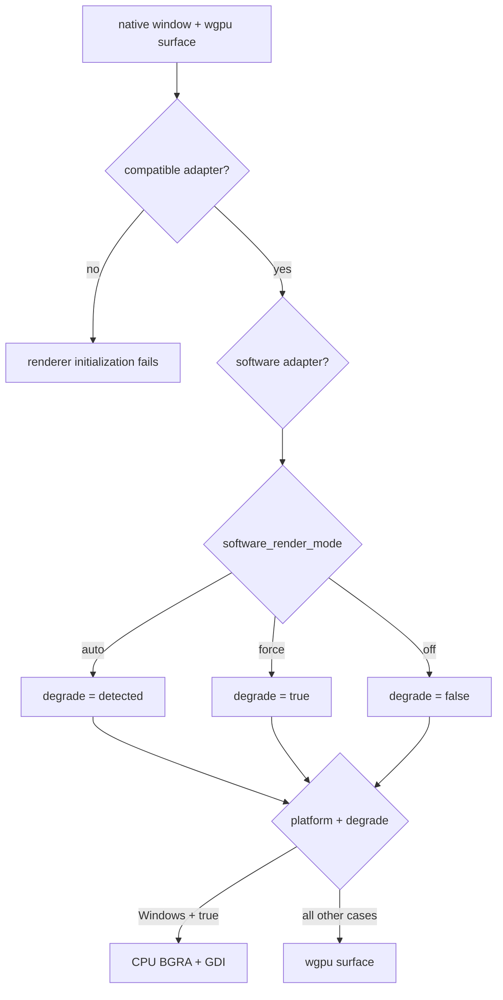
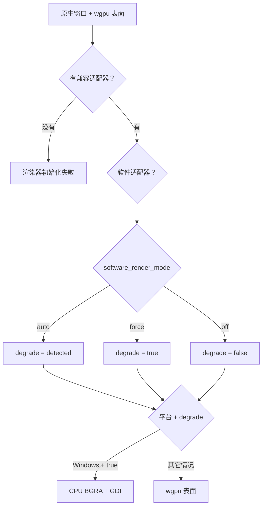

# From Keypress to Pixel / 从按键到像素

## English

This page follows one plain uppercase `A` through the current application. The
pane has focus. No palette, search field, copy mode, IME composition, or key
binding consumes the key.

Pressing `A` does not draw `A` directly. SonicTerm sends bytes to the child
program. It draws only bytes that return through the pseudo-terminal (PTY).
An interactive shell usually echoes the byte, which makes the round trip look
immediate.

```mermaid
flowchart LR
    key["WindowEvent::KeyboardInput<br/>logical A"]
    encode["encode_key / encode_logical<br/>UTF-8 0x41"]
    inq["bounded PTY input queue"]
    writer["sonic-pty-writer"]
    child["child process"]
    reader["sonic-pty-reader"]
    outq["bounded PTY output queue"]
    worker["per-pane VT worker"]
    parser["Parser::advance / Performer"]
    grid["Grid cell A<br/>dirty row + revision"]
    event["RequestRedraw(WindowId)"]
    frame["complete PaneRender frame"]
    font["FontStack + GlyphAtlas"]
    choice{"presenter"}
    wgpu["retained wgpu frame"]
    cpu["WindowsSoftwareFrame + GDI"]
    pixels(["window pixels"])

    key --> encode --> inq --> writer --> child
    child --> reader --> outq --> worker --> parser --> grid
    grid --> event --> frame --> font --> choice
    choice -- "wgpu" --> wgpu --> pixels
    choice -- "Windows degraded" --> cpu --> pixels
```



### 1. Window setup prepares the path

The first native window and renderer are created in `App::do_resumed`.
SonicTerm enables IME input, records the monitor period, and creates a wgpu
surface.

The first renderer requests a high-performance adapter compatible with that
surface. `force_fallback_adapter` is false. wgpu may still return a CPU adapter
when hardware is unavailable. Later windows reuse the first adapter, device,
and queue through `GpuSharedContext`; each window has its own surface and
renderer state.

A software adapter is detected when its device type is `Cpu`, or its name
identifies Microsoft Basic Render Driver, llvmpipe, SwiftShader, or a software
adapter. Adapter detection selects the device memory hint:

- software adapter: `MemoryHints::MemoryUsage`;
- hardware adapter: `MemoryHints::Performance`.

`[appearance].software_render_mode` then resolves presentation policy:

| Actual adapter | `auto` | `force` | `off` |
| --- | --- | --- | --- |
| Hardware | normal | degraded | normal |
| CPU/software | degraded | degraded | normal |

“Degraded” is a policy, not an adapter type. `force` degrades a hardware
adapter. `off` keeps the normal wgpu path even on WARP or another CPU adapter.
The device memory hint still follows the real adapter.

Every visible terminal window requires a usable wgpu surface, adapter, device,
and queue. There is no adapter-free renderer. Windows CPU/GDI presentation is a
branch inside an initialized `GpuRenderer`; it cannot recover from failed wgpu
startup.

These are the same setup objects described throughout this page: the renderer
owns one window's drawing state; each window owns a wgpu surface; the first
renderer obtains the shared adapter, device, and queue. Exact identifiers and
API names remain in code style below.



The renderer configures a BGRA8 sRGB surface. Normal presentation uses Mailbox
when supported and FIFO otherwise. It permits configured transparency and asks
for at most two frames of surface latency. Degraded presentation uses FIFO,
opaque alpha, and one frame of latency.

Normal frame pacing follows the monitor period. Degraded pacing uses 25 ms,
about 40 fps. While IME composition is active, it uses 83.333 ms, about 12 fps.
Degraded mode also removes fade-driven extra frames.

On macOS and Linux, both policy states still present through wgpu. On Windows,
`degrade = true` selects `WindowsSoftwareFrame` and GDI
`SetDIBitsToDevice`. Windows with WARP and `software_render_mode = "off"` uses
the normal wgpu texture and present path on the CPU adapter.

Renderer construction also creates:

- a retained offscreen frame texture;
- a fixed 2,048 × 2,048 CPU glyph atlas;
- matching GPU glyph storage, except for the Windows degraded 1 × 1 placeholder;
- a 1 × 1 inline-image atlas placeholder;
- font stacks at the window DPI;
- row glyph and background-quad caches.

### 2. The key reaches the active input owner

winit sends `WindowEvent::KeyboardInput` for presses, repeats, and releases.
SonicTerm retains the complete event: the physical key, layout-resolved logical
key, operating-system-produced text, keypad location, event state, and repeat
marker. For this example the layout has resolved the logical character and text
as uppercase `A`.

A local input owner may stop the route. The main window checks:

1. quit confirmation;
2. command palette;
3. active IME composition;
4. search;
5. READONLY or copy mode;
6. configured keymap;
7. PTY encoding.

A torn-out window checks quit confirmation first, then its local copy mode,
attached palette, active IME composition, search, keymap, and PTY encoding.
The copy-mode position differs because child-window state is local to that
`WindowState`.

While an IME composition is active, raw key events do not reach the PTY. An
`Ime::Commit` supplies UTF-8 text after composition. A palette or search field
can consume that commit. READONLY or copy mode can discard it.

Only a press that survives local routing and reaches at least one bounded PTY
input queue is recorded as PTY-owned. Its accepted pane set stays fixed for the
whole lifecycle: repeats consult it before any palette, search, or keymap owner
that opened later, and releases return to it even if focus or broadcast state
changed. A locally consumed or rejected press creates no orphan repeat or
release event.

### 3. `A` becomes terminal input bytes

`encode_key` consumes the complete event and the active pane's negotiated
keyboard snapshot. A plain `Key::Character` with no Control or Alt modifier
uses the operating-system-produced UTF-8 text unchanged.

| Property | Value |
| --- | --- |
| Character | `A` |
| Code point | `U+0041` |
| UTF-8 | `0x41` |
| Decimal byte | `65` |

Other keys and modifiers follow these rules:

- **Control and keymap precedence:** a configured keymap may consume a chord
  before PTY encoding. Otherwise Control is checked before Alt: Control+A
  becomes `0x01`, and Control+Alt+A adds an `ESC` prefix to that control byte.
  The legacy aliases cover Space/@/2, `[ /3`, `\ /4`, `] /5`, `^/~/6`,
  `_/ /7`, and `?/8`.
- **Text and BackTab:** Alt prefixes `ESC` to default legacy text. The OS supplies
  shifted and layout-specific text. Tab emits HT. At `modifyOtherKeys` level 1,
  plain Shift+Tab remains `CSI Z`, while other modified Tab forms and modified
  Enter use `CSI 27 ; modifier ; code ~`; level 2 also makes Shift+Tab
  `CSI 27 ; 2 ; 9 ~`. Level 1 keeps its ordinary Shift/Control aliases and
  Backspace exception; level 2 encodes every supported modified ordinary key.
- **Negotiated legacy modes:** the pane snapshot includes DECCKM cursor keys,
  DECKPAM keypad identity, DECBKM Backspace, ANSI newline mode, and xterm
  `modifyOtherKeys` levels 1 and 2. Modified cursor and function keys preserve
  Shift, Alt, Control, and Super in the xterm modifier parameter. Function-key
  coverage extends through F35.
- **Kitty protocol:** each main or alternate screen has an independent bounded
  progressive-enhancement stack. Unsupported set modes do nothing, and stored
  flags retain the protocol's seven data bits. SonicTerm supports
  disambiguation, event types, alternate keys, all-keys reporting, associated
  text, functional and keypad identities, and modifier-key identities.
  Alternate-key reporting alone enriches only keys already represented as
  CSI-u; it does not change raw text, DECKPAM, or terminfo encodings. Shift+Tab
  is `CSI 9 ; 2 u` when disambiguated. Repeats and releases carry Kitty event
  types when requested.
- **Keypad:** legacy normal mode follows the layout/NumLock result and preserves
  text modifiers. DECKPAM follows physical keypad identity. Kitty
  disambiguation uses its dedicated keypad code points.

Plain `A` is unaffected, so this page continues to follow it.

### 4. The bytes enter one or more PTYs

The app writes the focused source pane exactly once. Broadcast adds peers only
when the focused pane is still the pane that armed broadcast.
`BroadcastScope::Tab` selects peers in that tab.
`BroadcastScope::AllTabs` selects peers across tabs and windows. The source is
excluded from the receiver set.

Each destination crosses this boundary:

```text
AppIntent::PtyWrite → AppEffect::PtyWrite → PaneState → PtyHandle
```

The state-machine reducer for this write is pure. `write_to_pane` uses a
transient `AppStateMachine` because its broadcast caller has only `&self`.
`dispatch_pty_write_effect` resolves the pane id back to the live `PtyHandle`.

`PtyHandle::send_input_nonblocking` uses `try_send`:

- queue capacity: 4 messages per pane;
- message limit: 16 MiB;
- rejection cases: `MessageTooLarge`, `QueueFull`, `WriterDisconnected`.

Every `PtyInputError` retains the rejected `Vec<u8>`. The app posts
`UserEvent::PtyInputRejected`, logs the reason, and displays an error
notification with the byte count. It does not retry automatically because the
child's input state may change before a later replay.

The dedicated `sonic-pty-writer` thread removes the owned byte vector, calls
`write_all`, then attempts a best-effort `flush`. A failed write stops the
writer. At this point SonicTerm has drawn no `A`.

### 5. The child decides what comes back

The child program receives `0x41` from its PTY side. An ordinary interactive
shell usually has echo enabled, so `0x41` returns as output. Echo belongs to the
child-side terminal behavior, not to SonicTerm.

A raw-mode editor can consume `A` and send a larger redraw. A password prompt
can send no visible output. A program can send different text. SonicTerm parses
only the bytes that return through the PTY master.

On Unix, `portable-pty` supplies a native PTY. On Windows it supplies ConPTY.
The shared byte, VT, grid, font, and renderer path starts after this platform
boundary.

### 6. The PTY reader applies bounded back-pressure

`sonic-pty-reader` reads into a reusable contiguous 64 KiB `BytesMut`
allocation. It splits filled prefixes into reference-counted `Bytes` views and
wraps them in `PtyOutputChunk`. This is reusable flat storage, not a circular
ring data structure. If old views pin the allocation, `reserve` can allocate
another 64 KiB ring.

The output channel holds 64 chunks. A full channel does not drop output. The
reader waits in a blocking select, which lets the operating system's PTY buffers
apply back-pressure to the child.

The channel can hold 64 chunks. The reader constructs one more chunk before a
full-channel send blocks. If every chunk pins a distinct 64 KiB ring, the
structural maximum is 65 rings, or 4.0625 MiB. Small shell output normally keeps
many queued views in one ring. `queued_output_bytes` reports pinned ring
allocation; `queued_output_payload_bytes` reports bytes waiting to be parsed.

A pane created through the main path uses `sonicterm-vt-loop`. A pane created
directly in a torn-out window uses `sonicterm-vt-loop-child`. A pane whose PTY
spawn fails remains visible but has no PTY reader, writer, or VT worker.

### 7. The VT parser updates the grid

The pane worker receives a chunk and holds that pane's parser lock for
`Parser::advance` and parser-derived snapshots.

Plain ASCII `A` takes the parser's printable fast path to
`Performer::print_graphic`. Other printable UTF-8 reaches the same operation
through vte. Controls and escapes use `execute`, `csi_dispatch`, `osc_dispatch`,
`esc_dispatch`, or DCS `hook`/`put`/`unhook`. Kitty graphics APC input is
intercepted before vte.

The performer applies the current foreground, background, bold, italic,
underline, inverse, and hyperlink id. The URI remains in the hyperlink registry.
The performer then calls the grid.

`Grid::put_char_styled_in_region` stores `A` as a width-one `Cell`. It advances
the cursor in the ordinary case, marks the row dirty, advances the row content
sequence, and advances the coarse grid revision.

At the right margin, autowrap sets a one-past-edge cursor and `pending_wrap`.
The next printable character performs the wrap. Only that actual transition
marks the destination `Line` as soft-wrapped from its predecessor; a pending
wrap alone records nothing persistent. LF, VT, FF, IND, NEL, full-row erase,
structural region scrolling, row recycling, and non-reflow resize clear
provenance where continuity cannot be proved. The bit is packed into the row's
existing content-sequence word, so `Line` does not grow, and it participates in
row equality and hashing. Without autowrap, the cursor stays on the final
column.

Dirty means “this row changed.” The dirty bit, content sequence, wrap provenance,
and grid revision are separate bookkeeping signals for repaint work, logical
line identity, content identity, and coarse frame identity.

Local-target lookup can walk backward and forward across at most eight recorded
wrap boundaries, flattening at most 4 KiB while retaining a byte-to-absolute-cell
map. Every row must remain visible. Hard line breaks, an offscreen edge, an
evicted predecessor, or a ninth continuation fail closed. The asynchronous
probe key binds the ordered row fingerprints and wrap bits, screen incarnation,
viewport, exact pane CWD, candidate spans, and pointed absolute cell. Activation
rebuilds that key before native target revalidation.

Cell representation is a separate concern. Wide characters use `WIDE` and
`WIDE_CONT` cells. Zero-width characters append to the lead cell's `extras`,
capped by `MAX_CELL_EXTRAS_BYTES = 64`; a code point that would exceed the cap
is dropped.

### 8. The VT worker requests a later redraw

The worker mirrors cursor visibility, Kitty keyboard flags, and the packed
DECCKM/DECKPAM/DECBKM/newline/`modifyOtherKeys` snapshot into atomics while it
holds the parser lock. It collects title, command, and media side effects. It
then releases the parser lock before it reaches the event-loop proxy.

Redraw requests are coalesced by bytes and time:

- 128 KiB pending output flushes immediately;
- 8 ms maximum pending age flushes a continuing stream;
- otherwise 3 ms without another chunk flushes trailing output.

At a flush boundary, the worker copies the pane's current `WindowId` under a
short redraw-target lock. It releases that lock and sends
`UserEvent::RequestRedraw(WindowId)`. The winit thread looks up the live window
and calls `request_redraw()`. A stale id is ignored.

This indirection lets a pane move between windows. Transfer changes the shared
`WindowId`; the existing worker and child process continue unchanged.

A second pacing gate may defer streaming output to the next frame boundary.
Hardware keeps pure input redraws immediate. PTY output is bounded by the
monitor frame period. Resolved degradation also coalesces pure input redraws to
the software frame period. A timed `ControlFlow::WaitUntil` wakes the event loop
and requests the frame again.

### 9. The event loop builds a complete frame

On `RedrawRequested`, the app computes the active tab's pane rectangles. It
uses `try_lock` for every required inline-image store and every active-tab
parser, and keeps all parser guards for the render call. If one lock is
unavailable, it drops every collected guard, records a pending redraw, and
returns without calling the renderer. The frame is complete or absent;
SonicTerm does not present a mix of old and new pane state.

For each visible pane, the app builds `PaneRender` with:

- stable pane id;
- mutable grid view;
- pixel rectangle and viewport;
- active status and cursor style;
- broadcast-receiver status;
- scrollbar alpha;
- shallow-cloned inline-image records with shared `Arc<[u8]>` pixels.

The production call passes the pane slice plus explicit theme, cursor,
selection, copy mode, tabs, search, palette, IME, viewport, notification, and
hovered-URL data to `GpuRenderer::render`. It does not construct one aggregate
`RenderInputs` value.

### 10. Damage and row caches select work

The renderer compares a `FrameKey` with the last successful frame. The key
covers grid revisions and visible UI state, including sorted per-pane scrollbar
alpha quantized to `u16`. States that emit no scrollbar pixels—`Never`, no
scrollback, or alpha at the shared floor—share bucket zero. An identical key can
skip frame assembly. On Windows degraded presentation, an identical key can
re-present the existing CPU buffer.

When only grid content changed:

- a primary-screen pane contributes clipped dirty-row strips;
- a dirty alternate-screen pane contributes its full clipped pane;
- a clean pane contributes no damage.

Overlay, chrome, scrollbar-alpha, resize, tab, selection, viewport, or topology
changes can promote damage to the full surface. A degraded wgpu frame with work
always uses full-surface damage. Windows degraded presentation also clears and
composes a full CPU frame.

The hardware policy uses `RenderMode::Full`, so it may visit every visible row.
Retained pixels are still limited by the damage scissor. Row caches make
unchanged row assembly cheap.

`RowGlyphCache` stores `GlyphInstance` values, underline runs, tofu quads, and
missing-codepoint data. Its key is `(pane id, absolute row, row hash)`. The hash
covers cells, style revision, cell geometry, scale, and selection overlap. An
active plain-text target salts only the row-local fragment that recolors, so a
wrapped target invalidates each participating row without disturbing peer rows.
Hint-only underlines do not alter glyph cache identity. The ordered visible span
set remains in `FrameKey`, and underline geometry emits one clipped quad per
fragment. The cached atlas content identity rejects UVs from before an eviction
or reset and never returns to a prior value.

`LineQuadCache` stores coalesced background quads under a parallel key. Its hash
also covers pane origin and extent because moving or clipping a pane changes
quad geometry.

Their capacity, invalidation, and current use are separate facts:

- **Capacity:** both caches hold about four times the total visible rows across
  all panes. A size change or capacity hit clears the affected cache.
- **Invalidation:** font, theme, scale, surface-size, and atlas changes clear the
  appropriate caches. Dirty rows invalidate absolute-row entries.
- **Current status:** both cache types define pane-local invalidation methods,
  but the current renderer has no production caller for them. Frame-specific
  cursor, selection, search, quick-select, IME, palette, and notification
  overlays are assembled separately.

### 11. Text becomes glyph instances

Cells with compatible font style form runs. A conservative printable-ASCII run
can skip full shaping. Each cell must contain printable ASCII, no combining
`extras`, no wide-cell flag, and none of these ligature triggers:
`= ! < > - _ : | & *`. Plain `A` qualifies.

The shortcut is not a second font system. An atlas miss still calls
`FontStack::rasterize`. Unicode, combining text, fallback fonts, and
ligature-capable runs call `FontStack::shape_text_with_style`, which uses
HarfBuzz and maps shaped clusters back to terminal columns.

The font stack looks for the first face that can draw each glyph. It tries the
configured primary family, then the code-owned fallback list—JetBrains Mono,
Symbols Nerd Font Mono, and Noto Color Emoji—and finally platform-discovered
faces for unresolved clusters.

Font discovery and normal rasterization differ by platform:

| Platform | Discovery | Default rasterizer |
| --- | --- | --- |
| macOS | CoreText | FreeType |
| Windows | GDI | DirectWrite, with FreeType fallback |
| Linux | Fontconfig | FreeType |

Bold and italic select a face. Foreground color does not split shaping runs.
After shaping, the renderer resolves theme defaults, 256-color indices, and
24-bit RGB. Inverse swaps foreground and background. Dim blends foreground 45%
toward the effective background in stored sRGB-encoded space before draw values
are converted as required for the sRGB surface or CPU blend.

Backgrounds are quads, not glyphs. Adjacent equal non-default backgrounds are
coalesced. The default background comes from the damage clear. Underline runs
become single, double, curly, dotted, or dashed quads. An explicit SGR 58 color
wins; otherwise underline uses foreground color. GPU line endpoints travel in
geometry parameters separate from HSV color transforms, so a curly underline's
shape cannot alter its resolved color.

The parser stores blink, hidden, and strikethrough flags. The current terminal
renderer has no flag-specific draw branch for those three.

### 12. Rasterization fills the glyph atlas

Rasterization returns a bitmap and placement metrics: width, height, bearing,
advance, and whether the data is monochrome, subpixel, or self-colored. This is
a reusable tile, not a screen pixel.

`GlyphAtlas::get_or_insert` uses a fixed 2,048 × 2,048 BGRA8 CPU allocation,
about 16 MiB. Metadata is capped at 16,384 entries.

- A hit reuses the tile and refreshes its last-used frame.
- A miss rasterizes, tries a reclaimed rectangle, then uses the shelf packer.
- Monochrome coverage is copied into BGRA channels. Color and subpixel BGRA data
  keep their supplied channel data.
- A space uses a zero-area entry.
- Failed or impossible rasterization uses a zero-area sentinel to avoid retrying
  every frame.
- Under pressure, the atlas evicts the coldest quarter deterministically.

An eviction during frame assembly can invalidate instances emitted earlier in
that frame. The renderer detects the changed epoch, resets the atlas in place,
invalidates `RowGlyphCache`, abandons the frame, and requests another one. The
next frame retries with eviction disabled. One successful presentation enables
it again.

A `GlyphInstance` stores a normalized-device-coordinate (NDC) rectangle, atlas
UVs, linear-space foreground modulation, and flags for color, subpixel, and
image-atlas sampling.
The row cache stores this prepared instance with the atlas content identity.

The inline-image atlas is separate. It starts at 1 × 1, promotes to 2,048 × 2,048
when visible media appears, and demotes after 240 rendered frames without
inline media.

### 13. The selected presenter produces pixels

On the wgpu path, `AtlasUpload::sync` uploads only dirty atlas rectangles. A warm
`A` tile uploads no new bytes. Glyph dirty metadata distinguishes linear
`Coverage` from premultiplied sRGB-encoded `Color`; overlapping stale records are
superseded when eviction reuses a slot, and only same-kind rectangles coalesce.
Coverage bytes, including DirectWrite subpixel channels, copy unchanged. Color
glyph rectangles and image rectangles are packed by unpremultiplying and
clamping encoded RGB, decoding sRGB, premultiplying in linear light, re-encoding
for the texture, preserving alpha, and canonicalizing zero alpha. CPU atlas bytes
remain unchanged.

The glyph texture's single bind group exposes its unorm coverage view and sRGB
color view with nearest samplers. `GlyphInstance.flags.x` selects the color view;
ordinary glyphs and instances marked in `flags.y` for subpixel coverage use the
unorm view. The separate image group retains an sRGB view with linear sampling,
clamps bilinear taps to the image's packed tile, and applies hardware sRGB decode
before filtering. The renderer then acquires the surface, draws into the retained
offscreen texture inside the damage scissor, blits to the surface, submits
commands, and calls `queue.present(frame)`.

The layer order is:

```text
damage background and base quads → inline images → base glyphs → overlay quads → overlay glyphs
```

Ordinary and subpixel-tagged text sample unchanged atlas coverage and multiply
its alpha by foreground color; the subpixel flag remains available as raw
instance metadata. Color glyphs sample the nearest sRGB view and retain their own
colors. Inline images retain their own colors and reach the shader as
premultiplied linear samples decoded before filtering.

On Windows with `degrade = true`, `WindowsSoftwareFrame` receives the same
prepared quads, `GlyphInstance` values, CPU glyph atlas, and image atlas. It
clears one full-window BGRA buffer, blends the layers, and calls
`SetDIBitsToDevice` for the HWND. GPU glyph and image textures remain 1 × 1
placeholders because this presenter does not sample them.

Both presenters apply these frame limits:

- maximum side: 16,384 pixels;
- maximum BGRA bytes: 160 MiB;
- wgpu also clamps the side to the device's `max_texture_dimension_2d`.

An invalid initial size makes renderer construction fail. A rejected later
`try_resize` returns `false` and keeps the previous usable surface.
`WindowsSoftwareFrame::new` and `prepare` reject an invalid CPU frame before
allocation.

### 14. Success clears the dirty row

Windows CPU presentation calls `finish_successful_frame` only after
`SetDIBitsToDevice` returns success. wgpu calls it after command submission and
`queue.present(frame)`. The wgpu present call itself has no success result for a
later compositor failure.

`finish_successful_frame` stores the new `FrameKey`, increments the successful
frame count, and clears every rendered pane's dirty rows.

Before a wgpu draw:

- timeout or occlusion invalidates the key and requests another redraw;
- outdated or suboptimal also reconfigures the surface;
- lost recreates the surface;
- validation errors return an error.

None of those acquisition paths clears dirty rows. An eviction-aborted frame
also leaves them set. `RenderMode::Noop` stores a key but does not present or
clear dirty rows because it produced no image.

After a drawn frame completes, the window compositor and display system scan out
the newly presented pixels. The echoed `A` is now visible.

### Cache invalidation triggers

These changes invalidate different rendering state:

- **Font settings:** changing the family, size, line height, or weight rebuilds
  the font stacks, resets glyph-atlas metadata, and invalidates both row caches
  and the `FrameKey`.
- **DPI:** a DPI change retargets font scaling, rebuilds matching atlas upload
  resources, invalidates both row caches and the `FrameKey`, then requests a
  redraw.
- **Theme:** a theme change updates renderer colors, advances the style
  revision, invalidates both row caches and the `FrameKey`, and marks every
  pane row dirty.
- **Surface size:** an accepted surface resize replaces the retained-frame
  texture and invalidates both row caches and the `FrameKey` before pane grids
  and PTYs are resized.
- **Pane topology:** a different pane layout changes the topology fields in the
  next `FrameKey`; it does not by itself clear the row caches.

### What happens when the pane closes

Dropping a `PtyHandle` first signals the reader and writer to cancel, cancels
pending synchronous I/O where the platform supports it, and terminates the
child. The remaining bounded sequence differs by platform.

**Unix PTY**

Before teardown, `waitid(P_PID, ..., WEXITED | WNOHANG | WNOWAIT)` can observe a
natural exit without releasing the session id. Teardown then:

1. kills the original process group and repeatedly kills active members of the
   same session;
2. closes the PTY master;
3. waits up to 500 ms for the reader, then independently up to 500 ms for the
   writer; a timeout warns and detaches that thread;
4. if termination failed, retries it for a separate 500 ms; if cleanup still
   cannot be proved, leaves the leader unreaped so its id cannot be reused
   unsafely;
5. otherwise, gives child exit and reaping a separate 500 ms before warning and
   returning.

**Windows ConPTY**

Teardown then:

1. waits up to 500 ms for the reader, then independently up to 500 ms for the
   writer; a timeout warns and detaches that thread;
2. starts `sonic-conpty-drain` to drain a cloned reader and
   `sonic-conpty-close` to close the master;
3. waits up to 2 seconds for close; a timeout warns and detaches both helpers;
4. after a successful close, waits up to another 2 seconds for the drainer to
   observe EOF; a drain timeout silently detaches it;
5. gives child exit and reaping a separate 500 ms before warning and returning.

Failure to start either ConPTY helper warns and reports an incomplete close.
These bounds keep `Drop` from blocking the UI indefinitely; an incomplete
native close is not reported as success.

### Why `A` may not appear

| Boundary | Normal reason |
| --- | --- |
| Local input owner | palette, search, copy/READONLY mode, IME, or a key binding consumed it |
| Child program | echo is off, the program drew something else, or it emitted nothing |
| PTY input | the message was too large, the queue was full, or the writer disconnected; the app shows an error |
| Pane process | PTY spawn failed, so the visible pane has no worker |
| Frame collection | a parser or image lock was busy; the whole frame was deferred |
| Renderer | a surface or atlas recovery path requested a later frame |
| Cache | work was reused; the visible result is unchanged |

### Source map

| Step | Primary paths |
| --- | --- |
| Keyboard and IME routing | `crates/sonicterm-app/src/app/{window_event,child_window}.rs` |
| Key encoding | `crates/sonicterm-app/src/app/key_encoding.rs` |
| Intent/effect PTY boundary | `crates/sonicterm-app-core/src/{intent,effect,reducer,state_machine}.rs`, `crates/sonicterm-app/src/app/mod.rs` |
| PTY queues and threads | `crates/sonicterm-io/src/pty.rs` |
| VT workers and redraw coalescing | `crates/sonicterm-app/src/app/{spawn_pane,child_window,redraw_target}.rs` |
| VT parsing | `crates/sonicterm-vt/src/vt.rs` |
| Cell insertion and dirty rows | `crates/sonicterm-grid/src/grid.rs` |
| Frame collection | `crates/sonicterm-app/src/app/{window_event,child_window}.rs` |
| Pane frame type | `crates/sonicterm-render-model/src/pane_render.rs` |
| Damage, caches, glyph instances, and presentation | `crates/sonicterm-gpu/src/{core,row_quad_cache,software_windows}.rs` |
| Fonts | `crates/sonicterm-engine/src/fontstack.rs`, `crates/sonicterm-font/src/` |
| CPU glyph atlas and row glyph cache | `crates/sonicterm-text/src/{glyph_atlas,row_glyph_cache}.rs` |

## 中文

本页跟踪大写英文字母 `A` 在当前应用中的完整路径。假设窗格已经获得焦点，并且命令面板、
搜索框、复制模式、输入法组字和键位绑定都没有接管该按键。

按下 `A` 不会直接画出 `A`。SonicTerm 先把字节发给子程序。只有子程序通过伪终端
（PTY）送回来的字节才会进入画面。交互式 shell 通常会回显该字节，所以整个往返看起来
几乎没有延迟。

```mermaid
flowchart LR
    key["WindowEvent::KeyboardInput<br/>逻辑字符 A"]
    encode["encode_key / encode_logical<br/>UTF-8 0x41"]
    inq["有界 PTY 输入队列"]
    writer["sonic-pty-writer"]
    child["子进程"]
    reader["sonic-pty-reader"]
    outq["有界 PTY 输出队列"]
    worker["每窗格 VT 工作线程"]
    parser["Parser::advance / Performer"]
    grid["网格单元 A<br/>脏行 + revision"]
    event["RequestRedraw(WindowId)"]
    frame["完整 PaneRender 帧"]
    font["FontStack + GlyphAtlas"]
    choice{"呈现器"}
    wgpu["wgpu 保留帧"]
    cpu["WindowsSoftwareFrame + GDI"]
    pixels(["窗口像素"])

    key --> encode --> inq --> writer --> child
    child --> reader --> outq --> worker --> parser --> grid
    grid --> event --> frame --> font --> choice
    choice -- "wgpu" --> wgpu --> pixels
    choice -- "Windows 降级" --> cpu --> pixels
```



### 1. 窗口初始化准备整条路径

第一个原生窗口和渲染器由 `App::do_resumed` 创建。SonicTerm 开启输入法事件，记录显示器
帧周期，并创建 wgpu 表面。

第一个渲染器请求与该表面兼容的高性能适配器。`force_fallback_adapter` 为 false。
硬件不可用时，wgpu 仍可能返回 CPU 适配器。后续窗口通过 `GpuSharedContext` 复用第一套
适配器、设备和队列；每个窗口仍有自己的表面和渲染器状态。

设备类型为 `Cpu`，或者名称包含 `Microsoft Basic Render Driver`、`llvmpipe`、
`SwiftShader` 或“软件适配器”时，SonicTerm 把它认作软件适配器。设备内存策略跟随这个
检测结果：

- 软件适配器：`MemoryHints::MemoryUsage`；
- 硬件适配器：`MemoryHints::Performance`。

随后由 `[appearance].software_render_mode` 决定呈现策略：

| 实际适配器 | `auto` | `force` | `off` |
| --- | --- | --- | --- |
| 硬件 | 正常 | 降级 | 正常 |
| CPU/软件 | 降级 | 降级 | 正常 |

“降级”表示最终策略，不表示适配器种类。`force` 会让硬件适配器进入降级策略。`off` 会让
WARP 或其它 CPU 适配器继续使用普通 wgpu 路径。设备内存策略仍按真实适配器选择。

每个可见终端窗口都需要可用的 wgpu 表面、适配器、设备和队列。SonicTerm 没有完全不需要
适配器的渲染器。Windows CPU/GDI 呈现只是已经初始化的 `GpuRenderer` 内部的一条分支，
不能挽救 wgpu 启动失败。

本页后文沿用这些初始化对象：渲染器保存一个窗口的绘制状态，每个窗口拥有自己的 wgpu 表面，
第一个渲染器取得后续窗口共享的适配器、设备和队列。精确的标识符和 API 名称仍用代码样式
保留。



渲染器使用 BGRA8 sRGB 表面。正常呈现优先使用 Mailbox，不支持时使用 FIFO；允许配置的
透明效果，并请求最多两帧表面延迟。降级呈现使用 FIFO、不透明 alpha 和一帧延迟。

正常帧节奏跟随显示器。降级时周期为 25 ms，约 40 fps。输入法组字期间为 83.333 ms，
约 12 fps。降级策略还会停止仅由淡出动画触发的额外帧。

macOS 和 Linux 在两种策略下都通过 wgpu 呈现。Windows 只有在 `degrade = true` 时使用
`WindowsSoftwareFrame` 和 GDI `SetDIBitsToDevice`。Windows 使用 WARP 且
`software_render_mode = "off"` 时，仍在 CPU 适配器上走普通 wgpu 纹理与呈现路径。

渲染器初始化还会创建：

- 保留上一帧的离屏纹理；
- 固定 2,048 × 2,048 的 CPU 字形图集；
- 匹配的 GPU 字形存储；Windows 降级时改用 1 × 1 占位符；
- 1 × 1 的内联图像图集占位符；
- 按窗口 DPI 建立的字体栈；
- 行字形缓存和背景四边形缓存。

### 2. 按键先交给当前输入所有者

winit 会为按下、重复和释放发送 `WindowEvent::KeyboardInput`。SonicTerm 保留完整事件：
物理按键、由布局解析的逻辑按键、操作系统生成的文本、小键盘位置、事件状态和重复标记。
在本例中，键盘布局已把逻辑字符和文本解析为大写 `A`。

本地输入所有者可以中止后续路径。主窗口按以下顺序检查：

1. 退出确认；
2. 命令面板；
3. 活跃输入法组字；
4. 搜索；
5. READONLY 或复制模式；
6. 配置键位；
7. PTY 编码。

拆出窗口先检查退出确认，然后依次检查本窗口的复制模式、附着的命令面板、输入法组字、
搜索、键位和 PTY 编码。复制模式的位置不同，因为子窗口把这份状态保存在自己的
`WindowState` 中。

输入法正在组字时，原始按键不会进入 PTY。`Ime::Commit` 在组字完成后提供 UTF-8 文本。
命令面板或搜索框可以消费提交文本。READONLY 或复制模式可以丢弃它。

只有通过所有本地路由、且至少进入一个有界 PTY 输入队列的按下事件才会记为 PTY 所有。
成功接收的 pane 集合在整个按键生命周期内保持不变：重复事件会在后来打开的命令面板、搜索框
或 keymap owner 之前查询该集合；即使焦点或广播状态改变，释放事件也会返回该集合。本地消费
或被队列拒绝的按下事件不会产生孤立的重复或释放事件。

### 3. `A` 变成终端输入字节

`encode_key` 使用完整事件和活动 pane 已协商的键盘快照。普通 `Key::Character` 在没有
Control 或 Alt 时，会原样使用操作系统生成文本的 UTF-8 字节。

| 属性 | 值 |
| --- | --- |
| 字符 | `A` |
| 码点 | `U+0041` |
| UTF-8 | `0x41` |
| 十进制字节 | `65` |

其它按键和修饰键遵循以下规则：

- **Control 与键位优先级：** 配置的键位可能在 PTY 编码前接管组合键。否则先判断 Control，
  再判断 Alt：Control+A 变成 `0x01`，Control+Alt+A 会在该控制字节前加 `ESC`。
  旧式别名覆盖 Space/@/2、`[ /3`、`\ /4`、`] /5`、`^/~/6`、`_/ /7` 和 `?/8`。
- **文本与 BackTab：** 默认旧式模式会在 Alt 文本前加 `ESC`；Shift 与布局相关文本由
  操作系统生成。Tab 发送 HT。在 `modifyOtherKeys` level 1 下，只有普通 Shift+Tab 继续发送
  `CSI Z`；其它带修饰键的 Tab 形式和带修饰键的 Enter 使用
  `CSI 27 ; modifier ; code ~`。level 2 也把 Shift+Tab 编码为
  `CSI 27 ; 2 ; 9 ~`。level 1 保留普通 Shift/Control 别名及 Backspace 例外；level 2
  会编码所有受支持的带修饰普通按键。
- **协商的旧式模式：** pane 快照包含 DECCKM 光标键、DECKPAM 小键盘身份、DECBKM
  Backspace、ANSI newline mode，以及 xterm `modifyOtherKeys` level 1 和 2。带修饰键的
  光标键与功能键会在 xterm 修饰参数中保留 Shift、Alt、Control 和 Super；功能键覆盖到 F35。
- **Kitty 协议：** 主屏和备用屏各自维护独立且有界的 progressive-enhancement 栈。
  不支持的 set mode 不做任何改变，保存的 flag 保留协议的七个数据位。SonicTerm 支持
  消歧义、事件类型、备用按键、全部按键报告、关联文本、功能键和小键盘身份，以及修饰键
  自身的身份。单独启用备用按键报告只会补充原本已经使用 CSI-u 的按键，不会改变原始文本、
  DECKPAM 或 terminfo 编码。启用消歧义时 Shift+Tab 为 `CSI 9 ; 2 u`；程序要求时，重复与
  释放会带 Kitty 事件类型。
- **小键盘：** 旧式 normal mode 遵循布局/NumLock 结果并保留文本修饰键；DECKPAM 遵循
  物理小键盘身份；Kitty 消歧义使用专用的小键盘码点。

普通 `A` 不受影响，因此本页继续跟踪它。

### 4. 字节进入一个或多个 PTY

应用只向获得焦点的源窗格写一次。只有当前窗格仍是开启广播的源窗格时，才会添加接收窗格。
`BroadcastScope::Tab` 选择同一标签页的其它窗格。`BroadcastScope::AllTabs` 选择跨标签页和
窗口的其它窗格。接收集合会排除源窗格。

每个目标都经过以下边界：

```text
AppIntent::PtyWrite → AppEffect::PtyWrite → PaneState → PtyHandle
```

这次写入的状态机归约是纯操作。`write_to_pane` 的广播调用者只有 `&self`，因此它使用一套
临时 `AppStateMachine`。`dispatch_pty_write_effect` 再把窗格编号解析为存活的 `PtyHandle`。

`PtyHandle::send_input_nonblocking` 使用 `try_send`：

- 每窗格队列容量为 4 条消息；
- 每条消息最多 16 MiB；
- 拒绝类型为 `MessageTooLarge`、`QueueFull`、`WriterDisconnected`。

每个 `PtyInputError` 都保留被拒绝的 `Vec<u8>`。应用发送
`UserEvent::PtyInputRejected`，记录原因，并显示带字节数的错误通知。它不会自动重试，
因为稍后重放时，子程序的输入状态可能已经改变。

专用 `sonic-pty-writer` 线程取出字节向量，调用 `write_all`，然后尝试一次不保证成功的
`flush`。写入失败会结束 writer。此时 SonicTerm 还没有画出任何 `A`。

### 5. 子程序决定返回什么

子程序从 PTY 一侧收到 `0x41`。普通交互式 shell 通常开启回显，因此 `0x41` 会作为输出
返回。回显属于子程序一侧的终端行为，不是 SonicTerm 自行显示输入。

原始模式编辑器可以消费 `A`，再发送更大的重画。密码提示可以不发送任何可见输出。
程序也可以发送不同内容。SonicTerm 只解析 PTY 主端实际返回的字节。

Unix 上由 `portable-pty` 提供原生 PTY。Windows 上由它提供 ConPTY。经过这个平台边界后，
字节、VT、网格、字体和渲染路径都是共享的。

### 6. PTY reader 施加有界背压

`sonic-pty-reader` 把数据读入可复用、连续的 64 KiB `BytesMut` 分配。它把已填充前缀拆成
带引用计数的 `Bytes` 视图，再包装为 `PtyOutputChunk`。这是可复用的平坦存储，不是循环
环形数据结构。旧视图仍占用该分配时，`reserve` 可能再分配一个 64 KiB 缓冲环。

输出通道最多保存 64 个数据块。通道满时不会丢弃输出。reader 会在阻塞 select 中等待，
让操作系统的 PTY 缓冲区向子程序施加背压。

通道最多保存 64 个数据块。reader 会先构造下一个数据块，再因通道已满而阻塞。若每个数据块
都占住不同的 64 KiB 缓冲环，结构最坏情况为 65 个缓冲环，即 4.0625 MiB。普通 shell 的
小块输出通常让许多排队视图共用一个缓冲环。`queued_output_bytes` 报告被占住的缓冲环分配量；
`queued_output_payload_bytes` 报告等待解析的负载字节。

主路径创建的窗格使用 `sonicterm-vt-loop`。直接在拆出窗口里创建的窗格使用
`sonicterm-vt-loop-child`。PTY 启动失败时，窗格仍然可见，但没有 PTY reader、writer 或
VT 工作线程。

### 7. VT 解析器修改网格

窗格工作线程收到数据块后，在 `Parser::advance` 和读取解析器快照期间持有该窗格的解析器锁。

普通 ASCII `A` 通过可打印字符快速路径进入 `Performer::print_graphic`。其它可打印 UTF-8
由 vte 解码后进入同一操作。控制字符和转义序列会调用 `execute`、`csi_dispatch`、
`osc_dispatch`、`esc_dispatch`，或 DCS 的 `hook`、`put`、`unhook`。Kitty graphics 的
APC 输入会在 vte 之前被截获。

执行器附上当前前景色、背景色、粗体、斜体、下划线、反色和超链接编号。URI 本身留在
超链接注册表中。随后执行器调用网格。

`Grid::put_char_styled_in_region` 把 `A` 保存为宽度一的 `Cell`。普通情况下，它推进光标，
把该行标脏，推进行内容序号，并推进粗粒度网格 revision。

到达右边界时，自动换行会把光标放到越过末列一格的位置，并设置 `pending_wrap`。下一个
可打印字符才真正换行。只有实际发生这次转换时，目标 `Line` 才会标记为从前一行自动软换行；
仅有 pending 状态不会留下持久标记。LF、VT、FF、IND、NEL、整行擦除、结构性区域滚动、
行复用和不做 reflow 的尺寸变化，都会在无法证明连续性时清除该 provenance。这个 bit 打包在
现有行内容序号 word 中，因此不会增大 `Line`，同时会参与行相等性和 hash。关闭自动换行时，
光标停在最后一列。

脏行表示“这一行发生了变化”。脏位、内容序号、换行 provenance 和网格 revision 是独立记账
信号，分别用于重绘工作、逻辑行身份、内容身份和粗粒度帧身份。

本地目标查找最多沿已记录的自动换行边界向前后各走到总计 8 行，并在 4 KiB 上限内扁平化，
同时保留 byte 到绝对 cell 的映射。每一行都必须仍在 viewport 内。硬换行、不可见边界、已淘汰
的前驱或第 9 个连续行都会 fail closed。异步 probe key 绑定有序行 fingerprint 与 wrap bit、
screen incarnation、viewport、准确 pane CWD、候选 span 和鼠标指向的绝对 cell。激活前会重建
该 key，再执行原生目标重新验证。

单元格如何表示字符是另一件事。宽字符使用 `WIDE` 与 `WIDE_CONT` 单元格。零宽字符附加到
首单元格的 `extras`，上限为 `MAX_CELL_EXTRAS_BYTES = 64`；超过上限的码点会被丢弃。

### 8. VT 工作线程请求稍后重绘

工作线程在持有解析器锁时，把光标可见性、Kitty keyboard flag，以及打包后的
DECCKM/DECKPAM/DECBKM/newline/`modifyOtherKeys` 快照镜像到原子值，并收集标题、命令和
媒体副作用。随后先释放解析器锁，再访问事件循环代理。

重绘请求按字节和时间合并：

- 待处理输出达到 128 KiB 时立即发出；
- 连续数据的最大等待时间为 8 ms；
- 否则，3 ms 没有新数据时发出尾部重绘。

达到任一边界后，工作线程在短暂的重绘目标锁内复制当前 `WindowId`。释放锁后，它发送
`UserEvent::RequestRedraw(WindowId)`。winit 线程查找存活窗口并调用 `request_redraw()`。
过期编号会被忽略。

这层间接关系让窗格可以跨窗口移动。转移只修改共享 `WindowId`；现有工作线程和子进程
保持不变。

第二层帧节奏控制可能把持续输出推迟到下一个帧边界。硬件路径让纯输入重绘立即发生。
PTY 输出最多等待一个显示器帧周期。最终降级状态启用时，纯输入重绘也会合并到软件帧周期。
定时 `ControlFlow::WaitUntil` 会重新唤醒事件循环并请求该帧。

### 9. 事件循环构建完整帧

收到 `RedrawRequested` 后，应用先计算活动标签页的窗格矩形。它对每个必需的内联图像存储
和活动标签页解析器使用 `try_lock`，并让所有解析器锁守卫一直存活到渲染调用结束。任一锁
不可用时，应用会释放已经取得的全部锁守卫，记录待重绘状态，并在不调用渲染器的情况下
返回。帧要么完整，要么不存在；SonicTerm 不会呈现新旧窗格状态混合的画面。

应用为每个可见窗格构建 `PaneRender`，其中包含：

- 稳定窗格编号；
- 可变网格视图；
- 像素矩形和视口；
- 活动状态和光标样式；
- 广播接收状态；
- 滚动条透明度；
- 浅复制的内联图像记录，像素仍由共享 `Arc<[u8]>` 持有。

生产调用把窗格数组，以及独立的主题、光标、选区、复制模式、标签页、搜索、命令面板、
输入法、视口、通知和悬停 URL 数据交给 `GpuRenderer::render`。它不会构建一个总的
`RenderInputs` 对象。

### 10. 损伤区域和行缓存选择工作量

渲染器把 `FrameKey` 与上一帧成功画面比较。该键覆盖网格 revision 和可见界面状态，
包括按窗格编号排序并量化为 `u16` 的滚动条透明度。不会发射滚动条像素的状态——`Never`、
没有回滚历史或透明度处于共享阈值——统一使用零桶。完全相同的键可以跳过组帧。Windows
降级呈现还可以在键相同时重新呈现已有 CPU 缓冲区。

只有网格内容变化时：

- 主屏幕窗格贡献经过裁剪的脏行条带；
- 有脏行的备用屏幕窗格贡献完整裁剪窗格；
- 干净窗格不贡献损伤区域。

浮层、窗口装饰、滚动条透明度、尺寸、标签页、选区、视口或拓扑变化可以把损伤扩大到
整个表面。有实际工作的降级 wgpu 帧总是使用完整表面。Windows 降级呈现也会清空并合成
完整 CPU 帧。

硬件策略使用 `RenderMode::Full`，因此可能访问每个可见行。真正改变保留像素的区域仍由
损伤裁剪决定。行缓存让未改变行的组装成本保持较低。

`RowGlyphCache` 保存 `GlyphInstance`、下划线段、缺字框和缺失码点。键为
`(pane id, absolute row, row hash)`。哈希覆盖单元格、样式 revision、单元格几何、缩放和
选区重叠。活动的普通文字目标只给实际变色的当前行片段加 salt，因此自动换行目标会使每个
参与行失效，而不会扰动其它行。仅提示的下划线不改变字形缓存身份。有序可见 span 集合仍进入
`FrameKey`，下划线几何会为每个片段发射一个经过裁剪的 quad。缓存中的图集内容身份会拒绝
淘汰或重置前生成的 UV，且不会回到旧值。

`LineQuadCache` 用相似的键保存合并后的背景四边形。它的哈希还覆盖窗格原点和范围，因为
移动或裁剪窗格会改变四边形几何。

容量、失效条件和当前使用状态是三件不同的事：

- **容量：** 两种缓存的容量都约为所有窗格可见行总数的四倍。尺寸变化或达到容量时，
  对应缓存会整体清空。
- **失效条件：** 字体、主题、缩放比例、表面尺寸或图集变化会清除相应缓存；脏行会使
  绝对行条目失效。
- **当前状态：** 两种缓存都提供仅使单个窗格失效的方法，但当前渲染器的生产路径没有调用
  这些方法。光标、选区、搜索、快速选择、输入法、命令面板和通知等逐帧浮层另行组装。

### 11. 文字变成字形实例

字体样式兼容的单元格会组成文字段。保守的可打印 ASCII 文字段可以跳过完整塑形。每个单元格
都必须是可打印 ASCII，没有组合 `extras`，没有宽字符标志，也不能包含这些连字触发字符：
`= ! < > - _ : | & *`。普通 `A` 满足条件。

这条捷径不是第二套字体系统。图集未命中时仍会调用 `FontStack::rasterize`。Unicode、组合
文字、回退字体和可能形成连字的文字段会调用 `FontStack::shape_text_with_style`，由 HarfBuzz
塑形，再把字形簇映射回终端列。

字体栈会为每个字形寻找第一个能绘制它的字体。它先尝试配置的主字体，再依次尝试代码内置的
JetBrains Mono、Symbols Nerd Font Mono 和 Noto Color Emoji；仍找不到时，最后使用平台发现的
备用字体来处理尚未解析的字形簇。

各平台的字体发现和普通光栅化如下：

| 平台 | 字体发现 | 默认光栅器 |
| --- | --- | --- |
| macOS | CoreText | FreeType |
| Windows | GDI | DirectWrite，失败时回退 FreeType |
| Linux | Fontconfig | FreeType |

粗体和斜体负责选择字形。前景色不会切分塑形文字段。塑形后，渲染器解析主题默认色、256 色
索引和 24 位 RGB。反色会交换前景与背景。dim 会在保存的 sRGB 编码空间内，把前景向有效
背景混合 45%，随后再按 sRGB 表面或 CPU 混合的需要转换绘制值。

背景是四边形，不是字形。相邻且相同的非默认背景会合并。默认背景来自损伤清理。下划线段会
形成单线、双线、波浪、点线或虚线四边形。有 SGR 58 显式颜色时使用它，否则使用前景色。
GPU 线段端点存放在与 HSV 颜色变换分离的几何参数中，因此波浪下划线的形状不会改变其最终颜色。

解析器会保存 blink、hidden 和 strikethrough 标志。当前终端渲染器没有针对这三个标志的
专用绘制分支。

### 12. 光栅化填充字形图集

光栅化返回位图和摆放度量，包括宽度、高度、bearing、advance，以及数据属于单色、子像素还是
自带颜色。这是一块可复用的小图，不是屏幕像素。

`GlyphAtlas::get_or_insert` 使用固定 2,048 × 2,048 BGRA8 CPU 分配，约 16 MiB。
元数据最多 16,384 条。

- 命中时复用图块，并刷新最后使用帧；
- 未命中时先光栅化，再尝试回收矩形，最后使用分层打包器；
- 单色覆盖率会复制到 BGRA 通道；彩色和子像素 BGRA 保留原通道数据；
- 空格使用零面积条目；
- 光栅化失败或尺寸不可能放入时使用零面积哨兵，避免每帧重试；
- 遇到压力时，图集按确定规则淘汰最冷的四分之一。

组帧期间发生淘汰时，之前发出的字形实例可能已经失效。渲染器检测到代次变化后，会就地重置
图集，使 `RowGlyphCache` 失效，放弃当前帧并请求下一帧。下一帧关闭淘汰后重试。
成功呈现一帧后再重新启用淘汰。

`GlyphInstance` 保存归一化设备坐标（NDC）矩形、图集 UV、线性空间前景调制色，以及
彩色、子像素和图像图集采样标志。行缓存会连同图集内容身份保存这个准备好的实例。

内联图像使用独立图集。它从 1 × 1 开始，出现可见媒体时扩展到 2,048 × 2,048，连续
240 个已渲染帧没有内联媒体后再缩回占位符。

### 13. 选定的呈现器产生像素

wgpu 路径中，`AtlasUpload::sync` 只上传脏矩形。已经缓存的 `A` 不会产生新的图集上传。
字形脏元数据会区分线性 `Coverage` 与预乘、sRGB 编码的 `Color`；淘汰复用槽位时会取代
相交的旧记录，并且只合并相同类型的矩形。覆盖率字节（包括 DirectWrite 次像素通道）原样
复制。彩色字形矩形与图像矩形在打包时先反预乘并限制编码 RGB，再解码 sRGB、在线性光空间
预乘、为纹理重新编码，保留 alpha，并规范化零 alpha。CPU 图集字节保持不变。

字形纹理的单个 bind group 通过最近点 sampler 同时提供 unorm 覆盖率 view 与 sRGB 彩色
view。`GlyphInstance.flags.x` 选择彩色 view；普通字形以及由 `flags.y` 标记的次像素覆盖率
实例使用 unorm view。独立的图像 group 保留 sRGB view 与线性采样，把双线性采样点限制在
当前图像的已打包图块内，并由硬件在过滤前执行 sRGB 解码。随后渲染器取得表面，在损伤
裁剪内画入保留式离屏纹理，再复制到表面、提交命令并调用 `queue.present(frame)`。

图层顺序为：

```text
损伤背景和基础四边形 → 内联图像 → 基础字形 → 浮层四边形 → 浮层字形
```

普通文字与带次像素标记的文字采样未改变的图集覆盖率，并用其 alpha 乘以前景色；次像素
标志仍以原始实例元数据保留。彩色字形通过最近点 sRGB view 取样，保留自身颜色。内联图像
也保留自身颜色，以预乘线性样本进入着色器，并在过滤前完成解码。

Windows 且 `degrade = true` 时，`WindowsSoftwareFrame` 接收同一批准备好的四边形、
`GlyphInstance`、CPU 字形图集和图像图集。它清空完整窗口 BGRA 缓冲区，按顺序混合图层，
再对 HWND 调用 `SetDIBitsToDevice`。GPU 字形和图像纹理保持 1 × 1 占位符，因为这条路径
不会采样它们。

两种呈现器都使用以下帧限制：

- 单边最多 16,384 像素；
- BGRA 总字节最多 160 MiB；
- wgpu 还会把单边限制在设备的 `max_texture_dimension_2d` 内。

初始尺寸无效时，渲染器构建失败。之后 `try_resize` 拒绝尺寸时返回 `false`，继续使用之前的
可用表面。`WindowsSoftwareFrame::new` 和 `prepare` 会在分配前拒绝无效 CPU 帧。

### 14. 成功后清除脏行

Windows CPU 呈现只有在 `SetDIBitsToDevice` 成功后才调用 `finish_successful_frame`。
wgpu 在提交命令并调用 `queue.present(frame)` 后调用它。wgpu present 本身没有可表示后续
合成器失败的返回值。

`finish_successful_frame` 保存新的 `FrameKey`，增加成功帧计数，并清除每个已渲染窗格的脏行。

wgpu 绘制前：

- 超时或遮挡会使键失效并请求重绘；
- 过期或次优还会重新配置表面；
- 表面丢失会重新创建；
- 验证错误会返回错误。

这些路径都不会清除脏行。因图集淘汰而放弃的帧也保留脏行。`RenderMode::Noop` 会保存键，
但不呈现、不清除脏行，因为它没有生成新画面。

真正画完一帧后，窗口合成器和显示系统会把新呈现的像素送到屏幕上。回显的 `A` 此时才
出现在屏幕上。

### 缓存失效触发条件

以下变化会使不同的渲染状态失效：

- **字体设置：** 改变字体家族、字号、行高或字重会重建字体栈、重置字形图集元数据，
  并使两种行缓存和 `FrameKey` 失效。
- **DPI：** DPI 变化会重新设定字体缩放，重建匹配的图集上传资源，使两种行缓存和
  `FrameKey` 失效，然后请求重绘。
- **主题：** 主题变化会更新渲染器颜色、推进样式修订号，使两种行缓存和 `FrameKey` 失效，
  并把每个窗格的所有行标为脏行。
- **表面尺寸：** 接受新的表面尺寸后，会替换保留帧纹理，使两种行缓存和 `FrameKey` 失效，
  然后调整窗格网格和 PTY 的大小。
- **窗格拓扑：** 不同的窗格布局会改变下一份 `FrameKey` 中的拓扑字段；它本身不会清空
  行缓存。

### 窗格关闭时会发生什么

释放 `PtyHandle` 时，代码会先通知读取与写入线程取消操作，在平台支持时取消仍在等待的同步
I/O，然后终止子进程。之后的有界顺序因平台而异。

**Unix PTY**

清理前，`waitid(P_PID, ..., WEXITED | WNOHANG | WNOWAIT)` 可以观察自然退出而不释放会话编号。
随后按顺序清理：

1. 杀死原进程组，并反复杀死同一会话中仍存活的成员；
2. 关闭 PTY 主端；
3. 最多等待读取线程 500 ms，再独立等待写入线程最多 500 ms；超时会记录警告并分离该线程；
4. 若终止失败，另用 500 ms 重试；如果仍无法证明清理完成，就保留未回收的主进程，避免其
   编号被不安全地复用；
5. 否则，再用独立的 500 ms 等待子进程退出并回收；到期后记录警告并返回。

**Windows ConPTY**

随后按顺序清理：

1. 最多等待读取线程 500 ms，再独立等待写入线程最多 500 ms；超时会记录警告并分离该线程；
2. 启动 `sonic-conpty-drain` 通过克隆的 reader 排空输出，并启动 `sonic-conpty-close` 关闭主端；
3. 最多等待关闭操作 2 秒；超时会记录警告并分离两个辅助线程；
4. 关闭成功后，再最多等待 2 秒，让排空线程观察 EOF；排空超时会静默分离该线程；
5. 再用独立的 500 ms 等待子进程退出并回收；到期后记录警告并返回。

任一 ConPTY 辅助线程启动失败时，代码会记录警告并报告关闭未完成。这些时限保证 `Drop`
不会无限阻塞界面；原生关闭未完成时，代码不会谎报成功。

### `A` 可能不出现的原因

| 边界 | 正常原因 |
| --- | --- |
| 本地输入所有者 | 命令面板、搜索、复制/READONLY 模式、输入法或键位消费了按键 |
| 子程序 | 关闭了回显、画了其它内容，或没有输出 |
| PTY 输入 | 消息过大、队列已满或 writer 已断开；应用会显示错误 |
| 窗格进程 | PTY 启动失败，因此可见窗格没有工作线程 |
| 帧收集 | 解析器或图像锁正忙；整帧被推迟 |
| 渲染器 | 表面或图集恢复路径要求稍后重画 |
| 缓存 | 复用了已有工作；可见结果不变 |

### 源码索引

| 步骤 | 主要路径 |
| --- | --- |
| 键盘与输入法路由 | `crates/sonicterm-app/src/app/{window_event,child_window}.rs` |
| 按键编码 | `crates/sonicterm-app/src/app/key_encoding.rs` |
| 意图/效果 PTY 边界 | `crates/sonicterm-app-core/src/{intent,effect,reducer,state_machine}.rs`、`crates/sonicterm-app/src/app/mod.rs` |
| PTY 队列与线程 | `crates/sonicterm-io/src/pty.rs` |
| VT 工作线程与重绘合并 | `crates/sonicterm-app/src/app/{spawn_pane,child_window,redraw_target}.rs` |
| VT 解析 | `crates/sonicterm-vt/src/vt.rs` |
| 单元格插入与脏行 | `crates/sonicterm-grid/src/grid.rs` |
| 帧收集 | `crates/sonicterm-app/src/app/{window_event,child_window}.rs` |
| 窗格帧类型 | `crates/sonicterm-render-model/src/pane_render.rs` |
| 损伤区域、缓存、字形实例和呈现 | `crates/sonicterm-gpu/src/{core,row_quad_cache,software_windows}.rs` |
| 字体 | `crates/sonicterm-engine/src/fontstack.rs`、`crates/sonicterm-font/src/` |
| CPU 字形图集和行字形缓存 | `crates/sonicterm-text/src/{glyph_atlas,row_glyph_cache}.rs` |
