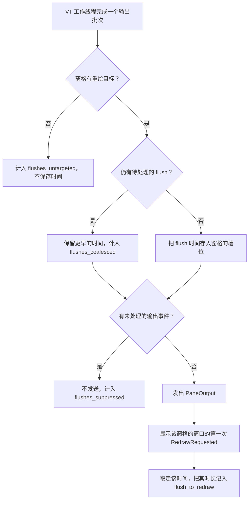

# 日志

[English](Logging)

先找下方路径中最新的日志。帧耗时用 `debug`，内存快照用 `info`；提交问题前查看末尾
清单。崩溃与卡死证据另有专节；没有崩溃转储不代表正常退出。

## 路径

- 日志文件：`~/.sonicterm/logs/sonicterm.log.*`
- 致命信号备用路径：`~/.sonicterm/logs/sonicterm.log`
- Panic 工件：`~/.sonicterm/logs/crashes/`
- 会话标记：`~/.sonicterm/logs/sessions/`
- 有界诊断记录：`~/.sonicterm/logs/breadcrumbs/`

`tracing-appender` 按天生成 `sonicterm.log.YYYY-MM-DD` 之类的文件；修改时间最新的
文件正在使用。按大小轮转时还可能增加 Unix 时间后缀。在 Windows 上，`~` 表示当前
用户的配置文件目录。macOS、Windows 与 Linux 原生运行时 smoke 使用
`SONICTERM_RUNTIME_SMOKE_DIR` 下显式的 `logs/` 子目录，不写入用户日志树；分开的
`config/` 子目录承载配置与重载状态，并保留原有 `HOME`。外层 runner 会移除继承的
`NO_COLOR`，并保存失败输出和日志证据。

性能场景运行（`scripts/perf-compare.py` 驱动的 `perf_scenarios` example）同样不写入用户日志树：
每次运行把日志写入操作系统临时目录下新建的 scratch 目录，`HOME` 保持不变。harness 拒绝继承的
`RUST_LOG`（它会替换配置的级别），因此对比两侧使用同一过滤器记录日志；harness 还会在启动时记录
自己的 scratch 路径。对比解析 `memory snapshot` 行（[`info` 级别的聚合快照](#info-级别的聚合快照)），
在 `--laps` 运行中还解析 `[render_timing]` 行（[渲染与性能诊断](#渲染与性能诊断)）。
每次运行如何证明 `~/.sonicterm` 未被改动，见[开发与发布](Development-and-Release-zh-CN#隔离检查)。

## 配置与保留策略

```toml
[logging]
level = "warn"                    # error | warn | info | debug
max_file_size_mb = 10
max_rotated_files = 3
max_age_days = 2
max_crash_dumps = 10
max_crash_age_days = 2
max_crash_bytes = 10485760        # 10 MiB
max_breadcrumb_files = 10
max_breadcrumb_age_days = 2
max_breadcrumb_bytes = 1048576    # 1 MiB
```

默认级别为 `warn`。SonicTerm 会先读取 `[logging]`，再安装 tracing subscriber，
因此正常启动会直接采用配置级别。`RUST_LOG` 可在单次运行中覆盖配置过滤器。stderr
使用同一过滤器，并额外加入全局 `warn` fallback；更具体的 target 指令仍可让它输出
`debug`，所以 `warn` 不是 stderr 的硬上限。

打开 appender 前，SonicTerm 会轮转超过 `max_file_size_mb` 的当前日志；设为 `0`
可关闭这条限制。随后按年龄和数量清理旧日志，当前文件永不删除。崩溃工件和诊断记录
分别受数量、年龄与总字节数限制，并从最旧文件开始删除，直到所有启用的限制都满足。
年龄或总字节数设为 `0` 只会关闭对应限制。清理失败不会阻止程序启动，工件清理在后台
线程执行。

## 级别与诊断 target

| 级别 | 会记录的内容 |
| --- | --- |
| `error` | 仅错误 |
| `warn` | warning、error、`sonic_exit`、`sonic::gpu` 设备记录，以及用户可见的回收或耗尽提示 |
| `info` | SonicTerm 常规信息和聚合 `memory snapshot` |
| `debug` | 详细诊断、窗格/渲染器内存、状态机事件、`render_timing`、`tear_out_timing` 和 `frame_counters` |

配置过滤器始终把 `wgpu`、`naga`、`sonicterm-vt` 和 `sonicterm-grid` 保持在 warning
级别。字体塑形热路径的海量输出位于 `trace`，任何配置级别都不会启用；只有专门排查该
路径时才使用精确的 `RUST_LOG` 指令。

在 `debug` 级别，`sonicterm_app::sync_output` target 记录窗格工作线程在 150 ms 时限释放的
每次同步更新（DEC 2026），带 `pane_id` 和 `epoch`：`synchronized output held past 150 ms; released`。

## 字体诊断

配置的字体无法匹配时，会在 `config` target 输出 `error`，注明字体族、字重、字宽和样式。
SonicTerm 会使用回退字体，因此窗口仍能运行并不能证明请求的字体已经加载。请检查
`sonicterm.toml` 中的 `[font].family` 以及该字体是否可被 SonicTerm 使用；诊断中的链接指向
带语言切换入口的英文配置页面，中文说明见[配置](Configuration-zh-CN)。合成的粗体/斜体请求和
仅用作回退的条目不会额外输出缺失字体错误。

使用配置提供的 `warn`、`info` 或 `debug` 过滤器时，`config` 错误会进入 stderr，但不进入
日志文件或崩溃历史。`RUST_LOG` 会替换配置的过滤器，而不是扩展它。以下采集设置保留默认告警
过滤规则，并让三种输出都包含字体配置错误：

```text
RUST_LOG=config=error,sonic_exit=warn,sonic=warn,sonicterm=warn,sonicterm_vt=warn,sonicterm_grid=warn,memory::reclaimed=warn,wgpu=warn,naga=warn
```

若要保留已有的自定义过滤器，应在其完整值后追加 `config=error`。配置的 `error` 过滤器也会
放行这些错误。重复错误可能来自分别进行的字体解析；这些错误没有去重策略。

缺失字形警告则报告未解析码点的数量及占位字形状态，不包含请求的文本。它建议安装覆盖相应字符的
字体或修改 `[font].family`，并链接到相同的 SonicTerm 配置页面。既有的按配置代次/小时限制警告
频率的机制独立于缺失字体错误。这两类消息均不能说明 GPU 软件回退的原因；适配器诊断见下文。

## 本地路径点击诊断

复现显式本地路径点击失败前，设置 `[logging] level = "debug"`，或对单次运行使用
`RUST_LOG=sonicterm_app::app::path_target=debug`。当已检测的显式路径没有当前有效的
文件系统授权目标时，`local path activation unverified` 事件会记录该次点击。
它使用不可变的点击快照，不重新读取文件系统或 parser。
已确认不存在的自动检测路径也会记录该事件，随后该点击仍是普通终端点击。

| 字段 | 含义 |
| --- | --- |
| `window_id`、`pane_id`、`pointed`、`view_top` | 被点击的窗口/窗格、绝对单元格与视口起点 |
| `screen_epoch`、`scrollback_evicted` | 屏幕与保留历史的身份 |
| `cwd`、`cwd_revision` | 该窗格的 OSC 7 authority/path 与版本，不是进程 CWD |
| `clicked_path` | 与点击关联的显式路径文本 |
| `candidates` | 有界候选集合，含类型来源、解析后的路径与单元格范围，按探测顺序排列 |
| `reason` | 当前探测失败键；没有匹配失败结果时为 `path-error-pending` |

pending 不是文件不存在的证据。事件包含可能敏感的路径，但不含整行终端内容或环境转储；
分享前应检查。路径以转义后的 debug 格式输出；即使候选枚举有上限，单条事件仍可能较大。
默认 `warn` 级别不输出它，悬停和未经验证的裸文件名点击也不输出。

没有该事件不能证明成功或失败：可能没有开启日志、没有检测到目标，或被拒绝的目标/原生打开
失败走了其它分支。原生打开失败保留独立的 `path open failed` 告警。调查相对路径失败时，
在同一窗格比较同一个文件的相对路径、绝对路径与本地文件 URI；保留对应点击身份，
不要用另一个 shell 的 CWD 推断该窗格目录。

## PTY 输入拒绝诊断

默认 `warn` 级别会报告被拒绝的输入，包括终端解析器回复。生产者直接指定 `source`：
`Keyboard`、`Paste`、`FileDrop`、`Ime`、`PointerButton`、`PointerMotion`、`Wheel`、
`FocusReport`、`TerminalReply`、`ScriptDraft` 或 `StateMachine`；不会从负载字节猜测来源。

| 字段 | 含义 |
| --- | --- |
| `pane_id` | 生产者提供的稳定窗格标识 |
| `window_id` | 事件循环处理拒绝时窗格所属的当前窗口；窗格关闭或事件循环不可用时为空 |
| `source`、`rejected_bytes`、`reason` | 输入类别、被拒绝的字节数及不含负载的原因 |
| `observation="concurrent"` | 队列与 writer 字段为独立并发观察值，不是拒绝瞬间的同一事务快照 |
| `queued_messages`、`queued_bytes`、`queue_capacity` | 等待的消息数、负载字节数和四槽上限；不包含正在进行的原生写入 |
| `writer_phase` | `Idle`、`Writing`、`Flushing` 或 `Stopped`；表示执行边界，不是子进程健康结论 |
| `in_flight_bytes`、`in_flight_millis` | 当前消息大小及已观察写入或 flush 的持续时间；空闲或停止时无时间值 |
| `completed_messages` | `write_all` 与 `flush` 均成功的原生写入数 |

事件不携带被拒绝的负载。其 debug 表示、warning 和通知均不包含输入文本、命令、路径或剪贴板内容。
标签页转移后，通知跟随窗格的当前窗口；已关闭的窗格只记录 warning，不在无关窗口显示通知。
代理缺失或事件投递失败时，生产者直接记录同样的元数据，但不附带无法确认的当前窗口标识。

生产终端回复在解析器与副作用锁外进入独立 FIFO，使用 64 KiB 内存和私有临时文件溢出存储。
UI 队列饱和不会丢弃回复、产生拒绝 warning 或停止输出处理。存储或原生失败会锁存，并以
`terminal reply delivery failed` 报告一次，包含窗格标识与字节数；输出、重绘和退出观察继续。
原生 writer 与暂存读取错误独立记录。正常销毁会释放暂存文件，不产生拒绝通知。
存储与交付限制见 [终端 IO 与 VT](Terminal-IO-and-VT-zh-CN)。

健康 writer 尚未被调度时，四条小消息就能填满通道。受控测试使用生产环境的入队与 writer 循环，
证明突发排空仍保持顺序。另设阻塞写入和阻塞 flush 的夹具，证明排队字节为零时仍可能有一条
在途消息；再加入四条等待消息后，下一条消息会被显式拒绝。这些夹具区分机制，不会倒推出
以前缺少归属信息的 warning 究竟由哪个生产者或原生条件引起。

队列容量和单消息上限不变。每个窗格先把原生指针移动合并到一个固定 64 字节槽，再尝试入队。
队列满时保留最新位置，10 ms 后重试但不请求重绘；新位置替换旧位置。离散输入在总长度允许时
把之前待发移动合并为同一队列消息，保持字节顺序且不多占槽。达到单消息上限或被拒绝的离散
输入会取代待发移动，不会在其后重放。writer 断开时只报告一次并清空移动槽；鼠标跟踪/编码/屏幕
模式变化会丢弃待发移动。解析器忙时延迟仅移动的重试，直到可验证其模式；若有后续离散输入，
则取代尚未验证的移动，不延迟按键或重放过期字节；窗格销毁释放槽。
其他 UI 输入仍采用拒绝而非阻塞；worker 持有的终端回复使用溢出 FIFO。应比较同一窗格的连续
观察值和进度计数，而不是凭一条 `QueueFull` warning 下结论。

## PTY 尺寸调整失败诊断

默认 `warn` 级别会把原生层拒绝的 PTY 尺寸调整记为一条 `pty resize failed` 事件。

| 字段 | 含义 |
| --- | --- |
| `pane_id` | PTY 拒绝该次尺寸调整的窗格标识 |
| `cols`、`rows` | 请求的几何尺寸，而不是 pty 当前持有的尺寸 |
| `error` | 由 `Display` 渲染的失败信息。原生拒绝显示平台文本；某一维为零时显示 `refusing pty resize to <cols>x<rows>` |

事件不携带终端内容：只有窗格 id、请求的列数与行数以及错误。

每个窗格仅记录首次 resize 失败，直到成功重置告警闩锁，避免切换标签页或拖动窗口时按输入
频率写日志。尝试仍会执行：IO 边界只跳过无效尺寸和成功的重复请求。网格保留请求尺寸，
没有回滚、重试定时器或失败心跳。

## 渲染与性能诊断

叶子重复/缺失或活动/缩放不一致导致无法收集完整帧时，`frame_collection` 按每段无效布局
期间只警告一次，记录 `id`（窗口）和 `reason`。只有完整的持锁帧通过视口重算后才重置标记，
仅捕获有效帧源不会重置，因此反复发生的持锁后校验失败仍属于同一警告期间。关闭标签页的
`NoLayout` 静默跳过；普通锁争用不发出这一结构异常警告。

把 `level` 设为 `debug`，重启后复现问题。`render_timing` target 会记录网格遍历、
覆盖层组装、字形上传、surface 获取、提交和呈现等帧阶段，并标明主窗口或子窗口、
`mode=full` 和 `damaged_rows`。无操作帧会在完成帧计时输出前返回。GPU 局部损伤限制的是
绘制裁剪区域，不是帧组装。没有单独的渲染计时开关。

每次运行完成的重绘都为其窗口写入一行：
`[render_timing] window=<label> total=<ms>ms <lap>=<ms>ms ... tail=<ms>ms`。
`<label>` 为 `main` 或 `child`，每个 `<lap>` 是一个帧阶段，最后一个是 `tail`，所有数值都是保留两位
小数的毫秒。在日志文件中，这一行是事件 `line` 字段的值，跟在 `line=` 之后。
`scripts/perf-compare.py` 只在 `--laps` 运行中解析这一行；这类运行以 `debug` 记录日志，因此会写出它。
格式化这一行在每一帧都有开销，因此 lap 运行自成一组，从不与计时运行合并统计；计时运行以 `info`
记录日志，不写 `render_timing` 行。

同一 DEBUG target 还会记录 `renderer initialization` 操作边界。
同步构造的 `renderer_init` span 携带 `window_id`、`role` 和 `shared`；
完成已准备的启动时，改为携带 `window_id`、`role` 和 `prepared=true`。
`startup_prepare` span 用 `window_id` 标识所属线程上的实例和表面创建；
`recovery_init` span 用请求窗口的 `window_id` 标识 `ContextRequest::run`，
包括启动请求。`renderer_finish` 操作覆盖协商完成后所属线程上的 renderer 组装。
操作记录保留开始时的 span 作为父级。
`phase="enter"` 位于调用之前；`phase="return"` 记录 `elapsed_ms` 和 `outcome`。
`ok` 和 `error` 描述返回的 `Result`；`returned` 只表示调用返回，不代表初始化或呈现成功。
表面配置另有 `phase="gate"` 记录，`accepted` 来自既有设备门禁的读取结果。

操作范围包括实例创建或复用、表面创建及能力查询、adapter/device 请求、表面配置、管线、
帧存储、图集存储及上传对象、字体栈和单元格度量。未配对的开始记录可能表示调用未完成、
异常展开或日志丢失，单独不能诊断原因。耗时包含调度和诊断开销，不只是原生执行时间。
关闭 DEBUG 时，计时辅助函数不读取时钟，也不保留 span。这些记录不添加终端内容、字体名称、
路径或环境变量值。

字体操作也使用 DEBUG 级别的 `render_timing`。开始和显式返回记录分别标识
`shape_impl` 与 `fallback_receive`、`rasterizer_new` 与 `rasterize_glyph`，以及未命中缓存的
字体解析与度量。`font_shape` span 携带 `loaded_font_id` 和重试 `iteration`；
`font_raster` span 只携带 `loaded_font_id` 和 `fallback_idx`，不包含字形索引或字符。
渲染器的 `font_style` span 标识 `bold`、`italic` 和 `row`。Windows 原生字体测试另加
`font_phase` 父级，携带 `window_id`、`scale` 和测试阶段；该父级仅属于这个测试夹具。

每个排队的回退请求捕获自己的 dispatcher 和父级，而不是在复用的工作线程上沿用首个请求的
上下文。其 `font_request` span 携带 `request_id`。只有返回记录的 `queue_wait` 从请求上下文
捕获计时到工作线程开始处理，包含适用时的请求准备和工作线程启动。查找记录区分
`fallback_locator`、`fallback_font_dirs`、`fallback_built_in` 和 `fallback_selection`。
`completion_called=true` 标记即将调用既有完成回调的位置；`false` 表示未选出字体句柄，
不会调用回调。`fallback_receive` 的 `error` 可能表示未找到回退字体后发送端断开，
单凭它不能认定渲染失败。

字体计时关闭时不读取诊断时钟、不分配请求 ID，也不保留 span 或 dispatcher。关闭计时的
请求只屏蔽这些计时记录，不影响工作线程的普通日志，并在返回或异常展开时恢复先前计时状态。
启用计时会增加时钟读取和输出，其中包括在既有 pending-fallback 锁内、回调前写入的记录，
所以可能改变调度。这些耗时不能区分原生执行、等待或调度延迟；一次未出现卡顿的运行不能解释
先前的卡顿。

启动日志会记录选中的 wgpu adapter、设备类型和软件 adapter 分类。在 RDP、虚拟机或
VDI 环境中，请查找 `software-render degrade engaged`，并对照[配置](Configuration-zh-CN)中的
`[appearance].software_render_mode`。`scripts/perf-compare.py` 读取每次场景运行的第一行
`wgpu adapter selected`，没有时读取第一行 `wgpu adapter reused`，取其中的 `backend`、`name`、
`driver`、`device_type` 与 `software_rendering`；对比会在 presenter 行中写出该 adapter，某次运行所用的
adapter 与该组第一次有效运行不同时，这一对运行无效。在 `level = "debug"` 下，每个 renderer 还会在启动以及
模式、opacity、主题或 presenter 状态变化时写入 `renderer LCD subpixel policy`。其中的
`requested`、`effective`、`windows_host`、`opaque_target`、`software_presenter` 和
`dual_source_supported` 字段能解释每次 LCD 到灰度的回退，不必依赖截图推断。

在 `info` 级别，`DPI transition synchronized` 会记录 `window_id`、`old_scale`、
`new_scale`、`native_scale`、`size_scale`，以及 `old_inner`、`suggested`、`minimum`、
`available`、`target`。`renderer_before`/`renderer_after` 是物理表面像素尺寸，
`cell_before`/`cell_after` 是光栅像素单位的单元格尺寸。macOS 的 `size_scale` 使用原生
backing scale，因为 `old_inner` 已按该比例报告；其他平台使用保存的旧比例。这些成对的
输入/输出可区分重复缩放与表面或单元格尺寸不一致，不会记录终端内容。

前台探测 worker 无法启动或停止时，应用在 `sonicterm_app::app` 上记录一条 `warn`，即
"foreground-process probes unavailable"，并带 `reason` 字段。此后标签页进程名和按标签页的权限
警告都解析为没有进程，不再采样，也不会重试。

## 帧与锁计数器

`frame_counters` target 是只在 debug 下记录的计数器，覆盖 `render_timing` 看不到的内容：被推迟或
遇到锁忙碌的重绘、呈现之外的帧结果、呈现间隔、解析器锁的等待与持有、flush 到重绘的延迟、分发停顿、
唤醒原因、前台 worker 探测、缓冲区上传、行缓存命中与塑形请求。它们不改变任何行为。

### 启用计数器

把 `[logging].level` 设为 `"debug"`，Debug 过滤器会放行 `frame_counters`；放行 `frame_counters=debug`
的 `RUST_LOG` 也可以。每个 App 只在启动时读取一次过滤器，并在整个生命周期内保持这一决定，因此更改
级别要重启后才生效。嵌入 App 的进程（例如测试 harness）可以不管过滤器如何强制开启某个 App 的计数器，
但只能在该 App 创建第一个窗口或窗格之前；之后 App 会拒绝。强制开启的计数器照常计数，其日志行只在过滤器
放行 `frame_counters` 时才会出现。

计数器关闭时，每条插桩路径只做一次检查就停止：不读时钟，不写原子量或线程局部变量，也不分配内存。
开启时，App 一次性分配其 VT 统计、dispatch 汇总、每个窗口与 app 行各一个行状态，以及一个已关闭窗口
记录；每个窗口分配其计数器，每个窗格分配一个 8 字节的待处理 flush 槽。除了每秒最多构建一行之外，
不会按帧或按批次分配内存。

### 行格式

```text
[frame_counters] window=<main|child-N|app> [final=1] span_ms=<ms> <field>=<value> ...
```

每个窗口写 `window=main` 或 `window=child-N`，其中 N 是该窗口在 App 中的注册顺序；App 写一行
`window=app`。每个来源每秒最多写一行。值是自该来源上一行以来的增量，`span_ms` 是距上一行的时间，
为零的计数与空直方图不输出。

窗口行跟随一次帧尝试、该窗口取走的一次 flush，或该窗口的任何其他窗口事件；既没有尝试帧、也没有
取走 flush 的 `RedrawRequested` 不输出窗口行。应用行跟随任何窗口事件或用户事件。维护性唤醒
（`new_events`、`about_to_wait`、到期唤醒和 30 秒的保留采样唤醒）会被计数，但从不输出行，也不会为
输出行设置定时器，因此只因维护而唤醒的 App 不写任何日志。

窗口关闭和退出时，有待输出计数的来源会写最后一行，标记为 `final=1`，此后该来源不再输出。关闭窗口的
总计，包括其渲染器的计数以及关闭它的那次事件的处理时间，会并入 App 范围的已关闭窗口汇总，因此 App
的总计不会减少。所有计数与总和都是累计值，从不重置；读者保留自己的上一次快照并计算增量。

### 窗口字段

| 字段 | 单位 | 含义 |
| --- | --- | --- |
| `attempts` | 次数 | 通过推迟规则、继续收集帧的重绘 |
| `presented` | 次数 | 呈现了帧的尝试 |
| `cached` | 次数 | 重新呈现缓存帧的尝试 |
| `settled` | 次数 | 未呈现即结束的尝试 |
| `retry` | 次数 | 渲染器要求重试的尝试 |
| `surface_retry` | 次数 | 遇到表面重试的尝试 |
| `stopped` | 次数 | 发现 GPU 设备已停止的尝试 |
| `failed` | 次数 | 失败的尝试 |
| `contention_parser` | 次数 | 发现某个可见窗格的解析器锁忙碌的帧收集 |
| `contention_images` | 次数 | 发现某个可见图像存储忙碌的帧收集 |
| `defer_timeout` | 次数 | 因帧周期内有待处理的表面超时而推迟的重绘 |
| `defer_contention` | 次数 | 因锁争用重试下限而推迟的重绘 |
| `defer_sync` | 次数 | 因某个可见窗格的同步更新（DEC 2026）仍在进行而保持的重绘，包括准入时和在解析器锁下重新检查时 |
| `defer_streaming` | 次数 | 因流式输出节奏而推迟的重绘 |
| `stream_clock_exempt` | 次数 | 硬件路径上针对新输入、未呈现而结算并保留流式时钟的尝试；它们等待的回显不从这些尝试开始计节奏 |
| `display_link_ticks` | 次数 | 窗口接受的显示链接 tick：tick 的代际是运行中链接的代际，且有待准入的 `Link`；过期 tick 不计入 |
| `display_link_admissions` | 次数 | 由 tick 准入的按显示链接计节奏的流式帧 |
| `display_link_fallbacks` | 次数 | 没有 tick 到来、由两个周期的回退上限准入的按显示链接计节奏的流式帧 |
| `contention_retry_armed` | 次数 | 设置的锁争用重试 |
| `dirt_ack_dropped` | 次数 | 下一次收集时因窗格未被持有、解析器已变化，或网格在组帧后改变尺寸或切换屏幕而丢弃的已呈现帧回执；组帧后写入的输出不会丢弃回执，只保留它标脏的行。每次丢弃只代价一次之后的重新组装，从不影响像素 |
| `native_request_redraw` | 次数 | 该窗口的原生重绘请求，覆盖每条请求路径；一次 dispatch 的请求在其结束时计入汇总，因此窗口行晚一次 dispatch 显示它们（`final=1` 行是完整的） |
| `user_request_redraw` | 次数 | 该窗口已服务的输出事件：VT 工作线程 flush 发出的 `PaneOutput`（每个窗格最多一个未处理）和测试框架或测试发出的 `RequestRedraw`，在可见输出过滤之前计数 |
| `redraw_requested` | 次数 | 该窗口的 `RedrawRequested` 事件 |
| `present_interval` | 毫秒直方图 | 相邻两次呈现之间的时间 |
| `handler` | 毫秒直方图 | 该窗口每次 `window_event` 分发 |
| `flush_to_redraw` | 毫秒直方图 | 最早的待处理 flush 到显示该窗格的窗口第一次重绘 |

四个 `defer_*` 计数记录胜出的规则。规则按上述顺序检查，前一条成立后不再求值后面的规则，因此每次
推迟的重绘只计一次（重试下限见[渲染模式](Rendering-Modes-zh-CN#锁争用重试)）。

三个 `display_link_*` 计数始终存在，在不运行链接的地方（Windows、Linux、macOS 14 之前、软件路径）
为 0。每次按显示链接计节奏的流式准入只计一次，计为 tick 准入或回退，因此 `attempts` 不小于二者之和。
两者都为 0 的阶段为**未覆盖**；只有准入非零为**链接节奏**；只有回退非零为**仅回退**（该次运行中显示
链接节奏不可用）；两者都非零为**混合**。`display_link_ticks` 减去 `display_link_admissions` 是未使用
的 tick：被超时或争用规则拒绝、使用前被替换，或被非流式准入消耗的 tick。这些计数显示每一帧由哪条
路径授权；它们不证明帧相对于垂直同步落在何处（[渲染模式](Rendering-Modes-zh-CN#按窗口归属的帧调度)）。

每次 `RedrawRequested` 时，`flush_to_redraw` 会取走该窗口所显示的每个窗格的待处理 flush：活动标签页的
窗格，或被放大的窗格。隐藏窗格的 flush 会一直等到其标签页显示出来。一组合并的 flush 只产生一次观测。

### 应用字段

| 字段 | 单位 | 含义 |
| --- | --- | --- |
| `wake_init`、`wake_poll`、`wake_wait_cancelled`、`wake_resume_time` | 次数 | 按原因统计的 `new_events` 唤醒：`Init`、`Poll`、`WaitCancelled`、`ResumeTimeReached` |
| `wake_user` | 次数 | `user_event` 分发 |
| `native_request_redraw_unregistered` | 次数 | 针对未登记计数器的窗口 id（例如已关闭的窗口）的原生重绘请求；全应用一个总数 |
| `about_to_wait` | 毫秒直方图 | 每次 `about_to_wait` 分发 |
| `user_event` | 毫秒直方图 | 每次 `user_event` 分发 |
| `new_events` | 毫秒直方图 | 每次 `new_events` 分发 |
| `ui_parser_locks` | 次数 | 事件循环线程对窗格解析器加锁的次数 |
| `ui_parser_wait` | 微秒直方图 | 每次这类加锁的等待 |
| `fg_probe_calls`、`fg_probe_panes` | 次数 | 已退役的事件循环探测；始终为 0，保留下来，使与旧 base 的对比显示这部分工作降到 0 |
| `fg_probe` | 微秒直方图 | 已退役的事件循环探测耗时；始终为空，为同一对比保留 |
| `fg_worker_probes` | 次数 | 前台探测 worker 的批次 |
| `fg_worker_panes` | 次数 | 这些批次覆盖的窗格 |
| `fg_results_stale` | 次数 | 事件循环丢弃的 worker 结果：窗格已关闭、进程身份已变化或子进程已退出 |
| `fg_worker_probe` | 微秒直方图 | 每个批次的耗时 |

这些数据来自 `sonicterm-fg-probe` worker 线程；事件循环线程从不探测。在 macOS 上，一个批次逐个
查询窗格的进程，并在前后重新读取启动令牌；在 Windows 上做一次进程表快照。计数器关闭时，worker 每个
被探测的窗格只读一次时钟，不记录任何内容。Linux 与其它平台不捕获进程身份，不启动 worker，报告为零。

### VT 字段

VT 字段输出在 `window=app` 行上。它们是 App 范围的单一汇总，每个窗格的 VT 工作线程都向其中记录，
不按窗格拆分。已关闭的窗格，或在窗格关闭后才结束的工作线程，仍会计入其中。

| 字段 | 单位 | 含义 |
| --- | --- | --- |
| `parser_lock_wait` | 微秒直方图 | VT 工作线程等待窗格解析器锁的时间 |
| `parser_lock_hold` | 微秒直方图 | 工作线程持有该锁的时间 |
| `parse` | 微秒直方图 | 在锁内解析的时间 |
| `parse_bytes` | 字节 | 解析的字节数 |
| `batches` | 次数 | 非空输出批次；多次加锁的批次只计一次，每次加锁都记入直方图 |
| `flushes` | 次数 | 工作线程在输出后的 flush，无论有无目标、发出还是被抑制 |
| `flushes_untargeted` | 次数 | 窗格没有重绘目标时的 flush；不保存时间戳 |
| `flushes_coalesced` | 次数 | 发现更早的 flush 仍待处理的 flush；更早的那次保留其时间 |
| `flushes_suppressed` | 次数 | 有目标、但因窗格的输出事件仍未处理而未发送事件的 flush；事件循环拒收的发送不计入 |
| `sync_timeouts` | 次数 | 工作线程在 150 ms 时限而非重置时释放的同步更新（DEC 2026） |

`flushes`、`flushes_untargeted`、`flushes_coalesced` 与 `flush_to_redraw` 的计数之间没有恒等关系。
关闭的窗格会丢弃其待处理时间戳，而且各计数器并非作为一次快照读取，因此要分别解读。
只有在每个工作线程都结束后读取的静止总数才满足 `flushes_suppressed ≤ flushes − flushes_untargeted`；
实时快照或阶段差值可能违反它，也没有任何检查强制它。

### 渲染器字段

渲染器字段输出在所属窗口的行上。每个计数属于收集它的渲染器。

| 字段 | 单位 | 含义 |
| --- | --- | --- |
| `vertex_bytes` | 字节 | 写入顶点缓冲区的字节数 |
| `index_bytes` | 字节 | 写入索引缓冲区的字节数：首帧以及缓冲区增长后的首帧写入整个索引模式，其余帧为 0 |
| `damage_permille_sum` | 千分比 | 每帧损伤区域占表面比例之和；除以 `damaged_frames` 得到平均值 |
| `damaged_frames` | 次数 | 记录了损伤区域的帧 |
| `damage_waste_permille_sum` | 千分比 | 每帧合并矩形占表面的比例减去其各部分实际覆盖的比例之和；除以 `damaged_frames` 得到平均浪费 |
| `software_frames` | 次数 | 软件呈现器绘制的帧，即启用软件渲染降级的 Windows |
| `gpu_frames` | 次数 | 通过 wgpu 绘制的帧，包括 macOS 与 Linux 上降级时的帧 |
| `row_cache_hits` | 次数 | 命中的行字形缓存查询 |
| `row_cache_misses` | 次数 | 未命中的行字形缓存查询 |
| `shape_requests` | 次数 | 渲染器发出的 `FontStack` 塑形与测量请求 |
| `full_frames` | 次数 | 渲染计划为 `Full` 的帧；计划为 `Noop` 的帧不计入 |
| `row_cache_invalidate_visits` | 次数 | 使脏行失效时检查的行字形缓存条目：每次 `invalidate_row_abs` 调用检查一个，即按 `(窗格, 绝对行)` 键删除该条目 |
| `row_cache_invalidate_us` | 微秒 | 使脏行失效所花的总时间，为普通累加和；至少使一行失效的窗格在其行循环内读取一对时钟，因此计数不会改变保留哪些缓存行 |
| `recolor_glyphs_visited` | 次数 | 在帧的主字形列表上为光标、复制模式光标或搜索匹配下的字形重新着色时检查的字形：墨迹与目标相交的行，加上终端行之外的全部字形（如标签标题）；叠加层文字不计入 |
| `font_fallback_applies` | 次数 | 字体准备应用了更新的回退通知或代次的帧，每次清除一次已塑形的行、图集中缺失字形的条目与标签标题宽度纪元；它只是已解析的回退字体到达屏幕的佐证，像素由测试证明 |
| `glyph_atlas_growths` | 次数 | 字形图集翻倍次数，在每次帧末检查以及渲染器结算统计时计入；让图集增长的帧开始一个增长片段 |
| `atlas_growth_abandoned` | 次数 | 没有帧呈现的增长片段：在设备停止时、重新绑定替换设备之前，以及 App 为退役或退出的窗口结算统计时结算；就地重置不放弃任何片段 |
| `shape_ns` | 纳秒 | 所有塑形与测量请求内的时间，包括字体合并；在计时的光栅化调用内发出的请求计为光栅化 |
| `raster_ns` | 纳秒 | 所有字形图集光栅化调用内的时间，包括字形零的解析、光栅化器创建与图块转换；其中的塑形不重复计入 |
| `raster_calls` | 次数 | 字形图集光栅化调用，终端文字与界面文字都计入；图集命中不调用 |
| `raster_tiles` | 次数 | 返回有像素图块的光栅化调用；无图块与空图块算调用，不算图块 |
| `font_generation_applies` | 次数 | 应用了已应用回退通知的更新代次的字体准备；与 `font_fallback_applies` 不同，它不含首次准备与替换字体栈 |
| `font_prepare_ns`、`font_generation_prepare_ns` | 纳秒 | 帧字体准备内的时间（含失效），分别为全部准备与应用了更新代次的准备；不在任何渲染尝试之内 |
| `render_attempts`、`render_attempts_presented` | 次数 | `render_releasing` 调用，及其中完成呈现的调用 |
| `render_attempt_ns`、`render_attempt_shape_ns`、`render_attempt_raster_ns` | 纳秒 | 这些调用内的时间，及其中的塑形与光栅化时间 |
| `render_attempt_shape_requests`、`render_attempt_raster_calls`、`render_attempt_raster_tiles` | 次数 | 这些调用内的塑形请求、光栅化调用与图块 |
| `apply_attempts`、`apply_attempts_presented`、`apply_attempt_*` | 同 `render_*` | 携带回退代次应用的渲染尝试的相同字段 |
| `assembly` | 微秒直方图 | 渲染器中的 CPU 帧组装：从帧键检查到叠加层组装结束，在图集重试检查、上传、获取表面、提交与呈现之前；每个组装完成的帧记录一个样本，包括之后重试或呈现失败的帧；`Noop` 帧与被跳过的帧不记录。它不是应用的 `render` 计时段 |
| `atlas_growth_to_present` | 毫秒直方图 | 从第一个让字形图集增长的帧开始，到下一次成功呈现；每个已呈现的增长片段一个样本 |

在 Windows 上，GDI 呈现器绘制的帧计入 `software_frames`；托管的 Windows CI runner 没有 GPU，因此其运行
报告 `software_frames` 而没有 `gpu_frames`。通过 wgpu 呈现的帧（包括其软件适配器）计入 `gpu_frames`。

`shape_requests` 统计对 `FontStack::shape_text_with_style`、`shape_text` 或 `measure_text_width` 的每次
调用，失败的调用也计入；因文本为空而跳过的调用不算请求。它统计的是请求，而不是 HarfBuzz 尝试或回退
重试。

每次回退代次应用恰好由一个渲染尝试携带：应用了更新代次的准备记下它，下一次 `render_releasing` 调用取走它，
无论其间有多少次准备或字体令牌副本。重试是之后的调用，不携带它。同一渲染器在尝试期间打开的辅助作用域（如通知
文字布局）并入该尝试；其他渲染器的工作不并入。每个 `_ns` 字段都是累加的纳秒；perf-compare 精确地相减与汇总，
并以微秒显示。它为每个阶段增加全部尝试与应用尝试的汇总拆分：先对具备全部字段的运行求匹配总和，再分为塑形、
光栅化与其余部分的占比，并给出每次尝试的平均值。

### 直方图

每个时长都是带精确总和的累计分桶直方图。

| 单位 | 各桶上界 |
| --- | --- |
| 毫秒 | 4、7、9、12、17、25、34、50、100，以及大于 100 |
| 微秒 | 10、50、100、500、1000、5000，以及大于 5000 |

等于某个上界的值落在该上界的桶内。在一行中，直方图按顺序输出各桶计数、总和、p95 与最大值：

```text
<name>_ms=[<count>,...] <name>_sum_us=<µs> <name>_p95_le_ms=<bound> <name>_max_le_ms=<bound>
```

微秒直方图用 `_us` 代替 `_ms`。总和是精确的：它是记录下来的微秒值之和，精度取决于时钟分辨率，并包含
插桩本身的开销，因此总和除以各桶总数即为平均值。p95 与最大值从不是精确值：`_le_<unit>=N` 表示不超过
上界 N，`_gt_<unit>=N` 表示落在高于最大上界 N 的溢出桶中。

### 测量边界

VT 工作线程在每次对窗格解析器加锁前后读四次时钟：`lock()` 之前、`lock()` 返回时、解析之后，以及在
键盘快照写入之后、释放锁之前。等待是第一段间隔，解析是第二段，持有时间从第二次读数到第四次读数。后三次
读数发生在锁内，会略微延长持有时间，这就是开启计数器的开销。所有减法与计数器更新都要等锁释放之后才进行。

事件循环线程对窗格解析器的每次加锁都经过同一个 `lock_parser` 辅助函数。在计数器开启的 App 的分发
过程中，它在 `lock()` 前后各读一次时钟，然后在持锁状态下向线程局部计数器加一次桶计数和一次总和，
App 在分发结束时取走它们。其他情况下它就是 `lock()`。



工作线程先保存 flush 时间再发出输出事件，因此事件循环不会在时间发布之前被唤醒。在某次重绘取走槽位时
发布的 flush，要么被这次重绘取走，要么留给下一次，既不会丢失，也不会被计两次。

读数是观察性的。各字段是依次读取的，而不是作为一次原子快照；一个计数归属于在其发布之后读取它的那一行
或快照，两次字段读取之间可能有多个批次发布。

### 计数器不测量的内容

计数器不会在 flush 处拆分按键延迟。`flush_to_redraw` 测量的是到第一次重绘的投递与调度延迟，不计入
呈现的帧。最大值与 p95 是桶上界，总和包含插桩本身的开销，塑形计数是请求而不是 HarfBuzz 的工作量。

## GPU 设备错误诊断

每个 wgpu 设备只保留一份错误状态，由同一 GPU 上下文创建的所有窗口共享。`sonic::gpu` target
在每次状态变化时写一条记录，另为第一次隔离故障写一条；默认过滤器中的 `sonic=warn` 会放行这些
记录。重复错误只更新计数，不写新记录。

| 消息 | 级别 | 写入时机 |
| --- | --- | --- |
| `GPU device stopped accepting work` | `error` | Validation、OutOfMemory 或 Internal 错误使设备从 `Usable` 变为 `Unusable` |
| `GPU device lost` | `error` | 设备丢失回调记录 `Lost`，包括有意销毁之后 |
| `contained isolated GPU error` | `warn` | 测试故障钩子产生的第一次隔离故障；之后只计数 |

| 字段 | 含义 |
| --- | --- |
| `generation` | 设备在进程内唯一的编号 |
| `state` | 写入记录时的设备状态 |
| `kind` | 引发记录的错误类别：验证、内存不足、内部错误或设备丢失 |
| `operation` | 引发错误的渲染器操作标签，例如 `render.submit`、`try_resize` 或 `glyph_upload.rebuild` |
| `description` | wgpu 给出的错误信息 |
| `lost_reason` | wgpu 给出的丢失原因；只有丢失记录中不为空 |
| `destroy_requested` | 设备是否由 SonicTerm 有意销毁；出现在状态变化记录中 |
| `validation`、`out_of_memory`、`internal`、`isolated`、`lost` | 按错误类别合并的计数 |

出现 `error` 记录后，所有窗口都停止在该设备上绘制；shell、输入、会话和窗口生命周期照常工作。
记录设备丢失后会启动共享设备恢复；没有丢失记录的不可用设备保持停止。每个受影响的渲染器首次
观察到停止时记录一条 warning：主窗口为 `render error`，其他窗口为 `child render error`。
隔离规则见[架构内部机制](Architecture-Internals-zh-CN)。

### 共享设备恢复记录

`sonic::gpu::recovery` 日志目标会被默认 `sonic=warn` 过滤器接纳。warning 记录包括调度、请求
接纳或拒绝、协商与渲染器准备/提交失败、超时、工作线程忙时拒绝、实际请求完成（`outcome` 与
`decision`），以及成功的 `shared GPU recovery committed`。error 记录包括工作线程断连、设备不可用但尚未丢失，以及
`shared GPU recovery exhausted; terminal sessions remain running`。

`generation` 标识已提交或新提交的设备，`ticket` 标识已接纳的请求，`attempt` 是从一开始的预算
位置，`delay_ms` 是毫秒单位的调度退避，`rebound` 是同时提交的渲染器数量。能够取得原生错误时，
失败记录也会包含该错误。这些记录不包含终端输出或输入。

成功提交记录只证明对象替换和设备闸门接纳，不证明原生扫描输出或后续帧已呈现。稳定计时只从已确认
的 `Presented` 帧开始。请求超时不证明原生工作线程已退出，退出时的释放也只是尽力完成；应比较
请求身份和之后的完成记录，而不是把没有日志当作清理成功。重试策略与限制见
[渲染模式](Rendering-Modes-zh-CN)。

## 内存诊断

### `info` 级别的聚合快照

在 `level = "info"` 下，`target="memory"` 最多每 30 秒写一条 `memory snapshot`。
它汇总操作系统进程数据、所有已采样窗格接缝、可见与预热渲染器，以及一次共享设备
分配器读取：

以下日志仅为格式示意，不是采集的实测记录。尖括号值代表运行时字段；`<metric>` 可以是
字节数或 `unsupported`，`<delta>` 可以是带符号的变化量或 `unavailable`。为便于阅读，示例已换行。

```text
memory snapshot process_private_committed_bytes=<metric> process_resident_bytes=<metric>
                process_virtual_bytes=<metric> process_private_committed_delta=<delta>
                process_resident_delta=<delta> process_virtual_delta=<delta>
                session_total_bytes=<bytes> session_delta=<delta>
                grid_visible_bytes=<bytes> grid_history_bytes=<bytes> grid_alternate_bytes=<bytes>
                parser_bytes=<bytes> hyperlink_bytes=<bytes> inline_media_bytes=<bytes>
                pty_output_bytes=<bytes> pty_input_bytes=<bytes> panes_total=<count> panes_sampled=<count> panes_contended=<count>
                renderer_total_bytes=<bytes> renderer_total_items=<count>
                renderer_row_glyph_cache_bytes=<bytes> renderer_row_glyph_cache_items=<count>
                renderer_row_quad_cache_bytes=<bytes> renderer_row_quad_cache_items=<count> renderer_delta=<delta>
                live_renderers=<count> live_fg_probe_workers=<count> renderers="visible[<window-id>] glyph=<bytes>/<items> image=<bytes>/<items> row_glyph=<bytes>/<items> row_quad=<bytes>/<items> software=<bytes>/<items> vertex=<bytes>/<items> total=<bytes>/<items>; warm[<slot>] glyph=<bytes>/<items> image=<bytes>/<items> row_glyph=<bytes>/<items> row_quad=<bytes>/<items> software=<bytes>/<items> vertex=<bytes>/<items> total=<bytes>/<items>"
                allocator_state=measured allocator_source=main allocator_label=<window-id>
                allocator_allocated_bytes=<bytes> allocator_reserved_bytes=<bytes>
                allocator_allocations=<count> allocator_blocks=<count> allocator_largest_block_bytes=<bytes>
                [checkpoint_index=<index> checkpoint_label="<label>" checkpoint_attempt=<attempt> checkpoint_complete=<bool>]
```

进程数据来自操作系统，因此包含 SonicTerm 自身接缝未统计的分配器碎片、尚未归还的页、
映射文件、GPU 驱动映射和线程栈。

| 字段 | 含义 |
| --- | --- |
| `process_private_committed_bytes` | 仅归本进程的内存；Windows 使用 `PrivateUsage`，macOS 与 Linux 报 `unsupported` |
| `process_resident_bytes` | 当前位于物理内存中的页；macOS 报常驻大小，Windows 报 `WorkingSetSize`，Linux 报 `unsupported` |
| `process_virtual_bytes` | 保留的地址空间；macOS 与 Windows 可测量，Linux 报 `unsupported`；实测值达到数百 GB 也可能正常，并不代表实际占用 |
| `*_delta` | 相比上次快照的变化；`+0` 是实测，`unavailable` 表示没有可比较样本 |
| `panes_total` | 本轮访问的全部窗格 |
| `panes_sampled` | 计入 `session_total_bytes` 的窗格 |
| `panes_contended` | 因解析器或内联图像锁被占用而跳过的窗格；非零表示会话总量不完整 |
| `renderer_total_bytes` / `renderer_total_items` | 所有可见与预热渲染器的 CPU 存储 |
| `renderer_row_glyph_cache_bytes` / `renderer_row_glyph_cache_items` | 所有渲染器的逐行字形实例与装饰缓存存储及缓存行数 |
| `renderer_row_quad_cache_bytes` / `renderer_row_quad_cache_items` | 所有渲染器的逐行背景/装饰 quad 缓存存储及缓存行数 |
| `live_renderers` | 进程级渲染器数量；若高于 `renderers` 条目数，可能存在仍存活但无法访问的渲染器 |
| `live_fg_probe_workers` | 该 App 的前台探测 worker 线程数：首次需求之前或 worker 停止后为 0，否则为 1 |
| `renderers` | 各渲染器角色及字形/图像/行缓存/软件帧存储明细 |
| `allocator_state` | `measured`、后端不支持报告或 GPU 设备已停止时的 `unsupported`，或还没有渲染器时的 `none` |
| `allocator_source` / `allocator_label` | 这次共享设备读取所用的渲染器类别和标识 |
| `allocator_allocated_bytes` | 分配给存活 wgpu allocation 的字节数 |
| `allocator_reserved_bytes` | wgpu 分配器 block 中保留的字节数 |
| `allocator_allocations` | 存活 allocation 数量 |
| `allocator_blocks` | 分配器 block 数量 |
| `allocator_largest_block_bytes` | 最大分配器 block 的字节数 |
| `checkpoint_index` / `checkpoint_label` / `checkpoint_attempt` | 仅出现在为性能检查点采集的样本中：哪个检查点，以及对它的第几次尝试（从 1 起） |
| `checkpoint_complete` | 仅出现在检查点样本中：没有窗格被锁占用且每个窗格都已采样时为 `true` |

共享设备/context 的分配器只报告一次，不会按每个渲染器重复。采样沿用保留量节奏；
空闲会话会为到期采样唤醒，但该次唤醒会抑制重绘，不绘制任何帧。

`scripts/perf-compare.py` 从每次场景运行中读取这一行（[性能对比](Development-and-Release-zh-CN#性能对比)）。
每个场景的最终内存检查点都至少在 GO（harness 让各负载开始运行的时刻）之后 60 秒（使用 `--short` 时为
5 秒，smoke 即如此）。多数场景以一段至少持续到那时的空闲期结束；S4 与 S5 结束于 60 秒的输出流阶段，此时
`date` 循环仍在运行，S12 结束于取消遮挡后 10 秒的保持阶段。S11 与 S12 还会取中间检查点。以 `perf-hook-checkpoint-memory`
构建的 harness 在每个检查点自行采集带标注的样本，检查点的数据只取自这些样本；没有该钩子时检查点没有内存
数据（`n/a: unsupported`）。`process_*` 字节字段为字节数或
`unsupported`，而 `session_total_bytes` 与 `renderer_total_bytes` 始终是整数。`renderer_total_bytes`
只统计渲染器的 CPU 侧存储，而 macOS 进程样本没有 footprint 数值，因此在受管运行中，`perf-compare.py`
会用一次 macOS `footprint` 读数应答每个检查点请求。它把 `footprint` 限制在 40 秒内，并且只在
`footprint` 退出并被回收后，或它从未启动时，才写入该检查点的 `.done` 文件；否则不写 `.done`，由
harness 自身的等待结束该次运行。若 60 秒内没有出现 `.done`，harness 会立即把该次运行判为无效并结束
（退出码 3），原因会指出该检查点，下一阶段不会开始。这不是遮挡：smoke 不重试而是直接失败，对比则重试
该次运行。

### `debug` 级别的窗格与会话明细

在 `level = "debug"` 下，同一周期会为每个已采样窗格写一条 `pane retention`，
随后写一条 `session retention`。解析器或内联图像锁被占用的窗格会被跳过，不会等待。

```text
pane retention pane="<window-id>/<pane-id>" total_bytes=<bytes>
               grid_visible_bytes=<bytes> grid_history_bytes=<bytes>
               grid_alternate_bytes=<bytes> parser_bytes=<bytes> hyperlink_bytes=<bytes>
               inline_media_bytes=<bytes> pty_output_bytes=<bytes> pty_input_bytes=<bytes>
               largest_seam="<seam-name>" largest_seam_bytes=<bytes>
session retention panes=<count> total_bytes=<bytes> grid_visible_bytes=<bytes>
                  grid_history_bytes=<bytes> grid_alternate_bytes=<bytes> parser_bytes=<bytes>
                  hyperlink_bytes=<bytes> inline_media_bytes=<bytes>
                  pty_output_bytes=<bytes> pty_input_bytes=<bytes>
```

八个接缝互不重叠，相加等于 `total_bytes`：

| 字段 | 归属内容 | 首先处理 |
| --- | --- | --- |
| `grid_visible_bytes` | 当前屏幕行、提示符存储、稀有属性及网格容器开销 | 无需处理，其中包含屏幕本身 |
| `grid_history_bytes` | 保留的回滚缓冲 | 必要时调低 `scrollback` |
| `grid_alternate_bytes` | 备用屏幕激活时保存的主屏幕行和历史 | 退出全屏程序 |
| `parser_bytes` | 处理中的转义序列或媒体捕获缓冲 | 下一次采样复查；通常只是瞬时占用 |
| `hyperlink_bytes` | 驻留的 OSC 8 URI 与 id 字符串 | 无需处理；有上限，引用离开保留历史后回收 |
| `inline_media_bytes` | 窗格保留的已解码内联图像 | 减少图像或关闭图像较多的窗格 |
| `pty_output_bytes` | 已排队或传输中的本地 PTY 输出 | 等待输出排空 |
| `pty_input_bytes` | 等待送往 shell 的输入，通常是大段粘贴 | 等待 shell 读取 |

先读 `largest_seam`，再比较至少五次连续采样。数值很大但保持平稳，与每次采样都增长
不是同一问题。窗格标签包含窗口 id 和窗格 id；标签页移动后窗格 id 不变，窗口 id 会变。

### `debug` 级别的渲染器明细

每个可见或预热渲染器还会写一条 `renderer retention`：

```text
renderer retention window="<window-id>" role="visible" total_bytes=<bytes>
                   glyph_atlas_bytes=<bytes> glyph_atlas_items=<count>
                   image_atlas_bytes=<bytes> image_atlas_items=<count>
                   row_glyph_cache_bytes=<bytes> row_glyph_cache_items=<count>
                   row_quad_cache_bytes=<bytes> row_quad_cache_items=<count> software_frame_bytes=<bytes>
                   vertex_scratch_bytes=<bytes> vertex_scratch_items=<count>
renderer retention window="warm[<slot>]" role="warm" total_bytes=<bytes>
                   glyph_atlas_bytes=<bytes> glyph_atlas_items=<count>
                   image_atlas_bytes=<bytes> image_atlas_items=<count>
                   row_glyph_cache_bytes=<bytes> row_glyph_cache_items=<count>
                   row_quad_cache_bytes=<bytes> row_quad_cache_items=<count> software_frame_bytes=<bytes>
                   vertex_scratch_bytes=<bytes> vertex_scratch_items=<count>
```

| 字段 | 归属内容 | 首先处理 |
| --- | --- | --- |
| `glyph_atlas_bytes` | 该渲染器的 CPU 字形图集容量 | 有上限；预热条目由 `warm_window_pool` 控制 |
| `glyph_atlas_items` | 图集中的字形条目数 | 与字节数一起判断实际占用与容量 |
| `image_atlas_bytes` | CPU 内联图像图集像素缓冲容量，包含非空的 1×1 占位分配 | 减少图像或渲染器数量 |
| `image_atlas_items` | 内联图像图集条目数 | 与字节数一起识别图像占用 |
| `row_glyph_cache_bytes` | 哈希表后备存储，以及缓存字形、下划线、tofu 与缺失字符向量的容量 | 与缓存行数对照；窗格离开时释放其负载，但表容量可能保持高水位 |
| `row_glyph_cache_items` | 已缓存的字形行数 | 行数下降而字节不变，可能表示可复用表容量仍保留 |
| `row_quad_cache_bytes` | 哈希表后备存储，以及缓存背景/装饰 quad 向量的容量 | 与缓存行数及窗格/窗口变化对照 |
| `row_quad_cache_items` | 已缓存的 quad 行数 | 即使表容量有粘性，行数下降也能确认条目已淘汰 |
| `software_frame_bytes` | Windows 软件呈现的整窗缓冲 | 缩小窗口；其它路径为零 |
| `vertex_scratch_bytes` | `UploadStaging` 部分：呈现管线复用的 CPU 顶点组装缓冲，加上每个图集上传的脏矩形列表、合并矩形列表和暂存缓冲 | 顶点缓冲跟随最近最大的一帧，超过该帧用量四倍且超过 1 MiB 时收缩到用量的两倍；同步会释放矩形列表；暂存缓冲保留最大一次写入，至多一张图集 |
| `vertex_scratch_items` | 顶点缓冲持有分配时为 1，否则为 0 | — |

`role="warm"` 表示渲染器位于待命池，不属于可见窗口；关闭窗口不会释放它。
这些数值是主机内存，不是 GPU 显存。

### 回收 warning

默认 `warn` 过滤器会接收 `memory::reclaimed` warning，因为它们解释了可见内容为何消失：

```sh
grep 'memory::reclaimed' ~/.sonicterm/logs/sonicterm.log*
```

- `cancelled a media capture that stopped receiving` 表示连续两个 30 秒采样都没有新字节；
  不完整图像不会显示，暂存已回收。
- `discarded inline images from idle panes to stay within the process ceiling`
  表示空闲窗格中的旧解码图像已被删除；仍需要时请重新发送。

默认过滤器也会接收 `sonic::glyph_atlas` 上的
`inline image atlas full; skipped older images without evicting text glyphs`；这表示渲染器
图集压力阻止了旧图像上传。`inline media evicted to hold the process-wide ceiling` 位于
`memory` target，因此只在 `level` 为 `info` 或 `debug` 时出现；它表示窗格删除了旧图像，
但至少保留最新一张。

## 崩溃、卡死与退出证据

Panic hook 对所有线程生效，会写入带会话标识的 `crashes/crash-<timestamp>.log`，
包含版本、panic 内容、源码位置、强制 backtrace 和最多 50 条获准的 tracing 事件。正常关闭会
写入 `sonic_exit` warning。Unix 上 SIGSEGV、SIGBUS、SIGILL、SIGABRT 和 SIGFPE 中最先
到达的一个会通过信号安全路径向日志追加固定 `FATAL: SIG…` 行。随后处理器以原始信号信息
调用在它之前安装的动作（每个进程至多一次），因此 Rust 运行时仍能指出栈溢出的线程。
该动作返回后，或原本没有动作时，处理器以默认动作再次触发该信号。这会结束进程，操作系统
仍可生成诊断，但诊断描述的是再次触发的信号，而非最初的故障；原本被忽略的致命信号同样会
结束进程。因此栈溢出记为 `FATAL: SIGSEGV`（或 `SIGBUS`），而进程随后因 Rust 报告之后的
SIGABRT 结束。Windows 在系统已配置时使用 WER 或 LocalDumps。

崩溃历史不会扩展所选 `RUST_LOG`/配置 filter，而是再与 DEBUG 上限及显式持久化规则取
交集。即使输出 sink 显式启用了 TRACE，历史也不保留 TRACE。字体塑形文本与集合使用
`sonicterm_font::payload`，在任何级别都被排除；普通 warning/error 目标保留安全的阶段和
数量诊断。正常白色文字与不染色彩色字形的发射不会产生 warning。

每条记录的自有可变负载最多 4 KiB，其中 target 最多 256 字节。环形历史还实施合计
64 KiB 可变容量和 50 条记录上限，淘汰最早记录。格式化使用有界存储并在 UTF-8 边界截断，
`[truncated]` 也计入上限。固定元数据另受记录数量限制。Panic 负载文本与格式化摘要各自
最多 4 KiB，从借用的 panic 数据读取。

Backtrace 捕获/输出和串联的 panic hook 属于独立范围。这些上限约束 recorder 可控制的
格式化/保留，不限制任意生产端 `Debug` 实现内部的分配，也不保证任意日志都不含敏感信息。
负载 TRACE 仍可作为显式启用的普通 sink 证据；结构化 breadcrumbs 保持独立的仅元数据契约。

卡死不一定产生 panic 工件。macOS 上应在强制退出前采样：

```sh
sample <pid> 10 -file /tmp/sonicterm-hang.sample.txt
grep -nE 'dispatch_sync_f_slow|redraw_target|__psynch_cvwait' \
  /tmp/sonicterm-hang.sample.txt
```

`SIGKILL`、强制退出、`TerminateProcess`、断电和硬 OOM 不会运行清理代码。SonicTerm
无法在这些情况发生后写最后一行或转储，只能预先留下两类记录：

1. `sessions/session-<id>.marker` 只记录会话 id、pid、版本、平台、启动时间和状态。
   残留标记表示会话没有被标为干净；原生 PTY 清理未完成时也会保留它。
   它不能说明原因。仍在运行的兄弟进程会被跳过，
   损坏的标记仍算证据，每个旧标记只在下次启动时报告一次。
2. `breadcrumbs/breadcrumbs-<id>.log` 是有界的原子快照，不含终端文本、命令、环境值、
   token 或凭据。它固定保留最新版本、平台、渲染器、数量、完整进程资源、保留量、
   分配器状态和有界生命周期事件。其中 `event=retention` 记录包含 `renderer_bytes`、
   `row_glyph_cache_bytes` / `row_glyph_cache_items` 和
   `row_quad_cache_bytes` / `row_quad_cache_items`，因此最后一份完整故障前快照会同时保留
   两个行缓存的大小与占用。另有固定成本的
   `event=resource_history private_committed=... resident=...` 采样：启动时立即一次，
   之后每 5 秒一次，最多保留 48 条。虚拟地址空间只出现在完整 `event=resource` 记录中。

诊断记录通过原子替换重写。硬终止后留下的是最近一份完整的故障前快照，不是转储，也不
证明原因。默认文件预算为 64 KiB；自定义限制必须能容纳全部必保记录、生命周期容量和
一条最大宽度历史记录。绝对下限为 4096 字节。

下次启动时，SonicTerm 还会按保守的文件名约定检查操作系统记录：

| 平台 | 检查位置 |
| --- | --- |
| macOS | `~/Library/Logs/DiagnosticReports`、`/Library/Logs/DiagnosticReports`（`.ips`） |
| Windows | `%LOCALAPPDATA%\CrashDumps`、`%LOCALAPPDATA%\Microsoft\Windows\WER\ReportQueue`、`...\ReportArchive` |

匹配结果只表示“可能与 SonicTerm 有关”。Windows 检查不会读取 WER registry 配置，
因此没有文件只说明标准位置没有匹配记录。

## 缺陷报告材料

请附上：

1. SonicTerm 版本和操作系统版本。
2. 修改时间最新的 `sonicterm.log*` 文件最后 200 行。
3. 相关 panic 工件、操作系统记录或进程 sample（如果存在）。
4. 精确复现步骤；视觉、输入、VT、字体或布局问题还要附截图或短录屏。
5. 渲染问题的硬件/软件 adapter 信息。
6. 内存增长问题至少附五次连续 `memory snapshot`；若开启 `debug`，还要附定位窗格的
   `pane retention`，以及同一时段全部 `session retention` 和相关
   `renderer retention`。说明该窗格的 `largest_seam` 和当时会话正在做什么。

不要公开密钥、token、完整环境变量、终端输出或敏感命令内容。
