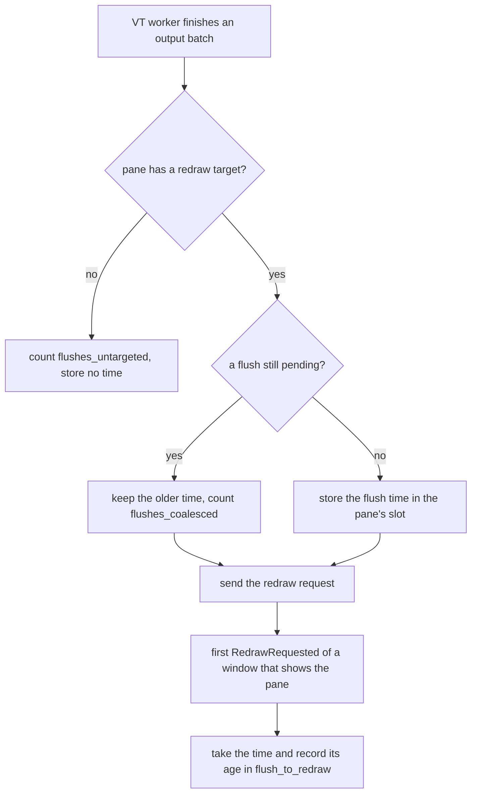

# Logging

[简体中文](Logging-zh-CN)

Start with the newest log below. Use `debug` for frame timing, `info` for memory
snapshots, and the bug-report checklist at the end. Crash and hang evidence has
its own section; a missing crash dump does not mean a clean exit.

## Paths

- Log files: `~/.sonicterm/logs/sonicterm.log.*`
- Fatal-signal fallback path: `~/.sonicterm/logs/sonicterm.log`
- Panic artifacts: `~/.sonicterm/logs/crashes/`
- Session markers: `~/.sonicterm/logs/sessions/`
- Bounded breadcrumbs: `~/.sonicterm/logs/breadcrumbs/`

`tracing-appender` uses daily names such as `sonicterm.log.YYYY-MM-DD`; the file
with the newest modification time is active. Size rotation may add a Unix-time
suffix. On Windows, `~` means the current user's profile directory. Native
runtime smokes on macOS, Windows, and Linux use the explicit `logs/` child of
`SONICTERM_RUNTIME_SMOKE_DIR` instead of the user log tree; their separate
`config/` child is used for config/reload state, and `HOME` is preserved. The
outer runner removes inherited `NO_COLOR` and retains failed stdout/stderr plus
SonicTerm logs for CI artifacts.

Performance scenario runs, the `perf_scenarios` example that
`scripts/perf-compare.py` drives, also stay out of the user log tree: each run
logs into a new scratch directory under the OS temporary directory, and `HOME`
is unchanged. The harness refuses an inherited `RUST_LOG`, which would replace
the configured level, so both sides of a comparison log through the same filter,
and it logs its scratch path at startup. The comparison parses the
`memory snapshot` line ([Aggregate snapshot at `info`](#aggregate-snapshot-at-info))
and, in `--laps` runs, the `[render_timing]` line
([Render and performance diagnostics](#render-and-performance-diagnostics)).
[Development and Release](Development-and-Release#isolation-checks) describes how
each run shows that `~/.sonicterm` did not change.

## Configuration and retention

```toml
[logging]
level = "warn"                    # error | warn | info | debug
max_file_size_mb = 10
max_rotated_files = 3
max_age_days = 2
max_crash_dumps = 10
max_crash_age_days = 2
max_crash_bytes = 10485760        # 10 MiB
max_breadcrumb_files = 10
max_breadcrumb_age_days = 2
max_breadcrumb_bytes = 1048576    # 1 MiB
```

`warn` is the default. SonicTerm reads `[logging]` before installing the tracing
subscriber, so the configured level applies to normal startup. `RUST_LOG`
overrides the configured filter for one run. Stderr follows that same filter
with an added global `warn` fallback; more specific target directives can still
emit `debug` lines there, so `warn` is not a hard stderr ceiling.

Before the appender opens, SonicTerm rotates an active log over
`max_file_size_mb` unless the value is `0`, then applies age and count limits to
older log files. The active file is never deleted. Crash and breadcrumb
artifacts are each bounded independently by count, age, and aggregate bytes;
oldest files are removed until all enabled limits are satisfied. Setting an age
or aggregate-byte limit to `0` disables that axis. Cleanup is fail-soft and
artifact cleanup runs on a background thread.

## Levels and diagnostic targets

| Level | What it admits |
| --- | --- |
| `error` | errors only |
| `warn` | warnings, errors, `sonic_exit`, `sonic::gpu` device records, and user-visible reclamation/exhaustion warnings |
| `info` | normal SonicTerm information plus the aggregate `memory snapshot` |
| `debug` | detailed SonicTerm diagnostics, pane/renderer memory lines, state-machine events, `render_timing`, `tear_out_timing`, and `frame_counters` |

`wgpu`, `naga`, `sonicterm-vt`, and `sonicterm-grid` remain warning-oriented in
the configured filters. Very hot font-shaper dumps are `trace`; no configured
level admits them. Use a targeted `RUST_LOG` directive only when investigating
that path.

## Font diagnostics

A missing configured font emits an `error` on the `config` target, naming its
family, weight, stretch and style. SonicTerm uses fallback fonts, so a running
window does not prove that the requested face loaded. Check `[font].family` in
`sonicterm.toml` and whether that font is available to SonicTerm; the diagnostic
links to the English [Configuration](Configuration) page, which has a language
switch. Synthesized bold/italic requests and fallback-only entries do not add
missing-font errors.

With the configured `warn`, `info` or `debug` filters, `config` errors reach
stderr but not the log file or crash history. `RUST_LOG` replaces the configured
filter rather than extending it. This capture recipe retains the default warning
filters and adds font-configuration errors to all three outputs:

```text
RUST_LOG=config=error,sonic_exit=warn,sonic=warn,sonicterm=warn,sonicterm_vt=warn,sonicterm_grid=warn,memory::reclaimed=warn,wgpu=warn,naga=warn
```

To preserve an existing custom filter, append `config=error` to its complete
value instead. The configured `error` filter also admits these errors. Repeated
errors can describe separate font resolutions; these errors have no deduplication
policy.

A missing-glyph warning instead reports the number of unresolved codepoints and
placeholder rendering without including the requested text. It recommends
installing a covering font or changing `[font].family`, using the same SonicTerm
configuration page. Its existing per-generation/hour warning throttle is
independent of missing-font errors. Neither message establishes the cause of GPU
software fallback; adapter diagnostics are described below.

## Local-path click diagnostics

Enable `[logging] level = "debug"` before reproducing an explicit local-path
click failure, or use `RUST_LOG=sonicterm_app::app::path_target=debug` for one run.
The `local path activation unverified` event records a click whose detected
explicit path has no current authorized filesystem selection. It uses the
immutable click snapshot, without re-reading the filesystem or the parser.
A confirmed-missing auto-detected path also logs this event; the click then
stays an ordinary terminal click.

| Field | Meaning |
| --- | --- |
| `window_id`, `pane_id`, `pointed`, `view_top` | Clicked window/pane, absolute cell, and viewport origin |
| `screen_epoch`, `scrollback_evicted` | Screen and retained-history identity |
| `cwd`, `cwd_revision` | That pane's OSC 7 authority/path and revision, not the process CWD |
| `clicked_path` | Explicit path text associated with the click |
| `candidates` | Bounded candidate set with typed provenance, resolved paths, and cell spans, in probe order |
| `reason` | Current probe failure key, or `path-error-pending` when no matching failure is available |

A pending result is not evidence that the file is missing. The event contains
paths, which can be sensitive, but no whole terminal rows or environment dump;
review it before sharing. Paths use escaped debug formatting, and one event may
be large even though candidate enumeration is bounded. Default `warn` logging
does not emit it. Hover and unverified bare-name clicks do not emit it either.

An absent event proves nothing about success or failure: logging may be disabled,
no target may have been detected, or a rejected target/native-open failure may
have followed another branch. Native-open failures retain their separate
`path open failed` warning. To investigate a relative-path failure, compare the
same file's relative path, absolute path, and local file URI in the same pane;
retain the matching click identity and do not infer its CWD from another shell.

## PTY input rejection diagnostics

The default `warn` level reports input that was refused, including terminal
parser replies. The producer assigns `source`: `Keyboard`, `Paste`, `FileDrop`,
`Ime`, `PointerButton`, `PointerMotion`, `Wheel`, `FocusReport`, `TerminalReply`,
`ScriptDraft`, or `StateMachine`. Sources are never guessed from payload bytes.

| Field | Meaning |
| --- | --- |
| `pane_id` | Stable pane identity supplied at the producer |
| `window_id` | The pane's current window when the event loop handles the rejection; absent after pane closure or when the event loop is unavailable |
| `source`, `rejected_bytes`, `reason` | Input category, refused byte length, and payload-free reason |
| `observation="concurrent"` | Queue and writer fields are independent observations, not one rejection-time transaction |
| `queued_messages`, `queued_bytes`, `queue_capacity` | Waiting message count, payload byte count, and four-slot limit; excludes the active native write |
| `writer_phase` | `Idle`, `Writing`, `Flushing`, or `Stopped`; a boundary observation, not a child-health verdict |
| `in_flight_bytes`, `in_flight_millis` | Active message size and time spent in the observed write or flush; time is absent when idle/stopped |
| `completed_messages` | Native writes whose `write_all` and `flush` both succeeded |

The event carries no rejected payload. Its debug representation, warnings, and
notification never include typed text, commands, paths, or clipboard content.
Notification follows the pane's current window after tab transfers; a closed
pane produces a warning but no notification on an unrelated window. When the
proxy is absent or event delivery fails, the producer logs the same metadata
without a current-window identity.

Production terminal replies enter a separate FIFO with 64 KiB RAM and private
temporary-file spill, outside parser and side-effect locks. UI queue saturation
does not discard replies, trigger rejection warnings, or stop output processing.
Storage/native failure is latched and reported once as `terminal reply delivery
failed` with pane identity and byte count; output, redraw, and exit observation
continue. Native writer/spool read errors are independently logged. Intentional
teardown releases spill storage without a rejection notice. See
[Terminal IO and VT](Terminal-IO-and-VT) for storage and delivery limits.

Four small messages can fill the channel before a healthy writer is scheduled.
Controlled tests use the production admission and writer loop to demonstrate
that burst draining preserves order. Separate blocked-write and blocked-flush
fixtures demonstrate zero queued bytes with one in-flight message, followed by
four additional queued messages and explicit refusal of the next message.
These fixtures distinguish mechanisms; they do not retrospectively identify
which producer or native condition caused an older un-attributed warning.

Queue capacity and per-message limits are unchanged. Each pane coalesces native
pointer motion into one fixed 64-byte slot before queue admission. A full queue
keeps the latest position pending and retries after 10 ms without requesting a
frame; a later position replaces it. Discrete input bundles preceding pending
motion into the same queue message when it fits, preserving byte order without
using an extra slot. A cap-sized or refused discrete message supersedes pending
motion rather than replaying it afterward. Disconnected motion is reported once
and cleared. A changed mouse-tracking/encoding/screen profile invalidates deferred
motion. A busy parser defers motion-only retries until its profile can be checked;
a following discrete input supersedes unvalidated motion rather than delaying the
key or replaying stale bytes. Pane teardown releases its slot. Other UI input still refuses
rather than blocking; worker-owned replies use the spill FIFO instead.
Interpret repeated observations of the same pane and progress counter rather than
a single `QueueFull` warning.

## PTY resize failure diagnostics

The default `warn` level reports a PTY resize the native layer refused, as one
`pty resize failed` event.

| Field | Meaning |
| --- | --- |
| `pane_id` | Stable pane identity of the pane whose PTY refused the resize |
| `cols`, `rows` | Requested geometry, not the geometry the pty currently holds |
| `error` | The failure rendered by `Display`. A native refusal shows the platform text; a zero axis shows `refusing pty resize to <cols>x<rows>` |

The event carries no terminal content: only the pane id, the requested columns
and rows, and the error.

Each pane logs only the first resize failure until a success resets its warning
latch; this avoids input-rate logs during tab activation or window drags.
Attempts still run: only invalid sizes and successful duplicates are skipped by
the IO boundary. The grid keeps the requested geometry. There is no rollback,
retry timer, or failure heartbeat.

## Render and performance diagnostics

`frame_collection` warns once per invalid-topology episode with `id` (window)
and `reason` when duplicate/missing leaves or active/zoom disagreement prevent a
complete frame. The latch resets only after a complete held frame passes viewport
reconciliation, not after valid source capture alone. Repeated post-lock validation
failures therefore stay in the same warning episode. Closing-tab `NoLayout` is
silent; ordinary lock contention does not emit this structural warning.

Set `level = "debug"`, restart, and reproduce the problem. The
`render_timing` target records frame phases including grid walking, overlay
assembly, glyph upload, surface acquisition, submission, and presentation. It
identifies main or child renderers, `mode=full`, and `damaged_rows`. No-op frames
return before completed-frame timing is emitted. Partial GPU damage limits the
draw scissor, not frame assembly. There is no separate render-timing option.

Each redraw that runs to completion writes one line for its window:
`[render_timing] window=<label> total=<ms>ms <lap>=<ms>ms ... tail=<ms>ms`.
`<label>` is `main` or `child`, each `<lap>` names a frame phase and the last is
`tail`, and every value is milliseconds with two decimals. In the log file the
line is the value of the event's `line` field, after `line=`.
`scripts/perf-compare.py` parses it only in `--laps` runs, which log at `debug`
and so write it: formatting the line costs time on every frame, so laps runs
form their own set and are never pooled with timed runs, which log at `info`
and write no `render_timing` line.

The same DEBUG target records `renderer initialization` operation boundaries.
Synchronous `renderer_init` spans carry `window_id`, `role`, and `shared`;
finishing a prepared startup carries `window_id`, `role`, and `prepared=true`
instead. `startup_prepare` spans identify owner-thread instance and surface
creation by `window_id`; `recovery_init` spans identify the requesting
`window_id` during `ContextRequest::run`, including startup requests. The
`renderer_finish` operation covers owner-thread assembly after negotiation.
Operation records retain their entry span as parent. `phase="enter"` precedes the call; `phase="return"` records
`elapsed_ms` and `outcome`. `ok` and `error` describe a returned `Result`;
`returned` means only that the call returned, not that initialization or
presentation succeeded. Surface configuration has a separate `phase="gate"`
record with the existing device gate's `accepted` reading.

Operations cover instance creation/reuse, surface creation and capabilities,
adapter/device requests, surface configuration, pipelines, frame storage,
atlas storage/uploads, font stacks, and cell metrics. An unmatched entry can
mean an unfinished call, unwind, or lost log output; it is not a diagnosis by
itself. Elapsed time includes scheduling and diagnostic overhead, not just
native execution. With DEBUG disabled, the timing helper reads no clock and
retains no span. These records add no terminal payload, font names, paths, or
environment values.

Font operations also use `render_timing` at DEBUG. Entry and explicit return
records separate `shape_impl` from `fallback_receive`, `rasterizer_new` from
`rasterize_glyph`, and uncached font resolution from metrics. `font_shape`
spans carry `loaded_font_id` and retry `iteration`; `font_raster` spans carry
only `loaded_font_id` and `fallback_idx`. Neither includes a glyph index or
character. Renderer `font_style` spans identify `bold`, `italic`, and `row`.
The Windows native font test adds a `font_phase` parent with `window_id`,
`scale`, and the test phase; this parent is specific to that fixture.

Each queued fallback request captures its own dispatcher and parent, rather
than inheriting the first request's context on the reused worker. Its
`font_request` span carries `request_id`. The return-only `queue_wait` record
measures from request-context capture to worker entry, including request
preparation and worker startup when applicable. Lookup records distinguish
`fallback_locator`, `fallback_font_dirs`, `fallback_built_in`, and
`fallback_selection`. `completion_called=true` marks the point immediately
before invoking the existing completion callback; `false` means no handles
were selected and the callback is not invoked. An `error` outcome from
`fallback_receive` can mean the sender disconnected because no fallback was
found; it is not by itself a rendering failure.

Disabled font timing reads no diagnostic clock, allocates no request ID, and
retains no span or dispatcher. A disabled request suppresses only these timing
records, not ordinary worker logs, and restores the previous timing state on
return or unwind. Enabled timing adds clocks and output, including a record
under the existing pending-fallback lock before the callback, so it can change
scheduling. These durations do not distinguish active native work from waiting
or scheduling delay, and a run without a stall does not explain a previous one.

Startup logs the selected wgpu adapter, device type, and software-adapter
classification. On RDP, VM, or VDI hosts, look for `software-render degrade
engaged` and compare it with `[appearance].software_render_mode` on
[Configuration](Configuration). `scripts/perf-compare.py` reads each scenario run's first `wgpu adapter
selected` line, or else its first `wgpu adapter reused` line, for `backend`,
`name`, `driver`, `device_type`, and `software_rendering`; a comparison names
that adapter in its presenter row, and a run on another adapter than its set's
first valid run makes the pair invalid. At `level = "debug"`, each renderer also writes
`renderer LCD subpixel policy` at startup and whenever mode, opacity, theme, or
presenter state changes. Its `requested`, `effective`, `windows_host`,
`opaque_target`, `software_presenter`, and `dual_source_supported` fields explain
every LCD-to-grayscale fallback without relying on a screenshot.

At `info`, `DPI transition synchronized` records `window_id`, `old_scale`,
`new_scale`, `native_scale`, and `size_scale` alongside `old_inner`, `suggested`,
`minimum`, `available`, and `target`. `renderer_before`/`renderer_after` are
physical surface pixels; `cell_before`/`cell_after` are raster-pixel cell extents.
On macOS, `size_scale` follows the native backing scale because `old_inner` is
already reported in that domain. The other platforms use the stored old scale.
These paired inputs/outputs distinguish double scaling from a surface or cell
mismatch without recording terminal content.

## Frame and lock counters

The `frame_counters` target holds debug-only counters for what `render_timing`
cannot see: redraws that were deferred or found a lock busy, frame outcomes
other than a presented frame, present intervals, parser lock waits and holds,
flush-to-redraw delay, dispatch stalls, wake causes, foreground-process probes,
buffer uploads, row-cache hits, and shaping requests. They change no behavior.

### Turning the counters on

Set `[logging].level = "debug"`; the Debug filter admits `frame_counters`. A
`RUST_LOG` that admits `frame_counters=debug` works too. Each App reads the
filter once, when it starts, and keeps that decision for its lifetime, so a level
change takes effect only after a restart. A process that embeds the App, such as
a test harness, can force an App's counters on whatever the filter, but only
before that App creates its first window or pane; the App refuses afterwards.
Forced counters count, and their lines appear only where the filter admits
`frame_counters`.

With the counters off, each instrumented path makes one check and stops there:
no clock read, no atomic or thread-local write, and no allocation. With them on,
the App allocates once its VT statistics, its dispatch totals, one line state per
window and for the app line, and one closed-windows record; each window allocates
its counters and each pane one 8-byte pending-flush slot. Nothing is allocated per
frame or per batch, apart from building a line at most once a second.

### Line format

```text
[frame_counters] window=<main|child-N|app> [final=1] span_ms=<ms> <field>=<value> ...
```

Each window writes `window=main` or `window=child-N`, where N is the window's
registration order in the App, and the App writes one `window=app` line. Each
source writes at most one line a second. Values are deltas since that source's
previous line, `span_ms` is the time since that line, and zero counts and empty
histograms are left out.

A window line follows a frame attempt, a flush the window took, or any other
window event for it; a `RedrawRequested` that neither attempted a frame nor took
a flush prints no window line. The app line follows any window or user event.
Maintenance wakes (`new_events`, `about_to_wait`, a resume-time wake, and the
30-second retention wake) are counted but never print a line, and no timer is
armed for one, so an App that only wakes for maintenance logs nothing.

At window close and at exit, a source with pending counts writes one last line
marked `final=1`, and nothing from that source follows it. A closed window's
totals, including its renderer's counts and the handler time of the event that
closed it, move into an App-wide closed-windows aggregate, so the App's totals
never drop. Every count and sum is cumulative and never reset; a reader keeps its
previous snapshot and takes deltas.

### Window fields

| Field | Unit | Meaning |
| --- | --- | --- |
| `attempts` | count | redraws that passed the deferral rules and went on to collect a frame |
| `presented` | count | attempts that presented a frame |
| `cached` | count | attempts that re-presented the cached frame |
| `settled` | count | attempts that settled without presenting |
| `retry` | count | attempts the renderer asked to retry |
| `surface_retry` | count | attempts that hit a surface retry |
| `stopped` | count | attempts that found the GPU device stopped |
| `failed` | count | attempts that failed |
| `contention_parser` | count | frame collections that found a visible pane's parser lock busy |
| `contention_images` | count | frame collections that found a visible image store busy |
| `defer_timeout` | count | redraws deferred because a surface timeout is pending within the frame period |
| `defer_contention` | count | redraws deferred by the lock-contention retry floor |
| `defer_streaming` | count | redraws deferred by streaming-output pacing |
| `contention_retry_armed` | count | lock-contention retries armed |
| `native_request_redraw` | count | native redraw requests for the window, on every request path; a dispatch's requests reach the totals when it ends, so a window line shows them one dispatch late (`final=1` lines are complete) |
| `user_request_redraw` | count | `UserEvent::RequestRedraw` events for the window, which output flushes send |
| `redraw_requested` | count | `RedrawRequested` events for the window |
| `present_interval` | ms histogram | time between consecutive presented frames |
| `handler` | ms histogram | each `window_event` dispatch for the window |
| `flush_to_redraw` | ms histogram | oldest pending flush to the first redraw of a window that shows the pane |

The three `defer_*` counts record the rule that won. The rules are checked in
that order, and a later one is never evaluated once an earlier one holds, so each
deferred redraw counts once ([Rendering Modes](Rendering-Modes#lock-contention-retry)
describes the retry floor).

At each `RedrawRequested`, `flush_to_redraw` takes the pending flush of every
pane the window shows: the active tab's panes, or the zoomed pane. A hidden
pane's flush waits until its tab is shown. One observation covers a group of
coalesced flushes.

### App fields

| Field | Unit | Meaning |
| --- | --- | --- |
| `wake_init`, `wake_poll`, `wake_wait_cancelled`, `wake_resume_time` | count | `new_events` wakes by cause: `Init`, `Poll`, `WaitCancelled`, `ResumeTimeReached` |
| `wake_user` | count | `user_event` dispatches |
| `native_request_redraw_unregistered` | count | native redraw requests for a window id with no registered counters, such as a window already closed; one app-wide total |
| `about_to_wait` | ms histogram | each `about_to_wait` dispatch |
| `user_event` | ms histogram | each `user_event` dispatch |
| `new_events` | ms histogram | each `new_events` dispatch |
| `ui_parser_locks` | count | event-loop-thread locks of a pane's parser |
| `ui_parser_wait` | µs histogram | the wait for each of those locks |
| `fg_probe_calls` | count | foreground-process probes |
| `fg_probe_panes` | count | panes those probes covered |
| `fg_probe` | µs histogram | each probe's duration |

On macOS a probe is a native per-pane process lookup, and on Windows a native
process-table snapshot, for one pane or for a batch of panes. A Windows batch with
no panes takes no snapshot and is not counted. On other platforms, Linux included,
the probe is a stub that reports nothing, so `fg_probe_calls` counts calls that do
no native work.

### VT fields

The VT fields print on the `window=app` line. They are one App-wide aggregate that
every pane's VT worker records into, with no per-pane split. A pane that closed,
or whose worker finishes after it, still adds to it.

| Field | Unit | Meaning |
| --- | --- | --- |
| `parser_lock_wait` | µs histogram | the VT worker's wait for a pane's parser lock |
| `parser_lock_hold` | µs histogram | how long the worker held that lock |
| `parse` | µs histogram | parsing under the lock |
| `parse_bytes` | bytes | bytes parsed |
| `batches` | count | nonempty output batches; a batch that takes the lock several times counts once, and each acquisition is recorded in the histograms |
| `flushes` | count | redraw requests a worker sent after output, with or without a target |
| `flushes_untargeted` | count | flushes while the pane had no redraw target; no timestamp is stored |
| `flushes_coalesced` | count | flushes that found an earlier flush still pending, which keeps its time |

No identity holds between `flushes`, `flushes_untargeted`, `flushes_coalesced`,
and the `flush_to_redraw` count. A pane that closes drops its pending timestamp,
and separate counters are not read as one snapshot, so read each on its own.

### Renderer fields

The renderer fields print on their window's line. Each count belongs to the
renderer that collected it.

| Field | Unit | Meaning |
| --- | --- | --- |
| `vertex_bytes` | bytes | bytes written to the vertex buffer |
| `index_bytes` | bytes | bytes written to the index buffer |
| `damage_permille_sum` | permille | sum of each frame's damaged share of the surface; divide by `damaged_frames` for the mean |
| `damaged_frames` | count | frames whose damage was recorded |
| `software_frames` | count | frames the software presenter drew, on Windows with software-render degradation |
| `gpu_frames` | count | frames drawn through wgpu, including degraded frames on macOS and Linux |
| `row_cache_hits` | count | row glyph cache lookups that hit |
| `row_cache_misses` | count | row glyph cache lookups that missed |
| `shape_requests` | count | `FontStack` shaping and measuring requests the renderer made |
| `full_frames` | count | frames whose render plan was `Full`; a frame whose plan was `Noop` is not counted |
| `row_cache_invalidate_visits` | count | row glyph cache entries examined while invalidating dirty rows: the cache's size at each `invalidate_row_abs` call, which scans the whole table |
| `row_cache_invalidate_us` | µs | total time spent invalidating dirty rows, as a plain sum; one clock pair per pane that invalidates at least one row, taken inside that pane's row loop so counting never changes which cached rows are kept |
| `recolor_glyphs_visited` | count | glyphs examined when recoloring glyphs under the cursor or a quick-select hint on the frame's main glyph list; overlay text is not counted |
| `assembly` | µs histogram | CPU frame assembly in the renderer: from the frame-key check to the end of overlay assembly, before the atlas-retry check, upload, surface acquire, submit and present; one sample per assembled frame, including frames that later retry or fail to present; a `Noop` or skipped frame adds none. It is not the app's `render` lap |

`shape_requests` counts each call to `FontStack::shape_text_with_style`,
`shape_text`, or `measure_text_width`, failures included; a call skipped for empty
text is not a request. It counts requests, not HarfBuzz attempts or fallback
retries.

### Histograms

Every duration is a cumulative bucket histogram with an exact sum.

| Unit | Bucket upper bounds |
| --- | --- |
| ms | 4, 7, 9, 12, 17, 25, 34, 50, 100, then above 100 |
| µs | 10, 50, 100, 500, 1000, 5000, then above 5000 |

A value equal to a bound falls in that bound's bucket. On a line, a histogram
prints its bucket counts in order, its sum, its p95, and its maximum:

```text
<name>_ms=[<count>,...] <name>_sum_us=<µs> <name>_p95_le_ms=<bound> <name>_max_le_ms=<bound>
```

A µs histogram uses `_us` in place of `_ms`. The sum is exact: the sum of the
recorded microsecond values, at the clock's resolution and with the
instrumentation's own cost included, so the sum divided by the bucket total is the
mean. The p95 and the maximum are never exact. `_le_<unit>=N` means at or below
the bound N, and `_gt_<unit>=N` means in the overflow bucket above the largest
bound N.

### Measurement boundaries

Around each lock of a pane's parser, the VT worker reads the clock four times:
before `lock()`, as it returns, after parsing, and after the keyboard-snapshot
store, before the guard drops. The wait is the first interval, the parse the
second, and the hold runs from the second read to the fourth. The last three reads
happen under the lock and lengthen the hold slightly; that is the enabled cost.
Every subtraction and counter update waits until the guard has dropped.

Every event-loop-thread lock of a pane's parser goes through one `lock_parser`
helper. Inside a dispatch of an App whose counters are on, it reads the clock
before and after `lock()`, then, with the guard held, adds one bucket increment
and one sum to thread-local counters that the App takes at the end of the
dispatch. Otherwise it is exactly `lock()`.



The worker stores the flush time before it sends the redraw request, so the event
loop never wakes before the time is published. A flush published while a redraw
is taking the slot is taken by that redraw or left for the next one, never lost or
counted twice.

Readings are observational. Fields are read one after another, not as one atomic
snapshot, and a count belongs to the line or snapshot that read it after it was
published; several batches may publish between two field reads.

### What the counters do not measure

The counters do not split keystroke latency at the flush. `flush_to_redraw`
measures delivery and scheduling delay to the first redraw, and does not credit a
presented frame. Maxima and p95s are bucket bounds, sums include the
instrumentation's own cost, and shaping counts are requests, not HarfBuzz work.

## GPU device error diagnostics

Each wgpu device keeps one error state, shared by every window built from the
same GPU context. The `sonic::gpu` target writes one record per state change and
one for the first isolated fault; the default filter's `sonic=warn` admits them.
Repeated errors update counts without writing new records.

| Message | Level | Written when |
| --- | --- | --- |
| `GPU device stopped accepting work` | `error` | a Validation, OutOfMemory, or Internal error moves the device from `Usable` to `Unusable` |
| `GPU device lost` | `error` | the device-lost callback records `Lost`, including after an intentional destroy |
| `contained isolated GPU error` | `warn` | the first isolated fault from the test fault hook; later ones only count |

| Field | Meaning |
| --- | --- |
| `generation` | process-unique number of the device |
| `state` | device state when the record was written |
| `kind` | error class that caused the record: validation, out of memory, internal, or device loss |
| `operation` | label of the renderer operation that raised the error, such as `render.submit`, `try_resize`, or `glyph_upload.rebuild` |
| `description` | wgpu's error message |
| `lost_reason` | wgpu's loss reason; empty except on loss records |
| `destroy_requested` | whether SonicTerm destroyed the device on purpose; on state-change records |
| `validation`, `out_of_memory`, `internal`, `isolated`, `lost` | coalesced counts per error kind |

After an `error` record, every window stops drawing on that device. Shells,
input, sessions, and window lifecycle keep working. A recorded loss starts
shared-device recovery; an unusable device without loss remains stopped.
Each affected renderer logs one warning, `render error` for main or
`child render error` for another window, the first time it observes the stop.
[Architecture Internals](Architecture-Internals) has the containment rules.

### Shared-device recovery records

The `sonic::gpu::recovery` target is admitted by the default `sonic=warn` filter.
Warnings identify scheduling, request admission or refusal, negotiation and
renderer preparation/commit failures, timeouts, busy-worker refusals, actual
request completion (`outcome` and `decision`), and a successful
`shared GPU recovery committed`. Error records identify a
disconnected worker, an unusable device without a loss, and
`shared GPU recovery exhausted; terminal sessions remain running`.

`generation` identifies the committed or newly committed device, `ticket`
identifies an admitted request, `attempt` is its one-based budget position,
`delay_ms` is the scheduled backoff in milliseconds, and `rebound` is the
number of renderers committed together. Failure records include the native
error where available. These records contain no terminal output or input.

A successful commit record proves replacement and gate acceptance, not native
scanout or that a later frame presented. The stability timer starts only on an
acknowledged `Presented` frame. A request timeout does not prove the native
worker exited, and shutdown disposal is best-effort; compare request identities
and later completion records rather than interpreting silence as cleanup.
The retry policy and limits are on [Rendering Modes](Rendering-Modes).

## Memory diagnostics

### Aggregate snapshot at `info`

At `level = "info"`, `target="memory"` writes one `memory snapshot` at most
every 30 seconds. It combines OS process figures, all sampled pane seams, visible
and warm renderers, and one shared-device allocator reading:

The following log examples are schematic, not captured measurements. Angle-bracket
values stand for runtime fields; `<metric>` can be a byte count or `unsupported`,
and `<delta>` can be a signed change or `unavailable`. Lines wrap for readability.

```text
memory snapshot process_private_committed_bytes=<metric> process_resident_bytes=<metric>
                process_virtual_bytes=<metric> process_private_committed_delta=<delta>
                process_resident_delta=<delta> process_virtual_delta=<delta>
                session_total_bytes=<bytes> session_delta=<delta>
                grid_visible_bytes=<bytes> grid_history_bytes=<bytes> grid_alternate_bytes=<bytes>
                parser_bytes=<bytes> hyperlink_bytes=<bytes> inline_media_bytes=<bytes>
                pty_output_bytes=<bytes> pty_input_bytes=<bytes> panes_total=<count> panes_sampled=<count> panes_contended=<count>
                renderer_total_bytes=<bytes> renderer_total_items=<count>
                renderer_row_glyph_cache_bytes=<bytes> renderer_row_glyph_cache_items=<count>
                renderer_row_quad_cache_bytes=<bytes> renderer_row_quad_cache_items=<count> renderer_delta=<delta>
                live_renderers=<count> renderers="visible[<window-id>] glyph=<bytes>/<items> image=<bytes>/<items> row_glyph=<bytes>/<items> row_quad=<bytes>/<items> software=<bytes>/<items> total=<bytes>/<items>; warm[<slot>] glyph=<bytes>/<items> image=<bytes>/<items> row_glyph=<bytes>/<items> row_quad=<bytes>/<items> software=<bytes>/<items> total=<bytes>/<items>"
                allocator_state=measured allocator_source=main allocator_label=<window-id>
                allocator_allocated_bytes=<bytes> allocator_reserved_bytes=<bytes>
                allocator_allocations=<count> allocator_blocks=<count> allocator_largest_block_bytes=<bytes>
```

Process figures come from the OS, so they include allocator fragmentation,
retired pages, mapped files, GPU-driver mappings, and thread stacks that
SonicTerm's own seams do not count.

| Field | Meaning |
| --- | --- |
| `process_private_committed_bytes` | memory charged to this process alone; Windows reports `PrivateUsage`, macOS and Linux report `unsupported` |
| `process_resident_bytes` | pages currently resident in physical memory; macOS reports resident size, Windows reports `WorkingSetSize`, and Linux reports `unsupported` |
| `process_virtual_bytes` | reserved address space; macOS and Windows measure it, Linux reports `unsupported`; measured values can be hundreds of gigabytes without representing consumed memory |
| `*_delta` | change since the preceding snapshot; `+0` is measured, while `unavailable` means no comparable sample |
| `panes_total` | all panes visited |
| `panes_sampled` | panes included in `session_total_bytes` |
| `panes_contended` | panes skipped because a parser or inline-image lock was busy; non-zero makes the session total partial |
| `renderer_total_bytes` / `renderer_total_items` | CPU-side storage across visible and warm renderers |
| `renderer_row_glyph_cache_bytes` / `renderer_row_glyph_cache_items` | per-row glyph-instance and decoration cache storage and cached row count across renderers |
| `renderer_row_quad_cache_bytes` / `renderer_row_quad_cache_items` | per-row background/decoration quad cache storage and cached row count across renderers |
| `live_renderers` | process-wide renderer count; a count above the `renderers` entries can expose an unreachable live renderer |
| `renderers` | per-renderer role and glyph/image/row-cache/software storage breakdown |
| `allocator_state` | `measured`, `unsupported` for a backend without a report or a stopped GPU device, or `none` before a renderer exists |
| `allocator_source` / `allocator_label` | renderer class and identifier used for the one shared-device reading |
| `allocator_allocated_bytes` | bytes assigned to live wgpu allocations |
| `allocator_reserved_bytes` | bytes reserved in wgpu allocator blocks |
| `allocator_allocations` | live allocation count |
| `allocator_blocks` | allocator block count |
| `allocator_largest_block_bytes` | largest allocator block in bytes |

The allocator is reported once per shared device/context, not once per renderer.
Sampling shares the retention cadence. An idle session wakes for a due sample,
but that wake suppresses redraw and draws no frame.

`scripts/perf-compare.py` reads this line from every scenario run
([Comparing performance](Development-and-Release#comparing-performance)). Each
scenario's final memory checkpoint comes at least 60 s after GO, when the
harness releases the workloads (5 s with `--short`, as in the smoke). Most
scenarios end with an idle phase that lasts at least until then; S4 and S5 end
on their 60 s stream phase, with the `date` loop still running, and S12 ends on
its 10 s uncovered hold. S11 and S12 also take intermediate checkpoints. A
checkpoint's figures come from the latest `memory snapshot` line at or before
it, so they can be up to about one 30-second sampling interval older than the
checkpoint. The `process_*` byte fields read a byte count or `unsupported`,
while `session_total_bytes` and `renderer_total_bytes` are always integers.
`renderer_total_bytes` counts renderers' CPU-side storage only, and the macOS
process sample has no footprint figure, so in a managed run `perf-compare.py`
answers each checkpoint request with a macOS `footprint` reading. It bounds
`footprint` at 40 s and writes the checkpoint's `.done` file only after
`footprint` has exited and been reaped, or when it never launched; otherwise
`.done` is withheld, and the harness's own wait ends the run. If `.done` does
not appear within 60 s, the harness ends the run at once as invalid (exit 3),
with a reason that names the checkpoint, and the next phase never starts. That
is not an occlusion: the smoke fails instead of retrying it, and a comparison
retries the run.

### Pane and session detail at `debug`

At `level = "debug"`, the same cadence writes one `pane retention` line for each
sampled pane, then one `session retention` line. A pane whose parser or
inline-image lock is busy is skipped, not waited on.

```text
pane retention pane="<window-id>/<pane-id>" total_bytes=<bytes>
               grid_visible_bytes=<bytes> grid_history_bytes=<bytes>
               grid_alternate_bytes=<bytes> parser_bytes=<bytes> hyperlink_bytes=<bytes>
               inline_media_bytes=<bytes> pty_output_bytes=<bytes> pty_input_bytes=<bytes>
               largest_seam="<seam-name>" largest_seam_bytes=<bytes>
session retention panes=<count> total_bytes=<bytes> grid_visible_bytes=<bytes>
                  grid_history_bytes=<bytes> grid_alternate_bytes=<bytes> parser_bytes=<bytes>
                  hyperlink_bytes=<bytes> inline_media_bytes=<bytes>
                  pty_output_bytes=<bytes> pty_input_bytes=<bytes>
```

The eight seam fields are disjoint and sum to `total_bytes`:

| Field | What it owns | First response |
| --- | --- | --- |
| `grid_visible_bytes` | current screen rows, prompt storage, rare attributes, and grid-container overhead | no action; this includes the screen |
| `grid_history_bytes` | retained scrollback | lower `scrollback` if needed |
| `grid_alternate_bytes` | saved primary-screen rows and history while the alternate screen is active | leave the full-screen program |
| `parser_bytes` | in-flight escape or media-capture buffers | recheck the next sample; normally transient |
| `hyperlink_bytes` | interned OSC 8 URI and id strings | no action; bounded and reclaimed when links leave retained history |
| `inline_media_bytes` | decoded inline images retained by panes | display fewer images or close image-heavy panes |
| `pty_output_bytes` | local PTY output queued or in flight | let output drain |
| `pty_input_bytes` | input queued toward the shell, usually a large paste | let the shell drain it |

Read `largest_seam` first, then compare at least five consecutive samples. A
large flat working set is different from a value that rises every sample. Pane
labels contain window and pane identifiers; a pane keeps its pane id after a tab
moves even though the window id changes.

### Renderer detail at `debug`

Each visible or warm renderer also writes one `renderer retention` line:

```text
renderer retention window="<window-id>" role="visible" total_bytes=<bytes>
                   glyph_atlas_bytes=<bytes> glyph_atlas_items=<count>
                   image_atlas_bytes=<bytes> image_atlas_items=<count>
                   row_glyph_cache_bytes=<bytes> row_glyph_cache_items=<count>
                   row_quad_cache_bytes=<bytes> row_quad_cache_items=<count> software_frame_bytes=<bytes>
renderer retention window="warm[<slot>]" role="warm" total_bytes=<bytes>
                   glyph_atlas_bytes=<bytes> glyph_atlas_items=<count>
                   image_atlas_bytes=<bytes> image_atlas_items=<count>
                   row_glyph_cache_bytes=<bytes> row_glyph_cache_items=<count>
                   row_quad_cache_bytes=<bytes> row_quad_cache_items=<count> software_frame_bytes=<bytes>
```

| Field | What it owns | First response |
| --- | --- | --- |
| `glyph_atlas_bytes` | CPU glyph-atlas capacity for this renderer | bounded; a warm entry is controlled by `warm_window_pool` |
| `glyph_atlas_items` | glyph entries in that atlas | use with bytes to distinguish occupancy from capacity |
| `image_atlas_bytes` | CPU inline-image atlas pixel-buffer capacity, including the nonempty 1×1 placeholder allocation | reduce image use or renderer count |
| `image_atlas_items` | inline-image atlas entries | use with bytes to identify image occupancy |
| `row_glyph_cache_bytes` | hash-table backing plus cached glyph, underline, tofu, and missing-character vector capacities | compare with cached rows; pane departure releases that pane's payload while table capacity can remain at its high-water mark |
| `row_glyph_cache_items` | cached glyph rows | a falling count with flat bytes can mean reusable table capacity remains |
| `row_quad_cache_bytes` | hash-table backing plus cached background/decoration quad vector capacities | compare with cached rows and pane/window churn |
| `row_quad_cache_items` | cached quad rows | a falling count confirms row eviction even when table capacity is sticky |
| `software_frame_bytes` | full-window Windows software-present buffer | reduce window size; zero outside that path |

`role="warm"` means the renderer belongs to the standby pool, not a visible
window; closing a window does not release it. Renderer figures are host memory,
not GPU video memory.

### Reclamation warnings

The default `warn` filter admits warnings on `memory::reclaimed` because they
explain visible loss:

```sh
grep 'memory::reclaimed' ~/.sonicterm/logs/sonicterm.log*
```

- `cancelled a media capture that stopped receiving` means no bytes arrived for
  two 30-second samples. The incomplete image will not appear and staging was
  reclaimed.
- `discarded inline images from idle panes to stay within the process ceiling`
  means older decoded images were removed; resend any still needed.

The default filter also admits `inline image atlas full; skipped older images
without evicting text glyphs` on `sonic::glyph_atlas`; renderer atlas pressure
prevented older images from being uploaded. `inline media evicted to hold the
process-wide ceiling` is a warning on the `memory` target and therefore appears
when `level` is `info` or `debug`; it means a pane removed older images while
retaining at least its newest image.

## Crash, hang, and exit evidence

The panic hook runs on every thread and writes a session-tagged
`crashes/crash-<timestamp>.log` containing version, panic payload, source
location, forced backtrace, and up to 50 admitted tracing events. Normal shutdown
writes `sonic_exit` warning lines. On Unix, the first of SIGSEGV, SIGBUS, SIGILL,
SIGABRT, and SIGFPE to arrive appends a fixed `FATAL: SIG…` line through an
async-signal-safe path. The handler then calls the action installed before it,
at most once per process, with the original signal information, so Rust's
runtime can still name a thread that overflowed its stack. When that action
returns, or there was none, the handler raises the signal again under its
default action. That ends the process, so the operating system can still
produce its diagnostics, which describe the raised signal rather than the
original fault; an ignored fatal signal still ends the process. A stack
overflow is therefore logged as `FATAL: SIGSEGV` (or `SIGBUS`), although the
process then ends by the SIGABRT that follows Rust's report. Windows relies on
WER or LocalDumps when the system is configured to create them.

Crash history uses the selected `RUST_LOG`/configured filter without widening
it, plus a DEBUG ceiling and an explicit persistence predicate. TRACE is never
retained there, even when an output sink opts in. Font shaping text and
collections use `sonicterm_font::payload`, which is excluded from crash history
at every level; normal warning/error targets retain safe stage/count diagnostics.
Routine white-text and untinted-color-glyph emission is not a warning.

Each record owns at most 4 KiB of variable payload, including at most 256 bytes
of target. The ring also enforces a 64 KiB aggregate variable-capacity bound and
the 50-record limit, evicting oldest records. Formatting uses bounded storage
and UTF-8-safe truncation; `[truncated]` fits inside each cap. Fixed metadata is
bounded separately by record count. Panic payload text and the rendered summary
each have an independent 4 KiB bound, read from borrowed panic data.

Backtrace capture/output and a chained panic hook are separate surfaces. These
limits cover recorder-controlled formatting/retention, not allocations inside
arbitrary producer `Debug` implementations or a guarantee that arbitrary logs
contain no secrets. Payload TRACE remains opt-in normal-sink evidence; structured
breadcrumbs keep their separate metadata-only contract.

A hang may produce no panic artifact. On macOS, sample before force-quitting:

```sh
sample <pid> 10 -file /tmp/sonicterm-hang.sample.txt
grep -nE 'dispatch_sync_f_slow|redraw_target|__psynch_cvwait' \
  /tmp/sonicterm-hang.sample.txt
```

`SIGKILL`, Force Quit, `TerminateProcess`, power loss, and a hard OOM run no
cleanup code. SonicTerm cannot write a final line or post-failure dump in those
cases. Instead it leaves two pre-failure records:

1. `sessions/session-<id>.marker` records only session id, pid, version,
   platform, start time, and state. A stale marker means the session was not
   marked clean; native PTY teardown that did not settle also leaves it behind.
   It does not identify the cause. Live sibling processes are skipped,
   damaged markers still count as evidence, and each prior marker is reported
   once on the next launch.
2. `breadcrumbs/breadcrumbs-<id>.log` is a bounded atomic snapshot with no
   terminal text, commands, environment values, tokens, or credentials. It pins
   the latest version, platform, renderer, counts, full process resource sample,
   retention, allocator state, and bounded lifecycle transitions. Its
   `event=retention` record includes `renderer_bytes`,
   `row_glyph_cache_bytes` / `row_glyph_cache_items`, and
   `row_quad_cache_bytes` / `row_quad_cache_items`, so the last complete
   pre-failure snapshot preserves both row-cache size and occupancy. A separate
   fixed-cost `event=resource_history private_committed=... resident=...` sample
   is taken immediately and every 5 seconds, retaining at most 48 samples.
   Virtual address space appears only in the full `event=resource` record.

A breadcrumb rewrite replaces the old file atomically. The surviving file after
a hard kill is the latest complete pre-failure snapshot, not a dump and not
proof of cause. The default file budget is 64 KiB; configured limits must be able
to hold all mandatory records, lifecycle capacity, and one maximum-width history
line. The absolute minimum is 4096 bytes.

On the next launch, SonicTerm also checks OS records by conservative filename
convention:

| Platform | Locations checked |
| --- | --- |
| macOS | `~/Library/Logs/DiagnosticReports`, `/Library/Logs/DiagnosticReports` (`.ips`) |
| Windows | `%LOCALAPPDATA%\CrashDumps`, `%LOCALAPPDATA%\Microsoft\Windows\WER\ReportQueue`, `...\ReportArchive` |

A match only “may relate to” SonicTerm. The Windows check does not read WER
registry configuration, so no file means only that the standard locations held
no match.

## Bug-report bundle

Include:

1. SonicTerm and OS versions.
2. The last 200 lines of the newest `sonicterm.log*` file.
3. The relevant panic artifact, OS record, or process sample, if present.
4. Exact reproduction steps and a screenshot or short recording for visual,
   input, VT, font, or layout defects.
5. Hardware/software adapter information for rendering problems.
6. For memory growth, at least five consecutive `memory snapshot` records; with
   `debug`, also include the identified pane's `pane retention` lines and all
   `session retention` and relevant `renderer retention` lines over the same
   interval. State the pane's `largest_seam` and what the session was doing.

Do not post secrets, tokens, full environment dumps, terminal output, or
sensitive command data.
