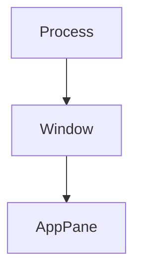

# 内存

[English](Memory)

下表说明每项内存上限及达到上限后的处理。排查进程增长时，按[日志](Logging-zh-CN)比较连续
采样。本页解释各读数统计什么；协议和图集细节见[终端 IO 与 VT](Terminal-IO-and-VT-zh-CN)
与[渲染与字体](Rendering-and-Fonts-zh-CN)。

### 资源上限

| 所有者 | 精确上限 | 达到上限时 |
| --- | --- | --- |
| 网格几何 | 任一轴 ≤ 4,096；单个可见屏幕 ≤ 524,288 个单元格；可见区 + 历史 + 已保存主屏幕 ≤ 1,048,576 个单元格 | 限制尺寸和请求的历史行数 |
| 网格保留存储 | `MAX_GRID_CELLS × size_of::<Cell>()`，当前构建约 24 MiB，由可见区/历史/已保存主屏幕共用 | 压缩行容量，再以每批 64 行删除最老历史；滚动路径每 512 行摊销检查一次 |
| 单元格组合附加内容 | 每个单元格 64 个 UTF-8 字节 | 不再保留额外零宽数据 |
| OSC 8 注册表 | 16,384 个链接；每个 URI 8 KiB；每个客户端 id 1 KiB；合计元数据 8 MiB | 回收已无保留单元格引用的条目后接纳；仍无空间则拒绝新链接 |
| 转义序列 | 1 MiB | 一直丢弃到终止符 |
| OSC 0/2/7/8 原始收集器 | 整个负载 16 KiB | 拒绝超长输入；报告保留容量，不增加媒体捕获计数 |
| 媒体负载 | 每个传输 16 MiB | 拒绝，不截断也不局部显示 |
| 媒体捕获暂存 | 进程共 64 MiB；下限 4 MiB；保证 13 个并发下限预留 | 无法暂存时拒绝；连续两次 30 s 采样无进度后取消 |
| 已解码内联图像 | 每窗格 64 MiB 且最多 128 张；256 MiB 进程目标按存活窗格平分；最小 4 MiB 且保留最新一张 | 删除最老图像；在空闲窗格扫描收敛前，受压进程最多可在目标之外为每个存活窗格保留一份 4 MiB 最新图像余量 |
| 编码图像尺寸 | 声明宽高 ≤ 2,048，像素数 ≤ 2,048² | 解码前拒绝 |
| 渲染图像尺寸 | 宽高 ≤ 1,024；BGRA8 ≤ 4 MiB | 缩放 iTerm2/kitty 图像；Sixel 解码进有界缓冲 |
| PTY 输入 | 每窗格另有固定 64 字节待发指针移动槽；UI 队列四条，每条 16 MiB；回复 FIFO 使用含帧头的 64 KiB 内存、≤32 KiB writer 输出、≤32 KiB + 4 B 读取暂存、≤32 KiB 应用回复批次载荷及 <32 KiB 解析器分派载荷（可增长向量可能保留空闲容量） | UI 拒绝时保留原字节；回复溢出到私有临时存储，不等待原生输入容量 |
| 回复溢出磁盘 | 不设固定磁盘配额；已消费前缀保留到 FIFO 文件排空 | 排空、writer 退出或窗格销毁时删除；存储错误显式终止回复交付，但输出与退出观察继续 |
| PTY 输出 | 64 个排队数据块，加一个阻塞中的发送数据块；每个由 64 KiB 读取环形缓冲支持；结构最坏值为 4.0625 MiB | 阻塞读取线程，由操作系统施加背压 |
| 字形图集 | 每渲染器一个 2048×2048 BGRA8 CPU 图集，16 MiB、16,384 个条目 | 淘汰最冷的四分之一并重试 |
| 图像图集 | 默认 1×1 占位符；仅媒体活跃时使用 2048×2048 BGRA8 | 填满时跳过较早图像；连续 240 个无媒体帧后释放为占位符 |
| Windows 软件帧 | 任一轴 ≤ 16,384；总量 ≤ 160 MiB | 拒绝创建或调整尺寸，并保留旧的有效分配 |
| 窗格命令事件 | 1,024 个事件 | 丢弃最早事件并缩小向量容量 |
| 崩溃事件历史 | 50 条记录；每条自有可变负载最多 4 KiB，其中 target 最多 256 字节；可变保留量合计最多 64 KiB | 格式化时限制大小，并按条数和字节上限淘汰最早记录 |
| Panic 文本 | dump 负载和格式化摘要各最多 4 KiB | 在 UTF-8 边界截断，标记也计入上限 |

媒体捕获暂存和已解码内联图像各自按一个共享池记账：生产解析器在
`CaptureStagingPool::process_default()` 中暂存，生产窗格向
`InlineMediaPool::process_default()` 计费，这正是这些上限覆盖整个进程的原因。
需要测量接纳或预算的测试会注入私有池，而不是共用一把锁。

崩溃历史负载保留精确长度的自有字符串，不额外保留字符串空闲容量。固定记录元数据另受记录
数量限制；backtrace、串联 panic hook，以及任意生产端 formatter 内的分配都不在可变保留量
上限内。接纳与负载排除规则见[日志](Logging-zh-CN)。

内联媒体的 256 MiB 被准确称为进程**目标**，不是绝对上限。每个窗格都必须保留最新
图像，而单张已解码图像最多 4 MiB。因此受压时可陈述的总上限为：

```text
256 MiB + 存活窗格数 × 4 MiB
```

只要 `存活窗格数 × 4 MiB` 仍能放进目标内，周期性空闲窗格扫描就会把总量降回
256 MiB 或以下。较大的公式既描述收敛前的边界，也在每窗格一张图像的最低需求本身
超过目标时继续作为上限。

网格约 24 MiB 的数值同样是一个共享上限，不是“回滚 24 MiB 再加可见屏幕”。
`[terminal].scrollback` 设置行数上限；带超链接、组合字符或非默认下划线元数据的行更大，
因此单元格数量或保留字节可能先达到上限。

`CSI 3 J` 会释放活动主屏幕历史和多余的历史容器容量，不降低用户请求的历史上限或
实际配置上限。只有这次显式擦除会重置预算检查计数；普通 FIFO 行复用仍保持每 512 次
滚动的检查节奏。历史前缀删除会更新精确淘汰身份和提示符坐标，包括随主屏幕保存的提示符。
缩小列数只修复每行新右边界被截断的宽字符首格，保留紧凑游程和现有容量滞后策略，
不会为检查边界而展开整段历史。

### 所有权模型

`sonicterm-resource` 按所有者与 `ResourceClass` 跟踪计费，不持有载荷内存。
进程内治理器保存所有者树和账本；RAII 预留令牌在析构时释放计费。

生产 GUI 拓扑为：



类型系统还定义了 `SharedFont`、`SharedRaster`、`SharedAtlas`、`LocalPty` 和 mux
所有者种类，但 GUI 不注册这些节点。当前生产注册只有 `Process → Window → AppPane`。

所有者 id 单调递增且永不复用。合法父子组合取决于 `ProcessKind`，创建时会检查。
所有者状态从 `Open` 变为 `Closing`，再变为 `Closed`；进入 `Closing` 后不再接纳新子节点
和新预留，最终关闭要求没有存活子节点和记账额。

窗口插入与其所有者注册是同一个操作。共享拓扑完成步骤会注册主窗口和子窗口中的无所有者
窗格，每次 30 s 保留量扫描也会协调它们。标签页转移先准备目标窗格所有者，通过一次原子的
`transfer_many` 移动所有转移窗格的全部现有计费，再替换守卫并关闭已清空的源所有者。即使
解析器锁被占用，进程和分类总量也不变。拒绝时释放临时所有者，完整恢复源标签页、原有计费和
存活 PTY，之后才可能执行源窗口回收。

窗口注册失败时，该窗口仍可在层级记账之外使用。只有没有非零计费的窗格才能进入这种未注册
状态；已计费标签页不能在转移时悄悄丢失记账。只要窗口具有所有者，失败的窗格注册仍可重试。

### 限制执行与窗格绊线

每个接缝（即网格、解析器或 PTY 队列这样的所有权边界）负责执行自己的上限。GUI 治理器的进程和按类别上限为无限，窗口所有者也只用于
跟踪。这样不会再维护一套可能与实际分配代码漂移的进程级限制。

每个 `AppPane` 所有者仍有一个已提交字节绊线。类型化的
`pane_seam_cap_terms()` 清单让每个实际计费的窗格类别恰好出现一次。可见区、历史区与已保存
主屏幕共用同一个网格上限，因此由 `GridVisible` 携带该值，`GridHistory` 与
`GridAlternate` 携带零；`ParserCapture` 同时携带两个解析器上限；PTY 输入的队列上限只计一次：

```text
PANE_SEAM_CAP_SUM_BYTES = sum(pane_seam_cap_terms().bytes)
PANE_COMMITTED_BUDGET_BYTES = 2 × PANE_SEAM_CAP_SUM_BYTES
```

系数 2 为分配器容量、摊销过冲和最新图像余量留出空间。它用于发现某个接缝已经停止
设限或少报保留量，不是正常分配的第二套策略。每次保留量扫描通过失败原子的 `try_resize`
结算已有计费，包括字节和条目反向变化的情况。准入检查最终替换量，而不是中间峰值。
任一维增长都要求祖先开放；纯减少可在关闭期间结算。拒绝采样时保留旧计费，因此总账可能
落后于实际保留量，直到后续采样成功。快照只供观察，不是全局线性化的总量。

### 记账内容

单个窗格报告包含八个互不重叠的接缝：

| 字段 | 所属内存 |
| --- | --- |
| `grid_visible_bytes` | 可见行、提示符存储和稀有单元格属性 |
| `grid_history_bytes` | 保留的回滚行 |
| `grid_alternate_bytes` | 备用屏幕活跃时保存的主屏幕 |
| `parser_bytes` | 传输中的转义序列和媒体捕获缓冲 |
| `hyperlink_bytes` | 驻留的 OSC 8 id 与 URI |
| `inline_media_bytes` | 窗格保留的已解码图像像素 |
| `pty_output_bytes` | 排队 PTY 输出固定的环形缓冲内存 |
| `pty_input_bytes` | 排队输入向量 |

`total_bytes` 是八项之和，`largest_seam` 指出最大项。`session retention` 行会对所有
已采样窗格汇总同样字段。

渲染器内存单独报告，因为它属于窗口而不是窗格：

- `glyph_atlas_bytes`：CPU 字形图集容量；
- `image_atlas_bytes`：CPU 内联图像图集容量；
- `row_glyph_cache_bytes` / `row_glyph_cache_items`：哈希表后备存储、缓存字形实例、
  下划线段、tofu 几何、缺失字符和缓存行数；
- `row_quad_cache_bytes` / `row_quad_cache_items`：哈希表后备存储、缓存背景/装饰
  quad 向量和缓存行数；
- `software_frame_bytes`：Windows CPU/GDI 帧，其它平台为零。

这些都是主机内存副本。GPU 纹理与缓冲不在其中，因为显卡驱动拥有它们，wgpu 也不提供
大小。行缓存报告按已分配的哈希表与嵌套向量容量计算，而不是按当前长度。普通 clear/retain
后表容量具有粘性；窗格离开渲染器时，SonicTerm 会在同一个事件循环操作中先删除该窗格的
字形行，再删除 quad 行，保留其它窗格的条目并请求压紧表。嵌套负载和条目数会立即下降，
但表分配器可以保留当前 bucket 档位。报告会列出所有可见和预热渲染器。
`live_renderers` 来自独立的进程级计数器；若该计数大于可列出的渲染器集合，说明有一个
仍存活但已无法从窗口拓扑访问的渲染器。

这些字段不是渲染器整个堆的清单。帧键元数据、临时帧计划与绘制向量以及其它未列出的
主机分配不计入 `renderer_total_bytes`；操作系统进程读数还包含已计费分类以外的内存。

### 聚合快照

把日志级别设为 `info`，最多每 30 s 得到一条 `memory snapshot`：

```toml
[logging]
level = "info"
```

这是顺序执行的诊断采样，不是可线性化的单一时刻快照。每个窗格的解析器、内联媒体和
PTY 队列分别读取；各窗格、渲染器、共享分配器及操作系统内存也依次采样。
即使 `panes_contended=0`，这些读数也不是同时取得的，采样计费更不是分配时的准入上限。

该行合并：

- 操作系统给出的 `process_private_committed_bytes`、`process_resident_bytes`、
  `process_virtual_bytes` 及其变化量；
- 会话总量和全部八个窗格接缝；
- `panes_total`、`panes_sampled`、`panes_contended`；
- 渲染器总量、角色和 `live_renderers`；
- 一次共享设备分配器读数。

`process_virtual_bytes` 是保留地址空间，不是实际占用。GPU 进程可能保留数百 GB 地址空间，
但并未常驻同等内存。应把 resident/private 数据与 `session_total_bytes`、
`renderer_total_bytes` 对照。

没有数值时会明确说明原因：

| 取值 | 含义 |
| --- | --- |
| `unsupported` | 平台或后端不提供该数据 |
| `unavailable` | 没有可比较的上一次采样 |
| `panes_contended=N` | N 个窗格因解析器或内联图像锁被占用而跳过，会话总量不完整 |
| `allocator_state=none` | 没有渲染器，因此没有查询分配器 |

macOS 的私有/已提交内存为 `unsupported`；SonicTerm 会报告常驻与虚拟内存，
但不会拿虚构值替代 `phys_footprint`。Windows 的私有/已提交内存是 `PrivateUsage`，
常驻内存是 `WorkingSetSize`。Linux 与其它没有进程内存采样器的平台会把三项操作系统
数据都报告为 `unsupported`；窗格、渲染器和分配器记账仍会运行。

分配器按共享设备/上下文只采样一次，来源优先为主渲染器，否则使用确定性的可见或
预热回退。可测量报告包含：

```text
allocator_allocated_bytes
allocator_reserved_bytes
allocator_allocations
allocator_blocks
allocator_largest_block_bytes
```

软件适配器在 wgpu 30 中使用 `MemoryHints::MemoryUsage`，硬件适配器使用
`MemoryHints::Performance`。D3D12 上，软件策略把初始分配器块从设备 128 MiB / 主机 64 MiB 改为
设备 8 MiB / 主机 4 MiB。这些只是放置与块大小提示，不是分配上限；
更大的资源仍可分配。

### 详细保留量与回收

设置 `debug` 后可查看按窗格和按渲染器的行：

```toml
[logging]
level = "debug"
```

30 s 扫描使用 `try_lock`，绝不等待窗格解析器或内联图像锁。注册、协调、记账、停滞捕获取消和空闲
媒体回收在所有日志级别下都会运行，只有日志输出受级别控制。仅用于采样的唤醒不会请求重绘。

两种回收会移除用户可见内容，因此即使在默认 `warn` 级别也写入
`memory::reclaimed` 日志目标：

```sh
grep 'memory::reclaimed' ~/.sonicterm/logs/sonicterm.log*
```

| 消息 | 含义 |
| --- | --- |
| `cancelled a media capture that stopped receiving` | 连续两个 30 s 周期没有字节到达；已释放暂存，该图像不会显示 |
| `discarded inline images from idle panes` | 从仍持有较少窗格时期份额的窗格中删除了较早图像 |

单个偏大快照不能证明持续增长。应比较连续多次采样。`grid_history_bytes` 上升指向回滚；
`inline_media_bytes` 上升指向图像；`parser_bytes` 连续多次保持较高说明有传输尚未结束。
`panes_contended` 非零表示聚合值低估了会话。

### 代码位置

| 主题 | 主要路径 |
| --- | --- |
| 治理器、账本、预留 | `crates/sonicterm-resource/src/{ledger,owner,reservation}.rs` |
| 资源契约与所有者种类 | `crates/sonicterm-types/src/resource.rs` |
| 窗格限制与所有者注册 | `crates/sonicterm-app/src/app/mod.rs` |
| 窗格测量、记账、回收 | `crates/sonicterm-app/src/app/retention.rs` |
| 聚合快照 | `crates/sonicterm-app/src/app/memory_snapshot.rs` |
| 内联媒体上限 | `crates/sonicterm-app/src/app/media.rs` |
| 网格与超链接上限 | `crates/sonicterm-grid/src/{grid,hyperlink}.rs` |
| 解析器捕获上限 | `crates/sonicterm-vt/src/vt.rs`、`crates/sonicterm-vt/src/vt/staging.rs` |
| PTY 队列上限 | `crates/sonicterm-io/src/pty.rs` |
| 渲染器保留量与分配器报告 | `crates/sonicterm-gpu/src/core.rs` |
