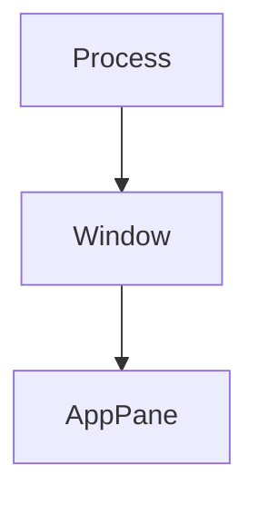

# Memory / 内存

## English

SonicTerm bounds memory at the subsystem that owns it, then reports retained
host memory by pane, renderer, and process. This page owns resource limits,
ownership, and accounting. Protocol details are in
[Terminal IO and VT](Terminal-IO-and-VT); atlas behavior is in
[Rendering and Fonts](Rendering-and-Fonts); log storage and postmortem evidence
are in [Logging](Logging).

### Resource limits

| Owner | Exact bound | Behavior at the bound |
| --- | --- | --- |
| Grid geometry | axis ≤ 4,096; one visible screen ≤ 524,288 cells; visible + history + saved primary ≤ 1,048,576 cells | dimensions and requested history are clamped |
| Grid retained storage | `MAX_GRID_CELLS × size_of::<Cell>()`, about 24 MiB on the current build, shared by visible/history/saved primary | compact row capacity, then drop oldest history in 64-row blocks; scroll-path checks are amortized every 512 rows |
| Cell combining extras | 64 UTF-8 bytes per cell | additional zero-width data is not retained |
| OSC 8 registry | 16,384 links, 8 KiB per URI, 1 KiB per client id, 8 MiB combined metadata | reclaim entries no retained cell references, then admit; otherwise refuse the new link |
| Escape sequence | 1 MiB | discard through its terminator |
| Media payload | 16 MiB per transfer | refuse rather than truncate or partially render |
| Media capture staging | 64 MiB process-wide; 4 MiB floor; 13 concurrent floor reservations guaranteed | refuse an unstaged capture; cancel after two unchanged 30 s progress samples |
| Decoded inline images | 64 MiB and 128 images per pane; 256 MiB process target divided across live panes; 4 MiB minimum and newest image retained | discard oldest images; a process under pressure may retain at most one 4 MiB newest-image residual per live pane beyond the target until the idle-pane pass converges |
| Encoded image dimensions | declared width/height ≤ 2,048 and pixels ≤ 2,048² | reject before decode |
| Rendered image dimensions | width/height ≤ 1,024; BGRA8 ≤ 4 MiB | resize iTerm2/kitty images; Sixel decodes into the bounded buffer |
| PTY input | four queued messages, 16 MiB each | return `MessageTooLarge`, `QueueFull`, or `WriterDisconnected` with the bytes intact |
| PTY output | 64 queued chunks plus one blocked sender chunk, each backed by a 64 KiB reader ring; structural worst case 4.0625 MiB | block the reader and apply OS backpressure |
| Glyph atlas | one 2048×2048 BGRA8 CPU atlas per renderer, 16 MiB and 16,384 entries | evict the coldest quarter and retry |
| Image atlas | 1×1 placeholder; 2048×2048 BGRA8 only while media is active | skip older images when full; release to placeholder after 240 media-free frames |
| Windows software frame | axis ≤ 16,384; total ≤ 160 MiB | reject construction or resize and preserve the old valid allocation |
| Pane command events | 1,024 events | drop the oldest and shrink retained vector capacity |

The inline-media figure is deliberately stated as a process **target**, not an
absolute 256 MiB ceiling. Every pane must keep its newest image, and one decoded
image is bounded at 4 MiB. The stateable aggregate bound under pressure is
therefore:

```text
256 MiB + live_panes × 4 MiB
```

While `live_panes × 4 MiB` fits the target, the periodic idle-pane walk returns
the total to 256 MiB or below. The larger formula is the pre-convergence bound,
and remains the bound when the required one-image-per-pane floor itself exceeds
the target.

The grid’s approximate 24 MiB figure is also one shared bound, not “24 MiB of
scrollback plus the visible screen.” `[terminal].scrollback` sets a row limit;
cell count and retained bytes can bind first when rows carry hyperlinks,
combining marks, or non-default underline metadata.

### Ownership model

`sonicterm-resource` provides the process-local resource governor: an owner
hierarchy, accounting ledger, and RAII reservation tokens. RAII ties cleanup to
an object's lifetime: a reservation owns its charge and releases it on drop. The governor answers how much is held, by
which owner, in which `ResourceClass`; it does not own the memory.

Production GUI topology is:



The type system also defines `SharedFont`, `SharedRaster`, `SharedAtlas`,
`LocalPty`, and mux owner kinds, but the GUI does not register those nodes.
Current production registration is only `Process → Window → AppPane`.

Owner ids are monotonic and never reused. Legal parent/child combinations depend
on `ProcessKind` and are checked at creation. An owner moves from `Open` to
`Closing` to `Closed`; closing stops new children and reservations, and final
close requires zero live children and charges.

A window and its owner are inserted as one operation. Panes are reconciled under
their actual window on pane creation and every 30 s retention pass. Tab transfer
creates a pane owner below the destination window, moves every existing committed
class charge to it as one atomic batch, swaps the pane's owner guard, then closes
the empty source owner. Process and per-class totals therefore stay unchanged,
and a contended parser cannot leave the moved pane temporarily uncharged. A
rejected batch leaves every charge on the source owner and removes the empty
provisional owner. If window registration fails, the window remains usable but
its subtree is omitted from hierarchy accounting. If pane registration fails, a
later reconcile can retry it while the window has an owner.

### Enforcement and the pane tripwire

Each seam—an ownership boundary such as the grid, parser, or PTY queue—enforces
its own limit. The GUI governor uses unlimited process and
per-class limits, and window owners are tracking-only. This avoids maintaining a
second set of process limits that can drift from the code doing the allocation.

Each `AppPane` owner does have one committed-byte tripwire. The typed
`pane_seam_cap_terms()` inventory contains every charged pane class exactly
once. Because visible, history, and saved-primary cells share one grid bound,
`GridVisible` carries that cap while `GridHistory` and `GridAlternate` carry
zero. `ParserCapture` carries both parser caps, and PTY input carries its queue
cap once:

```text
PANE_SEAM_CAP_SUM_BYTES = sum(pane_seam_cap_terms().bytes)
PANE_COMMITTED_BUDGET_BYTES = 2 × PANE_SEAM_CAP_SUM_BYTES
```

The factor of 2 leaves room for allocator capacity, amortized overshoot, and the
newest-image residual. It is a backstop for a seam that stopped bounding or
under-reported its retention, not a second normal allocation policy. Pane
charges are remeasured and moved to committed reservations every retention pass;
they are not accumulated from historical events.

### What is counted

One pane report contains eight disjoint seams:

| Field | Owned memory |
| --- | --- |
| `grid_visible_bytes` | visible rows, prompt storage, and rare cell attributes |
| `grid_history_bytes` | retained scrollback rows |
| `grid_alternate_bytes` | saved primary screen while the alternate screen is active |
| `parser_bytes` | in-flight escape and media-capture buffers |
| `hyperlink_bytes` | interned OSC 8 ids and URIs |
| `inline_media_bytes` | decoded image pixels retained by the pane |
| `pty_output_bytes` | ring memory pinned by queued PTY output |
| `pty_input_bytes` | queued input vectors |

`total_bytes` is their sum. `largest_seam` names the largest part. A
`session retention` line sums the same fields across sampled panes.

Renderer memory is separate because it is window-owned rather than pane-owned:

- `glyph_atlas_bytes`: CPU glyph atlas capacity;
- `image_atlas_bytes`: CPU inline-image atlas capacity;
- `row_glyph_cache_bytes` / `row_glyph_cache_items`: hash-table backing, cached
  glyph instances, underline runs, tofu geometry, missing characters, and row count;
- `row_quad_cache_bytes` / `row_quad_cache_items`: hash-table backing, cached
  background/decoration quad vectors, and row count;
- `software_frame_bytes`: Windows CPU/GDI frame, zero elsewhere.

These are host-memory copies. GPU textures and buffers are not included because
the driver owns them and wgpu does not expose their sizes. Row-cache reports use
allocated table and nested-vector capacity, not live length. Table capacity is
sticky across ordinary clear/retain operations; when a pane leaves a renderer,
SonicTerm removes that pane's glyph rows and then quad rows in one event-loop
operation, preserves peer entries, and requests table compaction. Nested payload
and item counts fall immediately, while the table allocator may retain its
current bucket class. Every visible and warm renderer is listed.
`live_renderers` comes from an independent process-wide counter; a count larger
than the listed renderer set indicates a live renderer that is no longer
reachable from window topology.

### Aggregate snapshot

Set the log level to `info` for one `memory snapshot` at most every 30 s:

```toml
[logging]
level = "info"
```

The line combines:

- `process_private_committed_bytes`, `process_resident_bytes`, and
  `process_virtual_bytes` from the OS, with deltas;
- the session total and all eight pane seams;
- `panes_total`, `panes_sampled`, and `panes_contended`;
- renderer totals, roles, and `live_renderers`;
- one shared-device allocator reading.

`process_virtual_bytes` is reserved address space, not consumption. GPU
processes can reserve hundreds of gigabytes without holding that much resident
memory. Compare resident/private figures with `session_total_bytes` and
`renderer_total_bytes`.

Absence states are explicit:

| Value | Meaning |
| --- | --- |
| `unsupported` | the platform or backend does not expose this figure |
| `unavailable` | no previous comparable sample exists |
| `panes_contended=N` | N busy panes were skipped; the session total is partial |
| `allocator_state=none` | no renderer exists, so no allocator was queried |

On macOS, private/committed is `unsupported`; SonicTerm reports resident and
virtual memory but does not substitute an invented value for `phys_footprint`.
On Windows, private/committed is `PrivateUsage` and resident is
`WorkingSetSize`. Linux and other platforms without a process-memory sampler
report all three OS figures as `unsupported`; pane, renderer, and allocator
accounting still runs.

The allocator is sampled once per shared device/context, from the main renderer
or a deterministic visible/warm fallback. A measured report includes:

```text
allocator_allocated_bytes
allocator_reserved_bytes
allocator_allocations
allocator_blocks
allocator_largest_block_bytes
```

Software adapters use wgpu 30 `MemoryHints::MemoryUsage`; hardware adapters use
`MemoryHints::Performance`. On D3D12, the software policy changes initial
allocator blocks from 128 MiB device / 64 MiB host to 8 MiB device / 4 MiB host.
Those are placement and block-sizing hints, not allocation caps; larger
resources still allocate.

### Detailed retention and reclamation

Set `debug` for per-pane and per-renderer lines:

```toml
[logging]
level = "debug"
```

The 30 s pass uses `try_lock`; it never waits for a pane parser. Registration,
reconciliation, charging, stalled-capture cancellation, and idle-media
reclamation run at every log level. Only emission is gated. A sampling-only
wake does not request a redraw.

Two reclamations remove user-visible content and therefore log on the
`memory::reclaimed` target even at the default `warn` level:

```sh
grep 'memory::reclaimed' ~/.sonicterm/logs/sonicterm.log
```

| Message | Meaning |
| --- | --- |
| `cancelled a media capture that stopped receiving` | no bytes arrived for two 30 s intervals; staging was released and the image will not appear |
| `discarded inline images from idle panes` | older images were removed from panes that held a share sized for fewer live panes |

A large single snapshot is not evidence of growth. Compare several consecutive
samples. Rising `grid_history_bytes` points to scrollback; rising
`inline_media_bytes` points to images; `parser_bytes` that remains high across
samples points to an in-flight transfer. A nonzero `panes_contended` means the
aggregate understates the session.

### Code locations

| Topic | Primary paths |
| --- | --- |
| Governor, ledger, reservations | `crates/sonicterm-resource/src/{ledger,owner,reservation}.rs` |
| Resource contracts and owner kinds | `crates/sonicterm-types/src/resource.rs` |
| Pane limits and owner registration | `crates/sonicterm-app/src/app/mod.rs` |
| Pane measurement, charging, reclamation | `crates/sonicterm-app/src/app/retention.rs` |
| Aggregate snapshot | `crates/sonicterm-app/src/app/memory_snapshot.rs` |
| Inline-media limits | `crates/sonicterm-app/src/app/media.rs` |
| Grid and hyperlink limits | `crates/sonicterm-grid/src/{grid,hyperlink}.rs` |
| Parser capture limits | `crates/sonicterm-vt/src/vt.rs` |
| PTY queue limits | `crates/sonicterm-io/src/pty.rs` |
| Renderer retention and allocator report | `crates/sonicterm-gpu/src/core.rs` |

## 中文

SonicTerm 在真正拥有内存的子系统边界实施限制，再按窗格、渲染器和进程报告保留的
主机内存。本页负责资源上限、所有权与记账。协议细节见[终端 IO 与 VT](Terminal-IO-and-VT)，
图集行为见[渲染与字体](Rendering-and-Fonts)，日志存储与故障后证据见[日志](Logging)。

### 资源上限

| 所有者 | 精确上限 | 达到上限时 |
| --- | --- | --- |
| 网格几何 | 任一轴 ≤ 4,096；单个可见屏幕 ≤ 524,288 个单元格；可见区 + 历史 + 已保存主屏幕 ≤ 1,048,576 个单元格 | 限制尺寸和请求的历史行数 |
| 网格保留存储 | `MAX_GRID_CELLS × size_of::<Cell>()`，当前构建约 24 MiB，由可见区/历史/已保存主屏幕共用 | 压缩行容量，再以每批 64 行删除最老历史；滚动路径每 512 行摊销检查一次 |
| 单元格组合附加内容 | 每个单元格 64 个 UTF-8 字节 | 不再保留额外零宽数据 |
| OSC 8 注册表 | 16,384 个链接；每个 URI 8 KiB；每个客户端 id 1 KiB；合计元数据 8 MiB | 回收已无保留单元格引用的条目后接纳；仍无空间则拒绝新链接 |
| 转义序列 | 1 MiB | 一直丢弃到终止符 |
| 媒体负载 | 每个传输 16 MiB | 拒绝，不截断也不局部显示 |
| 媒体捕获暂存 | 进程共 64 MiB；下限 4 MiB；保证 13 个并发下限预留 | 无法暂存时拒绝；连续两次 30 s 采样无进度后取消 |
| 已解码内联图像 | 每窗格 64 MiB 且最多 128 张；256 MiB 进程目标按存活窗格平分；最小 4 MiB 且保留最新一张 | 删除最老图像；在空闲窗格扫描收敛前，受压进程最多可在目标之外为每个存活窗格保留一份 4 MiB 最新图像余量 |
| 编码图像尺寸 | 声明宽高 ≤ 2,048，像素数 ≤ 2,048² | 解码前拒绝 |
| 渲染图像尺寸 | 宽高 ≤ 1,024；BGRA8 ≤ 4 MiB | 缩放 iTerm2/kitty 图像；Sixel 解码进有界缓冲 |
| PTY 输入 | 队列四条，每条 16 MiB | 返回 `MessageTooLarge`、`QueueFull` 或 `WriterDisconnected`，并保留原字节 |
| PTY 输出 | 64 个排队数据块，加一个阻塞中的发送数据块；每个由 64 KiB 读取环形缓冲支持；结构最坏值为 4.0625 MiB | 阻塞读取线程，由操作系统施加背压 |
| 字形图集 | 每渲染器一个 2048×2048 BGRA8 CPU 图集，16 MiB、16,384 个条目 | 淘汰最冷的四分之一并重试 |
| 图像图集 | 默认 1×1 占位符；仅媒体活跃时使用 2048×2048 BGRA8 | 填满时跳过较早图像；连续 240 个无媒体帧后释放为占位符 |
| Windows 软件帧 | 任一轴 ≤ 16,384；总量 ≤ 160 MiB | 拒绝创建或调整尺寸，并保留旧的有效分配 |
| 窗格命令事件 | 1,024 个事件 | 丢弃最早事件并缩小向量容量 |

内联媒体的 256 MiB 被准确称为进程**目标**，不是绝对上限。每个窗格都必须保留最新
图像，而单张已解码图像最多 4 MiB。因此受压时可陈述的总上限为：

```text
256 MiB + 存活窗格数 × 4 MiB
```

只要 `存活窗格数 × 4 MiB` 仍能放进目标内，周期性空闲窗格扫描就会把总量降回
256 MiB 或以下。较大的公式既描述收敛前的边界，也在每窗格一张图像的最低需求本身
超过目标时继续作为上限。

网格约 24 MiB 的数值同样是一个共享上限，不是“回滚 24 MiB 再加可见屏幕”。
`[terminal].scrollback` 设置行数上限；带超链接、组合字符或非默认下划线元数据的行更大，
因此单元格数量或保留字节可能先达到上限。

### 所有权模型

`sonicterm-resource` 提供进程内资源治理器：所有者层级、记账账本和 RAII 预留令牌。
RAII 表示把清理绑定到对象生命周期；预留令牌拥有自己的记账额，释放时自动归还。治理器回答“哪个所有者以哪个
`ResourceClass` 持有多少”，但不拥有内存本身。

生产 GUI 拓扑为：


类型系统还定义了 `SharedFont`、`SharedRaster`、`SharedAtlas`、`LocalPty` 和 mux
所有者种类，但 GUI 不注册这些节点。当前生产注册只有 `Process → Window → AppPane`。

所有者 id 单调递增且永不复用。合法父子组合取决于 `ProcessKind`，创建时会检查。
所有者状态从 `Open` 变为 `Closing`，再变为 `Closed`；进入 `Closing` 后不再接纳新子节点
和新预留，最终关闭要求没有存活子节点和记账额。

窗口插入与其所有者注册是同一个操作。窗格创建时和每次 30 s 保留量扫描时，都会把窗格
协调到实际窗口下面。标签页转移会先在目标窗口下创建窗格所有者，把全部现有的已提交分类
计费作为一个原子批次移给它，再替换窗格的所有者守卫并关闭已清空的源所有者。因此进程总量
和各分类总量都保持不变，即使解析器锁正被占用，已移动窗格也不会暂时变成未计费状态。批次
被拒绝时，全部计费仍精确留在源所有者上，并移除空的临时所有者。若窗口注册失败，窗口仍可
使用，但整个子树不会出现在层级记账中。若窗格注册失败，只要窗口已有所有者，之后的协调
扫描仍可重试。

### 限制执行与窗格绊线

每个接缝（即网格、解析器或 PTY 队列这样的所有权边界）负责执行自己的上限。GUI 治理器的进程和按类别上限为无限，窗口所有者也只用于
跟踪。这样不会再维护一套可能与实际分配代码漂移的进程级限制。

每个 `AppPane` 所有者仍有一个已提交字节绊线。类型化的
`pane_seam_cap_terms()` 清单让每个实际计费的窗格类别恰好出现一次。可见区、历史区与已保存
主屏幕共用同一个网格上限，因此由 `GridVisible` 携带该值，`GridHistory` 与
`GridAlternate` 携带零；`ParserCapture` 同时携带两个解析器上限；PTY 输入的队列上限只计一次：

```text
PANE_SEAM_CAP_SUM_BYTES = sum(pane_seam_cap_terms().bytes)
PANE_COMMITTED_BUDGET_BYTES = 2 × PANE_SEAM_CAP_SUM_BYTES
```

系数 2 为分配器容量、摊销过冲和最新图像余量留出空间。它用于发现某个接缝已经停止
设限或少报保留量，不是正常分配的第二套策略。每次保留量扫描都会重新测量窗格记账额，
并移动到已提交预留；不会从历史事件不断累加。

### 记账内容

单个窗格报告包含八个互不重叠的接缝：

| 字段 | 所属内存 |
| --- | --- |
| `grid_visible_bytes` | 可见行、提示符存储和稀有单元格属性 |
| `grid_history_bytes` | 保留的回滚行 |
| `grid_alternate_bytes` | 备用屏幕活跃时保存的主屏幕 |
| `parser_bytes` | 传输中的转义序列和媒体捕获缓冲 |
| `hyperlink_bytes` | 驻留的 OSC 8 id 与 URI |
| `inline_media_bytes` | 窗格保留的已解码图像像素 |
| `pty_output_bytes` | 排队 PTY 输出固定的环形缓冲内存 |
| `pty_input_bytes` | 排队输入向量 |

`total_bytes` 是八项之和，`largest_seam` 指出最大项。`session retention` 行会对所有
已采样窗格汇总同样字段。

渲染器内存单独报告，因为它属于窗口而不是窗格：

- `glyph_atlas_bytes`：CPU 字形图集容量；
- `image_atlas_bytes`：CPU 内联图像图集容量；
- `row_glyph_cache_bytes` / `row_glyph_cache_items`：哈希表后备存储、缓存字形实例、
  下划线段、tofu 几何、缺失字符和缓存行数；
- `row_quad_cache_bytes` / `row_quad_cache_items`：哈希表后备存储、缓存背景/装饰
  quad 向量和缓存行数；
- `software_frame_bytes`：Windows CPU/GDI 帧，其它平台为零。

这些都是主机内存副本。GPU 纹理与缓冲不在其中，因为显卡驱动拥有它们，wgpu 也不提供
大小。行缓存报告按已分配的哈希表与嵌套向量容量计算，而不是按当前长度。普通 clear/retain
后表容量具有粘性；窗格离开渲染器时，SonicTerm 会在同一个事件循环操作中先删除该窗格的
字形行，再删除 quad 行，保留其它窗格的条目并请求压紧表。嵌套负载和条目数会立即下降，
但表分配器可以保留当前 bucket 档位。报告会列出所有可见和预热渲染器。
`live_renderers` 来自独立的进程级计数器；若该计数大于可列出的渲染器集合，说明有一个
仍存活但已无法从窗口拓扑访问的渲染器。

### 聚合快照

把日志级别设为 `info`，最多每 30 s 得到一条 `memory snapshot`：

```toml
[logging]
level = "info"
```

该行合并：

- 操作系统给出的 `process_private_committed_bytes`、`process_resident_bytes`、
  `process_virtual_bytes` 及其变化量；
- 会话总量和全部八个窗格接缝；
- `panes_total`、`panes_sampled`、`panes_contended`；
- 渲染器总量、角色和 `live_renderers`；
- 一次共享设备分配器读数。

`process_virtual_bytes` 是保留地址空间，不是实际占用。GPU 进程可能保留数百 GB 地址空间，
但并未常驻同等内存。应把 resident/private 数据与 `session_total_bytes`、
`renderer_total_bytes` 对照。

没有数值时会明确说明原因：

| 取值 | 含义 |
| --- | --- |
| `unsupported` | 平台或后端不提供该数据 |
| `unavailable` | 没有可比较的上一次采样 |
| `panes_contended=N` | N 个繁忙窗格被跳过，会话总量不完整 |
| `allocator_state=none` | 没有渲染器，因此没有查询分配器 |

macOS 的私有/已提交内存为 `unsupported`；SonicTerm 会报告常驻与虚拟内存，
但不会拿虚构值替代 `phys_footprint`。Windows 的私有/已提交内存是 `PrivateUsage`，
常驻内存是 `WorkingSetSize`。Linux 与其它没有进程内存采样器的平台会把三项操作系统
数据都报告为 `unsupported`；窗格、渲染器和分配器记账仍会运行。

分配器按共享设备/上下文只采样一次，来源优先为主渲染器，否则使用确定性的可见或
预热回退。可测量报告包含：

```text
allocator_allocated_bytes
allocator_reserved_bytes
allocator_allocations
allocator_blocks
allocator_largest_block_bytes
```

软件适配器在 wgpu 30 中使用 `MemoryHints::MemoryUsage`，硬件适配器使用
`MemoryHints::Performance`。D3D12 上，软件策略把初始分配器块从设备 128 MiB / 主机 64 MiB 改为
设备 8 MiB / 主机 4 MiB。这些只是放置与块大小提示，不是分配上限；
更大的资源仍可分配。

### 详细保留量与回收

设置 `debug` 后可查看按窗格和按渲染器的行：

```toml
[logging]
level = "debug"
```

30 s 扫描使用 `try_lock`，绝不等待窗格解析器。注册、协调、记账、停滞捕获取消和空闲
媒体回收在所有日志级别下都会运行，只有日志输出受级别控制。仅用于采样的唤醒不会请求重绘。

两种回收会移除用户可见内容，因此即使在默认 `warn` 级别也写入
`memory::reclaimed` 日志目标：

```sh
grep 'memory::reclaimed' ~/.sonicterm/logs/sonicterm.log
```

| 消息 | 含义 |
| --- | --- |
| `cancelled a media capture that stopped receiving` | 连续两个 30 s 周期没有字节到达；已释放暂存，该图像不会显示 |
| `discarded inline images from idle panes` | 从仍持有较少窗格时期份额的窗格中删除了较早图像 |

单个偏大快照不能证明持续增长。应比较连续多次采样。`grid_history_bytes` 上升指向回滚；
`inline_media_bytes` 上升指向图像；`parser_bytes` 连续多次保持较高说明有传输尚未结束。
`panes_contended` 非零表示聚合值低估了会话。

### 代码位置

| 主题 | 主要路径 |
| --- | --- |
| 治理器、账本、预留 | `crates/sonicterm-resource/src/{ledger,owner,reservation}.rs` |
| 资源契约与所有者种类 | `crates/sonicterm-types/src/resource.rs` |
| 窗格限制与所有者注册 | `crates/sonicterm-app/src/app/mod.rs` |
| 窗格测量、记账、回收 | `crates/sonicterm-app/src/app/retention.rs` |
| 聚合快照 | `crates/sonicterm-app/src/app/memory_snapshot.rs` |
| 内联媒体上限 | `crates/sonicterm-app/src/app/media.rs` |
| 网格与超链接上限 | `crates/sonicterm-grid/src/{grid,hyperlink}.rs` |
| 解析器捕获上限 | `crates/sonicterm-vt/src/vt.rs` |
| PTY 队列上限 | `crates/sonicterm-io/src/pty.rs` |
| 渲染器保留量与分配器报告 | `crates/sonicterm-gpu/src/core.rs` |
