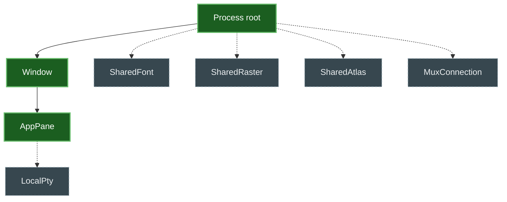
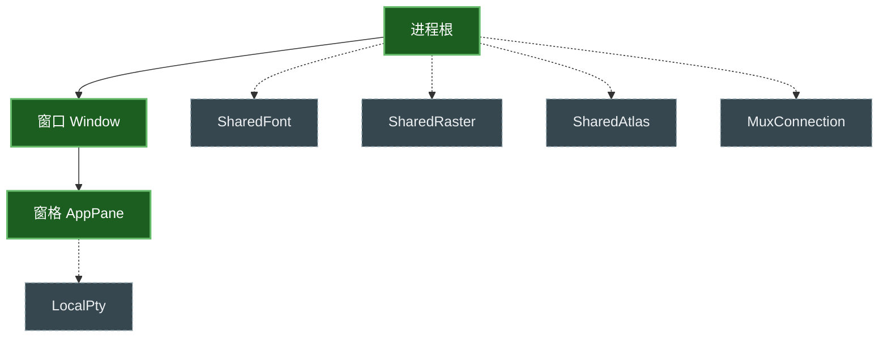

# Memory / 内存

## English

SonicTerm bounds what it holds and reports what it is holding. This page
covers both: what each subsystem keeps and what happens when it fills, then
how to read that from the log when a session grows more than you expect.

### Why bounds alone are not the whole story

Every subsystem here has a limit. That is necessary and not sufficient — a
session with many panes can leave every individual limit intact while the sum
climbs, which is exactly the shape behind reported multi-gigabyte growth. So
some limits are per-pane, some are process-wide, and the ones that matter most
are the process-wide ones.

### What each subsystem holds

| What | Limit | What happens at the limit |
| --- | --- | --- |
| Decoded inline images | 256 MiB across the process; each pane gets a share of that, floored at 4 MiB and capped at 64 MiB | Oldest images are discarded. Each pane always keeps its newest one |
| In-flight image transfers | 64 MiB of staging across the process; 4 MiB guaranteed per transfer | A 14th simultaneous transfer is refused and shows nothing |
| One image payload | 16 MiB | The transfer is refused rather than truncated |
| Grid cells | 1,048,576 cells; scrollback additionally bounded by 24 MiB of retained bytes | Oldest scrollback rows are dropped |
| Escape sequence | 1 MiB | The sequence is discarded through its terminator |
| Hyperlink targets | 16,384 links, 8 KiB per URI | Links whose cells have scrolled away are reclaimed, then the new one is admitted |
| PTY input message | 16 MiB, 4 queued | Oversized input is refused |
| PTY output queue | 64 chunks | The reader waits rather than growing |
| Software render frame | 160 MiB | Larger surfaces are refused |

With one to four panes open, each gets the full 64 MiB image allowance. Beyond
that the share shrinks — twenty panes get about 12.8 MiB each — so opening
many panes that all display images will evict older ones.

### wgpu allocation policy

Detected software adapters request wgpu `MemoryHints::MemoryUsage`; hardware
adapters retain `MemoryHints::Performance`. On Windows this includes DX12 WARP.
With wgpu 30 on D3D12, the policy changes initial allocator blocks from 128 MiB
device / 64 MiB host to 8 MiB device / 4 MiB host. It is a block-sizing and
placement hint, not a resource cap: buffers, textures, and other resources
larger than those initial blocks still allocate.

### Scrollback is bounded twice

`[terminal].scrollback` sets a row count, and retained bytes are bounded
separately at 24 MiB. Rows carrying hyperlinks, combining marks, or non-default
underlines cost more than plain text, so a byte budget can be reached before
the row count is.

At the default 1,000 rows this never happens. If you raise `scrollback`
substantially and your output is link-heavy, expect to retain fewer rows than
the number you set.

### Two things SonicTerm discards that you can see

Most reclamation is invisible and uninteresting. Two cases are neither, so
they are logged at the **default** level — you do not need to have enabled
debug logging beforehand:

```
grep 'memory::reclaimed' ~/.sonicterm/logs/sonicterm.log
```

| Line | What happened | What to do |
| --- | --- | --- |
| `cancelled a media capture that stopped receiving` | An image transfer delivered nothing for a full minute and was abandoned. The image will not appear | Re-send it. Common after a laptop sleeps mid-transfer or an SSH link drops |
| `discarded inline images from idle panes` | Total decoded image memory crossed the process ceiling, so older images were dropped from panes you were not using | Re-send the images you still need, or keep fewer panes holding images |

Both lines carry the byte figures involved.

### Reading what a session is holding

The aggregate answer needs only `info`:

```toml
[logging]
level = "info"
```

**`memory snapshot`** — one line at most every 30 seconds, carrying process,
session, and renderer figures together. This is the record to reach for first,
and the only one that survives a session nobody expected to have to explain:

| Field group | What it covers | What you can do |
| --- | --- | --- |
| `process_*_bytes` | What the OS says the whole process holds | Compare against the session total — a large gap is allocator or driver memory, not retention |
| `session_total_bytes` + seam fields | Everything the panes hold, summed | See the per-seam table below |
| `renderer_total_bytes`, `renderers=` | Glyph and image atlases, software frame, per renderer | Close windows for `visible`; lower the warm-pool size for `warm` |
| Shared wgpu allocator | Allocated and reserved bytes, allocation and block counts, and the largest block, aggregated once per device/context | Compare reserved against allocated; visible and warm renderers sharing a context do not multiply this report |
| `*_delta` | Movement since the previous snapshot | Read the direction, not the magnitude |

The allocator portion has three explicit states: measured figures, backend
reporting unsupported, and no renderer. Unsupported is not zero, and no
renderer is not a failed measurement. It stays on this existing 30-second
aggregate cadence; it is not sampled per frame or on the independent 5-second
resource-history cadence.

Three readings mean "no number" and they are not interchangeable.
`unsupported` means this platform exposes no such figure — on macOS,
private/committed is unsupported, because the meaningful figure there is
`phys_footprint` and SonicTerm cannot reach it without guessing.
`unavailable` on a delta means there was no previous sample to compare
against. `panes_contended=N` means N panes were skipped because they were
busy, so the session total is **partial**.

**`process_virtual_bytes` is not consumption.** It is reserved address space,
routinely in the hundreds of gigabytes for a GPU process, and routinely
harmless. Compare `process_resident_bytes` and `session_total_bytes` when
asking whether a session is actually large.

The remaining detail is diagnostics and needs `debug`:

```toml
[logging]
level = "debug"
```

The detail pass runs at most once every 30 seconds. An idle session arms that
sampling deadline itself, and a sampling-only wake does not request a redraw.

**`pane retention`** — one per pane:

| Field | What it covers | What you can do |
| --- | --- | --- |
| `grid_visible_bytes` | Cells currently on screen | Nothing — it is the screen |
| `grid_history_bytes` | Scrollback | Lower `scrollback` |
| `grid_alternate_bytes` | The screen saved behind a full-screen program | Nothing — it frees itself on exit |
| `parser_bytes` | Escape sequences and image transfers being parsed right now | Nothing — transient |
| `hyperlink_bytes` | OSC 8 link targets | Nothing — reclaimed as links scroll away |
| `inline_media_bytes` | Decoded inline images | Display fewer images, or fewer panes |
| `pty_output_bytes` | Queued PTY output | Nothing — bounded by the queue |
| `pty_input_bytes` | Input queued toward the shell | Nothing unless you paste very large payloads |

`total_bytes` is their sum, and `largest_seam` names the biggest one, which is
where to look first.

**`session retention`** — one for the whole process, summing every pane, with
the same fields plus `panes`. **This is the line that matters for growth**: a
session can hold far more than any single pane suggests, and this is the only
figure that shows it.

### Reading a growth report

Compare `session retention` lines over time, not just the first and last.
Sampling is rate-limited and runs on the idle-wake path, so a gap in the log
means nothing woke the loop — not that memory was flat across it.

Then look at which seam moved. `inline_media_bytes` climbing means images;
`grid_history_bytes` climbing means scrollback; `parser_bytes` staying high
means a transfer is stuck rather than transient.

### How the accounting works

`sonicterm-resource` owns a process-local **resource governor**: the accounting
and attribution layer behind the figures above. It answers "how much is held, by
which owner, in which class". It is not the layer that bounds allocation.

#### Enforcement belongs to the seams

Per-seam caps enforce. The governor accounts, attributes, and backstops. The GUI
process deliberately constructs its governor with an unlimited process byte
ceiling and tracking-only window limits.

That is a design decision, not an omission. Two limits that must agree and are
maintained separately will drift, and the one that stops agreeing keeps
reporting itself as enforced. Each seam — grid cells, retained inline media,
interned hyperlink metadata, parser capture staging, escape sequences in flight,
command events — already bounds itself and is tested at its own boundary.

The one governor limit that does bind is the pane owner's committed budget. It
is **a tripwire, not a second enforcement point**: it is computed as the sum of
the per-seam caps times a headroom multiplier, so it cannot disagree with the
seam caps — it is derived from them — and sits far enough above correct
operation that it never fires there. What it catches is the failure the
per-seam caps structurally cannot: a seam that has stopped bounding while still
reporting itself as bounded.

#### Owner hierarchy

Owners form a tree with one immutable process root. IDs are allocated
monotonically and never reused, and which parent may hold which child is fixed
per process kind and rejected at creation time rather than left to convention.



Solid nodes are what production instantiates today: `Process → Window →
AppPane`. Dashed nodes are permitted by the ledger but never registered — no
code path creates them. They are reserved capacity in the contract, not live
topology.

Each owner is `Open`, then `Closing`, then `Closed`. `Closing` stops admitting
new reservations and new children while still letting live tokens finalize
during teardown. Closing is refused while an owner still has live children or
nonzero charges.

Registration failure is not retried uniformly, and the difference matters:

- A **pane** that fails to register keeps working and is picked up by the next
  reconcile pass, which registers any unowned pane under an already-registered
  window. Reconcile runs whenever a pane is created — new tab or split — and
  again on every retention pass, at every log level.
- A **window** that fails to register is never retried. Reconcile skips a window
  that has no owner, so neither it nor any of its panes appears in hierarchy
  accounting for the rest of that window's life.

In both cases the window or pane keeps working: a diagnostic gap is preferred
over a lost window.

#### Charging runs at every log level

Owner registration, charging, and the retention log lines are three separate
things, and the distinction matters when reading a snapshot:

- **Owners always exist.** A window owner is registered when the window is
  created, a pane owner when the pane is created. This happens at every log
  level, and it is structural rather than conventional: inserting a window and
  registering its owner are one operation.
- **Charging always runs.** The pass that samples what a pane retains and moves
  its charges to match runs on the idle-wake path at every log level.
- **Only emission is gated.** `info` on `target="memory"` admits the aggregate
  snapshot; `debug` additionally admits per-pane and allocation/release detail.
  Neither level controls whether the figures are collected.

So a session running at the default level is still fully accounted. Raise the
level to `info` for the aggregate or `debug` for the diagnostic detail.

---

## 中文

SonicTerm 会限制自身占用的内存，并报告实际占用情况。本页涵盖两部分：各子系
统保留什么内容、达到上限时会发生什么，以及当会话内存超出预期时如何从日志中
读取这些信息。

### 为什么仅有上限还不够

这里的每个子系统都有限制。这是必要的，但并不充分——面板较多的会话可能每个
单项限制都未被突破，而总量却在攀升，这正是此前报告的数 GB 内存增长的形态。
因此部分限制是按面板计的，部分是进程级的，而最关键的是进程级限制。

### 各子系统保留的内容

| 内容 | 上限 | 达到上限时 |
| --- | --- | --- |
| 已解码的内联图像 | 进程共 256 MiB；每个面板分得其中一份，下限 4 MiB，上限 64 MiB | 丢弃最早的图像。每个面板始终保留最新的一张 |
| 传输中的图像 | 进程共 64 MiB 暂存；每个传输保证 4 MiB | 第 14 个并发传输会被拒绝且不显示 |
| 单张图像负载 | 16 MiB | 拒绝传输，而非截断 |
| 网格单元 | 1,048,576 个单元；回滚缓冲另受 24 MiB 保留字节限制 | 丢弃最早的回滚行 |
| 转义序列 | 1 MiB | 丢弃该序列直至其终止符 |
| 超链接目标 | 16,384 个链接，每个 URI 8 KiB | 回收已滚出屏幕的链接，然后接纳新链接 |
| PTY 输入消息 | 16 MiB，队列 4 条 | 拒绝超大输入 |
| PTY 输出队列 | 64 个数据块 | 读取端等待，而非增长 |
| 软件渲染帧 | 160 MiB | 拒绝更大的表面 |

打开 1 至 4 个面板时，每个面板可获得完整的 64 MiB 图像配额。超出之后配额会
缩小——20 个面板时每个约 12.8 MiB——因此打开大量同时显示图像的面板会导致较
早的图像被清除。

### wgpu 分配策略

检测到的软件 adapter 会请求 wgpu `MemoryHints::MemoryUsage`；硬件 adapter 仍使用
`MemoryHints::Performance`。在 Windows 上，这包括 DX12 WARP。在 D3D12 上使用
wgpu 30 时，该策略会把初始分配器块从 device 128 MiB / host 64 MiB 改为
device 8 MiB / host 4 MiB。这只是块大小与放置提示，不是资源上限：大于这些初始块的
buffer、texture 与其它资源仍然可以分配。

### 回滚缓冲受两重限制

`[terminal].scrollback` 设定行数，而保留字节另有 24 MiB 的独立限制。带有超
链接、组合字符或非默认下划线的行比纯文本占用更多，因此可能在达到行数上限前
先触及字节预算。

在默认的 1,000 行下不会发生这种情况。如果你大幅调高 `scrollback` 且输出包含
大量链接，实际保留的行数会少于所设定的数值。

### SonicTerm 会丢弃的两类可见内容

大多数内存回收是不可见且无需关注的。以下两种情况并非如此，因此它们在**默认**
级别下即会记录——你无需事先开启 debug 日志：

```
grep 'memory::reclaimed' ~/.sonicterm/logs/sonicterm.log
```

| 日志行 | 发生了什么 | 可采取的措施 |
| --- | --- | --- |
| `cancelled a media capture that stopped receiving` | 图像传输整整一分钟没有新数据，已被放弃。该图像不会显示 | 重新发送。笔记本在传输中途休眠或 SSH 连接中断后常见 |
| `discarded inline images from idle panes` | 已解码图像的总内存超出进程上限，因此丢弃了未使用面板中较早的图像 | 重新发送仍需要的图像，或减少持有图像的面板数量 |

两种日志行都会附带相关的字节数。

### 查看会话的实际占用

聚合结论只需要 `info` 级别：

```toml
[logging]
level = "info"
```

**`memory snapshot`**——最多每 30 秒一行，同时承载进程、会话与渲染器数据。这是
应当首先查看的记录，也是唯一能在“没人预料到需要解释”的会话中留存下来的记录：

| 字段组 | 含义 | 可采取的措施 |
| --- | --- | --- |
| `process_*_bytes` | 操作系统所报告的整个进程占用 | 与会话总量对比——差距很大说明是分配器或驱动内存，而非保留量 |
| `session_total_bytes` 及各接缝字段 | 所有窗格保留量的总和 | 参见下方按接缝划分的表格 |
| `renderer_total_bytes`、`renderers=` | 每个渲染器的字形图集、图像图集与软件帧 | `visible` 可关闭窗口；`warm` 可调低预热池大小 |
| 共享 wgpu 分配器 | 每个 device/context 的已分配与已保留字节、allocation 与 block 数量、最大 block | 比较 reserved 与 allocated；共享同一 context 的可见和预热渲染器不会重复计数 |
| `*_delta` | 相对上一次快照的变化 | 关注方向，而非绝对值 |

分配器部分明确区分三种状态：已测量的数据、backend 不支持报告，以及没有渲染器。
不支持不等于零，没有渲染器也不等于测量失败。它沿用既有的 30 秒聚合周期；不会
逐帧采样，也不使用独立的 5 秒资源历史周期。

有三种读数表示“没有数值”，且彼此不可互换。`unsupported` 表示该平台不提供此数据
——在 macOS 上 private/committed 即为不支持，因为该平台上有意义的数据是
`phys_footprint`，而 SonicTerm 无法在不猜测的前提下获取它。增量为
`unavailable` 表示没有可供比较的上一次采样。`panes_contended=N` 表示有 N 个窗格
因繁忙而被跳过，因此会话总量是**不完整的**。

**`process_virtual_bytes` 不是实际占用。** 它是已保留的地址空间，对 GPU 进程而言
常达数百 GB，且通常无害。判断会话是否真的很大时，应比较
`process_resident_bytes` 与 `session_total_bytes`。

其余明细属于诊断信息，需要 `debug` 级别：

```toml
[logging]
level = "debug"
```

明细采样最多每 30 秒运行一次。空闲会话会自行安排采样截止时间，而仅用于采样的
唤醒不会请求重绘。

**`pane retention`**——每个面板一行：

| 字段 | 含义 | 可采取的措施 |
| --- | --- | --- |
| `grid_visible_bytes` | 当前显示在屏幕上的单元格 | 无 — 这就是屏幕本身 |
| `grid_history_bytes` | 回滚缓冲 | 调低 `scrollback` |
| `grid_alternate_bytes` | 全屏程序背后保存的主屏幕 | 无 — 程序退出时自动释放 |
| `parser_bytes` | 当前正在解析的转义序列与图像传输 | 无 — 瞬时占用 |
| `hyperlink_bytes` | OSC 8 链接目标 | 无 — 链接滚出后自动回收 |
| `inline_media_bytes` | 已解码的内联图像 | 减少图像使用，或减少面板数量 |
| `pty_output_bytes` | 排队中的 PTY 输出 | 无 — 受队列限制 |
| `pty_input_bytes` | 排队发往 shell 的输入 | 除非粘贴超大内容，否则无需处理 |

`total_bytes` 是它们之和，`largest_seam` 指出占用最大的一项，应优先从该项
着手排查。

**`session retention`**——整个进程一行，汇总所有面板，字段与上表相同并额外
包含 `panes`。**这是排查内存增长时最关键的一行**：会话的实际占用可能远超任
何单个面板所显示的数值，而只有这个数字能揭示这一点。

### 解读内存增长报告

应比较不同时间点的 `session retention` 行，而不只看首尾两行。采样受速率限制
且运行在空闲唤醒路径上，因此日志中的间隔仅表示期间没有唤醒事件，并不代表内存
在此期间保持平稳。

随后查看是哪一项发生了变化。`inline_media_bytes` 上升说明是图像；
`grid_history_bytes` 上升说明是回滚缓冲；`parser_bytes` 持续偏高则说明某个
传输卡住了，而非瞬时占用。

### 记账机制是如何工作的

`sonicterm-resource` 拥有一个进程内的**资源治理器**（resource governor）：
它是上述数字背后的记账与归属层。它回答的是「持有了多少、由哪个所有者持有、
属于哪个类别」，而不是限制分配的那一层。

#### 约束属于各个接缝

真正实施限制的是各接缝自身的上限。治理器负责记账、归属与兜底。GUI 进程刻意
将其治理器构造为进程字节上限无限、窗口限制仅用于跟踪。

这是设计决定，而非疏漏。两个必须保持一致却分别维护的限制终将漂移，而那个已经
不再一致的限制仍会把自己报告为「已生效」。每个接缝——网格单元、保留的内联媒体、
驻留的超链接元数据、解析器捕获暂存、传输中的转义序列、命令事件——都已各自设限，
并在各自的边界处受测试覆盖。

治理器中唯一真正生效的限制是窗格所有者的已提交预算。它是**一根绊线，而不是
第二道强制点**：它由各接缝上限之和乘以余量系数算得，因此不可能与接缝上限相互
矛盾——它本就派生自后者——并且高到在正常运行时永不触发。它捕捉的是各接缝上限
在结构上无法捕捉的故障：某个接缝已经停止设限，却仍把自己报告为受限。

#### 所有者层级

所有者构成一棵树，根节点是唯一且不可变的进程根。ID 单调分配且永不复用，
哪个父节点可以持有哪种子节点，按进程类型固定，并在创建时直接拒绝非法组合，
而不是依赖约定。



实线节点是当前生产环境真正实例化的部分：`进程 → 窗口 → 窗格`。虚线节点虽然被
账本允许，却从未被注册——没有任何代码路径会创建它们。它们是契约中预留的容量，
而不是活跃的拓扑结构。

每个所有者依次处于 `Open`、`Closing`、`Closed` 三种状态。`Closing` 会停止接纳
新的预留与新的子节点，同时仍允许存活的令牌在拆除过程中完成结算。若某个所有者
仍有存活的子节点或非零的记账额，关闭会被拒绝。

注册失败并非一律重试，其中的差异很重要：

- **窗格**注册失败后仍可正常工作，并会被下一次协调（reconcile）扫描接管——
  该扫描会把任何无主窗格挂到已注册的窗口之下。协调在每次创建窗格时运行
  （新标签页或分屏），也在每一次保留量采样时运行，且在所有日志级别下都会执行。
- **窗口**注册失败则永不重试。协调会跳过没有所有者的窗口，因此在该窗口的整个
  生命周期内，它及其所有窗格都不会出现在层级记账中。

两种情况下窗口或窗格都能继续工作：宁可留下诊断盲区，也不要丢失一个窗口。

#### 记账在所有日志级别下都会运行

所有者注册、记账、保留量日志行是三件相互独立的事情，阅读快照时必须区分：

- **所有者始终存在。** 窗口所有者在窗口创建时注册，窗格所有者在窗格创建时注册。
  这在所有日志级别下都会发生，而且是结构性的而非约定性的：插入窗口与注册其
  所有者是同一个操作。
- **记账始终运行。** 采样窗格保留量并相应调整其记账额的那一趟处理，运行在空闲
  唤醒路径上，在所有日志级别下都会执行。
- **只有日志输出受开关控制。** `target="memory"` 上的 `info` 会接纳聚合快照；
  `debug` 还会接纳按窗格与分配/释放明细。两者都不控制这些数字是否被收集。

因此，运行在默认级别下的会话依然被完整记账。把级别调到 `info` 可查看聚合快照，
调到 `debug` 可查看诊断明细。
