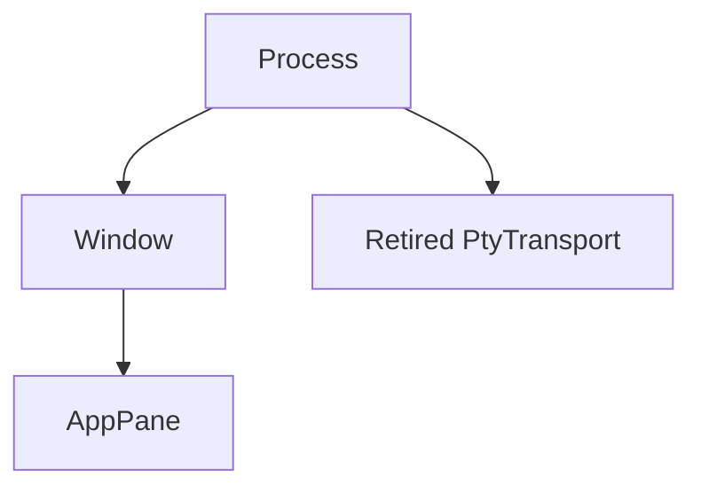

# Memory

[简体中文](Memory-zh-CN)

Use the table below to find a memory limit and what happens when it is reached.
For a growing process, compare consecutive samples using [Logging](Logging).
This page explains what those figures count; protocol and atlas details are in
[Terminal IO and VT](Terminal-IO-and-VT) and [Rendering and Fonts](Rendering-and-Fonts).

### Resource limits

| Owner | Exact bound | Behavior at the bound |
| --- | --- | --- |
| Grid geometry | axis ≤ 4,096; one visible screen ≤ 524,288 cells; visible + history + saved primary ≤ 1,048,576 cells | dimensions and requested history are clamped |
| Grid retained storage | `MAX_GRID_CELLS × size_of::<Cell>()`, about 24 MiB on the current build, shared by visible/history/saved primary | compact row capacity, then drop oldest history in 64-row blocks; scroll-path checks are amortized every 512 rows |
| Cell combining extras | 64 UTF-8 bytes per cell | additional zero-width data is not retained |
| OSC 8 registry | 16,384 links, 8 KiB per URI, 1 KiB per client id, 8 MiB combined metadata | reclaim entries no retained cell references, then admit; otherwise refuse the new link |
| Escape sequence | 1 MiB | discard through its terminator |
| OSC 0/2/7/8 raw collector | 16 KiB whole payload | reject oversized input; report retained capacity, without incrementing media-capture count |
| Media payload | 16 MiB per transfer | refuse rather than truncate or partially render |
| Media capture staging | 64 MiB process-wide; 4 MiB floor; 13 concurrent floor reservations guaranteed | refuse an unstaged capture; cancel after two unchanged 30 s progress samples |
| Decoded inline images | 64 MiB and 128 images per pane; 256 MiB process target divided across live panes; 4 MiB minimum and newest image retained | discard oldest images; a process under pressure may retain at most one 4 MiB newest-image residual per live pane beyond the target until the idle-pane pass converges |
| Encoded image dimensions | declared width/height ≤ 2,048 and pixels ≤ 2,048² | reject before decode |
| Rendered image dimensions | width/height ≤ 1,024; BGRA8 ≤ 4 MiB | resize iTerm2/kitty images; Sixel decodes into the bounded buffer |
| PTY input | one fixed 64-byte pending pointer-motion slot per pane; four queued UI messages, 16 MiB each; reply FIFO uses 64 KiB RAM including framing, ≤32 KiB writer output, ≤32 KiB + 4 B read scratch, ≤32 KiB app reply-batch payload, and <32 KiB parser-dispatch payload (growable vectors may retain spare capacity) | UI refuses with bytes intact; replies spill to private temporary storage without waiting for native input capacity |
| Reply spill disk | no fixed disk quota; consumed prefixes remain until the FIFO file drains | delete on drain, writer exit, or pane teardown; storage errors explicitly fail reply delivery while output/exit observation continues |
| PTY output | 64 queued chunks plus one blocked sender chunk, each backed by a 64 KiB reader ring; structural worst case 4.0625 MiB | block the reader and apply OS backpressure |
| Glyph atlas | one 2048×2048 BGRA8 CPU atlas per renderer, 16 MiB and 16,384 entries | evict the coldest quarter and retry |
| Image atlas | 1×1 placeholder; 2048×2048 BGRA8 only while media is active | skip older images when full; release to placeholder after 240 media-free frames |
| Windows software frame | axis ≤ 16,384; total ≤ 160 MiB | reject construction or resize and preserve the old valid allocation |
| Pane command events | 1,024 events | drop the oldest and shrink retained vector capacity |
| Crash event history | 50 records; 4 KiB owned variable payload per record including a target up to 256 bytes; 64 KiB aggregate variable retention | format within the bound and evict oldest records for both count and bytes |
| Panic text | 4 KiB each for the dump payload and rendered summary | truncate at UTF-8 boundaries, including the marker within the bound |

Media capture staging and decoded inline images each account against one
shared pool: production parsers stage in `CaptureStagingPool::process_default()`,
and production panes charge `InlineMediaPool::process_default()`, which is what
makes those limits process-wide. Tests that need a capture admitted, or that
measure admission or budgets, inject private pools instead of sharing a lock.

Crash-history payloads retain exact-sized owned strings rather than spare
string capacity. Fixed record metadata is separately bounded by record count;
backtraces, the chained panic hook, and allocations inside arbitrary producer
formatters are outside the variable-retention bound. Admission and payload
exclusions are described on [Logging](Logging).

The inline-media figure is deliberately stated as a process **target**, not an
absolute 256 MiB ceiling. Every pane must keep its newest image, and one decoded
image is bounded at 4 MiB. The stateable aggregate bound under pressure is
therefore:

```text
256 MiB + live_panes × 4 MiB
```

While `live_panes × 4 MiB` fits the target, the periodic idle-pane walk returns
the total to 256 MiB or below. The larger formula is the pre-convergence bound,
and remains the bound when the required one-image-per-pane floor itself exceeds
the target.

The grid’s approximate 24 MiB figure is also one shared bound, not “24 MiB of
scrollback plus the visible screen.” `[terminal].scrollback` sets a row limit;
cell count and retained bytes can bind first when rows carry hyperlinks,
combining marks, or non-default underline metadata.

`CSI 3 J` releases active primary history and excess history-container capacity
without lowering either configured history limit. It resets the budget-check
cadence only for that explicit erasure; ordinary FIFO row reuse retains the
512-scroll cadence. History-prefix removal updates exact eviction identity and
prompt coordinates, including prompts stored with the saved primary. Shrinking
columns repairs only a clipped wide lead at each new row edge, preserving
compact runs and existing capacity hysteresis rather than flattening history.

### Ownership model

`sonicterm-resource` tracks each owner's charges by `ResourceClass`, not the
payload memory. Its process-local governor holds the owner tree and ledger;
RAII reservation tokens release their charges when dropped.

Production GUI topology is:



Each retired PTY gets a unique process-root `PtyTransport` owner and one
`ReaperWork` item. The transport retains its native payload, permits, owner and
charge until whole native completion and worker joins, or transfers them together
to `UnresolvedSink`. Retired transport custody does not keep the former window or
pane owner open. `ReaperWork` is charged in production but contributes no pane
seam-cap term because its charge belongs to the retired transport.

One App-owned supervisor admits at most 256 task units, including reservations,
retained tasks and sink entries. Windows uses 20 helper slots and 2,048 native
handle permits; Unix uses 12 helper slots and 768 descriptor permits. One unit
reserves eight handles on Windows or three descriptors on Unix. A started unit
claims a whole helper grant of five slots on Windows or one on Unix; retries and
live workers retain that grant. Counts describe custody, not only running threads.

Admission refusal keeps ownership. A slotless close retries once, then takes an
explicit synchronous fallback; it does not inherit the reserved route's fast
caller return. Sink entries retain capacity until process exit, so `QueueFull`
can persist for the rest of the process. Terminal disposal preserves incomplete
native payloads and their accounting instead of running unsafe destructors.

The type system also defines `SharedFont`, `SharedRaster`, `SharedAtlas`,
`LocalPty`, and mux owner kinds, but the GUI does not register those nodes.

Owner ids are monotonic and never reused. Legal parent/child combinations depend
on `ProcessKind` and are checked at creation. An owner moves from `Open` to
`Closing` to `Closed`; closing stops new children and reservations, and final
close requires zero live children and charges.

A window and its owner are inserted as one operation. Shared topology completion
registers ownerless panes in main and child windows; every 30 s retention pass
also reconciles them. Tab transfer prepares destination pane owners, moves all
existing charges for every moved pane in one atomic `transfer_many` operation,
then swaps guards and closes the empty source owners. Process and per-class
totals stay unchanged, even with contended parsers. A refusal removes provisional
owners and restores the entire source tab, including its original charges and
live PTYs, before any source window can be reaped.

If window registration fails, that window remains usable outside hierarchy
accounting. Only panes without nonzero charges can enter that unregistered
state; an already charged tab cannot silently lose its accounting on transfer.
Failed pane registration can be retried while the window has an owner.

### Enforcement and the pane tripwire

Each seam—an ownership boundary such as the grid, parser, or PTY queue—enforces
its own limit. The GUI governor uses unlimited process and
per-class limits, and window owners are tracking-only. This avoids maintaining a
second set of process limits that can drift from the code doing the allocation.

Each `AppPane` owner does have one committed-byte tripwire. The typed
`pane_seam_cap_terms()` inventory contains every charged pane class exactly
once. Because visible, history, and saved-primary cells share one grid bound,
`GridVisible` carries that cap while `GridHistory` and `GridAlternate` carry
zero. `ParserCapture` carries both parser caps, and PTY input carries its queue
cap once:

```text
PANE_SEAM_CAP_SUM_BYTES = sum(pane_seam_cap_terms().bytes)
PANE_COMMITTED_BUDGET_BYTES = 2 × PANE_SEAM_CAP_SUM_BYTES
```

The factor of 2 leaves room for allocator capacity, amortized overshoot, and the
newest-image residual. It is a backstop for a seam that stopped bounding or
under-reported its retention, not a second normal allocation policy. Each
retention pass settles existing charges through failure-atomic `try_resize`,
including mixed bytes/items changes. Admission checks the final replacement
amount, not an intermediate peak. Any growing axis requires open ancestors;
reductions can settle during close. A refused sample keeps the old charge, so
accounting may lag retained memory until another successful sample. Snapshots
are observational, not a globally linearizable total.

### What is counted

One pane report contains eight disjoint seams:

| Field | Owned memory |
| --- | --- |
| `grid_visible_bytes` | visible rows, prompt storage, and rare cell attributes |
| `grid_history_bytes` | retained scrollback rows |
| `grid_alternate_bytes` | saved primary screen while the alternate screen is active |
| `parser_bytes` | in-flight escape and media-capture buffers |
| `hyperlink_bytes` | interned OSC 8 ids and URIs |
| `inline_media_bytes` | decoded image pixels retained by the pane |
| `pty_output_bytes` | ring memory pinned by queued PTY output |
| `pty_input_bytes` | queued input vectors |

`total_bytes` is their sum. `largest_seam` names the largest part. A
`session retention` line sums the same fields across sampled panes.

Renderer memory is separate because it is window-owned rather than pane-owned:

- `glyph_atlas_bytes`: CPU glyph atlas capacity;
- `image_atlas_bytes`: CPU inline-image atlas capacity;
- `row_glyph_cache_bytes` / `row_glyph_cache_items`: hash-table backing, cached
  glyph instances, underline runs, tofu geometry, missing characters, and row count;
- `row_quad_cache_bytes` / `row_quad_cache_items`: hash-table backing, cached
  background/decoration quad vectors, and row count;
- `software_frame_bytes`: Windows CPU/GDI frame, zero elsewhere.

These are host-memory copies. GPU textures and buffers are not included because
the driver owns them and wgpu does not expose their sizes. Row-cache reports use
allocated table and nested-vector capacity, not live length. Table capacity is
sticky across ordinary clear/retain operations; when a pane leaves a renderer,
SonicTerm removes that pane's glyph rows and then quad rows in one event-loop
operation, preserves peer entries, and requests table compaction. Nested payload
and item counts fall immediately, while the table allocator may retain its
current bucket class. Every visible and warm renderer is listed.
`live_renderers` comes from an independent process-wide counter; a count larger
than the listed renderer set indicates a live renderer that is no longer
reachable from window topology.

These fields are not a whole-renderer heap census. Frame-key metadata,
transient frame plans and draw vectors, and other unlisted host allocations
are outside `renderer_total_bytes`; the OS process reading includes memory
beyond the charged classes.

While search is open, `SearchState` keeps the prepared matcher, including its
compiled regex in regex mode; the matcher is released when search closes or when
the query, mode, or case setting changes, and the resource governor does not
charge that memory.

### Aggregate snapshot

Set the log level to `info` for one `memory snapshot` at most every 30 s:

```toml
[logging]
level = "info"
```

This is a sequential diagnostic sample, not a linearizable point-in-time
snapshot. Each pane's parser, inline media, and PTY queues are read separately;
panes, renderers, the shared allocator, and OS memory are then sampled in turn.
Even `panes_contended=0` does not make those readings simultaneous or turn
sampled charges into allocation-time admission limits.

The line combines:

- `process_private_committed_bytes`, `process_resident_bytes`, and
  `process_virtual_bytes` from the OS, with deltas;
- the session total and all eight pane seams;
- `panes_total`, `panes_sampled`, and `panes_contended`;
- renderer totals, roles, and `live_renderers`;
- one shared-device allocator reading.

`process_virtual_bytes` is reserved address space, not consumption. GPU
processes can reserve hundreds of gigabytes without holding that much resident
memory. Compare resident/private figures with `session_total_bytes` and
`renderer_total_bytes`.

Absence states are explicit:

| Value | Meaning |
| --- | --- |
| `unsupported` | the platform or backend does not expose this figure |
| `unavailable` | no previous comparable sample exists |
| `panes_contended=N` | N panes were skipped because a parser or inline-image lock was busy; the session total is partial |
| `allocator_state=none` | no renderer exists, so no allocator was queried |

On macOS, private/committed is `unsupported`; SonicTerm reports resident and
virtual memory but does not substitute an invented value for `phys_footprint`.
On Windows, private/committed is `PrivateUsage` and resident is
`WorkingSetSize`. Linux and other platforms without a process-memory sampler
report all three OS figures as `unsupported`; pane, renderer, and allocator
accounting still runs.

The allocator is sampled once per shared device/context, from the main renderer
or a deterministic visible/warm fallback. A measured report includes:

```text
allocator_allocated_bytes
allocator_reserved_bytes
allocator_allocations
allocator_blocks
allocator_largest_block_bytes
```

Software adapters use wgpu 30 `MemoryHints::MemoryUsage`; hardware adapters use
`MemoryHints::Performance`. On D3D12, the software policy changes initial
allocator blocks from 128 MiB device / 64 MiB host to 8 MiB device / 4 MiB host.
Those are placement and block-sizing hints, not allocation caps; larger
resources still allocate.

### Detailed retention and reclamation

Set `debug` for per-pane and per-renderer lines:

```toml
[logging]
level = "debug"
```

The 30 s pass uses `try_lock`; it never waits for a pane parser or inline-image
lock. Registration, reconciliation, charging, stalled-capture cancellation, and idle-media
reclamation run at every log level. Only emission is gated. A sampling-only
wake does not request a redraw.

Two reclamations remove user-visible content and therefore log on the
`memory::reclaimed` target even at the default `warn` level:

```sh
grep 'memory::reclaimed' ~/.sonicterm/logs/sonicterm.log*
```

| Message | Meaning |
| --- | --- |
| `cancelled a media capture that stopped receiving` | no bytes arrived for two 30 s intervals; staging was released and the image will not appear |
| `discarded inline images from idle panes` | older images were removed from panes that held a share sized for fewer live panes |

A large single snapshot is not evidence of growth. Compare several consecutive
samples. Rising `grid_history_bytes` points to scrollback; rising
`inline_media_bytes` points to images; `parser_bytes` that remains high across
samples points to an in-flight transfer. A nonzero `panes_contended` means the
aggregate understates the session.

### Code locations

| Topic | Primary paths |
| --- | --- |
| Governor, ledger, reservations | `crates/sonicterm-resource/src/{ledger,owner,reservation}.rs` |
| Resource contracts and owner kinds | `crates/sonicterm-types/src/resource.rs` |
| Pane limits and owner registration | `crates/sonicterm-app/src/app/mod.rs` |
| Pane measurement, charging, reclamation | `crates/sonicterm-app/src/app/retention.rs` |
| Aggregate snapshot | `crates/sonicterm-app/src/app/memory_snapshot.rs` |
| Inline-media limits | `crates/sonicterm-app/src/app/media.rs` |
| Grid and hyperlink limits | `crates/sonicterm-grid/src/{grid,hyperlink}.rs` |
| Parser capture limits | `crates/sonicterm-vt/src/vt.rs`, `crates/sonicterm-vt/src/vt/staging.rs` |
| PTY queue limits | `crates/sonicterm-io/src/pty.rs` |
| Renderer retention and allocator report | `crates/sonicterm-gpu/src/core.rs` |
