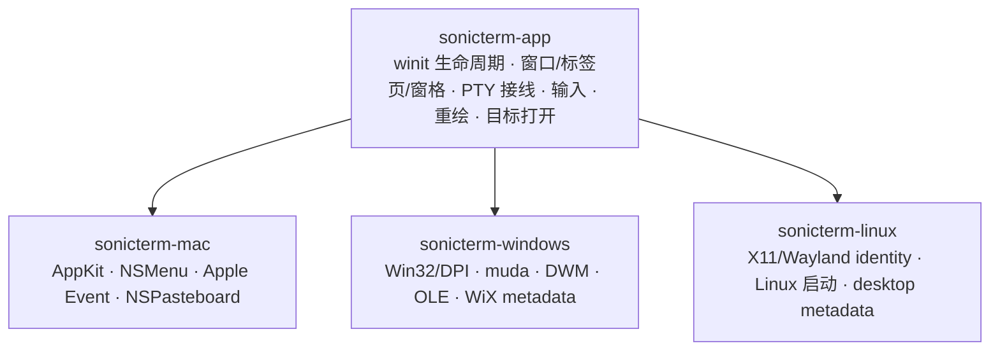

# 平台集成

[English](Platform-Integration)

本页说明 macOS、Windows 与 Linux 的差异，平台矩阵可供快速对照。构建包见
[打包](Packaging-zh-CN)，验证与发布步骤见[开发与发布](Development-and-Release-zh-CN)。

## 共享职责与原生职责

不需要 AppKit、Win32、X11 或 Wayland handle 的行为应放在 `sonicterm-app` 或更低层。
平台 crate 只负责必须使用原生主线程对象、平台 ABI、桌面 identity 或安装器 metadata 的工作。
终端解析位于 `sonicterm-vt`；本地 PTY/ConPTY 封装在
`sonicterm-io::PtyHandle` 后；渲染位于 `sonicterm-gpu`。

三个二进制共用诊断、配置、日志、资源、状态机和 shell 启动流程；准确顺序见
[运行时生命周期](Runtime-Lifecycle-zh-CN)。用户状态位于 `~/.sonicterm`；打包资源由
`sonicterm-cfg::assets` 查找。

终端输入法几何属于共享 app：每个窗口发送活动窗格的物理光标矩形，只加一次窗格原点和
内容内边距。去重键包含窗格身份、物理位置和物理尺寸，不仅是行列。命令面板和搜索框保留
各自的输入锚点。

## 原生目标打开

路径扫描和可操作性探测属于跨平台 app。有限队列 worker 会在原生调用前再次核对完全相同的
目标类型和操作，并阻止符号链接、reparse point 和特殊文件身份。
普通文件无论扩展名、执行权限或内容如何，都只被选中。
带标点的字面候选只要存在就具有最高优先级；只有字面候选不存在时，才会选择去掉正文标点的
较短候选。

| 平台 | 调用边界 |
| --- | --- |
| macOS | 目录使用固定 `/usr/bin/open --`；文件使用 `/usr/bin/open -R --` 选中而不打开 |
| Windows | 目录使用 `ShellExecuteExW`；文件使用 `SHOpenFolderAndSelectItems`，均在专用 COM apartment 中执行 |
| Linux | 目录使用 desktop portal，仅不可用时回退到固定 `xdg-open`；文件使用 `org.freedesktop.FileManager1.ShowItems`，不回退到打开文件 |

选中文件不会调用其关联应用或执行内容。macOS 应用或软件包目录使用 Finder 选择，而不启动。
Portal 明确拒绝不等于 portal 不可用，因此不会触发 fallback。

Windows 上，目录导航和非文件 URI 走同一条调用边界：由拥有独立 COM apartment
的 worker 线程直接调用 `ShellExecuteExW`，不经过任何命令解释器，也不会对参数字符串重新
分词。URI 以单个 NUL 结尾的 UTF-16 字符串传入，并且环境变量替换保持关闭，因此 `%20`、`%USERNAME%`
这类以百分号分隔的文本会按验证后的原样交给 handler，不会按进程环境展开。

## macOS

### AppKit 生命周期与菜单

共享的 macOS `App::do_resumed` 路径通过 winit 的
`set_allows_automatic_window_tabbing(false)` 在菜单 hook 和原生窗口创建前关闭进程级
自动标签页。二进制保留普通启动和 smoke 的 window-ready callback，将初始 NSWindow 的
`setTabbingMode: 2` 设为禁用。进程级设置与每窗口模式是两层控制；终端标签页仍由 SonicTerm 管理。

原生 smoke 在创建窗口前读回进程级属性。这证明设置已到达 AppKit，不证明每个窗口原生
标签栏的显示效果。

NSMenu 只能在 winit 创建 AppKit 事件循环后安装。Objective-C target 接收菜单 selector，
把菜单 tag 转换为共享 `Action`，再通过 event-loop proxy 唤醒循环。需要 NSWindow 的工作
在一次性 window-ready callback 中执行，此时 handle 已有效。

### Shell 脚本打开事件

App bundle 以 `LSHandlerRank=Alternate` 声明 `public.shell-script` 和
`com.apple.terminal.shell-script`。进程级 observer 接收
`NSApplicationWillFinishLaunchingNotification` 后安装 `kAEOpenDocuments` Apple Event
handler。回调只把路径放入共享 open-script 队列；窗口与 PTY 仍由事件循环线程创建。
冷启动打开多个文件时会保持顺序且不额外创建空白标签页，之后的事件则追加标签页。
相对路径以进程启动时的工作目录为准。这是 Finder 的**打开方式**集成，不是全局默认终端选择器。

### 标签页交接

macOS 的操作系统交接后端把序列化 `TabPayload` 写入 general NSPasteboard，类型为
`com.sonic-terminal.tab.v1`。`sonicterm-mac` 仅在进程启动时、`MacShell::run` 之前检查
一次该 payload；若内容有效，就从 pasteboard 删除并作为 pending input 交给 shell。
已经运行的 peer 再次变为 active 时不会重新检查。因此接收端仅支持启动时读取，而且该
后端不会创建 `NSDraggingSession`，也没有原生光标预览。写入 pasteboard 返回
`NotAcknowledged`，所以源标签页继续保留，app 会走常规的进程内 tear-out 路径。同进程
移动使用共享的进程内标签页转移路径。

### App 资源

Bundle 从 `Contents/Resources/assets` 读取运行时资源。四个 `Rec Mono St.Helens`
字体仅保存在 `assets/fonts`，通过 `ATSApplicationFontsPath=assets/fonts` 让
AppKit/CoreText 解析同一份文件。安装包在 `Contents/Frameworks` 中包含 Cairo 的非系统
动态库依赖，使用 bundle 内相对加载路径，并附带许可证和来源清单。最低 macOS 版本反映
可执行文件/库的实际部署目标，而不只是打包主机架构。验证方式见[打包](Packaging-zh-CN)。

## Windows

### 进程与 HWND 生命周期

winit 创建 HWND 前，`sonicterm-windows` 会请求
`DPI_AWARENESS_CONTEXT_PER_MONITOR_AWARE_V2`。这个进程级设置早于事件循环构造，因此保留，
不假设 winit 较晚的设置在所有启动路径上都等价。Release 构建使用 Windows GUI subsystem，
不会打开控制台窗口。一次性 window-ready callback 收到有效 HWND 后应用 DWM backdrop
并安装原生 `muda` 菜单。窗口移动、snap layout 和最小化/最大化/关闭控件仍由 Windows
原生 chrome 管理。

菜单把 `muda` 事件转换为共享 action。DWM 可请求 Mica、Acrylic 或 Tabbed material，
并可回退为 opaque。强制软件渲染使用不透明窗口，因为 GDI presenter 无法合成透明效果。

### CLI 与脚本文件注册

安装后的 executable 接受一个无损的 `--open-script <PATH>` 参数。启动逻辑会相对进程
最初工作目录解析相对参数，并在 `WindowsShell::run` 前入队，因此冷启动直接打开脚本标签页，
不会先创建 HOME 标签页。私有 tear-out payload 不能与 `--open-script` 同时使用。

`--refresh-shell-associations` 不创建窗口，只广播 `SHCNE_ASSOCCHANGED`。MSI 为 `.ps1`、
`.cmd`、`.bat` 和 `.sh` 注册 SonicTerm ProgID、Default Apps capabilities 和
`OpenWithProgids`，不会写扩展名默认值或 `UserChoice`。这是文件处理程序集成，不是 Windows
全局**默认终端应用**协议。

### OLE 标签页拖放

Windows 后端在 UI 线程初始化 OLE，并实现 COM `IDataObject`、`IDropSource` 和
`IDropTarget`。它注册私有 `com.sonic-terminal.tab.v1` clipboard format
（`CF_SONIC_TAB`），使用 `DoDragDrop` 和 `RegisterDragDrop`。UTF-8 标签页 JSON 在清零的
可移动全局内存中拥有自己的 NUL 结束符；`GlobalSize` 表示分配容量而非 payload 长度，
因此分配器填充字节不会改变同进程 payload 匹配。

已安装的后端明确声明是否拥有原生 drop target。共享窗口设置在主窗口、新窗口、拆出窗口及
隐藏预热 HWND 创建前，仅为自定义所有者关闭 winit 默认 target。没有自定义后端时，保留
winit 默认文件拖放。隐藏预热窗口直到启用时才注册自定义 target。注册失败会在启动 shell 或
转移窗格前放弃隐藏目标；拆出失败会恢复源窗口。成功注册后保留窗口直到撤销注册；后端退出时
先释放剩余 target，再销毁 OLE guard。

文件拖放通过共享队列携带注册目标的 `WindowId`；稍后的焦点变化不会重定向它，已关闭目标
会丢弃其拖放。重叠标签栏只在实际接收的原生窗口内命中。同进程标签页移动还要求活动手势及
完全匹配的 payload；稳定的源 `WindowId`/`TabId` 仍是权威。来自其它进程或格式错误的标签页
payload 会被拒绝，不确认移动：目前不支持跨进程转移存活 PTY。OLE 返回 `MOVE` 却没有
已解析的本地结果时，会取消而不是虚构目标。

默认 Windows runtime smoke 安装生产 OLE 后端，要求主窗口、预热启用子窗口及新建子窗口共三对
成功注册/撤销，且没有残留注册或失败。原生单元测试使用真实隐藏 HWND 和 COM 数据对象，
覆盖所有权、Unicode 文件路径、精确目标、重复注册拒绝及清理。直接 COM 调用证明解码与路由，
不证明物理拖放手势的交付。

### 系统字体回退

DirectWrite/GDI 桥向 analysis source 传入完整 UTF-16。映射位置、剩余文本及 locale 长度
都按 UTF-16 代码单元计算，不按 Rust 字符数量计算。返回零长度、越界或拆分代理项对的映射
范围时，整个原生回退请求失败，包含此前已积累的候选。调用方报告失败并继续其余已配置的
字体查找源。成功请求返回按顺序去重的候选字体列表，不是逐字符分配；已加载字体和 BMP
行为保留原有路径。

### PTY 与软件呈现

Windows 二进制只负责 GUI 胶水，不负责终端解析或 ConPTY。本地进程 hosting 仍封装在
`sonicterm-io::PtyHandle` 后。

Windows 上启用软件渲染降级时，`sonicterm-gpu` 在
`crates/sonicterm-gpu/src/software_frame.rs` 中合成 CPU BGRA 帧。仅在 Windows 编译的
`software_windows.rs` 桥接层通过 GDI 呈现完整帧；这条路径不把保留式 GPU 损伤区域
作为第二套呈现策略。`crates/sonicterm-windows/src/software_presenter.rs` 负责配置决策，
不负责帧合成或原生 blit。

## Linux

### X11 与 Wayland identity

发布 crate 是 `sonicterm-linux`，可执行文件名为 `sonicterm`。winit 使用 X11 或 Wayland。
Desktop entry、AppStream component、hicolor icon、Wayland application id 和 X11 class
统一为 `com.d0n9x1n.SonicTerm`；X11 instance name 为 `sonicterm`。统一 identity 可让
launcher activation、任务分组和 compositor identity 对齐。

Linux 没有 SonicTerm 原生菜单、桌面通知 bridge、前台进程标题 adapter、原生 material
backdrop 或跨进程标签页拖放。Linux shell 会在共享 app runner 上安装纯平台收敛器。
启动和每次显式重载都会在配置被存储或应用前经过同一个接缝：Mica、Acrylic 与 Tabbed
会变为 opaque 并记录一次 warning；已经为 opaque 的输入保持不变且不写 warning。
预热、新建和拆出窗口因此都会使用同一已收敛值。macOS 与 Windows 安装 identity 行为，
保留各自支持的 backdrop 策略。共享窗格、标签页、窗口和进程内标签页移动仍可使用。

### Shell、字体与资源

自动 shell 选择按顺序采用第一个可执行候选：`$SHELL`、`getpwuid_r` 返回的当前用户
passwd shell、最后 `/bin/sh`。显式 shell 配置优先。

便携包使用 executable 相邻的 `assets/`；Debian 安装使用
`/usr/share/sonicterm/assets`。启动时会检查四个内置 Rec Mono 字体，把字体目录在原生
Fontconfig discovery 前传给 `FontStack`，并在字体重载时继续保留。原生 fallback 仍可用。

### 运行时 smoke 边界

三个发行二进制都接受隐藏的 `--runtime-smoke` 模式。平台提供真实 shell 命令（macOS/Linux
使用 `/bin/sh`，Windows 使用 `cmd.exe`）；共享 runner 要求原生窗口、渲染器/设备、在实时
grid 中观察到非字面 PTY marker，并在之后完成一次原生呈现。随后它使用生产默认预热池创建并
报告一个隐藏渲染器，通过标签页拆出采用完全相同的窗口，呈现子窗口，再关闭它、清除可能补充的
备用项，并要求 `live_renderer_count` 回到创建窗口前的基线。预热生命周期失败使用稳定退出码
`16`。

Windows 默认运行仍要求三次 OLE 注册及对应撤销；提前执行的 frame-validation 运行要求恰好
一对主窗口注册/撤销，且 App 清理后没有原生失败或仍然存活的注册。两种场景都让 OLE guard
存活至后端释放完成。

smoke 会拆出一个临时的第二标签页，让原主窗口的 shell 及其 marker 历史在预热子窗口销毁后保留。
故障阶段统计实时 grid 与 scrollback 中包含 marker 的行；重复读取旧 marker 不能证明存活。
它们比较所有窗口的实际呈现调用与已确认帧总数，并要求实际尝试过渲染，且至少 250 毫秒没有呈现。
每个故障最多等待 5 秒；销毁钩子另有 5 秒轮询上限。应用的 watchdog 在 30 秒后请求退出；runner
强制执行 45 秒的外层硬期限。15 秒的差额留给已排队的 watchdog 事件、有界销毁轮询及清理。
这些是配置的期限，不是已测量的耗时。

预热生命周期之后，默认运行会检查每个打开的窗口是否与主窗口共享同一设备代次，然后驱动渲染器
隐藏文档的 GPU 故障钩子。隔离故障之后，主窗口必须再完成一次原生呈现。通过
`force_rebuild_for_scale` 注入的保留资源故障，必须使设备被记录为 `Unusable`、没有窗口呈现，
并在实时 grid 中观察到一个重新执行的 PTY marker。代次检查与这两个阶段失败时退出码为 `17`。
随后的设备销毁必须产生丢失记录和另一个重新执行的 marker，否则退出码为 `18`。

另一个独立进程用 `scripts/native-smoke-runner.py --scenario frame-validation` 启动，从可用
设备开始，在第一次主窗口呈现之后启用持续的帧验证故障。启用只创建有效的 probe：此时不发送
marker，也不开始静默观察区间。只有观察到一次实际故障渲染使设备变为 `Unusable` 后，smoke
才重新记录 marker 行数基线、再次发送 shell 命令，并开始新的 250 毫秒无呈现观察区间。
确认停止前输出的 marker 不能满足证明；等待故障渲染的时间也不能抵扣静默观察时间。独立的
5 秒期限始终从启用故障时起算，确认停止不会延长它。两个呈现计数仍与最初故障前的基线比较。
停止后缺少新 marker 或故障隔离检查失败时退出码为 `17`。runner 会为该次运行设置
`SONICTERM_RUNTIME_SMOKE_SCENARIO=frame-validation`，普通运行则移除继承的该值。应用收到未知的
环境变量值时，会在事件循环启动前以退出码 `10` 失败；runner 收到未知的 `--scenario` 参数时，
作为调用错误返回退出码 `2`，不启动子进程。

自动化会传入彼此分开的临时 `config/` 与 `logs/` 根目录，且不会替换 `HOME`。
`scripts/native-smoke-runner.py` 会移除继承的 `NO_COLOR`、保存 stdout/stderr 与日志工件、
执行 45 秒外层期限，在 POSIX 上终止子进程所属的进程组；离开此组的后代不在该期限的约束内。
PR 和 release gate 用分别计时的步骤，在已构建的 macOS、Windows 二进制以及 X11 与 Wayland
上的两种 Linux 包布局中运行两个场景。[打包](Packaging-zh-CN)说明 Linux 的场景参数和隔离
证据路径。其它阶段成功但原生 PTY 清理未完成时退出码为 `20`；更早的故障或设备丢失保留原退出码。

## 平台矩阵

| 能力 | macOS | Windows | Linux |
| --- | --- | --- | --- |
| 窗口后端 | winit + AppKit hook | winit + Win32 hook | winit + X11 或 Wayland |
| 本地 PTY | portable-pty Unix PTY | portable-pty ConPTY | portable-pty Unix PTY |
| 默认字形光栅器 | FreeType | DirectWrite，FreeType fallback | FreeType |
| 字体发现 | CoreText | DirectWrite/GDI | 打包字体目录 + Fontconfig |
| 标签页操作系统交接 | NSPasteboard 发布，无 `NSDraggingSession` | OLE/COM 拖放 | 仅进程内 |
| 原生菜单 | NSMenu | `muda` | 不可用；保留应用内操作 |
| Backdrop | AppKit blur/config | DWM Mica/Acrylic/Tabbed | opaque |
| 软件呈现 | wgpu adapter 路径 | CPU BGRA + GDI | wgpu Vulkan/lavapipe 或选中的平台 adapter |
| 安装包格式 | 各架构 `.dmg` 中的 `.app` | x64 WiX `.msi` | x86_64 `.deb` 与 `.tar.gz` |
| 签名 | ad-hoc bundle 签名 | 未签名 | 未签名 |

## 源码索引

| 边界 | 主要路径 |
| --- | --- |
| 共享平台 shell | `crates/sonicterm-app/src/shell.rs` |
| 安全原生目标打开 | `crates/sonicterm-app/src/app/path_target.rs` |
| macOS 入口/菜单/打开文档/标签页交接 | `crates/sonicterm-mac/src/{main,menubar,open_documents,os_drag_mac,tab_drag_os}.rs` |
| Windows 入口/CLI/菜单/backdrop/标签页拖放 | `crates/sonicterm-windows/src/{main,cli,startup,menubar,backdrop,os_drag_win,tab_drag_os}.rs` |
| Windows 软件呈现 | `crates/sonicterm-gpu/src/{software_frame,software_windows}.rs`、`crates/sonicterm-windows/src/software_presenter.rs` |
| Linux 入口与 identity | `crates/sonicterm-linux/src/main.rs`、`crates/sonicterm-linux/resources/` |
| 资源查找 | `crates/sonicterm-cfg/src/assets.rs` |
