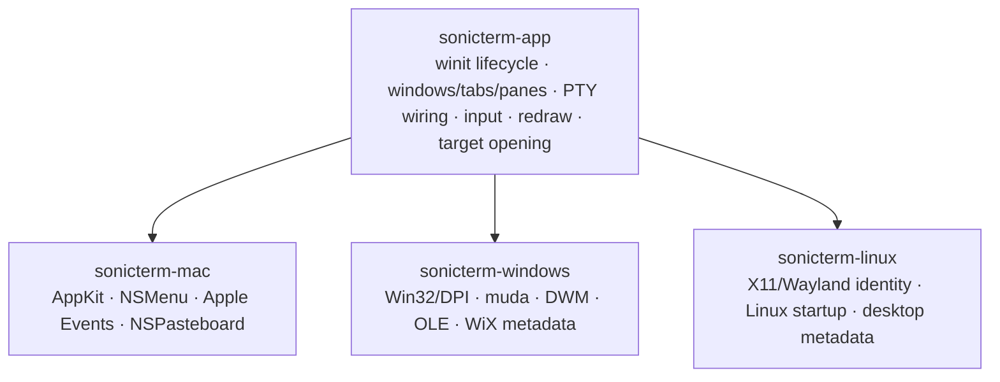
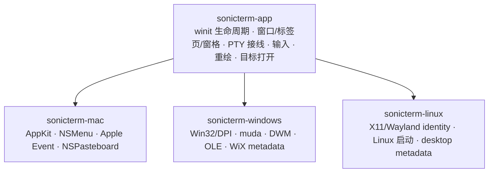

# Platform Integration / 平台集成

## English

This page owns SonicTerm's native platform boundaries. Package commands and file
layouts belong on [Packaging](Packaging); CI and release behavior belong on
[Development and Release](Development-and-Release).

## Shared and native ownership

A behavior stays in `sonicterm-app` or a lower crate when it needs no AppKit,
Win32, X11, or Wayland handle. Platform crates own work that requires a native
main-thread object, platform ABI, desktop identity, or installer metadata.
Terminal parsing is in `sonicterm-vt`; local PTY/ConPTY transport is behind
`sonicterm-io::PtyHandle`; rendering is in `sonicterm-gpu`.

All three binaries install panic and exit evidence before config loading, arm a
session marker and breadcrumb writer, load config, initialize logging from
`[logging]`, report prior sessions, load theme and keymap assets, create an
`AppStateMachine`, build the platform shell, and run the shared winit app. User
state is under `~/.sonicterm`; packaged assets are resolved by
`sonicterm-cfg::assets`.

## Native target opening

Path scanning and openability probing are cross-platform app behavior. The
bounded worker revalidates the target kind immediately before native dispatch
and blocks executable/launcher, symlink or reparse-point, and special-file
classes.

| Platform | Dispatch boundary |
| --- | --- |
| macOS | fixed `/usr/bin/open` command after macOS target revalidation |
| Windows | `ShellExecuteExW` with `SEE_MASK_NOASYNC` from a dedicated COM apartment |
| Linux | XDG Desktop Portal `OpenFileRequest` with an already opened `O_NOFOLLOW` file; fixed `/usr/bin/xdg-open` or `/bin/xdg-open` only when the portal is unavailable |

A portal rejection is not treated as unavailability and does not fall back.

## macOS

### AppKit lifecycle and menu

`sonicterm-mac` uses `objc2` on the main thread. It disables automatic AppKit
window tabbing process-wide before any window is created and sets each NSWindow
tabbing mode to disallowed, so SonicTerm's own tab model remains authoritative.

The NSMenu is installed only after winit has created the AppKit event loop. An
Objective-C target receives menu selectors, translates menu tags to shared
`Action` values, and wakes the event loop through its proxy. Per-window AppKit
work runs from the one-shot window-ready callback after a valid NSWindow exists.

### Shell-script open events

The app bundle advertises `public.shell-script` and
`com.apple.terminal.shell-script` at `LSHandlerRank=Alternate`. A process-lifetime
observer receives `NSApplicationWillFinishLaunchingNotification` and then
installs the `kAEOpenDocuments` Apple Event handler. Paths are copied into the
shared open-script queue; window and PTY creation remains on the event-loop
thread. Cold multi-file opens preserve order and avoid an unrelated blank tab;
later events append tabs. Relative paths use the process's initial working
directory. This is Finder **Open With** integration, not a global default-terminal
selector.

### Tab handoff

The macOS OS-handoff backend writes a serialized `TabPayload` to the general
NSPasteboard under `com.sonic-terminal.tab.v1`. Another SonicTerm process may
consume a valid payload on activation. The backend does not create an
`NSDraggingSession`, so it provides no native cursor preview. Publishing to the
pasteboard is not receiver acknowledgement; the source tab remains alive unless
a transfer path explicitly commits adoption. Same-process movement uses the
shared in-process tab-transfer path.

### App resources

The bundle reads runtime assets from `Contents/Resources/assets`. The four
`Rec Mono St.Helens` TTF files are also copied to `Contents/Resources/Fonts`, and
`ATSApplicationFontsPath=Fonts` lets AppKit/CoreText resolve them.

## Windows

### Process and HWND lifecycle

Before winit creates an HWND, `sonicterm-windows` requests
`DPI_AWARENESS_CONTEXT_PER_MONITOR_AWARE_V2`. Release builds use the Windows GUI
subsystem and open no console window. The one-shot window-ready callback receives
a live HWND and applies the DWM backdrop and native `muda` menu. Window movement,
snap layouts, and minimize/maximize/close controls remain native Windows chrome.

The menu translates `muda` events to shared actions. DWM can request Mica,
Acrylic, or Tabbed material and falls back to opaque. Forced software rendering
uses an opaque window because the GDI presenter cannot composite transparency.

### CLI and shell-file registration

The installed executable accepts one lossless `--open-script <PATH>` argument.
The startup path resolves a relative argument against the process's initial
working directory and queues it before `WindowsShell::run`, so cold startup
opens the script tab instead of a HOME tab. The private tear-out payload cannot
be combined with `--open-script`.

`--refresh-shell-associations` runs without a window and broadcasts
`SHCNE_ASSOCCHANGED`. The MSI registers SonicTerm ProgIDs, Default Apps
capabilities, and `OpenWithProgids` for `.ps1`, `.cmd`, `.bat`, and `.sh`. It does
not write an extension default or `UserChoice`. This is file-handler integration,
not Windows' global **Default terminal application** protocol.

### OLE tab drag/drop

The Windows backend initializes OLE on the UI thread and implements COM
`IDataObject`, `IDropSource`, and `IDropTarget`. It registers the private
`com.sonic-terminal.tab.v1` clipboard format (`CF_SONIC_TAB`) and uses
`DoDragDrop` and `RegisterDragDrop`. Every destination HWND is registered through
the shared tab-drag backend, including torn-out child windows. OLE lifetime and
drag operations stay on the window thread.

### PTY and software presentation

The Windows binary owns GUI glue, not terminal parsing or ConPTY. Local process
hosting remains behind `sonicterm-io::PtyHandle`.

When a software adapter is selected, `sonicterm-gpu` composes a CPU BGRA frame.
The Windows path presents it through GDI and retains dirty-rectangle state. The
active frame implementation is `crates/sonicterm-gpu/src/software_windows.rs`;
Win32 presentation support is in
`crates/sonicterm-windows/src/software_presenter.rs`.

## Linux

### X11 and Wayland identity

The shipping crate is `sonicterm-linux`; its executable is `sonicterm`. winit
uses X11 or Wayland. Desktop entry, AppStream component, hicolor icon, Wayland
application id, and X11 class all use `com.d0n9x1n.SonicTerm`; the X11 instance
name is `sonicterm`. Keeping one identity aligns launcher activation, task
grouping, and compositor identity.

Linux has no SonicTerm native menu, desktop-notification bridge,
foreground-process title adapter, native material backdrop, or cross-process tab
drag. The binary clamps any configured backdrop to opaque with a warning and
uses in-app behavior for the supported actions. Shared panes, tabs, windows, and
in-process tab movement remain available.

### Shell, fonts, and assets

Automatic shell selection chooses the first executable candidate in this order:
`$SHELL`, the current user's passwd shell from `getpwuid_r`, then `/bin/sh`.
Explicit shell configuration wins.

A portable package resolves the executable-adjacent `assets/`; a Debian install
resolves `/usr/share/sonicterm/assets`. Startup verifies all four bundled Rec
Mono faces, passes their directory to `FontStack` before native Fontconfig
discovery, and retains that directory across font reloads. Native fallback
remains available.

### Runtime smoke boundary

`sonicterm --runtime-smoke` uses isolated state and runs the shared app with a
30-second proof deadline. Success requires a native window and GPU surface,
`/bin/sh` in a PTY, a non-literal marker reaching the grid, and a later native
frame presentation. [Packaging](Packaging) describes how both Linux package
layouts invoke this boundary on X11 and Wayland.

## Platform matrix

| Capability | macOS | Windows | Linux |
| --- | --- | --- | --- |
| Window backend | winit + AppKit hooks | winit + Win32 hooks | winit + X11 or Wayland |
| Local PTY | portable-pty Unix PTY | portable-pty ConPTY | portable-pty Unix PTY |
| Default glyph rasterizer | FreeType | DirectWrite, with FreeType fallback | FreeType |
| Font discovery | CoreText | DirectWrite/GDI | packaged font directory + Fontconfig |
| Tab OS handoff | NSPasteboard publication, no `NSDraggingSession` | OLE/COM drag/drop | in-process only |
| Native menu | NSMenu | `muda` | unavailable; in-app actions remain |
| Backdrop | AppKit blur/config | DWM Mica/Acrylic/Tabbed | opaque |
| Software present | wgpu adapter path | CPU BGRA + GDI | wgpu Vulkan/lavapipe or selected platform adapter |
| Package format | `.app` in per-architecture `.dmg` | x64 WiX `.msi` | x86_64 `.deb` and `.tar.gz` |
| Signing | ad-hoc bundle signature | unsigned | unsigned |

## Code map

| Boundary | Primary paths |
| --- | --- |
| Shared platform shell | `crates/sonicterm-app/src/shell.rs` |
| Safe native target open | `crates/sonicterm-app/src/app/path_target.rs` |
| macOS entry/menu/open documents/tab handoff | `crates/sonicterm-mac/src/{main,menubar,open_documents,os_drag_mac,tab_drag_os}.rs` |
| Windows entry/CLI/menu/backdrop/tab drag | `crates/sonicterm-windows/src/{main,cli,startup,menubar,backdrop,os_drag_win,tab_drag_os}.rs` |
| Windows software present | `crates/sonicterm-gpu/src/software_windows.rs`, `crates/sonicterm-windows/src/software_presenter.rs` |
| Linux entry and identity | `crates/sonicterm-linux/src/main.rs`, `crates/sonicterm-linux/resources/` |
| Asset lookup | `crates/sonicterm-cfg/src/assets.rs` |

## 中文

本页负责说明 SonicTerm 的原生平台边界。打包命令和文件布局见[打包](Packaging)；
CI 与发布行为见[开发与发布](Development-and-Release)。

## 共享职责与原生职责

不需要 AppKit、Win32、X11 或 Wayland handle 的行为应放在 `sonicterm-app` 或更低层。
平台 crate 只负责必须使用原生主线程对象、平台 ABI、桌面 identity 或安装器 metadata 的工作。
终端解析位于 `sonicterm-vt`；本地 PTY/ConPTY 封装在
`sonicterm-io::PtyHandle` 后；渲染位于 `sonicterm-gpu`。

三个二进制都会在读取配置前安装 panic 与退出证据，创建会话标记和诊断记录 worker，
读取配置，用 `[logging]` 初始化日志，报告旧会话，加载主题与键位资源，创建
`AppStateMachine`，构建平台 shell，再运行共享 winit app。用户状态位于
`~/.sonicterm`；打包资源统一由 `sonicterm-cfg::assets` 查找。

## 原生目标打开

路径扫描和可打开性探测属于跨平台 app。有限队列 worker 会在原生调用前再次核对目标类型，
并阻止 executable/launcher、符号链接或 reparse point，以及特殊文件。

| 平台 | 调用边界 |
| --- | --- |
| macOS | 再次核对 macOS 目标后调用固定的 `/usr/bin/open` |
| Windows | 在专用 COM apartment 中调用带 `SEE_MASK_NOASYNC` 的 `ShellExecuteExW` |
| Linux | 对已用 `O_NOFOLLOW` 打开的文件调用 XDG Desktop Portal `OpenFileRequest`；只有 portal 不可用时才调用固定的 `/usr/bin/xdg-open` 或 `/bin/xdg-open` |

Portal 明确拒绝不等于 portal 不可用，因此不会触发 fallback。

## macOS

### AppKit 生命周期与菜单

`sonicterm-mac` 通过 `objc2` 在主线程使用 AppKit。创建任何窗口前，它会在进程级关闭
AppKit 自动窗口标签页，并把每个 NSWindow 的 tabbing mode 设为禁用，使 SonicTerm
自己的标签页模型保持权威。

NSMenu 只能在 winit 创建 AppKit 事件循环后安装。Objective-C target 接收菜单 selector，
把菜单 tag 转换为共享 `Action`，再通过 event-loop proxy 唤醒循环。需要 NSWindow 的工作
在一次性 window-ready callback 中执行，此时 handle 已有效。

### Shell 脚本打开事件

App bundle 以 `LSHandlerRank=Alternate` 声明 `public.shell-script` 和
`com.apple.terminal.shell-script`。进程级 observer 接收
`NSApplicationWillFinishLaunchingNotification` 后安装 `kAEOpenDocuments` Apple Event
handler。回调只把路径放入共享 open-script 队列；窗口与 PTY 仍由事件循环线程创建。
冷启动打开多个文件时会保持顺序且不额外创建空白标签页，之后的事件则追加标签页。
相对路径以进程启动时的工作目录为准。这是 Finder 的**打开方式**集成，不是全局默认终端选择器。

### 标签页交接

macOS 的操作系统交接后端把序列化 `TabPayload` 写入 general NSPasteboard，类型为
`com.sonic-terminal.tab.v1`。另一个 SonicTerm 进程可在激活时读取有效 payload。
该后端不会创建 `NSDraggingSession`，因此没有原生光标预览。写入 pasteboard 不代表接收端
确认；除非某条转移路径明确提交接收，源标签页会继续保留。同进程移动使用共享的进程内
标签页转移路径。

### App 资源

Bundle 从 `Contents/Resources/assets` 读取运行时资源。四个
`Rec Mono St.Helens` TTF 还会复制到 `Contents/Resources/Fonts`，并通过
`ATSApplicationFontsPath=Fonts` 让 AppKit/CoreText 解析。

## Windows

### 进程与 HWND 生命周期

winit 创建 HWND 前，`sonicterm-windows` 会请求
`DPI_AWARENESS_CONTEXT_PER_MONITOR_AWARE_V2`。Release 构建使用 Windows GUI subsystem，
不会打开控制台窗口。一次性 window-ready callback 收到有效 HWND 后应用 DWM backdrop
并安装原生 `muda` 菜单。窗口移动、snap layout 和最小化/最大化/关闭控件仍由 Windows
原生 chrome 管理。

菜单把 `muda` 事件转换为共享 action。DWM 可请求 Mica、Acrylic 或 Tabbed material，
并可回退为 opaque。强制软件渲染使用不透明窗口，因为 GDI presenter 无法合成透明效果。

### CLI 与脚本文件注册

安装后的 executable 接受一个无损的 `--open-script <PATH>` 参数。启动逻辑会相对进程
最初工作目录解析相对参数，并在 `WindowsShell::run` 前入队，因此冷启动直接打开脚本标签页，
不会先创建 HOME 标签页。私有 tear-out payload 不能与 `--open-script` 同时使用。

`--refresh-shell-associations` 不创建窗口，只广播 `SHCNE_ASSOCCHANGED`。MSI 为 `.ps1`、
`.cmd`、`.bat` 和 `.sh` 注册 SonicTerm ProgID、Default Apps capabilities 和
`OpenWithProgids`，不会写扩展名默认值或 `UserChoice`。这是文件处理程序集成，不是 Windows
全局**默认终端应用**协议。

### OLE 标签页拖放

Windows 后端在 UI 线程初始化 OLE，并实现 COM `IDataObject`、`IDropSource` 和
`IDropTarget`。它注册私有 `com.sonic-terminal.tab.v1` clipboard format
（`CF_SONIC_TAB`），使用 `DoDragDrop` 和 `RegisterDragDrop`。所有目标 HWND 都通过共享
标签页拖放后端注册，包括拖出的子窗口。OLE 生命周期和拖放操作始终留在窗口线程。

### PTY 与软件呈现

Windows 二进制只负责 GUI 胶水，不负责终端解析或 ConPTY。本地进程 hosting 仍封装在
`sonicterm-io::PtyHandle` 后。

选中软件 adapter 时，`sonicterm-gpu` 会合成 CPU BGRA frame。Windows 路径通过 GDI
呈现，并保留脏矩形状态。实际 frame 实现在
`crates/sonicterm-gpu/src/software_windows.rs`；Win32 呈现支持位于
`crates/sonicterm-windows/src/software_presenter.rs`。

## Linux

### X11 与 Wayland identity

发布 crate 是 `sonicterm-linux`，可执行文件名为 `sonicterm`。winit 使用 X11 或 Wayland。
Desktop entry、AppStream component、hicolor icon、Wayland application id 和 X11 class
统一为 `com.d0n9x1n.SonicTerm`；X11 instance name 为 `sonicterm`。统一 identity 可让
launcher activation、任务分组和 compositor identity 对齐。

Linux 没有 SonicTerm 原生菜单、桌面通知 bridge、前台进程标题 adapter、原生 material
backdrop 或跨进程标签页拖放。二进制会带 warning 把 backdrop 收敛为 opaque，并为支持的
操作使用应用内行为。共享窗格、标签页、窗口和进程内标签页移动仍可使用。

### Shell、字体与资源

自动 shell 选择按顺序采用第一个可执行候选：`$SHELL`、`getpwuid_r` 返回的当前用户
passwd shell、最后 `/bin/sh`。显式 shell 配置优先。

便携包使用 executable 相邻的 `assets/`；Debian 安装使用
`/usr/share/sonicterm/assets`。启动时会检查四个内置 Rec Mono 字体，把字体目录在原生
Fontconfig discovery 前传给 `FontStack`，并在字体重载时继续保留。原生 fallback 仍可用。

### 运行时 smoke 边界

`sonicterm --runtime-smoke` 使用隔离状态，并给共享 app 30 秒证明期限。成功必须完成原生
窗口与 GPU surface 创建、在 PTY 中启动 `/bin/sh`、让非 literal marker 进入 grid，
并在之后完成一帧原生呈现。[打包](Packaging)说明两种 Linux 包布局如何分别在 X11 与
Wayland 上调用该边界。

## 平台矩阵

| 能力 | macOS | Windows | Linux |
| --- | --- | --- | --- |
| 窗口后端 | winit + AppKit hook | winit + Win32 hook | winit + X11 或 Wayland |
| 本地 PTY | portable-pty Unix PTY | portable-pty ConPTY | portable-pty Unix PTY |
| 默认字形光栅器 | FreeType | DirectWrite，FreeType fallback | FreeType |
| 字体发现 | CoreText | DirectWrite/GDI | 打包字体目录 + Fontconfig |
| 标签页操作系统交接 | NSPasteboard 发布，无 `NSDraggingSession` | OLE/COM 拖放 | 仅进程内 |
| 原生菜单 | NSMenu | `muda` | 不可用；保留应用内操作 |
| Backdrop | AppKit blur/config | DWM Mica/Acrylic/Tabbed | opaque |
| 软件呈现 | wgpu adapter 路径 | CPU BGRA + GDI | wgpu Vulkan/lavapipe 或选中的平台 adapter |
| 安装包格式 | 各架构 `.dmg` 中的 `.app` | x64 WiX `.msi` | x86_64 `.deb` 与 `.tar.gz` |
| 签名 | ad-hoc bundle 签名 | 未签名 | 未签名 |

## 源码索引

| 边界 | 主要路径 |
| --- | --- |
| 共享平台 shell | `crates/sonicterm-app/src/shell.rs` |
| 安全原生目标打开 | `crates/sonicterm-app/src/app/path_target.rs` |
| macOS 入口/菜单/打开文档/标签页交接 | `crates/sonicterm-mac/src/{main,menubar,open_documents,os_drag_mac,tab_drag_os}.rs` |
| Windows 入口/CLI/菜单/backdrop/标签页拖放 | `crates/sonicterm-windows/src/{main,cli,startup,menubar,backdrop,os_drag_win,tab_drag_os}.rs` |
| Windows 软件呈现 | `crates/sonicterm-gpu/src/software_windows.rs`、`crates/sonicterm-windows/src/software_presenter.rs` |
| Linux 入口与 identity | `crates/sonicterm-linux/src/main.rs`、`crates/sonicterm-linux/resources/` |
| 资源查找 | `crates/sonicterm-cfg/src/assets.rs` |
