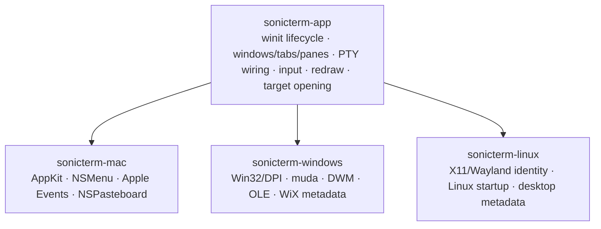

# Platform Integration

[简体中文](Platform-Integration-zh-CN)

Find what differs on macOS, Windows, and Linux below. The platform matrix gives
a quick comparison. Build packages with [Packaging](Packaging); verification and
release steps are in [Development and Release](Development-and-Release).

## Shared and native ownership

A behavior stays in `sonicterm-app` or a lower crate when it needs no AppKit,
Win32, X11, or Wayland handle. Platform crates own work that requires a native
main-thread object, platform ABI, desktop identity, or installer metadata.
Terminal parsing is in `sonicterm-vt`; local PTY/ConPTY transport is behind
`sonicterm-io::PtyHandle`; rendering is in `sonicterm-gpu`.

The binaries share diagnostic, config, logging, asset, state-machine, and shell
startup; the ordered sequence is in [Runtime Lifecycle](Runtime-Lifecycle).
User state is under `~/.sonicterm`; `sonicterm-cfg::assets` resolves packaged assets.

Terminal IME geometry is shared app behavior: each window sends the active
pane's physical cursor rectangle, including its origin and content padding once.
Deduplication uses pane identity, physical position, and physical size rather
than only row/column. Palette and search fields retain their own anchors.

## Native target opening

Path scanning and openability probing are cross-platform app behavior. The
bounded worker revalidates the exact target kind and action immediately before
native dispatch and blocks symlink or reparse-point and special-file identities.
Regular files are selected regardless of executable suffix, mode, or contents. A punctuation-bearing literal candidate is authoritative
when it exists; only a missing literal can yield to its shorter prose-trimmed
candidate.

| Platform | Dispatch boundary |
| --- | --- |
| macOS | directories use fixed `/usr/bin/open --`; files use `/usr/bin/open -R --` to select without opening |
| Windows | directories use `ShellExecuteExW`; files use `SHOpenFolderAndSelectItems`, from a dedicated COM apartment |
| Linux | directories use the desktop portal, with fixed `xdg-open` fallback only when unavailable; files use `org.freedesktop.FileManager1.ShowItems` without a file-opening fallback |

File selection never invokes the file's associated application or executes its contents.
macOS application/package directories use Finder selection rather than launch.
A portal rejection is not treated as unavailability and does not fall back.

On Windows directory navigation and non-file URI dispatch
reach the shell the same way: `ShellExecuteExW` is called directly from a
worker thread that owns its own COM apartment, so no command interpreter parses
the target and no argument string is re-tokenized. The URI is passed as one
NUL-terminated UTF-16 string, and environment substitution stays disabled, so
percent-delimited text such as `%20` or `%USERNAME%` reaches the handler exactly
as validated instead of expanding against the process environment.

## macOS

### AppKit lifecycle and menu

The shared macOS `App::do_resumed` path uses winit's
`set_allows_automatic_window_tabbing(false)` before menu hooks and native window
creation. The binary retains its normal/smoke window-ready callbacks that set the
initial NSWindow's `setTabbingMode: 2`. The process setting and per-window mode
are separate; SonicTerm remains the owner of terminal tabs.

Native smoke reads back the process property before window creation. This proves
the setting reached AppKit, not the appearance of every native tab strip.

The NSMenu is installed only after winit has created the AppKit event loop. An
Objective-C target receives menu selectors, translates menu tags to shared
`Action` values, and wakes the event loop through its proxy. Per-window AppKit
work runs from the one-shot window-ready callback after a valid NSWindow exists.

### Shell-script open events

The app bundle advertises `public.shell-script` and
`com.apple.terminal.shell-script` at `LSHandlerRank=Alternate`. A process-lifetime
observer receives `NSApplicationWillFinishLaunchingNotification` and then
installs the `kAEOpenDocuments` Apple Event handler. Paths are copied into the
shared open-script queue; window and PTY creation remains on the event-loop
thread. Cold multi-file opens preserve order and avoid an unrelated blank tab;
later events append tabs. Relative paths use the process's initial working
directory. This is Finder **Open With** integration, not a global default-terminal
selector.

### Tab handoff

The macOS OS-handoff backend writes a serialized `TabPayload` to the general
NSPasteboard under `com.sonic-terminal.tab.v1`. `sonicterm-mac` checks for that
payload exactly once at process startup, before `MacShell::run`. A valid startup
payload is removed from the pasteboard and passed to the shell as pending input;
an already-running peer does not check again when it becomes active. The backend
is startup-only on the receiving side and does not create an `NSDraggingSession`,
so it provides no native cursor preview. A pasteboard write returns
`NotAcknowledged`, so the source tab stays live and the app uses its normal
in-process tear-out path. Same-process movement uses the shared in-process
tab-transfer path.

### App resources

The bundle reads runtime assets from `Contents/Resources/assets`. Its four
`Rec Mono St.Helens` faces are stored only in `assets/fonts`;
`ATSApplicationFontsPath=assets/fonts` lets AppKit/CoreText resolve the same files.
The package contains Cairo's non-system dylib closure in `Contents/Frameworks`
with bundle-relative imports, plus licenses and provenance. Its minimum macOS
version reflects the actual executable/library deployment targets, not merely
the packaging host's architecture. See [Packaging](Packaging) for verification.

## Windows

### Process and HWND lifecycle

Before winit creates an HWND, `sonicterm-windows` requests
`DPI_AWARENESS_CONTEXT_PER_MONITOR_AWARE_V2`. This early process policy precedes
event-loop construction and is retained rather than assuming winit's later setup
is equivalent for every startup path. Release builds use the Windows GUI
subsystem and open no console window. The one-shot window-ready callback receives
a live HWND and applies the DWM backdrop and native `muda` menu. Window movement,
snap layouts, and minimize/maximize/close controls remain native Windows chrome.

The menu translates `muda` events to shared actions. DWM can request Mica,
Acrylic, or Tabbed material and falls back to opaque. Forced software rendering
uses an opaque window because the GDI presenter cannot composite transparency.

### CLI and shell-file registration

The installed executable accepts one lossless `--open-script <PATH>` argument.
The startup path resolves a relative argument against the process's initial
working directory and queues it before `WindowsShell::run`, so cold startup
opens the script tab instead of a HOME tab. The private tear-out payload cannot
be combined with `--open-script`.

`--refresh-shell-associations` runs without a window and broadcasts
`SHCNE_ASSOCCHANGED`. The MSI registers SonicTerm ProgIDs, Default Apps
capabilities, and `OpenWithProgids` for `.ps1`, `.cmd`, `.bat`, and `.sh`. It does
not write an extension default or `UserChoice`. This is file-handler integration,
not Windows' global **Default terminal application** protocol.

### OLE tab drag/drop

The Windows backend initializes OLE on the UI thread and implements COM
`IDataObject`, `IDropSource`, and `IDropTarget`. It registers the private
`com.sonic-terminal.tab.v1` clipboard format (`CF_SONIC_TAB`) and uses
`DoDragDrop` and `RegisterDragDrop`. The UTF-8 tab JSON owns a NUL terminator in
zero-initialized movable global memory; `GlobalSize` is allocation capacity, not
payload length, so allocator padding cannot change same-process payload matching.

The installed backend explicitly declares whether it owns native drop targets.
Before each main, new, tear-out or hidden warm HWND is created, shared window
setup disables winit's default target only for that custom owner. Without a custom
backend, winit's default file-drop behavior remains enabled. Hidden warm windows
have no custom registration until adoption. Failed registration aborts the hidden
destination before shell startup or pane transfer; a failed tear-out restores its
source. Successful registration retains the window until revocation, and backend
teardown releases any remaining targets before the OLE guard is dropped.

File drops carry the registered destination `WindowId` through the shared queue;
later focus changes cannot redirect them, and a closed target discards its drop.
Overlapping tab bars are hit-tested only within the receiving native window.
Same-process tab moves additionally require the active gesture and its exact
payload; stable source `WindowId`/`TabId` bookkeeping remains authoritative.
Foreign-process or malformed tab payloads are refused without acknowledging a
move: there is no supported live-PTY transfer between processes. An OLE `MOVE`
without a resolved local outcome cancels rather than inventing a destination.

The default Windows runtime smoke installs the production OLE backend and requires three
successful registration/revocation pairs: main, warm-adopted child, and fresh
child, with zero retained registrations or failures. Native unit tests use real
hidden HWNDs and COM data objects for ownership, Unicode file paths, exact target
routing, duplicate refusal and cleanup. Direct COM calls prove decoding and
routing, not physical drag gesture delivery.

### System font fallback

The DirectWrite/GDI bridge passes complete UTF-16 to the analysis source.
Mapping positions, remaining text, and locale lengths use UTF-16 code units,
not Rust scalar counts. A zero, out-of-range, or split-surrogate mapping span
fails the whole native fallback request, including any candidates accumulated
before the failure. The caller reports the failure and continues its remaining
configured locators. A successful request returns an ordered, deduplicated
candidate-font list, not per-character assignments; already-loaded faces and
BMP behavior keep their existing path.

### PTY and software presentation

The Windows binary owns GUI glue, not terminal parsing or ConPTY. Local process
hosting remains behind `sonicterm-io::PtyHandle`.

When software-render degradation is active on Windows, `sonicterm-gpu` composes
a CPU BGRA frame in `crates/sonicterm-gpu/src/software_frame.rs`. The Windows-only
`software_windows.rs` bridge presents the complete frame through GDI; this path
does not use retained GPU damage as a second presentation policy.
`crates/sonicterm-windows/src/software_presenter.rs` holds configuration decisions,
not frame composition or native blits.

## Linux

### X11 and Wayland identity

The shipping crate is `sonicterm-linux`; its executable is `sonicterm`. winit
uses X11 or Wayland. Desktop entry, AppStream component, hicolor icon, Wayland
application id, and X11 class all use `com.d0n9x1n.SonicTerm`; the X11 instance
name is `sonicterm`. Keeping one identity aligns launcher activation, task
grouping, and compositor identity.

Linux has no SonicTerm native menu, desktop-notification bridge,
foreground-process title adapter, native material backdrop, or cross-process tab
drag. Its shell installs a pure platform normalizer on the shared app runner.
Startup and every explicit reload pass through that one seam before config is
stored or applied: Mica, Acrylic, and Tabbed become opaque with one warning;
already-opaque input is unchanged and silent. Warm, new, and torn-out windows
therefore consume the same normalized value. macOS and Windows install identity
behavior and retain their supported backdrop policy. Shared panes, tabs, windows,
and in-process tab movement remain available.

### Shell, fonts, and assets

Automatic shell selection chooses the first executable candidate in this order:
`$SHELL`, the current user's passwd shell from `getpwuid_r`, then `/bin/sh`.
Explicit shell configuration wins.

A portable package resolves the executable-adjacent `assets/`; a Debian install
resolves `/usr/share/sonicterm/assets`. Startup verifies all four bundled Rec
Mono faces, passes their directory to `FontStack` before native Fontconfig
discovery, and retains that directory across font reloads. Native fallback
remains available.

### Runtime smoke boundary

All three shipping binaries accept the hidden `--runtime-smoke` mode. The
platform supplies its real shell command (`/bin/sh` on macOS/Linux, `cmd.exe` on
Windows), while the shared runner requires a native window, renderer/device, a
non-literal PTY marker observed in the live grid, and a later native
presentation. It then uses the production default warm pool to create and report
one hidden renderer, adopts that exact window through tab tear-out, presents the
child, closes it, clears any replenished spare, and requires
`live_renderer_count` to return to the pre-window baseline. Warm-lifecycle
failure is stable exit code `16`.

The Windows default run still requires three OLE registrations/revocations; its
early frame-validation run requires exactly one main-window pair with no native
failures or live registrations after App teardown. Both keep the OLE guard alive
through backend release.

The smoke tears out a temporary second tab, preserving the original main shell
and its marker history through warm-child teardown. Fault phases count marker
rows across the live grid and scrollback; re-reading an old marker cannot prove
liveness. They compare both present-call and acknowledged-frame totals across
all windows, and require an actual render attempt plus at least 250 ms without
presentation. Each fault waits at most 5 seconds; the destroy hook has its own
5-second poll bound. The app's watchdog requests exit after 30 seconds; the
runner enforces the hard 45-second outer deadline. The 15-second difference
allows for a queued watchdog event, the bounded destroy poll, and teardown.
These are configured deadlines, not measured runtime claims.

After the warm lifecycle, the default run checks that every open window shares
the main window's device generation, then drives the renderer's doc-hidden GPU
fault hook. An isolated fault must be followed by a later native main-window
presentation. A retained-resource fault, injected through
`force_rebuild_for_scale`, must leave the device recorded `Unusable`, no window
presenting, and a re-executed PTY marker in the live grid. The generation check
and these two phases exit `17` on failure. A device destroy must then produce
the lost record and another re-executed marker, or the smoke exits `18`.

A second, separate process started with
`scripts/native-smoke-runner.py --scenario frame-validation` begins with a
usable device and, after the first main presentation, injects a persistent
frame-validation fault. Arming only creates a valid probe: it sends no marker
and starts no quiet interval. After an actual faulty render is observed to
leave the device `Unusable`, the smoke snapshots a new marker-row baseline,
resends the shell command, and starts a fresh 250 ms no-presentation interval.
Markers emitted before that confirmed stop cannot satisfy the proof, and time
spent waiting for the faulty render does not count as quiet time. The separate
five-second deadline stays anchored to arming; confirming the stop does not
extend it. Both present counters remain frozen against their original pre-fault
baseline. A missing post-stop marker or failed containment exits `17`. The runner sets
`SONICTERM_RUNTIME_SMOKE_SCENARIO=frame-validation` for that run and removes any
inherited value for a plain run. An unknown application environment value fails
before the event loop starts with exit `10`; an unknown runner `--scenario`
argument is an invocation error (exit `2`) and launches no child.

Automation passes separate scratch `config/` and `logs/` roots without replacing
`HOME`. `scripts/native-smoke-runner.py` removes inherited `NO_COLOR`, captures
stdout/stderr and log artifacts, enforces a 45-second outer deadline, and kills
the child's process group on POSIX; descendants that leave the group are outside
that bound. PR and release gates run both scenarios in separately timed steps
for the built macOS and Windows binaries and both Linux package layouts on X11
and Wayland. [Packaging](Packaging) describes the Linux scenario argument and
isolated evidence paths. Otherwise successful smoke with unsettled native PTY
teardown exits `20`; an earlier fault or loss keeps its original failure code.

## Platform matrix

| Capability | macOS | Windows | Linux |
| --- | --- | --- | --- |
| Window backend | winit + AppKit hooks | winit + Win32 hooks | winit + X11 or Wayland |
| Local PTY | portable-pty Unix PTY | portable-pty ConPTY | portable-pty Unix PTY |
| Default glyph rasterizer | FreeType | DirectWrite, with FreeType fallback | FreeType |
| Font discovery | CoreText | DirectWrite/GDI | packaged font directory + Fontconfig |
| Tab OS handoff | NSPasteboard publication, no `NSDraggingSession` | OLE/COM drag/drop | in-process only |
| Native menu | NSMenu | `muda` | unavailable; in-app actions remain |
| Backdrop | AppKit blur/config | DWM Mica/Acrylic/Tabbed | opaque |
| Software present | wgpu adapter path | CPU BGRA + GDI | wgpu Vulkan/lavapipe or selected platform adapter |
| Package format | `.app` in per-architecture `.dmg` | x64 WiX `.msi` | x86_64 `.deb` and `.tar.gz` |
| Signing | ad-hoc bundle signature | unsigned | unsigned |

## Code map

| Boundary | Primary paths |
| --- | --- |
| Shared platform shell | `crates/sonicterm-app/src/shell.rs` |
| Safe native target open | `crates/sonicterm-app/src/app/path_target.rs` |
| macOS entry/menu/open documents/tab handoff | `crates/sonicterm-mac/src/{main,menubar,open_documents,os_drag_mac,tab_drag_os}.rs` |
| Windows entry/CLI/menu/backdrop/tab drag | `crates/sonicterm-windows/src/{main,cli,startup,menubar,backdrop,os_drag_win,tab_drag_os}.rs` |
| Windows software present | `crates/sonicterm-gpu/src/{software_frame,software_windows}.rs`, `crates/sonicterm-windows/src/software_presenter.rs` |
| Linux entry and identity | `crates/sonicterm-linux/src/main.rs`, `crates/sonicterm-linux/resources/` |
| Asset lookup | `crates/sonicterm-cfg/src/assets.rs` |
