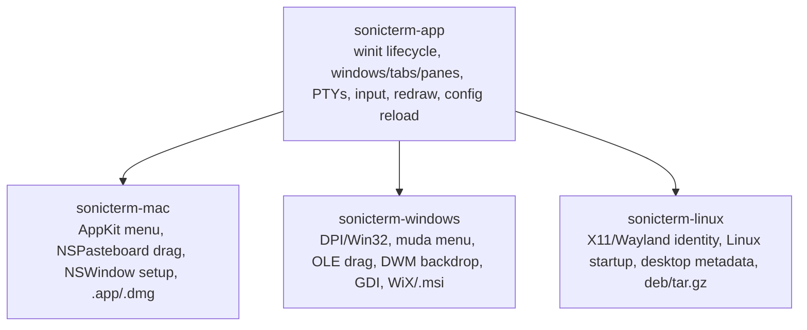
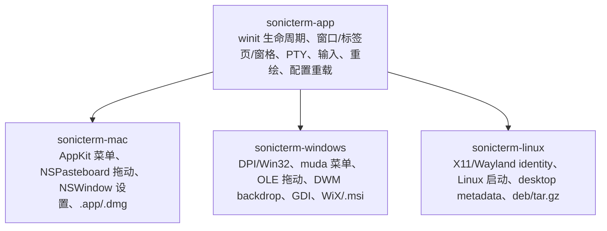

# Platform Integration / 平台集成

## English

`sonicterm-app` owns cross-platform behavior. `sonicterm-mac`,
`sonicterm-windows`, and `sonicterm-linux` are binary/glue crates that initialize
diagnostics and configuration, then attach the native integrations each platform
supports plus resources and packaging metadata.

## Shared versus platform-specific

A behavior belongs in `sonicterm-app` or a lower crate when it can be expressed
without AppKit, Win32, X11, or Wayland handles. Platform crates should hold work
that requires a main-thread native object, a platform ABI, desktop identity, or
installer format.

## Common binary startup

All three entry points:

1. install the panic hook and exit tracing;
2. load user config while collecting warnings;
3. initialize logging with the loaded `[logging]` section;
4. load theme, keymap, and runtime assets;
5. create an `AppStateMachine` and platform shell;
6. install native callbacks through shell builder hooks;
7. run the common winit app.

All user state is under `~/.sonicterm`. Runtime assets can be found beside a
development binary or inside the platform package.

## macOS integration

### Main-thread AppKit work

`sonicterm-mac` uses `objc2` bindings. AppKit automatic window tabbing is
disabled globally and on each created window so SonicTerm's own tab model and
tear-out behavior remain authoritative.

The native menu is built after the AppKit event loop is active. An Objective-C
target receives selectors, maps menu tags to cross-platform `Action`s, and posts
them through the event-loop proxy. AppKit calls stay on the main thread.

### Script-file open events

The packaged app advertises `public.shell-script` and
`com.apple.terminal.shell-script` with `LSHandlerRank=Alternate`. A
process-lifetime observer installs the `kAEOpenDocuments` handler during
`NSApplicationWillFinishLaunchingNotification`, after AppKit installs its
default handlers but before cold-launch documents arrive. The callback copies
file paths into the shared FIFO and wakes winit when a proxy exists; window and
PTY work stays on the event-loop thread. Cold multi-file opens create ordered
tabs without an extra blank tab, and later events append tabs. macOS has no
global default-terminal selector.

### Tab drag

The macOS OS-handoff backend uses the general NSPasteboard with the private type
`com.sonic-terminal.tab.v1`. It writes a serialized tab payload that another
SonicTerm process can consume when it becomes active. It does **not** create an
`NSDraggingSession`, so no native preview follows the cursor; a successful
pasteboard write is not treated as receiver acknowledgement, and the source tab
stays alive unless another transfer path safely commits it. Same-process window
merges are handled separately by the cross-platform in-process transfer path.

### Fonts and resources

The app package contains `Contents/Resources/assets`. Bundled TTF files are also
copied to `Contents/Resources/Fonts`, and `ATSApplicationFontsPath` is written
so AppKit/CoreText can resolve `Rec Mono St.Helens`.

### DMG packaging

`scripts/make-macos-dmg.sh` assembles `SonicTerm.app`, writes `Info.plist`,
copies resources, performs ad-hoc signing, and creates an architecture-specific
DMG through `create-dmg` or `hdiutil`. Current releases build separate Apple
Silicon and Intel images. They are not Developer-ID signed or notarized.

## Windows integration

### Startup and HWND work

Windows sets `DPI_AWARENESS_CONTEXT_PER_MONITOR_AWARE_V2` before winit creates
an HWND. A release build uses the Windows GUI subsystem, so no console window is
opened. A private command-line payload supports cross-process tab tear-out.

The window-ready callback runs after the HWND is valid. This is where native
menu, backdrop, taskbar icon, and drag/drop hooks that require a window handle
must be installed.

### Script-file command line

The installed executable accepts one lossless `--open-script <PATH>` argument.
The path is resolved against the process's initial cwd before pane creation and
queued before `WindowsShell::run`, so cold startup creates the script tab rather
than an unrelated HOME tab. A separate no-window
`--refresh-shell-associations` mode broadcasts `SHCNE_ASSOCCHANGED` for the MSI.
The MSI registers ProgIDs, Default Apps capabilities, and `OpenWithProgids` for
`.ps1`, `.cmd`, `.bat`, and `.sh`; it never writes an extension default or
`UserChoice`. This is file-handler integration, not Windows' global **Default
terminal application** protocol.

### Menu and window appearance

The menu uses `muda`; menu events are pumped and translated to shared actions.
DWM backdrop selection can request Mica, Acrylic, or Tabbed material, while an
opaque fallback remains available. Native titlebar movement, snap layouts, and
minimize/maximize/close controls stay owned by Windows rather than custom chrome.

### OLE drag/drop

The Windows drag backend implements COM `IDataObject`, `IDropSource`, and
`IDropTarget`. It registers a private `CF_SONIC_TAB` clipboard format and uses
`DoDragDrop`/`RegisterDragDrop` for source and destination handoff. OLE
initialization and drag operations remain on the window thread.

### PTY and rendering boundaries

The Windows binary does not own terminal parsing. Local process hosting,
including ConPTY as selected by `portable-pty`, is implemented behind
`sonicterm-io::PtyHandle`. The binary owns only Win32-specific GUI glue.

On software adapters, the renderer can compose a CPU BGRA frame and present it
through GDI. The active CPU frame implementation is in
`crates/sonicterm-gpu/src/software_windows.rs`; the Windows crate also contains a
retained dirty-rectangle presenter primitive and configuration preference model.

### MSI packaging

`cargo wix` consumes `crates/sonicterm-windows/wix/main.wxs`. The MSI installs
the executable, themes, keymaps, bundled fonts, and icons under Program Files,
creates a Start-menu shortcut, and optionally creates a desktop shortcut.
`build.rs` embeds icon/version resources and copies the asset tree beside debug
or release binaries for local runs. The MSI is currently unsigned.

## Linux integration

### X11 and Wayland identity

The shipping crate is `sonicterm-linux`; its installed binary is `sonicterm`.
winit creates either an X11 or Wayland window. The runtime desktop ID and X11
class are `com.d0n9x1n.SonicTerm`, with X11 instance name `sonicterm`; the same
ID names the desktop entry, AppStream component, and hicolor icon. This keeps
launcher activation, task grouping, and Wayland application identity aligned.

Linux has no SonicTerm-native menu, desktop-notification bridge,
foreground-process title adapter, native material backdrop, or cross-process tab
drag. Those hooks remain absent and the configured backdrop is clamped to opaque
with a warning. In-process panes, tabs, windows, and tab movement continue through
the shared app.

### Shell, fonts, and resources

Automatic Unix shell selection uses the first executable candidate in this
order: `$SHELL`, the current user's passwd shell from `getpwuid_r`, then
`/bin/sh`. An explicit configured shell still wins.

Portable archives resolve the executable-adjacent `assets/`; Debian installs
resolve `/usr/share/sonicterm/assets`. The renderer passes the packaged font
directory into `FontStack` before native Fontconfig discovery and retains it
across live font reloads, so all regular, bold, italic, and bold-italic Rec Mono
faces work without system installation while native fallback remains available.

### Packages and runtime proof

`scripts/make-linux-packages.sh` builds one relocatable `.tar.gz` and one FHS
`.deb` from the same staged payload. Ubuntu 22.04 supplies the glibc 2.35 build
baseline; `dpkg-shlibdeps` generates linked Debian dependencies, while the package
also declares `libxkbcommon-x11-0` because winit loads it dynamically for X11. CI
extracts and runs both layouts on X11/Xvfb and headless Wayland/Weston with
Vulkan/lavapipe. The hidden smoke succeeds only after window creation, GPU
initialization, a
`/bin/sh` PTY marker round-trip into the grid, and a subsequent native frame
presentation.

## Platform matrix

| Capability | macOS | Windows | Linux |
| --- | --- | --- | --- |
| Window backend | winit + AppKit hooks | winit + Win32 hooks | winit + X11 or Wayland |
| Local PTY | portable-pty Unix PTY | portable-pty ConPTY | portable-pty Unix PTY |
| Default glyph rasterizer | FreeType | DirectWrite, FreeType fallback | FreeType |
| Font discovery | CoreText | DirectWrite/GDI | packaged font dirs + Fontconfig |
| Tab OS handoff | NSPasteboard payload (no `NSDraggingSession`) | OLE/COM drag/drop | in-process only |
| Native menu | NSMenu | muda | unavailable; in-app actions remain |
| Backdrop | AppKit blur/config | DWM Mica/Acrylic/Tabbed | opaque |
| Software present | wgpu CPU adapter behavior | dedicated CPU BGRA + GDI path | wgpu Vulkan/lavapipe or platform adapter |
| Package | `.app` in architecture-specific `.dmg` | x64 WiX `.msi` | x86_64 `.deb` and `.tar.gz` |
| Current signing | ad-hoc only | unsigned | unsigned |

## Asset lookup and seeding

Bundled assets include:

- nine themes;
- platform keymaps plus a base keymap;
- four `Rec Mono St.Helens` font files;
- English, Simplified Chinese, and Japanese Fluent catalogs;
- application icons and screenshots.

On first run, config helpers seed editable user copies under
`~/.sonicterm/themes/` and `~/.sonicterm/keymaps/`. Named user assets take
precedence over bundled files; an explicit path can also be configured.

## Where to read the code

| Topic | Primary paths |
| --- | --- |
| Shared shell seam | `crates/sonicterm-app/src/shell.rs` |
| macOS entry/menu/drag | `crates/sonicterm-mac/src/{main,menubar,os_drag_mac,tab_drag_os}.rs` |
| Windows entry/menu/drag | `crates/sonicterm-windows/src/{main,menubar,os_drag_win,tab_drag_os}.rs` |
| DWM and chrome | `crates/sonicterm-windows/src/{backdrop,chrome}.rs` |
| Windows software present | `crates/sonicterm-gpu/src/software_windows.rs`, `crates/sonicterm-windows/src/software_presenter.rs` |
| Linux entry/identity | `crates/sonicterm-linux/src/main.rs`, `crates/sonicterm-linux/resources/` |
| macOS package | `scripts/make-macos-dmg.sh`, `Packaging` |
| Windows package | `crates/sonicterm-windows/wix/main.wxs`, `Packaging` |
| Linux package/smoke | `scripts/{make,smoke}-linux-packages.sh`, `Packaging` |
| Assets/config paths | `crates/sonicterm-cfg/src/{assets,config,theme,keymap}.rs` |

## 中文

`sonicterm-app` 负责跨平台行为；`sonicterm-mac`、`sonicterm-windows` 与
`sonicterm-linux` 是二进制/胶水 crate，初始化诊断与配置，再连接各平台支持的原生集成、
资源和打包 metadata。

## 共享与平台专属边界

不需要 AppKit、Win32、X11 或 Wayland handle 的行为应放在 `sonicterm-app` 或更低层。
平台 crate 只保留必须依赖主线程原生对象、平台 ABI、desktop identity 或安装包格式的工作。

## 共同启动流程

三个入口都会：

1. 安装 panic hook 和退出追踪；
2. 读取用户配置并收集 warning；
3. 使用 `[logging]` 初始化日志；
4. 读取主题、keymap 和运行时资源；
5. 创建 `AppStateMachine` 与平台 shell；
6. 通过 shell builder hook 安装原生 callback；
7. 运行共同 winit app。

用户状态都位于 `~/.sonicterm`。运行时资产可位于开发二进制旁，或平台安装包内部。

## macOS 集成

### 主线程 AppKit 工作

`sonicterm-mac` 使用 `objc2`。程序在全局和每个新窗口上关闭 AppKit 自动 tab，使 SonicTerm
自己的标签页与 tear-out 模型保持权威。

原生菜单在 AppKit 事件循环可用后构建。Objective-C target 接收 selector，把菜单 tag 映射为
跨平台 `Action`，再经 event-loop proxy 发送。AppKit 调用保持在主线程。

### 脚本文件打开事件

打包后的应用以 `LSHandlerRank=Alternate` 声明 `public.shell-script` 与
`com.apple.terminal.shell-script`。进程级 observer 在
`NSApplicationWillFinishLaunchingNotification` 阶段安装 `kAEOpenDocuments` handler：
此时 AppKit 已安装默认 handler，而冷启动文档事件尚未到达。callback 只把路径复制到共享
FIFO，并在 proxy 可用时唤醒 winit；窗口和 PTY 工作仍由事件循环线程执行。冷启动多文件会按顺序
创建标签页且不额外创建空白标签页，后续事件则追加标签页。macOS 不存在全局默认终端选择器。

### 标签页拖动

macOS 的 OS handoff backend 使用 general NSPasteboard 私有类型
`com.sonic-terminal.tab.v1`，写入序列化 tab payload，供另一个 SonicTerm 进程在变为 active 时读取。
它**不会**创建 `NSDraggingSession`，因此没有跟随光标的原生 preview；成功写入 pasteboard 也不等于接收端确认，
所以除非其它转移路径安全提交，源 tab 会继续保留。同进程窗口合并由独立的跨平台进程内转移路径处理。

### 字体与资源

app package 包含 `Contents/Resources/assets`。内置 TTF 还复制到 `Contents/Resources/Fonts`，
并设置 `ATSApplicationFontsPath`，使 AppKit/CoreText 能解析 `Rec Mono St.Helens`。

### DMG 打包

`scripts/make-macos-dmg.sh` 组装 `SonicTerm.app`、写入 `Info.plist`、复制资源、执行 ad-hoc signing，
并通过 `create-dmg` 或 `hdiutil` 生成对应架构 DMG。当前分别构建 Apple Silicon 与 Intel 镜像；
尚无 Developer ID 签名或 notarization。

## Windows 集成

### 启动与 HWND 工作

Windows 在 winit 创建 HWND 前设置 per-monitor-v2 DPI awareness。release build 使用 Windows GUI subsystem，
不会打开控制台窗口。内部命令行 payload 支持跨进程标签页撕离。

window-ready callback 在 HWND 有效后执行；需要 window handle 的原生菜单、backdrop、taskbar icon 和拖放 hook
必须在这里安装。

### 脚本文件命令行

安装后的 executable 接受一个无损的 `--open-script <PATH>` 参数。路径会在创建窗格前，
相对进程初始 cwd 解析，并在 `WindowsShell::run` 前进入队列，因此冷启动会创建脚本标签页，
而不是无关的 HOME 标签页。另有不创建窗口的 `--refresh-shell-associations` 模式，供 MSI
广播 `SHCNE_ASSOCCHANGED`。MSI 为 `.ps1`、`.cmd`、`.bat`、`.sh` 注册 ProgID、
Default Apps capabilities 与 `OpenWithProgids`；它不会写扩展名默认值或 `UserChoice`。
这是文件处理程序集成，不是 Windows 全局**默认终端应用**协议。

### 菜单与窗口外观

菜单使用 `muda`，把菜单事件转换为共享 action。DWM backdrop 可请求 Mica、Acrylic 或 Tabbed material，
也可回退 opaque。titlebar 移动、snap layout 和最小化/最大化/关闭控件由 Windows 原生管理，不自绘 chrome。

### OLE 拖放

Windows drag backend 实现 COM `IDataObject`、`IDropSource`、`IDropTarget`，注册私有
`CF_SONIC_TAB` clipboard format，并通过 `DoDragDrop`/`RegisterDragDrop` 交接。
OLE 初始化和 drag 操作保持在窗口线程。

### PTY 与渲染边界

Windows 二进制不负责终端解析。本地进程 hosting（包括 `portable-pty` 选择的 ConPTY）隐藏在
`sonicterm-io::PtyHandle` 后；二进制只负责 Win32 GUI 胶水。

软件 adapter 下，renderer 可在 CPU 中合成 BGRA frame，并通过 GDI 呈现。当前 CPU frame 实现在
`crates/sonicterm-gpu/src/software_windows.rs`；Windows crate 还包含 retained dirty-rectangle presenter primitive
与配置 preference model。

### MSI 打包

`cargo wix` 消费 `crates/sonicterm-windows/wix/main.wxs`。MSI 在 Program Files 安装 executable、theme、
keymap、内置字体和 icon，创建开始菜单快捷方式，并可选桌面快捷方式。`build.rs` 嵌入 icon/version resource，
并为本地运行把 assets 复制到 debug/release binary 旁。MSI 当前未签名。

## Linux 集成

### X11 与 Wayland identity

发布 crate 是 `sonicterm-linux`，安装后的二进制名为 `sonicterm`。winit 会创建 X11
或 Wayland 窗口。runtime desktop ID 与 X11 class 为 `com.d0n9x1n.SonicTerm`，
X11 instance name 为 `sonicterm`；desktop entry、AppStream component 与 hicolor
icon 使用同一 ID，使 launcher activation、任务分组和 Wayland application identity
保持一致。

Linux 当前没有 SonicTerm 原生菜单、desktop notification bridge、前台进程标题 adapter、
原生 material backdrop 或跨进程 tab drag。这些 hook 保持缺席，配置的 backdrop 会带 warning
收敛为 opaque。进程内 pane、tab、window 和 tab movement 仍通过共享 app 工作。

### Shell、字体与资源

Unix 自动 shell 选择按顺序使用第一个可执行候选：`$SHELL`、通过 `getpwuid_r` 得到的
当前用户 passwd shell、最后是 `/bin/sh`。显式配置的 shell 仍优先。

便携归档解析 executable 相邻的 `assets/`；Debian 安装解析
`/usr/share/sonicterm/assets`。renderer 会在原生 Fontconfig discovery 前把打包字体目录
传入 `FontStack`，并在实时字体重载时保留，因此 Rec Mono 的 regular、bold、italic、
bold-italic 四种 face 无需系统安装即可工作，同时保留原生 fallback。

### 安装包与 runtime 证明

`scripts/make-linux-packages.sh` 从同一个 staged payload 构建可重定位 `.tar.gz` 与 FHS
`.deb`。Ubuntu 22.04 提供 glibc 2.35 构建基线；`dpkg-shlibdeps` 生成已链接的 Debian
dependency，而 package 还会声明 `libxkbcommon-x11-0`，因为 winit 会在 X11 下动态
加载它。CI 会解压并运行两种 layout，让它们分别在 X11/Xvfb 与 headless
Wayland/Weston 下使用 Vulkan/lavapipe。只有完成窗口创建、GPU 初始化、`/bin/sh`
PTY marker 往返进入 grid，
并随后完成一帧原生呈现，隐藏 smoke 才会成功。

## 平台矩阵

| 能力 | macOS | Windows | Linux |
| --- | --- | --- | --- |
| 窗口后端 | winit + AppKit hook | winit + Win32 hook | winit + X11 或 Wayland |
| 本地 PTY | portable-pty Unix PTY | portable-pty ConPTY | portable-pty Unix PTY |
| 默认字形光栅器 | FreeType | DirectWrite，FreeType 回退 | FreeType |
| 字体发现 | CoreText | DirectWrite/GDI | 打包 font dir + Fontconfig |
| Tab OS handoff | NSPasteboard payload (no `NSDraggingSession`) | OLE/COM drag/drop | 仅进程内 |
| 原生菜单 | NSMenu | muda | 不可用；保留 in-app action |
| Backdrop | AppKit blur/config | DWM Mica/Acrylic/Tabbed | opaque |
| 软件呈现 | wgpu CPU adapter 行为 | 专用 CPU BGRA + GDI 路径 | wgpu Vulkan/lavapipe 或平台 adapter |
| 安装包 | 架构专属 `.dmg` 内的 `.app` | x64 WiX `.msi` | x86_64 `.deb` 与 `.tar.gz` |
| 当前签名 | 仅 ad-hoc | 未签名 | 未签名 |

## 资产查找与初始化

内置资产包括：

- 九个主题；
- 平台 keymap 与基础 keymap；
- 四个 `Rec Mono St.Helens` 字体文件；
- 英文、简体中文和日文 Fluent catalog；
- 应用 icon 与截图。

首次运行时，配置 helper 会在 `~/.sonicterm/themes/` 和 `~/.sonicterm/keymaps/` 写入可编辑副本。
同名用户资产优先于内置文件，也可配置显式路径。

## 从哪里阅读源码

| 主题 | 主要路径 |
| --- | --- |
| 共享 shell 接缝 | `crates/sonicterm-app/src/shell.rs` |
| macOS 入口/菜单/拖动 | `crates/sonicterm-mac/src/{main,menubar,os_drag_mac,tab_drag_os}.rs` |
| Windows 入口/菜单/拖动 | `crates/sonicterm-windows/src/{main,menubar,os_drag_win,tab_drag_os}.rs` |
| DWM 与 chrome | `crates/sonicterm-windows/src/{backdrop,chrome}.rs` |
| Windows 软件呈现 | `crates/sonicterm-gpu/src/software_windows.rs`, `crates/sonicterm-windows/src/software_presenter.rs` |
| Linux 入口/identity | `crates/sonicterm-linux/src/main.rs`, `crates/sonicterm-linux/resources/` |
| macOS package | `scripts/make-macos-dmg.sh`, `Packaging` |
| Windows package | `crates/sonicterm-windows/wix/main.wxs`, `Packaging` |
| Linux package/smoke | `scripts/{make,smoke}-linux-packages.sh`, `Packaging` |
| Asset/config 路径 | `crates/sonicterm-cfg/src/{assets,config,theme,keymap}.rs` |
