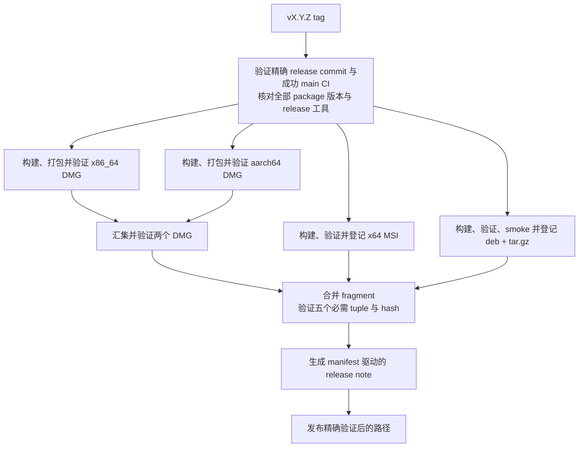

# 发布流程

[English](Release-Process)

Release 从推送 tag 开始。本页说明 release workflow、发布资产、release notes 中已解决 issue 的来源证据，
以及打 tag 前后的手工检查。

## Release workflow

推送符合 `v<semver>` 的 tag 会启动 `.github/workflows/release.yml`。所有者批准推送 tag
与本地运行打包是两件事。含 `-` 的 pre-release tag 会自动标为 prerelease。

任何平台 job 开始前，验证步骤会把 tag ref 解引用到对应 commit，获取完整的 `origin/main`
历史，要求该 commit 是其祖先，并用只读 `actions` 权限查找 head 完全等于该 commit、已完成且
成功的 `CI` push run。这个精确 run 已包含全部源码、unit、integration、平台 runtime、allocator、
coverage、package 与 Wiki 工具 gate。因此 release validator 在打包前只检查 workspace 版本和
release asset 工具，不会重新运行平台测试图。位于未审核分支的 tag、缺失或失败的 main run、
版本不一致或 release asset 契约失败都不能进入 package 构建。



三个打包链都会阻断发布。两个 macOS 架构和 Windows release job 都会在 artifact 继续流转前，
以默认、`frame-validation` 和 `device-recovery` 三种场景运行刚构建的发行二进制原生 smoke；Windows 不会重复运行
GDI 测试，因为 release 来源验证已要求完全相同 commit 的成功 `main` CI 结果，其中已经证明
`EXERCISED`。Windows Release 会恢复由
`main` 发布的 vcpkg binary cache，但其 Rust target 构建不会写入 Release cache。全部 Release
Rust target build 均独立于 cache，避免 tag 专属 cache 条目挤出有界的 CI 依赖 cache。Linux 链
用带原生进程期限的独立步骤，在 X11 与 Wayland 上运行默认、frame-validation 和 device-recovery
包冒烟场景；只有全部通过后其 artifact 才能进入发布。

### 发布资产

五个必需 package asset 为：

- `SonicTerm-<tag>-mac-aarch64.dmg`
- `SonicTerm-<tag>-mac-x86_64.dmg`
- `SonicTerm-<tag>-windows-x86_64.msi`
- `SonicTerm-<tag>-linux-x86_64.deb`
- `SonicTerm-<tag>-linux-x86_64.tar.gz`

每个 package job 会生成类型化 fragment，记录 tag、扁平文件名、platform、architecture、kind
和 SHA-256。Publish job 只下载已登记的 package bundle，验证文件与 hash，要求五个
platform/architecture/kind tuple，拒绝重复 tuple/名称和未登记的 release-like 文件，然后生成：

- `release-assets.json`
- 确定性的 `SHA256SUMS.txt`，其中也包含 manifest hash
- `release-upload-paths.txt`，即传给 GitHub Release 的精确列表

Release note 保留 manifest 驱动的下载列表、完整性 metadata、验证说明，以及前一个可达 tag
之后的非 merge commit 历史（不是版本号最大的 tag）。默认情况下查找前序 tag 失败就会终止；
应获取完整 tag 历史，而不是静默把查找失败视为首个 release。只有显式 `RELEASE_FIRST=1` 才允许
无 base 的 notes，且与任何已设置的 `PREVIOUS_TAG` 冲突。Shallow 仓库会被拒绝。首个 release
模式下展示最多 200 个 commit；issue 选择仍在明确上限内检查全部可达历史。GitHub Release 最终收到五个 package、
`release-assets.json` 和 `SHA256SUMS.txt`；fragment 文件与 `release-upload-paths.txt`
只是 workflow 内部数据。

### 已解决 issue 的来源证据

`scripts/release-issues.py` 生成 **Resolved issues** 部分。它先把 head/base 解析为 commit，
要求 base 是 head 的祖先，再选取从 head 可达而从 base 不可达的所有 commit，包括 merge commit。
分页的 REST commit-to-PR 关联只用于发现候选；已合并 PR 的 GraphQL `closingIssuesReferences`
及 commit 中明确的关闭关键字提名 issue。`Refs #123`、milestone 和当前 closed 状态都不是关闭
证据。脚本区分 issue 与 PR，对 issue 去重、排序、转义 Markdown；链接只使用已验证的
owner/repository 和整数编号构造。

仅当 GraphQL `ClosedEvent.closer` 指向范围内的 commit，或其 `mergeCommit` 在范围内的已合并
PR 时，issue 才会入选。这支持 merge、squash 与 rebase，不要求 REST timeline 的 `commit_id`
非空。可编辑的 PR 链接本身不能证明修复已交付；已在 base 祖先中关闭的 issue 不会当作新交付，
head 之后的关闭也不会入选。空 commit-to-PR 关联列表是正常结果。确实没有匹配时明确显示
**No linked issues resolved in this release range**。

Git 规范消息 `This reverts commit <完整 SHA>` 会取消目标贡献；merge revert 也取消该 merge
引入的 commit，revert-of-revert 则恢复原贡献。若 PR 关联的某个组成 commit 被 revert，会保守
省略整个 PR。没有规范 Git 标记的纯文字、部分或语义性反向变更不会被推断。这是 GitHub 关闭关联
证据，不声称发现全部修复，也不证明任意变更的运行时效果。缺失/删除的 metadata、未知的非空 closer
类型、错误 schema、不一致分页和含糊来源会使生成失败，而不是发布不完整列表。

null closer 绝不会进入 **Resolved issues**。被范围内变更提名、当前仍关闭的 issue，若当前关闭事件
晚于 base commit 日期且不晚于 head commit 日期（首次发布没有日期下限），可单独列入
**Manually closed issues (unverified release linkage)**。事件与 issue 的关闭时间必须相差不超过一秒，
以适应 GitHub 时间精度；缺失或无效日期、多个匹配事件仍会失败。此前已交付的 commit 关联关闭仍被
排除。单独披露会注明关闭日期，并明确不证明该版本解决了 issue；可编辑 PR 链接与日期绝不替代
已验证列表中的祖先关系检查。

Collector 缓存精确 API page，每页请求 100 项；每个 connection 最多 20 页，范围最多 2,000 个
commit，最多 1,000 次 API 尝试，每个子进程输出最多 4 MiB，API 总输出最多 32 MiB。每次请求
15 秒，总 deadline 900 秒，足够以每次 0.75 秒完成 1,000 次尝试，因此较大的范围会先达到尝试上限，
而不是先超时。超时或输出超限会终止并回收其子进程树。Windows 上，确认子进程已退出、
两条输出管道均到达 EOF 且输出解码成功后，返回时不再启动 `taskkill`。超时、输出超限和解码失败
仍执行进程树清理；POSIX 清理行为不变。仅 timeout、HTTP 429、明确
rate limit 和 HTTP 5xx 会重试（最多三次尝试、有界退避）。认证和 schema 失败不重试。任何超限
都失败，绝不静默截断。只有 publish job 在现有 `contents: write` 之外增加 `issues: read` 和
`pull-requests: read`，生成步骤通过 `GH_TOKEN` 使用短生命周期 job token；打包权限和
exact-tag 来源验证保持不变。

打 tag 前，可在检出仓库内使用已认证的 `gh` 会话进行只读预览（CI 使用 job token）：

```sh
python3 scripts/release-issues.py --repo D0n9X1n/SonicTerm \
  --head <exact-reviewed-merge-sha> --base <previous-tag-or-commit>
```

只有首个 release 才省略 `--base`。Helper 不创建也不要求新 tag。
`bash scripts/test-release-notes.sh` 同时运行离线临时 Git 历史、fake-`gh` 测试和
manifest/download 集成检查。

## 手工发布检查

推送 tag 前：

- 确认 workspace 版本和目标 tag；
- 运行完整 gate 与原生 release build；
- 对照当前 config、logging、input、palette、rendering、window、platform 和 package 行为，
  检查 README 与所有受影响 Wiki 页面；
- 启动 package，测试备用屏幕进入/退出、滚动、繁忙窗格、标签页拖出与子进程清理，
  并在相关场景检查 adapter 日志。

推送后，验证每个 release job，以及实际上传的精确资产和 checksum。本地生成 package 不等于发布。
