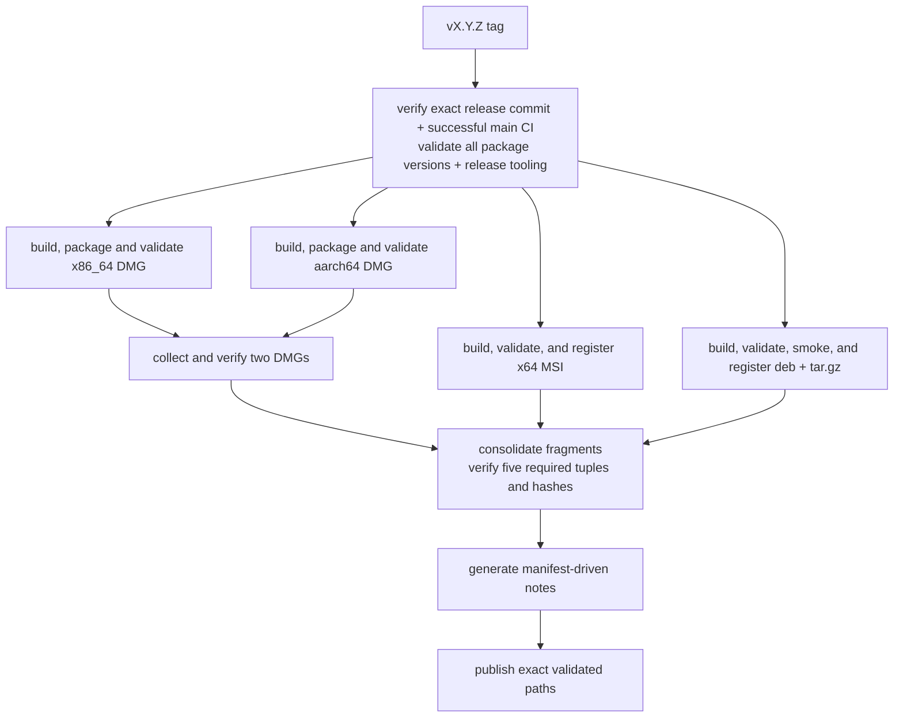

# Release Process

[简体中文](Release-Process-zh-CN)

A release starts from a pushed tag. This page covers the release workflow, the
published assets, the resolved-issue provenance in release notes, and the manual
checks around tagging.

## Release workflow

Pushing a tag matching `v<semver>` starts `.github/workflows/release.yml`.
Owner approval to push the tag is separate from running local packaging.
Pre-release tags containing `-` are marked prerelease.

Before any platform job starts, validation peels the tag ref to its commit,
fetches full `origin/main` history, requires that commit to be its ancestor, and
uses read-only `actions` access to find a completed successful `CI` push run
whose head is exactly that commit. That exact run already includes the full
source, unit, integration, platform-runtime, allocator, coverage, package, and
Wiki-tooling gates. The release validator therefore checks only the workspace
version and release-asset tooling before packaging; it does not rerun the
platform test graph. A tag on an unreviewed branch, a tag whose main run failed
or is missing, a version mismatch, or a release-asset contract failure cannot
reach package construction.



All three packaging chains block publication. Each macOS architecture and the
Windows release job run the exact built shipping binary's native smoke, in the
default, `frame-validation` and `device-recovery` scenarios, before its artifact can advance;
Windows does not rerun the GDI test because the release
provenance boundary already requires the exact successful `main` CI result that
proved `EXERCISED`. Windows Release restores the main-published vcpkg binary
cache but performs its Rust target build without a Release cache write. All
Release Rust target builds are cache-independent, so tag-specific cache entries
cannot displace the bounded CI dependency caches. The Linux chain runs default,
frame-validation and device-recovery package smokes on X11 and Wayland in separate
steps with native process deadlines before its artifacts can reach publication.

### Published assets

The five required package assets are:

- `SonicTerm-<tag>-mac-aarch64.dmg`
- `SonicTerm-<tag>-mac-x86_64.dmg`
- `SonicTerm-<tag>-windows-x86_64.msi`
- `SonicTerm-<tag>-linux-x86_64.deb`
- `SonicTerm-<tag>-linux-x86_64.tar.gz`

Each package job emits a typed fragment containing tag, flat filename,
platform, architecture, kind, and SHA-256. The publish job downloads only the
registered package bundles, verifies each file and hash, requires the five
platform/architecture/kind tuples, rejects duplicate tuples/names and
unregistered release-like files, then generates:

- `release-assets.json`
- deterministic `SHA256SUMS.txt`, including the manifest hash
- `release-upload-paths.txt`, the exact list supplied to GitHub Release

Release notes retain manifest-derived downloads, integrity metadata, verification,
and non-merge commit history since the preceding reachable tag (not the highest
version tag). Missing predecessor lookup fails by default; fetch the complete
tag history rather than silently treating a lookup failure as a first release.
Only explicit `RELEASE_FIRST=1` permits no-base notes and conflicts with any set
`PREVIOUS_TAG`. Shallow repositories are rejected. In first-release mode the
displayed history is limited to 200 commits; issue selection still considers the
entire reachable history within its explicit bounds. The GitHub Release receives the five packages,
`release-assets.json`, and `SHA256SUMS.txt`; fragment files and
`release-upload-paths.txt` are internal workflow data.

### Resolved-issue provenance

`scripts/release-issues.py` supplies the **Resolved issues** section. It resolves
head/base to commits, requires base ancestry, and includes every commit reachable
from head but not base, including merge commits. Paginated REST commit-to-PR
associations are discovery hints; a merged PR's GraphQL `closingIssuesReferences`
and explicit commit closing keywords nominate issues. `Refs #123`, a milestone,
and present-day closed state are not closure evidence. Issue-vs-PR identity is
checked and issue entries are deduplicated, sorted, and Markdown-escaped; links
are constructed only from validated owner/repository names and integer numbers.

An issue is included only when a GraphQL `ClosedEvent.closer` identifies an
in-range commit, or a merged PR whose `mergeCommit` is in range. This supports
merge, squash, and rebase integration without requiring REST timeline `commit_id`
to be non-null. Mutable PR links alone cannot establish shipped closure; prior
ancestor closures are not presented as newly delivered, and closures after head
are excluded. Empty commit-to-PR association lists are normal. A genuine empty
result says **No linked issues resolved in this release range**.

Canonical `This reverts commit <full SHA>` Git messages cancel the target's
contribution; merge reverts also cancel introduced commits, and reverting a revert
restores its contribution. A PR with a reverted associated constituent is omitted
conservatively. Prose-only or partial/semantic reversals without canonical Git
markers are not inferred. This is linked GitHub closure evidence, not a claim to
find every fix or prove the runtime effect of arbitrary changes. Missing/deleted
metadata, unknown non-null closer types, malformed schemas, inconsistent pagination,
and ambiguous provenance fail generation instead of publishing a partial list.

A null closer never enters **Resolved issues**. Instead, nominated issues that are
currently closed can appear under **Manually closed issues (unverified release
linkage)** when their current closure event falls after the base commit date and
no later than the head commit date (first releases have no lower date bound).
The event and issue closure timestamps must agree within one second, accommodating
GitHub's timestamp precision; missing/invalid dates or multiple matching events
still fail. Previously shipped commit-linked closures remain excluded. This
separate disclosure names the closure date and explicitly does not prove that
the release resolved the issue; mutable PR links and dates never replace ancestry
checks in the verified list.

The collector caches exact API pages, requests 100 entries per page, and permits
at most 20 pages per connection, 2,000 range commits, 1,000 API attempts, 4 MiB per
child output, and 32 MiB aggregate API output. Each request has 15 seconds inside
a 900-second total deadline, long enough for 1,000 attempts at 0.75 seconds each,
so a large range stops at the attempt cap rather than at the clock. Owned child
trees are killed/reaped on timeout or output overflow. On Windows, a child whose
exit and both output EOFs are observed and whose output decodes successfully
returns without starting `taskkill`.
Timeout, overflow, and decoding failure retain tree cleanup; POSIX cleanup is
unchanged. Only timeout, HTTP 429, explicit rate limits, and HTTP 5xx retry
(up to three attempts, bounded backoff). Authentication and schema failures do
not retry. Exceeding a cap fails, never silently truncates. The publish job alone
adds `issues: read` and `pull-requests: read` alongside its existing
`contents: write`, and note generation receives the short-lived job token as
`GH_TOKEN`; packaging permissions and exact-tag provenance remain unchanged.

For a read-only pre-tag preview, run from the checked-out repository with an
existing authenticated `gh` session (CI uses its job token):

```sh
python3 scripts/release-issues.py --repo D0n9X1n/SonicTerm \
  --head <exact-reviewed-merge-sha> --base <previous-tag-or-commit>
```

Omit `--base` only for the first release. This helper does not create or require a
new tag. `bash scripts/test-release-notes.sh` runs offline temporary Git-history
and fake-`gh` tests as well as the manifest/download integration checks.

## Manual release checks

Before pushing a tag:

- verify the workspace version and intended tag;
- run the full gate and native release build;
- compare README and every affected wiki page with current config, logging,
  input, palette, rendering, window, platform, and package behavior;
- launch the package, exercise alternate-screen entry/exit, scrolling, busy
  panes, tab tear-out and child cleanup, and inspect adapter logs where relevant.

After pushing, verify every release job and the exact uploaded assets and
checksums. A local package build is not publication.
