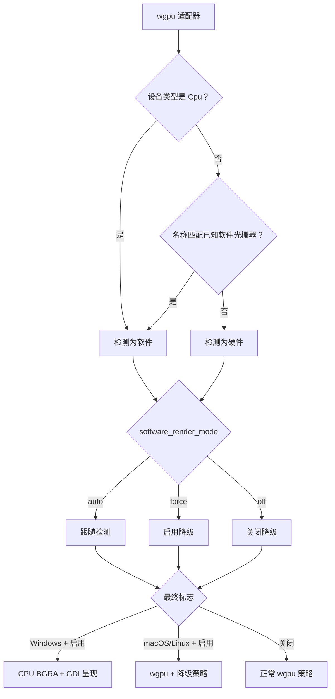

# 渲染模式

[English](Rendering-Modes)

SonicTerm 总会先创建 wgpu 适配器和设备，再决定使用正常 GPU 策略还是软件渲染降级。
Windows 上，降级还会把最终绘制切换为 CPU BGRA 帧，并通过 GDI 呈现。macOS 与 Linux
上的降级仍使用 wgpu 呈现，但采用更低开销的帧节奏和表面策略。

文字塑形、光栅化和图集所有权见[渲染与字体](Rendering-and-Fonts-zh-CN)。配置键见
[配置](Configuration-zh-CN)，主机端保留内存见[内存](Memory-zh-CN)。

### 适配器分类与选择

首个渲染器请求兼容表面的高性能适配器，`force_fallback_adapter = false`；wgpu 仍可能
返回 CPU 适配器。后续窗口通过 `GpuSharedContext` 复用其适配器/设备/队列，但各自拥有
表面和绘制状态。任何呈现器都不能绕过 wgpu 启动失败。

软件分类是只依赖 `wgpu::AdapterInfo` 的纯函数。`device_type == Cpu` 时返回 true；
否则把适配器名称转成小写，并检查是否包含：

```text
microsoft basic render driver
llvmpipe
swiftshader
software adapter
```

分类同时决定 wgpu 分配策略和渲染策略。软件适配器请求
`MemoryHints::MemoryUsage`，硬件适配器请求 `MemoryHints::Performance`。

`[appearance].software_render_mode` 决定是否降级：

| 取值 | 结果 |
| --- | --- |
| `auto` | 跟随适配器分类 |
| `force` | 在任何适配器上启用降级 |
| `off` | 在任何适配器上关闭降级 |

该设置可实时重载。每次都从显示器自身帧周期重新计算，因此从降级切换到 `off` 会恢复
显示器节奏，不会保留旧上限。Windows 上，`force` 还会把所有透明背景材质覆盖为
`opaque`，因为 GDI 呈现器无法合成 Mica、Acrylic 或 Tabbed 透明效果。平台启动时，
`auto` 不会改变配置的 `backdrop`。



### 正常 GPU 策略

硬件路径跟随显示器周期。无法取得刷新率或刷新率为零时，保留 60 Hz 默认值。表面呈现
优先选择后端支持的 `Mailbox`，否则使用 `Fifo`。不透明 backdrop 使用
`CompositeAlphaMode::Opaque`，透明 backdrop 使用
`CompositeAlphaMode::PreMultiplied`。期望最大帧延迟为 2。

SonicTerm 绘制到保留式离屏帧纹理。帧键覆盖可见窗格修订号、几何、选区、标签页、
浮层、悬停、内联媒体、字体/样式状态以及其它影响画面的输入。滚动条有效透明度在每个带身份的
窗格记录中量化保存；`Never`、没有回滚历史的窗格，以及不高于共享发射阈值
的透明度都映射为零。硬件路径收到有变化的帧请求时仍执行完整渲染器组装；帧键完全相同时
直接返回，不重建也不提交新帧。

私有生产 `FramePlan` 同时拥有该帧键、最终模式、损伤区域、窗格完整/内容裁剪、已解析视口行和
预期修订号。它接收不含网格或 GPU 对象的元数据；单元格塑形和图集修改仍由 `GpuRenderer`
负责。同一规划器驱动确定性测试和两个呈现器。窗格内边距可能使图像内容裁剪为空，即使现有
单元格布局仍保留一格的最小尺寸。

任何未成功呈现的表面获取路径都会清除缓存帧键。`Outdated` 和 `Suboptimal` 会重新配置
表面，`Lost` 会重新创建，校验错误则向上传递。重新配置前必须先释放
`SurfaceTexture`。因此下一帧不会把空白或已替换的交换链误认为已经绘制。

### Windows LCD 次像素策略

LCD 生效条件与混合公式见[渲染与字体](Rendering-and-Fonts-zh-CN)。

### 软件渲染降级

降级会把显示器周期替换为精确的 25,000 µs，约 40 fps。这是直接覆盖，不是
`max(monitor_period, 25 ms)`：即使显示器只有 30 Hz，也会解析为 25 ms。输入法组字期间
周期变为 83,333 µs，约 12 fps；组字结束立即恢复 25,000 µs。硬件路径不使用输入法上限。

| 路径 | 帧周期 |
| --- | --- |
| 硬件 | 显示器周期 |
| 降级软件 | 25,000 µs（约 40 fps） |
| 降级软件且输入法组字中 | 83,333 µs（约 12 fps） |

降级路径会把所有重绘（包括输入引起的重绘）合并到最终周期，因为每帧都需要昂贵的 CPU
工作。滚动条在活动后立即跳到可见，并只在 600 ms 空闲边界设置一次截止时间以跳到隐藏；
它不会形成淡出心跳。加速窗口仍保留 150 ms 淡入和 300 ms 淡出。wgpu 表面使用
`Fifo`、不透明合成和期望最大帧延迟 1。

隐藏预热渲染器池默认保留一个。配置为 `0` 表示关闭。硬件最多接受目标值 5；降级时
任何非零目标都会限制为 1。

### 锁争用重试

每个窗口将 `retry_not_before` 与上一帧时间戳分开保存。到期的解析器/图像收集失败时，
期限设为尝试时刻加有效帧周期，并作为普通帧节奏（包括降级输入法周期）的下限。更早的输入
或重绘事件既不能绕过它，也不能推迟它。到期再次失败才重新计时；成功收集完整帧后，会在
图集/表面重试策略之前清除该状态。关闭窗口时一并丢弃，不引入无条件重绘心跳或阻塞锁。

### Windows CPU 呈现

Windows 上启用降级时，`WindowsSoftwareFrame` 把同一套上游生成的矩形、文字字形、
彩色字形和内联图像实例合成到完整的预乘 BGRA 缓冲，再用 GDI
`SetDIBitsToDevice` 呈现到 HWND。软件路径总是呈现完整帧，不把保留式 GPU 损伤规则
再当作第二套软件呈现策略。

软件帧任一轴最多 16,384 像素，总量最多 160 MiB。创建或调整尺寸超过任一限制时会失败，
并保留原有有效分配。帧键命中时可直接再次呈现已有 CPU 帧，无需重新合成。

软件绘制使用 CPU 图集，GPU 镜像保持 1×1 占位符。返回 GPU 时重建完整纹理、重置
携带 UV 的缓存并强制完整重绘。像素转换和采样与 GPU 绘制一致，详见
[渲染与字体](Rendering-and-Fonts-zh-CN)。

### 保留像素与损伤区域

损伤区域与绘制顺序见[渲染与字体](Rendering-and-Fonts-zh-CN)。

### 诊断

启动日志会记录适配器后端、名称、设备类型和 `software_rendering=true|false`。最终启用
降级时，应用会记录：

```text
software-render degrade engaged
```

并附带 `detected`、`mode`、`frame_period` 字段。Windows 的面包屑渲染器身份会把
CPU/GDI 软件呈现与 wgpu 区分开。

若要查看各帧阶段耗时，把 `[logging].level` 设为 `"debug"`，读取 `render_timing` 日志目标。
内存快照与分配器状态的解释由[日志](Logging-zh-CN)和[内存](Memory-zh-CN)负责。

### 代码位置

| 主题 | 主要路径 |
| --- | --- |
| 适配器分类与表面策略 | `crates/sonicterm-gpu/src/core.rs` |
| 配置到降级决策 | `crates/sonicterm-app/src/app/{mod,event_loop,config_apply}.rs` |
| 帧节奏 | `crates/sonicterm-app/src/app/mod.rs` |
| 保留帧与损伤 | `crates/sonicterm-gpu/src/core.rs` |
| GPU 绘制 | `crates/sonicterm-gpu/src/wezterm_pipeline.rs` |
| 保留帧复制 | `crates/sonicterm-gpu/src/core.rs` |
| Windows CPU 帧 | `crates/sonicterm-gpu/src/software_windows.rs` |
| Windows backdrop 覆盖 | `crates/sonicterm-windows/src/{main,software_presenter}.rs` |
