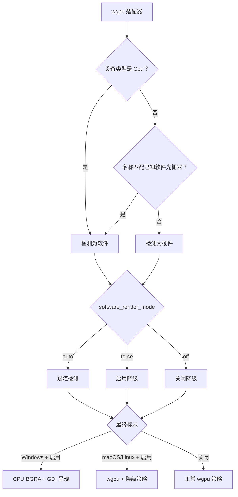

# 渲染模式

[English](Rendering-Modes)

SonicTerm 总会先创建 wgpu 适配器和设备，再决定使用正常 GPU 策略还是软件渲染降级。
Windows 上，降级还会把最终绘制切换为 CPU BGRA 帧，并通过 GDI 呈现。macOS 与 Linux
上的降级仍使用 wgpu 呈现，但采用更低开销的帧节奏和表面策略。

文字塑形、光栅化和图集所有权见[渲染与字体](Rendering-and-Fonts-zh-CN)。配置键见
[配置](Configuration-zh-CN)，主机端保留内存见[内存](Memory-zh-CN)。

### 适配器分类与选择

首个渲染器请求兼容表面的高性能适配器，`force_fallback_adapter = false`；wgpu 仍可能
返回 CPU 适配器。进程内所有后续窗口（新建窗口、预热池窗口和 tear-out 窗口）都通过
`GpuSharedContext` 复用其适配器/设备/队列，因此进程只持有一个设备。主窗口关闭而另一个
窗口仍打开时，主窗口只会隐藏并保留其渲染器，所以该设备保持存活。各窗口各自拥有表面和
绘制状态。任何呈现器都不能绕过 wgpu 启动失败。

软件分类是只依赖 `wgpu::AdapterInfo` 的纯函数。`device_type == Cpu` 时返回 true；
否则把适配器名称转成小写，并检查是否包含：

```text
microsoft basic render driver
llvmpipe
swiftshader
software adapter
```

分类同时决定 wgpu 分配策略和渲染策略。软件适配器请求
`MemoryHints::MemoryUsage`，硬件适配器请求 `MemoryHints::Performance`。

`[appearance].software_render_mode` 决定是否降级：

| 取值 | 结果 |
| --- | --- |
| `auto` | 跟随适配器分类 |
| `force` | 在任何适配器上启用降级 |
| `off` | 在任何适配器上关闭降级 |

该设置可实时重载。每次都从显示器自身帧周期重新计算，因此从降级切换到 `off` 会恢复
显示器节奏，不会保留旧上限。Windows 上，`force` 还会把所有透明背景材质覆盖为
`opaque`，因为 GDI 呈现器无法合成 Mica、Acrylic 或 Tabbed 透明效果。平台启动时，
`auto` 不会改变配置的 `backdrop`。



### 正常 GPU 策略

硬件路径跟随显示器周期。无法取得刷新率或刷新率为零时，保留 60 Hz 默认值。表面呈现
优先选择后端支持的 `Mailbox`，否则使用 `Fifo`。不透明 backdrop 使用
`CompositeAlphaMode::Opaque`，透明 backdrop 使用
`CompositeAlphaMode::PreMultiplied`。期望最大帧延迟为 2。

SonicTerm 绘制到保留式离屏帧纹理。帧键覆盖可见窗格修订号、几何、选区、标签页、
浮层、悬停、内联媒体、字体/样式状态以及其它影响画面的输入。滚动条有效透明度在每个带身份的
窗格记录中量化保存；`Never`、没有回滚历史的窗格，以及不高于共享发射阈值
的透明度都映射为零。硬件路径收到有变化的帧请求时仍执行完整渲染器组装；帧键完全相同时
直接返回，不重建也不提交新帧。

私有生产 `FramePlan` 同时拥有该帧键、最终模式、损伤区域、窗格完整/内容裁剪、已解析视口行和
预期修订号。它接收不含网格或 GPU 对象的元数据；单元格塑形和图集修改仍由 `GpuRenderer`
负责。同一规划器驱动确定性测试和两个呈现器。窗格内边距可能使图像内容裁剪为空，即使现有
单元格布局仍保留一格的最小尺寸。

任何未成功呈现的表面获取路径都会清除缓存帧键。`Outdated` 和 `Suboptimal` 会重新配置
表面，`Lost` 会重新创建并配置表面，之后的帧只有在设备仍接受工作时才会从中获取纹理；
`Validation` 结果会停止设备（见下文“已停止的 GPU 设备”）。重新配置前必须先释放
`SurfaceTexture`。因此下一帧不会把空白或已替换的交换链误认为已经绘制。

### Windows LCD 次像素策略

LCD 生效条件与混合公式见[渲染与字体](Rendering-and-Fonts-zh-CN)。

### 软件渲染降级

降级会把显示器周期替换为精确的 25,000 µs，约 40 fps。这是直接覆盖，不是
`max(monitor_period, 25 ms)`：即使显示器只有 30 Hz，也会解析为 25 ms。输入法组字期间
周期变为 83,333 µs，约 12 fps；组字结束立即恢复 25,000 µs。硬件路径不使用输入法上限。

| 路径 | 帧周期 |
| --- | --- |
| 硬件 | 显示器周期 |
| 降级软件 | 25,000 µs（约 40 fps） |
| 降级软件且输入法组字中 | 83,333 µs（约 12 fps） |

降级路径会把所有重绘（包括输入引起的重绘）合并到最终周期，因为每帧都需要昂贵的 CPU
工作。滚动条在活动后立即跳到可见，并只在 600 ms 空闲边界设置一次截止时间以跳到隐藏；
它不会形成淡出心跳。加速窗口仍保留 150 ms 淡入和 300 ms 淡出。wgpu 表面使用
`Fifo`、不透明合成和期望最大帧延迟 1。

隐藏预热渲染器池默认保留一个。配置为 `0` 表示关闭。硬件最多接受目标值 5；降级时
任何非零目标都会限制为 1。

### 按窗口归属的帧调度

窗口输入和输出原因不共用应用级脏标记。硬件上的纯输入只能为其存活的来源窗口绕过帧节奏；
同时有可见输出时仍合并到帧边界。每个窗口在创建/采用、移动和缩放事件时更新显示器周期。
精确的 25,000 µs 降级周期和 83,333 µs 输入法周期仍从全局降级策略解析，不维护每窗口策略副本。
按窗口归属的唤醒项目只服务到期窗口；维护既不唤醒无关窗口，也不吞掉同时到期的重绘。已有
原生帧请求在途时，只排除重复的 Frame 期限：通知和跳变式滚动条的到期期限仍保持启用，到期
只清理一次，并把重绘合并到已有请求。

StructuralInvalid 消费该次尝试捕获的原因并停放窗口。停放窗口不贡献帧、重试、节奏、光标、
滚动条、通知或徽章期限。只有 Topology、Input、Visibility 或 DeviceRecovered 原因可以解除
停放；工作线程 Output 仍运行命令维护，但不会解除停放。关闭中缺失布局时静默跳过。设备停止
报告先于停放检查和帧收集执行；一次性报告不需要解析器/媒体锁。清除设备停止抑制还要求已安装
渲染器可用、未标记销毁、且代次不同；单独的恢复原因不能作为证明。该调度适配器不重建设备；
下文的共享恢复协调器先安装替换设备，再由按窗口归属的适配器准入帧。

### 遮挡与表面可用性

macOS 和 X11 的原生 `Occluded` 事件按窗口处理，先于主窗口和子窗口的帧收集。被遮挡窗口
保留待处理输入/输出身份和网格脏状态，但不贡献帧、光标、滚动条或通知期限，也不收集
解析器/媒体状态。PTY 输出和命令维护继续运行。应用隐藏的主窗口和未采用的预热窗口仍是
独立状态。设备拒绝边界（包括仅 smoke 使用的证据和一次性错误报告）最先执行；抑制不改写
`last_render` 或争用重试下限。恢复可见的转换会清除渲染器保留帧键，标记一次 Visibility 原因，
并在设备可用时最多请求一次帧。重复可见事件不增加工作；可见性不能复活已停止的设备。

带类型的 `SurfaceRetry(Timeout)` 由应用在该窗口的下一个有效帧周期处理，保留脏状态而不进入
原生自重试循环。`SurfaceRetry(Occluded)` 抑制帧。Atlas、Outdated、Suboptimal 和 SurfaceLost
仍由呈现器拥有重试。公开的 `render -> Result` 适配器只为 Timeout 和 Occluded 恢复旧的原生
重试，不对其它原因重复请求。DeferStop 和 Stop 保持原有行为。

只有 macOS 上仅后端报告的遮挡会启用异常路径的一秒表面可用性探测。原生遮挡/可见事件取消
它；应用隐藏、结构停放或设备停止的窗口不贡献探测期限。该方法通过设备门禁准入 GPU 工作，
在获取纹理前拒绝非 Metal 适配器：固定版本的 Metal 能丢弃已获取纹理，而 Vulkan 的丢弃操作
为空实现。探测只获取并丢弃，不编码、上传、提交、呈现或确认脏行。成功会清除保留身份并安排
一次 Visibility 帧；Timeout 和 Occluded 在一秒后重试。Outdated/Suboptimal 重新配置，SurfaceLost
重新创建；只有再次确认设备门禁后才重新计时。次优纹理在 configure 前丢弃。门禁拒绝时停止
探测；表面重建错误会被记录，仅当设备仍可用、窗口仍为后端遮挡、未隐藏且未结构停放时，
才重新安排一秒后的探测。这不会组装帧或消耗脏状态。原生 acquire/configure 可能阻塞；
这是低频异常检查，不是非阻塞保证，也不是普通心跳。

`__occlude_next_surface_acquire` 是仅 macOS 的故障入口，无需切换 Space 即可到达真实的带类型
重试出口。假时钟窗口测试和源代码契约覆盖策略，但不能代替同一窗口的完整应用 CPU 测量，
也不能代替恢复后首帧完整呈现的原生证据。

### 锁争用重试

每个窗口将 `retry_not_before` 与上一帧时间戳分开保存。只有可见解析器/图像的 `try_lock`
失败才进入重试路径。两个窗口角色的帧收集器都不访问非活动标签页或缩放隐藏的存储，且先持有
可见解析器，再复制可见媒体；两类快照分开取得，并非原子快照。布局结构无效时跳过整次组装，
不设置该重试下限；关闭中且没有布局的标签页静默跳过。

到期的解析器/图像收集失败时，
期限设为尝试时刻加有效帧周期，并作为普通帧节奏（包括降级输入法周期）的下限。更早的输入
或重绘事件既不能绕过它，也不能推迟它。到期再次失败才重新计时；成功收集完整帧后，会在
图集/表面重试策略之前清除该状态。关闭窗口时一并丢弃，不引入无条件重绘心跳或阻塞锁。

### Windows CPU 呈现

Windows 上启用降级时，`WindowsSoftwareFrame` 把同一套上游生成的矩形、文字字形、
彩色字形和内联图像实例合成到完整的预乘 BGRA 缓冲，再用 GDI
`SetDIBitsToDevice` 呈现到 HWND。软件路径总是呈现完整帧，不把保留式 GPU 损伤规则
再当作第二套软件呈现策略。

软件帧任一轴最多 16,384 像素，总量最多 160 MiB。创建或调整尺寸超过任一限制时会失败，
并保留原有有效分配。帧键命中时可直接再次呈现已有 CPU 帧，无需重新合成。

软件绘制使用 CPU 图集，GPU 镜像保持 1×1 占位符。返回 GPU 时重建完整纹理、重置
携带 UV 的缓存并强制完整重绘。像素转换和采样与 GPU 绘制一致，详见
[渲染与字体](Rendering-and-Fonts-zh-CN)。

### 已停止的 GPU 设备

wgpu 的 Validation、OutOfMemory 或 Internal 错误，或者设备丢失，都会停止所有窗口的渲染，因为
这些窗口共享同一设备；隔离规则见[架构内部机制](Architecture-Internals-zh-CN)。
两种呈现器都遵守这一停止：wgpu
路径不提交也不呈现，Windows CPU 呈现器既不合成也不呈现帧，也不重新 blit 未变化的帧。窗口保持打开；最后呈现的像素是否
仍然可见，由操作系统和驱动决定。脏行保持未确认，shell、输入、会话和窗口生命周期照常工作。设备
停止期间修改软件渲染策略时，只记录新策略，不配置表面，也不重建 GPU 图集纹理。没有丢失记录的
`Unusable` 设备保持停止；已提交设备变为 `Lost` 后会开始共享上下文恢复。
[日志](Logging-zh-CN)中的 `sonic::gpu` 记录会写明使设备停止的操作和错误。

### 共享设备恢复

应用拥有一个已提交上下文和一个恢复协调器。设备丢失后，按启动时的特性协商和分配策略创建新的
实例、适配器、设备和队列。一个常驻工作线程请求适配器与设备，不阻塞事件循环；超时的工作线程
既不会被替换，也不会被 join。

每轮预算最多五次尝试，分别延迟 0、250 ms、1 s、4 s 和 16 s，每次请求期限为 10 s。如果较早的
请求仍在运行，到期的下一次尝试会消耗预算，但不会启动第二个工作线程。迟到结果会被丢弃，其
候选设备在事件循环线程上销毁。只有新代次首次确认呈现之后至少 30 s 才再次丢失，才会获得新预算；
单纯创建设备不算稳定证据。预算耗尽后渲染保持停止，PTY 继续存活。

事件循环先在候选设备上准备全部可见和预热渲染器，再在同一次回调中提交它们。即使尺寸相同，也会
重建表面、保留帧纹理、管线和图集上传对象。CPU 图集与携带 UV 的缓存会重置；字体、单元格度量、
终端状态和帧计数保留。恢复会重新读取当前软件渲染策略，但已有窗口保留其原生 backdrop。部分提交
失败时，在恢复事件分发前关闭并销毁候选设备。成功提交后退役旧设备，并用经过验证的替换快照
准入每个重新绑定的窗口。隐藏或原生遮挡的窗口保留脏状态而不请求帧；每个可渲染窗口合并一次
恢复帧请求。只有真正的 `Presented` 结果才能确认网格脏状态。

带代次标记的回调不会复活已退役设备，也不会为它们启动恢复。发起请求的窗口关闭后，请求所拥有的
在途表面仍然有效；结果返回时会重新检查仍存活的窗口。仅恢复用途的定时器不请求重绘。未返回的
结果每 100 ms 检查一次，预算耗尽后降为每 1 s 一次，仅用于在完成提示丢失时释放结果；空闲协调器
没有此类定时器。

请求期限只限定放弃尝试的决策时刻，不限定原生驱动析构或表面配置。正常结果在事件循环上释放。
应用退出后，分离工作线程的迟到结果只保证所有权安全并尽力释放，可能因原生主线程析构而阻塞；
退出不会等待该线程。启动时创建设备失败仍走原有启动路径，恢复不引入新的渲染后端。

### 保留像素与损伤区域

损伤区域与绘制顺序见[渲染与字体](Rendering-and-Fonts-zh-CN)。

### 诊断

启动日志会记录适配器后端、名称、设备类型和 `software_rendering=true|false`。最终启用
降级时，应用会记录：

```text
software-render degrade engaged
```

并附带 `detected`、`mode`、`frame_period` 字段。Windows 的面包屑渲染器身份会把
CPU/GDI 软件呈现与 wgpu 区分开。

若要查看各帧阶段耗时，把 `[logging].level` 设为 `"debug"`，读取 `render_timing` 日志目标。
内存快照与分配器状态的解释由[日志](Logging-zh-CN)和[内存](Memory-zh-CN)负责。

### 代码位置

| 主题 | 主要路径 |
| --- | --- |
| 适配器分类与表面策略 | `crates/sonicterm-gpu/src/core.rs` |
| 配置到降级决策 | `crates/sonicterm-app/src/app/{mod,event_loop,config_apply}.rs` |
| 帧节奏 | `crates/sonicterm-app/src/app/mod.rs` |
| 保留帧与损伤 | `crates/sonicterm-gpu/src/core.rs` |
| 设备错误隔离 | `crates/sonicterm-gpu/src/{device_errors,core,present}.rs` |
| 共享设备恢复 | `crates/sonicterm-app/src/app/{gpu_recovery,gpu_recovery_worker}.rs`、`crates/sonicterm-gpu/src/{recovery,recovery_context,rebind}.rs` |
| GPU 绘制 | `crates/sonicterm-gpu/src/wezterm_pipeline.rs` |
| 保留帧复制 | `crates/sonicterm-gpu/src/core.rs` |
| Windows CPU 帧 | `crates/sonicterm-gpu/src/software_windows.rs` |
| Windows backdrop 覆盖 | `crates/sonicterm-windows/src/{main,software_presenter}.rs` |
