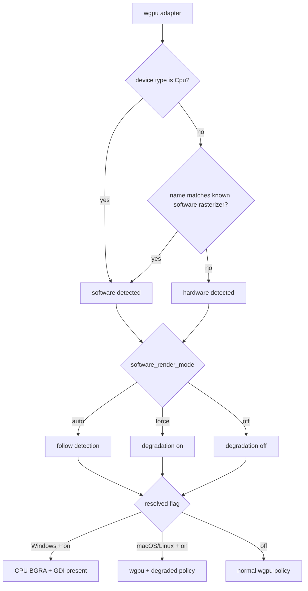

# Rendering Modes

[简体中文](Rendering-Modes-zh-CN)

SonicTerm always creates a wgpu adapter and device, then resolves whether to use
normal GPU policy or software-render degradation. On Windows, degradation also
switches final drawing to a CPU BGRA frame presented through GDI. On macOS and
Linux, degradation keeps wgpu presentation but applies the lower-cost pacing and
surface policy.

Text shaping, rasterization, and atlas ownership are described in
[Rendering and Fonts](Rendering-and-Fonts). Configuration keys are listed in
[Configuration](Configuration), and retained host memory is in [Memory](Memory).

### Adapter classification and selection

The first renderer requests a surface-compatible high-performance adapter with
`force_fallback_adapter = false`; wgpu may still return a CPU adapter. Every
later window in the process — New Window, warm-pool, and tear-out windows —
reuses its adapter/device/queue through `GpuSharedContext`, so the process holds
one device. Closing the main window while another window stays open hides it and
keeps its renderer, so that device stays live. Each window owns its surface and
rendering state; no presenter can bypass failed wgpu startup.

Software classification is a pure function over `wgpu::AdapterInfo`. It returns
true when `device_type == Cpu`, or when the lowercased adapter name contains one
of:

```text
microsoft basic render driver
llvmpipe
swiftshader
software adapter
```

The classification selects wgpu allocation policy as well as rendering policy.
Software adapters request `MemoryHints::MemoryUsage`; hardware adapters request
`MemoryHints::Performance`.

`[appearance].software_render_mode` resolves the degradation flag:

| Value | Result |
| --- | --- |
| `auto` | follow adapter classification |
| `force` | enable degradation on any adapter |
| `off` | disable degradation on any adapter |

The setting reloads live. Resolution always starts from the monitor’s own frame
period, so switching from degradation to `off` restores the monitor cadence
instead of retaining the previous cap. On Windows, `force` also overrides any
transparent backdrop with `opaque`, because the GDI presenter cannot composite
Mica, Acrylic, or Tabbed transparency. `auto` does not change the configured
backdrop at platform startup.



### Normal GPU policy

The hardware path follows the monitor period. A missing or zero monitor refresh
rate keeps the 60 Hz default. Surface presentation prefers `Mailbox` when the
backend offers it and otherwise uses `Fifo`. Opaque backdrops use
`CompositeAlphaMode::Opaque`; transparent backdrops use
`CompositeAlphaMode::PreMultiplied`. The desired maximum frame latency is 2.

SonicTerm renders into a retained offscreen frame texture. A frame key covers
visible pane revisions, geometry, selection, tabs, overlays, hover, inline
media, font/style state, and other image-affecting inputs. Effective scrollbar
opacity is quantized in each keyed pane record: `Never`, panes without
scrollback, and opacity at or below the shared emit floor all map to zero.
Hardware rendering still performs the full renderer assembly when a changed
frame is requested; unchanged frame keys return without rebuilding or
submitting a new frame.

The private production `FramePlan` owns that key together with final mode,
damage, pane full/content clips, resolved viewport rows, and expected revisions.
It receives metadata without grids or GPU objects; cell shaping and atlas
mutation remain in `GpuRenderer`. The same planner drives deterministic tests
and both presenters. Pane padding may leave an empty image-content clip even
though the existing cell layout retains its one-cell floor.

Surface-acquisition paths that do not successfully present clear the cached
frame key. `Outdated` and `Suboptimal` reconfigure the surface; `Lost` recreates
and configures it, and a later frame acquires from it only while the device
still accepts work; a `Validation` result stops the device (see Stopped GPU
device below). A `SurfaceTexture` is dropped before reconfiguration. The next
frame therefore cannot treat a blank or replaced swapchain as already rendered.

### Windows LCD subpixel policy

LCD eligibility and blending are documented in [Rendering and Fonts](Rendering-and-Fonts).

### Software-render degradation

Degradation replaces the monitor period with an exact 25,000 µs period, about
40 fps. This is an override, not `max(monitor_period, 25 ms)`: even a slower
30 Hz monitor resolves to 25 ms. While an IME composition is active, the period
is 83,333 µs, about 12 fps. Ending composition immediately restores 25,000 µs.
The hardware path ignores the IME cap.

| Path | Frame period |
| --- | --- |
| hardware | monitor period |
| degraded software | 25,000 µs (~40 fps) |
| degraded software with IME composition | 83,333 µs (~12 fps) |

On the degraded path, all redraws—including input redraws—are coalesced to the
resolved period because every frame is CPU-expensive. Scrollbar auto-hide snaps
immediately to visible after activity and uses one deadline at the 600 ms idle
boundary to snap hidden; it never creates a fade heartbeat. Accelerated windows
retain the 150 ms fade-in and 300 ms fade-out. The wgpu surface uses `Fifo`,
opaque compositing, and desired maximum frame latency 1.

The hidden warm-renderer pool defaults to one. A configured value of `0`
disables it. Hardware honors targets through 5; degradation caps every nonzero
target at 1.

### Owner-local frame scheduling

Window input and output causes never share an application-wide dirty latch.
Hardware pure input may bypass pacing only for its live source window; input with
visible output stays paced. Monitor periods are refreshed for each window on
creation/adoption and move/scale events. The exact 25,000 µs degraded and 83,333 µs
IME periods still come from global degradation policy, not a per-window copy.
Owner-addressed wake entries service only due windows; maintenance does not wake
unrelated windows or suppress a coincident repaint. A native frame request already
in flight suppresses only duplicate Frame deadlines: notification and snapped
scrollbar expiration remain armed, clear once when due, and coalesce their repaint
with that existing request.

StructuralInvalid consumes the captured attempt's causes and parks the window.
Parked windows contribute no frame, retry, pacing, cursor, scrollbar, notification,
or badge deadline. Only Topology, Input, Visibility, or DeviceRecovered causes
unpark; worker Output still runs command maintenance but does not unpark. A missing
closing layout is silent. Device-stop reporting precedes parking and collection;
no parser/media lock is needed to report the stop once. Clearing device-stop
suppression additionally requires the installed renderer to be usable, not marked
for destruction, and on a different generation; a recovery cause alone is not proof.
This scheduling adapter does not rebuild devices; the shared recovery coordinator
below installs the replacement before the owner-local adapter admits a frame.

### Occlusion and surface availability

Native `Occluded` events are handled per window on macOS and X11, before either
main or child collection. Occluded windows retain pending input/output identities
and grid dirt, but contribute no frame, cursor, scrollbar, or notification
deadlines and collect no parser/media state. PTY output and command maintenance
continue. App-hidden main windows and unadopted warm windows remain separate.
The device-refusal boundary, including smoke-only evidence and its one-time error
report, runs first; suppression changes neither `last_render` nor the contention
retry floor. A transition back to visible clears the retained renderer frame key,
marks one Visibility cause, and requests at most one frame on a usable device.
Duplicate visible events add nothing; visibility cannot revive a stopped device.

Typed `SurfaceRetry(Timeout)` belongs to the app at the owner's next effective
frame period, retaining dirt without a native self-retry loop. Typed
`SurfaceRetry(Occluded)` suppresses frames. Atlas, Outdated, Suboptimal, and
SurfaceLost retain their presenter retry ownership. The public `render -> Result`
adapter restores the legacy native retry only for Timeout and Occluded; it does
not double-request the other reasons. DeferStop and Stop keep their prior behavior.

Only backend-only occlusion on macOS arms an exceptional one-second surface
availability probe. Native occlusion/visibility events cancel it, and app-hidden,
parked, or stopped owners do not contribute it. The method admits GPU work through
the device gate and rejects non-Metal adapters before acquisition: pinned Metal
can discard an acquired texture, while Vulkan's discard is a no-op. It acquires
and drops without encoding, uploading, submitting, presenting, or acknowledging.
Success clears retained identity and schedules one Visibility frame; Timeout and
Occluded rearm after one second. Outdated/Suboptimal reconfigure, SurfaceLost
recreates, and all rearm only after rechecking the gate. A suboptimal texture is
dropped before configure. Refused gates stop probing. Surface-recreation errors
are logged and rearm the one-second probe only while the device remains usable
and the owner remains backend-occluded, visible, and unparked. They do not assemble
a frame or consume dirt. Native acquire/configure may block; this is a slow
exceptional check, not a nonblocking guarantee or normal heartbeat.

`__occlude_next_surface_acquire` is a macOS-only fault seam for the real typed
retry exit without a Space switch. Fake-clock owner tests and source contracts
cover the policy, but do not replace same-window full-app CPU measurements or
native proof of the first full presented frame.

### Lock-contention retry

Each window keeps `retry_not_before` separate from its last-frame timestamp.
Only a failed visible parser/image `try_lock` enters this path. Hidden-tab and
zoom-hidden stores are not visited by either role's frame collector. Both roles
hold visible parsers before copying visible media; these are separate, not atomic,
snapshots. Invalid topology skips the entire assembly without arming this floor,
and a closing tab with no layout skips silently.

A failed due parser/image collection sets that deadline to the attempt time plus
the effective frame period. The retry is a floor over normal pacing, including
degraded IME pacing. Earlier input or redraw events cannot bypass or postpone
it. A due failure rearms it; coherent collection clears it before atlas/surface
retry policy runs. Closing the window discards it. No unconditional redraw
heartbeat or blocking parser/image lock is introduced.

### Windows CPU presentation

When degradation is active on Windows, `WindowsSoftwareFrame` composes the same
producer-built quads, text glyphs, color glyphs, and inline-image instances into
a complete premultiplied BGRA buffer. It presents the full frame to the HWND with
GDI `SetDIBitsToDevice`; retained GPU damage is not used as a second software
presentation policy.

The software frame is limited to 16,384 pixels on either axis and 160 MiB total.
Construction or resize beyond either limit fails without replacing the existing
valid allocation. A frame-key hit can re-present the existing CPU frame without
recomposing it.

CPU atlases supply software drawing; GPU mirrors remain 1×1 placeholders.
Returning to GPU rebuilds full textures, resets UV-bearing caches, and forces
a full redraw. Pixel conversion and sampling are shared with GPU drawing and
are specified in [Rendering and Fonts](Rendering-and-Fonts).

### Stopped GPU device

A Validation, OutOfMemory, or Internal wgpu error, or a device loss, stops
rendering in every window, because the windows share one device; the
containment rules are in
[Architecture Internals](Architecture-Internals). Both presenters obey the stop:
the wgpu path submits and presents nothing, and the Windows CPU presenter
neither composes nor presents a frame, nor reblits an unchanged one. The windows stay open, and whether their
last presented pixels stay visible is up to the OS and driver. Dirty rows stay
unacknowledged, while shells, input, sessions, and window lifecycle keep
working. A software-render policy change made while the device is stopped is
recorded without configuring the surface or rebuilding GPU atlas textures.
An `Unusable` device without a recorded loss remains stopped. A `Lost` committed
device starts shared-context recovery; the `sonic::gpu` records on
[Logging](Logging) name the operation and error that stopped it.

### Shared-device recovery

The application owns one committed context and one recovery coordinator. A loss
creates a new instance, adapter, device, and queue using startup's feature and
allocation policy. One persistent worker requests the adapter/device without
blocking the event loop; a timed-out worker is never replaced or joined.

There are at most five attempts per budget. Their delays are 0, 250 ms, 1 s,
4 s, and 16 s, with a 10 s request deadline. An attempt due while an older
request still runs consumes its budget without starting another worker. A late
result is discarded and its candidate destroyed on the event-loop thread. A
new generation starts a fresh budget only if a later loss occurs at least 30 s
after its first acknowledged presentation; merely creating a device is not
stability evidence. Exhaustion leaves rendering stopped and keeps PTYs alive.

The event loop first prepares every live and warm renderer on the candidate,
then commits all of them in one callback. Surfaces, retained frame textures,
pipelines and atlas uploads are rebuilt, even when dimensions match. CPU
atlases and UV-bearing caches reset; fonts, cell metrics, terminal state and
frame counters remain. The current software-render policy is re-read, while
existing windows keep their native backdrop. A partial commit closes and
destroys the candidate before event dispatch resumes. A successful commit
retires the old device and admits each rebound owner through its validated
replacement snapshot. Hidden or natively occluded owners retain dirt without a
frame request; each renderable owner coalesces one recovery frame. Grid dirt is
acknowledged only after a real `Presented` outcome.

Generation-tagged callbacks cannot revive retired devices or start recovery
for them. A closed requesting window does not invalidate its owned in-flight
surface, and surviving windows are re-evaluated when the result arrives.
Recovery-only timers do not request redraws. Pending results are checked at
100 ms intervals, reduced to 1 s after exhaustion, solely to dispose them if a
completion hint was missed; an idle coordinator has no such timer.

The request deadline bounds the decision to abandon an attempt, not native
driver destruction or surface configuration. Normal result disposal runs on
the event loop. After application shutdown, a detached worker's late result
has ownership-safe best-effort disposal, which may block on native main-thread
destruction; shutdown never waits for that worker. Startup device failure still
follows the ordinary startup path, and recovery adds no new renderer backend.

### Retained pixels and damage

Damage and draw order are documented in [Rendering and Fonts](Rendering-and-Fonts).

### Diagnostics

Startup logs the adapter backend, name, device type, and
`software_rendering=true|false`. When degradation resolves on, the app logs:

```text
software-render degrade engaged
```

with `detected`, `mode`, and `frame_period` fields. On Windows, breadcrumb
renderer identity distinguishes CPU/GDI software presentation from wgpu.

For frame phase timing, set `[logging].level = "debug"` and read the
`render_timing` target. Memory snapshots and allocator-state interpretation are
owned by [Logging](Logging) and [Memory](Memory).

### Code locations

| Topic | Primary paths |
| --- | --- |
| Adapter classification and surface policy | `crates/sonicterm-gpu/src/core.rs` |
| Config-to-degradation decision | `crates/sonicterm-app/src/app/{mod,event_loop,config_apply}.rs` |
| Frame pacing | `crates/sonicterm-app/src/app/mod.rs` |
| Retained frame and damage | `crates/sonicterm-gpu/src/core.rs` |
| Device error containment | `crates/sonicterm-gpu/src/{device_errors,core,present}.rs` |
| Shared-device recovery | `crates/sonicterm-app/src/app/{gpu_recovery,gpu_recovery_worker}.rs`, `crates/sonicterm-gpu/src/{recovery,recovery_context,rebind}.rs` |
| GPU draw | `crates/sonicterm-gpu/src/wezterm_pipeline.rs` |
| Retained-frame blit | `crates/sonicterm-gpu/src/core.rs` |
| Windows CPU frame | `crates/sonicterm-gpu/src/software_windows.rs` |
| Windows backdrop override | `crates/sonicterm-windows/src/{main,software_presenter}.rs` |
