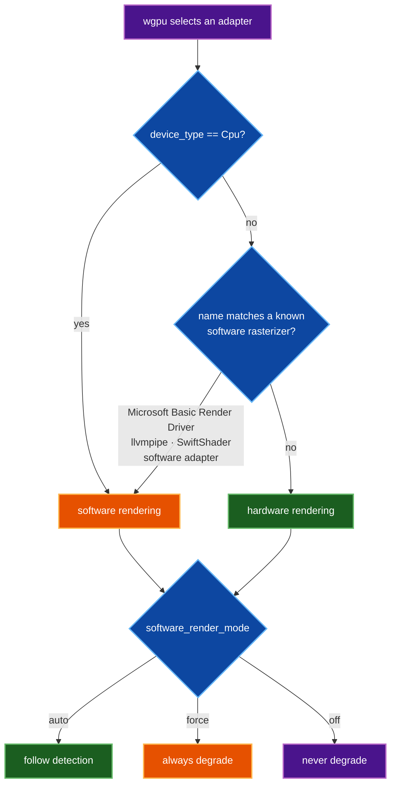
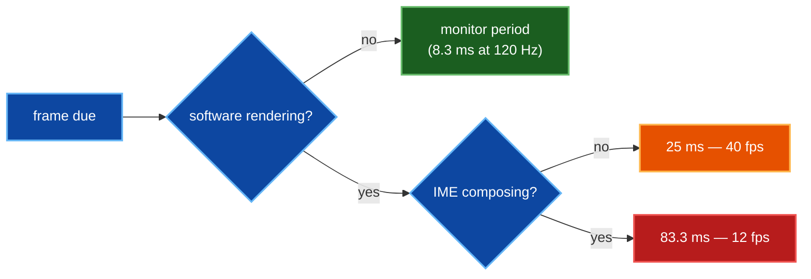
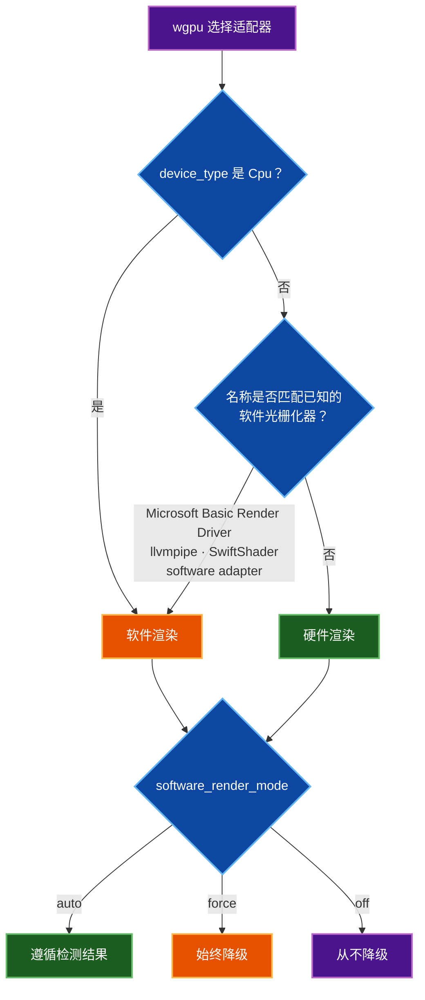
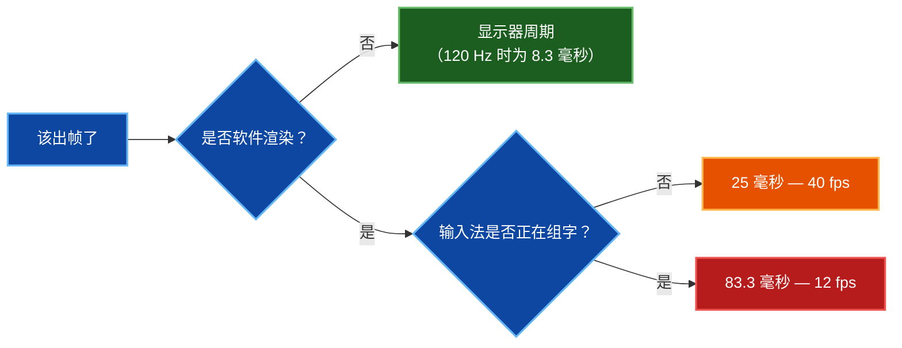

# Rendering Modes / 渲染模式

SonicTerm draws either on the GPU or on the CPU, and the two paths are paced
differently. This page explains how the choice is made, what changes when it
lands on the CPU path, and how to override the decision.

SonicTerm 既可以在 GPU 上绘制，也可以在 CPU 上绘制，两条路径的帧节奏并不相同。
本页说明这个选择是如何做出的、落到 CPU 路径后会发生什么变化，以及如何覆盖该决定。

Related: [Rendering and Fonts](Rendering-and-Fonts) · [Configuration](Configuration) · [Logging](Logging) · [Architecture Internals](Architecture-Internals)

## English

### Why there are two paths

A GPU rasterizes a frame in parallel, at effectively no cost to the CPU. A
software rasterizer draws every pixel on the CPU, competing with the parser,
the PTY pump, and the shell itself for the same cores.

Running the software path at a 120 Hz monitor's cadence would spend the
machine's CPU redrawing a terminal that mostly has not changed. SonicTerm
detects that case and slows the frame cadence rather than letting rendering
crowd out the work the terminal exists to do.

### How the path is chosen

Detection is a pure function of the adapter wgpu hands back — an adapter whose
device type is CPU, or whose name matches a known software rasterizer:



Detection is deliberately a pure function over the adapter's name and device
type, so it is unit-testable without a live GPU.

### What changes on the software path

Only the frame cadence and the per-frame fade animation. Output, scrollback,
fonts, and colour are identical — a session on the software path shows the same
pixels, just refreshed less often.



The hardware path is never capped — it follows the monitor. A faster monitor is
clamped to the software cap only when the software path is active.

### The IME drop

While an input method is composing, the cadence drops further, to ~12 fps. The
composition popup is drawn by the platform IME, not by SonicTerm, so a slower
terminal repaint costs the typist little while freeing CPU for the IME itself.

The cadence must recover once composition commits. A cap that engages and never
releases would leave the session at 12 fps indefinitely — the behaviour worth
checking after any change to this path, and one that never appears on macOS
because the degrade path does not run there.

### Latency

| path | frame period | worst-case wait for a keystroke |
| --- | --- | --- |
| hardware, 60 Hz | 16.7 ms | 16.7 ms |
| hardware, 120 Hz | 8.3 ms | 8.3 ms |
| software | 25 ms | 25 ms |
| software, composing | 83.3 ms | ~83 ms |

A keystroke arriving just after a frame waits one full period before it is
drawn. That is the quantity to judge when deciding whether the software cap is
set correctly.

### Overriding the decision

```toml
[appearance]
software_render_mode = "auto"   # auto | force | off
```

| value | behaviour | when to use |
| --- | --- | --- |
| `auto` | degrade when a software rasterizer is detected | the default; correct on real hardware and in VMs alike |
| `force` | always degrade, whatever the adapter reports | remote sessions that report a GPU but rasterize on the CPU |
| `off` | never degrade, whatever the adapter reports | a software adapter you know is fast enough, or when measuring the uncapped path |

`force` is the useful one over RDP and in VDI, where the adapter can look like a
GPU while every frame is drawn on the CPU.

### Confirming which path a session took

The adapter decision is logged at startup:

```
wgpu adapter selected backend=Dx12 name=Microsoft Basic Render Driver
  device_type=Cpu software_rendering=true
WARN No hardware GPU — wgpu fell back to a software rasterizer (CPU).
  Rendering will be degraded to stay responsive (lower frame cap, no fade
  animation). Common cause: RDP / VM without GPU passthrough.
```

`software_rendering=true` is the field to read. The warning names the usual
cause, because a machine that should have a GPU and reports `device_type=Cpu`
usually has a driver or passthrough problem rather than a SonicTerm problem.

## 中文

### 为什么存在两条路径

GPU 会并行光栅化一帧，对 CPU 而言几乎没有开销。而软件光栅化器会在 CPU 上绘制每一个像素，
与解析器、PTY 泵以及 shell 本身争抢同样的核心。

若让软件路径按 120 Hz 显示器的节奏运行，机器的 CPU 将耗费在重绘一个大部分并未变化的终端上。
SonicTerm 会检测这种情况并降低帧节奏，而不是让渲染挤占终端本该完成的工作。

### 路径是如何选择的

检测是对 wgpu 返回的适配器所做的纯函数判断——设备类型为 CPU 的适配器，
或名称匹配已知软件光栅化器的适配器：



检测被刻意写成仅依赖适配器名称与设备类型的纯函数，因此无需真实 GPU 即可进行单元测试。

### 软件路径上会有什么变化

只有帧节奏和逐帧淡入淡出动画会变。输出、回滚、字体与颜色完全一致——
软件路径上的会话显示的是相同的像素，只是刷新得没那么频繁。



硬件路径永远不会被限帧——它跟随显示器。只有在软件路径处于活动状态时，
更快的显示器周期才会被钳制到软件上限。

### 输入法降频

当输入法正在组字时，节奏会进一步降至约 12 fps。组字候选框由平台输入法绘制，
而非由 SonicTerm 绘制，因此放慢终端重绘对打字者影响很小，却能为输入法本身腾出 CPU。

组字提交后，节奏必须恢复。一个只降不升的限制会让会话无限期停留在 12 fps——
这是修改该路径后最值得检查的行为，而且它在 macOS 上永远不会出现，因为降级路径在那里根本不运行。

### 延迟

| 路径 | 帧周期 | 按键的最坏等待时间 |
| --- | --- | --- |
| 硬件，60 Hz | 16.7 毫秒 | 16.7 毫秒 |
| 硬件，120 Hz | 8.3 毫秒 | 8.3 毫秒 |
| 软件 | 25 毫秒 | 25 毫秒 |
| 软件，组字中 | 83.3 毫秒 | 约 83 毫秒 |

刚好在一帧之后到达的按键，需要等待一个完整周期才会被绘制。
这正是判断软件上限设置是否合适时需要衡量的量。

### 覆盖该决定

```toml
[appearance]
software_render_mode = "auto"   # auto | force | off
```

| 取值 | 行为 | 适用场景 |
| --- | --- | --- |
| `auto` | 检测到软件光栅化器时降级 | 默认值；在真实硬件与虚拟机上都正确 |
| `force` | 无论适配器如何报告，始终降级 | 报告有 GPU 但实际由 CPU 光栅化的远程会话 |
| `off` | 无论适配器如何报告，从不降级 | 你确知足够快的软件适配器，或需要测量不限帧的路径时 |

`force` 在 RDP 与 VDI 场景下尤其有用——那里的适配器看起来像 GPU，
但每一帧其实都在 CPU 上绘制。

### 确认会话走了哪条路径

适配器决策会在启动时记录：

```
wgpu adapter selected backend=Dx12 name=Microsoft Basic Render Driver
  device_type=Cpu software_rendering=true
WARN No hardware GPU — wgpu fell back to a software rasterizer (CPU).
  Rendering will be degraded to stay responsive (lower frame cap, no fade
  animation). Common cause: RDP / VM without GPU passthrough.
```

需要查看的字段是 `software_rendering=true`。该警告指出了常见原因，
因为一台本应有 GPU 却报告 `device_type=Cpu` 的机器，
通常是驱动或显卡直通的问题，而不是 SonicTerm 的问题。
