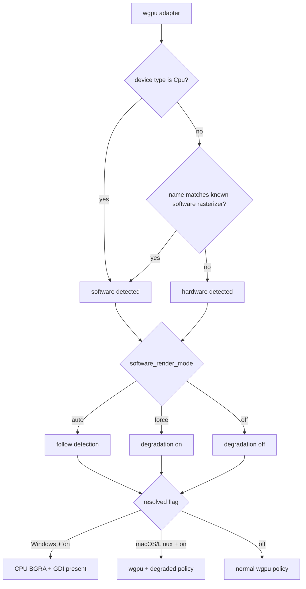
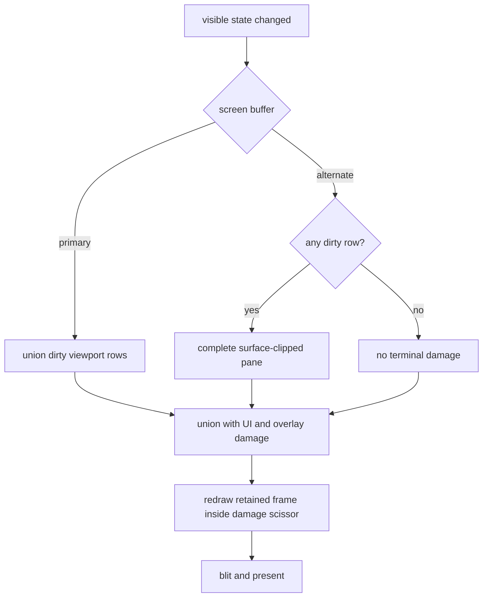
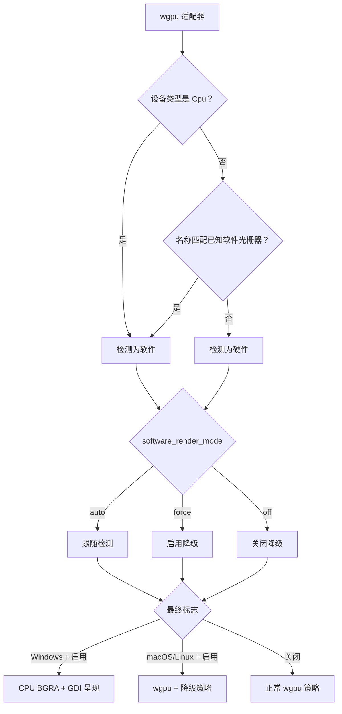
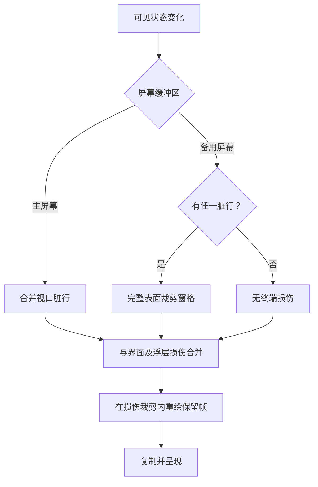

# Rendering Modes / 渲染模式

## English

SonicTerm always creates a wgpu adapter and device, then resolves whether to use
normal GPU policy or software-render degradation. On Windows, degradation also
switches final drawing to a CPU BGRA frame presented through GDI. On macOS and
Linux, degradation keeps wgpu presentation but applies the lower-cost pacing and
surface policy.

Text shaping, rasterization, and atlas ownership are described in
[Rendering and Fonts](Rendering-and-Fonts). Configuration keys are listed in
[Configuration](Configuration), and retained host memory is in [Memory](Memory).

### Adapter classification and selection

Software classification is a pure function over `wgpu::AdapterInfo`. It returns
true when `device_type == Cpu`, or when the lowercased adapter name contains one
of:

```text
microsoft basic render driver
llvmpipe
swiftshader
software adapter
```

The classification selects wgpu allocation policy as well as rendering policy.
Software adapters request `MemoryHints::MemoryUsage`; hardware adapters request
`MemoryHints::Performance`.

`[appearance].software_render_mode` resolves the degradation flag:

| Value | Result |
| --- | --- |
| `auto` | follow adapter classification |
| `force` | enable degradation on any adapter |
| `off` | disable degradation on any adapter |

The setting reloads live. Resolution always starts from the monitor’s own frame
period, so switching from degradation to `off` restores the monitor cadence
instead of retaining the previous cap. On Windows, `force` also overrides any
transparent backdrop with `opaque`, because the GDI presenter cannot composite
Mica, Acrylic, or Tabbed transparency. `auto` does not change the configured
backdrop at platform startup.



### Normal GPU policy

The hardware path follows the monitor period. A missing or zero monitor refresh
rate keeps the 60 Hz default. Surface presentation prefers `Mailbox` when the
backend offers it and otherwise uses `Fifo`. Opaque backdrops use
`CompositeAlphaMode::Opaque`; transparent backdrops use
`CompositeAlphaMode::PreMultiplied`. The desired maximum frame latency is 2.

SonicTerm renders into a retained offscreen frame texture. A frame key covers
visible pane revisions, geometry, selection, tabs, overlays, hover, inline
media, font/style state, and other image-affecting inputs. Effective scrollbar
opacity is stored as sorted `(pane id, u16 alpha)` pairs: `Never`, panes without
scrollback, and opacity at or below the shared emit floor all map to zero.
Hardware rendering still performs the full renderer assembly when a changed
frame is requested; unchanged frame keys return without rebuilding or
submitting a new frame.

Surface-acquisition paths that do not successfully present clear the cached
frame key. `Outdated` and `Suboptimal` reconfigure the surface; `Lost` recreates
it; validation errors propagate. A `SurfaceTexture` is dropped before
reconfiguration. The next frame therefore cannot treat a blank or replaced
swapchain as already rendered.

### Software-render degradation

Degradation replaces the monitor period with an exact 25,000 µs period, about
40 fps. This is an override, not `max(monitor_period, 25 ms)`: even a slower
30 Hz monitor resolves to 25 ms. While an IME composition is active, the period
is 83,333 µs, about 12 fps. Ending composition immediately restores 25,000 µs.
The hardware path ignores the IME cap.

| Path | Frame period |
| --- | --- |
| hardware | monitor period |
| degraded software | 25,000 µs (~40 fps) |
| degraded software with IME composition | 83,333 µs (~12 fps) |

On the degraded path, all redraws—including input redraws—are coalesced to the
resolved period because every frame is CPU-expensive. Scrollbar auto-hide snaps
immediately to visible after activity and uses one deadline at the 600 ms idle
boundary to snap hidden; it never creates a fade heartbeat. Accelerated windows
retain the 150 ms fade-in and 300 ms fade-out. The wgpu surface uses `Fifo`,
opaque compositing, and desired maximum frame latency 1.

The hidden warm-renderer pool defaults to one. A configured value of `0`
disables it. Hardware honors targets through 5; degradation caps every nonzero
target at 1.

### Windows CPU presentation

When degradation is active on Windows, `WindowsSoftwareFrame` composes the same
producer-built quads, text glyphs, color glyphs, and inline-image instances into
a complete premultiplied BGRA buffer. It presents the full frame to the HWND with
GDI `SetDIBitsToDevice`; retained GPU damage is not used as a second software
presentation policy.

The software frame is limited to 16,384 pixels on either axis and 160 MiB total.
Construction or resize beyond either limit fails without replacing the existing
valid allocation. A frame-key hit can re-present the existing CPU frame without
recomposing it.

The CPU glyph and image atlases remain the source sampled by software drawing.
Inline-image CPU pixels stay premultiplied sRGB-encoded BGRA8 and are not changed
by GPU synchronization, so the Windows software output remains byte-compatible.
Their GPU mirrors are 1×1 placeholders while the GDI presenter is active.
Returning to GPU presentation rebuilds full-size GPU atlas textures, resets
atlas metadata and UV-bearing caches, and forces a full redraw.

Every sharp, rounded, and line `QuadInstance` carries finite premultiplied
linear RGBA: alpha stays in `[0,1]`, each RGB channel stays between zero and
alpha, and changing opacity or antialias/mask coverage scales RGB and alpha
together. Hex-authored colors decode sRGB before premultiplication. The sRGB
target performs the final encoding. The CPU compositor decodes retained sRGB
destination channels, applies the same source-over in linear light, encodes RGB
once, and source-overs alpha as linear UNORM. Color-glyph and inline-image
samples retain their separate encoded-atlas path.

Text glyphs use one stabilized destination-pixel origin regardless of whether
an atlas tile is sampled one-to-one or resampled on either axis. Source sampling
remains nearest and clamped to the glyph's own tile; clipping at the top or left
advances past the hidden source rows or columns. Dirty metadata keeps monochrome
and subpixel coverage as unchanged linear masks while converting only color-glyph
rectangles. One glyph bind group exposes the texture's unorm coverage view and
sRGB color view with nearest samplers; ordinary and subpixel-tagged instances use
coverage, while `flags.x` selects color. Scaled inline images retain fractional
positioning and bilinear sampling over unchanged encoded CPU pixels. Their
separate group uses an sRGB view and linear sampler; upload conversion produces
premultiplied linear samples after decode, and bilinear taps clamp to the current
packed image tile rather than the whole atlas.

### Retained pixels and damage

Damage is a correctness boundary, not only an optimization. Every VT/grid
mutation must mark the affected rows in the same update.



A primary-screen pane can repaint the union of dirty viewport rows. Row bounds
use floor/ceil rules at fractional DPI so adjacent rows leave no seam, then
expand vertically by one native font-cell height so glyph bearings, positioned
marks, and compressed line spacing cannot leave ink outside the retained-frame
scissor. The expansion remains pane- and surface-clipped. If an alternate-screen
pane has any dirty row, the complete surface-clipped pane is damaged. This covers
TUI scrolling, insert/delete line, reverse index, erase, and other fixed-position
updates where a narrow row set can otherwise leave stale pixels.

The offscreen frame is cleared on first use and loaded on retained frames. The
GPU draw order is:

```text
base quads -> inline images -> base glyphs -> overlay quads -> overlay glyphs
```

A scissor limits redraw to the damage rectangle. The renderer’s
`wgpu::util::TextureBlitter` copies the retained frame to the swapchain before
submit and present. The surface format is fixed to
`TextureFormat::Bgra8UnormSrgb`; colors are converted to linear values before
shader use so the sRGB target performs the only gamma encoding.

### Diagnostics

Startup logs the adapter backend, name, device type, and
`software_rendering=true|false`. When degradation resolves on, the app logs:

```text
software-render degrade engaged
```

with `detected`, `mode`, and `frame_period` fields. On Windows, breadcrumb
renderer identity distinguishes CPU/GDI software presentation from wgpu.

For frame phase timing, set `[logging].level = "debug"` and read the
`render_timing` target. Memory snapshots and allocator-state interpretation are
owned by [Logging](Logging) and [Memory](Memory).

### Code locations

| Topic | Primary paths |
| --- | --- |
| Adapter classification and surface policy | `crates/sonicterm-gpu/src/core.rs` |
| Config-to-degradation decision | `crates/sonicterm-app/src/app/{mod,event_loop,config_apply}.rs` |
| Frame pacing | `crates/sonicterm-app/src/app/mod.rs` |
| Retained frame and damage | `crates/sonicterm-gpu/src/core.rs` |
| GPU draw | `crates/sonicterm-gpu/src/wezterm_pipeline.rs` |
| Retained-frame blit | `crates/sonicterm-gpu/src/core.rs` |
| Windows CPU frame | `crates/sonicterm-gpu/src/software_windows.rs` |
| Windows backdrop override | `crates/sonicterm-windows/src/{main,software_presenter}.rs` |

## 中文

SonicTerm 总会先创建 wgpu 适配器和设备，再决定使用正常 GPU 策略还是软件渲染降级。
Windows 上，降级还会把最终绘制切换为 CPU BGRA 帧，并通过 GDI 呈现。macOS 与 Linux
上的降级仍使用 wgpu 呈现，但采用更低开销的帧节奏和表面策略。

文字塑形、光栅化和图集所有权见[渲染与字体](Rendering-and-Fonts)。配置键见
[配置](Configuration)，主机端保留内存见[内存](Memory)。

### 适配器分类与选择

软件分类是只依赖 `wgpu::AdapterInfo` 的纯函数。`device_type == Cpu` 时返回 true；
否则把适配器名称转成小写，并检查是否包含：

```text
microsoft basic render driver
llvmpipe
swiftshader
software adapter
```

分类同时决定 wgpu 分配策略和渲染策略。软件适配器请求
`MemoryHints::MemoryUsage`，硬件适配器请求 `MemoryHints::Performance`。

`[appearance].software_render_mode` 决定是否降级：

| 取值 | 结果 |
| --- | --- |
| `auto` | 跟随适配器分类 |
| `force` | 在任何适配器上启用降级 |
| `off` | 在任何适配器上关闭降级 |

该设置可实时重载。每次都从显示器自身帧周期重新计算，因此从降级切换到 `off` 会恢复
显示器节奏，不会保留旧上限。Windows 上，`force` 还会把所有透明背景材质覆盖为
`opaque`，因为 GDI 呈现器无法合成 Mica、Acrylic 或 Tabbed 透明效果。平台启动时，
`auto` 不会改变配置的 `backdrop`。



### 正常 GPU 策略

硬件路径跟随显示器周期。无法取得刷新率或刷新率为零时，保留 60 Hz 默认值。表面呈现
优先选择后端支持的 `Mailbox`，否则使用 `Fifo`。不透明 backdrop 使用
`CompositeAlphaMode::Opaque`，透明 backdrop 使用
`CompositeAlphaMode::PreMultiplied`。期望最大帧延迟为 2。

SonicTerm 绘制到保留式离屏帧纹理。帧键覆盖可见窗格修订号、几何、选区、标签页、
浮层、悬停、内联媒体、字体/样式状态以及其它影响画面的输入。滚动条有效透明度保存为按窗格
编号排序的 `(pane id, u16 alpha)`；`Never`、没有回滚历史的窗格，以及不高于共享发射阈值
的透明度都映射为零。硬件路径收到有变化的帧请求时仍执行完整渲染器组装；帧键完全相同时
直接返回，不重建也不提交新帧。

任何未成功呈现的表面获取路径都会清除缓存帧键。`Outdated` 和 `Suboptimal` 会重新配置
表面，`Lost` 会重新创建，校验错误则向上传递。重新配置前必须先释放
`SurfaceTexture`。因此下一帧不会把空白或已替换的交换链误认为已经绘制。

### 软件渲染降级

降级会把显示器周期替换为精确的 25,000 µs，约 40 fps。这是直接覆盖，不是
`max(monitor_period, 25 ms)`：即使显示器只有 30 Hz，也会解析为 25 ms。输入法组字期间
周期变为 83,333 µs，约 12 fps；组字结束立即恢复 25,000 µs。硬件路径不使用输入法上限。

| 路径 | 帧周期 |
| --- | --- |
| 硬件 | 显示器周期 |
| 降级软件 | 25,000 µs（约 40 fps） |
| 降级软件且输入法组字中 | 83,333 µs（约 12 fps） |

降级路径会把所有重绘（包括输入引起的重绘）合并到最终周期，因为每帧都需要昂贵的 CPU
工作。滚动条在活动后立即跳到可见，并只在 600 ms 空闲边界设置一次截止时间以跳到隐藏；
它不会形成淡出心跳。加速窗口仍保留 150 ms 淡入和 300 ms 淡出。wgpu 表面使用
`Fifo`、不透明合成和期望最大帧延迟 1。

隐藏预热渲染器池默认保留一个。配置为 `0` 表示关闭。硬件最多接受目标值 5；降级时
任何非零目标都会限制为 1。

### Windows CPU 呈现

Windows 上启用降级时，`WindowsSoftwareFrame` 把同一套上游生成的矩形、文字字形、
彩色字形和内联图像实例合成到完整的预乘 BGRA 缓冲，再用 GDI
`SetDIBitsToDevice` 呈现到 HWND。软件路径总是呈现完整帧，不把保留式 GPU 损伤规则
再当作第二套软件呈现策略。

软件帧任一轴最多 16,384 像素，总量最多 160 MiB。创建或调整尺寸超过任一限制时会失败，
并保留原有有效分配。帧键命中时可直接再次呈现已有 CPU 帧，无需重新合成。

软件绘制仍从 CPU 字形图集和图像图集取样。内联图像 CPU 像素保持为预乘、sRGB 编码的
BGRA8，GPU 同步不会修改它们，因此 Windows 软件输出保持字节兼容。GDI 呈现启用时，
它们的 GPU 镜像是 1×1 占位符。回到 GPU 呈现时会重建全尺寸 GPU 图集纹理、重置图集
元数据与携带 UV 的缓存，并强制完整重绘。

每个锐角、圆角和线段 `QuadInstance` 都携带有限值的预乘线性 RGBA：alpha 位于
`[0,1]`，每个 RGB 通道都介于零和 alpha 之间；改变不透明度或抗锯齿/mask 覆盖率时，
必须同时缩放 RGB 与 alpha。由十六进制生成的颜色先解码 sRGB，再做预乘；最终 sRGB 编码
由目标纹理完成。CPU 合成器会解码保留帧中的 sRGB 目标通道，在相同的线性光空间执行
source-over，只对 RGB 编码一次，并把 alpha 作为线性 UNORM 做 source-over。彩色字形和
内联图像取样仍走各自独立的编码图集路径。

文字字形无论图集图块是按一比一取样，还是任一轴需要重采样，都使用同一套稳定后的目标
像素原点。源图块仍采用最近点取样并限制在字形自身矩形内；顶部或左侧被裁剪时，会跳过
不可见的源行或源列。脏元数据让单色与次像素覆盖率保持不变，继续作为线性掩码，只转换
彩色字形矩形。一个字形 bind group 通过最近点 sampler 同时提供纹理的 unorm 覆盖率 view
和 sRGB 彩色 view；普通及带次像素标记的实例使用覆盖率，`flags.x` 选择彩色。缩放后的
内联图像继续对未改变的编码 CPU 像素保留分数位置和双线性取样。其独立 group 使用 sRGB
view 与线性 sampler；上传转换让样本解码后成为预乘线性颜色，双线性采样点限制在当前
已打包图像的图块内，而不是整个图集。

### 保留像素与损伤区域

损伤区域是正确性边界，不只是性能优化。每次 VT/网格修改都必须在同一轮更新中标记受
影响的行。



主屏幕窗格可以只重绘视口脏行的并集。分数 DPI 下的行边界使用 floor/ceil，避免相邻行
之间出现缝隙；随后在垂直方向各扩展一个原生字体单元高度，使字形 bearing、定位标记和
压缩行距不会把墨迹留在保留帧裁剪范围之外。扩展后的区域仍限制在 pane 和表面边界内。
备用屏幕窗格只要有一行标脏，就损伤完整的表面裁剪窗格。这覆盖 TUI 滚动、插入/删除行、
反向索引、擦除等固定位置更新，避免窄行集合留下旧像素。

离屏帧第一次使用时清除，保留帧中继续加载。GPU 绘制顺序为：

```text
基础矩形 -> 内联图像 -> 基础字形 -> 浮层矩形 -> 浮层字形
```

裁剪矩形把重绘限制在损伤区域内。渲染器的 `wgpu::util::TextureBlitter` 在提交和
呈现前把保留帧复制到交换链。表面格式固定为 `TextureFormat::Bgra8UnormSrgb`；颜色在
进入着色器前转为线性值，让 sRGB 目标只执行一次伽马编码。

### 诊断

启动日志会记录适配器后端、名称、设备类型和 `software_rendering=true|false`。最终启用
降级时，应用会记录：

```text
software-render degrade engaged
```

并附带 `detected`、`mode`、`frame_period` 字段。Windows 的面包屑渲染器身份会把
CPU/GDI 软件呈现与 wgpu 区分开。

若要查看各帧阶段耗时，把 `[logging].level` 设为 `"debug"`，读取 `render_timing` 日志目标。
内存快照与分配器状态的解释由[日志](Logging)和[内存](Memory)负责。

### 代码位置

| 主题 | 主要路径 |
| --- | --- |
| 适配器分类与表面策略 | `crates/sonicterm-gpu/src/core.rs` |
| 配置到降级决策 | `crates/sonicterm-app/src/app/{mod,event_loop,config_apply}.rs` |
| 帧节奏 | `crates/sonicterm-app/src/app/mod.rs` |
| 保留帧与损伤 | `crates/sonicterm-gpu/src/core.rs` |
| GPU 绘制 | `crates/sonicterm-gpu/src/wezterm_pipeline.rs` |
| 保留帧复制 | `crates/sonicterm-gpu/src/core.rs` |
| Windows CPU 帧 | `crates/sonicterm-gpu/src/software_windows.rs` |
| Windows backdrop 覆盖 | `crates/sonicterm-windows/src/{main,software_presenter}.rs` |
