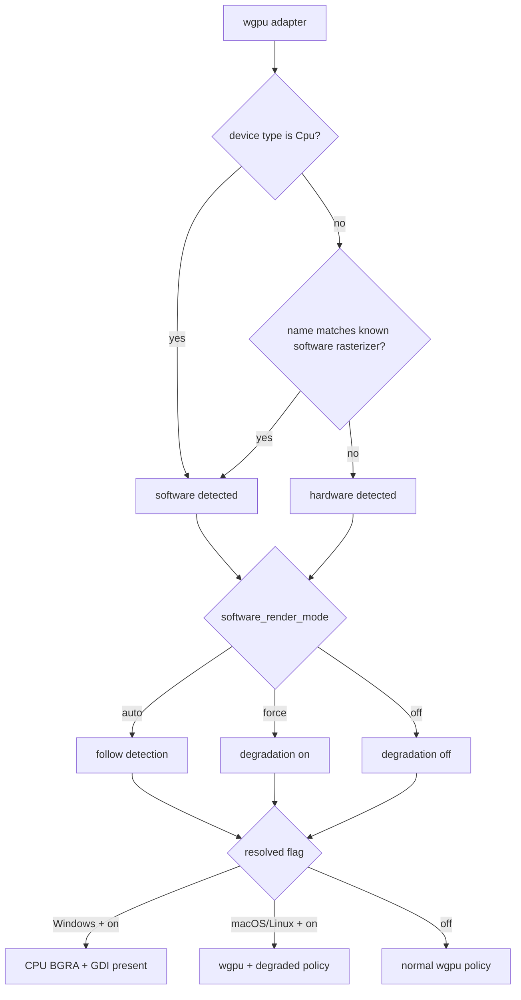

# Rendering Modes

[简体中文](Rendering-Modes-zh-CN)

SonicTerm always creates a wgpu adapter and device, then resolves whether to use
normal GPU policy or software-render degradation. On Windows, degradation also
switches final drawing to a CPU BGRA frame presented through GDI. On macOS and
Linux, degradation keeps wgpu presentation but applies the lower-cost pacing and
surface policy.

Text shaping, rasterization, and atlas ownership are described in
[Rendering and Fonts](Rendering-and-Fonts). Configuration keys are listed in
[Configuration](Configuration), and retained host memory is in [Memory](Memory).

### Adapter classification and selection

The first renderer requests a surface-compatible high-performance adapter with
`force_fallback_adapter = false`; wgpu may still return a CPU adapter. Every
later window in the process — New Window, warm-pool, and tear-out windows —
reuses its adapter/device/queue through `GpuSharedContext`, so the process holds
one device. Closing the main window while another window stays open hides it and
keeps its renderer, so that device stays live. Each window owns its surface and
rendering state; no presenter can bypass failed wgpu startup.

Software classification is a pure function over `wgpu::AdapterInfo`. It returns
true when `device_type == Cpu`, or when the lowercased adapter name contains one
of:

```text
microsoft basic render driver
llvmpipe
swiftshader
software adapter
```

The classification selects wgpu allocation policy as well as rendering policy.
Software adapters request `MemoryHints::MemoryUsage`; hardware adapters request
`MemoryHints::Performance`.

`[appearance].software_render_mode` resolves the degradation flag:

| Value | Result |
| --- | --- |
| `auto` | follow adapter classification |
| `force` | enable degradation on any adapter |
| `off` | disable degradation on any adapter |

The setting reloads live. Resolution always starts from the monitor’s own frame
period, so switching from degradation to `off` restores the monitor cadence
instead of retaining the previous cap. On Windows, `force` also overrides any
transparent backdrop with `opaque`, because the GDI presenter cannot composite
Mica, Acrylic, or Tabbed transparency. `auto` does not change the configured
backdrop at platform startup.



### Normal GPU policy

The hardware path follows the monitor period. A missing or zero monitor refresh
rate keeps the 60 Hz default. Surface presentation prefers `Mailbox` when the
backend offers it and otherwise uses `Fifo`. Opaque backdrops use
`CompositeAlphaMode::Opaque`; transparent backdrops use
`CompositeAlphaMode::PreMultiplied`. The desired maximum frame latency is 2.

SonicTerm renders into a retained offscreen frame texture. A frame key covers
visible pane revisions, geometry, selection, tabs, overlays, hover, inline
media, font/style state, and other image-affecting inputs. Effective scrollbar
opacity is quantized in each keyed pane record: `Never`, panes without
scrollback, and opacity at or below the shared emit floor all map to zero.
Hardware rendering still performs the full renderer assembly when a changed
frame is requested; unchanged frame keys return without rebuilding or
submitting a new frame.

The private production `FramePlan` owns that key together with final mode,
damage, pane full/content clips, resolved viewport rows, and expected revisions.
It receives metadata without grids or GPU objects; cell shaping and atlas
mutation remain in `GpuRenderer`. The same planner drives deterministic tests
and both presenters. Pane padding may leave an empty image-content clip even
though the existing cell layout retains its one-cell floor.

Surface-acquisition paths that do not successfully present clear the cached
frame key. `Outdated` and `Suboptimal` reconfigure the surface; `Lost` recreates
it; validation errors propagate. A `SurfaceTexture` is dropped before
reconfiguration. The next frame therefore cannot treat a blank or replaced
swapchain as already rendered.

### Windows LCD subpixel policy

LCD eligibility and blending are documented in [Rendering and Fonts](Rendering-and-Fonts).

### Software-render degradation

Degradation replaces the monitor period with an exact 25,000 µs period, about
40 fps. This is an override, not `max(monitor_period, 25 ms)`: even a slower
30 Hz monitor resolves to 25 ms. While an IME composition is active, the period
is 83,333 µs, about 12 fps. Ending composition immediately restores 25,000 µs.
The hardware path ignores the IME cap.

| Path | Frame period |
| --- | --- |
| hardware | monitor period |
| degraded software | 25,000 µs (~40 fps) |
| degraded software with IME composition | 83,333 µs (~12 fps) |

On the degraded path, all redraws—including input redraws—are coalesced to the
resolved period because every frame is CPU-expensive. Scrollbar auto-hide snaps
immediately to visible after activity and uses one deadline at the 600 ms idle
boundary to snap hidden; it never creates a fade heartbeat. Accelerated windows
retain the 150 ms fade-in and 300 ms fade-out. The wgpu surface uses `Fifo`,
opaque compositing, and desired maximum frame latency 1.

The hidden warm-renderer pool defaults to one. A configured value of `0`
disables it. Hardware honors targets through 5; degradation caps every nonzero
target at 1.

### Lock-contention retry

Each window keeps `retry_not_before` separate from its last-frame timestamp.
A failed due parser/image collection sets that deadline to the attempt time plus
the effective frame period. The retry is a floor over normal pacing, including
degraded IME pacing. Earlier input or redraw events cannot bypass or postpone
it. A due failure rearms it; coherent collection clears it before atlas/surface
retry policy runs. Closing the window discards it. No unconditional redraw
heartbeat or blocking parser/image lock is introduced.

### Windows CPU presentation

When degradation is active on Windows, `WindowsSoftwareFrame` composes the same
producer-built quads, text glyphs, color glyphs, and inline-image instances into
a complete premultiplied BGRA buffer. It presents the full frame to the HWND with
GDI `SetDIBitsToDevice`; retained GPU damage is not used as a second software
presentation policy.

The software frame is limited to 16,384 pixels on either axis and 160 MiB total.
Construction or resize beyond either limit fails without replacing the existing
valid allocation. A frame-key hit can re-present the existing CPU frame without
recomposing it.

CPU atlases supply software drawing; GPU mirrors remain 1×1 placeholders.
Returning to GPU rebuilds full textures, resets UV-bearing caches, and forces
a full redraw. Pixel conversion and sampling are shared with GPU drawing and
are specified in [Rendering and Fonts](Rendering-and-Fonts).

### Retained pixels and damage

Damage and draw order are documented in [Rendering and Fonts](Rendering-and-Fonts).

### Diagnostics

Startup logs the adapter backend, name, device type, and
`software_rendering=true|false`. When degradation resolves on, the app logs:

```text
software-render degrade engaged
```

with `detected`, `mode`, and `frame_period` fields. On Windows, breadcrumb
renderer identity distinguishes CPU/GDI software presentation from wgpu.

For frame phase timing, set `[logging].level = "debug"` and read the
`render_timing` target. Memory snapshots and allocator-state interpretation are
owned by [Logging](Logging) and [Memory](Memory).

### Code locations

| Topic | Primary paths |
| --- | --- |
| Adapter classification and surface policy | `crates/sonicterm-gpu/src/core.rs` |
| Config-to-degradation decision | `crates/sonicterm-app/src/app/{mod,event_loop,config_apply}.rs` |
| Frame pacing | `crates/sonicterm-app/src/app/mod.rs` |
| Retained frame and damage | `crates/sonicterm-gpu/src/core.rs` |
| GPU draw | `crates/sonicterm-gpu/src/wezterm_pipeline.rs` |
| Retained-frame blit | `crates/sonicterm-gpu/src/core.rs` |
| Windows CPU frame | `crates/sonicterm-gpu/src/software_windows.rs` |
| Windows backdrop override | `crates/sonicterm-windows/src/{main,software_presenter}.rs` |
