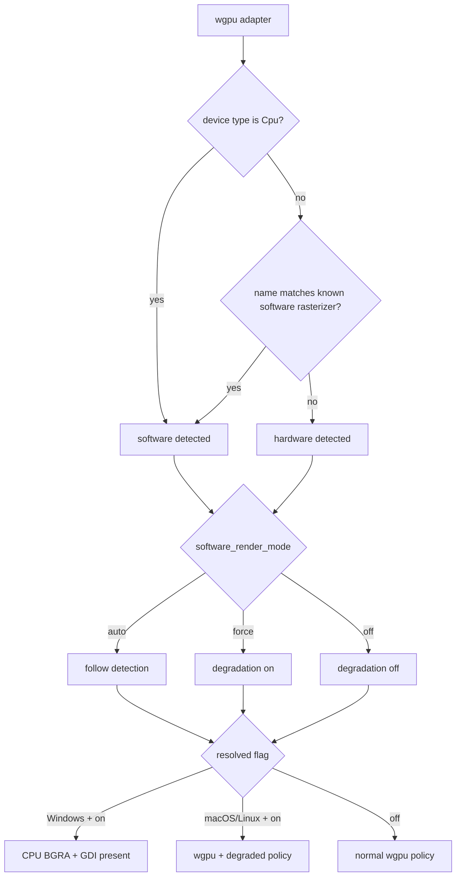

# Rendering Modes

[简体中文](Rendering-Modes-zh-CN)

SonicTerm always creates a wgpu adapter and device, then resolves whether to use
normal GPU policy or software-render degradation. On Windows, degradation also
switches final drawing to a CPU BGRA frame presented through GDI. On macOS and
Linux, degradation keeps wgpu presentation but applies the lower-cost pacing and
surface policy.

Text shaping, rasterization, and atlas ownership are described in
[Rendering and Fonts](Rendering-and-Fonts). Configuration keys are listed in
[Configuration](Configuration), and retained host memory is in [Memory](Memory).

### Adapter classification and selection

The first renderer requests a surface-compatible high-performance adapter with
`force_fallback_adapter = false`; wgpu may still return a CPU adapter. Every
later window in the process — New Window, warm-pool, and tear-out windows —
reuses its adapter/device/queue through `GpuSharedContext`, so the process holds
one device. Closing the main window while another window stays open hides it and
keeps its renderer, so that device stays live. Each window owns its surface and
rendering state; no presenter can bypass failed wgpu startup.

Software classification is a pure function over `wgpu::AdapterInfo`. It returns
true when `device_type == Cpu`, or when the lowercased adapter name contains one
of:

```text
microsoft basic render driver
llvmpipe
swiftshader
software adapter
```

The classification selects wgpu allocation policy as well as rendering policy.
Software adapters request `MemoryHints::MemoryUsage`; hardware adapters request
`MemoryHints::Performance`.

`[appearance].software_render_mode` resolves the degradation flag:

| Value | Result |
| --- | --- |
| `auto` | follow adapter classification |
| `force` | enable degradation on any adapter |
| `off` | disable degradation on any adapter |

The setting reloads live. Resolution always starts from the monitor’s own frame
period, so switching from degradation to `off` restores the monitor cadence
instead of retaining the previous cap. On Windows, `force` also overrides any
transparent backdrop with `opaque`, because the GDI presenter cannot composite
Mica, Acrylic, or Tabbed transparency. `auto` does not change the configured
backdrop at platform startup.


```mermaid
flowchart TD
    adapter["wgpu adapter"] --> cpu{"device type is Cpu?"}
    cpu -- yes --> detected["software detected"]
    cpu -- no --> name{"name matches known software rasterizer?"}
    name -- yes --> detected
    name -- no --> hardware["hardware detected"]
    detected --> setting{"software_render_mode"}
    hardware --> setting
    setting -- auto --> follow["follow detection"]
    setting -- force --> degrade["degradation on"]
    setting -- off --> normal["degradation off"]
    follow --> platform{"resolved flag"}
    degrade --> platform
    normal --> platform
    platform -- "Windows + on" --> gdi["CPU BGRA + GDI present"]
    platform -- "macOS/Linux + on" --> wgpuSlow["wgpu + degraded policy"]
    platform -- off --> wgpuFast["normal wgpu policy"]
```

### Normal GPU policy

The hardware path follows the monitor period. A missing or zero monitor refresh
rate keeps the 60 Hz default. Surface presentation prefers `Mailbox` when the
backend offers it and otherwise uses `Fifo`. Opaque backdrops use
`CompositeAlphaMode::Opaque`; transparent backdrops use
`CompositeAlphaMode::PreMultiplied`. The desired maximum frame latency is 2.
On macOS, wgpu's Metal backend offers only `Fifo` and `Immediate`, so macOS
always presents `Fifo`. There, a window whose streaming output is deferred is
admitted on a display-link tick rather than one period after its last render
(see Owner-local frame scheduling).

SonicTerm renders into a retained offscreen frame texture. A frame key covers
visible pane revisions, geometry, selection, tabs, overlays, hover, inline
media, font/style state, and other image-affecting inputs. Effective scrollbar
opacity is quantized in each keyed pane record: `Never`, panes without
scrollback, and opacity at or below the shared emit floor all map to zero.
Every frame plans one of three modes. `Noop` rebuilds and submits nothing: the
frame key is unchanged, the only change is pane revisions whose dirt is all
scrolled out of view, or the key changed with empty damage and no dirty live
row. Any other frame is `Partial` or `Full`. A hardware frame is `Partial` when
its damage is narrower than the surface and nothing forces a full repaint: it is
not a first frame, has no full-class change, no overlay before or after, and a
valid ink record for every clean visible row. A `Partial` frame assembles every
dirty slot, every row whose ink-padded strip meets the damage, and every row
whose valid ink record meets the damage, the drawn cursor cell or the last
presented recolor bounds ([Rendering and Fonts](Rendering-and-Fonts)). Every
other frame is `Full`. The degraded path is never `Partial`.

The private production `FramePlan` owns that key together with final mode,
damage, pane full/content clips, resolved viewport rows, and expected revisions.
It receives metadata without grids or GPU objects; cell shaping and atlas
mutation remain in `GpuRenderer`. The same planner drives deterministic tests
and both presenters. Pane padding may leave an empty image-content clip even
though the existing cell layout retains its one-cell floor.

Surface-acquisition paths that do not successfully present clear the cached
frame key. `Outdated` and `Suboptimal` reconfigure the surface; `Lost` recreates
and configures it, and a later frame acquires from it only while the device
still accepts work; a `Validation` result stops the device (see Stopped GPU
device below). A `SurfaceTexture` is dropped before reconfiguration. The next
frame therefore cannot treat a blank or replaced swapchain as already rendered.

### Windows LCD subpixel policy

LCD eligibility and blending are documented in [Rendering and Fonts](Rendering-and-Fonts).

### Software-render degradation

Degradation replaces the monitor period with an exact 25,000 µs period, about
40 fps. This is an override, not `max(monitor_period, 25 ms)`: even a slower
30 Hz monitor resolves to 25 ms. While an IME composition is active, the period
is 83,333 µs, about 12 fps. Ending composition immediately restores 25,000 µs.
The hardware path ignores the IME cap.

| Path | Frame period |
| --- | --- |
| hardware | monitor period |
| degraded software | 25,000 µs (~40 fps) |
| degraded software with IME composition | 83,333 µs (~12 fps) |

On the degraded path, all redraws—including input redraws—are coalesced to the
resolved period because every frame is CPU-expensive. Scrollbar auto-hide snaps
immediately to visible after activity and snaps hidden at the 600 ms idle
boundary. Accelerated windows keep the 150 ms fade-in and 300 ms fade-out. On
both paths, a settled scrollbar requests no frames until its idle deadline
(`last_active` + 600 ms). That deadline belongs to its window, fires once and is
re-armed by new activity. On the accelerated path it starts the 300 ms
fade-out. Edge hover and a thumb drag hold the bar and arm no deadline. The
first fade step after a target change is capped at one 60 Hz frame, so a late
wake still fades over several frames. The wgpu surface uses `Fifo`,
opaque compositing, and desired maximum frame latency 1.

The hidden warm-renderer pool defaults to one. A configured value of `0`
disables it. Hardware honors targets through 5; degradation caps every nonzero
target at 1.

### Owner-local frame scheduling

Window input and output causes never share an application-wide dirty latch.
Hardware pure input may bypass pacing only for its live source window; input with
visible output stays paced. Monitor periods are refreshed for each window on
creation/adoption, move, scale, resize, focus gain and un-occlusion; an unavailable
or zero rate keeps the last period. The exact 25,000 µs degraded and 83,333 µs
IME periods still come from global degradation policy, not a per-window copy.

Each window keeps two pacing clocks. `last_render` is the attempt clock: every
renderer call moves it. `stream_clock` paces streaming output on the hardware path.
It moves with every attempt except one: a hardware attempt for a new input
generation that settled without presenting (`Skipped`), with no surface timeout or
contention floor pending. A keypress frame that found no echo yet therefore does
not delay the echo by a period; the echo is still streaming work, paced from the
previous non-exempt attempt. The surface-timeout retry waits from `last_render`,
the degraded software path paces every attempt from `last_render`, and presented,
cached, retried, failed and stopped attempts move both clocks. The armed Frame
deadline uses the same clock choice as admission. The window counter
`stream_clock_exempt` counts the attempts that kept `stream_clock`.
Owner-addressed wake entries service only due windows; maintenance does not wake
unrelated windows or suppress a coincident repaint. A native frame request already
in flight suppresses only duplicate Frame deadlines: notification and scrollbar
idle expiration remain armed, clear once when due, and coalesce their repaint
with that existing request. A scrollbar expiry requests a frame only when it
changed the bar; activity or a hold after the deadline was collected makes it a
no-op.

On macOS 14 and later, window registration installs a per-window
`NSView.displayLink`, created paused, whose preferred rate is the window's monitor
period and follows every refresh that changes it. A hardware deferral that the
streaming rule wins stores the pacing mode `Link` when the window has a link;
a surface-timeout or contention deferral, and a streaming deferral on the
degraded software path or in a window with no link, store `Timer` and keep the
rules above. A `Sync` deferral stores no mode and keeps one already stored; it
pauses the link until admission re-evaluates the hold. The stored mode holds until the frame is admitted; link invalidation
clears a stored `Link` but never a stored `Timer`. The link runs only while a
`Link` admission is pending: the wait fold starts it after collecting deadlines
and pauses it when nothing link-paced is pending or the window cannot schedule
frames. Each start bumps the window's link generation, and a tick is accepted
only for the running generation and a pending `Link` admission; an accepted tick
authorizes one frame. Native and backend occlusion, device stop, park, hide and
software degradation turning on invalidate link pacing at the writer, which bumps
the generation and drops an unused tick. If no tick comes, the Frame deadline is
a fallback ceiling two periods after the pacing clock. Input fast paths, the
surface-timeout retry, the contention floor, the 25,000 µs and 83,333 µs periods,
earlier macOS, Windows and Linux are unchanged: they install no link and pace
from the timer.

A display-link-paced frame can still wait for a drawable. Admission and the
synchronous present call run in the same `RedrawRequested` handler, so a frame
is never admitted before the previous present call returned, but a returned
present does not release its drawable. wgpu-hal's Metal surface sets
`maximumDrawableCount` to the frame latency plus one (3 on the hardware path),
disables `allowsNextDrawableTimeout` and ignores the acquire timeout, so when
three frames are still outstanding the next acquisition waits in `nextDrawable`.
Display-link pacing does not remove that wait, and the timer path has the same
exposure. No counter measures it; Metal System Trace in Instruments shows it.

Output events are serviced per pane. A VT worker keeps at most one `PaneOutput`
outstanding for each pane. The event loop acknowledges it in the window that holds
the pane now, runs that window's command maintenance, and requests an `Output`
frame only when the window's active tab, or its zoomed pane, has unseen output.
When only a tab's command badge or its frame-key command status changed, it
requests a `Chrome` frame instead. Otherwise it requests nothing, so output in a
background tab costs no frame: it stays in its pane's grid and output generation,
and switching to that tab dirties every pane and draws the latest content.
`RequestRedraw`, which harnesses and tests send, still requests an `Output` frame
unconditionally.

StructuralInvalid consumes the captured attempt's causes and parks the window.
Parked windows contribute no frame, retry, pacing, cursor, scrollbar, notification,
or badge deadline. Only Topology, Input, Visibility, or DeviceRecovered causes
unpark; worker Output still runs command maintenance but does not unpark. A missing
closing layout is silent. Device-stop reporting precedes parking and collection;
no parser/media lock is needed to report the stop once. Clearing device-stop
suppression additionally requires the installed renderer to be usable, not marked
for destruction, and on a different generation; a recovery cause alone is not proof.
This scheduling adapter does not rebuild devices; the shared recovery coordinator
below installs the replacement before the owner-local adapter admits a frame.

Synchronized output (DEC 2026) adds the `Sync` deferral rule, after the surface-timeout
and contention rules and before streaming. A pane holds its window while it is in the
active tab's visible set, its published update is open, its 150 ms deadline has not
passed, and every reset it has published has reached a successful frame. The window
holds for at most 150 ms from the first `Sync` deferral of a stretch, whatever pane
caused it; a `Presented`, `Cached` or `Settled` outcome ends the stretch and a failed
outcome keeps it. A held window wakes at its earliest held deadline or its cap, and
its display link neither runs nor accepts ticks. The first frame, a pending
`Visibility` or `DeviceRecovered`, a changed surface size and a reconfigured or
recreated surface (`Outdated`, `Suboptimal`, `SurfaceLost`) force the frame through
the hold; only a presented frame clears the last two. A cleared retained key, such as
on a focus change, does not. Both redraw adapters recheck the hold under the collected
parser guards before applying receipts and abandon a held frame without settling it,
so no clock, retry floor, receipt or cause changes.

### Occlusion and surface availability

Native `Occluded` events are handled per window on macOS and X11, before either
main or child collection. Occluded windows retain pending input/output identities
and grid dirt, but contribute no frame, cursor, scrollbar, or notification
deadlines and collect no parser/media state. PTY output and command maintenance
continue. App-hidden main windows and unadopted warm windows remain separate.
The device-refusal boundary, including smoke-only evidence and its one-time error
report, runs first; suppression changes neither pacing clock nor the contention
retry floor. A transition back to visible clears the retained renderer frame key,
marks one Visibility cause, and requests at most one frame on a usable device.
Duplicate visible events add nothing; visibility cannot revive a stopped device.

Typed `SurfaceRetry(Timeout)` belongs to the app at the owner's next effective
frame period, retaining dirt without a native self-retry loop. Typed
`SurfaceRetry(Occluded)` suppresses frames. Atlas, Outdated, Suboptimal, and
SurfaceLost retain their presenter retry ownership. The public `render -> Result`
adapter restores the legacy native retry only for Timeout and Occluded; it does
not double-request the other reasons. DeferStop and Stop keep their prior behavior.

Only backend-only occlusion on macOS arms an exceptional one-second surface
availability probe. Native occlusion/visibility events cancel it, and app-hidden,
parked, or stopped owners do not contribute it. The method admits GPU work through
the device gate and rejects non-Metal adapters before acquisition: pinned Metal
can discard an acquired texture, while Vulkan's discard is a no-op. It acquires
and drops without encoding, uploading, submitting, presenting, or acknowledging.
Success clears retained identity and schedules one Visibility frame; Timeout and
Occluded rearm after one second. Outdated/Suboptimal reconfigure, SurfaceLost
recreates, and all rearm only after rechecking the gate. A suboptimal texture is
dropped before configure. Refused gates stop probing. Surface-recreation errors
are logged and rearm the one-second probe only while the device remains usable
and the owner remains backend-occluded, visible, and unparked. They do not assemble
a frame or consume dirt. Native acquire/configure may block; this is a slow
exceptional check, not a nonblocking guarantee or normal heartbeat.

`__occlude_next_surface_acquire` is a test fault seam for the real typed retry
exit at the wgpu presenter's acquire step, without a Space switch or a covered
window. It applies on every platform's wgpu presenter; the Windows software
presenter has no surface acquire, so an armed fault waits for a wgpu frame. The
Windows release-order test drives the compatibility wrapper through it and checks
that a surface retry keeps the grid's dirt. Fake-clock owner tests and source contracts
cover the policy, but do not replace same-window full-app CPU measurements or
native proof of the first full presented frame.

### Lock-contention retry

Each window keeps `retry_not_before` separate from its last-frame timestamp.
Only a failed visible parser/image `try_lock` enters this path. Hidden-tab and
zoom-hidden stores are not visited by either role's frame collector. Both roles
hold visible parsers before copying visible media; these are separate, not atomic,
snapshots. Invalid topology skips the entire assembly without arming this floor,
and a closing tab with no layout skips silently.

A failed due parser/image collection sets that deadline to the attempt time plus
the effective frame period. The retry is a floor over normal pacing, including
degraded IME pacing. Earlier input or redraw events cannot bypass or postpone
it. A due failure rearms it; coherent collection clears it before atlas/surface
retry policy runs. Closing the window discards it. No unconditional redraw
heartbeat or blocking parser/image lock is introduced. A frame holds the visible
parser guards only while it assembles; they are released before the surface is
acquired and the frame presented, on the GPU and GDI paths alike. The retry floor
stays one full frame period.

On the hardware path a parser miss may also ask the missed pane's VT worker for
its next gap between batches, once per contention episode; an episode opens when
the window is created and at each coherent collection, and an image miss asks
nothing. The worker sends `ParserYielded` with a park deadline it fixed before
sending, 2 ms after its clock reading and never past an open synchronized update's
stored deadline, then parks holding no lock. A window accepts the grant only for the
exact pane, request generation and handshake, before both the floor and the
worker's deadline, while the pane is visible and no surface timeout or
synchronized-output hold is pending. One accepted grant is the episode's one fast
retry: the next admission before the worker's deadline bypasses the retry floor and
the streaming carry once. It never clears or arms the floor; Timeout and Sync
deferrals still win, and a retry that misses again waits for the floor. A
successful collection serves the worker under the held parser guards; every other
outcome serves it too, except a pane retired or moved after acceptance, which
resolves at the window's next admission while the worker waits out its own
deadline. The deadline bounds the requested wait, not how long the lock stays
free, and scheduler overshoot is possible and measured. The software path
publishes no request, and turning it on resolves every window's request and grant.

### Windows CPU presentation

When degradation is active on Windows, `software_frame::SoftwareFrame` composes
the same producer-built quads, text glyphs, color glyphs, and inline-image instances
into a complete premultiplied BGRA buffer. The Windows-only `software_windows`
bridge borrows the validated frame and presents it to the HWND with GDI
`SetDIBitsToDevice`; retained GPU damage is not used as a second software
presentation policy.

CPU composition contains no native-window or GDI imports and forbids unsafe code.
It compiles for Windows production and every host's unit tests. The flat sibling
`software_frame_tests.rs` keeps the pixel assertions; its existing GPU-parity
cases also require a headless wgpu adapter. `cargo test -p sonicterm-gpu` runs
these tests on macOS, Windows, and Linux. Native GDI capability, selection
presentation, and smoke checks remain Windows-only. Compiling the CPU compositor
for tests does not add a software presenter on macOS or Linux.

The software frame is limited to 16,384 pixels on either axis and 160 MiB total.
Construction or resize beyond either limit fails without replacing the existing
valid allocation. A frame-key hit can re-present the existing CPU frame without
recomposing it.

CPU atlases supply software drawing; GPU mirrors remain 1×1 placeholders.
Returning to GPU rebuilds full textures, resets UV-bearing caches, and forces
a full redraw. Pixel conversion and sampling are shared with GPU drawing and
are specified in [Rendering and Fonts](Rendering-and-Fonts).

The wgpu frame texture is unused while the GDI presenter is active, so it is
1×1 (4 B) then and the surface size otherwise. `build_frame_texture` sizes it at
construction, resize, recovery and the degrade switch; leaving GDI allocates
the full texture once and forces a full next frame. A stopped device keeps the
old texture, and recovery builds it from the current mode. The texture is GPU
memory outside `retained_amounts`; `GpuRenderer::frame_texture_extent` reports
its size.

### Stopped GPU device

A Validation, OutOfMemory, or Internal wgpu error, or a device loss, stops
rendering in every window, because the windows share one device; the
containment rules are in
[Architecture Internals](Architecture-Internals). Both presenters obey the stop:
the wgpu path submits and presents nothing, and the Windows CPU presenter
neither composes nor presents a frame, nor reblits an unchanged one. The windows stay open, and whether their
last presented pixels stay visible is up to the OS and driver. Dirty rows stay
unacknowledged, while shells, input, sessions, and window lifecycle keep
working. A software-render policy change made while the device is stopped is
recorded without configuring the surface or rebuilding GPU atlas textures.
An `Unusable` device without a recorded loss remains stopped. A `Lost` committed
device starts shared-context recovery; the `sonic::gpu` records on
[Logging](Logging) name the operation and error that stopped it.

### Shared-device recovery

The application owns one committed context and one recovery coordinator. A loss
creates a new instance, adapter, device, and queue using startup's feature and
allocation policy. One persistent worker requests the adapter/device without
blocking the event loop; a timed-out worker is never replaced or joined.

There are at most five attempts per budget. Their delays are 0, 250 ms, 1 s,
4 s, and 16 s, with a 10 s request deadline. An attempt due while an older
request still runs consumes its budget without starting another worker. A late
result is discarded and its candidate destroyed on the event-loop thread. A
new generation starts a fresh budget only if a later loss occurs at least 30 s
after its first acknowledged presentation; merely creating a device is not
stability evidence. Exhaustion leaves rendering stopped and keeps PTYs alive.

The event loop first prepares every live and warm renderer on the candidate,
then commits all of them in one callback. Surfaces, retained frame textures,
pipelines and atlas uploads are rebuilt, even when dimensions match. CPU
atlases and UV-bearing caches reset; fonts, cell metrics, terminal state and
frame counters remain. The current software-render policy is re-read, while
existing windows keep their native backdrop. A partial commit closes and
destroys the candidate before event dispatch resumes. A successful commit
retires the old device and admits each rebound owner through its validated
replacement snapshot. Hidden or natively occluded owners retain dirt without a
frame request; each renderable owner coalesces one recovery frame. Grid dirt is
acknowledged only after a real `Presented` outcome.

Generation-tagged callbacks cannot revive retired devices or start recovery
for them. A closed requesting window does not invalidate its owned in-flight
surface, and surviving windows are re-evaluated when the result arrives.
Recovery-only timers do not request redraws. Pending results are checked at
100 ms intervals, reduced to 1 s after exhaustion, solely to dispose them if a
completion hint was missed; an idle coordinator has no such timer.

The request deadline bounds the decision to abandon an attempt, not native
driver destruction or surface configuration. Normal result disposal runs on
the event loop. After application shutdown, a detached worker's late result
has ownership-safe best-effort disposal, which may block on native main-thread
destruction; shutdown never waits for that worker. Startup device failure still
follows the ordinary startup path, and recovery adds no new renderer backend.

### Retained pixels and damage

Damage and draw order are documented in [Rendering and Fonts](Rendering-and-Fonts).

Grid dirty rows index the live buffer, so the frame plan maps each one to the
viewport slot that draws it. Live row `r` is absolute row `scrollback_len + r`.
A primary view scrolled back by `k` rows draws it at slot `r + k`, and draws it
nowhere when `r + k` is past the last row. Primary-screen damage covers only
those slots; the alternate screen keeps no scrollback and still damages its
whole pane. On every assembled frame, `Full` or `Partial`, both row caches drop
absolute row `scrollback_len + r` for every dirty live row of each pane on the
surface, whether that row is on screen or not.

A `Partial` frame assembles only the rows listed above. A row it does not emit
keeps its retained pixels and its ink record, and a dirty live row whose slot the
frame did not draw keeps its dirt bit. Any frame that does not present (a surface
retry, an atlas retry, or a stopped device) commits no record or receipt and
clears the frame key, so the next frame is a whole-surface `Full`.

A frame whose only change is pane revisions, with every changed pane's dirt
scrolled out of view, presents nothing on either path: the plan is `Noop` with
empty damage and acknowledges no dirt. The rows stay dirty until a frame that
shows them, which is a whole-surface `Full` because scrolling changes the
viewport. While an overlay is active (IME preedit, search, palette,
notification, link preview, drag chip, or focus flash) in the old or new key, any
change to the frame key repaints the whole surface instead, because a preedit
follows the live cursor, while the frame key records only the drawn cursor cell,
which is absent when the cursor is hidden, the window unfocused, the pane
read-only or the view scrolled back. A
revision change with no dirty live row and no other damage, such as one from
`set_autowrap`, also plans `Noop` on both paths.

Cursor, focus, tab-band, selection and scrollbar changes damage only their own
areas ([Rendering and Fonts](Rendering-and-Fonts)). That narrow damage takes
effect only where the wgpu retained path draws: macOS, and Windows or Linux
through wgpu. The degraded path repaints the whole surface for any of these
changes, and the Windows GDI presenter composes the whole frame without reading
damage.

### Diagnostics

Startup logs the adapter backend, name, device type, and
`software_rendering=true|false`. When degradation resolves on, the app logs:

```text
software-render degrade engaged
```

with `detected`, `mode`, and `frame_period` fields. On Windows, breadcrumb
renderer identity distinguishes CPU/GDI software presentation from wgpu.

For frame phase timing, set `[logging].level = "debug"` and read the
`render_timing` target; it times the phases of each frame that completes. For
what it cannot see, read the `frame_counters` target at the same level
([Logging](Logging#frame-and-lock-counters)): redraws that were deferred or found
a lock busy, retries and other outcomes, present intervals, parser lock waits and
holds, flush-to-redraw delay, and dispatch stalls. Use `render_timing` when a
frame is slow, and `frame_counters` when frames are late, missing, or contended;
it writes at most one line a second per window. Memory snapshots and allocator-state interpretation are
owned by [Logging](Logging) and [Memory](Memory).

### Code locations

| Topic | Primary paths |
| --- | --- |
| Adapter classification and surface policy | `crates/sonicterm-gpu/src/core.rs` |
| Config-to-degradation decision | `crates/sonicterm-app/src/app/{frame_pacing,event_loop,config_apply}.rs` |
| Frame pacing | `crates/sonicterm-app/src/app/{mod,frame_pacing,redraw,display_link}.rs` |
| Retained frame and damage | `crates/sonicterm-gpu/src/core.rs` |
| Device error containment | `crates/sonicterm-gpu/src/{device_errors,core,present}.rs` |
| Shared-device recovery | `crates/sonicterm-app/src/app/{gpu_recovery,gpu_recovery_worker}.rs`, `crates/sonicterm-gpu/src/{recovery,recovery_context,rebind}.rs` |
| GPU draw | `crates/sonicterm-gpu/src/wezterm_pipeline.rs` |
| Retained-frame blit | `crates/sonicterm-gpu/src/core.rs` |
| CPU composition and Windows bridge | `crates/sonicterm-gpu/src/{software_frame,software_windows}.rs` |
| Windows backdrop override | `crates/sonicterm-windows/src/{main,software_presenter}.rs` |
