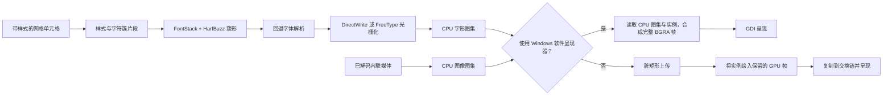
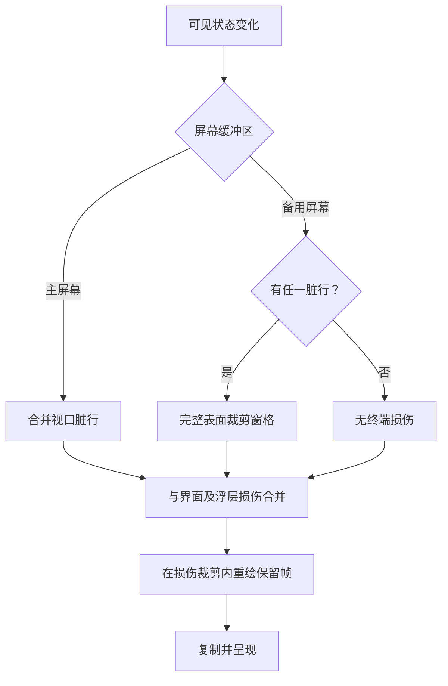
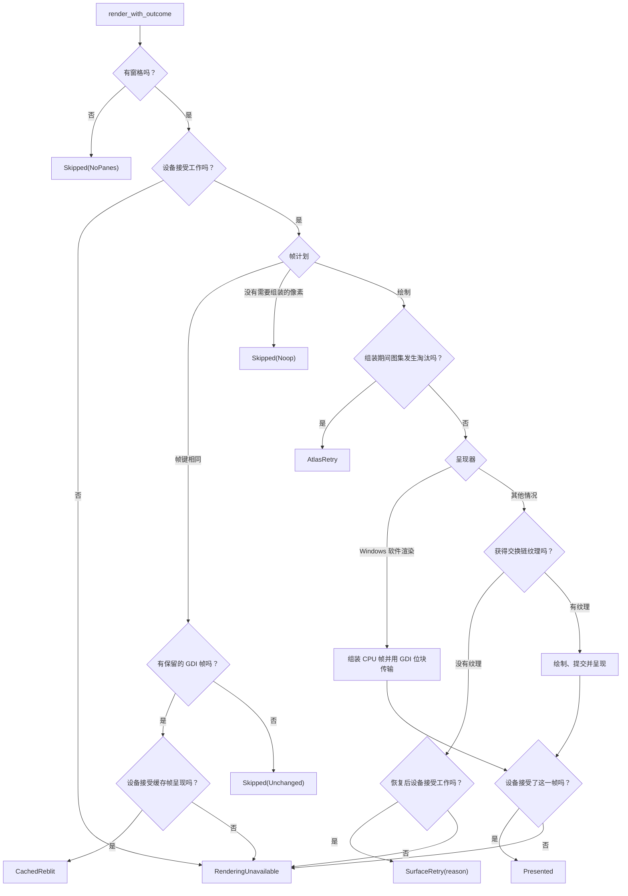

# 渲染与字体

[English](Rendering-and-Fonts)

本页沿带样式的单元格介绍字体、图集、GPU/CPU 绘制与保留帧损伤。
适配器选择和帧节奏见[渲染模式](Rendering-Modes-zh-CN)，分配上限与记账见[内存](Memory-zh-CN)。

### 流水线与所有权



`sonicterm-render-model` 是与渲染器无关的边界。应用为每个可见窗格提供一个
`PaneRender`，其中包含网格、窗格矩形、视口、光标、焦点、滚动条、广播状态和内联图像。
生产路径用独立参数传递 UI 状态；`RenderInputs` 仍是公开兼容类型，不是生产入口。
`sonicterm-gpu` 只通过该边界访问网格、配置和界面类型。

应用使用非阻塞 `try_lock` 获取所有可见窗格的解析器。只要有一个窗格正忙，就推迟
整帧，而不是显示新旧状态混杂的窗格。渲染器仅含元数据的 `FramePlan` 在塑形前确定裁剪和
视口行槽；执行仍保留借用网格和解析器保护对象，CPU 图集/缓存修改仍然有状态。

### 完整行对齐

每个窗格只把不足一行的剩余空间移到文字网格上方，让完整行贴近配置的底部 padding。
偏移按整数物理像素应用，因此底部仍可能剩下不足一个像素。字号、行高、PTY 尺寸及配置的
padding 不变。受资源限制而行数较少的网格不吸收整行的未使用区域；若网格已经高于截断后
的像素矩形，则不再向下偏移。

文字背景、字形、光标、选区、链接、内联媒体与终端输入法共用规划后的网格原点。窗格装饰、
焦点闪烁、滚动条、分隔条和底部标签栏保持原几何。边距不对应终端单元格。窗口尺寸、DPI、
字体或 padding 变化会使旧布局失效。

### 字体发现与匹配

`sonicterm-engine::FontStack` 把 `sonicterm-font` 适配给渲染器。默认主字体族是
`Rec Mono St.Helens`。匹配会考虑字体族、样式、字重、字宽、字体面索引、变体和码点
覆盖范围。可变字体元数据损坏、缺失或越界时，会回退到基础 OS/2 字重与字宽，不会中止应用。

平台字体发现隐藏在 `FontLocator` 之后：

- macOS 使用 CoreText 回退与字体 URL；
- Windows 使用 DirectWrite/GDI 描述信息并提取原始字体；
- 其它 Unix 系统使用 Fontconfig，并把候选限制为等宽、双宽或字符单元字体。

配置主字体之后，代码内置回退列表依次尝试 JetBrains Mono、Symbols Nerd Font Mono 和
Noto Color Emoji。已加载字体都不覆盖某码点时，后台解析器查找平台字体并追加到该 `FontStack`。自动解析会把带 OpenType `MATH` 表的字体排在
文本字体之后，但不会排除它；没有文本字体覆盖时，数学字体仍可提供该码点。在 `[font]`
中显式指定的字体族始终优先，不受 `MATH` 表影响。

字体重载后，已打包字体目录仍会附着在可见和预热渲染器上。Linux 包不会把随附的四个
Rec Mono face 安装到系统，因此必须保留这些目录。

### 标签页进程图标

手动标题优先；否则，前台为 `rmux`、`tmux` 或 `screen` 时，即使存在 CWD 也优先使用
非空原始 OSC 标题。其它进程保持 CWD 优先的自动标题。下表的图标查找只使用可执行文件身份。

操作系统提供前台可执行文件后，`normalize_proc_name` 会按 `/` 和 `\\` 取文件名，去掉
一个登录 shell 的 `-` 前缀和一个不区分大小写的 `.exe` 后缀，再转为小写。界面随后只做
精确匹配，不解析参数、终端输出或窗口标题。未知进程在已有工作目录时使用文件夹字形
U+F07B，否则使用终端字形 U+F489。

前台进程探测只在 macOS 和 Windows 实现。Linux 与其它没有探测实现的平台不会返回
进程名，因此标签页使用工作目录的文件夹字形或终端回退字形。

当 SonicTerm 进程本身拥有提升的操作系统权限时，每个标签页还会显示一个独立且不动画的
锁形警告标记。Windows 从当前进程 token 读取这个全局状态；macOS 和 Linux 以有效用户 ID
为零作为判断依据。普通权限的 Windows SonicTerm 中，如果某个标签页当前的前台后代进程
拥有提升 token，也只在该标签页显示标记。现有的 500 毫秒前台进程缓存会通过每个窗口共用
的一次进程表快照刷新活动和非活动标签页状态；当 UIPI 阻止直接读取高完整性子进程 token 时，
它会识别所选后代路径中的真实 `gsudo.exe` broker。成功接受输入后保证在 500 毫秒后探测；
只要按标签页警告可见，就每 500 毫秒固定探测，并在控制权回到普通 shell 后清除标记。结果未
变化的探测不会重绘，空闲标签页也不会轮询。

该标记由四边形组成的矢量界面元素绘制，不是字体字形或标题字符。背景使用主题 ANSI danger
红色，锁形则按线性光对比度选择黑色或白色，因此活动、非活动、悬停、自定义颜色、浅色、
深色和高对比度标签页都保持同样的警告样式。拖动源标签页时，整个标记采用通常的源透明度。

该标记不会替换或重新着色前台进程图标，也不会写入 `Tab.title`、`auto_title` 或
`custom_title`，所以 OSC 标题和手动重命名都不能移除或保存它。特权布局会先预留标记宽度
和间距，再只缩短标题后缀；空间允许时，开头的 `#N` 身份和进程图标始终保留。主窗口与拆出
窗口通过 GPU 和 Windows 软件渲染路径绘制同一个进程级状态。此标签页界面元素不会修改
可执行文件资源、原生窗口图标、任务栏、Dock、应用切换器或软件包图标。

以下是内置 Rec Mono 字体提供的私用区码点：

| 应用 | 精确别名 | 内置字形名称 | 码点 |
| --- | --- | --- | --- |
| Claude Code | `claude`, `claude-code` | `md-creation` | U+F0674 |
| GitHub Copilot CLI | `copilot`, `github-copilot`, `github-copilot-cli` | `oct-copilot` | U+F4B8 |
| Zsh | `zsh` | `dev-ohmyzsh` | U+E84F |
| Bash | `bash` | `dev-bash` | U+E760 |
| Fish | `fish` | `fa-fish` | U+EE41 |
| POSIX shell | `sh`, `dash` | `seti-shell` | U+E691 |
| PowerShell | `pwsh`, `powershell` | `cod-terminal-powershell` | U+EBC7 |
| Command Prompt | `cmd` | `cod-terminal-cmd` | U+EBC4 |
| Vim / Neovim | `nvim`, `vim`, `vi`, `nvi` | `custom-vim` | U+E62B |
| Visual Studio Code | `code`, `code-insiders`, `codium`, `vscodium` | `dev-vscode` | U+E8DA |
| Emacs | `emacs`, `emacsclient` | `dev-emacs` | U+E7CF |
| Nano | `nano` | `dev-nano` | U+E838 |
| SSH / Mosh | `ssh`, `mosh` | `md-ssh` | U+F08C0 |
| tmux | `tmux` | `cod-terminal-tmux` | U+EBC8 |
| GNU Screen | `screen` | `cod-screen-full` | U+EB4C |
| Git | `git`, `lazygit`, `tig` | `fa-git` | U+F1D3 |
| GitHub CLI | `gh`, `hub` | `oct-logo-github` | U+F470 |
| GitLab CLI | `glab` | `dev-gitlab` | U+E7EB |
| Rust | `cargo`, `rustc`, `rust-analyzer` | `md-language-rust` | U+F1617 |
| Python | `python`, `python3`, `ipython`, `pip`, `pip3` | `md-language-python` | U+F0320 |
| Go | `go`, `gofmt`, `gopls` | `dev-go` | U+E724 |
| Java | `java`, `javac` | `dev-java` | U+E738 |
| Maven | `mvn`, `mvnw` | `dev-maven` | U+E82C |
| Gradle | `gradle`, `gradlew` | `dev-gradle` | U+E7F2 |
| Ruby | `ruby`, `irb`, `bundle`, `bundler`, `gem`, `rails` | `dev-ruby` | U+E739 |
| PHP | `php`, `php-fpm` | `dev-php` | U+E73D |
| Composer | `composer` | `dev-composer` | U+E783 |
| Lua | `lua`, `luajit` | `dev-lua` | U+E826 |
| Swift | `swift`, `swiftc` | `dev-swift` | U+E755 |
| Zig | `zig` | `dev-zig` | U+E8EF |
| .NET | `dotnet` | `dev-dotnet` | U+E77F |
| Node.js | `node`, `nodejs` | `dev-nodejs` | U+E719 |
| npm | `npm`, `npx` | `dev-npm` | U+E71E |
| pnpm | `pnpm` | `dev-pnpm` | U+E865 |
| Yarn | `yarn`, `yarnpkg` | `dev-yarn` | U+E8EC |
| Deno | `deno` | `dev-denojs` | U+E7C0 |
| Bun | `bun` | `dev-bun` | U+E76F |
| Docker | `docker`, `docker-compose` | `dev-docker` | U+E7B0 |
| Podman | `podman` | `dev-podman` | U+E866 |
| Make | `make`, `gmake` | `md-hammer-wrench` | U+F1323 |
| CMake | `cmake` | `dev-cmake` | U+E794 |
| Ninja | `ninja` | `md-ninja` | U+F0774 |
| Kubernetes | `kubectl`, `k9s`, `minikube` | `dev-kubernetes` | U+E81D |
| Helm | `helm` | `dev-helm` | U+E7FB |
| Terraform / OpenTofu | `terraform`, `tofu`, `opentofu` | `dev-terraform` | U+E8BD |
| Ansible | `ansible`, `ansible-playbook` | `dev-ansible` | U+E723 |
| Pulumi | `pulumi` | `dev-pulumi` | U+E873 |
| AWS CLI | `aws` | `dev-aws` | U+E7AD |
| Azure CLI | `az`, `azure` | `dev-azure` | U+E754 |
| Google Cloud CLI | `gcloud` | `dev-googlecloud` | U+E7F1 |
| Cloudflare | `cloudflared`, `wrangler` | `dev-cloudflare` | U+E792 |
| Vercel | `vercel` | `dev-vercel` | U+E8D3 |
| Netlify | `netlify` | `dev-netlify` | U+E83C |
| PostgreSQL | `psql`, `postgres`, `postmaster` | `dev-postgresql` | U+E76E |
| MySQL | `mysql`, `mysqld` | `dev-mysql` | U+E704 |
| MariaDB | `mariadb`, `mariadbd` | `dev-mariadb` | U+E828 |
| Redis | `redis-cli`, `redis-server`, `redis-sentinel` | `dev-redis` | U+E76D |
| SQLite | `sqlite`, `sqlite3` | `dev-sqlite` | U+E7C4 |
| MongoDB | `mongo`, `mongod`, `mongosh` | `dev-mongodb` | U+E7A4 |

### 塑形与回退

HarfBuzz 把样式片段塑形成字形 id、字符簇、推进量和偏移量，再把字符簇映射回终端列。
同一字符簇内的字形位置由 HarfBuzz 的累计笔位置与每个字形的水平、垂直偏移共同决定；
进入下一个字符簇时，笔位置会重置到其首个终端单元格。缺失字符簇会依次尝试回退字体；
最后使用 `.notdef` 或替代字形，不会停止应用。

只有在片段没有组合附加内容、双宽单元格标志或常见连字参与字符时，可打印 ASCII
快速路径才绕过 HarfBuzz。受保护字符为：

```text
= ! < > - _ : | & *
```

组合标记和变体选择符留在所属字符簇中。宽字符和多单元格连字保持自然推进量与偏移量。
替代回退字形会保留原字符簇坐标。

Windows 系统回退会完整编码 UTF-16；映射位置、剩余长度及 locale 范围都按代码单元计数。
补充平面字符始终保留为代理项对。映射返回零长度、越界或拆分代理项对时，整个原生回退请求
失败，不返回部分候选；调用方报告失败并继续其余已配置的字体查找源。成功请求返回的候选
按首次出现的顺序去重。

原始塑形文本和集合使用显式 `sonicterm_font::payload` TRACE 目标。显式启用的输出 sink
可以记录它们，崩溃历史不会。安全回退错误只保留阶段和大小/数量诊断，不保留受影响文本。
白色前景和不染色的彩色字形是正常渲染，不产生常规逐字形 warning。真正的图集和呈现诊断
仍然保留。

粗体和斜体负责选择字形。前景色不会切分塑形文字段。塑形后，渲染器解析主题默认色、256 色
索引和 24 位 RGB。反色会交换前景与背景。dim 会在保存的 sRGB 编码空间内，把前景向有效
背景混合 45%，随后再按 sRGB 表面或 CPU 混合的需要转换绘制值。

背景是四边形，不是字形。相邻且相同的非默认背景会合并。默认背景来自损伤清理。下划线段会
形成单线、双线、波浪、点线或虚线四边形。有 SGR 58 显式颜色时使用它，否则使用前景色。
GPU 线段端点存放在与 HSV 颜色变换分离的几何参数中，因此波浪下划线的形状不会改变其最终颜色。

解析器会保存 blink、hidden 和 strikethrough 标志。当前终端渲染器没有针对这三个标志的
专用绘制分支。

### 光栅化

Windows 默认使用 DirectWrite 的 natural-symmetric ClearType 光栅化并禁用网格拟合，
保留轮廓对齐，而不是逐字形按 hint 独立吸附。支持彩色的字体使用既有 FreeType 彩色路径，
避免在 ClearType 掩码中丢失图像内容；其它 DirectWrite 失败也回退 FreeType。
macOS 和其它 Unix 使用 FreeType。FreeType 支持单色、灰度、LCD 次像素、BGRA 彩色
位图字形，以及 COLR/SVG 交接。HarfBuzz/COLR 绘制路径通过 Cairo 支持分层彩色字形和
线性、径向、扫描渐变。颜色线没有可用色标时不绘制任何内容；扫描渐变的平铺有上限，
因此畸形或极端颜色线会退化为粗略近似，而不会产生无界工作量。

`sonicterm-font::{ftwrap,hbwrap,fcwrap}` 为生成的 FreeType、HarfBuzz、Fontconfig
绑定中的原始句柄管理安全生命周期。每次原生分配都配对正确的销毁函数。内嵌位图字形
先只加载度量，并在解码像素前检查字形分配预算。

BGRA 彩色位图按非透明区域的半开边界裁剪，保留最后一行和一列墨迹。裁剪原点使 bearing
分别平移 `+crop_x` 与 `-crop_y`，而非按尺寸比缩放。自有通道转换、预乘、color/scaled
标志和分配上限保持不变。全透明但非空的位图保留原尺寸与 bearing，在 FontStack 转换和
图集插入后仍是有效空白字形，不会变成缺失字形哨兵。

独立状态圆圈 `⏺`（U+23FA）、`◯`（U+25EF）、`●`（U+25CF）只在塑形后的字符簇
占一个非宽单元格，且没有组合字符或变体选择符时进行定向适配。图块按统一比例缩放到
单元格内保持纵横比的最大矩形，并沿两个轴居中。普通文字、复合字符簇、宽字形、自定义
块字形和多单元格连字保持自然光栅几何。GPU 与 Windows 软件呈现共用上游生成的同一矩形。

### 原生源码版本与配置

源码固定版本为 FreeType 2.14.3、HarfBuzz 14.4.0、libpng 1.6.58 和 zlib 1.3.2。
仓库内的 FreeType 带有两项上游可变字体多余坐标修复；仓库内的 zlib 带有上游
`inflateBack` 无效距离修复以及三项相关的非阻塞 gzip 写入修复。这些修复已存在于导入的
源码中，而不是在构建时应用。准确的发布提交、归档 SHA-256、导入路径、每项已携带修复的
上游修订号与 URL，以及最终源码树摘要记录在 `scripts/native-dependencies.json`。头文件
报告基础发布版本，不包含额外修复修订号。Cairo 仍由平台提供；此清单不固定 Cairo，也不
表示 macOS 应用包已自包含其运行依赖。

FreeType 配置在第三方源码树之外生成，启用错误字符串、外部 zlib、PNG 字形、长 PCF
族名、次像素光栅化和受支持的布尔次像素 hinting 选项。定义缺失、重复或出现意外值会
使构建失败；C 编译探针还会检查预处理后这些选项仍然启用。不会恢复已淘汰的数值型
hinting 转换。Cargo 监视原生源码和配置输入；构建既不下载源码，也不初始化子模块。

仓库中的 Rust 绑定由 bindgen-cli 0.71.1 重新生成。两个生成脚本共用原生构建的配置生成器，
并优先包含生成头文件，确保 bindgen 和编译出的库看到相同的 FreeType 选项；保留定宽整数覆盖、定点数包装、
显式 unsafe 块和同级测试声明。原生版本测试检查实际链接的 FreeType/HarfBuzz 版本，
并核对 FreeType 无符号 span ABI。更新和验证命令见
[开发与发布](Development-and-Release-zh-CN#原生依赖维护)。

### 行缓存与塑形缓存

`RowGlyphCache` 按 `(pane id, absolute row, row hash)` 保存字形实例、下划线、缺失字形
记录和缺字方框。`LineQuadCache` 为每个 `(pane id, absolute row)` 保存一个背景/装饰投影，
有效性哈希包含视口行位置。位置变化会重新投影该行并替换旧值，不会额外占用缓存条目；同一位置
重绘仍可命中。绝对脏行失效仍限制在对应窗格，容量上限及新行淘汰策略保持不变。由于缓存的字形
实例已携带投影后的屏幕坐标，其缓存键除单元格内容、字体/样式修订号、单元格度量、显示缩放、
图集内容身份及仅在选区与该行相交时加入的选区矩形外，还包含 pane 原点和表面尺寸。

字体、主题、缩放、窗格身份、图集重置或内容身份变化都会使相关条目失效。字体或 DPI
变化会一起重建正文、页脚和标签页标题字体栈，并使共享字形图集失效：

- 终端文字、命令面板查询/结果和普通界面文字使用配置的正文大小；
- 命令面板页脚与分类/不可用原因副标题使用 `max(正文 - 1, 1)`；
- 标签页标题使用 `正文 + 1`。

三个字体栈使用相同的字体族、DPI 和字重比例。原生光栅角色标签会分开图集条目，因此
页脚或标签页标题不会缩放已缓存的正文位图。

两种行缓存容量约为可见总行数的四倍；容量/几何变化清空对应缓存，脏行按绝对行使条目
失效。`remove_pane` 先淘汰该窗格字形行，再淘汰 quad 行，保留其它窗格并请求表压缩。
当前分配统计表与嵌套向量容量，不只统计有效长度。

字体变化重建字体栈、重置字形元数据，并使两种行缓存与 `FrameKey` 失效；DPI 变化还重建
匹配的图集上传资源。主题变化推进样式修订号并标脏全部窗格行。接受表面 resize 后，先替换
保留纹理、使两种缓存和帧键失效，再调整 grid/PTY。拓扑字段改变下一帧键，但拓扑本身
不清空行缓存。光标、选区、搜索、快速选择、IME、面板和通知等逐帧浮层独立组装。

### 字形图集

CPU `GlyphAtlas` 是固定的 2048×2048 BGRA8 纹理，按每像素四字节计算为 16 MiB，
索引条目最多 16,384 个。分层打包器会先复用已释放矩形，再扩展分层。键包含字体
槽位、字形 id、字符、样式和原生光栅角色。

插入规则如下：

1. 命中时更新条目的最近使用帧；
2. 光栅化失败时保存零面积哨兵，避免每帧重试；
3. 空格使用零面积条目，无需上传；
4. 普通、次像素和彩色图块复制到 BGRA 存储；
5. 每次写入记录紧密脏矩形；
6. 空间紧张时确定性淘汰最冷的四分之一，再重试分配。

淘汰不仅用于限制内存，也是正确性要求；若只是拒绝新条目，内存虽然不再增长，后续字形
却会消失。图集重置会原地清除元数据与打包状态，不会把 16 MiB CPU 像素分配清零。
单调递增的内容身份会在每次重置或淘汰时变化，并在新图块复用旧矩形之前使缓存 UV 失效。

CPU 图集契约会区分像素含义：单色与 DirectWrite 次像素图块是线性覆盖率掩码，自带颜色的
字形像素则是预乘、sRGB 编码的 BGRA8。每次写入都会把紧密脏矩形记录为 `Coverage` 或
`Color`；淘汰槽位中的替换写入会取代与它相交的旧记录，避免用旧图块类型解释最新字节。
同步只合并相同类型的矩形；覆盖率字节原样复制，只有彩色矩形会从编码空间预乘转换为通过
sRGB view 解码后等于预乘线性颜色的存储值。CPU 字节始终不会被重写。

一个 `Bgra8Unorm` 字形纹理同时提供两个 view，不复制像素负载。其 bind group 把 unorm
覆盖率 view 和 sRGB 彩色 view 分别配对最近点 sampler。普通字形（包括带次像素标记的实例）
选择覆盖率 view，彩色字形实例选择彩色 view。实例标志保持不变：`flags.x` 选择自带颜色的
字形，`flags.y` 保留 DirectWrite 次像素标记。Windows 软件呈现会保留完整的原始 CPU 图集，
但对应 GPU 纹理缩为 1×1 占位符；回到 GPU 呈现时会重建匹配纹理、重置携带 UV 的缓存，
并强制完整重绘。

DirectWrite 生成逻辑红、绿、蓝 ClearType 覆盖率。SonicTerm 会原样保留这些原生覆盖率字节，
不再应用隐藏的对比度曲线；显式 `weight_scale` 是单色文字唯一的覆盖率调节。
先选择字体，再对常规、粗体、斜体、粗斜体及单色回退字形使用同一调节。固定字号和 DPI 时，
粗细变化不改变单元格间距、基线、位图尺寸、bearing 和推进量。各字体保留自然墨迹形状；
彩色图像内容不参与粗细调节。三个通道的最大值
写入 alpha。引擎只把字节布局从 RGBA 改为 CPU 图集使用的 BGRA，不执行色彩空间转换。使用
`[font].subpixel_aa = "off"` 时，两种 presenter 都把保存的 alpha 最大值当作单一灰度覆盖率；
`rgb` 把逻辑通道映射到对应显示通道，`bgr` 则交换红、蓝。GPU 路径从 unorm 覆盖率 view
取样，并用 dual-source blending 分别衰减目标通道。Windows 软件路径读取原始 BGRA 字节，
在线性光空间执行同一操作。彩色字形与内联图像优先于次像素标记，永远不会进入该分支或覆盖率
view。两种 presenter 会先把预乘的编码彩色纹素转换为预乘线性 RGBA，再做最近点或双线性
取样；随后在线性光空间合成，并只在输出时编码一次 RGB。模式只属于呈现状态，因此修改模式
会使帧失效，但保留字体栈、光栅图块与图集。

软件字形的一比一和重采样轴使用同一稳定目标像素原点。最近点采样不越出字形图块；
顶部/左侧裁剪会跳过隐藏的源行/列。锐角、圆角和线段 quad 都使用有限预乘线性 RGBA
（`0 ≤ RGB ≤ alpha ≤ 1`）；不透明度或 mask 覆盖率同时缩放 RGB 与 alpha。

### Windows LCD 次像素策略

`[font].subpixel_aa` 可选 `off`、`rgb`、`bgr`，默认值是 `off`。只有以下条件全部满足时，
SonicTerm 才会把非 off 请求解析为 LCD 呈现：

- 主机是 Windows；
- 配置的 backdrop 选择不透明硬件 alpha 模式；
- 终端背景的实际 opacity 为 `1`；
- 最终 presenter 是 Windows CPU/GDI，或 wgpu 设备支持 `DUAL_SOURCE_BLENDING`。

因此 Mica、Acrylic、Tabbed、opacity 小于 `1`、不支持的 GPU 设备和非 Windows 主机都会
确定性使用灰度。软件呈现覆盖即使强制 GDI 交换链本身不透明，也不会让配置为透明 backdrop
的窗口取得 LCD 资格。

Windows 创建设备时只会在 adapter 已公布支持后请求 `DUAL_SOURCE_BLENDING`；其它主机不请求
任何 LCD 可选 feature。该 feature 在创建共享设备时协商，因此 `off` 可以实时改为 `rgb` 或
`bgr`，无需重建设备。实际模式进入保留帧键；修改请求只会使帧失效并重绘，不会重建字体或
任一图集。

对一个次像素样本，`coverage` 是逻辑 RGB 覆盖率（`bgr` 会交换 R/B），`foreground` 是经过
变换的预乘线性前景色：

```text
weights.rgb = coverage.rgb * foreground.a
source.rgb = foreground.rgb * coverage.rgb
source.a = max(weights.r, weights.g, weights.b)
destination.rgb *= 1 - weights.rgb
destination.a *= 1 - source.a
```

GPU pipeline 把源颜色与目标衰减量分别作为两个 blend source 输出。非 LCD 分支把单一 alpha
作为第二个 source，因此单色文字、彩色字形、图像和 quad 仍保持普通 source-over。Windows
CPU presenter 解码 sRGB BGRA 目标，在线性光空间执行同一逐通道公式，再只编码一次 RGB。
`off` 把次像素图块中保存的 alpha 最大值作为灰度覆盖率。

### 内联图像

iTerm2 文件图像、kitty graphics 和 Sixel 事件由应用解码。声明宽或高超过 2,048 像素，
或像素乘积超过 2,048² 的编码图像，会在解码前拒绝。被接受的 iTerm2/kitty 图像会
缩放到渲染宽高都不超过 1,024 像素。Sixel 直接解码进同样单边上限为 1,024 像素的
缓冲。结果使用预乘、sRGB 编码的 BGRA8：RGB 已编码，并已乘以线性 alpha 通道。

已解码图像仍由所属窗格拥有；数量和字节上限见[内存](Memory-zh-CN)。渲染器把可见图像复制到
**独立**图像图集，因此媒体压力不能淘汰文字字形，也不能复用文字 UV。图像可见范围是目标矩形、
所属窗格扣除内边距后的实际内容矩形与表面的交集。图像裁剪不使用单元格布局最小值：内边距耗尽
窗格空间时，图像裁剪范围为空，即使网格仍保留一个单元格。同一可见性检查控制图集驻留和绘制；
完全裁剪或尚未解码的图像
既不提升图集，也不分配图块。裁剪保留原始位置和缩放，并将可见目标/UV 与原始已打包图块的
采样边界分开保存。两种 presenter 都在像素中心插值，包括原始尺寸下的分数位置，并把采样点
限制在原始图块内，而不是窗格裁剪边缘。不分配裁剪后的解码像素副本，绘制顺序与图集上限不变。

GPU 脏矩形打包时，
每个非透明像素先在编码空间反预乘并限制范围，再经 sRGB 传递函数解码、在线性光空间乘以
alpha，最后重新编码后存储；透明像素规范化为 `[0, 0, 0, 0]`，alpha 保持不变。CPU 字节
不会被重写。Windows 软件呈现会对每个选中的纹素执行相同的零 alpha 规范化及
反预乘/限制/解码/重新预乘操作，再对得到的预乘线性采样点做过滤。GPU 只分配一个
`Bgra8Unorm` 纹理，通过其 sRGB 彩色 view 做线性过滤；硬件同样会先解码再双线性过滤。
两种 presenter 使用相同的纹素中心约定，并把采样点限制在当前图像图块内，避免相邻已打包
图块渗入边缘；随后在线性光空间合成，并只在输出时编码一次 RGB。图像图集以 1×1 CPU/GPU
占位符启动，仅在出现可渲染媒体时提升为 2048×2048；
连续 240 帧没有可渲染媒体后再降回占位符。图像图集填满时跳过较早图像，不会淘汰文字。

### 保留像素与损伤区域

两种呈现器都限制每边 16,384 像素、BGRA 总量 160 MiB；wgpu 还遵守
`max_texture_dimension_2d`。初始几何无效时构建失败；`try_resize` 拒绝时返回 `false`
并保留可用表面。`WindowsSoftwareFrame::new`/`prepare` 在分配前拒绝无效 CPU 帧。
`GlyphInstance` 保存 NDC 矩形、UV、线性前景调制色和彩色/次像素/图像图集标志。

损伤区域是正确性边界，不只是性能优化。每次 VT/网格修改都必须在同一轮更新中标记受
影响的行。



主屏幕窗格可以只重绘视口脏行的并集。分数 DPI 下的行边界使用 floor/ceil，避免相邻行
之间出现缝隙；随后在垂直方向各扩展一个原生字体单元高度，使字形 bearing、定位标记和
压缩行距不会把墨迹留在保留帧裁剪范围之外。扩展后的区域仍限制在 pane 和表面边界内。
备用屏幕窗格只要有一行标脏，就损伤完整的表面裁剪窗格。这覆盖 TUI 滚动、插入/删除行、
反向索引、擦除等固定位置更新，避免窄行集合留下旧像素。

离屏帧在首次使用或替换完整表面时，只执行一次 attachment clear，不再绘制第二个背景重置矩形。
局部损伤会加载保留帧，再在损伤裁剪范围内通过无混合的重置绘制，用预乘背景直接替换旧像素。
重置与内容共享一次缓冲上传，使用不同绘制区间；普通内容仍使用 source-over，LCD 文字仍使用
dual-source blending。透明重置不会累积 alpha，也不会改变损伤范围外的像素，不依赖后续重绘来
完成擦除。重置后，GPU 内容按以下顺序绘制：

```text
基础矩形 -> 内联图像 -> 基础字形 -> 浮层矩形 -> 浮层字形
```

裁剪矩形把重绘限制在损伤区域内。渲染器的 `wgpu::util::TextureBlitter` 在提交和
呈现前把保留帧复制到交换链。表面格式固定为 `TextureFormat::Bgra8UnormSrgb`；颜色在
进入着色器前转为线性值，让 sRGB 目标只执行一次伽马编码。

### 呈现结果

`GpuRenderer::render_with_outcome` 把每一帧报告为一个 `PresentOutcome`。`present.rs` 把帧的
图层交给唯一的呈现器：在 Windows 上启用软件渲染降级时交给 GDI 呈现器，否则交给 wgpu 交换链呈现器。
渲染主体中没有呈现器相关的 `cfg` 分支。



| 结果 | 条件 | `render` 返回值 |
| --- | --- | --- |
| `Skipped(NoPanes)` | 调用方没有提供窗格。 | `Ok(())` |
| `Skipped(Unchanged)` | 帧计划与保留的帧键相同。 | `Ok(())` |
| `Skipped(Noop)` | 软件渲染没有发现需要重新组装的像素。 | `Ok(())` |
| `CachedReblit` | 计划未变，GDI 呈现器再次位块传输保留的 CPU 帧，且传输前后设备都接受工作。 | `Ok(())` |
| `AtlasRetry` | 字形图集在组装期间回收了图块；图集已重建，并请求下一帧。 | `Ok(())` |
| `SurfaceRetry(reason)` | 设备仍接受工作时，表面超时、被遮挡、过期、次优或丢失。 | `Ok(())` |
| `RenderingUnavailable` | 设备停止接受工作；结果携带设备代次编号、闸门读数，以及它是否报告停止。 | 只有报告停止时为 `Err` |
| `Presented` | 该帧通过呈现边界，其计划已确认。 | `Ok(())` |
| `Failed(error)` | 某个可失败步骤出错，例如软件帧分配、GDI 位块传输或表面重建。 | `Err(error)` |

只有 `Presented` 会推进 `successful_frame_count` 并确认计划；其他结果都保留脏行。缓存重绘仍推进
`present_call_count`，但不确认新计划；GDI 传输前后都检查设备，停止时会在请求焦点闪烁重绘之前返回。
对于 wgpu，`Presented` 表示提交与呈现调用通过设备检查，并不证明之后的物理扫描输出成功。表面丢失不是
设备丢失：设备停止后，表面结果报告为 `RenderingUnavailable`。已停止设备上重新配置或重建的表面
立即报告停止，不请求重绘；超时或被遮挡的表面仍请求下一次重绘，把一次性的停止报告留给那一帧的
设备检查。设备可用时，带类型的 Timeout 重试由应用控制节奏，Occluded 抑制帧并使用
[渲染模式](Rendering-Modes-zh-CN)中仅 macOS 的低频探测。其它表面原因保留渲染器的原生请求；
Result 适配器只为 Timeout/Occluded 恢复原生重试，不对其它原因重复请求。

`GpuRenderer::render` 保留 `Result<()>` 签名：它运行 `render_with_outcome`，再通过
`PresentOutcome::into_render_result` 映射结果。主窗口和子窗口的重绘路径调用
`render_with_outcome` 并应用同样的映射，因此日志和运行时冒烟检查看到的就是 `render` 返回的结果。

### 自定义终端字形

方框线、块元素、Powerline、Braille、六分块、八分块、进度符号等字符可以绕过字体回退。
`BlockKey::from_char` 选择几何，`block_sprite_with_cell_metrics` 使用 tiny-skia 光栅化。
保留的字体槽位可避免与原生字体字形冲突。从 WezTerm 适配的实现署名保存在
`crates/sonicterm-block-glyph/LICENSE-WEZTERM`。

### 代码位置

| 主题 | 主要路径 |
| --- | --- |
| 渲染边界 | `crates/sonicterm-render-model/src/{pane_render,inputs,geometry}.rs` |
| 渲染器字体适配 | `crates/sonicterm-engine/src/fontstack.rs` |
| 发现与匹配 | `crates/sonicterm-font/src/db.rs`、`crates/sonicterm-font/src/locator/` |
| HarfBuzz 塑形 | `crates/sonicterm-font/src/shaper/harfbuzz.rs` |
| 光栅化与原生包装 | `crates/sonicterm-font/src/rasterizer/`、`crates/sonicterm-font/src/{ftwrap,hbwrap,fcwrap}.rs` |
| CPU 图集与行缓存 | `crates/sonicterm-text/src/{glyph_atlas,row_glyph_cache,shape}.rs` |
| 图集上传与图像图集 | `crates/sonicterm-gpu/src/{core,atlas_upload}.rs` |
| 呈现交接点与结果 | `crates/sonicterm-gpu/src/{present,core}.rs` |
| 自定义字形 | `crates/sonicterm-block-glyph/src/` |
| 内联图像解码与保留 | `crates/sonicterm-app/src/app/media.rs` |
