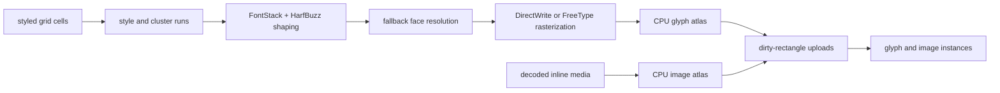
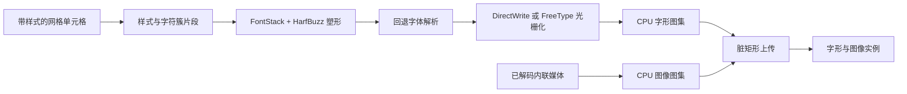

# Rendering and Fonts / 渲染与字体

## English

SonicTerm owns its text pipeline from font discovery through atlas upload. This
page covers font selection, shaping, rasterization, row caches, and the separate
glyph and inline-image atlases. Renderer selection, damage, presentation, and
frame pacing belong to [Rendering Modes](Rendering-Modes). Host-memory bounds
belong to [Memory](Memory).

### Pipeline and ownership



`sonicterm-render-model` is the renderer-independent boundary. For each visible
pane, the app supplies a `PaneRender` with grid, pane rectangle, viewport,
cursor, focus, scrollbar, broadcast, and inline-image state. `RenderInputs`
adds tabs, search, command palette, selection, IME, hovered target,
notifications, and drag state. `sonicterm-gpu` reaches grid, config, and UI type
identities only through that boundary.

The renderer uses non-blocking `try_lock` for every visible pane parser. If any
pane is busy, it defers the frame instead of presenting a mixture of old and new
pane state.

### Font discovery and matching

`sonicterm-engine::FontStack` adapts `sonicterm-font` to the renderer. The
configured primary family defaults to `Rec Mono St.Helens`. Matching includes
family, style, weight, stretch, face index, variation, and codepoint coverage.
Malformed, missing, or out-of-range variable-font metadata falls back to the
base OS/2 weight and width instead of aborting.

Platform discovery stays behind `FontLocator`:

- macOS uses CoreText fallback and font URLs;
- Windows uses DirectWrite/GDI descriptors and raw font extraction;
- other Unix systems use Fontconfig and restrict candidates to monospaced,
  dual-width, or character-cell faces.

The fallback chain includes common monospaced faces, symbol fonts, and color
emoji. If no loaded face covers a codepoint, a background resolver finds a
platform font and appends it to that `FontStack`. Automatic resolution ranks a
font containing an OpenType `MATH` table after text fonts. It does not exclude
that font: it may still supply a codepoint no text font covers. A family named
explicitly in `[font]` remains authoritative whether or not it contains `MATH`.

Packaged font directories remain attached to live and warm renderers across
font reloads. This is required for Linux packages, which carry all four bundled
Rec Mono faces without installing them system-wide.

### Tab-title process icons

When the OS supplies a foreground executable, `normalize_proc_name` takes its
basename across `/` and `\\`, removes one login-shell `-` prefix and one
case-insensitive `.exe` suffix, and lowercases it. The UI then performs an exact
lookup; it does not parse arguments, terminal output, or window titles. An
unknown process uses the folder glyph U+F07B when a working directory is known,
and the terminal glyph U+F489 otherwise.

Foreground-process probing is implemented on macOS and Windows. Linux and other
platforms without a probe report no process name, so the title uses the working-
directory folder glyph or the terminal fallback.

These are Private Use Area codepoints supplied by the bundled Rec Mono faces:

| Application | Exact aliases | Bundled glyph identity | Codepoint |
| --- | --- | --- | --- |
| Claude Code | `claude`, `claude-code` | `md-creation` | U+F0674 |
| GitHub Copilot CLI | `copilot`, `github-copilot`, `github-copilot-cli` | `oct-copilot` | U+F4B8 |
| Zsh | `zsh` | `dev-ohmyzsh` | U+E84F |
| Bash | `bash` | `dev-bash` | U+E760 |
| Fish | `fish` | `fa-fish` | U+EE41 |
| POSIX shell | `sh`, `dash` | `seti-shell` | U+E691 |
| PowerShell | `pwsh`, `powershell` | `cod-terminal-powershell` | U+EBC7 |
| Command Prompt | `cmd` | `cod-terminal-cmd` | U+EBC4 |
| Vim / Neovim | `nvim`, `vim`, `vi`, `nvi` | `custom-vim` | U+E62B |
| Visual Studio Code | `code`, `code-insiders`, `codium`, `vscodium` | `dev-vscode` | U+E8DA |
| Emacs | `emacs`, `emacsclient` | `dev-emacs` | U+E7CF |
| Nano | `nano` | `dev-nano` | U+E838 |
| SSH / Mosh | `ssh`, `mosh` | `md-ssh` | U+F08C0 |
| tmux | `tmux` | `cod-terminal-tmux` | U+EBC8 |
| GNU Screen | `screen` | `cod-screen-full` | U+EB4C |
| Git | `git`, `lazygit`, `tig` | `fa-git` | U+F1D3 |
| GitHub CLI | `gh`, `hub` | `oct-logo-github` | U+F470 |
| GitLab CLI | `glab` | `dev-gitlab` | U+E7EB |
| Rust | `cargo`, `rustc`, `rust-analyzer` | `md-language-rust` | U+F1617 |
| Python | `python`, `python3`, `ipython`, `pip`, `pip3` | `md-language-python` | U+F0320 |
| Go | `go`, `gofmt`, `gopls` | `dev-go` | U+E724 |
| Java | `java`, `javac` | `dev-java` | U+E738 |
| Maven | `mvn`, `mvnw` | `dev-maven` | U+E82C |
| Gradle | `gradle`, `gradlew` | `dev-gradle` | U+E7F2 |
| Ruby | `ruby`, `irb`, `bundle`, `bundler`, `gem`, `rails` | `dev-ruby` | U+E739 |
| PHP | `php`, `php-fpm` | `dev-php` | U+E73D |
| Composer | `composer` | `dev-composer` | U+E783 |
| Lua | `lua`, `luajit` | `dev-lua` | U+E826 |
| Swift | `swift`, `swiftc` | `dev-swift` | U+E755 |
| Zig | `zig` | `dev-zig` | U+E8EF |
| .NET | `dotnet` | `dev-dotnet` | U+E77F |
| Node.js | `node`, `nodejs` | `dev-nodejs` | U+E719 |
| npm | `npm`, `npx` | `dev-npm` | U+E71E |
| pnpm | `pnpm` | `dev-pnpm` | U+E865 |
| Yarn | `yarn`, `yarnpkg` | `dev-yarn` | U+E8EC |
| Deno | `deno` | `dev-denojs` | U+E7C0 |
| Bun | `bun` | `dev-bun` | U+E76F |
| Docker | `docker`, `docker-compose` | `dev-docker` | U+E7B0 |
| Podman | `podman` | `dev-podman` | U+E866 |
| Make | `make`, `gmake` | `md-hammer-wrench` | U+F1323 |
| CMake | `cmake` | `dev-cmake` | U+E794 |
| Ninja | `ninja` | `md-ninja` | U+F0774 |
| Kubernetes | `kubectl`, `k9s`, `minikube` | `dev-kubernetes` | U+E81D |
| Helm | `helm` | `dev-helm` | U+E7FB |
| Terraform / OpenTofu | `terraform`, `tofu`, `opentofu` | `dev-terraform` | U+E8BD |
| Ansible | `ansible`, `ansible-playbook` | `dev-ansible` | U+E723 |
| Pulumi | `pulumi` | `dev-pulumi` | U+E873 |
| AWS CLI | `aws` | `dev-aws` | U+E7AD |
| Azure CLI | `az`, `azure` | `dev-azure` | U+E754 |
| Google Cloud CLI | `gcloud` | `dev-googlecloud` | U+E7F1 |
| Cloudflare | `cloudflared`, `wrangler` | `dev-cloudflare` | U+E792 |
| Vercel | `vercel` | `dev-vercel` | U+E8D3 |
| Netlify | `netlify` | `dev-netlify` | U+E83C |
| PostgreSQL | `psql`, `postgres`, `postmaster` | `dev-postgresql` | U+E76E |
| MySQL | `mysql`, `mysqld` | `dev-mysql` | U+E704 |
| MariaDB | `mariadb`, `mariadbd` | `dev-mariadb` | U+E828 |
| Redis | `redis-cli`, `redis-server`, `redis-sentinel` | `dev-redis` | U+E76D |
| SQLite | `sqlite`, `sqlite3` | `dev-sqlite` | U+E7C4 |
| MongoDB | `mongo`, `mongod`, `mongosh` | `dev-mongodb` | U+E7A4 |

### Shaping and fallback

HarfBuzz shapes style runs into glyph ids, clusters, advances, and offsets.
Clusters are mapped back to terminal columns. Within one cluster, glyph placement
uses the running HarfBuzz pen plus each glyph's horizontal and vertical offsets;
the next cluster resets that pen to its lead terminal cell. Missing clusters are
retried with successive fallback faces; final notdef or replacement output is
used instead of stopping the application.

The printable-ASCII fast path bypasses HarfBuzz only when the run has no
combining extras, wide-cell flags, or common ligature participants. The guarded
characters are:

```text
= ! < > - _ : | & *
```

Combining marks and variation selectors stay with their shaped cluster. Wide
characters and multi-cell ligatures retain their natural advances and offsets.
Fallback replacement glyphs keep the original cluster coordinates.

### Rasterization

Windows uses DirectWrite by default and falls back to FreeType when DirectWrite
cannot rasterize a glyph. macOS and other Unix systems use FreeType. FreeType
supports monochrome, grayscale, LCD subpixel, BGRA color strikes, and
COLR/SVG handoff. HarfBuzz/COLR paint paths use Cairo-backed drawing for layered
color glyphs and linear, radial, and sweep gradients.

`sonicterm-font::{ftwrap,hbwrap,fcwrap}` owns safe lifetimes around raw handles
from the generated FreeType, HarfBuzz, and Fontconfig binding crates. Each
native allocation is paired with its matching destroy function. Embedded bitmap
strikes are loaded metrics-first and checked against the glyph allocation budget
before their pixels are decoded.

Standalone status circles `⏺` (U+23FA), `◯` (U+25EF), and `●` (U+25CF) receive
one targeted fit when the shaped cluster occupies one non-wide cell and has no
combining or variation-selector extras. The tile scales uniformly to the largest
aspect-preserving rectangle inside the cell and is centered on both axes.
Ordinary text, composite clusters, wide glyphs, custom block glyphs, and
multi-cell ligatures keep their natural raster geometry. The same producer-built
rectangle is used by GPU and Windows software presentation.

### Row and shape caches

`RowGlyphCache` stores glyph instances, underlines, missing-glyph records, and
tofu quads under `(pane id, absolute row, row hash)`. `LineQuadCache` stores
background and decoration quads under the matching row identity. Because cached
glyph instances already carry projected screen coordinates, their keys include
pane origin and surface extent as well as cell content, font/style revision, cell
metrics, display scale, atlas generation, and a selection rectangle only when it
intersects that row.

Font, theme, scale, pane identity, atlas reset, or UV generation changes
invalidate the affected entries. A font or DPI change rebuilds the body, footer,
and tab-title font stacks together and invalidates the shared glyph atlas:

- terminal text, command-palette query/results, and ordinary chrome use the
  configured body size;
- command-palette footer text uses `max(body - 1, 1)`;
- tab titles use `body + 1`.

All three stacks use the same family, DPI, and weight scale. Native raster-role
tags keep their atlas entries distinct, so a footer or tab title does not scale
a cached body bitmap.

### Glyph atlas

The CPU `GlyphAtlas` is a fixed 2048×2048 BGRA8 texture, 16 MiB at four bytes
per pixel, with at most 16,384 indexed entries. A shelf packer reuses freed
rectangles before extending shelves. Keys include font slot, glyph id,
character, style, and native raster role.

Insertion follows these rules:

1. a hit updates the entry’s last-used frame;
2. a rasterization miss stores a zero-area sentinel and is not retried every
   frame;
3. spaces use zero-area entries and need no upload;
4. normal, subpixel, and color tiles are copied into BGRA storage;
5. each write records a tight dirty rectangle;
6. under pressure, the coldest quarter is evicted deterministically and
   allocation retries.

Eviction is required for correctness as well as a memory bound: merely refusing
new entries would keep memory flat while later glyphs disappeared. Atlas resets
clear metadata and packing state in place without zeroing the 16 MiB CPU pixel
allocation. Generation and eviction epochs invalidate cached UVs before a new
tile can reuse an old rectangle.

`AtlasUpload::sync` drains dirty rectangles and writes only those BGRA regions
to the GPU texture. A nearest sampler preserves coverage values. On Windows
software presentation, the full CPU atlas remains live while its GPU texture is
a 1×1 placeholder; returning to GPU presentation rebuilds the matching texture,
resets UV-bearing caches, and forces a full redraw.

### Inline images

iTerm2 file images, kitty graphics, and Sixel events are decoded by the app.
Encoded images whose declared width or height exceeds 2,048 pixels, or whose
pixel product exceeds 2,048², are rejected before decode. Accepted iTerm2/kitty
images are resized so the rendered width and height are each at most 1,024
pixels. Sixel decodes directly into a buffer with the same 1,024-pixel side
limit. The result is premultiplied BGRA8.

Decoded images remain owned by their pane. Count and byte retention are bounded
as described in [Memory](Memory). The renderer copies visible images into an
**independent** image atlas, so media pressure cannot evict text glyphs or reuse
text UVs. It starts as a 1×1 CPU/GPU placeholder, promotes to a 2048×2048 atlas
only when renderable media appears, and returns to the placeholder after 240
frames without renderable media. A full image atlas skips older images rather
than evicting text.

### Custom terminal glyphs

Box drawing, block elements, Powerline, Braille, sextants, octants, progress
symbols, and related characters can bypass font fallback. `BlockKey::from_char`
selects geometry and `block_sprite_with_cell_metrics` rasterizes it with
tiny-skia. A reserved font slot prevents collisions with native font glyphs.
The adapted WezTerm implementation is attributed in
`crates/sonicterm-block-glyph/LICENSE-WEZTERM`.

### Code locations

| Topic | Primary paths |
| --- | --- |
| Render boundary | `crates/sonicterm-render-model/src/{pane_render,inputs,geometry}.rs` |
| Renderer font adapter | `crates/sonicterm-engine/src/fontstack.rs` |
| Discovery and matching | `crates/sonicterm-font/src/db.rs`, `crates/sonicterm-font/src/locator/` |
| HarfBuzz shaping | `crates/sonicterm-font/src/shaper/harfbuzz.rs` |
| Rasterization and native wrappers | `crates/sonicterm-font/src/rasterizer/`, `crates/sonicterm-font/src/{ftwrap,hbwrap,fcwrap}.rs` |
| CPU atlas and row cache | `crates/sonicterm-text/src/{glyph_atlas,row_glyph_cache,shape}.rs` |
| Atlas upload and image atlas | `crates/sonicterm-gpu/src/{core,atlas_upload}.rs` |
| Custom glyphs | `crates/sonicterm-block-glyph/src/` |
| Inline-image decode and retention | `crates/sonicterm-app/src/app/media.rs` |

## 中文

SonicTerm 自主管理从字体发现到图集上传的完整文字流水线。本页负责字体选择、塑形、
光栅化、行缓存，以及彼此独立的字形图集和内联图像图集。渲染器选择、损伤区域、呈现和
帧节奏见[渲染模式](Rendering-Modes)，主机内存上限见[内存](Memory)。

### 流水线与所有权



`sonicterm-render-model` 是与渲染器无关的边界。应用为每个可见窗格提供一个
`PaneRender`，其中包含网格、窗格矩形、视口、光标、焦点、滚动条、广播状态和内联图像。
`RenderInputs` 再加入标签页、搜索、命令面板、选区、输入法、悬停目标、通知和拖动状态。
`sonicterm-gpu` 只通过该边界访问网格、配置和界面类型。

渲染器使用非阻塞 `try_lock` 获取所有可见窗格的解析器。只要有一个窗格正忙，就推迟
整帧，而不是显示新旧状态混杂的窗格。

### 字体发现与匹配

`sonicterm-engine::FontStack` 把 `sonicterm-font` 适配给渲染器。默认主字体族是
`Rec Mono St.Helens`。匹配会考虑字体族、样式、字重、字宽、字体面索引、变体和码点
覆盖范围。可变字体元数据损坏、缺失或越界时，会回退到基础 OS/2 字重与字宽，不会中止应用。

平台字体发现隐藏在 `FontLocator` 之后：

- macOS 使用 CoreText 回退与字体 URL；
- Windows 使用 DirectWrite/GDI 描述信息并提取原始字体；
- 其它 Unix 系统使用 Fontconfig，并把候选限制为等宽、双宽或字符单元字体。

回退链包含常见等宽字体、符号字体和彩色表情。已加载字体都不覆盖某码点时，后台解析器
会查找平台字体并追加到该 `FontStack`。自动解析会把带 OpenType `MATH` 表的字体排在
文本字体之后，但不会排除它；没有文本字体覆盖时，数学字体仍可提供该码点。在 `[font]`
中显式指定的字体族始终优先，不受 `MATH` 表影响。

字体重载后，已打包字体目录仍会附着在可见和预热渲染器上。Linux 包不会把随附的四个
Rec Mono face 安装到系统，因此必须保留这些目录。

### 标签页进程图标

操作系统提供前台可执行文件后，`normalize_proc_name` 会按 `/` 和 `\\` 取文件名，去掉
一个登录 shell 的 `-` 前缀和一个不区分大小写的 `.exe` 后缀，再转为小写。界面随后只做
精确匹配，不解析参数、终端输出或窗口标题。未知进程在已有工作目录时使用文件夹字形
U+F07B，否则使用终端字形 U+F489。

前台进程探测只在 macOS 和 Windows 实现。Linux 与其它没有探测实现的平台不会返回
进程名，因此标签页使用工作目录的文件夹字形或终端回退字形。

以下是内置 Rec Mono 字体提供的私用区码点：

| 应用 | 精确别名 | 内置字形名称 | 码点 |
| --- | --- | --- | --- |
| Claude Code | `claude`, `claude-code` | `md-creation` | U+F0674 |
| GitHub Copilot CLI | `copilot`, `github-copilot`, `github-copilot-cli` | `oct-copilot` | U+F4B8 |
| Zsh | `zsh` | `dev-ohmyzsh` | U+E84F |
| Bash | `bash` | `dev-bash` | U+E760 |
| Fish | `fish` | `fa-fish` | U+EE41 |
| POSIX shell | `sh`, `dash` | `seti-shell` | U+E691 |
| PowerShell | `pwsh`, `powershell` | `cod-terminal-powershell` | U+EBC7 |
| Command Prompt | `cmd` | `cod-terminal-cmd` | U+EBC4 |
| Vim / Neovim | `nvim`, `vim`, `vi`, `nvi` | `custom-vim` | U+E62B |
| Visual Studio Code | `code`, `code-insiders`, `codium`, `vscodium` | `dev-vscode` | U+E8DA |
| Emacs | `emacs`, `emacsclient` | `dev-emacs` | U+E7CF |
| Nano | `nano` | `dev-nano` | U+E838 |
| SSH / Mosh | `ssh`, `mosh` | `md-ssh` | U+F08C0 |
| tmux | `tmux` | `cod-terminal-tmux` | U+EBC8 |
| GNU Screen | `screen` | `cod-screen-full` | U+EB4C |
| Git | `git`, `lazygit`, `tig` | `fa-git` | U+F1D3 |
| GitHub CLI | `gh`, `hub` | `oct-logo-github` | U+F470 |
| GitLab CLI | `glab` | `dev-gitlab` | U+E7EB |
| Rust | `cargo`, `rustc`, `rust-analyzer` | `md-language-rust` | U+F1617 |
| Python | `python`, `python3`, `ipython`, `pip`, `pip3` | `md-language-python` | U+F0320 |
| Go | `go`, `gofmt`, `gopls` | `dev-go` | U+E724 |
| Java | `java`, `javac` | `dev-java` | U+E738 |
| Maven | `mvn`, `mvnw` | `dev-maven` | U+E82C |
| Gradle | `gradle`, `gradlew` | `dev-gradle` | U+E7F2 |
| Ruby | `ruby`, `irb`, `bundle`, `bundler`, `gem`, `rails` | `dev-ruby` | U+E739 |
| PHP | `php`, `php-fpm` | `dev-php` | U+E73D |
| Composer | `composer` | `dev-composer` | U+E783 |
| Lua | `lua`, `luajit` | `dev-lua` | U+E826 |
| Swift | `swift`, `swiftc` | `dev-swift` | U+E755 |
| Zig | `zig` | `dev-zig` | U+E8EF |
| .NET | `dotnet` | `dev-dotnet` | U+E77F |
| Node.js | `node`, `nodejs` | `dev-nodejs` | U+E719 |
| npm | `npm`, `npx` | `dev-npm` | U+E71E |
| pnpm | `pnpm` | `dev-pnpm` | U+E865 |
| Yarn | `yarn`, `yarnpkg` | `dev-yarn` | U+E8EC |
| Deno | `deno` | `dev-denojs` | U+E7C0 |
| Bun | `bun` | `dev-bun` | U+E76F |
| Docker | `docker`, `docker-compose` | `dev-docker` | U+E7B0 |
| Podman | `podman` | `dev-podman` | U+E866 |
| Make | `make`, `gmake` | `md-hammer-wrench` | U+F1323 |
| CMake | `cmake` | `dev-cmake` | U+E794 |
| Ninja | `ninja` | `md-ninja` | U+F0774 |
| Kubernetes | `kubectl`, `k9s`, `minikube` | `dev-kubernetes` | U+E81D |
| Helm | `helm` | `dev-helm` | U+E7FB |
| Terraform / OpenTofu | `terraform`, `tofu`, `opentofu` | `dev-terraform` | U+E8BD |
| Ansible | `ansible`, `ansible-playbook` | `dev-ansible` | U+E723 |
| Pulumi | `pulumi` | `dev-pulumi` | U+E873 |
| AWS CLI | `aws` | `dev-aws` | U+E7AD |
| Azure CLI | `az`, `azure` | `dev-azure` | U+E754 |
| Google Cloud CLI | `gcloud` | `dev-googlecloud` | U+E7F1 |
| Cloudflare | `cloudflared`, `wrangler` | `dev-cloudflare` | U+E792 |
| Vercel | `vercel` | `dev-vercel` | U+E8D3 |
| Netlify | `netlify` | `dev-netlify` | U+E83C |
| PostgreSQL | `psql`, `postgres`, `postmaster` | `dev-postgresql` | U+E76E |
| MySQL | `mysql`, `mysqld` | `dev-mysql` | U+E704 |
| MariaDB | `mariadb`, `mariadbd` | `dev-mariadb` | U+E828 |
| Redis | `redis-cli`, `redis-server`, `redis-sentinel` | `dev-redis` | U+E76D |
| SQLite | `sqlite`, `sqlite3` | `dev-sqlite` | U+E7C4 |
| MongoDB | `mongo`, `mongod`, `mongosh` | `dev-mongodb` | U+E7A4 |

### 塑形与回退

HarfBuzz 把样式片段塑形成字形 id、字符簇、推进量和偏移量，再把字符簇映射回终端列。
同一字符簇内的字形位置由 HarfBuzz 的累计笔位置与每个字形的水平、垂直偏移共同决定；
进入下一个字符簇时，笔位置会重置到其首个终端单元格。缺失字符簇会依次尝试回退字体；
最后使用 `.notdef` 或替代字形，不会停止应用。

只有在片段没有组合附加内容、双宽单元格标志或常见连字参与字符时，可打印 ASCII
快速路径才绕过 HarfBuzz。受保护字符为：

```text
= ! < > - _ : | & *
```

组合标记和变体选择符留在所属字符簇中。宽字符和多单元格连字保持自然推进量与偏移量。
替代回退字形会保留原字符簇坐标。

### 光栅化

Windows 默认使用 DirectWrite；DirectWrite 无法光栅化某字形时回退 FreeType。
macOS 和其它 Unix 使用 FreeType。FreeType 支持单色、灰度、LCD 次像素、BGRA 彩色
位图字形，以及 COLR/SVG 交接。HarfBuzz/COLR 绘制路径通过 Cairo 支持分层彩色字形和
线性、径向、扫描渐变。

`sonicterm-font::{ftwrap,hbwrap,fcwrap}` 为生成的 FreeType、HarfBuzz、Fontconfig
绑定中的原始句柄管理安全生命周期。每次原生分配都配对正确的销毁函数。内嵌位图字形
先只加载度量，并在解码像素前检查字形分配预算。

独立状态圆圈 `⏺`（U+23FA）、`◯`（U+25EF）、`●`（U+25CF）只在塑形后的字符簇
占一个非宽单元格，且没有组合字符或变体选择符时进行定向适配。图块按统一比例缩放到
单元格内保持纵横比的最大矩形，并沿两个轴居中。普通文字、复合字符簇、宽字形、自定义
块字形和多单元格连字保持自然光栅几何。GPU 与 Windows 软件呈现共用上游生成的同一矩形。

### 行缓存与塑形缓存

`RowGlyphCache` 按 `(pane id, absolute row, row hash)` 保存字形实例、下划线、缺失字形
记录和缺字方框。`LineQuadCache` 按相同的行身份保存背景与装饰矩形。由于缓存的字形实例
已携带投影后的屏幕坐标，其缓存键除单元格内容、字体/样式修订号、单元格度量、显示缩放、
图集代次及仅在选区与该行相交时加入的选区矩形外，还包含 pane 原点和表面尺寸。

字体、主题、缩放、窗格身份、图集重置或 UV 代次变化都会使相关条目失效。字体或 DPI
变化会一起重建正文、页脚和标签页标题字体栈，并使共享字形图集失效：

- 终端文字、命令面板查询/结果和普通界面文字使用配置的正文大小；
- 命令面板页脚使用 `max(正文 - 1, 1)`；
- 标签页标题使用 `正文 + 1`。

三个字体栈使用相同的字体族、DPI 和字重比例。原生光栅角色标签会分开图集条目，因此
页脚或标签页标题不会缩放已缓存的正文位图。

### 字形图集

CPU `GlyphAtlas` 是固定的 2048×2048 BGRA8 纹理，按每像素四字节计算为 16 MiB，
索引条目最多 16,384 个。分层打包器会先复用已释放矩形，再扩展分层。键包含字体
槽位、字形 id、字符、样式和原生光栅角色。

插入规则如下：

1. 命中时更新条目的最近使用帧；
2. 光栅化失败时保存零面积哨兵，避免每帧重试；
3. 空格使用零面积条目，无需上传；
4. 普通、次像素和彩色图块复制到 BGRA 存储；
5. 每次写入记录紧密脏矩形；
6. 空间紧张时确定性淘汰最冷的四分之一，再重试分配。

淘汰不仅用于限制内存，也是正确性要求；若只是拒绝新条目，内存虽然不再增长，后续字形
却会消失。图集重置会原地清除元数据与打包状态，不会把 16 MiB CPU 像素分配清零。
代次和淘汰纪元 会在新图块复用旧矩形之前使缓存 UV 失效。

`AtlasUpload::sync` 排空脏矩形，只把这些 BGRA 区域写入 GPU 纹理。最近点采样器
保留覆盖值。Windows 软件呈现会保留完整 CPU 图集，但对应 GPU 纹理缩为 1×1 占位符；
回到 GPU 呈现时会重建匹配纹理、重置携带 UV 的缓存，并强制完整重绘。

### 内联图像

iTerm2 文件图像、kitty graphics 和 Sixel 事件由应用解码。声明宽或高超过 2,048 像素，
或像素乘积超过 2,048² 的编码图像，会在解码前拒绝。被接受的 iTerm2/kitty 图像会
缩放到渲染宽高都不超过 1,024 像素。Sixel 直接解码进同样单边上限为 1,024 像素的
缓冲。结果使用预乘 BGRA8。

已解码图像仍由所属窗格拥有；数量和字节上限见[内存](Memory)。渲染器把可见图像复制到
**独立**图像图集，因此媒体压力不能淘汰文字字形，也不能复用文字 UV。图像图集以 1×1
CPU/GPU 占位符启动，仅在出现可渲染媒体时提升为 2048×2048；连续 240 帧没有可渲染
媒体后再降回占位符。图像图集填满时跳过较早图像，不会淘汰文字。

### 自定义终端字形

方框线、块元素、Powerline、Braille、六分块、八分块、进度符号等字符可以绕过字体回退。
`BlockKey::from_char` 选择几何，`block_sprite_with_cell_metrics` 使用 tiny-skia 光栅化。
保留的字体槽位可避免与原生字体字形冲突。从 WezTerm 适配的实现署名保存在
`crates/sonicterm-block-glyph/LICENSE-WEZTERM`。

### 代码位置

| 主题 | 主要路径 |
| --- | --- |
| 渲染边界 | `crates/sonicterm-render-model/src/{pane_render,inputs,geometry}.rs` |
| 渲染器字体适配 | `crates/sonicterm-engine/src/fontstack.rs` |
| 发现与匹配 | `crates/sonicterm-font/src/db.rs`、`crates/sonicterm-font/src/locator/` |
| HarfBuzz 塑形 | `crates/sonicterm-font/src/shaper/harfbuzz.rs` |
| 光栅化与原生包装 | `crates/sonicterm-font/src/rasterizer/`、`crates/sonicterm-font/src/{ftwrap,hbwrap,fcwrap}.rs` |
| CPU 图集与行缓存 | `crates/sonicterm-text/src/{glyph_atlas,row_glyph_cache,shape}.rs` |
| 图集上传与图像图集 | `crates/sonicterm-gpu/src/{core,atlas_upload}.rs` |
| 自定义字形 | `crates/sonicterm-block-glyph/src/` |
| 内联图像解码与保留 | `crates/sonicterm-app/src/app/media.rs` |
