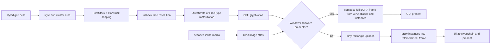
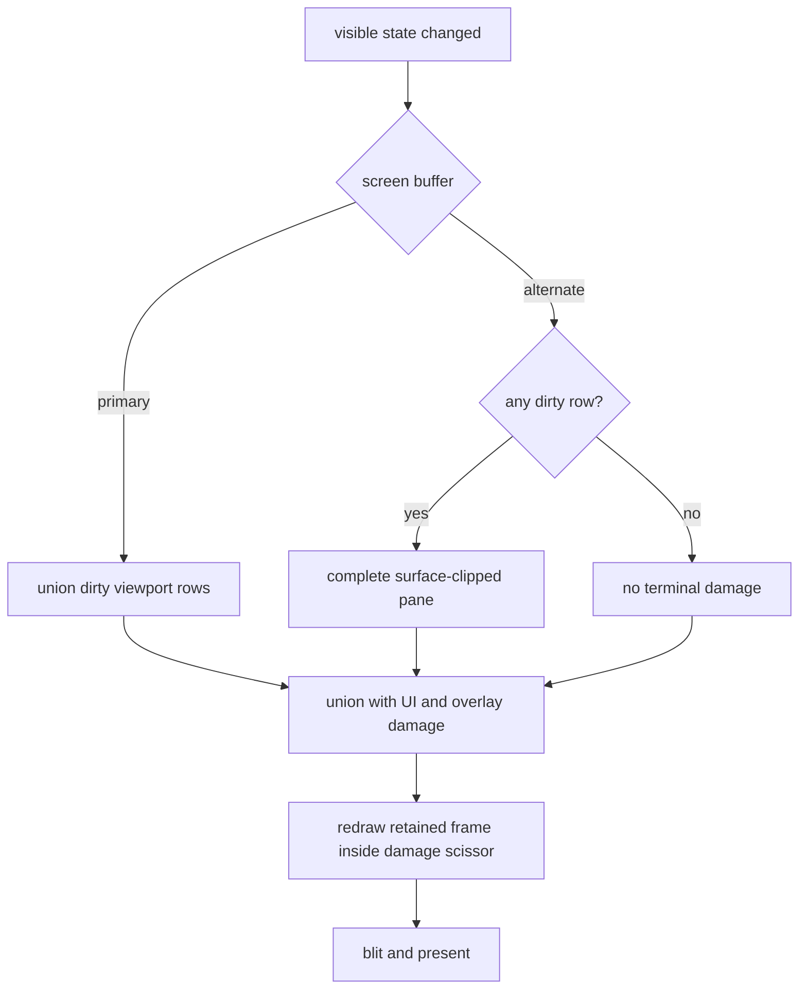
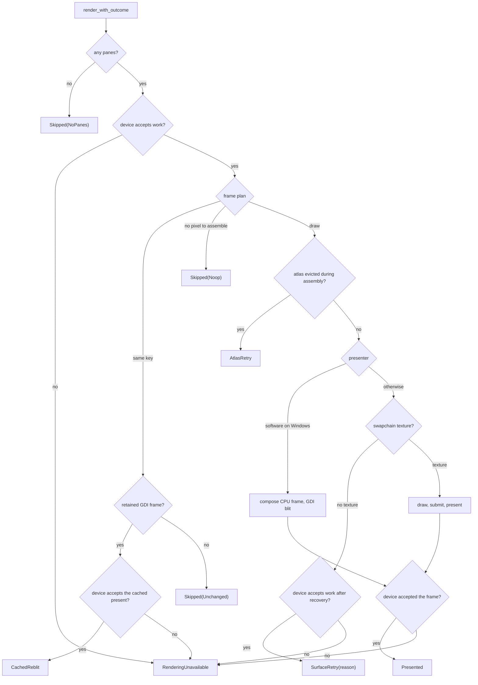

# Rendering and Fonts

[简体中文](Rendering-and-Fonts-zh-CN)

Follow styled cells through fonts, atlases, GPU/CPU drawing, and retained-frame
damage. For adapter selection and pacing, see [Rendering Modes](Rendering-Modes);
for allocation limits and accounting, see [Memory](Memory).

### Pipeline and ownership



`sonicterm-render-model` is the renderer-independent boundary. For each visible
pane, the app supplies a `PaneRender` with grid, pane rectangle, viewport,
cursor, focus, scrollbar, broadcast, and inline-image state. Production passes
UI state as explicit arguments; `RenderInputs` remains a public compatibility
type, not the production entrypoint. `sonicterm-gpu` reaches grid, config, and UI
types only through that boundary.

The app uses non-blocking `try_lock` for every visible pane parser. If any pane
is busy, it defers the frame instead of presenting a mixture of old and new pane
state. The renderer's metadata-only `FramePlan` fixes clips and viewport row
slots before shaping; execution keeps the borrowed grids and parser guards,
and CPU atlas/cache mutation remains stateful.

### Complete-row alignment

Each pane moves only the leftover fraction of a terminal row above its text grid,
keeping complete rows against configured bottom padding. The offset uses whole
physical pixels, so a subpixel remainder may stay below. Font size, line height,
PTY dimensions, and configured padding are unchanged. A resource-limited smaller
grid does not absorb whole unused rows; a grid already taller than its truncated
pixel rectangle is not shifted farther down.

Text backgrounds, glyphs, cursor, selection, links, inline media, and terminal IME
share the planned grid origin. Pane chrome, focus flash, scrollbars, splitters,
and the bottom tab bar retain their unshifted geometry. Margins do not address a
terminal cell. Resize, DPI, font, and padding changes invalidate the old layout.

### Font discovery and matching

`sonicterm-engine::FontStack` adapts `sonicterm-font` to the renderer. The
configured primary family defaults to `Rec Mono St.Helens`. Matching includes
family, style, weight, stretch, face index, variation, and codepoint coverage.
Malformed, missing, or out-of-range variable-font metadata falls back to the
base OS/2 weight and width instead of aborting.

Platform discovery stays behind `FontLocator`:

- macOS uses CoreText fallback and font URLs;
- Windows uses DirectWrite/GDI descriptors and raw font extraction;
- other Unix systems use Fontconfig and restrict candidates to monospaced,
  dual-width, or character-cell faces.

After the configured primary family, the code-owned fallback list tries
JetBrains Mono, Symbols Nerd Font Mono, and Noto Color Emoji. If no loaded face
covers a codepoint, a background resolver finds a
platform font and appends it to that `FontStack`. Automatic resolution ranks a
font containing an OpenType `MATH` table after text fonts. It does not exclude
that font: it may still supply a codepoint no text font covers. A family named
explicitly in `[font]` remains authoritative whether or not it contains `MATH`.

Packaged font directories remain attached to live and warm renderers across
font reloads. This is required for Linux packages, which carry all four bundled
Rec Mono faces without installing them system-wide.

### Tab-title process icons

Manual titles win. Otherwise a nonempty raw OSC title wins for foreground `rmux`,
`tmux`, or `screen` even when CWD is present; other processes retain CWD-first
automatic titles. The icon lookup below uses only the executable identity.

When the OS supplies a foreground executable, `normalize_proc_name` takes its
basename across `/` and `\\`, removes one login-shell `-` prefix and one
case-insensitive `.exe` suffix, and lowercases it. The UI then performs an exact
lookup; it does not parse arguments, terminal output, or window titles. An
unknown process uses the folder glyph U+F07B when a working directory is known,
and the terminal glyph U+F489 otherwise.

Foreground-process probing is implemented on macOS and Windows. Linux and other
platforms without a probe report no process name, so the title uses the working-
directory folder glyph or the terminal fallback.

When the SonicTerm process itself has elevated operating-system privilege, every
tab also shows a separate, non-animated lock badge. Windows derives that global
state from the current process token; macOS and Linux use effective user ID zero.
A regular Windows SonicTerm also shows the badge only on a tab whose current
foreground descendant has an elevated token. The existing 500 ms foreground
process cache refreshes active and inactive tab state from one shared process-table
snapshot per window; it recognizes the actual `gsudo.exe` broker in the selected
descendant path when UIPI prevents direct access to its high-integrity child token.
Accepted input guarantees a sample 500 ms later, and while a per-tab warning is
visible fixed 500 ms samples clear it after control returns to the regular shell;
unchanged samples do not repaint and idle tabs do not poll.

The badge is vector chrome built from quads, not a font glyph or title character.
Its background uses the theme's ANSI danger red and its lock geometry selects
black or white for linear-light contrast, so active, inactive, hovered,
custom-colored, light, dark, and high-contrast tabs keep the same warning
treatment. A dragged source tab applies the normal source alpha to the complete
badge.

The badge never replaces or recolors the foreground-process icon. It is not stored
in `Tab.title`, `auto_title`, or `custom_title`, so OSC titles and manual renames
cannot remove or persist it. Privileged layout reserves the badge width and gap
before shortening only the title suffix; the `#N` identity and process icon remain
at the front whenever they fit. Main and torn-out windows paint the same
process-level state through both GPU and Windows software rendering. This tab
chrome does not modify executable resources, native window icons, taskbar, Dock,
application-switcher, or package icons.

These are Private Use Area codepoints supplied by the bundled Rec Mono faces:

| Application | Exact aliases | Bundled glyph identity | Codepoint |
| --- | --- | --- | --- |
| Claude Code | `claude`, `claude-code` | `md-creation` | U+F0674 |
| GitHub Copilot CLI | `copilot`, `github-copilot`, `github-copilot-cli` | `oct-copilot` | U+F4B8 |
| Zsh | `zsh` | `dev-ohmyzsh` | U+E84F |
| Bash | `bash` | `dev-bash` | U+E760 |
| Fish | `fish` | `fa-fish` | U+EE41 |
| POSIX shell | `sh`, `dash` | `seti-shell` | U+E691 |
| PowerShell | `pwsh`, `powershell` | `cod-terminal-powershell` | U+EBC7 |
| Command Prompt | `cmd` | `cod-terminal-cmd` | U+EBC4 |
| Vim / Neovim | `nvim`, `vim`, `vi`, `nvi` | `custom-vim` | U+E62B |
| Visual Studio Code | `code`, `code-insiders`, `codium`, `vscodium` | `dev-vscode` | U+E8DA |
| Emacs | `emacs`, `emacsclient` | `dev-emacs` | U+E7CF |
| Nano | `nano` | `dev-nano` | U+E838 |
| SSH / Mosh | `ssh`, `mosh` | `md-ssh` | U+F08C0 |
| tmux | `tmux` | `cod-terminal-tmux` | U+EBC8 |
| GNU Screen | `screen` | `cod-screen-full` | U+EB4C |
| Git | `git`, `lazygit`, `tig` | `fa-git` | U+F1D3 |
| GitHub CLI | `gh`, `hub` | `oct-logo-github` | U+F470 |
| GitLab CLI | `glab` | `dev-gitlab` | U+E7EB |
| Rust | `cargo`, `rustc`, `rust-analyzer` | `md-language-rust` | U+F1617 |
| Python | `python`, `python3`, `ipython`, `pip`, `pip3` | `md-language-python` | U+F0320 |
| Go | `go`, `gofmt`, `gopls` | `dev-go` | U+E724 |
| Java | `java`, `javac` | `dev-java` | U+E738 |
| Maven | `mvn`, `mvnw` | `dev-maven` | U+E82C |
| Gradle | `gradle`, `gradlew` | `dev-gradle` | U+E7F2 |
| Ruby | `ruby`, `irb`, `bundle`, `bundler`, `gem`, `rails` | `dev-ruby` | U+E739 |
| PHP | `php`, `php-fpm` | `dev-php` | U+E73D |
| Composer | `composer` | `dev-composer` | U+E783 |
| Lua | `lua`, `luajit` | `dev-lua` | U+E826 |
| Swift | `swift`, `swiftc` | `dev-swift` | U+E755 |
| Zig | `zig` | `dev-zig` | U+E8EF |
| .NET | `dotnet` | `dev-dotnet` | U+E77F |
| Node.js | `node`, `nodejs` | `dev-nodejs` | U+E719 |
| npm | `npm`, `npx` | `dev-npm` | U+E71E |
| pnpm | `pnpm` | `dev-pnpm` | U+E865 |
| Yarn | `yarn`, `yarnpkg` | `dev-yarn` | U+E8EC |
| Deno | `deno` | `dev-denojs` | U+E7C0 |
| Bun | `bun` | `dev-bun` | U+E76F |
| Docker | `docker`, `docker-compose` | `dev-docker` | U+E7B0 |
| Podman | `podman` | `dev-podman` | U+E866 |
| Make | `make`, `gmake` | `md-hammer-wrench` | U+F1323 |
| CMake | `cmake` | `dev-cmake` | U+E794 |
| Ninja | `ninja` | `md-ninja` | U+F0774 |
| Kubernetes | `kubectl`, `k9s`, `minikube` | `dev-kubernetes` | U+E81D |
| Helm | `helm` | `dev-helm` | U+E7FB |
| Terraform / OpenTofu | `terraform`, `tofu`, `opentofu` | `dev-terraform` | U+E8BD |
| Ansible | `ansible`, `ansible-playbook` | `dev-ansible` | U+E723 |
| Pulumi | `pulumi` | `dev-pulumi` | U+E873 |
| AWS CLI | `aws` | `dev-aws` | U+E7AD |
| Azure CLI | `az`, `azure` | `dev-azure` | U+E754 |
| Google Cloud CLI | `gcloud` | `dev-googlecloud` | U+E7F1 |
| Cloudflare | `cloudflared`, `wrangler` | `dev-cloudflare` | U+E792 |
| Vercel | `vercel` | `dev-vercel` | U+E8D3 |
| Netlify | `netlify` | `dev-netlify` | U+E83C |
| PostgreSQL | `psql`, `postgres`, `postmaster` | `dev-postgresql` | U+E76E |
| MySQL | `mysql`, `mysqld` | `dev-mysql` | U+E704 |
| MariaDB | `mariadb`, `mariadbd` | `dev-mariadb` | U+E828 |
| Redis | `redis-cli`, `redis-server`, `redis-sentinel` | `dev-redis` | U+E76D |
| SQLite | `sqlite`, `sqlite3` | `dev-sqlite` | U+E7C4 |
| MongoDB | `mongo`, `mongod`, `mongosh` | `dev-mongodb` | U+E7A4 |

### Shaping and fallback

HarfBuzz shapes style runs into glyph ids, clusters, advances, and offsets.
Clusters are mapped back to terminal columns. Within one cluster, glyph placement
uses the running HarfBuzz pen plus each glyph's horizontal and vertical offsets;
the next cluster resets that pen to its lead terminal cell. Missing clusters are
retried with successive fallback faces; final notdef or replacement output is
used instead of stopping the application.

The printable-ASCII fast path bypasses HarfBuzz only when the run has no
combining extras, wide-cell flags, or common ligature participants. The guarded
characters are:

```text
= ! < > - _ : | & *
```

Combining marks and variation selectors stay with their shaped cluster. Wide
characters and multi-cell ligatures retain their natural advances and offsets.
Fallback replacement glyphs keep the original cluster coordinates.

Windows system fallback encodes complete UTF-16 and counts mapping positions,
remaining lengths, and locale spans in code units. Supplementary characters stay
as surrogate pairs. Zero, out-of-range, or split-surrogate mapping progress
fails the entire native fallback request without returning partial candidates;
the caller reports failure and continues its remaining configured locators.
Successful requests return candidates deduplicated in first-encounter order.

Raw shaping text and collections use the explicit `sonicterm_font::payload`
TRACE target. Opt-in sinks can record them; crash history cannot. Safe fallback
errors retain stage and size/count diagnostics rather than the affected text.
White foreground and untinted color glyphs are normal rendering and produce no
routine per-glyph warning. Genuine atlas and presentation diagnostics remain.

Bold and italic select a face. Foreground color does not split shaping runs.
After shaping, the renderer resolves theme defaults, 256-color indices, and
24-bit RGB. Inverse swaps foreground and background. Dim blends foreground 45%
toward the effective background in stored sRGB-encoded space before draw values
are converted as required for the sRGB surface or CPU blend.

Backgrounds are quads, not glyphs. Adjacent equal non-default backgrounds are
coalesced. The default background comes from the damage clear. Underline runs
become single, double, curly, dotted, or dashed quads. An explicit SGR 58 color
wins; otherwise underline uses foreground color. GPU line endpoints travel in
geometry parameters separate from HSV color transforms, so a curly underline's
shape cannot alter its resolved color.

The parser stores blink, hidden, and strikethrough flags. The current terminal
renderer has no flag-specific draw branch for those three.

### Rasterization

Windows uses DirectWrite natural-symmetric ClearType rasterization with grid
fitting disabled, preserving outline alignment instead of independently snapping
font hints. Color-capable faces use the existing FreeType color path rather than
losing their artwork in a ClearType mask; other DirectWrite failures also fall
back to FreeType. macOS and other Unix systems use FreeType. FreeType
supports monochrome, grayscale, LCD subpixel, BGRA color strikes, and
COLR/SVG handoff. HarfBuzz/COLR paint paths use Cairo-backed drawing for layered
color glyphs and linear, radial, and sweep gradients. A gradient whose color
line carries no usable stop paints nothing, and sweep tiling is bounded, so a
malformed or extreme color line degrades to a coarse approximation rather than
unbounded work.

`sonicterm-font::{ftwrap,hbwrap,fcwrap}` owns safe lifetimes around raw handles
from the generated FreeType, HarfBuzz, and Fontconfig binding crates. Each
native allocation is paired with its matching destroy function. Embedded bitmap
strikes are loaded metrics-first and checked against the glyph allocation budget
before their pixels are decoded.

BGRA color bitmaps crop to half-open nontransparent bounds, preserving the final
ink row and column. Crop origin translates bearings by `+crop_x` and `-crop_y`,
not by a size ratio. Owned channel conversion, premultiplication, color/scaled
flags, and allocation caps are unchanged. A fully transparent nonempty bitmap
keeps its original dimensions and bearings and remains a valid blank glyph
through FontStack and atlas insertion, not a missing-glyph sentinel.

Standalone status circles `⏺` (U+23FA), `◯` (U+25EF), and `●` (U+25CF) receive
one targeted fit when the shaped cluster occupies one non-wide cell and has no
combining or variation-selector extras. The tile scales uniformly to the largest
aspect-preserving rectangle inside the cell and is centered on both axes.
Ordinary text, composite clusters, wide glyphs, custom block glyphs, and
multi-cell ligatures keep their natural raster geometry. The same producer-built
rectangle is used by GPU and Windows software presentation.

### Native source versions and configuration

The source-pinned stack is FreeType 2.14.3, HarfBuzz 14.4.0, libpng 1.6.58,
and zlib 1.3.2. The vendored FreeType carries two upstream excess-variable-coordinate
fixes; the vendored zlib carries the upstream invalid-distance `inflateBack`
correction and three related nonblocking gzip-writing fixes. Those fixes are
already present in the imported sources rather than applied at build time. The
exact release commits, archive SHA-256 values, selected paths, the upstream
revision and URL of each carried fix, and the resulting source-tree hashes are in
`scripts/native-dependencies.json`. The headers report the base releases, not the
additional fix revisions. Cairo remains an external platform dependency;
this inventory does not pin Cairo or imply a self-contained macOS bundle.

FreeType configuration is generated outside the vendored tree. It enables error
strings, external zlib, PNG glyphs, long PCF family names, subpixel rendering,
and the supported boolean subpixel-hinting option. Missing, repeated, or
unexpectedly valued definitions fail the build; a C compilation probe also
checks that preprocessing leaves each option enabled. The removed historical
numeric hinting transformation is not restored. Cargo watches the native source
and configuration inputs; builds neither fetch sources nor initialize submodules.

The checked-in Rust bindings are regenerated with bindgen-cli 0.71.1. Both
regeneration scripts use the native build's configuration generator and put its
header before upstream includes, so bindgen and the compiled library see the same
FreeType options. Regeneration preserves fixed-width integer overrides, fixed-point wrappers, explicit unsafe
blocks, and sibling test declarations. Native version tests check the actually
linked FreeType/HarfBuzz releases, including the unsigned FreeType span ABI.
Update and verification commands are in
[Development and Release](Development-and-Release#native-dependency-maintenance).

### Row and shape caches

`RowGlyphCache` stores glyph instances, underlines, missing-glyph records, and
tofu quads under `(pane id, absolute row, row hash)`. `LineQuadCache` stores one
background/decoration projection per `(pane id, absolute row)`, with a validity
hash that includes its viewport row slot. A slot change reprojects that row and
replaces its prior value instead of consuming another cache entry. Same-slot
repaints can hit; absolute dirty-row invalidation remains pane-local, and the
existing capacity bound and new-row eviction policy remain unchanged. Because
cached glyph instances already carry projected screen coordinates, their keys include
pane origin and surface extent as well as cell content, font/style revision, cell
metrics, display scale, atlas content identity, and a selection rectangle only
when it intersects that row.

Font, theme, scale, pane identity, atlas reset, or atlas content-identity changes
invalidate the affected entries. A font or DPI change rebuilds the body, footer,
and tab-title font stacks together and invalidates the shared glyph atlas:

- terminal text, command-palette query/results, and ordinary chrome use the
  configured body size;
- command-palette footer and category/availability subtitles use `max(body - 1, 1)`;
- tab titles use `body + 1`.

All three stacks use the same family, DPI, and weight scale. Native raster-role
tags keep their atlas entries distinct, so a footer or tab title does not scale
a cached body bitmap.

Both row caches hold about four times total visible rows; capacity/geometry
changes clear the affected cache. Dirty rows invalidate absolute entries.
`remove_pane` evicts that pane's glyph then quad rows, preserving peers and
requesting table compaction. Current allocation includes table and nested-vector
capacity, not merely live lengths.

Font changes rebuild stacks, reset glyph metadata, and invalidate both row caches
and `FrameKey`. DPI changes also rebuild matching atlas uploads. Theme changes
advance style revision and mark all pane rows dirty. Accepted surface resize
replaces the retained texture and invalidates both row caches/key before grid/PTY
resize. Topology fields change the next key; topology alone does not clear rows.
Per-frame cursor, selection, search, quick-select, IME, palette, and notification
overlays are assembled separately.

### Glyph atlas

The CPU `GlyphAtlas` is a fixed 2048×2048 BGRA8 texture, 16 MiB at four bytes
per pixel, with at most 16,384 indexed entries. A shelf packer reuses freed
rectangles before extending shelves. Keys include font slot, glyph id,
character, style, and native raster role.

Insertion follows these rules:

1. a hit updates the entry’s last-used frame;
2. a rasterization miss stores a zero-area sentinel and is not retried every
   frame;
3. spaces use zero-area entries and need no upload;
4. normal, subpixel, and color tiles are copied into BGRA storage;
5. each write records a tight dirty rectangle;
6. under pressure, the coldest quarter is evicted deterministically and
   allocation retries.

Eviction is required for correctness as well as a memory bound: merely refusing
new entries would keep memory flat while later glyphs disappeared. Atlas resets
clear metadata and packing state in place without zeroing the 16 MiB CPU pixel
allocation. A monotonic content identity changes on every reset or eviction and
invalidates cached UVs before a new tile can reuse an old rectangle.

The CPU atlas contract distinguishes pixel meaning: monochrome and DirectWrite
subpixel tiles are linear coverage masks, while self-colored glyph pixels are
premultiplied sRGB-encoded BGRA8. Every write records a tight dirty rectangle as
`Coverage` or `Color`; a replacement in an evicted slot supersedes stale
intersecting records so the newest bytes cannot be interpreted with the prior
tile's kind. Synchronization coalesces only same-kind rectangles. It copies
coverage bytes unchanged and converts only color rectangles from encoded
premultiplication to the storage values that an sRGB view decodes as
premultiplied linear color. The CPU bytes are never rewritten.

One `Bgra8Unorm` glyph texture exposes both views without duplicating the pixel
payload. Its bind group pairs the unorm coverage view and sRGB color view with
nearest samplers. Ordinary glyphs, including subpixel-tagged instances, select
the coverage view; color-glyph instances select the color view. The instance
flags remain unchanged: `flags.x` selects self-colored glyphs and `flags.y`
preserves the DirectWrite subpixel marker. On Windows software presentation, the
full original CPU atlas remains live while its GPU texture is a 1×1 placeholder;
returning to GPU presentation rebuilds the matching texture, resets UV-bearing
caches, and forces a full redraw.

DirectWrite emits logical red, green, and blue ClearType coverage. SonicTerm
preserves those native coverage bytes without a hidden contrast curve; the
explicit `weight_scale` control is the only monochrome coverage adjustment.
Face selection happens first; regular, bold, italic, bold-italic, and monochrome
fallback glyphs then use the same adjustment. At fixed size and DPI, weight
changes preserve cell pitch, baseline, bitmap dimensions, bearings, and advances.
Different faces retain their natural ink shapes; color artwork is never reweighted.
The maximum channel is stored in alpha. The engine changes the byte layout from
RGBA to BGRA for the CPU atlas but does not perform a color-space conversion. With
`[font].subpixel_aa = "off"`, both presenters use the stored alpha maximum as one
grayscale coverage value. `rgb` maps the logical channels to matching display
channels; `bgr` reverses red and blue. The GPU path samples the unorm coverage
view and uses dual-source blending for independent destination-channel
attenuation. The Windows software path reads the original BGRA bytes and applies
the same operation in linear light. Color glyphs and inline images take
precedence over the subpixel marker and never enter this branch or the coverage
view. Both presenters instead convert their premultiplied encoded color texels
to premultiplied linear RGBA before nearest or bilinear sampling, composite in
linear light, and encode RGB once at output. The mode is presentation state, so
changing it invalidates the frame but keeps font stacks, raster tiles, and
atlases intact.

Software glyphs use one stabilized destination-pixel origin for one-to-one and
resampled axes. Nearest sampling stays inside the glyph tile; top/left clipping
advances past hidden source rows/columns. Sharp, rounded, and line quads all use
finite premultiplied linear RGBA (`0 ≤ RGB ≤ alpha ≤ 1`); opacity or mask
coverage scales RGB and alpha together.

### Windows LCD subpixel policy

`[font].subpixel_aa` accepts `off`, `rgb`, and `bgr`; the default is `off`.
SonicTerm resolves a non-off request to LCD presentation only when all of these
conditions hold:

- the host is Windows;
- the configured backdrop selects an opaque hardware alpha mode;
- effective terminal background opacity is `1`;
- the final presenter is Windows CPU/GDI, or the wgpu device supports
  `DUAL_SOURCE_BLENDING`.

Mica, Acrylic, Tabbed, opacity below `1`, unsupported GPU devices, and
non-Windows hosts therefore use grayscale deterministically. A software-present
override does not make a configured transparent backdrop LCD-eligible merely
because the GDI swapchain itself is forced opaque.

On Windows, device creation requests `DUAL_SOURCE_BLENDING` only when the
adapter advertises it. No optional LCD feature is requested on other hosts. The
feature is negotiated when the shared device is created so `off` can change to
`rgb` or `bgr` live without recreating the device. The effective mode is part of
the retained frame key; changing the request invalidates and redraws the frame
without rebuilding fonts or either atlas.

For one subpixel sample, `coverage` is logical RGB coverage (or R/B-swapped for
`bgr`) and `foreground` is the transformed premultiplied linear foreground:

```text
weights.rgb = coverage.rgb * foreground.a
source.rgb = foreground.rgb * coverage.rgb
source.a = max(weights.r, weights.g, weights.b)
destination.rgb *= 1 - weights.rgb
destination.a *= 1 - source.a
```

The GPU pipeline emits source color and destination attenuation as the two blend
sources. Its non-LCD branches emit scalar alpha as the second source, preserving
ordinary source-over for monochrome text, color glyphs, images, and quads. The
Windows CPU presenter decodes the sRGB BGRA destination, applies the same
per-channel equation in linear light, then encodes RGB once. `off` uses the
subpixel tile's stored alpha maximum as grayscale coverage.

### Inline images

iTerm2 file images, kitty graphics, and Sixel events are decoded by the app.
Encoded images whose declared width or height exceeds 2,048 pixels, or whose
pixel product exceeds 2,048², are rejected before decode. Accepted iTerm2/kitty
images are resized so the rendered width and height are each at most 1,024
pixels. Sixel decodes directly into a buffer with the same 1,024-pixel side
limit. The result is premultiplied sRGB-encoded BGRA8: RGB is encoded and already
multiplied by the linear alpha channel.

Decoded images remain owned by their pane. Count and byte retention are bounded
as described in [Memory](Memory). The renderer copies visible images into an
**independent** image atlas, so media pressure cannot evict text glyphs or reuse
text UVs. Image visibility is the intersection of its destination, its owning
pane's actual content rectangle after padding, and the surface. Image clipping
does not use the cell-layout minimum: a padding-exhausted pane has an empty image
clip, even if its grid still has one cell. The same visibility check controls
atlas residency and emission; fully clipped or undecoded images neither promote
the atlas nor allocate tiles. Clipping preserves original position and scale,
and carries visible destination/UVs separately from the original packed tile's
sample bounds. Both presenters interpolate at pixel centers, including fractional
native-size placement, and clamp taps to the original tile rather than the pane
cut. No cropped decoded-image copy is allocated; painter order and atlas limits
are unchanged.

During dirty-rectangle packing for GPU upload, each nontransparent
pixel is unpremultiplied in encoded space, clamped, decoded through the sRGB
transfer function, premultiplied by alpha in linear light, and re-encoded for
storage; transparent pixels become `[0, 0, 0, 0]`, and alpha is unchanged. The
CPU bytes are never rewritten. Windows software presentation converts each
selected texel with the same zero-alpha canonicalization and
unpremultiply/clamp/decode/repremultiply operation, then filters the resulting
premultiplied linear taps. The one GPU `Bgra8Unorm` texture is sampled through
its sRGB color view with linear filtering; hardware decoding likewise occurs
before bilinear filtering. Both presenters use the same texel-center convention
and clamp to the current image tile so adjacent packed tiles cannot bleed into
its edges. They composite in linear light and encode RGB once at output. The
atlas starts as
a 1×1 CPU/GPU placeholder, promotes to a 2048×2048 atlas only when renderable
media appears, and returns to the placeholder after 240 frames without renderable
media. A full image atlas skips older images rather than evicting text.

### Retained pixels and damage

Both presenters bound frames to 16,384 pixels per side and 160 MiB of BGRA;
wgpu also applies `max_texture_dimension_2d`. Invalid initial geometry fails
construction. A rejected `try_resize` returns `false` and retains the usable
surface; `WindowsSoftwareFrame::new`/`prepare` reject invalid CPU frames before
allocation. A `GlyphInstance` stores an NDC rectangle, UVs, linear foreground
modulation, and color/subpixel/image-atlas flags.

Damage is a correctness boundary, not only an optimization. Every VT/grid
mutation must mark the affected rows in the same update.



A primary-screen pane can repaint the union of dirty viewport rows. Row bounds
use floor/ceil rules at fractional DPI so adjacent rows leave no seam, then
expand vertically by one native font-cell height so glyph bearings, positioned
marks, and compressed line spacing cannot leave ink outside the retained-frame
scissor. The expansion remains pane- and surface-clipped. If an alternate-screen
pane has any dirty row, the complete surface-clipped pane is damaged. This covers
TUI scrolling, insert/delete line, reverse index, erase, and other fixed-position
updates where a narrow row set can otherwise leave stale pixels.

The offscreen frame uses one attachment clear on first use or full-surface
replacement, without a second background reset draw. Partial damage loads the
retained frame, then replaces the damaged pixels with the premultiplied background
through a non-blending reset under the damage scissor. Reset and content share one
buffer upload with separate draw ranges; ordinary content retains source-over
and LCD text retains dual-source blending. Transparent resets erase old ink
without accumulating alpha or changing pixels outside damage, and do not need a
later redraw to finish. After the reset, GPU content draws in this order:

```text
base quads -> inline images -> base glyphs -> overlay quads -> overlay glyphs
```

A scissor limits redraw to the damage rectangle. The renderer’s
`wgpu::util::TextureBlitter` copies the retained frame to the swapchain before
submit and present. The surface format is fixed to
`TextureFormat::Bgra8UnormSrgb`; colors are converted to linear values before
shader use so the sRGB target performs the only gamma encoding.

### Presentation outcomes

`GpuRenderer::render_with_outcome` reports every frame as a `PresentOutcome`.
`present.rs` hands the frame's layers to exactly one presenter: GDI when
software-render degradation is enabled on Windows, otherwise the wgpu swapchain
presenter. The render body has no presenter `cfg` branches.



| Outcome | When | `render` result |
| --- | --- | --- |
| `Skipped(NoPanes)` | The caller supplied no pane. | `Ok(())` |
| `Skipped(Unchanged)` | The frame plan matches the retained frame key. | `Ok(())` |
| `Skipped(Noop)` | Software rendering found no pixel that needs new assembly. | `Ok(())` |
| `CachedReblit` | The plan is unchanged, and the GDI presenter reblitted its retained CPU frame with the device accepting work before and after the blit. | `Ok(())` |
| `AtlasRetry` | The glyph atlas recycled a tile during assembly; it was rebuilt and another frame requested. | `Ok(())` |
| `SurfaceRetry(reason)` | The surface timed out, was occluded, outdated, suboptimal, or lost while the device still accepted work. | `Ok(())` |
| `RenderingUnavailable` | The device stopped accepting work; the outcome carries its generation, gate reading, and whether it reports the stop. | `Err` only when it reports the stop |
| `Presented` | The frame passed the presentation boundary and its plan was acknowledged. | `Ok(())` |
| `Failed(error)` | A fallible step failed, such as software-frame allocation, the GDI blit, or surface recreation. | `Err(error)` |

Only `Presented` advances `successful_frame_count` and acknowledges the plan;
every other outcome keeps its dirty rows. A cached reblit still increments
`present_call_count`, but never acknowledges a new plan. Its device checks run
before and after GDI; a stopped reblit returns before any focus-flash redraw.
For wgpu, `Presented` means submission/present invocation passed the device
checks, not proof of later physical scanout. Surface loss is not device loss: once
the device has stopped, a surface result is reported as `RenderingUnavailable`.
A reconfigured or recreated surface on a stopped device reports the stop at once
and requests no redraw; a timed-out or occluded surface still requests the next
redraw and leaves the one-time stop report to that frame's device check. After a
surface retry, the renderer itself requests the next redraw.

`GpuRenderer::render` keeps its `Result<()>` signature: it runs
`render_with_outcome` and maps the outcome through
`PresentOutcome::into_render_result`. The main-window and child-window redraw
paths call `render_with_outcome` and apply the same mapping, so their logging and
runtime smoke checks see the results that `render` returns.

### Custom terminal glyphs

Box drawing, block elements, Powerline, Braille, sextants, octants, progress
symbols, and related characters can bypass font fallback. `BlockKey::from_char`
selects geometry and `block_sprite_with_cell_metrics` rasterizes it with
tiny-skia. A reserved font slot prevents collisions with native font glyphs.
The adapted WezTerm implementation is attributed in
`crates/sonicterm-block-glyph/LICENSE-WEZTERM`.

### Code locations

| Topic | Primary paths |
| --- | --- |
| Render boundary | `crates/sonicterm-render-model/src/{pane_render,inputs,geometry}.rs` |
| Renderer font adapter | `crates/sonicterm-engine/src/fontstack.rs` |
| Discovery and matching | `crates/sonicterm-font/src/db.rs`, `crates/sonicterm-font/src/locator/` |
| HarfBuzz shaping | `crates/sonicterm-font/src/shaper/harfbuzz.rs` |
| Rasterization and native wrappers | `crates/sonicterm-font/src/rasterizer/`, `crates/sonicterm-font/src/{ftwrap,hbwrap,fcwrap}.rs` |
| CPU atlas and row cache | `crates/sonicterm-text/src/{glyph_atlas,row_glyph_cache,shape}.rs` |
| Atlas upload and image atlas | `crates/sonicterm-gpu/src/{core,atlas_upload}.rs` |
| Presentation seam and outcomes | `crates/sonicterm-gpu/src/{present,core}.rs` |
| Custom glyphs | `crates/sonicterm-block-glyph/src/` |
| Inline-image decode and retention | `crates/sonicterm-app/src/app/media.rs` |
