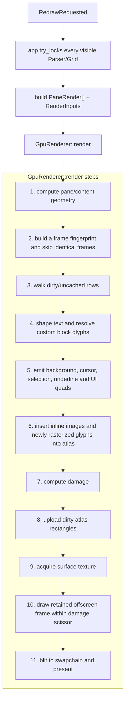
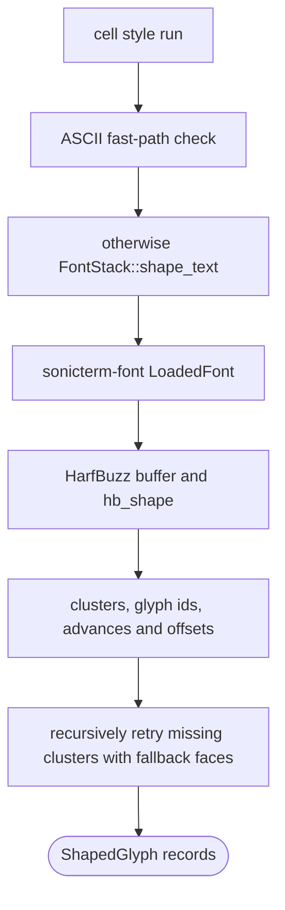
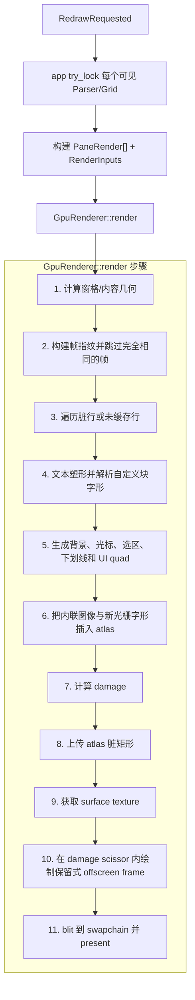
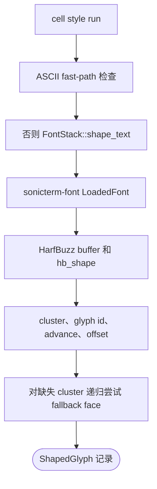

# Rendering and Fonts / 渲染与字体

## English

SonicTerm's renderer converts mutable terminal grids and UI snapshots into a
retained frame. Text is shaped and rasterized by Sonic-owned font crates, packed
into a CPU glyph atlas, uploaded to wgpu, and drawn with quads and glyph
instances. Windows also has a CPU-composition/GDI presentation path for software
adapters.

## Frame input

The app builds one `PaneRender` for every visible pane. It contains:

- pane id and pixel rectangle;
- a mutable view of the pane's `Grid`;
- scrollback-absolute viewport top;
- focus, cursor, broadcast, and scrollbar state;
- decoded inline images in premultiplied BGRA8.

`RenderInputs` adds renderer-independent tab bar, command palette, search,
selection, IME, hovered URL, notification, and drag snapshots. These types live
in `sonicterm-render-model`, which is the boundary between app/UI state and GPU
policy.

## Per-frame pipeline



A frame fingerprint fast path skips GPU work when visible state is unchanged.
Any surface-acquisition path that fails to present clears this cached key so a
new swapchain cannot incorrectly reuse a blank frame.

## Damage and retained pixels

The renderer keeps an offscreen frame texture between frames. Damage is a
bounding rectangle assembled from terminal dirty rows and UI changes.

- A primary-screen pane can repaint a narrow union of dirty viewport rows.
- If an alternate-screen pane has any dirty row, the complete clipped pane is
  repainted. This prevents stale pixels after TUI scroll, insert/delete-line,
  reverse-index, or full-screen erase operations.
- Fractional-DPI row bounds use floor/ceil rules so seams cannot appear between
  adjacent rows.
- The Windows software path composes and presents a complete surface; its
  semantics are intentionally separate from retained GPU damage.

Damage is a correctness contract: every VT/grid mutation must mark its affected
rows during the same update.

## Row caches

Two caches avoid rebuilding unchanged rows:

- `RowGlyphCache` stores glyph instances, underlines, missing glyphs, and tofu
  quads under `(pane id, absolute row, row hash)`.
- `LineQuadCache` stores background and decoration quads under a matching key.

Hashes include cell contents, style revision, cell metrics, scale, and a
selection bounding box only when that selection overlaps the row. Font, theme,
scale, atlas, or pane changes invalidate the appropriate entries.

## Text shaping



The ASCII fast path is deliberately conservative. Printable ASCII can bypass
HarfBuzz only if there are no combining extras, wide-cell flags, or characters
that commonly participate in ligatures such as `=`, `!`, `<`, `>`, `-`, `_`,
`:`, `|`, `&`, and `*`.

HarfBuzz clusters are mapped back to cell columns. Missing glyph clusters retry
successive fallback faces; final fallback uses notdef or replacement output
rather than aborting the app.

## Font discovery and fallback

`sonicterm-font` hides platform discovery behind a `FontLocator`:

- macOS: CoreText fallback and font URLs;
- Windows: DirectWrite/GDI descriptors and raw font extraction;
- other Unix systems: Fontconfig, restricted to monospaced/dual/char-cell faces.

The primary bundled family is `Rec Mono St.Helens`. The fallback chain includes
common monospaced, Nerd Font symbols, and color emoji families. Matching accounts
for family, style, weight, stretch, face index, variation, and codepoint coverage.
Variable-font metadata is optional; malformed or missing axes fall back to base
weight/width values.

A codepoint no font in the chain covers is resolved on a background thread, and
the font it finds is appended to that chain. **Automatic resolution ranks fonts
carrying an OpenType `MATH` table last.** A math font draws to the em square
rather than to a text advance, so its glyphs are sized for display equations:
one measured 43x35 in a 15x21 cell, overlapping its neighbour while the advance
stayed put. Detection is the table's presence, not the family name — nothing in
`OS/2` separates STIX Two Math from STIX Two Text, and both report
`sFamilyClass` 0/0.

Ranking, not exclusion, is the rule. Candidates are ordered by how much of the
batch being resolved they cover, and a math font covers a great many symbol
codepoints, so it outranks a text font that covers each of them perfectly well.
Sorting math fonts last lets a text font win wherever one exists, while leaving
a math font available for a codepoint nothing else carries — dropping them
outright turns such a codepoint into tofu.

The rule applies only to this automatic path. A family named explicitly in
`[font]` is still honored, math table or not.

Because the chain grows per stack and candidates are ranked by coverage of the
batch being resolved, the same codepoint could otherwise resolve to different
fonts in different windows — the batch depends on which codepoints reached the
screen together. Demoting math fonts removes the case where that difference
was visible as a change in glyph size.

## Tab title process icons

When the OS reports a foreground executable, SonicTerm normalizes its basename
and performs an exact-key lookup. Normalization accepts `/` and `\\` path
separators, removes one login-shell `-` prefix and one case-insensitive trailing
`.exe`, and lowercases the result. It does not inspect arguments, terminal output, or window
titles. Unknown processes retain the folder or terminal fallback icon.

These glyphs use Unicode Private Use Area (PUA) codepoints. A GitHub or browser
preview can therefore show a blank box, replacement character, or unrelated
symbol when its page font lacks the same mapping. SonicTerm renders them with
its bundled Rec Mono St.Helens font; the identity column below is the exact
glyph name in all four shipped font faces.

| Category | Application / family | Normalized aliases | Glyph | Bundled glyph identity | Codepoint |
| --- | --- | --- | :---: | --- | --- |
| AI | Claude Code | `claude`, `claude-code` | 󰙴 | `md-creation` | U+F0674 |
| AI | GitHub Copilot CLI | `copilot`, `github-copilot`, `github-copilot-cli` |  | `oct-copilot` | U+F4B8 |
| Shell | Zsh | `zsh` |  | `dev-ohmyzsh` | U+E84F |
| Shell | Bash | `bash` |  | `dev-bash` | U+E760 |
| Shell | Fish | `fish` |  | `fa-fish` | U+EE41 |
| Shell | POSIX shell | `sh`, `dash` |  | `seti-shell` | U+E691 |
| Shell | PowerShell | `pwsh`, `powershell` |  | `cod-terminal-powershell` | U+EBC7 |
| Shell | Command Prompt | `cmd` |  | `cod-terminal-cmd` | U+EBC4 |
| Editor | Vim / Neovim | `nvim`, `vim`, `vi`, `nvi` |  | `custom-vim` | U+E62B |
| Editor | Visual Studio Code | `code`, `code-insiders`, `codium`, `vscodium` |  | `dev-vscode` | U+E8DA |
| Editor | Emacs | `emacs`, `emacsclient` |  | `dev-emacs` | U+E7CF |
| Editor | Nano | `nano` |  | `dev-nano` | U+E838 |
| Remote / mux | SSH / Mosh | `ssh`, `mosh` | 󰣀 | `md-ssh` | U+F08C0 |
| Remote / mux | tmux | `tmux` |  | `cod-terminal-tmux` | U+EBC8 |
| Remote / mux | GNU Screen | `screen` |  | `cod-screen-full` | U+EB4C |
| Source control | Git | `git`, `lazygit`, `tig` |  | `fa-git` | U+F1D3 |
| Source control | GitHub CLI | `gh`, `hub` |  | `oct-logo-github` | U+F470 |
| Source control | GitLab CLI | `glab` |  | `dev-gitlab` | U+E7EB |
| Language / build | Rust | `cargo`, `rustc`, `rust-analyzer` | 󱘗 | `md-language-rust` | U+F1617 |
| Language / build | Python | `python`, `python3`, `ipython`, `pip`, `pip3` | 󰌠 | `md-language-python` | U+F0320 |
| Language / build | Go | `go`, `gofmt`, `gopls` |  | `dev-go` | U+E724 |
| Language / build | Java | `java`, `javac` |  | `dev-java` | U+E738 |
| Language / build | Maven | `mvn`, `mvnw` |  | `dev-maven` | U+E82C |
| Language / build | Gradle | `gradle`, `gradlew` |  | `dev-gradle` | U+E7F2 |
| Language / build | Ruby | `ruby`, `irb`, `bundle`, `bundler`, `gem`, `rails` |  | `dev-ruby` | U+E739 |
| Language / build | PHP | `php`, `php-fpm` |  | `dev-php` | U+E73D |
| Language / build | Composer | `composer` |  | `dev-composer` | U+E783 |
| Language / build | Lua | `lua`, `luajit` |  | `dev-lua` | U+E826 |
| Language / build | Swift | `swift`, `swiftc` |  | `dev-swift` | U+E755 |
| Language / build | Zig | `zig` |  | `dev-zig` | U+E8EF |
| Language / build | .NET | `dotnet` |  | `dev-dotnet` | U+E77F |
| Package / runtime | Node.js | `node`, `nodejs` |  | `dev-nodejs` | U+E719 |
| Package / runtime | npm | `npm`, `npx` |  | `dev-npm` | U+E71E |
| Package / runtime | pnpm | `pnpm` |  | `dev-pnpm` | U+E865 |
| Package / runtime | Yarn | `yarn`, `yarnpkg` |  | `dev-yarn` | U+E8EC |
| Package / runtime | Deno | `deno` |  | `dev-denojs` | U+E7C0 |
| Package / runtime | Bun | `bun` |  | `dev-bun` | U+E76F |
| Container / build | Docker | `docker`, `docker-compose` |  | `dev-docker` | U+E7B0 |
| Container / build | Podman | `podman` |  | `dev-podman` | U+E866 |
| Container / build | Make | `make`, `gmake` | 󱌣 | `md-hammer-wrench` | U+F1323 |
| Container / build | CMake | `cmake` |  | `dev-cmake` | U+E794 |
| Container / build | Ninja | `ninja` | 󰝴 | `md-ninja` | U+F0774 |
| DevOps / cloud | Kubernetes | `kubectl`, `k9s`, `minikube` |  | `dev-kubernetes` | U+E81D |
| DevOps / cloud | Helm | `helm` |  | `dev-helm` | U+E7FB |
| DevOps / cloud | Terraform / OpenTofu | `terraform`, `tofu`, `opentofu` |  | `dev-terraform` | U+E8BD |
| DevOps / cloud | Ansible | `ansible`, `ansible-playbook` |  | `dev-ansible` | U+E723 |
| DevOps / cloud | Pulumi | `pulumi` |  | `dev-pulumi` | U+E873 |
| DevOps / cloud | AWS CLI | `aws` |  | `dev-aws` | U+E7AD |
| DevOps / cloud | Azure CLI | `az`, `azure` |  | `dev-azure` | U+E754 |
| DevOps / cloud | Google Cloud CLI | `gcloud` |  | `dev-googlecloud` | U+E7F1 |
| DevOps / cloud | Cloudflare | `cloudflared`, `wrangler` |  | `dev-cloudflare` | U+E792 |
| DevOps / cloud | Vercel | `vercel` |  | `dev-vercel` | U+E8D3 |
| DevOps / cloud | Netlify | `netlify` |  | `dev-netlify` | U+E83C |
| Database | PostgreSQL | `psql`, `postgres`, `postmaster` |  | `dev-postgresql` | U+E76E |
| Database | MySQL | `mysql`, `mysqld` |  | `dev-mysql` | U+E704 |
| Database | MariaDB | `mariadb`, `mariadbd` |  | `dev-mariadb` | U+E828 |
| Database | Redis | `redis-cli`, `redis-server`, `redis-sentinel` |  | `dev-redis` | U+E76D |
| Database | SQLite | `sqlite`, `sqlite3` |  | `dev-sqlite` | U+E7C4 |
| Database | MongoDB | `mongo`, `mongod`, `mongosh` |  | `dev-mongodb` | U+E7A4 |

## Rasterization

`sonicterm-engine::FontStack` is the renderer-facing adapter. It implements the
atlas rasterizer trait and converts font output to `RasterTile`.

- Windows defaults to DirectWrite. If it cannot rasterize a glyph, FreeType is
  available as fallback.
- macOS and other Unix systems default to FreeType.
- FreeType handles monochrome, grayscale, LCD subpixel, BGRA color strikes, and
  COLR/SVG handoff.
- COLR/HarfBuzz paint paths support layered color glyphs and linear, radial, and
  sweep gradients through Cairo-backed drawing.

Raw FreeType, HarfBuzz, and Fontconfig handles live in binding crates. Safe
wrappers in `sonicterm-font::{ftwrap,hbwrap,fcwrap}` own lifetimes and pair each
native allocation with its matching destroy function.

## Glyph atlas

`GlyphAtlas` is a 2048×2048 CPU-side BGRA8 atlas (about 16 MiB). A shelf packer
allocates new tiles; freed rectangles are reused before extending shelves.
Entries are keyed by font slot, glyph id, character, style, and native raster
role. Terminal text, command-palette query/results, and ordinary chrome use the
configured body size; command-palette footer text uses `max(body - 1, 1)`; tab
titles use `body + 1`. The renderer keeps matching font stacks for those three
sizes with the same family, DPI, and weight scale. Their role tags prevent the
shared atlas from returning a normal-size bitmap for a footer or tab title, so
all three sizes draw their natively rasterized tiles at 1:1 rather than scaling
a cached body tile. Font and DPI changes rebuild all three stacks and invalidate
the shared atlas together.

Insertion behavior:

1. a cache hit updates its last-used frame;
2. a rasterization miss stores a zero-area sentinel so it is not retried every frame;
3. spaces use zero-area entries with no upload;
4. normal/color/subpixel tiles are copied into BGRA storage;
5. each write adds a dirty rectangle;
6. on pressure, the coldest quarter is evicted deterministically and allocation retries.

`AtlasUpload::sync` drains dirty rectangles and writes only those tight BGRA
regions into the wgpu texture before the draw pass. A nearest sampler preserves
coverage values.

## Custom block glyphs

Box drawing, block elements, Powerline, Braille, sextant, octant, progress, and
related symbols can bypass font fallback. `BlockKey::from_char` maps a codepoint
to geometry, and `block_sprite_with_cell_metrics` rasterizes it with tiny-skia.
The resulting atlas key uses a reserved font slot so it cannot collide with a
normal font glyph.

This implementation was absorbed from WezTerm and adapted behind SonicTerm
bitmap/metric types; attribution is preserved in
`crates/sonicterm-block-glyph/LICENSE-WEZTERM`.

## Inline images

iTerm2 file images, kitty graphics, and Sixel media events are decoded by the
app. Decoding applies two different dimension limits: images larger than 2048
pixels per side are rejected before decoding, and an accepted image is then
resized so its rendered form is at most 1024 pixels per side. Sixel data is
decoded into a 1024-per-side buffer directly. The result is converted to
premultiplied BGRA8 and stored on its pane. The renderer inserts them into the
same atlas using a reserved image font slot and emits color-glyph instances
anchored to grid row/column.

Retention is bounded per pane and across the process together, so how much a
pane keeps depends on how many panes are open. Every pane draws on one process
budget of 256 MiB; opening more panes lowers what each one retains rather than
pushing the process past that ceiling. No pane is reduced below 4 MiB, which
holds one full-size image, and no pane keeps more than 128 images regardless of
their size.

A pane releases its oldest images first and never releases its most recent one,
so a trimmed pane still renders. When the process is over its budget, SonicTerm
revisits every pane rather than only the one currently decoding, so a pane that
filled up early and then went idle gives back the larger share it was admitted
under instead of holding it for the rest of the session.

## GPU drawing

The production `WeztermPipeline` uses one instance format and shader with modes
for text glyphs, color emoji/images, solid quads, rounded rectangles, and lines.
The order is:

```text
base quads -> base glyphs -> overlay quads -> overlay glyphs
```

The offscreen frame is cleared on its first use and loaded on retained frames.
A scissor rectangle limits redraw to damage. `FrameBlitter` copies the retained
frame to the swapchain surface before queue submit and present.

Surface format is sRGB BGRA8. Colors are converted to linear space before shader
use to avoid double-gamma output. Mailbox present mode is preferred when
available, otherwise FIFO.

## Software rendering

Adapter inspection detects WARP, llvmpipe, SwiftShader, and other CPU devices.
`software_render_mode` can follow detection (`auto`), always degrade (`force`),
or disable degradation (`off`). Degradation lowers frame frequency, disables
per-frame fade work, uses FIFO/opaque presentation, and reduces frame latency.

On Windows, `WindowsSoftwareFrame` composes quads and atlas glyphs into a BGRA
buffer and presents it to the HWND through GDI `SetDIBitsToDevice`. The Windows
binary also contains a retained dirty-rectangle `SoftwareSurface` primitive;
the active renderer composition path currently lives in `sonicterm-gpu`.

## Where to read the code

| Topic | Primary paths |
| --- | --- |
| Render inputs | `crates/sonicterm-render-model/src/{pane_render,inputs,geometry}.rs` |
| Main frame pipeline | `crates/sonicterm-gpu/src/core.rs` |
| Unified GPU pipeline | `crates/sonicterm-gpu/src/wezterm_pipeline.rs` |
| Atlas upload | `crates/sonicterm-gpu/src/atlas_upload.rs` |
| CPU atlas/cache model | `crates/sonicterm-text/src/{glyph_atlas,row_glyph_cache,shape}.rs` |
| Font adapter | `crates/sonicterm-engine/src/fontstack.rs` |
| Discovery/shaping/rasterization | `crates/sonicterm-font/src/` |
| FFI wrappers | `crates/sonicterm-font/src/{ftwrap,hbwrap,fcwrap}.rs` |
| Custom glyphs | `crates/sonicterm-block-glyph/src/` |
| Windows CPU frame | `crates/sonicterm-gpu/src/software_windows.rs` |

## 中文

SonicTerm renderer 把可变终端 grid 和 UI snapshot 转换为保留式帧。文本由 Sonic 自有字体
crate 塑形与光栅化，放入 CPU 字形图集，上传到 wgpu，再以 quad 和 glyph instance 绘制。
Windows 对软件 adapter 还提供 CPU 合成和 GDI 呈现路径。

## 帧输入

app 为每个可见窗格构建一个 `PaneRender`，其中包含：

- 窗格 id 和像素矩形；
- 窗格 `Grid` 的可变视图；
- scrollback 绝对坐标的视口顶部；
- 焦点、光标、广播和滚动条状态；
- 预乘 BGRA8 的已解码内联图像。

`RenderInputs` 再加入与 renderer 无关的标签栏、命令面板、搜索、选区、IME、悬停 URL、通知和拖动 snapshot。
这些类型位于 `sonicterm-render-model`，构成 app/UI state 与 GPU 策略之间的边界。

## 每帧流水线



帧指纹 fast path 在可见状态不变时跳过 GPU 工作。任何未成功 present 的 surface 获取路径都会清除
缓存 key，避免新 swapchain 错误复用空白帧。

## Damage 与保留像素

renderer 在帧之间保留 offscreen frame texture。damage 是终端脏行与 UI 变化的包围矩形。

- 主屏幕窗格可以只重绘脏视口行的窄并集。
- 备用屏幕窗格只要出现任一脏行，就重绘完整裁剪窗格，防止 TUI scroll、插入/删除行、reverse index 或全屏 erase 后残留旧像素。
- 分数 DPI 的行边界使用 floor/ceil，避免相邻行间出现缝隙。
- Windows 软件路径合成并呈现完整 surface，其语义与保留式 GPU damage 分离。

Damage 是正确性契约：每个 VT/grid 修改必须在同一次更新中标记受影响行。

## 行缓存

两个缓存避免重建未变化行：

- `RowGlyphCache` 按 `(pane id, absolute row, row hash)` 保存 glyph instance、下划线、缺失字形和 tofu quad。
- `LineQuadCache` 用相同类型的 key 保存背景与装饰 quad。

hash 包含 cell 内容、style revision、cell metric、scale，以及仅在选区与该行重叠时加入的选区 bounding box。
字体、主题、scale、atlas 或窗格变化会使对应 entry 失效。

## 文本塑形



ASCII fast path 很保守：只有可打印 ASCII，且没有组合 extras、宽 cell 标记，以及 `=`、`!`、`<`、`>`、
`-`、`_`、`:`、`|`、`&`、`*` 等常见连字字符时才绕过 HarfBuzz。

HarfBuzz cluster 会映射回 cell 列。缺失 cluster 依次尝试 fallback face；最终使用 notdef 或替代输出，而不是中止 app。

## 字体发现与回退

`sonicterm-font` 把平台发现逻辑隐藏在 `FontLocator` 后：

- macOS：CoreText fallback 与字体 URL；
- Windows：DirectWrite/GDI descriptor 与原始字体提取；
- 其它 Unix：Fontconfig，并限制为 monospace/dual/char-cell face。

内置主字体族是 `Rec Mono St.Helens`；回退链包含常见等宽字体、Nerd Font symbols 和彩色 emoji。
匹配考虑 family、style、weight、stretch、face index、variation 和码点 coverage。可变字体 metadata 是可选项；
损坏或缺失轴会回退到基础 weight/width。

当链中没有任何字体覆盖某个码点时，解析会在后台线程进行，找到的字体随后被追加到该链上。
**自动解析会把带有 OpenType `MATH` 表的字体排在最后。** 数学字体按 em 方块而非文本 advance 绘制，
其字形是为独立展示的公式排版设计的：实测有一个字形在 15x21 的单元格中占据 43x35，
advance 不变却压住了相邻字符。判定依据是该表是否存在，而不是字体族名 ——
`OS/2` 无法区分 STIX Two Math 与 STIX Two Text，两者的 `sFamilyClass` 都是 0/0。

规则是排序而非排除。候选字体按其对当前批次的覆盖率排序，而数学字体覆盖了大量符号码点，
因此会压过那些本可以完美呈现这些码点的文本字体。把数学字体排在最后，
可以让文本字体在存在时优先胜出，同时仍为没有其它字体覆盖的码点保留数学字体 ——
若直接丢弃它们，这类码点就会变成 tofu。

该规则只作用于这条自动路径。在 `[font]` 中显式指定的字体族仍然生效，无论其是否带有 MATH 表。

由于每个 stack 各自增长回退链，且候选字体按当前批次的覆盖率排序，
而批次取决于哪些码点恰好同时出现在屏幕上，否则同一码点可能在不同窗口解析到不同字体。
把数学字体降级消除了这种差异表现为字形尺寸变化的情形。

## 标签页进程图标

OS 报告前台可执行文件后，SonicTerm 会规范化其 basename，并执行精确 key 查找。
规范化同时接受 `/` 和 `\\` 路径分隔符，去掉一个 login-shell `-` 前缀与一个不区分大小写的末尾
`.exe`，再转换为小写；不会检查参数、终端输出或窗口标题。未知进程仍使用文件夹或终端 fallback 图标。

这些 glyph 使用 Unicode Private Use Area（PUA）码点。如果 GitHub 或浏览器页面字体没有相同映射，
预览可能显示空框、替换字符或无关符号。SonicTerm 使用内置 Rec Mono St.Helens 字体渲染；
下表 identity 列是全部四个随附字体 face 中的精确 glyph 名称。

| 类别 | 应用 / 家族 | 规范化 alias | Glyph | 内置 glyph identity | 码点 |
| --- | --- | --- | :---: | --- | --- |
| AI | Claude Code | `claude`, `claude-code` | 󰙴 | `md-creation` | U+F0674 |
| AI | GitHub Copilot CLI | `copilot`, `github-copilot`, `github-copilot-cli` |  | `oct-copilot` | U+F4B8 |
| Shell | Zsh | `zsh` |  | `dev-ohmyzsh` | U+E84F |
| Shell | Bash | `bash` |  | `dev-bash` | U+E760 |
| Shell | Fish | `fish` |  | `fa-fish` | U+EE41 |
| Shell | POSIX shell | `sh`, `dash` |  | `seti-shell` | U+E691 |
| Shell | PowerShell | `pwsh`, `powershell` |  | `cod-terminal-powershell` | U+EBC7 |
| Shell | Command Prompt | `cmd` |  | `cod-terminal-cmd` | U+EBC4 |
| Editor | Vim / Neovim | `nvim`, `vim`, `vi`, `nvi` |  | `custom-vim` | U+E62B |
| Editor | Visual Studio Code | `code`, `code-insiders`, `codium`, `vscodium` |  | `dev-vscode` | U+E8DA |
| Editor | Emacs | `emacs`, `emacsclient` |  | `dev-emacs` | U+E7CF |
| Editor | Nano | `nano` |  | `dev-nano` | U+E838 |
| Remote / mux | SSH / Mosh | `ssh`, `mosh` | 󰣀 | `md-ssh` | U+F08C0 |
| Remote / mux | tmux | `tmux` |  | `cod-terminal-tmux` | U+EBC8 |
| Remote / mux | GNU Screen | `screen` |  | `cod-screen-full` | U+EB4C |
| Source control | Git | `git`, `lazygit`, `tig` |  | `fa-git` | U+F1D3 |
| Source control | GitHub CLI | `gh`, `hub` |  | `oct-logo-github` | U+F470 |
| Source control | GitLab CLI | `glab` |  | `dev-gitlab` | U+E7EB |
| Language / build | Rust | `cargo`, `rustc`, `rust-analyzer` | 󱘗 | `md-language-rust` | U+F1617 |
| Language / build | Python | `python`, `python3`, `ipython`, `pip`, `pip3` | 󰌠 | `md-language-python` | U+F0320 |
| Language / build | Go | `go`, `gofmt`, `gopls` |  | `dev-go` | U+E724 |
| Language / build | Java | `java`, `javac` |  | `dev-java` | U+E738 |
| Language / build | Maven | `mvn`, `mvnw` |  | `dev-maven` | U+E82C |
| Language / build | Gradle | `gradle`, `gradlew` |  | `dev-gradle` | U+E7F2 |
| Language / build | Ruby | `ruby`, `irb`, `bundle`, `bundler`, `gem`, `rails` |  | `dev-ruby` | U+E739 |
| Language / build | PHP | `php`, `php-fpm` |  | `dev-php` | U+E73D |
| Language / build | Composer | `composer` |  | `dev-composer` | U+E783 |
| Language / build | Lua | `lua`, `luajit` |  | `dev-lua` | U+E826 |
| Language / build | Swift | `swift`, `swiftc` |  | `dev-swift` | U+E755 |
| Language / build | Zig | `zig` |  | `dev-zig` | U+E8EF |
| Language / build | .NET | `dotnet` |  | `dev-dotnet` | U+E77F |
| Package / runtime | Node.js | `node`, `nodejs` |  | `dev-nodejs` | U+E719 |
| Package / runtime | npm | `npm`, `npx` |  | `dev-npm` | U+E71E |
| Package / runtime | pnpm | `pnpm` |  | `dev-pnpm` | U+E865 |
| Package / runtime | Yarn | `yarn`, `yarnpkg` |  | `dev-yarn` | U+E8EC |
| Package / runtime | Deno | `deno` |  | `dev-denojs` | U+E7C0 |
| Package / runtime | Bun | `bun` |  | `dev-bun` | U+E76F |
| Container / build | Docker | `docker`, `docker-compose` |  | `dev-docker` | U+E7B0 |
| Container / build | Podman | `podman` |  | `dev-podman` | U+E866 |
| Container / build | Make | `make`, `gmake` | 󱌣 | `md-hammer-wrench` | U+F1323 |
| Container / build | CMake | `cmake` |  | `dev-cmake` | U+E794 |
| Container / build | Ninja | `ninja` | 󰝴 | `md-ninja` | U+F0774 |
| DevOps / cloud | Kubernetes | `kubectl`, `k9s`, `minikube` |  | `dev-kubernetes` | U+E81D |
| DevOps / cloud | Helm | `helm` |  | `dev-helm` | U+E7FB |
| DevOps / cloud | Terraform / OpenTofu | `terraform`, `tofu`, `opentofu` |  | `dev-terraform` | U+E8BD |
| DevOps / cloud | Ansible | `ansible`, `ansible-playbook` |  | `dev-ansible` | U+E723 |
| DevOps / cloud | Pulumi | `pulumi` |  | `dev-pulumi` | U+E873 |
| DevOps / cloud | AWS CLI | `aws` |  | `dev-aws` | U+E7AD |
| DevOps / cloud | Azure CLI | `az`, `azure` |  | `dev-azure` | U+E754 |
| DevOps / cloud | Google Cloud CLI | `gcloud` |  | `dev-googlecloud` | U+E7F1 |
| DevOps / cloud | Cloudflare | `cloudflared`, `wrangler` |  | `dev-cloudflare` | U+E792 |
| DevOps / cloud | Vercel | `vercel` |  | `dev-vercel` | U+E8D3 |
| DevOps / cloud | Netlify | `netlify` |  | `dev-netlify` | U+E83C |
| Database | PostgreSQL | `psql`, `postgres`, `postmaster` |  | `dev-postgresql` | U+E76E |
| Database | MySQL | `mysql`, `mysqld` |  | `dev-mysql` | U+E704 |
| Database | MariaDB | `mariadb`, `mariadbd` |  | `dev-mariadb` | U+E828 |
| Database | Redis | `redis-cli`, `redis-server`, `redis-sentinel` |  | `dev-redis` | U+E76D |
| Database | SQLite | `sqlite`, `sqlite3` |  | `dev-sqlite` | U+E7C4 |
| Database | MongoDB | `mongo`, `mongod`, `mongosh` |  | `dev-mongodb` | U+E7A4 |

## 光栅化

`sonicterm-engine::FontStack` 是 renderer 面向的 adapter，实现 atlas rasterizer trait，并把字体输出转换为 `RasterTile`。

- Windows 默认 DirectWrite；无法处理某字形时可回退 FreeType。
- macOS 和其它 Unix 默认 FreeType。
- FreeType 处理 monochrome、grayscale、LCD 次像素、BGRA color strike，以及 COLR/SVG 交接。
- COLR/HarfBuzz paint 路径通过 Cairo-backed 绘制支持分层彩色字形和线性、径向、扫描渐变。

原始 FreeType、HarfBuzz、Fontconfig handle 留在 binding crate；
`sonicterm-font::{ftwrap,hbwrap,fcwrap}` 的安全 wrapper 管理生命周期，并为每次原生分配匹配 destroy 调用。

## 字形图集

`GlyphAtlas` 是 2048×2048 的 CPU 侧 BGRA8 atlas，约 16 MiB。shelf packer 分配新 tile；
扩展 shelf 前先复用释放矩形。entry key 包含 font slot、glyph id、字符、样式和原生光栅角色。
终端文字、命令面板查询/结果和普通 chrome 使用已配置的正文大小；命令面板页脚使用
`max(正文 - 1, 1)`；标签页标题使用 `正文 + 1`。renderer 为这三种大小保留匹配的字体栈，
并让它们共享相同的 family、DPI 和 weight scale。角色标签可防止共享 atlas 把正文大小的
位图返回给页脚或标签页标题，因此三种大小都以 1:1 绘制原生光栅 tile，而不是缩放缓存的
正文 tile。字体或 DPI 变化会一起重建三个字体栈并使共享 atlas 失效。

插入行为：

1. cache hit 更新 last-used frame；
2. 光栅失败保存零面积 sentinel，避免每帧重试；
3. 空格使用不上传的零面积 entry；
4. 普通/彩色/次像素 tile 复制进 BGRA storage；
5. 每次写入加入 dirty rect；
6. 空间紧张时确定性淘汰最冷的四分之一并重试。

`AtlasUpload::sync` 在 draw pass 前排空 dirty rect，只把紧密 BGRA 区域写入 wgpu texture。nearest sampler 保留 coverage 值。

## 自定义块字形

box drawing、block element、Powerline、Braille、sextant、octant、progress 等符号可绕过字体回退。
`BlockKey::from_char` 把码点映射为几何，`block_sprite_with_cell_metrics` 用 tiny-skia 光栅化。
生成的 atlas key 使用保留 font slot，不会与普通字体字形冲突。

实现从 WezTerm 吸收，并适配 SonicTerm bitmap/metric 类型；署名保存在
`crates/sonicterm-block-glyph/LICENSE-WEZTERM`。

## 内联图像

iTerm2 file image、kitty graphics 与 Sixel media event 在 app 中解码。解码应用两个不同的
尺寸限制：单边超过 2048 像素的图像在解码前即被拒绝；被接受的图像随后会被缩放，使其渲染
尺寸单边不超过 1024 像素。Sixel 数据直接解码进单边 1024 的缓冲区。结果转换为预乘 BGRA8，
保存在所属窗格。renderer 使用保留 image font slot 插入同一 atlas，并按 grid 行列发出 color-glyph instance。

保留量由窗格与整个进程共同限制，因此单个窗格能保留多少，取决于当前打开了多少窗格。
所有窗格共用 256 MiB 的进程预算；打开更多窗格会降低每个窗格的保留量，而不会让进程
超出该上限。任何窗格都不会被压到 4 MiB 以下（足以完整保留一张全尺寸图像），也都不会
保留超过 128 张图像，无论其尺寸大小。

窗格优先释放最旧的图像，并且永远不会释放最新的一张，因此被裁剪的窗格仍能正常渲染。
当进程超出预算时，SonicTerm 会遍历每一个窗格，而不只是当前正在解码的那个；因此，
早期填满后转入空闲的窗格会交还其被准入时获得的较大份额，而不会在此后的整个会话中
一直占用。

## GPU 绘制

生产路径 `WeztermPipeline` 使用一个 instance format 和 shader，并区分文本 glyph、彩色 emoji/image、
solid quad、rounded rectangle 和 line。顺序为：

```text
base quad -> base glyph -> overlay quad -> overlay glyph
```

offscreen frame 首次使用时 clear，保留帧中 load；scissor rect 把重绘限制到 damage。
`FrameBlitter` 在 queue submit/present 前把保留 frame 复制到 swapchain surface。

surface format 是 sRGB BGRA8。颜色在 shader 前转换到 linear space，避免双重 gamma。优先 Mailbox present，
不可用时使用 FIFO。

## 软件渲染

adapter 检测可识别 WARP、llvmpipe、SwiftShader 等 CPU device。`software_render_mode` 可按检测自动降级、
强制降级或关闭降级。降级会降低帧率、关闭逐帧 fade、使用 FIFO/opaque 呈现并减少 frame latency。

Windows 上，`WindowsSoftwareFrame` 把 quad 和 atlas glyph 合成进 BGRA buffer，并通过 GDI
`SetDIBitsToDevice` 呈现到 HWND。Windows 二进制还包含 retained dirty-rectangle `SoftwareSurface` primitive；
当前实际 renderer 合成路径位于 `sonicterm-gpu`。

## 从哪里阅读源码

| 主题 | 主要路径 |
| --- | --- |
| 渲染输入 | `crates/sonicterm-render-model/src/{pane_render,inputs,geometry}.rs` |
| 主帧流水线 | `crates/sonicterm-gpu/src/core.rs` |
| 统一 GPU pipeline | `crates/sonicterm-gpu/src/wezterm_pipeline.rs` |
| Atlas 上传 | `crates/sonicterm-gpu/src/atlas_upload.rs` |
| CPU atlas/cache | `crates/sonicterm-text/src/{glyph_atlas,row_glyph_cache,shape}.rs` |
| 字体 adapter | `crates/sonicterm-engine/src/fontstack.rs` |
| 发现/塑形/光栅化 | `crates/sonicterm-font/src/` |
| FFI wrapper | `crates/sonicterm-font/src/{ftwrap,hbwrap,fcwrap}.rs` |
| 自定义字形 | `crates/sonicterm-block-glyph/src/` |
| Windows CPU frame | `crates/sonicterm-gpu/src/software_windows.rs` |
