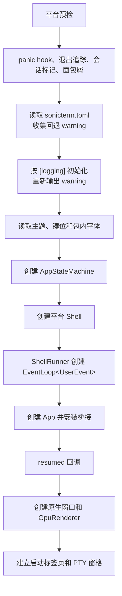
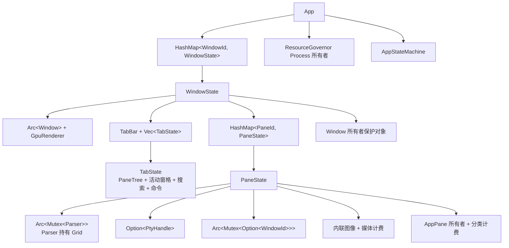
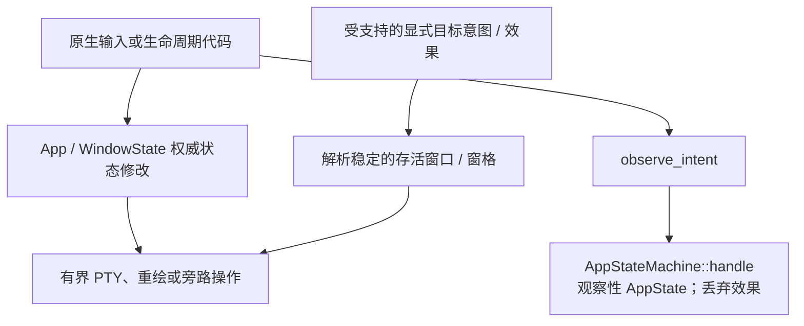

# 运行时生命周期

[English](Runtime-Lifecycle)

按启动、标签页/窗格变化、退出的顺序阅读；每节说明负责对象与执行顺序。
系统全貌见[架构](Architecture-zh-CN)，正确性检查见[架构内部机制](Architecture-Internals-zh-CN)。

### 进程启动



macOS 和 Linux 会在读取配置前安装 panic 与退出诊断。Windows 先设置 per-monitor-v2 DPI，
解析命令行，并排队启动脚本请求。`--refresh-shell-associations` 会在普通诊断路径前直接返回。
其它 Windows 启动路径随后执行相同的 panic、退出、会话、面包屑、配置和日志初始化。

启动配置缺失或无效时，应用使用默认值并保存 warning。三个二进制都等拿到 `[logging]` 后
才初始化日志，再输出此前收集的 warning。日志初始化本身采用尽力而为策略。

三个二进制都会在普通应用工作前建立会话标记。它们把崩溃产物关联到该会话，并在可用时启动
非阻塞面包屑 writer。共享 shell 退出策略只有在原生 PTY 清理完成后才记录
`CleanShutdown`、刷完 writer 并把会话标为干净。交互模式还要求事件循环成功返回；冒烟测试
即使失败，只要原生清理完成，仍可把会话标为干净。

平台启动还会执行以下工作：

- macOS 在任何 SonicTerm 窗口出现前关闭进程级 AppKit 自动标签页。第一次 `resumed` 回调安装
  原生菜单；一次性 window-ready 钩子仅为初始窗口调用 `setTabbingMode: 2`。
- Windows 在界面线程初始化 OLE。HWND 出现后才安装 DWM 背景和 `muda` 菜单。原生标签页
  拖动注册也在同一界面线程完成。
- Linux 把不支持的材质背景改为不透明，并预检四个包内 Rec Mono 字体文件。所有平台的
  `--runtime-smoke` 都使用分开的临时 config/log 根目录、30 秒应用内证明期限和 45 秒完整
  进程树看门狗。

三个二进制随后读取主题和键位，创建
`AppStateMachine::new(AppState::default())`，构建 `MacShell`、`WindowsShell` 或
`LinuxShell`，再调用 `run`。

每个原生二进制都在构建 shell 前，为 SonicTerm 进程记录一次带类型的
`ProcessPrivilege` 快照。Windows 以 `TOKEN_QUERY` 打开当前进程 token，读取
`TOKEN_ELEVATION`，再关闭 token 句柄；查询失败时记录日志并归类为非特权，不会声称未观测到
的提升状态。macOS 和 Linux 则判断 `geteuid()` 是否为零。进程快照不从用户名、环境变量、
shell 提示符或标题文本推断。

除此之外，Windows 前台进程探测会选择每个标签页活动窗格最深的后代进程，读取该 PID 的
`TOKEN_ELEVATION`，并把结果保存在所属标签页。一个窗口内所有缓存过期的可见标签页（包括
非活动标签页）会共用一次进程表快照和祖先索引。若 UIPI 拒绝访问高完整性叶进程，同一条已选
祖先路径会检查真实的 `gsudo.exe` broker。该状态复用现有的 500 毫秒前台标题缓存。PTY
成功接受输入后，会固定安排 500 毫秒后的探测；在尚未显示警告时，输出活动会把探测延后到
静默 500 毫秒，但不能推迟由输入固定的期限。只要普通权限的 SonicTerm 中仍有按标签页警告，
就每 500 毫秒进行一次固定探测，直到普通 shell 重新成为前台。仅探测且结果未变化的唤醒不会
重绘；空闲会话和全局已提升的会话不会增加前台探测心跳。该状态不修改任何标题字符串；即使只
改变权限也会让所属标签页界面失效重绘。其它平台只使用启动时的进程快照。

### Shell 与事件循环构建

每个平台 shell 都包装同一个 `ShellRunner`。runner 持有状态机、主题、配置、键位、进程权限
快照、可选资源加载器、原生拖动钩子、启动 payload、面包屑 recorder 和一次性原生窗口钩子。
它会在排队任何启动 payload 前把快照安装到 `App`。随后 `App` 把同一个值传给主窗口和每个
子窗口的渲染调用，所以新标签页、新窗口和拆出窗口不会对进程权限得出不同结论。Windows 中每个标签页还会把自己的
前台进程权限状态与该全局值合并；普通 SonicTerm 内通过 `gsudo` 运行的提升命令因此只警告
所属标签页。该值也参与保留帧身份计算。

`ShellRunner::run` 依次：

1. 执行可重复调用的 tracing 初始化；
2. 创建 `EventLoop<UserEvent>`，初始 `ControlFlow::Wait`；
3. 安装菜单、OS 拖动和脚本打开代理桥；
4. 用状态机和事件循环代理构建 `App`；
5. 安装可选钩子与平台后端；
6. 排队启动标签页 payload；
7. 调用 `run_app`；
8. 无论成功还是错误都调用幂等的 `App::finish_session`，再返回同时包含原结果和独立
   清理完成标志的 `ShellRunResult`。

启动 payload 到达时如果还没有 `WindowState`，就不能直接建立标签页。
`new_tab_from_payload` 会把它存入 `pending_os_drag_payloads`。`resumed` 先创建默认 shell，
随后再清空该队列，建立额外的目标标签页。

`App` 实现 `ApplicationHandler<UserEvent>`：

| 回调 | 职责 |
| --- | --- |
| `resumed` | 运行一次性 resumed 钩子；创建首个原生窗口、渲染器、所有者记录、标签页和窗格 |
| `user_event` | 处理类型化重绘、菜单、脚本打开、拖动、更新、进程退出、路径探测、输入拒绝和冒烟事件 |
| `window_event` | 按 `WindowId` 处理键盘、鼠标、输入法、尺寸、焦点、重绘和关闭 |
| `new_events` | 处理 `WaitUntil` 到期，并请求延迟帧 |
| `about_to_wait` | 消费待退出状态；投递 `window_event` 本轮收集的文件拖放，每个窗口一个列表；维护预热窗口；采样和回收内存；让通知过期；选择下一次唤醒期限 |
| `exiting` | 记录事件循环有序退出 |

每个 `user_event` 处理完后，代码会先创建待处理窗口，再执行延迟的 OS 拖动清理。这样
`DroppedOnEmpty` 拆出路径能先把新窗口放进存活窗口表，拖动清理随后再遍历该表。

### 首个窗口与窗格

`do_resumed` 先运行一次性 `on_resumed` 钩子。随后限制配置的单元格几何，创建原生窗口，
开启输入法，设置原生背景，并读取显示器刷新周期。

普通启动中，原生窗口或渲染器创建失败会 panic。此时没有终端窗口可以显示错误，因此该失败
不可继续。原生运行冒烟测试则记录 `Display` 或 `Gpu` 失败后退出。

`GpuRenderer::new` 创建或选择共享 wgpu 上下文，再建立窗口专用表面、保留帧、图集、缓存和
字体栈。适配器确定后，应用才解析软件渲染降级状态并更新帧节奏。

随后应用：

1. 为窗口注册原生拖动钩子；
2. 运行需要真实窗口句柄的 `on_window_ready`；
3. 创建主 `WindowState`；
4. 连同 `Window` 资源所有者一起插入；
5. 建立启动脚本标签页，或一个默认 shell 标签页；
6. 重放排队的 OS 拖动 payload；
7. 记录 `Ready` 面包屑。

### 窗口、标签页与窗格所有权



主窗口是 `App::windows` 中的普通条目，由 `main_window_id` 标识。拆出窗口使用同一种
`WindowState`，并进入同一事件表。

`TabBar` 保存标签页身份、标题、顺序和活动下标。与之平行的 `Vec<TabState>` 为每个标签页
保存一棵 `PaneTree`。树叶是窗格编号。`WindowState::panes` 保存该窗口全部标签页中的
存活 `PaneState`。

`PaneState` 持有解析器和可选 PTY 句柄。网格由解析器持有。窗格还持有终端模式原子值、命令
事件、内联图像、共享重绘目标、资源预留和所有者保护对象。

进程级状态保存在 `App`。其中包括命令面板及其所在窗口、广播状态、资源总账、状态机、预热
窗口池、原生拖动后端和事件循环调度标志。

### 创建标签页与分屏

主窗口和子窗口中的普通新标签页与分屏，在未指定显式 CWD 时使用源窗格已验证的本地
OSC 7 CWD。只接受空 authority、`localhost` 或准确本机主机名；原生绝对路径解码后
UTF-8 最多 4,096 字节。显式 CWD 优先；新窗口不继承窗格 CWD。OSC 133 `B` 结束提示符
但不启动计时，`C` 开始执行，`A`/`D` 保留原区域行为。详见[终端 IO 与 VT](Terminal-IO-and-VT-zh-CN)。

主窗口新标签页会分配窗格编号，创建解析器和网格，尝试启动 PTY，成功时启动工作线程，
插入一个 `Tab`，并插入单叶 `PaneTree`。随后立即协调新窗格的 `AppPane` 所有者。

两个分屏辅助函数都会在创建窗格或 PTY 前，确认活动标签页的焦点编号是具有存活 `PaneState`
的树叶。拒绝分屏会保留树、放大状态和焦点。存活子窗口即使拒绝分屏，也会消费该请求，
因此两条 action 路由都不会回退到主窗口。主窗口分屏随后创建另一个 `PaneState`，把活动树叶
替换为横向或纵向分支，成功时退出放大状态，并聚焦新的可见树叶。它立即协调新窗格的所有者，
按各自矩形调整每个可见网格和 PTY，显示焦点闪烁，并请求重绘。因此，活动窗格会参与下一次
可见布局及一致的解析器 guard 收集。

主窗口和子窗口操作共用 `WindowState::complete_topology_change`。每个操作明确选择焦点、
放大状态和标签页位置；完成步骤验证并行标签页集合及活动/可见窗格身份，推导可见网格与 PTY
几何，注册无所有者窗格，重置输入法锚点缓存，使 hover 失效，移除过期选区/滚动条状态，标记
损伤并请求重绘。分屏、关闭、焦点切换、标签页导航/重排、合并、附加和拆出都经过该共同边界。
离开的窗格通过 `remove_pane` 释放渲染器的两种行缓存；回滚则保留源图，不执行只属于成功路径
的尺寸调整或焦点效果。

PTY 启动失败时，窗格仍留在拓扑中，`pty: None`。它有解析器和网格，但没有 reader、writer、
VT 工作线程或子进程。

### 窗格进程退出

只有子进程被确认干净退出时，窗格才会自动关闭：退出码为零，且没有终止信号。VT 工作线程
负责分类，并发送 `UserEvent::PaneProcessExited { pane_id, was_clean }`。

| 分类 | 结果 |
| --- | --- |
| `Some(true)` | 关闭窗格；若它是唯一树叶，则关闭标签页；再按普通空窗口策略关闭或隐藏窗口 |
| `Some(false)` | 保留窗格和回滚历史 |
| `None` | 保留窗格和回滚历史 |

等待退出状态的是工作线程，不是事件循环。PTY EOF 与子进程状态可见之间没有固定顺序。
`observe_child_exit_cleanliness` 最多等待 250 ms，每 10 ms 探测一次。超时或探测失败时返回
`None`。

Unix 与 Windows 的退出发现路径不同。

macOS 和 Linux 的 PTY reader 读到 EOF 后会丢弃输出 sender，VT 工作线程随即看到通道
断开。receive timeout 为一小时，因此空闲窗格没有周期退出轮询。

Windows 窗格自己的 `HPCON` 会让输出通道保持打开，直到 `PtyHandle` 析构。VT 工作线程
每 500 ms 轮询一次 `PtyChildExitProbe`，即每个空闲窗格每秒唤醒两次。

Unix 上报退出前，探针使用 `waitid(..., WNOWAIT)`，并杀死子进程组和同会话后代。这样既能
保留状态用于判断干净或异常退出，又不会让后台后代继续存活。

### 资源所有权与常驻内存

图形界面的实际资源树如下：

```text
Process
  Window
    AppPane
```

`App` 创建 `Process` 根。插入窗口时创建其 `Window` 所有者。注册窗口也会协调已经在窗口中的
窗格。窗口所有者注册失败时会记录 warning，但窗口仍可使用；该窗口及其窗格在剩余寿命内都
不会进入层级记账。

窗格所有者使用 `PANE_COMMITTED_BUDGET_BYTES`，即已计费接缝上限总和的两倍。进程和窗口
所有者只跟踪数据。各接缝上限仍是真正内存限制；窗格预算只是总账警戒线。

`about_to_wait` 调用 `sample_pane_retention`。第一次调用立即采样，之后每 30 秒一次。专用
内存期限会唤醒完全空闲的事件循环。只由内存期限触发的唤醒不会请求新帧。

每次到期后按以下顺序执行：

1. 取消连续两次采样都没有推进的捕获；
2. 进程内联媒体超过 256 MiB 时，清理空闲窗格；
3. 修复窗格所有者父级，并注册没有所有者的窗格；
4. 测量每个窗格，并原地调整存活计费；
5. 日志级别允许时，输出合计、窗格、会话和渲染器诊断；
6. recorder 可用时，写入非阻塞资源面包屑。

回收和计费不受日志级别控制。`measure_pane` 对解析器和内联图像存储使用 `try_lock`。
锁竞争的窗格会被跳过，并保留上次计费值。

计费原地调整；跳过或被拒绝的采样保留旧值，可能落后于实际内存。转移先原子移动全部计费，
再替换守卫或回收源；拒绝则恢复源托管状态。未注册目标不接受非零计费。渲染器存储在总账外
单独测量。`try_resize`、`transfer_many` 和 `transfer_batch` 的记账规则见[内存](Memory-zh-CN)。

释放顺序从叶子开始：

1. 析构或清空窗格的 `CommittedReservation`；
2. 析构窗格 `OwnerGuard`；
3. 全部窗格保护对象结束后，再析构窗口 `OwnerGuard`。

所有者仍有计费或子节点时，总账会拒绝关闭。`OwnerGuard::drop` 会记录 warning 并保留被拒绝
的记录，不会重试。

### 输入与效果状态变化

键盘所有权和终端字节编码见[从按键到像素](From-Keypress-to-Pixel-zh-CN)。原生输入在本地路由与
编码后直接进入 `write_to_pane`，不构建临时归约器。窗格的有界队列和拒绝诊断是唯一准入路径。



GUI 的 `AppState` 字段只是兼容观察值，不决定实时拓扑。可独立使用的归约器按
`PtyWrite`、`Render`、`OsDrag`、`Clipboard`、`WindowOp`、`MenubarUpdate`、`Log`
排序。私有后续队列受 `MAX_CASCADE_DEPTH = 16` 限制；生产没有入队路径，因此
`drain_pending` 通常返回空批次。

| 观察性的 `AppState` 字段 | 权威实时状态 |
| --- | --- |
| `cols`、`rows`、`last_window_pos` | 各原生窗口/渲染器及窗格网格几何 |
| `focused_window`、`live_window_count` | `App::windows`、`main_window_id`、原生焦点和空窗口策略 |
| `tab_count`、`active_tab_idx` | 各窗口的 `TabBar` 与并行 `TabState` 向量 |
| `pane_count`、`focused_pane_idx`、`pane_zoomed` | 活动 `TabState` 及其 `PaneTree` |
| `last_mouse_pos`、`mouse_left_down`、`selection_active` | 窗口指针手势、光标与选区状态 |
| `search_open`、`palette_open` | 标签页搜索与应用命令面板的附着窗口 |
| `fg_proc_name`、`broadcast_scope` | 存活窗格进程观察与 `App::broadcast` |

可执行边界与这些观察记录分开：

| 意图或显式效果 | GUI 行为 |
| --- | --- |
| `PtyWrite` 意图/效果 | 指定窗格的有界输入队列 |
| `PtyExit`；`PtyClose`、`ChildExitPropagate` 效果 | 通过实时拓扑关闭指定窗格，并报告退出元数据 |
| `PtyBurst`、`ForegroundProcChanged` 意图 | 请求指定存活窗格当前窗口的重绘 |
| `RedrawRequested`、按下的 `Key`、IME 开始/预编辑/结束、hover、滚动和滚轮意图 | 只重绘指定存活窗口；编码与内容变化由原生处理器负责 |
| `ImeCommit`、`Paste` 意图 | 解析指定存活窗口的活动窗格并排队所给文本；原生路径负责浮层策略与粘贴包装 |
| `ClickUrl`；`OpenURL`、非空 `ClipboardSet`、`Notification` 效果 | 原生旁路操作，URL 经过校验，只接受 `http`、`https` 和 `mailto`；空剪贴板哨兵不执行操作 |
| `Exit` 意图；`Quit` 效果 | 显式应用退出请求 |
| `Render`、`RenderDirtyRect`、`WindowResize` 效果 | 只请求指定窗口重绘，不声称已完成原生尺寸调整 |
| `WindowOpen` 效果 | 将创建请求排给事件循环，不表示窗口已经创建 |
| `ChildSpawn`、`OsDragStart/End`、`ClipboardRequest`、`WindowClose/Move/SetTitle`、`TimerSchedule/Cancel`、`MenubarUpdate` 效果 | 只记录，实际工作由原生应用/平台路径执行 |
| `LogEvent` 效果 | 转发结构化诊断 |
| 其它所有意图 | `observe_intent` 只更新兼容状态，并丢弃归约器效果批次 |

窗口 key 从一开始单调分配，关闭时删除且不复用。缺失、已移除和零 key 都不表示主窗口或
最前窗口。原生窗口关闭及标签页/窗格 action 执行已有实时路径，归约器只作观察；过期的
`live_window_count` 不能关闭窗口或触发退出。无来源的菜单 action 可以选择当前窗口，但显式
指定且已缺失的来源绝不回退到另一终端。

### 重绘与等待生命周期

窗格 VT 工作线程会合并输出，并在 128 KiB、最大等待 8 ms 或安静 3 ms 后发送
`UserEvent::RequestRedraw(WindowId)`。事件循环线程查找当前编号。转移操作修改共享重绘目标，
因此工作线程会跟随窗格。

`RedrawRequested` 仍可能推迟到下一个帧边界。硬件使用显示器周期。最终降级状态使用 25 ms，
输入法组字时使用 83.333 ms。硬件上的纯用户输入不受帧节奏限制；降级策略可以合并它。

事件循环把以下期限合并进一个 `ControlFlow::WaitUntil`：

- 主窗口待重绘；
- 各子窗口待重绘；
- 光标闪烁；
- 通知过期；
- 五秒退出确认；
- 滚动条空闲隐藏；
- Windows 上待处理的 OSC 52 剪贴板重申；
- Windows 上已安排的前台进程采样；
- 待发送指针移动的重试；
- 30 秒内存采样。

最早期限优先。没有期限时使用 `ControlFlow::Wait` 停住循环。只由内存期限触发的唤醒会执行
常驻内存工作，不会制造心跳重绘。

帧收集对解析器和图像使用非阻塞锁。任一锁不可用时会推迟完整帧，并将该窗口的
`retry_not_before` 设置为失败尝试时刻加有效帧周期。这个下限独立于上一帧时间戳，并与普通
帧节奏合并。期限前的输入或重绘事件既不能绕过它，也不能延后它；到期尝试再次失败时，才从
该次尝试重新计时。成功收集完整帧后，会在渲染器自身的重试逻辑之前清除该状态；移除窗口时
一并丢弃。成功取得的保护对象一直存活到 `GpuRenderer::render_with_outcome` 返回，不增加阻塞锁或无条件心跳。

### 配置重载与保存

配置在启动时读取，之后只有 `Action::ReloadConfig` 会再次读取。没有文件系统 watcher，
也没有周期重载。

重载会严格解析 `sonicterm.toml`。解析失败时保留当前配置并记录 warning，不显示用户通知。
基础配置解析成功后，代码先清空预热窗口池，再把新设置应用到全部存活窗口和窗格。

主题和键位文件分别读取。主题或键位加载失败时，会记录 warning 并继续使用之前加载的资源。
其它有效配置字段仍会应用，新的基础配置也会成为活动配置。`[logging]` 变化无法替换已经安装的
tracing subscriber，只能在下次进程启动时生效。

根据字段变化，重载可以：

- 更新主题颜色和解析器调色板回复；
- 重建字体；字形度量改变时调整网格和 PTY；
- 更新语言、光标、内边距、透明度、滚动条和面板布局；
- 切换最终软件渲染策略与表面设置；
- 更新回滚历史、标签页宽度、通知设置和键位提示；
- 清空预热窗口池，并在之后逐步重建。

**Save Current Settings** 只写当前 `[font].size` 和有效的 `[font].weight_scale`。
它不保存主题、语言、标签页、窗格或其它运行时状态。这两个值已经生效，因此保存不会重载或
重新应用它们。

保存过程如下：

1. 检查字体大小为有限正数，`weight_scale` 位于 `0.5..=5.0`；
2. 文件不存在时创建带注释的初始配置；
3. 解析目标符号链接；
4. 获取进程内路径锁和跨进程 sidecar 锁；
5. 严格解析当前文件，并保留 LF 或 CRLF 约定；
6. 只修改两个数值，同时保留注释、未知 key、顺序、装饰和权限；
7. 写入并 `sync_all` 一个同目录唯一临时文件；
8. 替换前若发现外部编辑，则拒绝保存；
9. 原子重命名或替换目标文件。

该过程不承诺目录 fsync 或断电持久性。成功后更新两个重置基线并显示 Info 通知。失败时文件、
实时设置和基线都保持不变，并显示 Error 通知。

### 标签页移动与拆出

鼠标按下时会激活所点的标签页；松开时，只有光标距离按下位置至少 5 个栅格像素，才允许重排、
合并或拆出。低于该阈值时仍然是单击，即使另一窗口的标签栏与松开位置重叠，或光标轻微滑出
源标签栏，也不会移动标签页。主窗口与子窗口共用这一判断；键盘切换标签页不经过该路径。
手势在按下时捕获 `WindowId` 和 `TabId`，原生交接保留同一稳定身份。重排、合并、拆出和
完成处理都在修改前解析当前下标。关闭或重排前面的标签页不会改变源；若被捕获的标签页或
窗口已关闭，则取消移动。拖动浮片使用该标签页当前的标题和下标。

真实拖动时，外部标签栏优先于源标签栏的重排或取消。否则，进程内拆出要求光标到实时标签栏
上边缘或下边缘的垂直外部距离至少为 40 个栅格像素（含边界）；仅横向离开不足以拆出。
共享检测器使用实际标签栏偏移以及随字体和缩放派生的高度；该规则不改变原生操作系统拖动交接策略。

进程内重排、合并和拆出会移动存活的 `Tab`、`TabState` 和 `PaneState`。`PtyHandle` 不会复制
或重启。窗格成功附加后，共享重绘目标会改成目标 `WindowId`。
附加时先插入并激活标签页，再计算目标窗口的实时窗格矩形。每个可见网格和 PTY 只接收最终
窗格尺寸，不会经过整窗尺寸的中间调整。缩放隐藏的兄弟窗格保留原先有效尺寸，取消缩放时
会在呈现之前按拆分矩形调整。

`transfer_tab` 在移除前验证源身份与目标就绪状态。`merge_child_into_target` 和
`merge_main_into_child` 也使用同一事务。附加会在提交计费之前验证窗格托管、活动/放大身份
以及目标身份冲突。拒绝时通过 `TabAttachmentError` 返回全部存活对象；事务恢复源位置和
原活动标签页身份，不调整尺寸、不改写重绘目标，也不释放计费。只有附加成功后才隐藏/回收
源窗口并聚焦目标。

隐藏预热窗口池用于降低拆出延迟：

- 默认目标为 1；
- 0 表示关闭；
- 普通硬件最多 5；
- 真实软件适配器或最终降级状态启用时，任何非零目标都限制为 1。

`about_to_wait` 会删除多余条目，并且每次最多新建一个缺失窗口。采用后进先出。已消耗或采用
失败的条目会在之后的空闲轮次补充。预热窗口在提升前不进入 `App::windows`，也没有资源所有者。

新窗口拆出会把已移除的标签页、标签页状态、窗格、源下标和原活动标签页身份保存在同一事务中。
原生窗口创建、渲染器初始化和渲染器配置是三个可能失败的准备阶段。新建和预热目标在整个准备
期间都保持隐藏。失败时先处置不完整目标，再恢复源：新建窗口和渲染器在尚未注册时析构；预热
渲染器若已在失败的采用过程中被修改，则直接退役，不会放回池中。随后事务会插回原源下标，并
恢复先前的活动标签页。回滚不会调整网格或 PTY 尺寸、改写重绘目标、重新归属所有者、清除计费、
隐藏主窗口或回收子窗口。

原生准备成功后，必须先成功注册原生放置目标，再进行计费准入。注册失败时，在任何所有权转移前
释放隐藏目标并恢复源事务。随后应用准备目标所有者并转移全部窗格计费，然后才修改重绘目标、
将存活窗口插入 `App::windows` 或调整窗格尺寸。计费拒绝时撤销原生注册，释放隐藏产物并恢复
源事务。成功后只显示目标一次并请求首帧，之后才允许源窗口邻居激活、隐藏或回收。归约器的
离开观察只作记录，不能再次执行原生操作。

各平台原生拖动能力不同：

- Windows OLE 支持进程内拖动手势和同进程落点路由。落到空白桌面会转为进程内拆出。
- macOS 会发布 pasteboard payload，但不会启动 `NSDraggingSession`，也收不到目标确认。
  sink 返回 `DragAck::NotAcknowledged`，因此源标签页留在本地，并回退到进程内拆出。
- Linux 不安装原生拖动后端。进程内窗口合并和拆出仍可使用。

启动命令行和 pasteboard 路径可以在新进程启动时提供序列化 payload。Windows OLE 目标端
只接受活动同进程手势中完全匹配且解析成功的标签页 payload；外部进程或格式错误的 payload
会被拒绝，不会排入转移操作或确认移动。macOS 手势没有原生目标确认。因此，原生拖动不会
完成带确认的跨进程转移。仅发布未确认 payload 时，源标签页不会被移除。

### 窗格与窗口关闭

关闭窗格会把它从 `PaneTree` 和窗格表中删除，然后由 `retire_pane` 把其 PTY 所有权和
预留槽位交给 App 的有界 reaper。已预留的关闭操作在事件循环线程之外执行原生 I/O 取消、
子进程终止、主端关闭和回收。没有槽位时，关闭路径只重试一次准入，随后执行明确报告的有时限
同步回退。窗口间转移保留同一个存活 PTY 及预留槽位，不会触发退役。各平台具体期限和未完成
清理的托管规则见[架构内部机制](Architecture-Internals-zh-CN)。

窗格是唯一树叶时，关闭窗格会关闭标签页。子窗口最后一个标签页关闭后会被回收。仍有子窗口时，
主窗口可以进入隐藏状态。其 `WindowState` 仍是被标识的主条目，直到之后的策略重新显示或替换它。

某个 action 设置 `pending_exit` 后，`about_to_wait` 会清除该标志并调用
`ActiveEventLoop::exit`。没有活动终端窗口时，普通最后窗口策略也会到达这条路径。

macOS 的 Cmd+Q 使用两次按键确认。第一次非重复按键显示
`Press ⌘Q one more time to quit`。五秒内第二次按键才退出。自动重复会被忽略。原生菜单中的
明确 Quit 命令可以不经过这套键盘确认直接请求退出。

已经关闭窗格留下的排队重绘事件只包含 `WindowId`。窗口仍存在时，它可能多请求一帧；编号已
过期时，事件循环会忽略它。被删除的窗格无法再提供 `PaneRender`。

### 进程干净退出

`run_app` 返回后，`ShellRunner` 会在析构 `App` 前调用 `App::finish_session`，事件循环
返回错误时也不例外。`finish_session` 退役每个 `WindowState` 的所有窗格，包括隐藏主窗口，
并等待 App 所有的 reaper 在时限内关闭。重复调用返回缓存的清理结果，不再次退役窗格或启动关闭。

`ShellRunResult` 分开保存事件循环或冒烟结果与原生清理完成状态。三个二进制统一调用
`sonicterm_app::shell` 中的 `finish_session_diagnostics`：退出策略允许时，它记录
`CleanShutdown`、关闭面包屑 writer，再把会话标为干净。否则仍刷新 writer，但保留会话标记，
不记录 `CleanShutdown`。诊断写入仍采用尽力而为策略。交互模式出现错误或清理未完成时都不会
标为干净；清理未完成不会改变交互结果或进程退出码。

每个平台的原生运行冒烟测试都会把失败边界映射为稳定的非零退出码：预热创建/报告/采用/释放
失败使用退出码 `16`，GPU 故障隔离失败使用 `17`，GPU 设备丢失失败使用 `18`。其它阶段成功
但原生 PTY 清理未完成时使用 `NativeTeardown`，退出码 `20`。更早的冒烟失败保留原退出码。
无论冒烟成功还是失败，都只有在清理完成后才允许记录干净会话。panic、退出、会话状态和
面包屑记录让下一次启动能判断上一会话的情况，而不推断原因。

### 源码索引

| 生命周期 | 主要路径 |
| --- | --- |
| 平台启动 | `crates/sonicterm-{mac,windows,linux}/src/main.rs` |
| Shell runner | `crates/sonicterm-app/src/shell.rs` |
| Winit 回调与等待 | `crates/sonicterm-app/src/app/{event_loop,window_event}.rs` |
| 应用、窗口、标签页和窗格所有权 | `crates/sonicterm-app/src/app/{mod,tab_state}.rs` |
| 主窗口与子窗口的窗格创建 | `crates/sonicterm-app/src/app/{spawn_pane,child_window,misc}.rs` |
| 窗格退出策略 | `crates/sonicterm-app/src/app/pane_exit.rs` |
| 资源计费 | `crates/sonicterm-app/src/app/retention.rs` |
| 配置重载与保存 | `crates/sonicterm-app/src/app/config_apply.rs`、`crates/sonicterm-cfg/src/config.rs` |
| 标签页转移与拆出 | `crates/sonicterm-app/src/app/{tab_transfer,tear_out,child_window}.rs` |
| 原生拖动后端 | `crates/sonicterm-{mac,windows}/src/{os_drag_*,tab_drag_os}.rs` |
| PTY 拆除 | `crates/sonicterm-io/src/pty.rs` |
