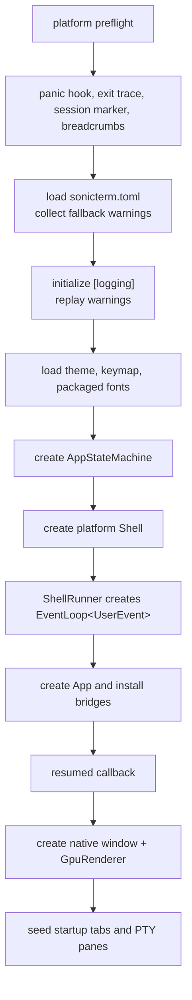
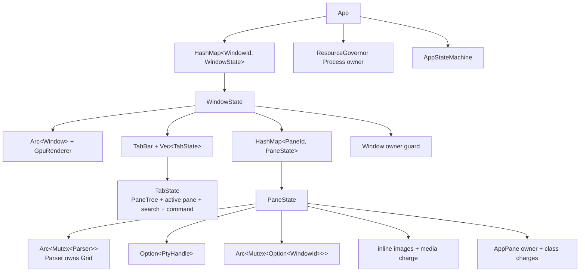
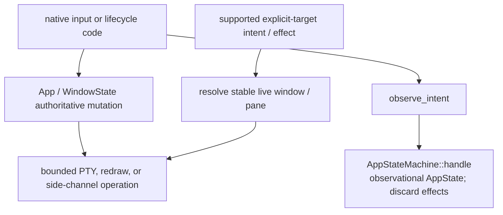

# Runtime Lifecycle

[简体中文](Runtime-Lifecycle-zh-CN)

Follow startup, tab and pane changes, then shutdown. Each section names the
object responsible and the order of work. The system map is in
[Architecture](Architecture); correctness checks are in
[Architecture Internals](Architecture-Internals).

### Process startup



macOS and Linux install panic and exit diagnostics before config loading.
Windows first sets per-monitor-v2 DPI awareness, parses CLI options, and queues
a startup script request. `--refresh-shell-associations` returns before the
normal diagnostics path. Other Windows startup continues with the same panic,
exit, session, breadcrumb, config, and logging setup.

A missing or invalid startup config falls back to defaults and records a
warning. The binaries delay logging initialization until after `[logging]` is
available, then replay collected warnings. Logging initialization itself is
best-effort.

All three binaries arm a session marker before normal application work. They
associate crash artifacts with that session and start a non-blocking breadcrumb
writer when available. An orderly return records `CleanShutdown`, flushes the
writer, and marks the session clean.

Platform startup adds these steps:

- macOS disables AppKit automatic window tabbing for the process before any
  SonicTerm window. It installs the native menu from the first `resumed` callback;
  the one-shot window-ready hook applies `setTabbingMode: 2` to the initial window.
- Windows initializes OLE on the UI thread. DWM backdrop and the `muda` menu are
  installed after an HWND exists. Native tab drag registration uses the same
  UI thread.
- Linux forces unsupported material backdrops to opaque and preflights all four
  packaged Rec Mono font faces. On every platform, `--runtime-smoke` uses
  separate scratch config/log roots, a 30-second in-app proof deadline, and a
  45-second process-tree watchdog.

The binaries load theme and keymap assets, create
`AppStateMachine::new(AppState::default())`, build `MacShell`, `WindowsShell`, or
`LinuxShell`, and call `run`.

Immediately before shell construction, each native binary records one typed
`ProcessPrivilege` snapshot for the SonicTerm process. Windows opens the current
process token with `TOKEN_QUERY`, reads `TOKEN_ELEVATION`, and closes the token
handle. A failed query is logged and classified as unprivileged rather than
claiming an elevation that was not observed. macOS and Linux compare `geteuid()`
with zero. The process snapshot is not inferred from usernames, environment
variables, shell prompts, or title text.

Separately, the Windows foreground-process probe selects the deepest descendant
of every tab's active pane, queries that PID's `TOKEN_ELEVATION`, and stores the
result on the owning tab. One process-table snapshot and ancestry index serve all
stale visible tabs in a window, including inactive tabs. If UIPI denies access to
a high-integrity leaf, the same selected ancestry is checked for the actual
`gsudo.exe` broker. This state shares the existing 500 ms foreground-title cache.
Accepted PTY input fixes a sample deadline 500 ms later; output activity debounces a
pre-warning sample until 500 ms of quiet but cannot postpone that input deadline.
While any per-tab warning remains in an otherwise regular process, fixed 500 ms
samples continue until the regular shell becomes foreground again. Unchanged
probe-only wakes do not repaint, and idle or globally elevated sessions add no
foreground-probe heartbeat. The state changes no title string and invalidates tab
chrome when only elevation changes. Other platforms use only the startup process
snapshot.

### Shell and event-loop construction

Each platform shell wraps one `ShellRunner`. The runner owns the state machine,
theme, config, keymap, process-privilege snapshot, optional asset loaders, native
drag hooks, startup payload, breadcrumb recorder, and one-shot native-window
hooks. It installs the snapshot on `App` before queuing any startup payload.
`App` then passes the same value to every main- and child-window render call, so
new tabs, new windows, and torn-out windows cannot disagree about process
privilege. The value participates in retained-frame identity.

`ShellRunner::run`:

1. calls idempotent tracing initialization;
2. creates `EventLoop<UserEvent>` with `ControlFlow::Wait`;
3. installs menu, OS-drag, and open-script proxy bridges;
4. constructs `App` with the state machine and event-loop proxy;
5. installs the optional hooks and backends;
6. queues any startup tab payload;
7. calls `run_app`.

A startup tab payload cannot be installed before a `WindowState` exists.
`new_tab_from_payload` therefore stores it in `pending_os_drag_payloads`.
After `resumed` creates the default startup shell, the app drains that queue and
creates an additional destination tab.

`App` implements `ApplicationHandler<UserEvent>`:

| Callback | Responsibility |
| --- | --- |
| `resumed` | run the one-shot resumed hook; create the first native window, renderer, owner records, tabs, and panes |
| `user_event` | handle typed redraw, menu, open-script, drag, update, process-exit, path-probe, input-rejection, and smoke events |
| `window_event` | handle keyboard, mouse, IME, resize, focus, redraw, and close for one `WindowId` |
| `new_events` | service `WaitUntil` deadlines and request deferred frames |
| `about_to_wait` | drain pending exit; maintain warm windows; sample/reclaim memory; expire notifications; choose the next wait deadline |
| `exiting` | record orderly event-loop exit |

After each `user_event`, pending window creation is drained before deferred
OS-drag teardown. This order lets a `DroppedOnEmpty` tear-out install its new
window before drag cleanup scans the live window map.

### First window and pane

`do_resumed` first runs the one-shot `on_resumed` hook. It bounds the configured
cell geometry, creates the native window, enables IME, applies the native
background, and reads the monitor refresh period.

Normal startup treats native window or renderer creation failure as fatal and
panics because there is no terminal window in which to report the failure.
Native runtime smoke records `Display` or `Gpu` failure and exits instead.

`GpuRenderer::new` creates or selects the shared wgpu context and builds the
window-specific surface, retained frame, atlases, caches, and font stacks. The
app resolves software-render degradation after the adapter is known and updates
frame pacing.

The app then:

1. registers native drag hooks for the window;
2. runs `on_window_ready` for platform work that needs a real handle;
3. creates the main `WindowState`;
4. inserts it with a `Window` resource owner;
5. creates startup script tabs or one default shell tab;
6. replays queued OS-drag payloads;
7. records `Ready` breadcrumbs.

### Window, tab, and pane ownership



The main window is one entry in `App::windows`. `main_window_id` identifies it.
Torn-out windows use the same `WindowState` type and the same event map.

`TabBar` stores tab identity, title, order, and active index. The parallel
`Vec<TabState>` stores one `PaneTree` per tab. Tree leaves are pane ids.
`WindowState::panes` stores the live `PaneState` objects for every tab in that
window.

`PaneState` owns the parser and optional PTY handle. The parser owns the grid.
The pane also owns terminal-mode atomics, command events, inline images, its
shared redraw target, resource reservations, and owner guard.

Process-wide state stays on `App`. This includes the command palette and its
attached window, broadcast state, resource governor, state machine, warm-window
pool, native drag backends, and event-loop scheduling flags.

### Creating tabs and splits

Ordinary new tabs and splits in main and child windows use the source pane's
validated local OSC 7 CWD when no explicit CWD is supplied. Only empty authority,
`localhost`, or the exact local hostname with a native absolute path of at most
4,096 decoded UTF-8 bytes qualifies. Explicit CWD wins; new windows do not inherit
pane CWD. OSC 133 `B` ends the prompt without starting timing; `C` starts execution,
and `A`/`D` retain their existing regions. See [Terminal IO and VT](Terminal-IO-and-VT).

A main-window tab allocates a pane id, creates parser/grid state, attempts to
spawn a PTY, starts worker threads on success, inserts one `Tab`, and inserts a
single-leaf `PaneTree`. It immediately reconciles the new pane's `AppPane`
owner.

Before creating a pane or PTY, both split helpers verify that the active tab's
focused id is a tree leaf with a live `PaneState`. A refused split preserves the
tree, zoom, and focus. A live child consumes its split request even when refused,
so neither action route can fall through to the main window. A main-window split
then creates another `PaneState`,
replaces the active tree leaf with a horizontal or vertical split, exits zoom on
success, and focuses the new visible leaf. It immediately reconciles its owner,
resizes each visible grid and PTY to its own rectangle, flashes focus, and
requests redraw. The active pane therefore participates in the next visible
layout and coherent parser-guard collection.

Main and child operations share `WindowState::complete_topology_change`.
Each operation chooses its focus, zoom, and tab placement; completion validates
the parallel tab collections and active/visible pane identity, derives visible
grid/PTY geometry, registers ownerless panes, resets the IME anchor cache,
invalidates hover, removes stale selection/scrollbar state, marks damage, and
requests redraw. Split, close, focus, tab navigation/reorder, merge, attach, and
tear-out reach this common boundary. Departing panes release both renderer row
caches through `remove_pane`; rollback preserves the source graph rather than
running success-only resize or focus effects.

If PTY spawn fails, the pane remains in the topology with `pty: None`. It has a
parser and grid but no reader, writer, VT worker, or child process.

### Pane process exit

A pane closes automatically only when its child has a known clean exit: status
zero and no terminating signal. The VT worker classifies the exit and sends
`UserEvent::PaneProcessExited { pane_id, was_clean }`.

| Classification | Result |
| --- | --- |
| `Some(true)` | close the pane; close its tab if it was the sole leaf; close or hide the window according to normal empty-window policy |
| `Some(false)` | keep the pane and its scrollback visible |
| `None` | keep the pane and its scrollback visible |

The worker, not the event loop, waits for exit status. PTY EOF and child status
becoming observable are unordered. `observe_child_exit_cleanliness` polls for
at most 250 ms with a 10 ms interval. It reports `None` on timeout or probe
failure.

Unix and Windows discover exit differently.

On macOS and Linux, the PTY reader reaches EOF and drops the output sender. The
VT worker sees channel disconnection. Its receive timeout is one hour, so an idle
pane has no periodic exit poll.

On Windows, the pane's own `HPCON` keeps the output channel open until
`PtyHandle` drops. The VT worker polls `PtyChildExitProbe` every 500 ms. That is
two wakeups per second per idle pane.

Before reporting Unix exit, the probe uses `waitid(..., WNOWAIT)` and kills the
child's process group/session descendants. It preserves status long enough to
classify clean versus unclean exit.

### Resource ownership and retention

The GUI's live resource tree is:

```text
Process
  Window
    AppPane
```

`App` creates the `Process` root. Inserting a window creates its `Window`
owner. Registering a window also reconciles panes already inside it. A failed
window registration logs a warning and leaves the window usable, but the window
and its panes stay outside hierarchy accounting for that window's lifetime.

Pane owners use `PANE_COMMITTED_BUDGET_BYTES`, which is twice the sum of the
charged seam caps. Process and window owners use tracking-only limits. The
per-seam caps remain the real memory limits; the pane budget is a total-ledger
backstop.

`about_to_wait` calls `sample_pane_retention`. The first call samples
immediately. Later calls run every 30 seconds. A dedicated memory deadline wakes
an otherwise idle event loop. A memory-only wake does not request a frame.

Each due pass runs in this order:

1. cancel captures whose progress was unchanged for two consecutive samples;
2. trim idle panes if process inline media exceeds 256 MiB;
3. repair pane-owner parentage and register ownerless panes;
4. measure each pane and resize its live charges;
5. emit aggregate, pane, session, and renderer diagnostics when their log levels
   are enabled;
6. record non-blocking resource breadcrumbs when a recorder exists.

Reclamation and charging are independent of log level. `measure_pane` uses
`try_lock` for the parser and inline-image store. A contended pane is skipped and
keeps its previous charge.

Charges resize in place; skipped or refused samples keep the prior charge and
may lag memory. Transfers move all charges atomically before guard replacement
or source reaping; refusal restores source custody. Unregistered destinations
accept no nonzero charge. Renderer storage is measured outside the governor.
See [Memory](Memory) for `try_resize`, `transfer_many`, and `transfer_batch`
accounting rules.

Release order is leaf-first:

1. drop or clear pane `CommittedReservation` values;
2. drop the pane `OwnerGuard`;
3. drop the window `OwnerGuard` after all pane guards.

A governor owner refuses to close while it has charges or open children.
`OwnerGuard::drop` logs a warning and leaves a refused record retained. It does
not retry.

### Input and effect state changes

Keyboard ownership and terminal-byte encoding are summarized in
[From Keypress to Pixel](From-Keypress-to-Pixel). Native input reaches
`write_to_pane` after local routing and encoding, without a transient reducer.
The pane's bounded queue and rejection diagnostics are the only admission path.



GUI `AppState` fields are compatibility observations, not live-topology decisions.
The independently usable reducer orders effects as `PtyWrite`, `Render`, `OsDrag`,
`Clipboard`, `WindowOp`, `MenubarUpdate`, then `Log`. Its private follow-on queue
is bounded by `MAX_CASCADE_DEPTH = 16`; no production path enqueues there, so
`drain_pending` normally returns an empty batch.

| Observational `AppState` fields | Authoritative live state |
| --- | --- |
| `cols`, `rows`, `last_window_pos` | each native window/renderer and pane grid geometry |
| `focused_window`, `live_window_count` | `App::windows`, `main_window_id`, native focus, and empty-window policy |
| `tab_count`, `active_tab_idx` | each window's `TabBar` and parallel `TabState` vector |
| `pane_count`, `focused_pane_idx`, `pane_zoomed` | active `TabState` and its `PaneTree` |
| `last_mouse_pos`, `mouse_left_down`, `selection_active` | window pointer gesture, cursor, and selection state |
| `search_open`, `palette_open` | tab search and the app palette's attached window |
| `fg_proc_name`, `broadcast_scope` | live pane process observations and `App::broadcast` |

The operational boundary is separate from those observations:

| Intent or explicit effect | GUI behavior |
| --- | --- |
| `PtyWrite` intent/effect | exact pane's bounded input queue |
| `PtyExit`; `PtyClose`, `ChildExitPropagate` effects | close the identified pane through live topology; report exit metadata |
| `PtyBurst`, `ForegroundProcChanged` intents | request the named live pane's current window redraw |
| `RedrawRequested`, pressed `Key`, IME start/preedit/end, hover, scroll, and wheel intents | redraw only the named live window; native handlers own encoding and content changes |
| `ImeCommit`, `Paste` intents | resolve the named live window's active pane and queue supplied text; native routes own overlay policy and paste wrapping |
| `ClickUrl`; `OpenURL`, nonempty `ClipboardSet`, `Notification` effects | native side channels, with URL validation; empty clipboard sentinel is inert |
| `Exit` intent; `Quit` effect | explicit application exit request |
| `Render`, `RenderDirtyRect`, `WindowResize` effects | named-window redraw only; no claim of native resize completion |
| `WindowOpen` effect | queue creation for the event loop; not a completed window |
| `ChildSpawn`, `OsDragStart/End`, `ClipboardRequest`, `WindowClose/Move/SetTitle`, `TimerSchedule/Cancel`, `MenubarUpdate` effects | record-only; native app/platform paths own the work |
| `LogEvent` effect | forward structured diagnostics |
| all other intents | `observe_intent` updates only compatibility state and discards the reducer batch |

Window keys start at one, are monotonic, and are removed on closure without
reuse. Missing, removed, and zero keys do not mean main or frontmost. Native
window-close and tab/pane actions run their existing live paths and only observe
the reducer; a stale `live_window_count` cannot close windows or trigger quit.
Source-less menu actions may select the current window, but an explicitly named
missing source never falls through to a different terminal.

### Redraw and wait lifecycle

A pane VT worker coalesces output and sends
`UserEvent::RequestRedraw(WindowId)` after 128 KiB, 8 ms maximum age, or 3 ms of
quiet. The event-loop thread resolves the current id. Transfer changes the
shared redraw target, so the worker follows the pane.

`RedrawRequested` can still be delayed to the next frame boundary. Hardware
uses the monitor period. Resolved degradation uses 25 ms, or 83.333 ms during
IME composition. Pure user input bypasses pacing on hardware; degradation can
coalesce it.

The event loop combines these deadlines into one `ControlFlow::WaitUntil`:

- pending main-window redraw;
- pending child-window redraws;
- cursor blink;
- notification expiry;
- five-second quit confirmation;
- scrollbar idle-hide;
- Windows OSC 52 clipboard reassertion when pending;
- Windows foreground-process sampling when armed;
- pending pointer-motion retries;
- 30-second memory sampling.

The earliest deadline wins. With no deadline, `ControlFlow::Wait` parks the
loop. A memory-only wake performs retention work without creating a heartbeat
redraw.

Frame collection uses non-blocking parser and image locks. One unavailable lock
defers the complete frame and sets that window's `retry_not_before` to the failed
attempt time plus its effective frame period. This floor is separate from the
last-frame timestamp and is combined with normal pacing. Input or redraw events
before it cannot bypass or extend it. A due failed attempt rearms from that
attempt; coherent collection clears it before renderer-specific retries, and
window removal discards it. Successful guards remain alive through
`GpuRenderer::render`; no blocking lock or unconditional heartbeat is added.

### Config reload and save

Configuration is loaded at startup and re-read only by
`Action::ReloadConfig`. There is no filesystem watcher or periodic reload.

Reload strictly parses `sonicterm.toml`. A parse failure keeps the active config
and writes a warning; it does not show a user notification. A successful base
parse clears the warm-window pool, then applies the new settings to all live
windows and panes.

Theme and keymap files are loaded separately. A theme or keymap load failure
writes a warning and retains the previously loaded asset. Other valid config
fields still apply, and the new base config becomes active. `[logging]` changes
cannot replace the installed tracing subscriber; they take effect on the next
process launch.

Depending on changed fields, reload can:

- update theme colors and parser palette replies;
- rebuild fonts and resize grids and PTYs when metrics change;
- update locale, cursor, padding, opacity, scrollbar, and panel layout;
- switch resolved software-render policy and surface settings;
- update scrollback, tab width, notification settings, and key hints;
- clear and later rebuild the warm-window pool.

**Save Current Settings** writes only the live `[font].size` and effective
`[font].weight_scale`. It does not save theme, locale, tabs, panes, or other
runtime state. The values are already live, so save does not reload or reapply
them.

Save behavior is:

1. validate finite font size and `weight_scale` in `0.5..=5.0`;
2. create the commented starter config if the file is absent;
3. resolve a destination symlink;
4. take an in-process path lock and a cross-process sidecar lock;
5. strict-parse the current file and preserve LF or CRLF convention;
6. patch only the two numeric values while preserving comments, unknown keys,
   order, decoration, and permissions;
7. write and `sync_all` a unique same-directory temporary file;
8. reject an external edit detected before replacement;
9. atomically rename or replace the destination.

The operation does not claim directory-fsync or power-loss durability. Success
updates both reset baselines and shows an Info notification. Failure leaves the
file, live settings, and baselines unchanged and shows an Error notification.

### Tab movement and tear-out

Mouse-down activates the pressed tab. Mouse-up may reorder, merge, or tear out
only when the cursor is at least 5 raster pixels from its press position.
Below that threshold it remains a click, even if another window's tab bar
overlaps the release point or the cursor slips just outside the source bar.
Main and child windows share this decision; keyboard tab navigation bypasses it.
The gesture captures `WindowId` and `TabId` at press time, and native handoff
retains the same stable identity. Reorder, merge, tear-out, and completion resolve
its current index immediately before mutation. Closing or reordering an earlier
tab cannot change the source; closing the captured tab or window cancels the
move. A drag chip uses the captured tab's current title and index.

For a genuine drag, a foreign tab bar takes precedence over source-bar reorder
or cancellation. Otherwise, in-process tear-out requires an inclusive 40-raster-
pixel vertical gap from the live bar's top or bottom edge. Horizontal exit alone
is insufficient. The shared detector uses the actual bar offset and font/scale-
derived height; this rule does not change native OS drag-handoff policy.

In-process reorder, merge, and tear-out move live `Tab`, `TabState`, and
`PaneState` values. `PtyHandle` is not cloned or respawned. Each successfully
attached pane gets the destination `WindowId` in its shared redraw target.
Attachment inserts and activates the tab before computing the destination's live
pane rectangles. Each visible grid and PTY receives only its final pane size,
never an intermediate whole-window resize. Zoom-hidden siblings keep their prior
valid sizes until unzoom resizes them to split rectangles before presentation.

`transfer_tab` validates source identity and destination readiness before
detaching. Direct `merge_child_into_target` and `merge_main_into_child` use the
same transaction. Attachment verifies pane custody, active/zoom identity, and
destination identity collisions before committing accounting. Refusal returns
`TabAttachmentError` with every live object; the transaction restores source
position and prior active-tab identity without resizing, changing redraw targets,
or releasing charges. Source hiding/reaping and destination focus occur only
after successful attachment.

The hidden warm-window pool reduces tear-out latency:

- default target: 1;
- zero disables the pool;
- normal hardware target: at most 5;
- an actual software adapter or resolved degradation caps every nonzero target
  at 1.

`about_to_wait` removes excess entries and creates at most one missing warm
window per pass. Adoption is last-in, first-out. A consumed or failed-adoption
entry is replaced on a later idle pass. Warm windows stay outside `App::windows`
and have no resource owner until promoted.

New-window tear-out holds the detached tab, tab state, panes, source index, and
prior active-tab identity in one transaction. Native window creation, renderer
initialization, and renderer configuration are the three fallible preparation
stages. Fresh and pooled destinations remain hidden throughout preparation. A
failure disposes of its partial destination before restoring the source: fresh
window and renderer objects drop while still unregistered, and a pooled renderer
that was mutated during failed adoption is retired rather than returned to the
pool. The transaction is then reinserted at its original source index and the
prior active tab is restored. Rollback does not resize grids or PTYs, rewrite
redraw targets, reattribute owners, clear charges, hide the main window, or reap
a child window.

After native preparation succeeds, native drop-target registration must succeed
before accounting admission. Registration failure drops the hidden destination
and restores the source transaction before any ownership transfer. The app then
prepares destination owners and transfers all pane charges before changing redraw
targets, inserting the live window into `App::windows`, or sizing its panes. An
accounting refusal revokes the native registration, drops the hidden artifacts,
and restores the source transaction. Success reveals the destination once and
requests its first frame; only then may source neighbour activation, hiding, or
reaping run. Reducer departure observations are record-only and cannot execute a
second native operation.

Native drag support differs by platform:

- Windows OLE supports an in-process drag gesture and same-process drop routing.
  A drop onto empty desktop becomes in-process tear-out.
- macOS publishes a pasteboard payload but starts no `NSDraggingSession` and
  receives no destination acknowledgment. The sink returns
  `DragAck::NotAcknowledged`, so the source stays local and falls back to
  in-process tear-out.
- Linux installs no native drag backend. In-process window merge and tear-out
  remain available.

The startup CLI and pasteboard paths can seed a serialized payload when a new
process launches. The Windows OLE destination accepts tab data only for an active
same-process gesture whose payload matches exactly and parses successfully;
foreign or malformed payloads are refused without enqueueing a transfer or
acknowledging a move. The macOS gesture has no native destination acknowledgment.
Native drag therefore does not complete an acknowledged cross-process transfer.
A source tab is never detached solely on an unacknowledged payload publication.

### Pane and window closure

Closing a pane removes it from its `PaneTree` and pane map. Dropping its
`PtyHandle` starts bounded I/O cancellation, child termination, native master
close, and reap. Exact platform deadlines are in
[Architecture Internals](Architecture-Internals).

If a pane was the only leaf, closing it closes the tab. Child windows are reaped
when their last tab closes. The main window can become hidden while child
windows remain. Its `WindowState` remains the identified main entry until a
later policy shows or replaces it.

When an action sets `pending_exit`, `about_to_wait` clears it and calls
`ActiveEventLoop::exit`. With no active terminal window, normal last-window
policy also reaches this path.

On macOS, the Cmd+Q chord uses a two-press guard. The first non-repeat press shows
`Press ⌘Q one more time to quit`. A second press within five seconds exits.
Auto-repeat is ignored. The explicit native Quit command can request exit
without this key-chord guard.

A queued redraw from a closed pane contains only `WindowId`. If that window
still exists, it may request one harmless extra frame. If the id is stale, the
event loop ignores it. The removed pane can no longer contribute `PaneRender`.

### Clean process exit

`run_app` returns after the event loop exits. The platform binary records a
`CleanShutdown` breadcrumb only for an orderly result. It then shuts down the
breadcrumb writer. After the writer flushes, it marks the armed session clean.

If startup or runtime returns an error, the clean marker remains absent. Panic,
exit, session-state, and breadcrumb records let the next launch classify the
previous session.

Every native runtime smoke maps each failed boundary to a stable nonzero exit
code; warm creation/reporting/adoption/release is code `16`. An orderly smoke
result also flushes breadcrumbs and marks its session clean.

### Source map

| Lifecycle | Primary paths |
| --- | --- |
| Platform startup | `crates/sonicterm-{mac,windows,linux}/src/main.rs` |
| Shell runner | `crates/sonicterm-app/src/shell.rs` |
| Winit callbacks and waits | `crates/sonicterm-app/src/app/{event_loop,window_event}.rs` |
| App, window, tab, and pane ownership | `crates/sonicterm-app/src/app/{mod,tab_state}.rs` |
| Main and child pane creation | `crates/sonicterm-app/src/app/{spawn_pane,child_window,misc}.rs` |
| Pane exit policy | `crates/sonicterm-app/src/app/pane_exit.rs` |
| Resource charging | `crates/sonicterm-app/src/app/retention.rs` |
| Config reload and save | `crates/sonicterm-app/src/app/config_apply.rs`, `crates/sonicterm-cfg/src/config.rs` |
| Tab transfer and tear-out | `crates/sonicterm-app/src/app/{tab_transfer,tear_out,child_window}.rs` |
| Native drag backends | `crates/sonicterm-{mac,windows}/src/{os_drag_*,tab_drag_os}.rs` |
| PTY teardown | `crates/sonicterm-io/src/pty.rs` |
