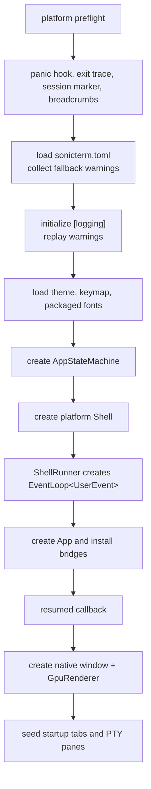
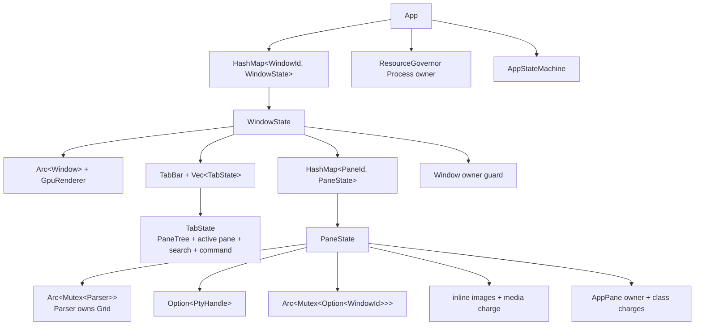
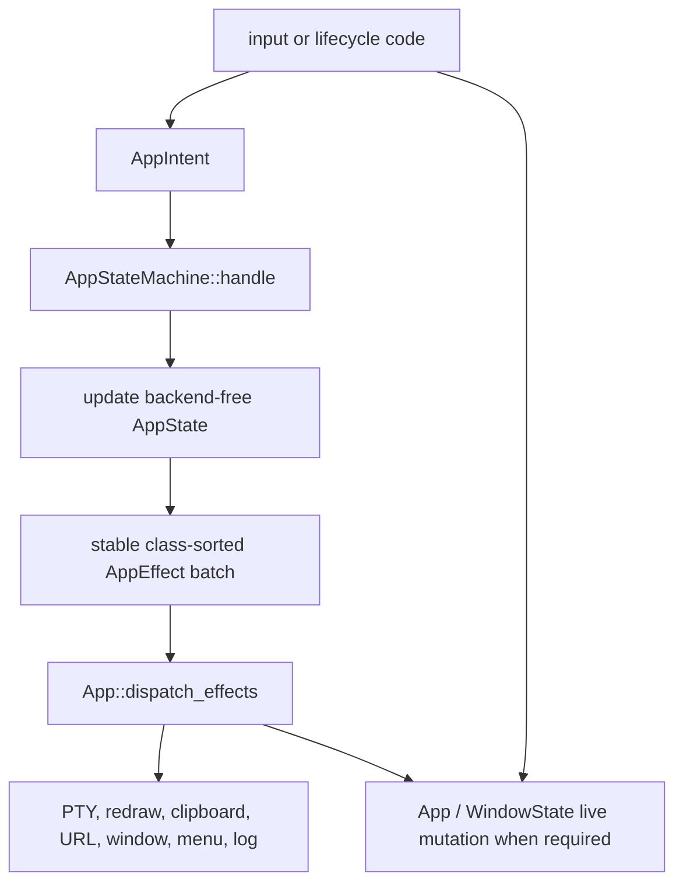
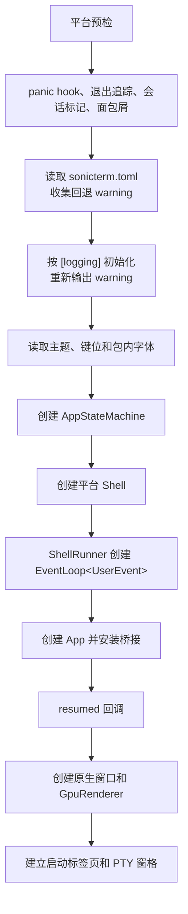
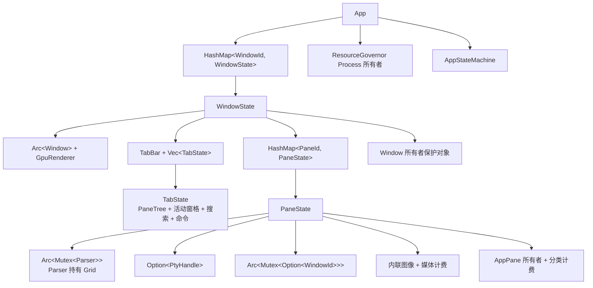
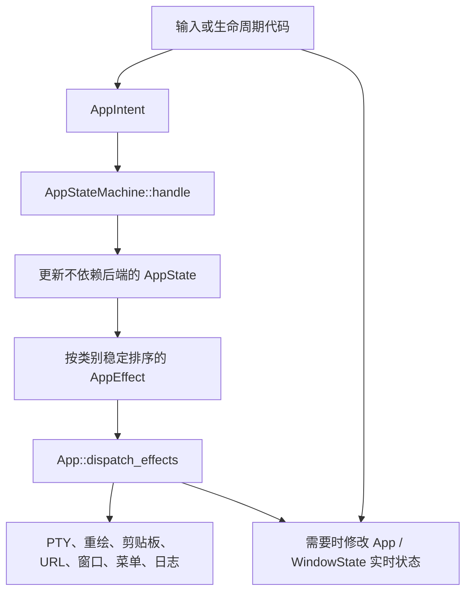

# Runtime Lifecycle / 运行时生命周期

## English

This page owns runtime ownership and state changes, from process startup to
process exit. See [Architecture](Architecture) for crate boundaries,
[From Keypress to Pixel](From-Keypress-to-Pixel) for the byte-to-frame path, and
[Architecture Internals](Architecture-Internals) for load-bearing checks.

### Process startup



macOS and Linux install panic and exit diagnostics before config loading.
Windows first sets per-monitor-v2 DPI awareness, parses CLI options, and queues
a startup script request. `--refresh-shell-associations` returns before the
normal diagnostics path. Other Windows startup continues with the same panic,
exit, session, breadcrumb, config, and logging setup.

A missing or invalid startup config falls back to defaults and records a
warning. The binaries delay logging initialization until after `[logging]` is
available, then replay collected warnings. Logging initialization itself is
best-effort.

All three binaries arm a session marker before normal application work. They
associate crash artifacts with that session and start a non-blocking breadcrumb
writer when available. An orderly return records `CleanShutdown`, flushes the
writer, and marks the session clean.

Platform startup adds these steps:

- macOS disables AppKit automatic window tabbing before any SonicTerm window.
  It installs the native menu from the first `resumed` callback and applies
  `setTabbingMode: 2` after each native window exists.
- Windows initializes OLE on the UI thread. DWM backdrop and the `muda` menu are
  installed after an HWND exists. Native tab drag registration uses the same
  UI thread.
- Linux forces unsupported material backdrops to opaque and preflights all four
  packaged Rec Mono font faces. On every platform, `--runtime-smoke` uses
  separate scratch config/log roots, a 30-second in-app proof deadline, and a
  45-second process-tree watchdog.

The binaries load theme and keymap assets, create
`AppStateMachine::new(AppState::default())`, build `MacShell`, `WindowsShell`, or
`LinuxShell`, and call `run`.

Immediately before shell construction, each native binary records one typed
`ProcessPrivilege` snapshot for the SonicTerm process. Windows opens the current
process token with `TOKEN_QUERY`, reads `TOKEN_ELEVATION`, and closes the token
handle. A failed query is logged and classified as unprivileged rather than
claiming an elevation that was not observed. macOS and Linux compare `geteuid()`
with zero. The process snapshot is not inferred from usernames, environment
variables, shell prompts, or title text.

Separately, the Windows foreground-process probe selects the deepest descendant
of every tab's active pane, queries that PID's `TOKEN_ELEVATION`, and stores the
result on the owning tab. One process-table snapshot and ancestry index serve all
stale visible tabs in a window, including inactive tabs. If UIPI denies access to
a high-integrity leaf, the same selected ancestry is checked for the actual
`gsudo.exe` broker. This state shares the existing 500 ms foreground-title cache.
Accepted PTY input fixes a sample deadline 500 ms later; output activity debounces a
pre-warning sample until 500 ms of quiet but cannot postpone that input deadline.
While any per-tab warning remains in an otherwise regular process, fixed 500 ms
samples continue until the regular shell becomes foreground again. Unchanged
probe-only wakes do not repaint, and idle or globally elevated sessions add no
foreground-probe heartbeat. The state changes no title string and invalidates tab
chrome when only elevation changes. Other platforms use only the startup process
snapshot.

### Shell and event-loop construction

Each platform shell wraps one `ShellRunner`. The runner owns the state machine,
theme, config, keymap, process-privilege snapshot, optional asset loaders, native
drag hooks, startup payload, breadcrumb recorder, and one-shot native-window
hooks. It installs the snapshot on `App` before queuing any startup payload.
`App` then passes the same value to every main- and child-window render call, so
new tabs, new windows, and torn-out windows cannot disagree about process
privilege. The value participates in retained-frame identity.

`ShellRunner::run`:

1. calls idempotent tracing initialization;
2. creates `EventLoop<UserEvent>` with `ControlFlow::Wait`;
3. installs menu, OS-drag, and open-script proxy bridges;
4. constructs `App` with the state machine and event-loop proxy;
5. installs the optional hooks and backends;
6. queues any startup tab payload;
7. calls `run_app`.

A startup tab payload cannot be installed before a `WindowState` exists.
`new_tab_from_payload` therefore stores it in `pending_os_drag_payloads`.
After `resumed` creates the default startup shell, the app drains that queue and
creates an additional destination tab.

`App` implements `ApplicationHandler<UserEvent>`:

| Callback | Responsibility |
| --- | --- |
| `resumed` | run the one-shot resumed hook; create the first native window, renderer, owner records, tabs, and panes |
| `user_event` | handle typed redraw, menu, open-script, drag, update, process-exit, path-probe, input-rejection, and smoke events |
| `window_event` | handle keyboard, mouse, IME, resize, focus, redraw, and close for one `WindowId` |
| `new_events` | service `WaitUntil` deadlines and request deferred frames |
| `about_to_wait` | drain pending exit; maintain warm windows; sample/reclaim memory; expire notifications; choose the next wait deadline |
| `exiting` | record orderly event-loop exit |

After each `user_event`, pending window creation is drained before deferred
OS-drag teardown. This order lets a `DroppedOnEmpty` tear-out install its new
window before drag cleanup scans the live window map.

### First window and pane

`do_resumed` first runs the one-shot `on_resumed` hook. It bounds the configured
cell geometry, creates the native window, enables IME, applies the native
background, and reads the monitor refresh period.

Normal startup treats native window or renderer creation failure as fatal and
panics because there is no terminal window in which to report the failure.
Native runtime smoke records `Display` or `Gpu` failure and exits instead.

`GpuRenderer::new` creates or selects the shared wgpu context and builds the
window-specific surface, retained frame, atlases, caches, and font stacks. The
app resolves software-render degradation after the adapter is known and updates
frame pacing.

The app then:

1. registers native drag hooks for the window;
2. runs `on_window_ready` for platform work that needs a real handle;
3. creates the main `WindowState`;
4. inserts it with a `Window` resource owner;
5. creates startup script tabs or one default shell tab;
6. replays queued OS-drag payloads;
7. records `Ready` breadcrumbs.

### Window, tab, and pane ownership



The main window is one entry in `App::windows`. `main_window_id` identifies it.
Torn-out windows use the same `WindowState` type and the same event map.

`TabBar` stores tab identity, title, order, and active index. The parallel
`Vec<TabState>` stores one `PaneTree` per tab. Tree leaves are pane ids.
`WindowState::panes` stores the live `PaneState` objects for every tab in that
window.

`PaneState` owns the parser and optional PTY handle. The parser owns the grid.
The pane also owns terminal-mode atomics, command events, inline images, its
shared redraw target, resource reservations, and owner guard.

Process-wide state stays on `App`. This includes the command palette and its
attached window, broadcast state, resource governor, state machine, warm-window
pool, native drag backends, and event-loop scheduling flags.

### Creating tabs and splits

A main-window tab allocates a pane id, creates parser/grid state, attempts to
spawn a PTY, starts worker threads on success, inserts one `Tab`, and inserts a
single-leaf `PaneTree`. It immediately reconciles the new pane's `AppPane`
owner.

Before creating a pane or PTY, both split helpers verify that the active tab's
focused id is a tree leaf with a live `PaneState`. A refused split preserves the
tree, zoom, and focus. A live child consumes its split request even when refused,
so neither action route can fall through to the main window. A main-window split
then creates another `PaneState`,
replaces the active tree leaf with a horizontal or vertical split, exits zoom on
success, and focuses the new visible leaf. It immediately reconciles its owner,
resizes each visible grid and PTY to its own rectangle, flashes focus, and
requests redraw. The active pane therefore participates in the next visible
layout and coherent parser-guard collection.

Child-window tab and split helpers perform the same pane, tree, resize, and
redraw work. They do not call owner reconciliation at the insertion site. Those
new panes remain ownerless until another reconciliation pass, normally the next
30-second retention sample or another operation that invokes reconciliation.

If PTY spawn fails, the pane remains in the topology with `pty: None`. It has a
parser and grid but no reader, writer, VT worker, or child process.

### Pane process exit

A pane closes automatically only when its child has a known clean exit: status
zero and no terminating signal. The VT worker classifies the exit and sends
`UserEvent::PaneProcessExited { pane_id, was_clean }`.

| Classification | Result |
| --- | --- |
| `Some(true)` | close the pane; close its tab if it was the sole leaf; close or hide the window according to normal empty-window policy |
| `Some(false)` | keep the pane and its scrollback visible |
| `None` | keep the pane and its scrollback visible |

The worker, not the event loop, waits for exit status. PTY EOF and child status
becoming observable are unordered. `observe_child_exit_cleanliness` polls for
at most 250 ms with a 10 ms interval. It reports `None` on timeout or probe
failure.

Unix and Windows discover exit differently.

On macOS and Linux, the PTY reader reaches EOF and drops the output sender. The
VT worker sees channel disconnection. Its receive timeout is one hour, so an idle
pane has no periodic exit poll.

On Windows, the pane's own `HPCON` keeps the output channel open until
`PtyHandle` drops. The VT worker polls `PtyChildExitProbe` every 500 ms. That is
two wakeups per second per idle pane.

Before reporting Unix exit, the probe uses `waitid(..., WNOWAIT)` and kills the
child's process group/session descendants. It preserves status long enough to
classify clean versus unclean exit.

### Resource ownership and retention

The GUI's live resource tree is:

```text
Process
  Window
    AppPane
```

`App` creates the `Process` root. Inserting a window creates its `Window`
owner. Registering a window also reconciles panes already inside it. A failed
window registration logs a warning and leaves the window usable, but the window
and its panes stay outside hierarchy accounting for that window's lifetime.

Pane owners use `PANE_COMMITTED_BUDGET_BYTES`, which is twice the sum of the
charged seam caps. Process and window owners use tracking-only limits. The
per-seam caps remain the real memory limits; the pane budget is a total-ledger
backstop.

`about_to_wait` calls `sample_pane_retention`. The first call samples
immediately. Later calls run every 30 seconds. A dedicated memory deadline wakes
an otherwise idle event loop. A memory-only wake does not request a frame.

Each due pass runs in this order:

1. cancel captures whose progress was unchanged for two consecutive samples;
2. trim idle panes if process inline media exceeds 256 MiB;
3. repair pane-owner parentage and register ownerless panes;
4. measure each pane and resize its live charges;
5. emit aggregate, pane, session, and renderer diagnostics when their log levels
   are enabled;
6. record non-blocking resource breadcrumbs when a recorder exists.

Reclamation and charging are independent of log level. `measure_pane` uses
`try_lock` for the parser and inline-image store. A contended pane is skipped and
keeps its previous charge.

Moving a pane between windows carries its old owner guard. Re-attribution finds
that parent mismatch, clears the old charges, closes the old owner, and creates
a new owner below the destination window. The new owner is recharged from a new
measurement during the next charge pass. An eager transfer outside a due sample
can therefore show zero ledger usage for that pane until the next 30-second
pass.

Renderer surfaces, glyph atlases, image atlases, and software frames are
reported separately. They are not charged to this governor.

Release order is leaf-first:

1. drop or clear pane `CommittedReservation` values;
2. drop the pane `OwnerGuard`;
3. drop the window `OwnerGuard` after all pane guards.

A governor owner refuses to close while it has charges or open children.
`OwnerGuard::drop` logs a warning and leaves a refused record retained. It does
not retry.

### Input and effect state changes

Keyboard ownership and terminal-byte encoding are summarized in
[From Keypress to Pixel](From-Keypress-to-Pixel). The key lifecycle is:
local owner → keymap → `encode_key` → PTY intent/effect → bounded input queue.

`App::dispatch_intent` routes one `AppIntent` through
`AppStateMachine::handle`. The reducer updates `AppState` and returns a stable
class-sorted effect batch. `App::dispatch_effects` then crosses application
boundaries.



The two state domains are explicit. `AppState` is authoritative for values the
reducer owns. `App` and `WindowState` are authoritative for live winit windows,
`PaneTree`, parsers, renderers, and PTYs. Some effects perform work directly.
Others record a reducer decision while the native path performs the mutation.

### Redraw and wait lifecycle

A pane VT worker coalesces output and sends
`UserEvent::RequestRedraw(WindowId)` after 128 KiB, 8 ms maximum age, or 3 ms of
quiet. The event-loop thread resolves the current id. Transfer changes the
shared redraw target, so the worker follows the pane.

`RedrawRequested` can still be delayed to the next frame boundary. Hardware
uses the monitor period. Resolved degradation uses 25 ms, or 83.333 ms during
IME composition. Pure user input bypasses pacing on hardware; degradation can
coalesce it.

The event loop combines these deadlines into one `ControlFlow::WaitUntil`:

- pending main-window redraw;
- pending child-window redraws;
- cursor blink;
- notification expiry;
- five-second quit confirmation;
- 30-second memory sampling.

The earliest deadline wins. With no deadline, `ControlFlow::Wait` parks the
loop. A memory-only wake performs retention work without creating a heartbeat
redraw.

Frame collection uses non-blocking parser and image locks. One unavailable lock
defers the complete frame and arms another deadline. Successful guards remain
alive through `GpuRenderer::render`.

### Config reload and save

Configuration is loaded at startup and re-read only by
`Action::ReloadConfig`. There is no filesystem watcher or periodic reload.

Reload strictly parses `sonicterm.toml`. A parse failure keeps the active config
and writes a warning; it does not show a user notification. A successful base
parse clears the warm-window pool, then applies the new settings to all live
windows and panes.

Theme and keymap files are loaded separately. A theme or keymap load failure
writes a warning and retains the previously loaded asset. Other valid config
fields still apply, and the new base config becomes active. `[logging]` changes
cannot replace the installed tracing subscriber; they take effect on the next
process launch.

Depending on changed fields, reload can:

- update theme colors and parser palette replies;
- rebuild fonts and resize grids and PTYs when metrics change;
- update locale, cursor, padding, opacity, scrollbar, and panel layout;
- switch resolved software-render policy and surface settings;
- update scrollback, tab width, notification settings, and key hints;
- clear and later rebuild the warm-window pool.

**Save Current Settings** writes only the live `[font].size` and effective
`[font].weight_scale`. It does not save theme, locale, tabs, panes, or other
runtime state. The values are already live, so save does not reload or reapply
them.

Save behavior is:

1. validate finite font size and `weight_scale` in `0.5..=5.0`;
2. create the commented starter config if the file is absent;
3. resolve a destination symlink;
4. take an in-process path lock and a cross-process sidecar lock;
5. strict-parse the current file and preserve LF or CRLF convention;
6. patch only the two numeric values while preserving comments, unknown keys,
   order, decoration, and permissions;
7. write and `sync_all` a unique same-directory temporary file;
8. reject an external edit detected before replacement;
9. atomically rename or replace the destination.

The operation does not claim directory-fsync or power-loss durability. Success
updates both reset baselines and shows an Info notification. Failure leaves the
file, live settings, and baselines unchanged and shows an Error notification.

### Tab movement and tear-out

In-process reorder, merge, and tear-out move live `Tab`, `TabState`, and
`PaneState` values. `PtyHandle` is not cloned or respawned. Each successfully
attached pane gets the destination `WindowId` in its shared redraw target.

`transfer_tab` checks source bounds and destination-window existence before it
detaches. That check does not prove a child destination has a renderer. If
`attach_to_child` then refuses, the detached panes drop and their children
terminate. Direct `merge_child_into_target` and `merge_main_into_child` also
detach before attachment and have the same loss-on-failure behavior.

The hidden warm-window pool reduces tear-out latency:

- default target: 1;
- zero disables the pool;
- normal hardware target: at most 5;
- an actual software adapter or resolved degradation caps every nonzero target
  at 1.

`about_to_wait` removes excess entries and creates at most one missing warm
window per pass. Adoption is last-in, first-out. A consumed or failed-adoption
entry is replaced on a later idle pass. Warm windows stay outside `App::windows`
and have no resource owner until promoted.

New-window tear-out holds the detached tab, tab state, panes, source index, and
prior active-tab identity in one transaction. Native window creation, renderer
initialization, and renderer configuration are the three fallible preparation
stages. Fresh and pooled destinations remain hidden throughout preparation. A
failure disposes of its partial destination before restoring the source: fresh
window and renderer objects drop while still unregistered, and a pooled renderer
that was mutated during failed adoption is retired rather than returned to the
pool. The transaction is then reinserted at its original source index and the
prior active tab is restored. Rollback does not resize grids or PTYs, rewrite
redraw targets, reattribute owners, clear charges, hide the main window, or reap
a child window.

After preparation succeeds, commit changes pane redraw targets, registers and
sizes the destination, then reveals it once and requests its first frame.
Source-side neighbour activation, hiding, or reaping runs only after that commit.
The reducer records a main tab as leaving its source strip only after the chosen
merge, OS-handoff, or new-window route reports commitment.

Native drag support differs by platform:

- Windows OLE supports an in-process drag gesture and same-process drop routing.
  A drop onto empty desktop becomes in-process tear-out.
- macOS publishes a pasteboard payload but starts no `NSDraggingSession` and
  receives no destination acknowledgment. The sink returns
  `DragAck::NotAcknowledged`, so the source stays local and falls back to
  in-process tear-out.
- Linux installs no native drag backend. In-process window merge and tear-out
  remain available.

The startup CLI and pasteboard paths can seed a serialized payload when a new
process launches. The Windows OLE destination currently parses an external
payload but does not enqueue it into the app. The macOS gesture has no native
destination acknowledgment. Native drag therefore does not complete an
acknowledged cross-process transfer. A source tab is never detached solely on
an unacknowledged payload publication.

### Pane and window closure

Closing a pane removes it from its `PaneTree` and pane map. Dropping its
`PtyHandle` starts bounded I/O cancellation, child termination, native master
close, and reap. Exact platform deadlines are in
[Architecture Internals](Architecture-Internals).

If a pane was the only leaf, closing it closes the tab. Child windows are reaped
when their last tab closes. The main window can become hidden while child
windows remain. Its `WindowState` remains the identified main entry until a
later policy shows or replaces it.

When an action sets `pending_exit`, `about_to_wait` clears it and calls
`ActiveEventLoop::exit`. With no active terminal window, normal last-window
policy also reaches this path.

On macOS, the Cmd+Q chord uses a two-press guard. The first non-repeat press shows
`Press ⌘Q one more time to quit`. A second press within five seconds exits.
Auto-repeat is ignored. The explicit native Quit command can request exit
without this key-chord guard.

A queued redraw from a closed pane contains only `WindowId`. If that window
still exists, it may request one harmless extra frame. If the id is stale, the
event loop ignores it. The removed pane can no longer contribute `PaneRender`.

### Clean process exit

`run_app` returns after the event loop exits. The platform binary records a
`CleanShutdown` breadcrumb only for an orderly result. It then shuts down the
breadcrumb writer. After the writer flushes, it marks the armed session clean.

If startup or runtime returns an error, the clean marker remains absent. Panic,
exit, session-state, and breadcrumb records let the next launch classify the
previous session.

Every native runtime smoke maps each failed boundary to a stable nonzero exit
code; warm creation/reporting/adoption/release is code `16`. An orderly smoke
result also flushes breadcrumbs and marks its session clean.

### Source map

| Lifecycle | Primary paths |
| --- | --- |
| Platform startup | `crates/sonicterm-{mac,windows,linux}/src/main.rs` |
| Shell runner | `crates/sonicterm-app/src/shell.rs` |
| Winit callbacks and waits | `crates/sonicterm-app/src/app/{event_loop,window_event}.rs` |
| App, window, tab, and pane ownership | `crates/sonicterm-app/src/app/{mod,tab_state}.rs` |
| Main and child pane creation | `crates/sonicterm-app/src/app/{spawn_pane,child_window,misc}.rs` |
| Pane exit policy | `crates/sonicterm-app/src/app/pane_exit.rs` |
| Resource charging | `crates/sonicterm-app/src/app/retention.rs` |
| Config reload and save | `crates/sonicterm-app/src/app/config_apply.rs`, `crates/sonicterm-cfg/src/config.rs` |
| Tab transfer and tear-out | `crates/sonicterm-app/src/app/{tab_transfer,tear_out,child_window}.rs` |
| Native drag backends | `crates/sonicterm-{mac,windows}/src/{os_drag_*,tab_drag_os}.rs` |
| PTY teardown | `crates/sonicterm-io/src/pty.rs` |

## 中文

本页只说明运行时所有权和状态变化，范围从进程启动到进程退出。crate 边界见
[架构](Architecture)，字节到画面的路径见 [从按键到像素](From-Keypress-to-Pixel)，
关键验证条件见 [架构内部机制](Architecture-Internals)。

### 进程启动



macOS 和 Linux 会在读取配置前安装 panic 与退出诊断。Windows 先设置 per-monitor-v2 DPI，
解析命令行，并排队启动脚本请求。`--refresh-shell-associations` 会在普通诊断路径前直接返回。
其它 Windows 启动路径随后执行相同的 panic、退出、会话、面包屑、配置和日志初始化。

启动配置缺失或无效时，应用使用默认值并保存 warning。三个二进制都等拿到 `[logging]` 后
才初始化日志，再输出此前收集的 warning。日志初始化本身采用尽力而为策略。

三个二进制都会在普通应用工作前建立会话标记。它们把崩溃产物关联到该会话，并在可用时启动
非阻塞面包屑 writer。有序返回会记录 `CleanShutdown`，刷完 writer，再把会话标成干净。

平台启动还会执行以下工作：

- macOS 在任何 SonicTerm 窗口出现前关闭 AppKit 自动标签页。第一次 `resumed` 回调安装原生
  菜单；每个原生窗口出现后调用 `setTabbingMode: 2`。
- Windows 在界面线程初始化 OLE。HWND 出现后才安装 DWM 背景和 `muda` 菜单。原生标签页
  拖动注册也在同一界面线程完成。
- Linux 把不支持的材质背景改为不透明，并预检四个包内 Rec Mono 字体文件。所有平台的
  `--runtime-smoke` 都使用分开的临时 config/log 根目录、30 秒应用内证明期限和 45 秒完整
  进程树看门狗。

三个二进制随后读取主题和键位，创建
`AppStateMachine::new(AppState::default())`，构建 `MacShell`、`WindowsShell` 或
`LinuxShell`，再调用 `run`。

每个原生二进制都在构建 shell 前，为 SonicTerm 进程记录一次带类型的
`ProcessPrivilege` 快照。Windows 以 `TOKEN_QUERY` 打开当前进程 token，读取
`TOKEN_ELEVATION`，再关闭 token 句柄；查询失败时记录日志并归类为非特权，不会声称未观测到
的提升状态。macOS 和 Linux 则判断 `geteuid()` 是否为零。进程快照不从用户名、环境变量、
shell 提示符或标题文本推断。

除此之外，Windows 前台进程探测会选择每个标签页活动窗格最深的后代进程，读取该 PID 的
`TOKEN_ELEVATION`，并把结果保存在所属标签页。一个窗口内所有缓存过期的可见标签页（包括
非活动标签页）会共用一次进程表快照和祖先索引。若 UIPI 拒绝访问高完整性叶进程，同一条已选
祖先路径会检查真实的 `gsudo.exe` broker。该状态复用现有的 500 毫秒前台标题缓存。PTY
成功接受输入后，会固定安排 500 毫秒后的探测；在尚未显示警告时，输出活动会把探测延后到
静默 500 毫秒，但不能推迟由输入固定的期限。只要普通权限的 SonicTerm 中仍有按标签页警告，
就每 500 毫秒进行一次固定探测，直到普通 shell 重新成为前台。仅探测且结果未变化的唤醒不会
重绘；空闲会话和全局已提升的会话不会增加前台探测心跳。该状态不修改任何标题字符串；即使只
改变权限也会让所属标签页界面失效重绘。其它平台只使用启动时的进程快照。

### Shell 与事件循环构建

每个平台 shell 都包装同一个 `ShellRunner`。runner 持有状态机、主题、配置、键位、进程权限
快照、可选资源加载器、原生拖动钩子、启动 payload、面包屑 recorder 和一次性原生窗口钩子。
它会在排队任何启动 payload 前把快照安装到 `App`。随后 `App` 把同一个值传给主窗口和每个
子窗口的渲染调用，所以新标签页、新窗口和拆出窗口不会对进程权限得出不同结论。Windows 中每个标签页还会把自己的
前台进程权限状态与该全局值合并；普通 SonicTerm 内通过 `gsudo` 运行的提升命令因此只警告
所属标签页。该值也参与保留帧身份计算。

`ShellRunner::run` 依次：

1. 执行可重复调用的 tracing 初始化；
2. 创建 `EventLoop<UserEvent>`，初始 `ControlFlow::Wait`；
3. 安装菜单、OS 拖动和脚本打开代理桥；
4. 用状态机和事件循环代理构建 `App`；
5. 安装可选钩子与平台后端；
6. 排队启动标签页 payload；
7. 调用 `run_app`。

启动 payload 到达时如果还没有 `WindowState`，就不能直接建立标签页。
`new_tab_from_payload` 会把它存入 `pending_os_drag_payloads`。`resumed` 先创建默认 shell，
随后再清空该队列，建立额外的目标标签页。

`App` 实现 `ApplicationHandler<UserEvent>`：

| 回调 | 职责 |
| --- | --- |
| `resumed` | 运行一次性 resumed 钩子；创建首个原生窗口、渲染器、所有者记录、标签页和窗格 |
| `user_event` | 处理类型化重绘、菜单、脚本打开、拖动、更新、进程退出、路径探测、输入拒绝和冒烟事件 |
| `window_event` | 按 `WindowId` 处理键盘、鼠标、输入法、尺寸、焦点、重绘和关闭 |
| `new_events` | 处理 `WaitUntil` 到期，并请求延迟帧 |
| `about_to_wait` | 消费待退出状态；维护预热窗口；采样和回收内存；让通知过期；选择下一次唤醒期限 |
| `exiting` | 记录事件循环有序退出 |

每个 `user_event` 处理完后，代码会先创建待处理窗口，再执行延迟的 OS 拖动清理。这样
`DroppedOnEmpty` 拆出路径能先把新窗口放进存活窗口表，拖动清理随后再遍历该表。

### 首个窗口与窗格

`do_resumed` 先运行一次性 `on_resumed` 钩子。随后限制配置的单元格几何，创建原生窗口，
开启输入法，设置原生背景，并读取显示器刷新周期。

普通启动中，原生窗口或渲染器创建失败会 panic。此时没有终端窗口可以显示错误，因此该失败
不可继续。原生运行冒烟测试则记录 `Display` 或 `Gpu` 失败后退出。

`GpuRenderer::new` 创建或选择共享 wgpu 上下文，再建立窗口专用表面、保留帧、图集、缓存和
字体栈。适配器确定后，应用才解析软件渲染降级状态并更新帧节奏。

随后应用：

1. 为窗口注册原生拖动钩子；
2. 运行需要真实窗口句柄的 `on_window_ready`；
3. 创建主 `WindowState`；
4. 连同 `Window` 资源所有者一起插入；
5. 建立启动脚本标签页，或一个默认 shell 标签页；
6. 重放排队的 OS 拖动 payload；
7. 记录 `Ready` 面包屑。

### 窗口、标签页与窗格所有权



主窗口是 `App::windows` 中的普通条目，由 `main_window_id` 标识。拆出窗口使用同一种
`WindowState`，并进入同一事件表。

`TabBar` 保存标签页身份、标题、顺序和活动下标。与之平行的 `Vec<TabState>` 为每个标签页
保存一棵 `PaneTree`。树叶是窗格编号。`WindowState::panes` 保存该窗口全部标签页中的
存活 `PaneState`。

`PaneState` 持有解析器和可选 PTY 句柄。网格由解析器持有。窗格还持有终端模式原子值、命令
事件、内联图像、共享重绘目标、资源预留和所有者保护对象。

进程级状态保存在 `App`。其中包括命令面板及其所在窗口、广播状态、资源总账、状态机、预热
窗口池、原生拖动后端和事件循环调度标志。

### 创建标签页与分屏

主窗口新标签页会分配窗格编号，创建解析器和网格，尝试启动 PTY，成功时启动工作线程，
插入一个 `Tab`，并插入单叶 `PaneTree`。随后立即协调新窗格的 `AppPane` 所有者。

两个分屏辅助函数都会在创建窗格或 PTY 前，确认活动标签页的焦点编号是具有存活 `PaneState`
的树叶。拒绝分屏会保留树、放大状态和焦点。存活子窗口即使拒绝分屏，也会消费该请求，
因此两条 action 路由都不会回退到主窗口。主窗口分屏随后创建另一个 `PaneState`，把活动树叶
替换为横向或纵向分支，成功时退出放大状态，并聚焦新的可见树叶。它立即协调新窗格的所有者，
按各自矩形调整每个可见网格和 PTY，显示焦点闪烁，并请求重绘。因此，活动窗格会参与下一次
可见布局及一致的解析器 guard 收集。

子窗口的新标签页和分屏辅助函数也会创建窗格、修改树、调整尺寸并重绘，但插入位置没有调用
所有者协调。这些新窗格会暂时没有所有者，直到其它协调过程运行，通常是下一次 30 秒常驻
内存采样，或者另一个会触发协调的操作。

PTY 启动失败时，窗格仍留在拓扑中，`pty: None`。它有解析器和网格，但没有 reader、writer、
VT 工作线程或子进程。

### 窗格进程退出

只有子进程被确认干净退出时，窗格才会自动关闭：退出码为零，且没有终止信号。VT 工作线程
负责分类，并发送 `UserEvent::PaneProcessExited { pane_id, was_clean }`。

| 分类 | 结果 |
| --- | --- |
| `Some(true)` | 关闭窗格；若它是唯一树叶，则关闭标签页；再按普通空窗口策略关闭或隐藏窗口 |
| `Some(false)` | 保留窗格和回滚历史 |
| `None` | 保留窗格和回滚历史 |

等待退出状态的是工作线程，不是事件循环。PTY EOF 与子进程状态可见之间没有固定顺序。
`observe_child_exit_cleanliness` 最多等待 250 ms，每 10 ms 探测一次。超时或探测失败时返回
`None`。

Unix 与 Windows 的退出发现路径不同。

macOS 和 Linux 的 PTY reader 读到 EOF 后会丢弃输出 sender，VT 工作线程随即看到通道
断开。receive timeout 为一小时，因此空闲窗格没有周期退出轮询。

Windows 窗格自己的 `HPCON` 会让输出通道保持打开，直到 `PtyHandle` 析构。VT 工作线程
每 500 ms 轮询一次 `PtyChildExitProbe`，即每个空闲窗格每秒唤醒两次。

Unix 上报退出前，探针使用 `waitid(..., WNOWAIT)`，并杀死子进程组和同会话后代。这样既能
保留状态用于判断干净或异常退出，又不会让后台后代继续存活。

### 资源所有权与常驻内存

图形界面的实际资源树如下：

```text
Process
  Window
    AppPane
```

`App` 创建 `Process` 根。插入窗口时创建其 `Window` 所有者。注册窗口也会协调已经在窗口中的
窗格。窗口所有者注册失败时会记录 warning，但窗口仍可使用；该窗口及其窗格在剩余寿命内都
不会进入层级记账。

窗格所有者使用 `PANE_COMMITTED_BUDGET_BYTES`，即已计费接缝上限总和的两倍。进程和窗口
所有者只跟踪数据。各接缝上限仍是真正内存限制；窗格预算只是总账警戒线。

`about_to_wait` 调用 `sample_pane_retention`。第一次调用立即采样，之后每 30 秒一次。专用
内存期限会唤醒完全空闲的事件循环。只由内存期限触发的唤醒不会请求新帧。

每次到期后按以下顺序执行：

1. 取消连续两次采样都没有推进的捕获；
2. 进程内联媒体超过 256 MiB 时，清理空闲窗格；
3. 修复窗格所有者父级，并注册没有所有者的窗格；
4. 测量每个窗格，并原地调整存活计费；
5. 日志级别允许时，输出合计、窗格、会话和渲染器诊断；
6. recorder 可用时，写入非阻塞资源面包屑。

回收和计费不受日志级别控制。`measure_pane` 对解析器和内联图像存储使用 `try_lock`。
锁竞争的窗格会被跳过，并保留上次计费值。

窗格跨窗口移动时会带着原所有者保护对象。重新归属过程发现父级不匹配后，会清空旧计费，
关闭旧所有者，并在目标窗口下创建新所有者。下一轮计费使用新测量值为它重新计费。因此，
若即时转移发生在采样到期之外，该窗格在下一次 30 秒计费前可能显示为总账零占用。

渲染器表面、字形图集、图像图集和软件帧单独报告，不计入这份总账。

释放顺序从叶子开始：

1. 析构或清空窗格的 `CommittedReservation`；
2. 析构窗格 `OwnerGuard`；
3. 全部窗格保护对象结束后，再析构窗口 `OwnerGuard`。

所有者仍有计费或子节点时，总账会拒绝关闭。`OwnerGuard::drop` 会记录 warning 并保留被拒绝
的记录，不会重试。

### 输入与效果状态变化

键盘所有权和终端字节编码见 [从按键到像素](From-Keypress-to-Pixel)。按键生命周期可以概括为：
本地输入所有者 → 键位 → `encode_key` → PTY 意图/效果 → 有界输入队列。

`App::dispatch_intent` 把一个 `AppIntent` 交给 `AppStateMachine::handle`。归约器更新
`AppState`，并返回按类别稳定排序的一批效果。`App::dispatch_effects` 随后跨越应用边界。



两套状态的范围明确分开。归约器持有的值以 `AppState` 为准。实时 winit 窗口、`PaneTree`、
解析器、渲染器和 PTY 以 `App` 与 `WindowState` 为准。一部分效果直接执行工作，另一部分只
记录归约器决定，实际修改由原生路径完成。

### 重绘与等待生命周期

窗格 VT 工作线程会合并输出，并在 128 KiB、最大等待 8 ms 或安静 3 ms 后发送
`UserEvent::RequestRedraw(WindowId)`。事件循环线程查找当前编号。转移操作修改共享重绘目标，
因此工作线程会跟随窗格。

`RedrawRequested` 仍可能推迟到下一个帧边界。硬件使用显示器周期。最终降级状态使用 25 ms，
输入法组字时使用 83.333 ms。硬件上的纯用户输入不受帧节奏限制；降级策略可以合并它。

事件循环把以下期限合并进一个 `ControlFlow::WaitUntil`：

- 主窗口待重绘；
- 各子窗口待重绘；
- 光标闪烁；
- 通知过期；
- 五秒退出确认；
- 30 秒内存采样。

最早期限优先。没有期限时使用 `ControlFlow::Wait` 停住循环。只由内存期限触发的唤醒会执行
常驻内存工作，不会制造心跳重绘。

帧收集对解析器和图像使用非阻塞锁。任一锁不可用时会推迟完整帧并设置下一次期限。成功取得的
保护对象一直存活到 `GpuRenderer::render` 返回。

### 配置重载与保存

配置在启动时读取，之后只有 `Action::ReloadConfig` 会再次读取。没有文件系统 watcher，
也没有周期重载。

重载会严格解析 `sonicterm.toml`。解析失败时保留当前配置并记录 warning，不显示用户通知。
基础配置解析成功后，代码先清空预热窗口池，再把新设置应用到全部存活窗口和窗格。

主题和键位文件分别读取。主题或键位加载失败时，会记录 warning 并继续使用之前加载的资源。
其它有效配置字段仍会应用，新的基础配置也会成为活动配置。`[logging]` 变化无法替换已经安装的
tracing subscriber，只能在下次进程启动时生效。

根据字段变化，重载可以：

- 更新主题颜色和解析器调色板回复；
- 重建字体；字形度量改变时调整网格和 PTY；
- 更新语言、光标、内边距、透明度、滚动条和面板布局；
- 切换最终软件渲染策略与表面设置；
- 更新回滚历史、标签页宽度、通知设置和键位提示；
- 清空预热窗口池，并在之后逐步重建。

**Save Current Settings** 只写当前 `[font].size` 和有效的 `[font].weight_scale`。
它不保存主题、语言、标签页、窗格或其它运行时状态。这两个值已经生效，因此保存不会重载或
重新应用它们。

保存过程如下：

1. 检查字体大小为有限正数，`weight_scale` 位于 `0.5..=5.0`；
2. 文件不存在时创建带注释的初始配置；
3. 解析目标符号链接；
4. 获取进程内路径锁和跨进程 sidecar 锁；
5. 严格解析当前文件，并保留 LF 或 CRLF 约定；
6. 只修改两个数值，同时保留注释、未知 key、顺序、装饰和权限；
7. 写入并 `sync_all` 一个同目录唯一临时文件；
8. 替换前若发现外部编辑，则拒绝保存；
9. 原子重命名或替换目标文件。

该过程不承诺目录 fsync 或断电持久性。成功后更新两个重置基线并显示 Info 通知。失败时文件、
实时设置和基线都保持不变，并显示 Error 通知。

### 标签页移动与拆出

进程内重排、合并和拆出会移动存活的 `Tab`、`TabState` 和 `PaneState`。`PtyHandle` 不会复制
或重启。窗格成功附加后，共享重绘目标会改成目标 `WindowId`。

`transfer_tab` 会在移除前检查源下标和目标窗口是否存在，但这不能证明子窗口目标拥有渲染器。
若 `attach_to_child` 随后拒绝附加，已移除的窗格会被析构，其子进程也会终止。
`merge_child_into_target` 与 `merge_main_into_child` 同样先移除、后附加，失败时也会丢失窗格。

隐藏预热窗口池用于降低拆出延迟：

- 默认目标为 1；
- 0 表示关闭；
- 普通硬件最多 5；
- 真实软件适配器或最终降级状态启用时，任何非零目标都限制为 1。

`about_to_wait` 会删除多余条目，并且每次最多新建一个缺失窗口。采用后进先出。已消耗或采用
失败的条目会在之后的空闲轮次补充。预热窗口在提升前不进入 `App::windows`，也没有资源所有者。

新窗口拆出会把已移除的标签页、标签页状态、窗格、源下标和原活动标签页身份保存在同一事务中。
原生窗口创建、渲染器初始化和渲染器配置是三个可能失败的准备阶段。新建和预热目标在整个准备
期间都保持隐藏。失败时先处置不完整目标，再恢复源：新建窗口和渲染器在尚未注册时析构；预热
渲染器若已在失败的采用过程中被修改，则直接退役，不会放回池中。随后事务会插回原源下标，并
恢复先前的活动标签页。回滚不会调整网格或 PTY 尺寸、改写重绘目标、重新归属所有者、清除计费、
隐藏主窗口或回收子窗口。

准备成功后，提交阶段才会修改窗格重绘目标、注册并调整目标尺寸，然后只显示一次并请求首帧。
源窗口的邻居激活、隐藏或回收只会在提交后运行。只有所选合并、操作系统交接或新窗口路径确认
提交后，归约器才会记录主窗口标签页已离开源标签栏。

各平台原生拖动能力不同：

- Windows OLE 支持进程内拖动手势和同进程落点路由。落到空白桌面会转为进程内拆出。
- macOS 会发布 pasteboard payload，但不会启动 `NSDraggingSession`，也收不到目标确认。
  sink 返回 `DragAck::NotAcknowledged`，因此源标签页留在本地，并回退到进程内拆出。
- Linux 不安装原生拖动后端。进程内窗口合并和拆出仍可使用。

启动命令行和 pasteboard 路径可以在新进程启动时提供序列化 payload。Windows OLE 目标端
目前会解析外部 payload，但不会把它排入应用。macOS 手势没有原生目标确认。因此，原生拖动
不会完成带确认的跨进程转移。仅发布未确认 payload 时，源标签页不会被移除。

### 窗格与窗口关闭

关闭窗格会把它从 `PaneTree` 和窗格表中删除。析构 `PtyHandle` 会启动有时限的 I/O 取消、
子进程终止、原生主端关闭和回收。各平台具体期限见
[架构内部机制](Architecture-Internals)。

窗格是唯一树叶时，关闭窗格会关闭标签页。子窗口最后一个标签页关闭后会被回收。仍有子窗口时，
主窗口可以进入隐藏状态。其 `WindowState` 仍是被标识的主条目，直到之后的策略重新显示或替换它。

某个 action 设置 `pending_exit` 后，`about_to_wait` 会清除该标志并调用
`ActiveEventLoop::exit`。没有活动终端窗口时，普通最后窗口策略也会到达这条路径。

macOS 的 Cmd+Q 使用两次按键确认。第一次非重复按键显示
`Press ⌘Q one more time to quit`。五秒内第二次按键才退出。自动重复会被忽略。原生菜单中的
明确 Quit 命令可以不经过这套键盘确认直接请求退出。

已经关闭窗格留下的排队重绘事件只包含 `WindowId`。窗口仍存在时，它可能多请求一帧；编号已
过期时，事件循环会忽略它。被删除的窗格无法再提供 `PaneRender`。

### 进程干净退出

事件循环退出后，`run_app` 返回。只有有序结果才会让平台二进制记录 `CleanShutdown` 面包屑。
随后它关闭面包屑 writer。writer 刷新完成后，代码把本次会话标为干净。

启动或运行过程返回错误时，不会写入干净标记。panic、退出、会话状态和面包屑记录让下一次
启动能够判断上一会话的情况。

每个平台的原生运行冒烟测试都会把失败边界映射为稳定的非零退出码；预热创建/报告/采用/释放
失败使用退出码 `16`。有序冒烟结果同样会刷新面包屑并把会话标为干净。

### 源码索引

| 生命周期 | 主要路径 |
| --- | --- |
| 平台启动 | `crates/sonicterm-{mac,windows,linux}/src/main.rs` |
| Shell runner | `crates/sonicterm-app/src/shell.rs` |
| Winit 回调与等待 | `crates/sonicterm-app/src/app/{event_loop,window_event}.rs` |
| 应用、窗口、标签页和窗格所有权 | `crates/sonicterm-app/src/app/{mod,tab_state}.rs` |
| 主窗口与子窗口的窗格创建 | `crates/sonicterm-app/src/app/{spawn_pane,child_window,misc}.rs` |
| 窗格退出策略 | `crates/sonicterm-app/src/app/pane_exit.rs` |
| 资源计费 | `crates/sonicterm-app/src/app/retention.rs` |
| 配置重载与保存 | `crates/sonicterm-app/src/app/config_apply.rs`、`crates/sonicterm-cfg/src/config.rs` |
| 标签页转移与拆出 | `crates/sonicterm-app/src/app/{tab_transfer,tear_out,child_window}.rs` |
| 原生拖动后端 | `crates/sonicterm-{mac,windows}/src/{os_drag_*,tab_drag_os}.rs` |
| PTY 拆除 | `crates/sonicterm-io/src/pty.rs` |
